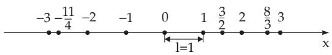
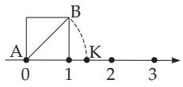

#### 1.1.1 Numbers

##### 1.1.1.1 Natural, Integer, and Rational Numbers

1. Definitions and Notation

The positive and negative integers, fractions, and zero together are called the rational numbers. In relation to these the following notations are used (see 5.2.1, 1., p. 327):

Set of natural numbers:

$$
\mathrm { N = \{ 0 , 1 , 2 , 3 , . . . \} , }
$$

Set of integers:

$$
\mathbb { Z } = \{ \dots , - 2 , - 1 , 0 , 1 , 2 , \dots \} ,
$$

Set of rational numbers:

$\mathbb { Q } = \left\{ x | x = { \frac { p } { q } } \right.$ with $p \in \mathbb { Z } , q \in \mathbb { Z }$ and $q \neq 0 \}$

The notion of natural numbers arose from enumeration and ordering. The natural numbers are also called the non-negative integers.

2. Properties of the Set of Rational Numbers

The set of rational numbers is infinite.

• The set is ordered, i.e., for any two diferent given numbers a and b one can tell which is the smaller one.

The set is dense everywhere, i.e., between any two diferent rational numbers a and $b ( a < b )$ there is at least one rational number c $( a < c < b )$ . Consequently, there is an infinite number of other rational numbers between any two diferent rational numbers.

3. Arithmetical Operations

The arithmetical operations (addition, subtraction, multiplication and division) can be performed with any two rational numbers, and the result is a rational number. The only exception is division by zero, which is not possible: The operation written in the form $a : 0$ is meaningless because it does not have any result: If a $\neq 0$ , then there is no rational number b such that $b \cdot 0 = a$ could be fulfilled, and if $a = 0$ then b can be any of the rational numbers. The frequently occurring formula $a : 0 = \infty$ (infinity) does not mean that the division is possible; it is only the notation for the statement: If the denominator approaches zero and, e.g., the numerator does not, then the absolute value (magnitude) of the quotient exceeds any finite limit.

4. Decimal Fractions, Continued Fractions

Every rational number a can be represented as a terminating or periodically infinite decimal fraction or as a finite continued fraction (see 1.1.1.4, p. 3).

5. Geometric Representation

Fixing an origin the zero point 0, a positive direction the orientation, and the unit of length l the measuring rule, (see also 2.17.1, p. 115 and (Fig. 1.1)), then every rational number a corresponds to a certain point on this line. This point has the coordinate a, and it is a so-called rational point. The line is called the numerical axis. Because the set of rational numbers is dense everywhere, between two rational points there are infinitely many further rational points.

  
Figure 1.1

  
Figure 1.2

##### 1.1.1.2 Irrational and Transcendental Numbers

The set of rational numbers is not satisfactory for calculus. Even though it is dense everywhere, it does not cover the whole numerical axis. If for example the diagonal AB of the unit square rotates around A so that B goes into the point K, then K does not have any rational coordinate (Fig. 1.2).

The introduction of irrational numbers allows to assign a number to every point of the numerical axis. In textbooks there are given exact definitions for irrational numbers, e.g., by nests of intervals. For this survey it is enough to note that the irrational numbers take all the non-rational points of the numerical axis and every irrational number corresponds to a point of the axis, and that every irrational number can be represented as a non-periodic infinite decimal fraction.

First of all, the non-integer real roots of the algebraic equation

$$
x ^ { n } + a _ { n - 1 } x ^ { n - 1 } + \cdot \cdot \cdot + a _ { 1 } x + a _ { 0 } = 0 \quad ( n > 1 , { \mathrm { i n t e g e r ; i n t e g e r ~ c o e f f i c i e n t s } } ) ,\tag{1.1a}
$$

belong to the irrational numbers. These roots are called algebraic irrationals.

A: The simplest examples of algebraic irrationals are the real roots of $x ^ { n } - a \ = \ 0 \ ( a \ > \ 0 )$ , as numbers of the form $\sqrt [ n ] { a }$ , if they are not rational.

B: $\sqrt [ 2 ] { 2 } = 1 . 4 1 4 \ldots , \sqrt [ 3 ] { 1 0 } = 2 . 1 5 4 \ldots$ . are algebraic irrationals.

The irrational numbers which are not algebraic irrationals are called transcendental.

A: $\pi = 3 . 1 4 1 5 9 2 \ldots { } e = 2 . 7 1 8 2 8 1 . . \nonumber$ . are transcendental numbers.

B: The decimal logarithm of the integers, except the numbers of the form $1 0 ^ { n }$ , are transcendental. The non-integer roots of the quadratic equation

$$
x ^ { 2 } + a _ { 1 } x + a _ { 0 } = 0 \quad ( a _ { 1 } , a _ { 0 } { \mathrm { ~ i n t e g e r s } } )\tag{1.1b}
$$

are called quadratic irrationals. They have the form $( a + b { \sqrt { D } } ) / c \quad ( a , b , c$ integers, $c \neq 0 ; D > 0$ square-free number).

The division of a line segment a in the ratio of the golden section $x / a = ( a - x ) / x$ (see 3.5.2.3, 3., p. 194) leads to the quadratic equation $x ^ { 2 } + x - 1 = 0 , { \mathrm { i f ~ } } a = 1$ . The solution $x = ( \sqrt { 5 } - 1 ) / 2$ is a quadratic irrational. It contains the irrational number $\sqrt { 5 }$

##### 1.1.1.3 Real Numbers

Rational and irrational numbers together form the set ofreal numbers, which is denoted by IR.

1. Most Important Properties

The set of real numbers has the following important properties (see also 1.1.1.1, 2., p. 1). It is: Infinite.

Ordered.

Dense everywhere.

Closed, i.e., every point of the numerical axis corresponds to a real number. This statement does not hold for the rational numbers.

2. Arithmetical Operations

Arithmetical operations can be performed with any two real numbers and the result is a real number, too. The only exception is division by zero (see 1.1.1.1, 3., p. 1). Raising to a power and also its inverse operation can be performed among real numbers; so it is possible to take an arbitrary root of any positive number; every positive real number has a logarithm for an arbitrary positive basis, except that 1 cannot be a basis.

A further generalization of the notion of numbers leads us to the concept of complex numbers (see 1.5, p. 34).

3. Interval of Numbers

A connected set of real numbers with endpoints a and b is called an interval ofnumbers with endpoints a and $b ,$ where $a < b$ and a is allowed to be and b is allowed to be + . If the endpoint itself does not belong to the interval, then this end of the interval is open, in the opposite case it is closed.

An interval is given by its endpoints a and b, putting them in braces: A bracket for a closed end of the interval and a parenthesis for an open one. It is to be distinguished between open intervals $( a , b )$ , halfopen (half-closed) intervals $[ a , b )$ or $( a , b ]$ and closed intervals $[ a , b ]$ , according to whether none of the endpoints, one of the endpoints or both endpoints belong to it, respectively. Frequently the notation $] a , b [$ instead of $( a , b )$ for open intervals, and analogously $[ a , b [$ instead of $[ \check { a } , b )$ is used. In the case of graphical representations, in this book the open end of the interval is denoted by a round arrow head, the closed one by a filled point.

##### 1.1.1.4 Continued Fractions

Continued fractions are nested fractions, by which rational and irrational numbers can be represented and approximated even better than by decimal representation (see 19.8.1.1, p. 1002 and A and B on p. 4).

1. Rational Numbers

The continued fraction of a rational number is finite. Positive rational numbers which are greater than 1 have the form (1.2). For abbreviation the symbol $\frac { p } { q } = [ a _ { 0 } ; a _ { 1 } , a _ { 2 } , \ldots , a _ { n } ]$ is used with $a _ { k } \geq 1 ( k = 1 , 2 , \ldots , n ) .$

$$
\frac { p } { q } = a _ { 0 } + \frac { 1 } { a _ { 1 } + \displaystyle \frac { 1 } { a _ { 2 } + \displaystyle \frac { 1 } { \ddots + \displaystyle \frac { 1 } { a _ { n - 1 } + \displaystyle \frac { 1 } { a _ { n } } } } } } .\tag{1.2}
$$

The numbers $a _ { k }$ are calculated with the help of the Euclidean algorithm:

$$
\frac { p } { q } = a _ { 0 } + \frac { r _ { 1 } } { q } \left( 0 < \frac { r _ { 1 } } { q } < 1 \right) ,\tag{1.3a}
$$

$$
\frac { q } { r _ { 1 } } = a _ { 1 } + \frac { r _ { 2 } } { r _ { 1 } } \left( 0 < \frac { r _ { 2 } } { r _ { 1 } } < 1 \right) ,\tag{1.3b}
$$

$$
\frac { r _ { 1 } } { r _ { 2 } } = a _ { 2 } + \frac { r _ { 3 } } { r _ { 2 } } \left( 0 < \frac { r _ { 3 } } { r _ { 2 } } < 1 \right) ,\tag{1.3c}
$$

$$
 \vdots \vdots
$$

$$
\frac { r _ { n - 2 } } { r _ { n - 1 } } = a _ { n - 1 } + \frac { r _ { n } } { r _ { n - 1 } } \left( 0 < \frac { r _ { n } } { r _ { n - 1 } } < 1 \right) ,\tag{1.3d}
$$

$$
{ \frac { r _ { n - 1 } } { r _ { n } } } = a _ { n } \ \left( r _ { n + 1 } = 0 \right) .\tag{1.3e}
$$

$$
{ \frac { 6 1 } { 2 7 } } = 2 + { \frac { 7 } { 2 7 } } = 2 + { \frac { 1 } { 3 + { \frac { 6 } { 7 } } } } = 2 + { \frac { 1 } { 3 + { \frac { 1 } { 1 + { \frac { 1 } { 6 } } } } } } = [ 2 ; 3 , 1 , 6 ] .
$$

2. Irrational Numbers

Continued fractions of irrational numbers do not break of. They are called infinite continued fractions with $[ a _ { 0 } ; a _ { 1 } , a _ { 2 } , \ldots ]$

If some numbers $a _ { k }$ are repeated in an infinite continued fraction, then this fraction is called a periodic continued fraction or recurring chain fraction. Every periodic continued fraction represents a quadratic irrationality, and conversely, every quadratic irrationality has a representation in the form of a periodic continued fraction.

The number ${ \sqrt { 2 } } = 1 . 4 1 4 2 1 3 5 \ldots$ . is a quadratic irrationality and it has the periodic continued fraction representation $\sqrt { 2 } = [ 1 ; 2 , 2 , 2 , . . . ]$

3. Aproximation of Real Numbers

If $\alpha = [ a _ { 0 } ; a _ { 1 } , a _ { 2 } , . . . ]$ is an arbitrary real number, then every finite continued fraction

$$
\alpha _ { k } = [ a _ { 0 } ; a _ { 1 } , a _ { 2 } , \ldots , a _ { k } ] = { \frac { p } { q } }\tag{1.4}
$$

represents an approximation of $\alpha$ . The continued fraction $\alpha _ { k }$ is called the k-th approximant of $\alpha$ . It can be calculated by the recursive formula

$$
\alpha _ { k } = \frac { p _ { k } } { q _ { k } } = \frac { a _ { k } p _ { k - 1 } + p _ { k - 2 } } { a _ { k } q _ { k - 1 } + q _ { k - 2 } } \quad ( k \ge 1 ; ~ p _ { - 1 } = 1 , p _ { 0 } = a _ { 0 } ; q _ { - 1 } = 0 , q _ { 0 } = 1 ) .\tag{1.5}
$$

According to the Liouville approximation theorem, the following estimat holds:

$$
| \alpha - \alpha _ { k } | = | \alpha - \frac { p _ { k } } { q _ { k } } | < \frac { 1 } { q _ { k } ^ { 2 } } .\tag{1.6}
$$

Furthermore, it can be shown that the approximants approach the real number α with increasing accuracy alternatively from above and from below. The approximants converge to α especially fast if the numbers $a _ { i } \ ( i = 1 , 2 , \ldots , k )$ in (1.4) have large values. Consequently, the convergence is worst for the numbers [1; 1, 1, . . .].

A: From the decimal presentation of π the continued fraction representation $\pi = [ 3 ; 7 , 1 5 , 1 , 2 9 2 , . . . ]$ follows with the help of (1.3a)–(1.3e). The corresponding approximants (1.5) with the estimate according to (1.6) are: $\alpha _ { 1 } = \frac { 2 2 } { 7 }$ with $| \pi - \alpha _ { 1 } | < { \frac { 1 } { 7 ^ { 2 } } } \approx 2 \cdot 1 0 ^ { - 2 } , \alpha _ { 2 } = { \frac { 3 3 3 } { 1 0 6 } }$ with $| \pi - \alpha _ { 2 } | < \frac { 1 } { 1 0 6 ^ { 2 } } \approx 9 \cdot 1 0 ^ { - 5 }$ $\alpha _ { 3 } = \frac { 3 5 5 } { 1 1 3 }$ with $| \pi - \alpha _ { 3 } | < \frac { 1 } { 1 1 3 ^ { 2 } } \approx 8 \cdot 1 0 ^ { - 5 }$ . The actual errors are much smaller. They are less than $1 . 3 \cdot 1 0 ^ { - 3 } \mathrm { f o r } \alpha _ { 1 } , 8 . 4 \cdot 1 0 ^ { - 5 }$ for $\alpha _ { 2 }$ and $2 . 7 \cdot 1 0 ^ { - 7 }$ for $\alpha _ { 3 }$ . The approximants $\alpha _ { 1 } , \alpha _ { 2 }$ and $\alpha _ { 3 }$ represent better approximations for π than the decimal representation with the corresponding number of digits.

B: The formula of the golden section $x / a = ( a - x ) / x$ (see 1.1.1.2, p. 2, 3.5.2.3, 3., p. 194 and 17.3.2.4, 4., p. 908) can be represented by the following two continued fractions: $x = a [ 1 ; 1 , 1 , . . . ]$ and $x = { \frac { a } { 2 } } ( 1 + { \sqrt { 5 } } ) = { \frac { a } { 2 } } ( 1 + [ 2 ; 4 , 4 , 4 , . . . ] )$ . The approximant $\alpha _ { 4 }$ delivers in the first case an accuracy of 0.018 a, in the second case of 0.000 001 a.

##### 1.1.1.5 Commensurability

Two numbers a and b are called commensurable, i.e., measurable by the same number, if both are an integer multiple of a third number c. From $a = m c , \ b = n c \ ( m , n \in \mathbb { Z } )$ it follows that

$$
{ \frac { a } { b } } = x \ ( x \mathrm { r a t i o n a l } ) .\tag{1.7}
$$

Otherwise a and b are incommensurable.

A: The length of a side and a diagonal of a square are incommensurable because their ratio is the irrational number $\sqrt { 2 }$

B: The lengths of the golden section are incommensurable, because their ratio contains the irrational number $\sqrt { 5 }$ (see 1.1.1.2, p. 2 and 3.5.2.3, 3.,p. 194). Therefore the sides and diagonals in a regular pentagon are incommensurable (see in 3.1.5.3, p. 139). Today Hippasos from Metapontum (450 BC) is considered to have discovered the irrational numbers via this example.
