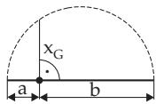
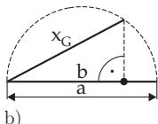

### 1.2 Finite Series

#### 1.2.1 Definition of a Finite Series

The sum

$$
s _ { n } = a _ { 0 } + a _ { 1 } + a _ { 2 } + \cdot \cdot \cdot + a _ { n } = \sum _ { i = 0 } ^ { n } a _ { i } ,\tag{1.51}
$$

is called a finite series. The summands $a _ { i } \ ( i = 0 , 1 , 2 , \ldots , n )$ are given by certain formulas, they are numbers, and they are the terms ofthe series.

#### 1.2.2 Arithmetic Series

1. Arithmetic Series of First Order

is a finite series where the terms form an arithmetic sequence, i.e., the diference of two terms standing after each other is a constant:

$$
\Delta a _ { i } = a _ { i + 1 } - a _ { i } = d = \mathrm { c o n s t } \quad \mathrm { h o l d s } , \quad \mathrm { s o } \quad a _ { i } = a _ { 0 } + i d .\tag{1.52a}
$$

Thus holds:

$$
s _ { n } = a _ { 0 } + ( a _ { 0 } + d ) + ( a _ { 0 } + 2 d ) + \cdot \cdot \cdot + ( a _ { 0 } + n d )\tag{1.52b}
$$

$$
s _ { n } = { \frac { a _ { 0 } + a _ { n } } { 2 } } ( n + 1 ) = { \frac { n + 1 } { 2 } } ( 2 a _ { 0 } + n d ) .\tag{1.52c}
$$

2. Arithmetic Series of k-th Order

is a finite series, where the k-th diferences $\Delta ^ { k } a _ { i }$ of the sequence $a _ { 0 } , a _ { 1 } , a _ { 2 } , \ldots , a _ { n }$ are constants. The diferences of higher order are calculated by the formula

$$
\Delta ^ { \nu } a _ { i } = \Delta ^ { \nu - 1 } a _ { i + 1 } - \Delta ^ { \nu - 1 } a _ { i } \quad ( \nu = 2 , 3 , \ldots , k ) .\tag{1.53a}
$$

It is convenient to calculate them from the diference schema (also diference table or triangle schema):

$$
\begin{array}{c} \begin{array} { r l } & { \begin{array} { l l l l l l } { a _ { 0 } } & & & & & \\ { 0 } & { \Delta a _ { 0 } } & & & & \\ & { \Delta a _ { 1 } } & & & { \Delta ^ { 2 } a _ { 0 } } & & & \\ { a _ { 2 } } & & { \Delta ^ { 2 } a _ { 1 } } & & & & \\ { \Delta a _ { 2 } } & & { \Delta ^ { 2 } a _ { 1 } } & & & & \\ { a _ { 3 } } & & { \Delta ^ { 2 } a _ { 2 } } & & & & \\ { \vdots } & & & { \vdots } & & { \ddots } & & \\ { \vdots } & & & { \vdots } & & & \\ { \vdots } & & & { \vdots } & & & \\ & & & { \vdots } & & & \\ & & & & { \Delta ^ { 2 } a _ { n - 2 } } & & \end{array} \begin{array} { l } { \Delta ^ { n } a _ { 1 } } \\ { \ddots } \\ { \Delta ^ { k } a _ { 0 } } \end{array} } \\ & & { } & & & { } \end{array}  \\ & { \begin{array} { r } { a _ { n } } \end{array} } \\ & { \begin{array} { r } { a _ { n - 1 } } \\ { a _ { n - 2 } } \end{array} } \\ & { \begin{array} { r } { a _ { n } } \end{array} } \end{array}\tag{1.53b}
$$

The following formulas hold for the terms and the sum:

$$
a _ { i } = a _ { 0 } + { \binom { i } { 1 } } \Delta a _ { 0 } + { \binom { i } { 2 } } \Delta ^ { 2 } a _ { 0 } + \cdots + { \binom { i } { k } } \Delta ^ { k } a _ { 0 } \quad ( i = 1 , 2 , \ldots , n ) ,\tag{1.53c}
$$

$$
s _ { n } = { \binom { n + 1 } { 1 } } a _ { 0 } + { \binom { n + 1 } { 2 } } \Delta a _ { 0 } + { \binom { n + 1 } { 3 } } \Delta ^ { 2 } a _ { 0 } + \cdot \cdot \cdot + { \binom { n + 1 } { k + 1 } } \Delta ^ { k } a _ { 0 } .\tag{1.53d}
$$

#### 1.2.3 Geometric Series

The sum (1.51) is called a geometric series, if the terms form a geometric sequence, i.e., the ratio of two successive terms is a constant:

$$
{ \frac { a _ { i + 1 } } { a _ { i } } } = q = \mathrm { { c o n s t } } \quad { \mathrm { h o l d s , } } \quad { \mathrm { s o } } \quad a _ { i } = a _ { 0 } q ^ { i } .\tag{1.54a}
$$

Thus holds:

$$
s _ { n } = a _ { 0 } + a _ { 0 } q + a _ { 0 } q ^ { 2 } + \cdots + a _ { 0 } q ^ { n } = a _ { 0 } { \frac { q ^ { n + 1 } - 1 } { q - 1 } } \quad { \mathrm { f o r } } \quad q \neq 1 ,\tag{1.54b}
$$

$$
s _ { n } = ( n + 1 ) a _ { 0 } \quad \mathrm { f o r } \quad q = 1 .\tag{1.54c}
$$

For $n  \infty \ ( \mathrm { s e e } \ 7 . 2 . 1 . 1 , 2 . , \mathrm { p . } \ 4 5 9 )$ , there is an infinite geometric series, which has a limit if $| q | < 1$ and this limit is called sum s

$$
s = \frac { a _ { 0 } } { 1 - q } .\tag{1.54d}
$$

#### 1.2.4 Special Finite Series

$$
1 + 2 + 3 + \cdots + ( n - 1 ) + n = { \frac { n ( n + 1 ) } { 2 } } ,\tag{1.55}
$$

$$
p + ( p + 1 ) + ( p + 2 ) + \cdots + ( p + n ) = { \frac { ( n + 1 ) ( 2 p + n ) } { 2 } } ,\tag{1.56}
$$

$$
1 + 3 + 5 + \cdots + ( 2 n - 3 ) + ( 2 n - 1 ) = n ^ { 2 } ,\tag{1.57}
$$

$$
2 + 4 + 6 + \cdot \cdot \cdot + ( 2 n - 2 ) + 2 n = n ( n + 1 ) ,\tag{1.58}
$$

$$
1 ^ { 2 } + 2 ^ { 2 } + 3 ^ { 2 } + \cdots + ( n - 1 ) ^ { 2 } + n ^ { 2 } = { \frac { n ( n + 1 ) ( 2 n + 1 ) } { 6 } } ,\tag{1.59}
$$

$$
1 ^ { 3 } + 2 ^ { 3 } + 3 ^ { 3 } + \cdots + ( n - 1 ) ^ { 3 } + n ^ { 3 } = { \frac { n ^ { 2 } ( n + 1 ) ^ { 2 } } { 4 } } ,\tag{1.60}
$$

$$
1 ^ { 2 } + 3 ^ { 2 } + 5 ^ { 2 } + \cdots + ( 2 n - 1 ) ^ { 2 } = { \frac { n ( 4 n ^ { 2 } - 1 ) } { 3 } } ,\tag{1.61}
$$

$$
1 ^ { 3 } + 3 ^ { 3 } + 5 ^ { 3 } + \dots + ( 2 n - 1 ) ^ { 3 } = n ^ { 2 } ( 2 n ^ { 2 } - 1 ) ,\tag{1.62}
$$

$$
1 ^ { 4 } + 2 ^ { 4 } + 3 ^ { 4 } + \cdots + n ^ { 4 } = { \frac { n ( n + 1 ) ( 2 n + 1 ) ( 3 n ^ { 2 } + 3 n - 1 ) } { 3 0 } } ,\tag{1.63}
$$

$$
1 + 2 x + 3 x ^ { 2 } + \cdot \cdot \cdot + n x ^ { n - 1 } = { \frac { 1 - ( n + 1 ) x ^ { n } + n x ^ { n + 1 } } { ( 1 - x ) ^ { 2 } } } \ ( x \neq 1 ) .\tag{1.64}
$$

#### 1.2.5 Mean Values

(See also 16.3.4.1, 1., p. 839 and 16.4, p. 848)

##### 1.2.5.1 Arithmetic Mean or Arithmetic Average

The arithmetic mean of the n quantities $a _ { 1 } , a _ { 2 } , \ldots , a _ { n }$ is the expression

$$
x _ { A } = { \frac { a _ { 1 } + a _ { 2 } + \cdots + a _ { n } } { n } } = { \frac { 1 } { n } } \sum _ { k = 1 } ^ { n } a _ { k } .\tag{1.65a}
$$

For two values a and b holds:

$$
x _ { A } = { \frac { a + b } { 2 } } .\tag{1.65b}
$$

The values $a , x _ { A }$ and b form an arithmetic sequence.

##### 1.2.5.2 Geometric Mean or Geometric Average

The geometric mean of n positive quantities $a _ { 1 } , a _ { 2 } , \ldots , a _ { n }$ is the expression

$$
x _ { G } = { \sqrt [ n ] { a _ { 1 } a _ { 2 } \ldots a _ { n } } } = { \biggl ( } \prod _ { k = 1 } ^ { n } a _ { k } { \biggr ) } ^ { \frac { 1 } { n } } .\tag{1.66a}
$$

For two positive values a and b holds

$$
x _ { G } = { \sqrt { a b } } .
$$

(1.66b)

a)

  
b)  
Figure 1.3

The values $a \mathrm { ~ , ~ } x _ { G }$ and b form a geometric sequence. If a and b are given line segments, then a segment with length $x _ { G } = { \sqrt { a b } }$ can be given by the help of one of the constructions shown in Fig. 1.3a or in Fig. 1.3b.

A special case of the geometric mean is given by dividing a line segment according to the golden section (see 3.5.2.3, 3., p. 194).

##### 1.2.5.3 Harmonic Mean

The harmonic mean of n quantities $a _ { 1 } , a _ { 2 } , \dotsc , a _ { n } \ ( a _ { i } \neq 0 ; i = 1 , 2 , \dotsc , n )$ is the expression

$$
x _ { H } = \Big [ \frac { 1 } { n } \big ( \frac { 1 } { a _ { 1 } } + \frac { 1 } { a _ { 2 } } + \cdots + \frac { 1 } { a _ { n } } \big ) \Big ] ^ { - 1 } = \Big [ \frac { 1 } { n } \sum _ { k = 1 } ^ { n } \frac { 1 } { a _ { k } } \Big ] ^ { - 1 } .\tag{1.67a}
$$

For two values a and b holds

$$
x _ { H } = \biggl [ \frac { 1 } { 2 } \biggl ( \frac { 1 } { a } + \frac { 1 } { b } \biggr ) \biggr ] ^ { - 1 } , ~ x _ { H } = \frac { 2 a b } { a + b } .\tag{1.67b}
$$

##### 1.2.5.4 Quadratic Mean

The quadratic mean of n quantities $a _ { 1 } , a _ { 2 } , \ldots , a _ { n }$ is the expression

$$
x _ { Q } = { \sqrt { { \frac { 1 } { n } } ( a _ { 1 } { } ^ { 2 } + a _ { 2 } { } ^ { 2 } + \cdots + a _ { n } { } ^ { 2 } ) } } = { \sqrt { { \frac { 1 } { n } } \sum _ { k = 1 } ^ { n } a _ { k } ^ { 2 } } } .\tag{1.68a}
$$

For two values a and b holds

$$
x _ { Q } = \sqrt { \frac { a ^ { 2 } + b ^ { 2 } } { 2 } } .\tag{1.68b}
$$

The quadratic mean is important in the theory of observational error (see 16.4, p. 848).

##### 1.2.5.5 Relations Between the Means of Two Positive Values

For $x _ { A } = \frac { a + b } { 2 } , x _ { G } = \sqrt { a b } , x _ { H } = \frac { 2 a b } { a + b } , x _ { Q } = \sqrt { \frac { a ^ { 2 } + b ^ { 2 } } { 2 } }$ we have

1. if $a < b ,$ , then

$$
a < x _ { H } < x _ { G } < x _ { A } < x _ { Q } < b ,\tag{1.69a}
$$

2. if ${ \bf { a } } = { \bf { b } } ,$ , then

$$
a = x _ { A } = x _ { G } = x _ { H } = x _ { Q } = b .\tag{1.69b}
$$
