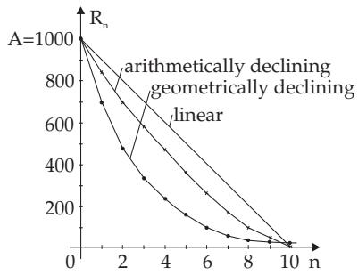

### 1.3 Business Mathematics

Business calculations are based on the use of arithmetic and geometric series, on formulas (1.52a)– (1.52c) and (1.54a)–(1.54d). However these applications in banking are so varied and special that a special discipline has developed using specific terminology. So business arithmetic is not confined only to the calculation of the principal by compound interest or the calculation of annuities. It also includes the calculation of interest, repayments, amortization, calculation of instalment payments, annuities, depreciation, efective interest yield and the yield on investment. Basic concepts and formulas for calculations are discussed below. For studying financial mathematics in detail, you will have to consult the relevant literature on the subject (see [1.2], [1.8]).

Insurance mathematics and risk theory use the methods of probability theory and mathematical statistics, and they represent a separate discipline, so they don’t be discussed here (see [1.4], [1.5]).

#### 1.3.1 Calculation of Interest orPercentage

##### 1.3.1.1 Percentage or Interest

The expression p percent of K means $\frac { p } { 1 0 0 } K$ , where K denotes the principal in business mathematics. The symbol for percent is %, i.e., the following equalities hold:

$$
p \% = \frac { p } { 1 0 0 } \qquad \mathrm { o r } \qquad 1 \% = 0 . 0 1 .\tag{1.70}
$$

##### 1.3.1.2 Increment

If K is raised by $p \%$ , the increased value is

$$
{ \tilde { K } } = K \left( 1 + { \frac { p } { 1 0 0 } } \right) .\tag{1.71}
$$

Relating the increment $K { \frac { p } { 1 0 0 } }$ to the new value $\tilde { K }$ , the proportion is $K \frac { p } { 1 0 0 } : \tilde { K } = \tilde { p } : 1 0 0$ , so $\tilde { K }$ contains

$$
\tilde { p } = \frac { p \cdot 1 0 0 } { 1 0 0 + p }\tag{1.72}
$$

percent of increment.

If an article has a value of e 200 and a 15% extra charge is added, the final value is e 230. This price contains $\tilde { p } = \frac { 1 5 \cdot 1 0 0 } { 1 1 5 } = 1 3 . 0 4 $ percent increment for the user.

##### 1.3.1.3 Discount or Reduction

Reducing the value K by p% rebate yields the reduced value

$$
{ \tilde { K } } = K \left( 1 - { \frac { p } { 1 0 0 } } \right) .\tag{1.73}
$$

Comparing the reduction $K { \frac { p } { 1 0 0 } }$ to the new value $\tilde { K }$ gives

$$
\tilde { p } = \frac { p \cdot 1 0 0 } { 1 0 0 - p }\tag{1.74}
$$

percent of rebate.

If an article has a value e 300, and they give a 10% discount, it will be sold for e 270. This price contains $\tilde { p } = \frac { 1 0 \cdot 1 0 0 } { 9 0 } = 1 1 . 1 1$ percent rebate for the buyer.

#### 1.3.2 Calculation of Compound Interest

##### 1.3.2.1 Interest

Interest is either payment for the use of a loan or it is a revenue realized from a receivable. For a principal K, placed for a whole period ofinterest (usually one year),

$$
K { \frac { p } { 1 0 0 } }\tag{1.75}
$$

interest is paid at the end of the period of interest. Here p is the rate ofinterest for the period ofinterest, and one says that $p \%$ interest is paid for the principal K.

##### 1.3.2.2 Compound Interest

Compound interest is computed on the principal and on any interest earned that has not been paid or withdrawn. It is the return on the principal for two or more time periods. The interest of the principal increased by interest is called compound interest.

In the following diferent cases are discussed which depend on how the principal is changing.

1. Single Deposit

Compounded annually the principal K increases after n years up to the final value $K _ { n }$ . At the end of the n-th year this value is:

$$
K _ { n } = K \left( 1 + { \frac { p } { 1 0 0 } } \right) ^ { n } .\tag{1.76}
$$

For a briefer notation the substitution $1 + { \frac { p } { 1 0 0 } } = q$ is used and q is called the accumulation factor or growth factor.

Interest may be compounded for any period of time: annually, half-annually, monthly, daily, and so on. Dividing the year into m equal interest periods the interest will be added to the principal K at the end of every period. Then the interest is $K \frac { p } { 1 0 0 m }$ for one interest period, and the principal increases after n years with m interest periods up to the value

$$
K _ { m \cdot n } = K \left( 1 + \frac { p } { 1 0 0 m } \right) ^ { m \cdot n } .\tag{1.77}
$$

The quantity $\left( 1 + { \frac { p } { 1 0 0 } } \right)$ is known as the nominal rate, and $\left( 1 + { \frac { p } { 1 0 0 m } } \right) ^ { m }$ as the efective rate.

A principal of e 5000, with a nominal interest 7.2% annually, increases within 6 years a) compounded annually to $K _ { 6 } = 5 0 0 0 ( 1 + 0 . 0 7 2 ) ^ { 6 } = \in { \mathrm { 7 5 8 8 . 2 0 , b } }$ compounded monthly to $\dot { K } _ { 7 2 } = 5 0 0 0 ( 1 +$ $\mathsf { \bar { 0 } . 0 7 2 } / 1 2 ) ^ { 7 2 } = \mathsf { \in } 7 6 9 1 . 7 4$

2. Regular Deposits

Suppose depositing the same amount E in equal intervals. Such an interval must be equal to an interest period. The depositions can be made at the beginning of the interval, or at the end of the interval. At the end of the n-th interest period the balance $K _ { n }$ is

a) Depositing at the Beginning:

b) Depositing at the End:

$$
K _ { n } = E q \frac { q ^ { n } - 1 } { q - 1 } .\tag{1.78a}
$$

$$
K _ { n } = E { \frac { q ^ { n } - 1 } { q - 1 } } .\tag{1.78b}
$$

3. Depositing in the Course of the Year

A year or an interest period is divided into m equal parts. At the beginning or at the end of each of these time periods the same amount E is deposited and bears interest until the end of the year. In this way, after one year the balance $K _ { 1 }$ is

a) Depositing at the Beginning:

b) Depositing at the End:

$$
K _ { 1 } = E \left[ m + \frac { ( m + 1 ) p } { 2 0 0 } \right] .
$$

$$
K _ { 1 } = E \left[ m + \frac { ( m - 1 ) p } { 2 0 0 } \right] .\tag{1.79b}
$$

In the second year the total $K _ { 1 }$ bears interest, and further deposits and interests are added like in the first year, so after n years the balance $K _ { n }$ for midterm deposits and yearly interest payment is:

a) Depositing at the Beginning:

b) Depositing at the End:

$$
K _ { n } = E \left[ m + { \frac { ( m + 1 ) p } { 2 0 0 } } \right] { \frac { q ^ { n } - 1 } { q - 1 } } . \left( 1 . 8 0 { \mathrm { a } } \right) \qquad K _ { n } = E \left[ m + { \frac { ( m - 1 ) p } { 2 0 0 } } \right] { \frac { q ^ { n } - 1 } { q - 1 } } .\tag{1.80b}
$$

At a yearly rate of interest $p = 5 . 2 \%$ a depositor deposits e 1000 at the end of every month. After how many years will it reach the balance e 500 000?

From (1.80b), for instance, from 50 $0 0 0 0 = 1 0 0 0 \left[ 1 2 + { \frac { 1 1 \cdot 5 . 2 } { 2 0 0 } } \right] \cdot { \frac { 1 . 0 5 2 ^ { n } - 1 } { 0 . 0 5 2 } }$ , follows the answer, $n =$ 22.42 years.

#### 1.3.3 Amortization Calculus

##### 1.3.3.1 Amortization

Amortization is the repayment of credits. The assumptions:

1. For a debt S the debtor is charged at p% interest at the end of an interest period.

2. After N interest period the debt is completely repaid.

The charge of the debtor consists of interest and principal repayment for every interest period. If the interest period is one year, the amount to be paid during the whole year is called an annuity.

There are diferent possibilities for a debtor. For instance, the repayments can be made at the interest date, or meanwhile; the amount of repayment can be diferent time by time, or it can be constant during the whole term.

##### 1.3.3.2 Equal Principal Repayments

The amortization instalments are paid during the year, but no midterm compound interest is calculated. The following notation should be used:

S debt (interest payment at the end of a period with $p \% )$

$T = { \frac { S } { m N } }$ principal repayment $( T = \mathrm { c o n s t } )$

m number of repayments during one interest period,

N number of interest periods until the debt is fully repaid.

Besides the principal repayments the debtor also has to pay the interest charges:

a) Interest $Z _ { n }$ for the n-th Interest Period:

b) Total Interest $z$ to be Paid for a Debt S, mN Times, During N Interest Periods with an Interest Rate $p \%$ :

$$
Z _ { n } = \frac { p S } { 1 0 0 } \left[ 1 - \frac { 1 } { N } \left( n - \frac { m + 1 } { 2 m } \right) \right] . \mathrm { ( 1 . 8 1 a ) }
$$

$$
Z = \sum _ { n = 1 } ^ { N } Z _ { n } = \frac { p S } { 1 0 0 } \left[ \frac { N - 1 } { 2 } + \frac { m + 1 } { 2 m } \right] .\tag{1.81b}
$$

A debt of e 60 000 has a yearly interest rate of 8%. The prin- 1. year: $Z _ { 1 } = \mathrm { ~ \ t ~ { ~ \in ~ 4 3 6 0 } ~ }$ cipal repayment of e 1000 for 60 months should be paid at the 2. year: $Z _ { 2 } = \mathrm { ~ \ t e 3 4 0 0 ~ }$ end of the months. How much is the actual interest at the end of 3. year: $Z _ { 3 } = \mathbf { \varepsilon } \in 2 4 4 0$ each year? The interest for every year is calculated by (1.81a) with 4. year: $Z _ { 4 } = \mathrm { ~ \ t e _ { 1 4 8 0 } }$ $S = \mathop { \mathrm { 6 0 0 0 0 } } , p = 8$ , N = 5 and $m = 1 2$ . They are enumerated in 5. year: $Z _ { 5 } = \begin{array} { c c } { { \notin } } \end{array} 5 2 0$ the annexed table. Z = e 12200

The total interest can be calculated also by (1.81b) as $Z = { \frac { 8 \cdot 6 0 0 0 0 } { 1 0 0 } } \left[ { \frac { 5 - 1 } { 2 } } + { \frac { 1 3 } { 2 4 } } \right] = \in 1 2 2 0 0 .$

##### 1.3.3.3 Equal Annuities

For equal principal repayments $T = { \frac { S } { m N } }$ the interest payable decreases over the course of time (see the previous example). In contrast to this, in the case of equal annuities the same amount is repaid for every interest period. A constant annuity A containing the principal repayment and the interest is repaid, i.e., the charge of the debtor is constant during the whole period of repayment.

S debt (interest payment of $p \%$ at the end of a period),

A annuity for every interest period (A const),

a one instalment paid m times per interest period (a const),

$\bullet q = 1 + { \frac { p } { 1 0 0 } }$ the accumulation factor,

after n interest periods the remaining outstanding debt $S _ { n }$ is:

$$
S _ { n } = S q ^ { n } - a \left[ m + \frac { ( m - 1 ) p } { 2 0 0 } \right] \frac { q ^ { n } - 1 } { q - 1 } .\tag{1.82}
$$

Here the term $S q ^ { n }$ denotes the value of the debt S after n interest periods with compound interest (see (1.76)). The second term in (1.82) gives the value of the midterm repayments a with compound interest (see (1.80b) with $E = a )$ . For the annuity holds

$$
A = a \left[ m + \frac { ( m - 1 ) p } { 2 0 0 } \right] .\tag{1.83}
$$

Here paying A once means the same as paying a m times. From (1.83) it follows that $A \geq m a$ . Because after N interest periods the debt must be completely repaid, from (1.82) for $S _ { N } = 0$ considering (1.83) for the annuity holds:

$$
{ \cal A } = { \cal S } q ^ { N } \frac { q - 1 } { q ^ { N } - 1 } = { \cal S } \frac { q - 1 } { 1 - q ^ { - N } } .\tag{1.84}
$$

To solve a problem of business mathematics, from (1.84), any of the quantities $A , S , q$ or N can be expressed, if the others are known.

A: A loan $\mathrm { o f } \in 6 0 0 0 0$ bears 8% interest per year, and is to be repaid over 5 years in equal instalments. How much is the yearly annuity A and the monthly instalment a? From (1.84) and (1.83) we get:

$$
A = 6 0 0 0 0 { \frac { 0 . 0 8 } { 1 - { \frac { 1 } { 1 . 0 8 ^ { 5 } } } } } = \in 1 5 0 2 7 . 3 9 , a = { \frac { 1 5 0 2 7 . 3 9 } { 1 2 + { \frac { 1 1 \cdot 8 } { 2 0 0 } } } } = \in 1 2 0 7 . 9 9 .
$$

B: A loan of $S = \in { 1 0 0 0 0 0 }$ is to be repaid during N = 8 years in equal annuities with an interest rate of 7.5%. At the end of every year $\ r \in 5 0 0 0$ extra repayment must be made. How much will the monthly instalment be? For the annuity A per year according to (1.84) follows $A = 1 0 0 0 0 0 { \frac { 0 . 0 7 5 } { 1 - { \frac { 1 } { 1 . 0 7 5 ^ { 8 } } } } } =$

e 17 072.70. Because A consists of 12 monthly instalments a, and because of the $\notin 5 0 0 0$ extra payment at the end of the year, from (1.83) $A = a \left[ 1 2 + { \frac { 1 1 \cdot 7 . 5 } { 2 0 0 } } \right] + 5 0 0 0 = 1 7 0 7 2 . 7 0$ holds, so the monthly charge is $a = \notin 9 7 2 . 6 2$

#### 1.3.4 Annuity Calculations

##### 1.3.4.1 Annuities

If a series of payments is made regularly at the same time intervals, in equal or varying amounts, at the beginning or at the end of the interval, it is called annuity payments. To distinguish are:

a) Payments on an Account The periodic payments, called rents, are paid on an account and bear compound interest. Therefore the formulas of 1.3.2 are to be used.

b) Receipt of Payments The payments of rent are made from capital bearing compound interest. Here the formulas of the annuity calculations in 1.3.3 are to be used, where the annuities are called rents. If no more than the actual interest is paid as a rent, it is called a perpetual annuity.

Rent payments (deposits and payofs) can be made at the interest terms, or at shorter intervals during the period of interest, i.e. in the course of the year.

##### 1.3.4.2 Future Amount of an Ordinary Annuity

The date of the interest calculations and the payments should coincide. The interest is calculated at $p \%$ compound interest, and the payments (rents) on the account are always the same, R. The future value ofthe ordinary annuity $R _ { n } , \mathrm { i . e . }$ , the amount to which the regular deposits increase after n periods amounts to:

$$
R _ { n } = R { \frac { q ^ { n } - 1 } { q - 1 } } \quad { \mathrm { w i t h } } \quad q = 1 + { \frac { p } { 1 0 0 } } .\tag{1.85}
$$

The present value ofan ordinary annuity $R _ { 0 }$ is the amount which should be paid at the beginning of the first interest period (one time) to reach the final value $R _ { n }$ with compound interest during n periods:

$$
R _ { 0 } = { \frac { R _ { n } } { q ^ { n } } } \qquad { \mathrm { w i t h } } \quad q = 1 + { \frac { p } { 1 0 0 } } .\tag{1.86}
$$

A man claims $\notin 5 0 0 0$ at the end of every year for 10 years from a firm. Before the first payment the firm declares bankruptcy. Only the present value of the ordinary annuity $R _ { 0 }$ can be asked from the administration of the bankrupt’s estate. With an interest of 4% per year the man gets:

$$
R _ { 0 } = { \frac { 1 } { q ^ { n } } } R { \frac { q ^ { n } - 1 } { q - 1 } } = R { \frac { 1 - q ^ { - n } } { q - 1 } } = 5 0 0 0 { \frac { 1 - 1 . 0 4 ^ { - 1 0 } } { 0 . 0 4 } } = \in 4 0 5 5 4 . 4 8 .
$$

##### 1.3.4.3 Balance after Annuity Payments

For ordinary annuity payments capital K is at our disposal bearing $p \%$ interest. After every interest period an amount r is paid. The balance $K _ { n }$ after n interest periods, i.e., after n rent payments, is:

$$
K _ { n } = K q ^ { n } - R _ { n } = K q ^ { n } - r { \frac { q ^ { n } - 1 } { q - 1 } } \quad { \mathrm { w i t h } } \quad q = 1 + { \frac { p } { 1 0 0 } } .\tag{1.87a}
$$

Conclusions from (1.87a):

$$
r = K { \frac { p } { 1 0 0 } }\tag{1.87b}
$$

Consequently $K _ { n } = K$ holds, so the capital does not change. This is the case of perpetual annuity.

$$
r > K { \frac { p } { 1 0 0 } }
$$

(1.87c) The capital will be completely used up after N rent payments. From (1.87a) it follows for $K _ { N } = 0$

$$
K = \frac { r } { q ^ { N } } \frac { q ^ { N } - 1 } { q - 1 } .\tag{1.87d}
$$

If midterm interest is calculated and midterm rents are paid, and the original interest period is divided into m equal intervals, then in the formulas (1.85)–(1.87a) n is replaced by mn and accordingly $q =$ $1 + { \frac { p } { 1 0 0 } } \mathrm { b y } q = 1 + { \frac { p } { 1 0 0 m } } .$

What amount must be deposited monthly at the end of the month for 20 years, from which a rent of e 2000 should be paid monthly for 20 years, and the interest period is one month with an interest rate of 0.5%.

From (1.87d) follows for $n = 2 0 \cdot 1 2 = 2 4 0$ the sum K which is necessary for the required payments: $K = { \frac { 2 0 0 0 } { 1 . 0 0 5 ^ { 2 4 0 } } } { \frac { 1 . 0 0 5 ^ { 2 4 0 } - 1 } { 0 . 0 0 5 } } = \in 2 7 9 1 6 1 . 5 4$ . The necessary monthly deposits R are given by (1.85):

$$
R _ { 2 4 0 } = 2 7 9 1 6 1 . 5 4 = R \frac { 1 . 0 0 5 ^ { 2 4 0 } - 1 } { 0 . 0 0 5 } , \mathrm { { i . e . , } } R = \in 6 0 4 . 1 9 .
$$

#### 1.3.5 Depreciation

##### 1.3.5.1 Methods of Depreciation

Depreciation is the term most often used to indicate that assets have declined in service potential in a given year either due to obsolescence or physical factors. Depreciation is a method whereby the original (cost) value at the beginning of the reporting year is reduced to the residual value at year-end. The following concepts are used:

A depreciation base,

N useful life (given in years),

$R _ { n }$ residual value after n years $( n \leq N )$

$a _ { n } \ ( n = 1 , 2 , \ldots , N )$ depreciation rate in the n-th year.

The methods of depreciation difer from each other depending on the amortization rate:

straight-line method, i.e., equal yearly rates,

decreasing-charge method, i.e., decreasing yearly rates.

##### 1.3.5.2 Straight-Line Method

The yearly depreciations are constant, i.e., for amortization rates $a _ { n }$ and the remaining value $R _ { n }$ after n years follows:

$$
a _ { n } = \frac { A - R _ { N } } { N } = a ,\tag{1.88}
$$

$$
R _ { n } = A - n { \frac { A - R _ { N } } { N } } \quad ( n = 1 , 2 , \ldots , N ) .\tag{1.89}
$$

Substituting $R _ { N } = 0$ , then the value of the given thing is reduced to zero after N years, i.e., it is totally depreciated.

The purchase price of a machine is $A = \in 5 0 0 0 0$ . In 5 years it should be depreciated to a value $R _ { 5 } =$

<table><tr><td>Year</td><td>Depreciation base</td><td>Depreciation expense</td><td>Residual value</td><td>Cumulated depr. in of the depr. base</td></tr><tr><td>1</td><td>50 000</td><td>8000</td><td>42000</td><td>16.0</td></tr><tr><td>2</td><td>42 000</td><td>8000</td><td>34000</td><td>19.0</td></tr><tr><td>3</td><td>34000</td><td>8000</td><td>26 000</td><td>23.5</td></tr><tr><td>4</td><td>26 000</td><td>8000</td><td>18 000</td><td>30.8</td></tr><tr><td>5</td><td>18 000</td><td>8000</td><td>10 000</td><td>44.4</td></tr></table>

e 10 000.

Linear depreciation according to (1.88) and (1.89) yields the annexed amortization schedule:

It shows that the percentage of accumulated depreciation with respect to the actual initial value is increasing.

##### 1.3.5.3 Arithmetically Declining Balance Depreciation

In this case the depreciation is not constant. It is decreasing yearly by the same amount d, by the so-called multiple. For depreciation in the n-th year follows:

$$
a _ { n } = a _ { 1 } - ( n - 1 ) d \quad ( n = 2 , 3 , \ldots , N + 1 ; \ a _ { 1 } \mathrm { a n d } d \mathrm { a r e \ g i v e n } ) .\tag{1.90}
$$

Considering the equality $A - R _ { N } = \sum _ { n = 1 } ^ { N } a _ { n }$ from the previous equation it follows that:

$$
d = \frac { 2 [ N a _ { 1 } - ( A - R _ { N } ) ] } { N ( N - 1 ) } .\tag{1.91}
$$

For $d = 0$ follows the special case of straight-line depreciation. If $d > 0 ,$ , it follows from (1.91) that

$$
a _ { 1 } > \frac { A - R _ { N } } { N } = a ,\tag{1.92}
$$

where a is the depreciation rate for straight-line depreciation. The first depreciation rate $a _ { 1 }$ of the arithmetically-declining balance depreciation must satisfy the following inequality:

$$
\frac { A - R _ { N } } { N } < a _ { 1 } < 2 \frac { A - R _ { N } } { N } .\tag{1.93}
$$

A machine of e 50 000 purchase price is to be depreciated to the value of e 10 000 within 5 years by
<table><tr><td>Year</td><td>Depretiation base</td><td>Depreciation expense</td><td>Residual value</td><td>[Depreciation in % of depr. base</td></tr><tr><td>1</td><td>50 000</td><td>15000</td><td>35 000</td><td>30.0</td></tr><tr><td>2</td><td>35 000</td><td>11 500</td><td>23 500</td><td>32.9</td></tr><tr><td>3</td><td>23 500</td><td>8 000</td><td>15 500</td><td>34.0</td></tr><tr><td>4</td><td>15 500</td><td>4500</td><td>11 000</td><td>29.0</td></tr><tr><td>5</td><td>11 000</td><td>1000</td><td>10 000</td><td>9.1</td></tr></table>

arithmetically declining depreciation. In the first year $\notin$ 15 000 should be depreciated.

The annexed depreciation schedule is calculated by the given formulas, and it shows that with the exception of the last rate the percentage of depreciation is fairly equal.

##### 1.3.5.4 Digital Declining Balance Depreciation

Digital depreciation is a special case of arithmetically declining depreciation. Here it is required that the last depreciation rate $a _ { N }$ should be equal to the multiple d. From $a _ { N } = d$ it follows that

$$
d = { \frac { 2 ( A - R _ { N } ) } { N ( N + 1 ) } } , \qquad \mathrm { ( 1 . 9 4 a ) } \qquad a _ { 1 } = N d , \ a _ { 2 } = ( N - 1 ) d , \ \ldots , a _ { N } = d .\tag{1.94b}
$$

The purchase price of a machine is $\notin A = 5 0 0 0 0 .$ . This machine is to be depreciated in 5 years to

<table><tr><td>Year</td><td>Depreciation base</td><td>Depreciation expense</td><td>Residual value</td><td>Depreciation in % of the depr. base</td></tr><tr><td>1</td><td>50000</td><td> $\overline { { a _ { 1 } = 5 d = 1 3 3 3 5 } }$ </td><td>36665</td><td>26.7</td></tr><tr><td>2</td><td>36 665</td><td> $a _ { 2 } = 4 d = 1 0 6 6 8$ </td><td>25 997</td><td>29.1</td></tr><tr><td>3</td><td>25 997</td><td> $| a _ { 3 } = 3 d = \ 8 0 0 1$ </td><td>17996</td><td>30.8</td></tr><tr><td>4</td><td>17996</td><td> $a _ { 4 } = 2 d = \ 5 3 3 4$ </td><td>12662</td><td>29.6</td></tr><tr><td>5</td><td>12662</td><td> $\vert a _ { 5 } = \ d = \ 2 6 6 7$ </td><td>9995</td><td>21.1</td></tr></table>

the value $R _ { 5 } = \notin 1 0 0 0 0$ by digital depreciation.

The annexed depreciation schedule, calculated by the given formulas, shows that the percentage of the depreciation is fairly equal.

##### 1.3.5.5 Geometrically Declining Balance Depreciation

Consider geometrically declining depreciation where $p \%$ of the actual value is depreciated every year. For the residual value $R _ { n }$ after n years holds:

$$
R _ { n } = A \left( 1 - { \frac { p } { 1 0 0 } } \right) ^ { n } \quad ( n = 1 , 2 , . . . ) .\tag{1.95}
$$

Usually A (the acquisition cost) is given. The useful life of the asset is N years long. If from the quantities ${ \dot { R } } _ { N } , p$ and $N ,$ two is given, the third one can be calculated by the formula (1.95).

A: A machine with a purchase value e 50 000 is to be geometrically depreciated yearly by 10%. After how many years will its value drop below $\notin 1 0 0 0 0$ for the first time? Based on (1.95), yields

$$
N = { \frac { \ln ( 1 0 0 0 0 / 5 0 0 0 0 ) } { \ln ( 1 - 0 . 1 ) } } = 1 5 . 2 7 { \mathrm { y e a r s } } .
$$

B: For a purchase price of $A = \in 1 0 0 0$ the residual value $R _ { n }$ should be represented for $n = 1 , 2 , \dots$ , 10 years by a) straight-line, b) arithmetically declining, c) geometrically declining depreciation. The results are shown in Fig. 1.4.

  
Figure 1.4

##### 1.3.5.6 Depreciation with Different Types of Depreciation Account

Since in the case of geometrically declining depreciation the residual value cannot become equal to zero for a finite n, it is reasonable after a certain time, e.g., after m years, to switch over to straight-line depreciation. m is to be determined to an amount that from this time on the geometrically declining depreciation rate is smaller than the straight-line depreciation rate. From this requirement it follows that:

$$
m > N - \frac { 1 0 0 } { p } .\tag{1.96}
$$

Here m is the last year of geometrically declining depreciation and N is the last year of linear depreciation when the residual value becomes zero.

A machine with a purchase value of e 50 000 is to be depreciated to zero within 15 years, for m years by geometrically declining depreciation with 14% of the residual value, then with the straightline method. From (1.96) follows $m > 1 5 - \frac { 1 0 0 } { 1 4 } = 7 . 7 6$ , i.e., after m = 8 years it is reasonable to switch over to straight-line depreciation.
