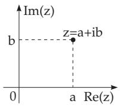
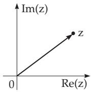
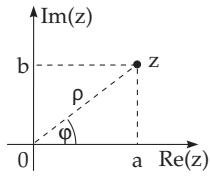
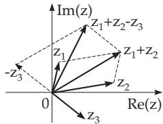
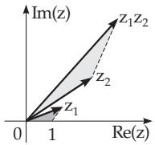
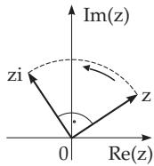
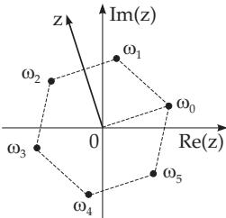

### 1.5 Complex Numbers

#### 1.5.1 Imaginary and Complex Numbers

##### 1.5.1.1 Imaginary Unit

The imaginary unit is denoted by i, which represents a number diferent from any real number, and whose square is equal to 1. In electronics, instead of i the letter j is usually used to avoid accidently confusing it with the intensity of current, also denoted by i. The introduction of the imaginary unit leads to the generalization ofthe notion ofnumbers to the complex numbers, which play a very important role in algebra and analysis. The complex numbers have several interpretations in geometry and physics.

##### 1.5.1.2 Complex Numbers

The algebraic form ofa complex number is

$$
z = a + \mathrm { i } b .\tag{1.129a}
$$

When a and b take all possible real values, then one gets all possible complex numbers z. The number a is the real part, the number b is the imaginary part of the number z:

$$
a = \operatorname { R e } ( z ) , \quad b = \operatorname { I m } ( z ) .\tag{1.129b}
$$

For $b = 0$ it is $z = a$ , so the real numbers form a subset of the complex numbers. For $a = 0 { \mathrm { i t ~ i s ~ } } z = \mathrm { i } b ,$ which is a “pure imaginary number”.

The total set of complex numbers is denoted by C .

Remark: Functions $w = f ( z )$ with complex variable $z = x + \mathrm { i } y$ will be discussed in function theory (see 14.1, p. 731 f).

#### 1.5.2 Geometric Representation

##### 1.5.2.1 Vector Representation

Similarly to the representation of the real numbers on the numerical axis, the complex numbers can be represented as points in the so-called Gaussian number plane: A number $z = a + \mathrm { i } b$ is represented by the point whose abscissa is a and ordinate is b (Fig. 1.5). The real numbers are on the axis of abscissae which is also called the real axis, the pure imaginary numbers are on the axis of ordinates which is also called the imaginary axis. On this plane every point is given uniquely by its position vector or

(1.131a)

radius vector (see 3.5.1.1, 6., p. 181), so every complex number corresponds to a vector which starts at the origin and is directed to the point defined by the complex number. So, complex numbers can be represented as points or as vectors (Fig. 1.6).

##### 1.5.2.2 Equality of Complex Numbers

Two complex numbers are equal by definition if their real parts and imaginary parts are equal to each other. From a geometric viewpoint, two complex numbers are equal if the position vectors corresponding to them are equal. In the opposite case the complex numbers are not equal. The notions “greater” and “smaller” are meaningless for complex numbers.

  
Figure 1.5

  
Figure 1.6

  
Figure 1.7

##### 1.5.2.3 Trigonometric Form of Complex Numbers

The form

$$
z = a + \mathrm { i } b\tag{1.130a}
$$

is called the algebraic form of the complex number. Using polar coordinates yields the trigonometric form ofthe complex numbers (Fig. 1.7):

$$
z = \rho ( \cos \varphi + \mathrm { i } \sin \varphi ) .\tag{1.130b}
$$

The length of the position vector of a point $\rho = | z |$ is called the absolute value or the magnitude of the complex number, the angle $\varphi ,$ given in radian measure, is called the argument of the complex number and is denoted by arg z:

$$
\rho = | z | , \ \varphi = \arg z = \omega + 2 k \pi { \mathrm { ~ w i t h ~ } } \ 0 \leq \rho < \infty , \ - \pi < \omega \leq + \pi , \ k = 0 , \pm 1 , \pm 2 , \ldots .\tag{1.130c}
$$

One calls $\varphi$ the principal value of the argument of the complex number.

The relations between $\rho , \varphi$ and a , b for a point are the same as between the Cartesian and polar coordinates of a point (see 3.5.2.2, p. 192):

$$
a = \rho \cos \varphi ,\tag{1.131b}
$$

$$
\rho = { \sqrt { a ^ { 2 } + b ^ { 2 } } } ,\tag{1.131c}
$$

$$
\varphi = \left\{ \begin{array} { l l } { \operatorname { a r c c o s } \displaystyle { \frac { a } { \rho } } } & { \mathrm { f o r } ~ b \geq 0 , ~ \rho > 0 , } \\ { - \operatorname { a r c c o s } \displaystyle { \frac { a } { \rho } } } & { \mathrm { f o r } ~ b < 0 , ~ \rho > 0 , } \\ { \operatorname { u n d e f i n e d } } & { \mathrm { f o r } ~ \rho = 0 } \\ { \qquad \quad } & { ( 1 . 1 3 1 \mathrm { d } ) } \end{array} \right. \qquad \varphi = \left\{ \begin{array} { l l } { \arctan { \frac { b } { a } } } & { \mathrm { f o r } ~ a > 0 , } \\ { + \displaystyle { \frac { \pi } { 2 } } } & { \mathrm { f o r } ~ a = 0 , ~ b > 0 , } \\ { - \displaystyle { \frac { \pi } { 2 } } } & { \mathrm { f o r } ~ a = 0 , ~ b < 0 , } \\ { \arctan { \frac { b } { a } } + \pi } & { \mathrm { f o r } ~ a < 0 , ~ b \geq 0 , } \\ { \arctan { \frac { b } { a } } - \pi } & { \mathrm { f o r } ~ a < 0 , ~ b < 0 . } \end{array} \right.\tag{1.131e}
$$

The complex number $z = 0$ has absolute value equal to zero; its argument arg 0 is undefined.

##### 1.5.2.4 Exponential Form of a Complex Number

The representation

$$
z = \rho e ^ { \mathrm { i } \varphi }\tag{1.132a}
$$

is called the exponential form ofthe complex number, where $\rho$ is the magnitude and $\varphi$ is the argument. The Euler relation is the formula

$$
e ^ { \mathrm { i } \varphi } = \cos \varphi + \mathrm { i } \sin \varphi .\tag{1.132b}
$$

Representation of a complex number in three forms:

a) $z = 1 + \mathrm { i } \sqrt { 3 }$ (algebraic form), b) $z = 2 \left( \cos { \frac { \pi } { 3 } } + \mathrm { i } \sin { \frac { \pi } { 3 } } \right)$ (trigonometric form),

$\mathbf { c } ) \ : z = 2 \ : e ^ { \mathrm { i } \frac { \pi } { 3 } }$ (exponential form), considering the principal value of it.

Without restriction to the principal value holds the representation

$$
{ \textnormal { d } } z = 1 + \mathrm { i } \sqrt { 3 } = 2 \exp \left[ \mathrm { i } \left( \frac { \pi } { 3 } + 2 k \pi \right) \right] = 2 \left[ \cos \left( \frac { \pi } { 3 } + 2 k \pi \right) + \mathrm { i } \sin \left( \frac { \pi } { 3 } + 2 k \pi \right) \right] ( k = 0 , \pm 1 , \pm 2 , \ldots ) .
$$

##### 1.5.2.5 Conjugate Complex Numbers

Two complex numbers z and $z ^ { * }$ are called conjugate complex numbers if their real parts are equal and their imaginary parts difer only in sign:

$$
\mathrm { R e } ( z ^ { * } ) = \mathrm { R e } ( z ) , \quad \mathrm { I m } ( z ^ { * } ) = - \mathrm { I m } ( z ) .\tag{1.133a}
$$

The geometric interpretation of points corresponding to the conjugate complex numbers are points symmetric with respect to the real axis. Conjugate complex numbers have the same absolute value, their arguments difer only in sign:

$$
z = a + \mathrm { i } b = \rho ( \cos \varphi + \mathrm { i } \sin \varphi ) = \rho e ^ { \mathrm { i } \varphi } ,\tag{1.133b}
$$

$$
z ^ { * } = a - \mathrm { i } b = \rho ( \cos \varphi - \mathrm { i } \sin \varphi ) = \rho e ^ { - \mathrm { i } \varphi } .\tag{1.133c}
$$

Instead of $z ^ { * }$ one often uses the notation z for the conjugate of $z ,$

#### 1.5.3 Calculation with Complex Numbers

##### 1.5.3.1 Addition and Subtraction

Addition and subtraction of two or more complex numbers given in algebraic form is defined by the formula

$$
\begin{array} { r l } & { z _ { 1 } + z _ { 2 } - z _ { 3 } + \cdot \cdot \cdot = ( a _ { 1 } + \mathrm { i } b _ { 1 } ) + ( a _ { 2 } + \mathrm { i } b _ { 2 } ) - ( a _ { 3 } + \mathrm { i } b _ { 3 } ) + \cdot \cdot \cdot } \\ & { \phantom { a _ { 1 } } = ( a _ { 1 } + a _ { 2 } - a _ { 3 } + \cdot \cdot \cdot ) + \mathrm { i } \left( b _ { 1 } + b _ { 2 } - b _ { 3 } + \cdot \cdot \cdot \right) . } \end{array}\tag{1.134}
$$

The calculation can be done in the same way as doing with usual binomials. As a geometric interpretation of addition and subtraction can be considered the addition and subtraction of the corresponding vectors (Fig. 1.8). For these the usual rules for vector calculations are to be used (see 3.5.1.1, p. 181). For z and $z ^ { * } , z + z ^ { * }$ is always real, and $z - z ^ { * }$ is pure imaginary.

  
Figure 1.8

  
Figure 1.9

  
Figure 1.10

##### 1.5.3.2 Multiplication

The multiplication of two complex numbers $z _ { 1 }$ and $z _ { 2 }$ given in algebraic form is defined by the following formula

$$
z _ { 1 } z _ { 2 } = ( a _ { 1 } + \mathrm { i } b _ { 1 } ) ( a _ { 2 } + \mathrm { i } b _ { 2 } ) = ( a _ { 1 } a _ { 2 } - b _ { 1 } b _ { 2 } ) + \mathrm { i } \left( a _ { 1 } b _ { 2 } + b _ { 1 } a _ { 2 } \right) .\tag{1.135a}
$$

For numbers given in trigonometric form holds

$$
\begin{array} { r l r } {  { z _ { 1 } z _ { 2 } = [ \rho _ { 1 } ( \cos \varphi _ { 1 } + \mathrm { i } \sin \varphi _ { 1 } ) ] [ \rho _ { 2 } ( \cos \varphi _ { 2 } + \mathrm { i } \sin \varphi _ { 2 } ) ] } } \\ & { } & { = \rho _ { 1 } \rho _ { 2 } [ \cos ( \varphi _ { 1 } + \varphi _ { 2 } ) + \mathrm { i } \sin ( \varphi _ { 1 } + \varphi _ { 2 } ) ] , \quad \quad } \end{array}\tag{1.135b}
$$

i.e., the absolute value of the product is equal to the product of the absolute values of the factors, and the argument of the product is equal to the sum of the arguments of the factors. The exponential form of the product is

$$
z _ { 1 } z _ { 2 } = \rho _ { 1 } \rho _ { 2 } e ^ { \mathrm { i } ( \varphi _ { 1 } + \varphi _ { 2 } ) } .\tag{1.135c}
$$

The geometric interpretation of the product of two complex numbers $z _ { 1 }$ and $z _ { 2 }$ is a vector $\left( \mathbf { F i g . 1 . 9 } \right)$ . It is generated by rotation of the vector corresponding to $z _ { 1 }$ by the argument of the vector $z _ { 2 }$ (clockwise or counterclockwise according to the sign of this argument), and the length of the vector will be stretched by z2 .

The product $z _ { 1 } z _ { 2 }$ can also be represented with similar triangles (Fig. 1.9). The multiplication of a complex number z by i means a rotation by $\pi / 2$ and the absolute value does not change (Fig. 1.10). For z and $z ^ { * }$

$$
z z ^ { * } = \rho ^ { 2 } = | z | ^ { 2 } = a ^ { 2 } + b ^ { 2 } .\tag{1.136}
$$

##### 1.5.3.3 Division

Division is defined as the inverse operation of multiplication. For complex numbers given in algebraic form holds

$$
{ \frac { z _ { 1 } } { z _ { 2 } } } = { \frac { a _ { 1 } + \mathrm { i } b _ { 1 } } { a _ { 2 } + \mathrm { i } b _ { 2 } } } = { \frac { a _ { 1 } a _ { 2 } + b _ { 1 } b _ { 2 } } { { a _ { 2 } } ^ { 2 } + { b _ { 2 } } ^ { 2 } } } + \mathrm { i } { \frac { a _ { 2 } b _ { 1 } - a _ { 1 } b _ { 2 } } { { a _ { 2 } } ^ { 2 } + { b _ { 2 } } ^ { 2 } } } .\tag{1.137a}
$$

For complex numbers given in trigonometric form holds

$$
{ \frac { z _ { 1 } } { z _ { 2 } } } = { \frac { \rho _ { 1 } ( \cos \varphi _ { 1 } + \mathrm { i } \sin \varphi _ { 1 } ) } { \rho _ { 2 } ( \cos \varphi _ { 2 } + \mathrm { i } \sin \varphi _ { 2 } ) } } = { \frac { \rho _ { 1 } } { \rho _ { 2 } } } [ \cos ( \varphi _ { 1 } - \varphi _ { 2 } ) + \mathrm { i } \sin ( \varphi _ { 1 } - \varphi _ { 2 } ) ] ,\tag{1.137b}
$$

i.e., the absolute value of the quotient is equal to the ratio of the absolute values of the dividend and the divisor; the argument of the quotient is equal to the diference of the arguments. For the exponential form follows

$$
\frac { z _ { 1 } } { z _ { 2 } } = \frac { \rho _ { 1 } } { \rho _ { 2 } } e ^ { \mathrm { i } ( \varphi _ { 1 } - \varphi _ { 2 } ) } .\tag{1.137c}
$$

In the geometric representation the vector corresponding to $z _ { 1 } / z _ { 2 }$ can be generated by a rotation of the vector representing $z _ { 1 } \mathrm { b y - a r g } z _ { 2 }$ , and then by a contraction by $| z _ { 2 } |$

Remark: Division by zero is impossible.

##### 1.5.3.4 General Rules for the Basic Operations

Calculations with complex numbers $z = a + \mathrm { i } b$ are to be done in the same way as doing with ordinary binomials, but considering $\mathrm { i } ^ { 2 } = - 1$ . Dividing a complex number by a complex number first the imaginary part of the denominator has to be removed by multiplying the numerator and the denominator of the fraction by the complex conjugate of the divisor. This is possible because

$$
( a + \mathrm { i } b ) ( a - \mathrm { i } b ) = a ^ { 2 } + b ^ { 2 }\tag{1.138}
$$

is a real number.

$$
\frac { ( 3 - 4 \mathrm { i } ) ( - 1 + 5 \mathrm { i } ) ^ { 2 } } { 1 + 3 \mathrm { i } } + \frac { 1 0 + 7 \mathrm { i } } { 5 \mathrm { i } } = \frac { ( 3 - 4 \mathrm { i } ) ( 1 - 1 0 \mathrm { i } - 2 5 ) } { 1 + 3 \mathrm { i } } + \frac { ( 1 0 + 7 \mathrm { i } ) \mathrm { i } } { 5 \mathrm { i } } = \frac { - 2 ( 3 - 4 \mathrm { i } ) ( 1 2 + 5 \mathrm { i } ) } { 1 + 3 \mathrm { i } } + \frac { 1 } { 5 \mathrm { i } } = 0 .
$$

$$
{ \frac { 7 - 1 0 \mathrm { i } } { 5 } } = { \frac { - 2 ( 5 6 - 3 3 \mathrm { i } ) ( 1 - 3 \mathrm { i } ) } { ( 1 + 3 \mathrm { i } ) ( 1 - 3 \mathrm { i } ) } } + { \frac { 7 - 1 0 \mathrm { i } } { 5 } } = { \frac { - 2 ( - 4 3 - 2 0 1 \mathrm { i } ) } { 1 0 } } + { \frac { 7 - 1 0 \mathrm { i } } { 5 } } = { \frac { 1 } { 5 } } ( 5 0 + 1 9 \mathrm { l i } ) = 1 0 + 3 8 . 2 \mathrm { i } .
$$

##### 1.5.3.5 Taking Powers of Complex Numbers

The n-th power of a complex number could be calculated using the binomial formula, but it would be very inconvenient. For practical reasons the trigonometric form is to be used and the so-called de Moivre formula:

$$
[ \rho ( \cos \varphi + \mathrm { i } \sin \varphi ) ] ^ { n } = \rho ^ { n } ( \cos n \varphi + \mathrm { i } \sin n \varphi ) ,\tag{1.139a}
$$

i.e., the absolute value is raised to the n-th power, and the argument is multiplied by n. In particular, holds:

$$
\mathrm { i } ^ { 2 } = - 1 , \mathrm { i } ^ { 3 } = - \mathrm { i } , \mathrm { i } ^ { 4 } = + 1
$$

(1.139b)

in general

(1.139c)

##### 1.5.3.6 Taking the n-th Root ofa Complex Number

Taking of the n-th root is the inverse operation of taking powers. For $z = \rho ( \cos \varphi + \mathrm { i } \sin \varphi ) \neq 0$ the notation

$$
z ^ { 1 / n } = { \sqrt [ n ] { z } } \quad ( n > 0 , \ \mathrm { i n t e g e r } ) ,\tag{1.140a}
$$

is the shorthand notation for the n diferent values

$$
\begin{array} { c } { { \omega _ { k } = \sqrt [ n ] { \rho } \left( \cos \frac { \varphi + 2 k \pi } { n } + \mathrm { i } \sin \frac { \varphi + 2 k \pi } { n } \right) , } } \\ { { ( k = 0 , 1 , 2 , \ldots , n - 1 ) . } } \end{array}\tag{1.140b}
$$

While addition, subtraction, multiplication, division, and taking a power with integer exponent have unique results, taking the n-th root has n diferent solutions $\omega _ { k }$

The geometric interpretations of the points $\omega _ { k }$ are the vertices of a regular n-gon whose center is at the origin. In Fig. 1.11 the six values of $\sqrt [ 6 ] { z }$ are represented.

  
Figure 1.11

##### th Root of a ComplexNumber
