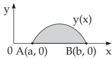
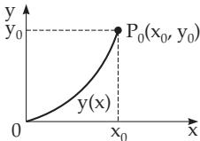

### 10.2 Historical Problems

#### 10.2.1 Isoperimetric Problem

The general isoperimetric problem is to determine the plane region with the largest area among the plane regions with a given perimeter. The solution of this problem, a circle with a given perimeter, originates from queen Dido, who was allowed, as legend has it, to take such an area for the foundation of Carthago which she could be surround by one bull’s leather. She cut the leather into fine stripes, and formed a circle with them.

A special case of the isoperimetric problem is to find the equation of the curve $y = y ( x )$ in a Cartesian coordinate system connecting the points $A ( a , 0 )$ and $B ( b , 0 )$ and having the given length l, for which the area determined by the line segment $\overline { { A B } }$ and the curve is the largest possible (Fig. 10.1). For the mathematical formalization a once continuously diferentiable function $y ( x )$ is to be determined, such that

  
Figure 10.1

$$
I [ y ] = \int _ { a } ^ { b } y ( x ) d x = \operatorname* { m a x }\tag{10.8a}
$$

holds, where the side condition (10.8b) and the boundary conditions (10.8c) are satisfied:

$$
G [ y ] = \int _ { a } ^ { b } { \sqrt { 1 + y ^ { \prime 2 } ( x ) } } d x = l
$$

$$
\begin{array} { r l } { ( 1 0 . 8 \mathrm { b } ) \qquad } & { { } y ( a ) = y ( b ) = 0 } \end{array}\tag{10.8c}
$$

#### 10.2.2 Brachistochrone Problem

The brachistochrone problem was formulated in 1696 by J. Bernoulli, and it is the following: A point mass descends from the point $P _ { 0 } ( x _ { 0 } , y _ { 0 } )$ to the origin in the vertical plane x, y only under the influence of gravity. The curve $y = y ( x )$ along which the point reaches the origin in the shortest possible time from $P _ { 0 } \left( \mathbf { F i g . 1 0 . 2 } \right)$ is to be determined. With the formula for the time of fall $T ,$ (see 11.5.1, p. 648), the following mathematical description is possible to determine a once continuously diferentiable function $y = y ( x )$ for which

$$
T [ y ] = \int _ { 0 } { \frac { \sqrt { 1 + y ^ { \prime 2 } } } { \sqrt { 2 g ( y _ { 0 } - y ) } } } d x = \operatorname* { m i n }\tag{10.9}
$$

holds, $( g$ is the acceleration due to gravity). The boundary value conditions are

$$
y ( 0 ) = 0 , \qquad y ( x _ { 0 } ) = y _ { 0 } .\tag{10.10}
$$

  
Figure 10.2

For $x = x _ { 0 }$ in (10.9) there is a singularity.
