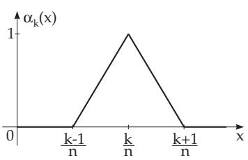

#### 11.2.4 Numerical Methods for Fredholm Integral Equations of the Second Kind

Often it is either impossible or takes too much work to get the exact solution of a Fredholm integral equation of the second kind

$$
\varphi ( x ) = f ( x ) + \lambda \int _ { a } ^ { b } K ( x , y ) \varphi ( y ) d y\tag{11.23}
$$

by the solution methods given in 11.2.1, p. 622, 11.2.2, p. 625 and 11.2.3, p. 627. In such cases certain numerical methods can be used for approximation. Three diferent methods are given below to get the numerical solution of an integral equation of the form (11.23).

##### 11.2.4.1 Approximation of the Integral

1. Semi-Discrete Problem

Working on the integral equation (11.23) often one replaces the integral by an approximation formula. These approximation formulas are called quadrature formulas. They take the form

$$
\int _ { a } ^ { b } f ( x ) d x \approx Q _ { [ a , b ] } ( f ) = \sum _ { k = 1 } ^ { n } \omega _ { k } f ( x _ { k } ) ,\tag{11.24}
$$

i.e., instead of the integral there is now a sum of the substitution values of the function at the interpolation nodes $x _ { k }$ weighted by the values $\omega _ { k }$ . The numbers $\omega _ { k }$ should be suitably chosen (so as to be independent of $f )$ . Equation (11.23) can be written in the approximate form:

$$
\varphi ( x ) \approx f ( x ) + \lambda Q _ { [ a , b ] } ( K ( x , \cdot ) \varphi ( \cdot ) ) = f ( x ) + \lambda \sum _ { k = 1 } ^ { n } \omega _ { k } K ( x , y _ { k } ) \varphi ( y _ { k } ) .\tag{11.25a}
$$

The quadrature formula $Q _ { [ a , b ] } ( K ( x , \cdot ) \varphi ( \cdot ) )$ also depends on the variable x. The dot in the argument of the function means that the quadrature formula will be used with respect to the variable y. Defining the relation

$$
\overline { { \varphi } } ( x ) = f ( x ) + \lambda \sum _ { k = 1 } ^ { n } \omega _ { k } K ( x , y _ { k } ) \overline { { \varphi } } ( y _ { k } ) .\tag{11.25b}
$$

$\overline { { \varphi } } ( x )$ is an approximation of the exact solution $\varphi ( x )$ . One considers (11.25b) as a semi-discrete problem, because the variable y is turned into discrete values while the variable x can still be arbitrary.

If the equation (11.25b) holds for a function $\overline { { \varphi } } ( x )$ for every $x \in [ a , b ]$ , it must also be valid for the interpolation nodes $x = x _ { k } ;$

$$
\overline { { { \varphi } } } ( x _ { k } ) = f ( x _ { k } ) + \lambda \sum _ { j = 1 } ^ { n } \omega _ { j } K ( x _ { k } , y _ { j } ) \overline { { { \varphi } } } ( y _ { j } ) , \quad k = 1 , 2 , \ldots , n .\tag{11.25c}
$$

This is a linear system of equations containing n equations for the n unknown values $\overline { { \varphi } } ( x _ { k } )$ . Substituting these solutions into (11.25b) yields the solution of the semi-discrete problem. The accuracy and the amount of calculations of this method depend on the quadrature formula used. For example using the left-hand rectangular formula (see 19.3.2.1, p. 964) with an equidistant partition $y _ { k } = x _ { k } = a + h ( k -$ 1), $h = ( b - a ) / n , ( k = 1 , \dots , n )$ yields:

$$
\int _ { a } ^ { b } K ( x , y ) { \overline { { \varphi } } } ( y ) d y \approx \sum _ { k = 1 } ^ { n } h K ( x , y _ { k } ) { \overline { { \varphi } } } ( y _ { k } ) .\tag{11.26a}
$$

With the notations

$$
K _ { j k } = K ( x _ { j } , y _ { k } ) , \quad f _ { k } = f ( x _ { k } ) , \quad \varphi _ { k } = \overline { { \varphi } } ( x _ { k } )\tag{11.26b}
$$

the system (11.25c) has the form:

$$
\begin{array} { r l r } & { } & { ( 1 - \lambda h K _ { 1 1 } ) \varphi _ { 1 } - ( \lambda h K _ { 1 2 } \varphi _ { 2 } - \mathrm { ~ . ~ . . ~ } } \\ & { } & { - \lambda h K _ { 2 1 } \varphi _ { 1 } + ( 1 - \lambda h K _ { 2 2 } \varphi _ { 2 } ) - \mathrm { ~ . ~ . . ~ } } \\ & { } & { . . . . . . . . . . . . . . . . . . . . . . . . . . . . . . . . . . . . . . . . . . . . . . . . . . . . . . . . . . . . . . . . . . . . . . . . . . . . . . . . . . . . . . . . . } \\ & { } & { - \lambda h K _ { n 1 } \varphi _ { 1 } - \lambda h K _ { n 2 } \varphi _ { 2 } - \mathrm { ~ . ~ . ~ . . ~ } + ( 1 - \lambda h K _ { n n } ) \varphi _ { n } = f _ { n } . } \end{array}\tag{11.26c}
$$

The same system was involved in the Fredholm solution method (see 11.2.3, p. 627). As the rectangular formula is not accurate enough, for a better approximation of the integral one can increase the number of interpolation nodes, along with an increase in the dimension of the system of equations. Hence one gets the idea of looking for another quadrature formula.

2. Nystr¨om Method

In the so-called Nystr¨om method the Gauss quadrature formula is to be used for the approximation of the integral (see 19.3.3, p. 965). In order to derive this, one considers the integral

$$
I = \int _ { a } ^ { b } f ( x ) d x .\tag{11.27a}
$$

The integrand is replaced by a polynomial $p ( x )$ , namely the interpolation polynomial of $f ( x )$ at the interpolation nodes xk:

$$
\begin{array} { l } { p ( x ) = \displaystyle \sum _ { k = 1 } ^ { n } L _ { k } ( x ) f ( x _ { k } ) \mathrm { ~ w i t h ~ } } \\ { L _ { k } ( x ) = \displaystyle \frac { \big ( x - x _ { 1 } \big ) . . . \big ( x - x _ { k - 1 } \big ) \big ( x - x _ { k + 1 } \big ) . . . \big ( x - x _ { n } \big ) } { \big ( x _ { k } - x _ { 1 } \big ) . . . \big ( x _ { k } - x _ { k - 1 } \big ) \big ( x _ { k } - x _ { k + 1 } \big ) . . . \big ( x _ { k } - x _ { n } \big ) } . } \end{array}\tag{11.27b}
$$

For this polynomial

$$
p ( x _ { k } ) = f ( x _ { k } ) , k = 1 , \ldots , n .\tag{11.27c}
$$

holds. The replacement of the integrand $f ( x )$ by p(x) results in the quadrature formula

$$
\int _ { a } ^ { b } f ( x ) d x \approx \int _ { a } ^ { b } p ( x ) d x = \sum _ { k = 1 } ^ { n } f ( x _ { k } ) \int _ { a } ^ { b } L _ { k } ( x ) d x = \sum _ { k = 1 } ^ { n } \omega _ { k } f ( x _ { k } ) { \mathrm { ~ w i t h ~ } } \omega _ { k } = \int _ { a } ^ { b } L _ { k } ( x ) d x .\tag{11.27d}
$$

For the Gauss quadrature formula the interpolation nodes cannot be chosen arbitrarily but they must be chosen by the formula:

$$
x _ { k } = \frac { a + b } { 2 } + \frac { b - a } { 2 } t _ { k } , \quad k = 1 , 2 , \ldots , n .\tag{11.28a}
$$

The n values $t _ { k }$ are the n roots of the Legendre polynomial of the first kind (see 9.1.2.6, 3., p. 565)

$$
P _ { n } ( t ) = \frac { 1 } { 2 ^ { n } \cdot n ! } \frac { d ^ { n } \left[ ( t ^ { 2 } - 1 ) ^ { n } \right] } { d t ^ { n } } .\tag{11.28b}
$$

These roots are in the interval $[ - 1 , + 1 ]$ . The coeficients $\omega _ { k }$ can be calculated by the substitution b  a   
x  xk = (t  tk), so: 2

$$
\omega _ { k } = \int _ { a } ^ { b } { { L } _ { k } } ( x ) d x = ( b - a ) \frac { 1 } { 2 } \int _ { - 1 } ^ { 1 } { \frac { 1 } { ( { { t } _ { k } } - { { t } _ { 1 } } ) \dots ( { { t } _ { k - 1 } } ) ( { { t } _ { k } } - { { t } _ { k + 1 } } ) \dots ( { { t } _ { k } } - { { t } _ { n } } ) } d t }\tag{11.29}
$$

In Table 11.1 are given the roots of the Legendre polynomial of the first kind and the weights $A _ { k }$ for $n = 1 , \ldots , 6$

Table 11.1 Roots of the Legendre polynomial of the first kind
<table><tr><td rowspan=1 colspan=1>n</td><td rowspan=1 colspan=2>t</td><td rowspan=1 colspan=1>A</td><td rowspan=1 colspan=1>n</td><td rowspan=1 colspan=1>t</td><td rowspan=1 colspan=1>A</td></tr><tr><td rowspan=1 colspan=1>1</td><td rowspan=1 colspan=2> $t _ { 1 } = ~ 0$ </td><td rowspan=1 colspan=1> $A _ { 1 } = 1$ </td><td rowspan=1 colspan=1> $5$ </td><td rowspan=1 colspan=1> $t _ { 1 } = - 0 . 9 0 6 2$ </td><td rowspan=2 colspan=1> $A _ { 1 } = 0 . 1 1 8 5$  $A _ { 2 } = 0 . 2 3 9 3$ </td></tr><tr><td rowspan=2 colspan=1>2</td><td rowspan=2 colspan=2> $\overline { { t _ { 1 } = - 0 . 5 7 7 4 } }$  $\begin{array} { r l } { t _ { 2 } = } & { { } 0 . 5 7 7 4 } \end{array}$ </td><td rowspan=1 colspan=1> $A _ { 1 } = 0 . 5$ </td><td rowspan=1 colspan=1></td><td rowspan=1 colspan=1> $t _ { 2 } = - 0 . 5 3 8 4$ </td></tr><tr><td rowspan=1 colspan=1> $A _ { 2 } = 0 . 5$ </td><td rowspan=1 colspan=1></td><td rowspan=1 colspan=1> $t _ { 3 } = ~ 0$ </td><td rowspan=2 colspan=1> $A _ { 3 } = 0 . 2 8 4 4$  $A _ { 4 } = 0 . 2 3 9 3$ </td></tr><tr><td rowspan=1 colspan=1>3</td><td rowspan=1 colspan=2> $t _ { 1 } = - 0 . 7 7 4 6$ </td><td rowspan=1 colspan=1> $A _ { 1 } = 0 . 2 7 7 8$ </td><td rowspan=1 colspan=1></td><td rowspan=1 colspan=1> $t _ { 4 } = \mathrm { ~ \ } 0 . 5 3 8 4$ </td></tr><tr><td rowspan=2 colspan=1></td><td rowspan=2 colspan=2> $t _ { 2 } = ~ 0$  $t _ { 3 } = \ \mathrm { ~ 0 . 7 7 4 6 }$ </td><td rowspan=1 colspan=1> $A _ { 2 } = 0 . 4 4 4 4$ </td><td rowspan=1 colspan=1></td><td rowspan=1 colspan=1> $t _ { 5 } = \mathrm { ~ \ } 0 . 9 0 6 2$ </td><td rowspan=1 colspan=1> $A _ { 5 } = 0 . 1 1 8 5$ </td></tr><tr><td rowspan=1 colspan=1> $A _ { 3 } = 0 . 2 7 7 8$ </td><td rowspan=1 colspan=1>6</td><td rowspan=1 colspan=1> $t _ { 1 } = - 0 . 9 3 2 4$ </td><td rowspan=1 colspan=1> $A _ { 1 } = 0 . 0 8 5 7$ </td></tr><tr><td rowspan=1 colspan=1>4</td><td rowspan=2 colspan=2> $t _ { 1 } = - 0 . 8 6 1 2$  $t _ { 2 } = - 0 . 3 4 0 0$ </td><td rowspan=1 colspan=1> $A _ { 1 } = 0 . 1 7 3 9$ </td><td rowspan=1 colspan=1></td><td rowspan=1 colspan=1> $t _ { 2 } = - 0 . 6 6 1 2$ </td><td rowspan=2 colspan=1> $A _ { 2 } = 0 . 1 8 0 4$  $A _ { 3 } = 0 . 2 3 4 0$ </td></tr><tr><td rowspan=2 colspan=1></td><td rowspan=2 colspan=1> $t _ { 3 } = \ma</td><td rowspan=1 colspan=1><eq>A _ { 2 } = 0 . 3 2 6 1$ </td><td rowspan=1 colspan=1></td><td rowspan=1 colspan=1> $t _ { 3 } = - 0 . 2 3 8 6$ </td></tr><tr><td rowspan=1 colspan=1>thrm { ~ \ } 0 . 3 4 0 0</eq></td><td rowspan=1 colspan=1> $A _ { 3 } = 0 . 3 2 6 1$ </td><td rowspan=1 colspan=1></td><td rowspan=1 colspan=1> $t _ { 4 } = \ \mathrm { ~ 0 . 2 3 8 6 }$ </td><td rowspan=1 colspan=1> $A _ { 4 } = 0 . 2 3 4 0$ </td></tr><tr><td rowspan=2 colspan=1></td><td rowspan=2 colspan=2> $t _ { 4 } = \ \mathrm { ~ 0 . 8 6 1 2 }$ </td><td rowspan=1 colspan=1> $A _ { 4 } = 0 . 1 7 3 9$ </td><td rowspan=1 colspan=1></td><td rowspan=1 colspan=1> $t _ { 5 } = \begin{array} { r l } { 0 . 6 6 1 2 } \end{array}$ </td><td rowspan=1 colspan=1> $A _ { 5 } = 0 . 1 8 0 4$ </td></tr><tr><td rowspan=1 colspan=1></td><td rowspan=1 colspan=1></td><td rowspan=1 colspan=1> $t _ { 6 } = \begin{array} { r l } { 0 . 9 3 2 4 } \end{array}$ </td><td rowspan=1 colspan=1> $A _ { 6 } = 0 . 0 8 5 7$ </td></tr></table>

Solve the integral equation $\varphi ( x ) = \cos \pi x + { \frac { x } { x ^ { 2 } + \pi ^ { 2 } } } ( \mathrm { e } ^ { x } + 1 ) + \int _ { 0 } ^ { 1 } e ^ { x y } \varphi ( y )$ dy by the Nystr¨om method for n = 3.

$$
n = 3 : ~ x _ { 1 } = 0 . 1 1 2 7 , ~ x _ { 2 } = 0 . 5 , ~ x _ { 3 } = 0 . 8 8 7 3 ,
$$

$$
A _ { 1 } = 0 . 2 7 7 8 , \qquad A _ { 2 } = 0 . 4 4 4 4 , \qquad A _ { 3 } = 0 . 2 7 7 8 ,
$$

$$
f _ { 1 } = 0 . 9 6 2 1 4 , \qquad f _ { 2 } = 0 . 1 3 0 8 7 , \qquad f _ { 3 } = - 0 . 6 5 2 5 1 ,
$$

$$
K _ { 1 1 } = 1 . 0 1 2 7 8 , K _ { 2 2 } = 1 . 2 8 4 0 3 , K _ { 3 3 } = 2 . 1 9 7 4 6 ,
$$

$$
K _ { 1 2 } = K _ { 2 1 } = 1 , 0 5 7 9 7 , \ K _ { 1 3 } = K _ { 3 1 } = 1 . 1 0 5 1 7 , \ K _ { 2 3 } = K _ { 3 2 } = 1 . 5 5 8 3 8 .
$$

The system of equations (11.25c) for $\varphi _ { 1 } , \varphi _ { 2 } ,$ , and $\varphi _ { 3 }$ is

$$
\begin{array} { r l } { 0 . 7 1 8 6 4 \varphi _ { 1 } - 0 . 4 7 0 1 6 \varphi _ { 2 } - 0 . 3 0 7 0 2 \varphi _ { 3 } = } & { { } 0 . 9 6 2 1 4 , } \end{array}
$$

$$
\begin{array} { r l } { - 0 . 2 9 3 9 0 \varphi _ { 1 } + 0 . 4 2 9 3 8 \varphi _ { 2 } - 0 . 4 3 2 9 2 \varphi _ { 3 } = } & { { } 0 . 1 3 0 8 7 , } \end{array}
$$

$$
- 0 . 3 0 7 0 2 \varphi _ { 1 } - 0 . 6 9 2 5 4 \varphi _ { 2 } + 0 . 3 8 9 5 5 \varphi _ { 3 } = - 0 . 6 5 2 5 1 .
$$

The solution of the system is: $\varphi _ { 1 } = 0 . 9 3 6 5 1$ $\varphi _ { 2 } = - 0 . 0 0 1 4 4$ $\varphi _ { 3 } = - 0 . 9 3 9 5 0 .$ The substitution values of the exact solution at the interpolation nodes are: $\varphi ( x _ { 1 } ) = 0 . 9 3 7 9 7 , \varphi ( x _ { 2 } ) = 0 , \varphi ( x _ { 3 } ) = - 0 . 9 3 7 9 7 .$

##### 11.2.4.2 Kernel Approximation

Replace the kernel $K ( x , y )$ by a kernel $\overline { { K } } ( x , y )$ so that $\overline { { K } } ( x , y ) \approx K ( x , y )$ for $a \leq x \leq b , a \leq y \leq b .$ Try to choose a kernel making the solution of the integral equation

$$
\overline { { \varphi } } ( x ) = f ( x ) + \lambda \int _ { a } ^ { b } \overline { { K } } ( x , y ) \overline { { \varphi } } ( y ) d y\tag{11.30}
$$

the easiest possible.

1. Tensor Product Approximation

A frequently-used approximation of the kernel is the tensor product approximation in the form

$$
K ( x , y ) \approx \overline { { { K } } } ( x , y ) = \sum _ { j = 0 } ^ { n } \sum _ { k = 0 } ^ { n } d _ { j k } \alpha _ { j } ( x ) \beta _ { k } ( y )\tag{11.31a}
$$

with given linearly independent functions $\alpha _ { 0 } ( x ) , \ldots , \alpha _ { n } ( x )$ and $\beta _ { 0 } ( y ) , \ldots , \beta _ { n } ( y )$ whose coeficients $d _ { j k }$ must be chosen so that the double sum approximates the kernel closely enough in a certain sense.

Rewriting (11.31a) in a degenerate kernel gives:

$$
\overline { { { K } } } ( x , y ) = \sum _ { j = 0 } ^ { n } \alpha _ { j } ( x ) \left[ \sum _ { k = 0 } ^ { n } d _ { j k } \beta _ { k } ( y ) \right] , \delta _ { j } ( y ) = \sum _ { k = 0 } ^ { n } d _ { j k } \beta _ { k } ( y ) \overline { { { K } } } ( x , y ) = \sum _ { j = 0 } ^ { n } \alpha _ { j } ( x ) \delta _ { j } ( y ) .\tag{11.31b}
$$

Now, the solution method 11.2.1, p. 622 can be used for the integral equation

$$
\overline { { \varphi } } ( x ) = f ( x ) + \lambda \int _ { a } ^ { b } \left[ \sum _ { j = 0 } ^ { n } \alpha _ { j } ( x ) \delta _ { j } ( y ) \right] \overline { { \varphi } } ( y ) d y .\tag{11.31c}
$$

Functions $\alpha _ { 0 } ( x ) , \ldots \alpha _ { n } ( x )$ and $\beta _ { 0 } ( y ) , \ldots , \beta _ { n } ( y )$ should be chosen so that the coeficients $d _ { j k }$ in (11.31a) can be calculated easily and also that the solution of (11.31c) isn’t too dificult.

2. Special Spline Approach

One chooses

$$
\alpha _ { k } ( x ) = \beta _ { k } ( x ) = { \left\{ \begin{array} { l l } { 1 - n \left| x - { \frac { k } { n } } \right| } & { { \mathrm { f o r } } \quad { \frac { k - 1 } { n } } \leq x \leq { \frac { k + 1 } { n } } , } \\ { 0 } & { { \mathrm { o t h e r w i s e } } } \end{array} \right. }\tag{11.32}
$$

for a special kernel approximation on the interval of integration $[ a , b ] = [ 0 , 1 ]$ . The function $\alpha _ { k } ( x )$ has non-zero values only in the so called carrier interval $\left( { \frac { k - 1 } { n } } , { \frac { k + 1 } { n } } \right) , ( \mathbf { F i g . 1 1 . 1 } )$

  
Figure 11.1

To calculate the coeficients $d _ { j k }$ in (11.31a), consider $\overline { { K } } ( x , y )$ at the points $x = l / n , y = i / \bar { n } ( l , i = 0 , 1 , . . . , n )$ . Then

$$
\alpha _ { j } \left( { \frac { l } { n } } \right) \alpha _ { k } \left( { \frac { i } { n } } \right) = { \left\{ \begin{array} { l l } { 1 { \mathrm { ~ f o r ~ } } j = l , k = i , } \\ { 0 { \mathrm { ~ o t h e r w i s e } } } \end{array} \right. }\tag{11.33}
$$

holds, and consequently $\overline { { K } } ( l / n , i / n ) = d _ { l i }$ . Hence, one substitutes $d _ { l i } = \overline { { K } } \left( \frac { l } { n } , \frac { i } { n } \right) = K \left( \frac { l } { n } , \frac { i } { n } \right)$ . Now (11.31a) has the form

$$
\overline { { { K } } } ( x , y ) = \sum _ { j = 0 } ^ { n } \sum _ { k = 0 } ^ { n } K \bigg ( \frac { j } { n } , \frac { k } { n } \bigg ) \alpha _ { j } ( x ) \beta _ { k } ( y ) .\tag{11.34}
$$

As known, the solution of (11.31c) has the representation

$$
\overline { { { \varphi } } } ( x ) = f ( x ) + A _ { 0 } \alpha _ { 0 } ( x ) + \ldots + A _ { n } \alpha _ { n } ( x ) .\tag{11.35}
$$

The expression $A _ { 0 } \alpha _ { 0 } ( x ) + \ldots + A _ { n } \alpha _ { n } ( x )$ is a piecewise linear function with substitution values $A _ { k }$ at the points $x _ { k } = k / n$ . Solving (11.31c) by the method given for the degenerate kernel, gives a linear system of equations for the numbers $A _ { 0 } , \ldots , A _ { n }$

$$
\begin{array} { r l r } { \mathrm { ( 1 - } \lambda c _ { 0 0 } ) A _ { 0 } } & { { } \mathrm { - } \lambda c _ { 0 1 } A _ { 1 } - \ . . . } & { { } \mathrm { - } \lambda c _ { 0 n } A _ { n } = b _ { 0 } , } \\ { \mathrm { - } \lambda c _ { 1 0 } A _ { 0 } + ( 1 - \lambda c _ { 1 1 } A _ { 1 } ) - \ . . . } & { { } \mathrm { - } \lambda c _ { 1 n } A _ { n } = b _ { 1 } , } \\  \mathrm { . . . . . . . . . . . . . . . . . . . . . . . . . . . . . . . . . . . . . . . . . . . . . . . . . . . . . . . . . . . . . . . . . . . . . . . . . . . . . . . . . . . . . . . . . . . . . . . . . . . . . . . . . . . } \\ { \mathrm { - } \lambda c _ { n 0 } A _ { 0 } } & { { } \mathrm { - } \lambda c _ { n 1 } A _ { 1 } - \ . . . . + ( 1 - \lambda c _ { n n } ) A _ { n } = b _ { n } , } \end{array}\tag{11.36a}
$$

where

$$
c _ { j k } = \int _ { 0 } ^ { 1 } \delta _ { j } ( x ) \alpha _ { k } ( x ) d x = \int _ { 0 } ^ { 1 } \left[ \sum _ { i = 0 } ^ { n } K \left( { \frac { j } { n } } , { \frac { i } { n } } \right) \alpha _ { j } ( x ) \right] \alpha _ { k } ( x ) d x
$$

$$
= K \left( { \frac { j } { n } } , { \frac { 0 } { n } } \right) \int _ { 0 } ^ { 1 } \alpha _ { 0 } ( x ) \alpha _ { k } ( x ) d x + \ldots + K \left( { \frac { j } { n } } , { \frac { n } { n } } \right) \int _ { 0 } ^ { 1 } \alpha _ { n } ( x ) \alpha _ { k } ( x ) d x .\tag{11.36b}
$$

For the int ls it bold

$$
\begin{array} { r l } & { \mathrm { ~ n e ~ m u c e ' a l s ~ x u m ~ n o l a s } } \\ & { ~ I _ { j k } = \displaystyle \int _ { 0 } ^ { 1 } \alpha _ { j } ( x ) \alpha _ { k } ( x ) d x = \left\{ \begin{array} { l l } { \displaystyle \frac { 1 } { 3 n } \quad \mathrm { ~ f o r } \quad j = 0 , k = 0 \mathrm { ~ a n d ~ } j = n , k = n , } \\ { \displaystyle \frac { 2 } { 3 n } \quad \mathrm { ~ f o r } \quad j = k , 1 \leq j < n , } \\ { \displaystyle \frac { 1 } { 6 n } \quad \mathrm { ~ f o r } \quad j = k + 1 , j = k - 1 , } \\ { 0 \quad \mathrm { ~ o t h e r w i s e } . } \end{array} \right. } \end{array}\tag{11.36c}
$$

The numbers $b _ { k }$ in (11.36a) are given by

$$
b _ { k } = \int _ { 0 } ^ { 1 } f ( x ) \left[ \sum _ { j = 0 } ^ { n } K \left( { \frac { k } { n } } , { \frac { j } { n } } \right) \alpha _ { j } ( x ) \right] d x .\tag{11.36d}
$$

Taking a matrix C with numbers $c _ { j k }$ from (11.36a), a matrix B with the values $K ( j / n , k / n )$ and a matrix A with the values $I _ { j k }$ respectively, a vector b from the numbers $b _ { 0 } , \ldots , b _ { n } .$ , and a vector a from the unknown values $A _ { 0 } , \ldots , A _ { n }$ , the system of equations (11.36a) has the form

$$
( \mathbf { I } - \lambda \mathbf { C } ) \underline { { \mathbf { a } } } = ( \mathbf { I } - \lambda \mathbf { B } \mathbf { A } ) \underline { { \mathbf { a } } } = \underline { { \mathbf { b } } } .\tag{11.36e}
$$

In the case when the matrix (I λBA) is regular, this system has a unique solution $\underline { { \mathbf { a } } } = \left( A _ { 0 } , \ldots , A _ { n } \right)$

##### 11.2.4.3 Collocation Method

Suppose the n functions $\varphi _ { 1 } ( x ) , \ldots , \varphi _ { n } ( x )$ are linearly independent in the interval $[ a , b ]$ . They can be used to form an approximation function $\overline { { \varphi } } ( x )$ of the solution $\varphi ( x )$

$$
\varphi ( x ) \approx { \overline { { \varphi } } } ( x ) = a _ { 1 } \varphi _ { 1 } ( x ) + a _ { 2 } \varphi _ { 2 } ( x ) + \ldots + a _ { n } \varphi _ { n } ( x ) .\tag{11.37a}
$$

The problem is now to determine the coeficients $a _ { 1 } , \ldots , a _ { n }$ . Usually, there are no values $a _ { 1 } , \ldots , a _ { n }$ such that the function $\overline { { \varphi } } ( x )$ given in this form represents the exact solution $\varphi ( x ) = { \overline { { \varphi } } } ( x )$ of the integral equation (11.23). Therefore, n interpolation points $x _ { 1 } , \ldots , x _ { n }$ are defined in the interval of integration, and it is required that the approximation function (11.37a) satisfies the integral equation at least at these points:

$$
{ \begin{array} { l } { { \overline { { \varphi } } } ( x _ { k } ) = a _ { 1 } \varphi _ { 1 } ( x _ { k } ) + \ldots + a _ { n } \varphi _ { n } ( x _ { k } ) } \\ { \qquad = f ( x _ { k } ) + \lambda \displaystyle \int _ { a } ^ { b } K ( x _ { k } , y ) \left[ a _ { 1 } \varphi _ { 1 } ( y ) + \ldots + a _ { n } \varphi _ { n } ( y ) \right] d y \quad ( k = 1 , \ldots , n ) . } \end{array} }\tag{11.37b}
$$

(11.37c)

With some transformations this system of equations takes the form:

$$
\begin{array} { l } { \displaystyle \left[ \varphi _ { 1 } ( x _ { k } ) - \lambda \int _ { a } ^ { b } K ( x _ { k } , y ) \varphi _ { 1 } ( y ) d y \right] a _ { 1 } + . . . + \left[ \varphi _ { n } ( x _ { k } ) - \lambda \int _ { a } ^ { b } K ( x _ { k } , y ) \varphi _ { n } ( y ) d y \right] a _ { n } } \\ { = f ( x _ { k } ) \quad ( k = 1 , \dots , n ) . } \end{array}\tag{11.37d}
$$

Defining the matrices

$$
\mathbf { A } = { \left( \begin{array} { l l } { \varphi _ { 1 } ( x _ { 1 } ) \cdots \varphi _ { n } ( x _ { 1 } ) } \\ { \vdots } \\ { \varphi _ { 1 } ( x _ { n } ) \cdots \varphi _ { n } ( x _ { n } ) } \end{array} \right) } , \quad \mathbf { B } = { \left( \begin{array} { l l } { \beta _ { 1 1 } \cdots \beta _ { 1 n } } \\ { \vdots } \\ { \beta _ { n 1 } \cdots \beta _ { n n } } \end{array} \right) } \ \operatorname { w i t h } \beta _ { j k } = \int _ { a } ^ { b } K ( x _ { j } , y ) \varphi _ { k } ( y ) d y\tag{11.37e}
$$

and the vectors

$$
\underline { { \mathbf { a } } } = \left( a _ { 1 } , \dots , a _ { n } \right) ^ { \top } , \quad \underline { { \mathbf { b } } } = \left( f ( x _ { 1 } ) , \dots , f ( x _ { n } ) \right) ^ { \top } .\tag{11.37f}
$$

then the system of equations to determine the numbers $a _ { 1 } , \ldots , a _ { n }$ can be written in matrix form:

$$
\left( \mathbf { A } - \lambda \mathbf { B } \right) \underline { { \mathbf { a } } } = \underline { { \mathbf { b } } } .\tag{11.37g}
$$

■ $\varphi ( x ) = { \frac { \sqrt { x } } { 2 } } + \int _ { 0 } ^ { 1 } { \sqrt { x y } } \varphi ( y ) d y$ . The approximation function is $\overline { { \varphi } } ( x ) = a _ { 1 } x ^ { 2 } + a _ { 2 } x + a _ { 3 } , ~ \varphi _ { 1 } ( x ) =$ $x ^ { 2 } , \ \varphi _ { 2 } ( x ) = x , \ \varphi _ { 3 } ( x ) = 1$ . The interpolation nodes are $x _ { 1 } = 0 , x _ { 2 } = 0 . 5 , x _ { 3 } = 1$

$$
\mathbf { A } = \left( \begin{array} { c c c } { 0 } & { 0 } & { 1 } \\ { 1 } & { \frac { 1 } { 2 } } & { 1 } \\ { 1 } & { 1 } & { 1 } \end{array} \right) , \quad \mathbf { B } = \left( \begin{array} { c c c } { 0 } & { 0 } & { 0 } \\ { \frac { \sqrt { 2 } } { 7 } } & { \frac { \sqrt { 2 } } { 5 } } & { \frac { \sqrt { 2 } } { 3 } } \\ { \frac { 2 } { 7 } } & { \frac { 2 } { 5 } } & { \frac { 2 } { 3 } } \end{array} \right) , \quad \mathbf { \underline { { b } } } = \left( \begin{array} { c } { 0 } \\ { 1 } \\ { 2 \sqrt { 2 } } \\ { \frac { 1 } { 2 } } \end{array} \right) .
$$

The system of equations is

$$
a _ { 3 } = \quad 0 ,
$$

$$
\begin{array} { c } { { \left( \displaystyle \frac { 1 } { 4 } - \displaystyle \frac { \sqrt { 2 } } { 7 } \right) a _ { 1 } + \left( \displaystyle \frac { 1 } { 2 } - \displaystyle \frac { \sqrt { 2 } } { 5 } \right) a _ { 2 } + \left( 1 - \displaystyle \frac { \sqrt { 2 } } { 3 } \right) a _ { 3 } = \displaystyle \frac { 1 } { 2 \sqrt { 2 } } , } } \\ { { \displaystyle \frac { 5 } { 7 } a _ { 1 } \qquad + \displaystyle \frac { 3 } { 5 } a _ { 2 } \qquad + \displaystyle \frac { 1 } { 3 } a _ { 3 } = \displaystyle \frac { 1 } { 2 } , } } \end{array}
$$

whose solutions are $a _ { 1 } = - 0 . 8 1 9 7 , a _ { 2 } = 1 . 8 0 9 2 , a _ { 3 } = 0$ and with these $\overline { { \varphi } } ( x ) = - 0 . 8 1 9 7 x ^ { 2 } + 1 . 8 0 9 2 x .$ and so $\overline { { \varphi } } ( 0 ) = 0 , \ : \overline { { \varphi } } ( 0 . 5 ) = 0 . 6 9 9 7 , \ : \overline { { \varphi } } ( 1 ) = 0 . 9 8 9 5$   
The exact solution of the integral equation is $\varphi ( x ) = { \sqrt { x } }$ with the values $\varphi ( 0 ) = 0 , \ \varphi ( 0 . 5 ) = 0 . 7 0 7 1$ $\varphi ( 1 ) = 1$

In order to improve the accuracy in this example, it is not a good idea to increase the degree of the polynomial, as polynomials of higher degree are numerically unstable. It is much better to use diferent spline approximations, e.g., a piecewise linear approximation $\overline { { { \varphi } } } ( x ) = a _ { 1 } \varphi _ { 1 } ( x ) + a _ { 2 } \varphi _ { 2 } ( x ) + \cdot \cdot \cdot + a _ { n } \varphi _ { n } ( x )$ with the functions introduced in 11.2.4.2

$$
\varphi _ { k } ( x ) = { \left\{ \begin{array} { l l } { 1 - n \left| x - { \frac { k } { n } } \right| } & { { \mathrm { f o r ~ } } { \frac { k - 1 } { n } } \leq x \leq { \frac { k + 1 } { n } } , } \\ { 0 } & { { \mathrm { o t h e r w i s e . } } } \end{array} \right. }
$$

In this case, the solution $\varphi ( x )$ is approximated by a polygon $\overline { { \varphi } } ( x )$

Remark: There is no theoretical restriction as to the choice of the interpolation nodes for the collocation method. In the case, however, when the solution function oscillates considerably in a subinterval the number of interpolation points in this interval should be increased.
