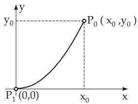

### 11.5 Singular Integral Equations

An integral equation is called a singular integral equation if the range of the integral in the equation is not finite, or if the kernel has singularities inside of the range of integration. It is to be supposed that the integrals exist as improper integrals, or as Cauchy principal values (see 8.2.3, p. 506f.). The properties and the conditions for the solutions of singular integral equations are very diferent from those in the case of “ordinary” integral equations. In the following sections only some special problems are discussed. For further discussions see [11.2], [11.3], [11.7], [11.8].

  
Figure 11.2

#### 11.5.1 Abel Integral Equation

One of the first applications of integral equations for a physical problem was considered by Abel. A particle is moving in a vertical plane along a curve under the influence only of gravity from the point $P _ { 0 } ( x _ { 0 } , y _ { 0 } )$ to the point $P _ { 1 } ( 0 , 0 )$ (Fig. 11.2).

The velocity of the particle at a point of the curve is

$$
v = { \frac { d s } { d t } } = \sqrt { 2 g ( y _ { 0 } - y ) } .\tag{11.68}
$$

The time of fall as a function of $y _ { 0 }$ is calculated by integration:

$$
T ( y _ { 0 } ) = \int _ { 0 } ^ { l } \frac { d s } { \sqrt { 2 g ( y _ { 0 } - y ) } } .\tag{11.69a}
$$

If s is considered as a function of $y ,$ i.e., $s = f ( y )$ , then

$$
T ( y _ { 0 } ) = \int _ { 0 } ^ { y _ { 0 } } { \frac { 1 } { \sqrt { 2 g } } } \cdot { \frac { f ^ { \prime } ( y ) } { \sqrt { y _ { 0 } - y } } } d y .\tag{11.69b}
$$

The next problem is to determine the shape of the curve as a function of $y _ { 0 }$ if the time of the fall is given. By substitution

$$
{ \sqrt { 2 g } } \cdot T ( y _ { 0 } ) = F ( y _ { 0 } ) \quad { \mathrm { a n d } } \quad f ^ { \prime } ( y ) = \varphi ( y )\tag{11.69c}
$$

and changing the notation of the variable $y _ { 0 }$ into $x ,$ a Volterra integral equation of the first kind is obtained:

$$
F ( x ) = \int _ { 0 } ^ { x } { \frac { \varphi ( y ) } { \sqrt { x - y } } } d y .\tag{11.69d}
$$

It is to be considered now the slightly more general equation

$$
f ( x ) = \int _ { a } ^ { x } { \frac { \varphi ( y ) } { ( x - y ) ^ { \alpha } } } d y \quad { \mathrm { w i t h } } \quad 0 < \alpha < 1 .\tag{11.70}
$$

The kernel of this equation is not bounded for $y = x$ . In (11.70), the variable $y$ is formally replaced by $\xi$ and the variable $x$ by $y .$ By these substitutions the solution is obtained in the form $\varphi = \varphi ( x )$ . If both sides of (11.70) are multiplied by the term $\frac { 1 } { ( x - y ) ^ { 1 - \alpha } }$ and integrated with respect to $y$ between the limits a and $x ,$ it yields the equation

$$
\int _ { a } ^ { x } { \frac { 1 } { ( x - y ) ^ { 1 - \alpha } } } \left( \int _ { a } ^ { y } { \frac { \varphi ( \xi ) } { ( y - \xi ) ^ { \alpha } } } d \xi \right) d y = \int _ { a } ^ { x } { \frac { f ( y ) } { ( x - y ) ^ { 1 - \alpha } } } d y .\tag{11.71a}
$$

Changing the order of integration on the left-hand side gives

$$
\int _ { a } ^ { x } \varphi ( \xi ) \left\{ \intop _ { \xi } ^ { x } \frac { d y } { ( x - y ) ^ { 1 - \alpha } ( y - \xi ) ^ { \alpha } } \right\} d \xi = \int _ { a } ^ { x } \frac { f ( y ) } { ( x - y ) ^ { 1 - \alpha } } d y .\tag{11.71b}
$$

The inner integral can be evaluated by the substitution $y = \xi + ( x - \xi ) u$

$$
\int _ { \xi } ^ { x } \frac { d y } { ( x - y ) ^ { 1 - \alpha } ( y - \xi ) ^ { \alpha } } = \int _ { 0 } ^ { 1 } \frac { d u } { u ^ { \alpha } ( 1 - u ) ^ { 1 - \alpha } } = \frac { \pi } { \sin ( \alpha \pi ) } .\tag{11.71c}
$$

This result is to be substituted into (11.71b). After diferentiation with respect to x one gets the function $\varphi ( x )$

$$
\varphi ( x ) = { \frac { \sin ( \alpha \pi ) } { \pi } } { \frac { d } { d x } } \int _ { a } ^ { x } { \frac { f ( y ) } { ( x - y ) ^ { 1 - \alpha } } } d y .\tag{11.71d}
$$

$$
{ \textbf { \em x } } = \int _ { 0 } ^ { x } { \frac { \varphi ( y ) } { \sqrt { x - y } } } d y , \quad \varphi ( x ) = { \frac { 1 } { \pi } } { \frac { d } { d x } } \int _ { 0 } ^ { x } { \frac { y } { \sqrt { x - y } } } d y = { \frac { 2 } { \pi } } { \sqrt { x } } .
$$

#### 11.5.2 Singular Integral Equation with Cauchy Kernel

##### 11.5.2.1 Formulation of the Problem

Consider the following integral equation:

$$
a ( x ) \varphi ( x ) + { \frac { 1 } { \pi \mathrm { i } } } \int _ { r } { \frac { K ( x , y ) } { y - x } } \varphi ( y ) d y = f ( x ) , \quad x \in r .\tag{11.72}
$$

$\varGamma$ is a system consisting of a finite number of smooth, simple closed curves in the complex plane such that they form a connected interior domain $S ^ { + }$ with $0 \in S ^ { \tilde { + } }$ and an exterior domain $S ^ { - }$ . Driving along

the curve there is $S ^ { + }$ always on the left-hand side of Γ. A function $u ( x )$ is H¨older continuous (or satisfies the H¨older condition) over Γ if for any pair $x _ { 1 } , x _ { 2 } \in T$ the relations

$$
| u ( x _ { 1 } ) - u ( x _ { 2 } ) | < K | x _ { 1 } - x _ { 2 } | ^ { \beta } , \quad 0 < \beta \leq 1 , \quad K > 0\tag{11.73}
$$

are valid. It is supposed that the functions $a ( x ) , f ( x )$ , and $\varphi ( x )$ are H¨older continuous with exponent $\beta _ { 1 }$ , and $K ( x , y )$ is H¨older continuous with respect to both variables with the exponents $\beta _ { 2 } > \beta _ { 1 }$ . The kernel $K ( \dot { x } , y ) ( y - x ) ^ { - 1 }$ has a strong singularity for $x = y$ . The integral exists as a Cauchy principal value. With $K ( x , x ) = b ( x )$ and $k ( x , y ) = { \frac { K ( x , y ) - K ( x , x ) } { y - x } }$ (11.72) holds in the form

$$
( { \mathcal { L } } \varphi ) ( x ) : = a ( x ) \varphi ( x ) + { \frac { b ( x ) } { \pi \mathrm { { i } } } } \int _ { } { \frac { \varphi ( y ) } { y - x } } d y + { \frac { 1 } { \pi \mathrm { { i } } } } \int k ( x , y ) \varphi ( y ) d y = f ( x ) , \quad x \in \Gamma .\tag{11.74a}
$$

The expression $( \mathcal { L } \varphi ) ( x )$ denotes the left-hand side of the integral equation in abbreviated form. $\mathcal { L }$ is a singular operator. The function $k ( x , y )$ is a weakly singular kernel. It is assumed that the normality condition $a { \hat { ( } } x ) ^ { 2 } - b ( x ) ^ { 2 } \neq 0 , x \in T$ holds. The equation

$$
( \mathcal { L } _ { 0 } \varphi ) ( x ) = a ( x ) \varphi ( x ) + \frac { b ( x ) } { \pi \mathrm { i } } \int \frac { \varphi ( y ) } { y - x } d y = f ( x ) , \quad x \in T ,\tag{11.74b}
$$

is the characteristic equation pertaining to (11.74a). The operator $\mathcal { L } _ { 0 }$ is the characteristic part of the operator ${ \mathcal { L } } .$ . The adjoint integral equation of (11.74a) yields the equality

$$
( { \mathcal { L } } ^ { \top } \psi ) ( y ) = a ( y ) \psi ( y ) - { \frac { b ( y ) } { \pi \mathrm { i } } } \int _ { } ^ { } { \frac { \psi ( x ) d x } { x - y } } + { \frac { 1 } { \pi \mathrm { i } } } \int _ { } \left( k ( x , y ) - { \frac { b ( x ) - b ( y ) } { x - y } } \right) \psi ( x ) d x\tag{11.74c}
$$

##### 11.5.2.2 Existence of a Solution

The equation $( { \mathcal { L } } \varphi ) ( x ) = f ( x )$ has a solution $\varphi ( x )$ if and only if for every solution $\psi ( y )$ of the homogeneous transposed equation $( \dot { \mathcal { L } } ^ { \top } \psi ) ( y ) = 0$ the condition of orthogonality

$$
\intop _ { T } f ( y ) \psi ( y ) d y = 0\tag{11.75a}
$$

is satisfied. Similarly, the transposed equation $( \mathcal { L } ^ { \top } \psi ) ( y ) = g ( y )$ has a solution if for every solution $\varphi ( x )$ of the homogeneous equation $( { \mathcal { L } } \varphi ) { \dot { ( } } x ) = 0$ the following is valid:

$$
\intop _ { T } g ( x ) \varphi ( x ) d x = 0 .\tag{11.75b}
$$

##### 11.5.2.3 Properties of Cauchy Type Integrals

The following function is called a Cauchy type integral over $T )$

$$
\varPhi ( z ) = \frac { 1 } { 2 \pi \mathrm { i } } \int \frac { \varphi ( y ) } { y - z } d y , \quad z \in \mathbb { C } ,\tag{11.76a}
$$

For z / Γ the integral exists in the usual sense and represents a holomorphic function (see 14.1.2, p. 732). Also $\varPhi ( \infty ) = 0$ holds. For $z = x \in T$ in (11.76a) is to be considered the Cauchy principal value

$$
( \mathcal { H } \varphi ) ( x ) = \frac { 1 } { 2 \pi \mathrm { i } } \int \frac { \varphi ( y ) } { y - x } d y , \quad x \in \varGamma .\tag{11.76b}
$$

The Cauchy type integral $\varPhi ( z )$ can be extended continuously over Γ from $S ^ { + }$ and from $S ^ { - }$ . The limits when approaching z the point $x \in T$ are denoted by $\varPhi ^ { + } ( x )$ and $\varPhi ^ { - } ( x )$ , respectively. The formulas of Plemelj and Sochozki are valid:

$$
\varPhi ^ { + } ( x ) = \frac { 1 } { 2 } \varphi ( x ) + ( \mathcal { H } \varphi ) ( x ) , \qquad \varPhi ^ { - } ( x ) = - \frac { 1 } { 2 } \varphi ( x ) + ( \mathcal { H } \varphi ) ( x ) .\tag{11.76c}
$$

##### 11.5.2.4 The Hilbert Boundary Value Problem

1. Relations

The solution of the characteristic integral equation and the Hilbert boundary value problem are strongly correlate. If $\varphi ( x )$ is a solution of (11.74b), then (11.76a) is a holomorphic function on $S ^ { + }$ and $S ^ { - }$ with $\varPhi ( \infty ) = 0$ . Because of the formulas of Plemelj and Sochozki (11.76c)

$$
\varphi ( x ) = \Phi ^ { + } ( x ) - \Phi ^ { - } ( x ) , \quad 2 ( { \mathcal { H } } \varphi ) ( x ) = \Phi ^ { + } ( x ) + \Phi ^ { - } ( x ) , \quad x \in \varGamma\tag{11.77a}
$$

holds. With the notation

$$
G ( x ) = { \frac { a ( x ) - b ( x ) } { a ( x ) + b ( x ) } } \quad { \mathrm { a n d } } \quad g ( x ) = { \frac { f ( x ) } { a ( x ) + b ( x ) } } ,\tag{11.77b}
$$

the characteristic integral equation has the form:

$$
\begin{array} { r } { \phi ^ { + } ( x ) = G ( x ) \varPhi ^ { - } ( x ) + g ( x ) , \quad x \in T . } \end{array}\tag{11.77c}
$$

2. Hilbert Boundary Value Problem

Looking for a function $\varPhi ( z )$ which is holomorphic on $S ^ { + }$ and $S ^ { - }$ , and vanishes at infinity, and satisfies the boundary conditions (11.77c) over Γ. A solution $\varPhi ( z )$ of the Hilbert problem can be given in the form (11.76a). So, as a consequence of the first equation of $\mathrm { ( 1 1 . 7 7 a ) }$ , a solution $\varphi ( x )$ of the characteristic integral equation is determined.

##### 11.5.2.5 Solution of the Hilbert Boundary Value Problem (in short: Hilbert Problem)

1. Homogeneous Boundary Conditions

$$
\begin{array} { r } { \varPhi ^ { + } ( x ) = G ( x ) \varPhi ^ { - } ( x ) , \quad x \in T . } \end{array}\tag{11.78}
$$

During a single circulation of the point x along the curve $\varGamma _ { l }$ the value of log $G ( x )$ changes by 2π $\mathrm { i } \lambda _ { l }$ where $\lambda _ { l }$ is an integer. The change of the value of the function log $G ( x )$ during a single traverse of the complete curve system $\varGamma$ is

$$
\sum _ { l = 0 } ^ { n } 2 \pi \mathrm { i } \lambda _ { l } = 2 \pi \mathrm { i } \kappa .\tag{11.79a}
$$

The number $\kappa = \sum _ { l = 0 } ^ { n } \lambda _ { l }$ is called the index ofthe Hilbert problem. Now it is to compose a function

$$
G _ { 0 } ( x ) = ( x - a _ { 0 } ) ^ { - \kappa } \Pi ( x ) G ( x )\tag{11.79b}
$$

$$
\Pi ( x ) = ( x - a _ { 1 } ) ^ { \lambda _ { 1 } } ( x - a _ { 2 } ) ^ { \lambda _ { 2 } } \cdot \cdot \cdot ( x - a _ { n } ) ^ { \lambda _ { n } } ,\tag{11.79c}
$$

where $a _ { 0 } \in S ^ { + }$ and $a _ { l } \ ( l = 1 , \ldots , n )$ are arbitrarily fixed points inside $\varGamma _ { l }$ . If $\varGamma = \varGamma _ { 0 }$ is a simple closed curve $( n = 0 )$ , then one defines $\Pi ( x ) = 1$ . With

$$
I ( z ) : = { \frac { 1 } { 2 \pi \mathrm { i } } } \int { \frac { \log G _ { 0 } ( y ) } { y - z } } d y\tag{11.79d}
$$

the following particular solution of the homogeneous Hilbert problems is obtained, which is called the fundamental solution:

$$
X ( z ) = \left\{ \Pi ^ { - 1 } ( z ) \exp { I ( z ) } \quad { \mathrm { f o r } } \ z \in S ^ { + } , \right.\tag{11.79e}
$$

This function doesn’t vanish for any finite z. The most general solution of the homogeneous Hilbert problem, which vanishes at infinity, for $\kappa > 0$ is

$$
\varPhi _ { h } ( z ) = X ( z ) P _ { \kappa - 1 } ( z ) , \quad z \in \mathbb { C }\tag{11.80}
$$

with an arbitrary polynomial $P _ { \kappa - 1 } ( z )$ of degree at most $( \kappa - 1 )$ . For $\kappa \leq 0$ there exists onl the trivial solution $\Phi _ { h } ( z ) = 0$ which satisfies the condition $\Phi _ { h } ( \infty ) \stackrel { \cdot } { = } 0$ , so in this case $P _ { \kappa - 1 } ( z ) \equiv 0$ . For $\kappa > 0$ the homogeneous Hilbert problem has κ linearly independent solutions vanishing at infinity.

2. Inhomogeneous Boundary Conditions

The solution of the inhomogeneous Hilbert problem is the following:

$$
\varPhi ( z ) = X ( z ) R ( z ) + \varPhi _ { h } ( z ) \qquad ( 1 1 . 8 1 ) \quad \mathrm { w i t h } \quad R ( z ) = \frac { 1 } { 2 \pi \mathrm { i } } \int \frac { g ( y ) d y } { X ^ { + } ( y ) ( y - z ) } .\tag{11.82}
$$

If $\kappa < 0$ holds, for the existence of a solution vanishing at infinity the following necessary and suficient conditions must be fulfilled:

$$
\int \displaylimits _ { r } \frac { y ^ { k } g ( y ) d y } { X ^ { + } ( y ) } = 0 \quad ( k = 0 , 1 , \dots , - \kappa - 1 ) .\tag{11.83}
$$

##### 11.5.2.6 Solution of the Characteristic Integral Equation

1. Homogeneous Characteristic Integral Equation

If $\varPhi _ { h } ( z )$ is the solution of the corresponding homogeneous Hilbert problem, from (11.77a) follows the solution of the homogeneous integral equation

$$
\varphi _ { h } ( x ) = \varPhi _ { h } ^ { + } ( x ) - \varPhi _ { h } ^ { - } ( x ) , \quad x \in { \varGamma } .\tag{11.84a}
$$

For $\kappa \leq 0$ only the trivial solution $\varphi _ { h } ( x ) = 0$ exists. For $\kappa > 0$ the general solution is

$$
\varphi _ { h } ( x ) = [ X ^ { + } ( x ) - X ^ { - } ( x ) ] P _ { \kappa - 1 } ( x )\tag{11.84b}
$$

with a polynomial $P _ { \kappa - 1 }$ of degree at most $\kappa - 1$

2. Inhomogeneous Characteristic Integral Equation

If $\varPhi ( z )$ is a general solution of the inhomogeneous Hilbert problem, the solution of the inhomogeneous integral equation can be given by (11.77a):

$$
\begin{array} { l } { { \varphi ( x ) = \displaystyle \varPhi ^ { + } ( x ) - \varPhi ^ { - } ( x ) } } \\ { { \mathrm { } ~ = X ^ { + } ( x ) R ^ { + } ( x ) - X ^ { - } ( x ) R ^ { - } ( x ) + \varPhi _ { h } ^ { + } ( x ) - \varPhi _ { h } ^ { - } ( x ) , ~ x \in { \varGamma } . } } \end{array}\tag{11.85a}
$$

(11.85b)

Using the formulas of Plemelj and Sochozki (11.76c) for $R ( z )$ holds

$$
R ^ { + } ( x ) = \frac { 1 } { 2 } \frac { g ( x ) } { X ^ { + } ( x ) } + \left( \mathcal { H } \frac { g } { X ^ { + } } \right) ( x ) , \quad R ^ { - } ( x ) = - \frac { 1 } { 2 } \frac { g ( x ) } { X ^ { + } ( x ) } + \left( \mathcal { H } \frac { g } { X ^ { + } } \right) ( x ) .\tag{11.85c}
$$

Substituting (11.85c) into (11.85a) and considering (11.76b) and $g ( x ) = f ( x ) / ( a ( x ) + b ( x ) )$ finally results in the the solution:

$$
\begin{array} { l } { \displaystyle \varphi ( x ) = \frac { X ^ { + } ( x ) + X ^ { - } ( x ) } { 2 ( a ( x ) + b ( x ) ) X ^ { + } ( x ) } f ( x ) } \\ { \displaystyle \qquad + ( X ^ { + } ( x ) - X ^ { - } ( x ) ) \frac { 1 } { 2 \pi \mathrm { i } } \int \frac { f ( y ) } { ( a ( y ) + b ( y ) ) X ^ { + } ( y ) ( y - x ) } d y + \varphi _ { h } ( x ) , \quad x \in { \cal T } . } \end{array}\tag{11.86}
$$

According to (11.83) in the case $\kappa < 0$ the following relations must hold simultaneously in order to ensure the existence of a solution:

$$
\int \frac { y ^ { k } f ( y ) } { ( a ( y ) + b ( y ) ) X ^ { + } ( y ) } d y = 0 \quad ( k = 0 , 1 , \ldots , - \kappa - 1 ) .\tag{11.87}
$$

The characteristic integral equation is given with constant coeficients a and b:

$a \varphi ( x ) + { \frac { b } { \pi \mathrm { i } } } \int _ { r } { \frac { \varphi ( y ) } { y - x } } d y = f ( x )$ . Here Γ is a simple closed curve, i.e., ${ \Gamma } = { { T } _ { 0 } } \left( { n } = 0 \right)$ . From (11.77b)

follows $G = { \frac { a - b } { a + b } } { \mathrm { ~ a n d ~ } } g ( x ) = { \frac { f ( x ) } { a + b } }$ . G is a constant, consequently $\kappa = 0$ . Therefore, $\Pi ( x ) = 1$ and

$$
G _ { 0 } = G = \frac { a - b } { a + b } \cdot \quad \quad I ( z ) = \log \frac { a - b } { a + b } \frac { 1 } { 2 \pi \mathrm { i } } \int \frac { 1 } { r } \frac { \ d z } { y - z } d y = \left\{ \log \frac { a - b } { a + b } , z \in S ^ { + } , \frac { \ d z } { z } \right\} ^ { - } \frac { \ d z } { y - z } d z ,
$$

$$
X ( z ) = \left\{ { \frac { a - b } { a + b } } , z \in S ^ { + } , \ \quad { \mathrm { i . e . , } } \quad X ^ { + } = { \frac { a - b } { a + b } } , X ^ { - } = 1 . \right.
$$

Since $\kappa = 0$ holds, the homogeneous Hilbert boundary value problem has only the function $\varPhi _ { h } ( z ) = 0$ as the solution vanishing at infinity. From (11.86) follows

$$
\varphi ( x ) = { \frac { X ^ { + } + X ^ { - } } { 2 ( a + b ) X ^ { + } } } f ( x ) + { \frac { X ^ { + } - X ^ { - } } { 2 ( a + b ) X ^ { + } } } { \frac { 1 } { \pi \mathrm { i } } } \int _ { \gamma } \cdots d y = { \frac { a } { a ^ { 2 } - b ^ { 2 } } } f ( x ) - { \frac { b } { a ^ { 2 } - b ^ { 2 } } } { \frac { 1 } { \pi \mathrm { i } } } \int _ { \gamma } { \frac { f ( y ) } { y - x } } d y .
$$
