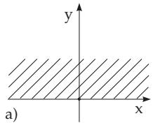
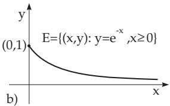
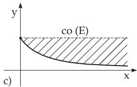
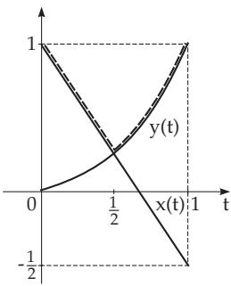
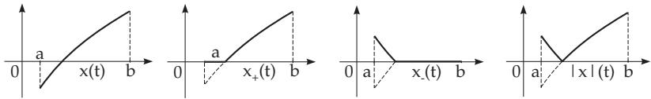

### 12.1 Vector Spaces

#### 12.1.1 Notion of a Vector Space

A non-empty set V is called a vector space or linear space over the field IF of scalars if there exist two operations on V – addition of the elements and multiplication by scalars from IF – such that they have the following properties:

1. for any two elements $x , y \in \mathrm { V }$ , there exists an element $z = x + y \in \mathrm { V }$ , which is called their sum.

2. For every $x \in \mathrm { V }$ and every scalar (number) $\alpha \in \mathbb { F }$ there exists an element $\alpha x \in \mathbb { V }$ , the product of x and the scalar α so that the following properties, the axioms of vector spaces (see also 5.3.8.1, p. 365), are satisfied for arbitrary elements $x , y , z \in \mathrm { V }$ and scalars $\alpha , \beta \in \mathbb { F }$

$$
( \mathbf { V 1 } ) \quad x + ( y + z ) = ( x + y ) + z .\tag{12.1}
$$

$$
( \mathbf { V } 2 ) \quad { \mathrm { T h e r e ~ e x i s t s ~ a n ~ e l e m e n t ~ } } 0 \in \mathrm { V } , { \mathrm { ~ t h e ~ z e r o ~ e l e m e n t } } , { \mathrm { s u c h ~ t h a t ~ } } x + 0 = x .\tag{12.2}
$$

$$
\mathbf { ( V 3 ) } \quad { \mathrm { T o ~ e v e r y ~ v e c t o r ~ } } x { \mathrm { ~ t h e r e ~ i s ~ a ~ v e c t o r ~ } } - x { \mathrm { ~ s u c h ~ t h a t ~ } } x + ( - x ) = 0 .\tag{12.3}
$$

$$
( \mathbf { V 4 } ) \quad x + y = y + x .\tag{12.4}
$$

$$
( \mathbf { V } 5 ) \quad 1 \cdot x = x , \quad 0 \cdot x = 0 .\tag{12.5}
$$

$$
\begin{array} { r l } { ( \mathbf { V 6 } ) } & { { } \alpha ( \beta x ) = ( \alpha \beta ) x . } \end{array}\tag{12.6}
$$

$$
\begin{array} { r l } { ( \mathbf { V } \mathbf { 7 } ) } & { { } ( \alpha + \beta ) x = \alpha x + \beta x . } \end{array}\tag{12.7}
$$

$$
( \mathbf { V 8 } ) \quad { \boldsymbol { \alpha } } ( x + y ) = { \boldsymbol { \alpha } } x + { \boldsymbol { \alpha } } y .\tag{12.8}
$$

\- Springer-Verlag Berlin Heidelberg 2015

654

I.N. Bronshtein et al., Handbook of Mathematics,

DOI 10.1007/978-3-662-46221-8\_12

V is called a real or complex vector space, depending on whether IF is the field IR of real numbers or the field C of complex numbers. The elements of V are also called either points or, according to linear algebra, vectors. The vector notation $\vec { x }$ or $\underline { { x } }$ is not used in functional analysis.

The diference $x - y$ of two arbitrary vectors $x , y \in \mathrm { V }$ also can be defined in V as $x - y = x + ( - y )$ From the previous definition, it follows that the equation $x + y = z$ can be solved uniquely for arbitrary elements y and z. The solution is $x = z - y$ . Further properties follow from axioms (V1)–(V8):

the zero element is uniquely defined,

$\alpha x = \beta x$ and $x \neq 0$ , imply $\alpha = \beta$

$\alpha x = \alpha y$ and $\alpha \neq 0$ , imply $x = y .$

$- ( \alpha x ) = \alpha \cdot ( - x )$

#### 12.1.2 Linear and Affine Linear Subsets

1. Linear Subsets

A non-empty subset $\mathrm { v _ { 0 } }$ of a vector space V is called a linear subspace or a linear manifold of V if together with two arbitrary elements $x , y \in \mathrm { V } _ { 0 }$ and two arbitrary scalars $\alpha , \beta \in \mathbb { F }$ , their linear combination $\alpha x + \beta y$ is also in $\mathrm { { V } _ { 0 } . \mathrm { { V } _ { 0 } } }$ is a vector space in its own right, and therefore satisfies the axioms $( \mathbf { V 1 } ) -$ $\mathbf { ( V 8 ) }$ . The subspace $\mathrm { v _ { 0 } }$ can be V itself or only the zero point. In these cases the subspace is called trivial.

2. Afine Subspaces

A subset of a vector space V is called an afine linear subspace or an afine manifold if it has the form

$$
\{ x _ { 0 } + y : y \in \mathbb { V } _ { 0 } \}\tag{12.9}
$$

where $x _ { 0 } \in \mathrm { V }$ is a given element and $\mathrm { v _ { 0 } }$ is a linear subspace. It can be considered (in the case $x _ { 0 } \neq 0 )$ as the generalization of the lines or planes not passing through the origin in $\mathbb { R } ^ { 3 }$

3. The Linear Hull

The intersection of an arbitrary number of subspaces in V is also a subspace. Consequently, for every non-empty subset $E \subset \mathbb { V }$ , there exists a smallest linear subset $l i n ( E )$ or $[ E ]$ in V containing $E ,$ , namely the intersection of all the linear subspaces, which contain E. The set $l i n ( \bar { E } )$ is called the linear hull of the set $E ,$ , or the linear subspace generated by the set E. It coincides with the set of all (finite) linear combinations

$$
\alpha _ { 1 } x _ { 1 } + \alpha _ { 2 } x _ { 2 } + . . . + \alpha _ { n } x _ { n } ,\tag{12.10}
$$

comprised of elements $x _ { 1 } , x _ { 2 } , \ldots , x _ { n } \in E$ and scalars $\alpha _ { 1 } , \alpha _ { 2 } , \ldots , \alpha _ { n } \in \mathbb { F }$

4. Examples for Vector Spaces of Sequences

A Vector Space $\mathbb { F } ^ { n }$ : Let n be a given natural number and V the set of all n-tuples, i.e., all finite sequences consisting of n scalar terms $\{ ( \xi _ { 1 } , \ldots , \xi _ { n } ) : \xi _ { i } \in \mathbb { F } , i = 1 , \ldots , n \}$ . The operations will be defined componentwise or termwise, i.e., if ${ \boldsymbol { x } } = ( \xi _ { 1 } , \dots , \xi _ { n } )$ and $y = ( \eta _ { 1 } , \dotsc , \eta _ { n } )$ are two arbitrary elements from V and α is an arbitrary scalar, $\alpha \in \mathbb { F }$ , then

$$
x + y = ( \xi _ { 1 } + \eta _ { 1 } , \ldots , \xi _ { n } + \eta _ { n } ) , ( 1 2 . 1 1 \mathrm { a } )
$$

$$
\alpha \cdot x = ( \alpha \xi _ { 1 } , \ldots , \alpha \xi _ { n } ) .\tag{12.11b}
$$

In this way, the vector space $\mathbb { F } ^ { n }$ is defined. The linear spaces IR or C are special cases for $n = 1$

This example can be generalized in two diferent ways (see examples B and C).

B Vector Space s of all Sequences: Considering the infinite sequences as elements $x = \{ \xi _ { n } \} _ { n = 1 } ^ { \infty }$ $\xi _ { n } \in \mathbb { F }$ and defining the operations componentwise, similar to (12.11a) and (12.11b), the vector space s of all sequences are obtained.

C Vector Space $\varphi ( \mathbf { a l s o c _ { 0 0 } } )$ of all Finite Sequences: Let V be the subset of all elements of s containing only a finite number of non-zero components, where the number of non-zero components depends on the element. This vector space – the operations are again introduced termwise – is denoted by $\varphi$ or also by $\mathbf { c _ { 0 0 } }$ , and it is called the space of all finite sequences ofnumbers.

D Vector Space m (also l∞) of all Bounded Sequences: A sequence $x = \{ \xi _ { n } \} _ { n = 1 } ^ { \infty }$ belongs to m if and only if there exists $C _ { x } > 0$ with $| \xi _ { n } | \leq C _ { x } , \forall n = 1 , 2 , . . .$ . This vector space is also denoted by l∞.

E Vector Space c of all Convergent Sequences: A sequence $x = \{ \xi _ { n } \} _ { n = 1 } ^ { \infty }$ belongs to c if and only if there exists a number $\xi _ { 0 } \in \mathbb { F }$ such that for $\forall \varepsilon > 0$ there exists an index $n _ { 0 } = n _ { 0 } ( \varepsilon )$ such that for all $n > n _ { 0 }$ one has $| \xi _ { n } - \xi _ { 0 } | < \varepsilon$ (see 7.1.2, p. 458).

F Vector Space $\mathbf { c _ { 0 } }$ of all Null Sequences: The vector space $\mathbf { c _ { 0 } }$ of all null sequences, i.e., the subspace of c consisting of all sequences converging to zero $( \xi _ { 0 } = 0 )$

G Vector Space lp: The vector space of all sequences $x = \{ \xi _ { n } \} _ { n = 1 } ^ { \infty }$ such that $\textstyle \sum _ { n = 1 } ^ { \infty } | \xi _ { n } | ^ { p }$ is convergent, is denoted by ${ \mathrm { l } } ^ { p } \ \left( 1 \leq p < \infty \right)$

It can be shown by the Minkowski inequality that the sum of two sequences from $\mathrm { l } ^ { p }$ also belongs to $1 ^ { p } ,$ (see 1.4.2.13, p. 32).

Remark: For the vector spaces introduced in examples A–G, the following inclusions hold:

$$
\varphi \subset \mathbf { c _ { 0 } } \subset \mathbf { c } \subset \mathbf { m } \subset \mathbf { s } \quad { \mathrm { a n d } } \quad \varphi \subset \mathbb { P } \subset \mathbb { I } ^ { q } \subset \mathbf { c _ { 0 } } , \quad { \mathrm { w h e r e } } \quad 1 \leq p < q < \infty .\tag{12.12}
$$

5. Examples of Vector Spaces of Functions

A Vector Space $\mathcal { F } ( T )$ : Let V be the set of all real or complex valued functions defined on a given set T, where the operations are defined point-wise, i.e., if $x = x ( t )$ and $y = y ( t )$ are two arbitrary elements of V and $\alpha \in \mathbb { F }$ is an arbitrary scalar, then we define the elements (functions) $x + y$ and $\alpha \cdot x$ by the rules

$$
\begin{array} { l } { ( x + y ) ( t ) = x ( t ) + y ( t ) \quad \forall t \in T , } \\ { ( \alpha x ) ( t ) = \alpha \cdot x ( t ) \quad \forall t \in T . } \end{array}\tag{12.13a}
$$

(12.13b)

This vector space is denoted by $\mathcal { F } ( T )$

Some of the subspaces are introduced in the following examples.

B Vector Space $B ( T )$ or $\mathcal M ( T )$ : The space $B ( T )$ is the space of all functions bounded on T. This vector space is often denoted by ${ \dot { \mathcal { M } } } ( T )$ . In the case of $T = \tilde { \mathbb { N } }$ , one gets the space $\mathcal { M } ( \mathbb { N } ) = { \bf m }$ from example D of the previous paragraph.

C Vector Space $c ( [ a , b ] )$ : The set $\mathcal { C } ( [ a , b ] )$ of all functions continuous on the interval $[ a , b ]$ (see 2.1.5.1, p. 58).

D Vector Space $\mathcal { C } ^ { ( k ) } ( [ a , b ] )$ : Let $k \in \mathbb { N } , \ k \geq 1$ . The set $\mathcal { C } ^ { ( k ) } ( [ a , b ] )$ of all functions k-times continuously diferentiable on [a, b] (see 6.1, p. 432–437) is a vector space. At the endpoints a and b of the interval $[ a , b ]$ , the derivatives have to be considered as right-hand and left-hand derivatives, respectively.

Remark: For the vector spaces of examples A–D of this paragraph, and $T = [ a , b ]$ the following subspace relations hold:

$$
\begin{array} { r } { \mathcal { C } ^ { ( k ) } ( [ a , b ] ) \subset \mathcal { C } ( [ a , b ] ) \subset \mathcal { B } ( [ a , b ] ) \subset \mathcal { F } ( [ a , b ] ) . } \end{array}\tag{12.14}
$$

E Vector Subspace of $\mathcal { C } ( [ a , b ] )$ : For any given point $t _ { 0 } \in [ a , b ]$ , the set $\{ x \in \mathcal { C } ( [ a , b ] ) \colon x ( t _ { 0 } ) = 0 \}$ forms a linear subspace of $\mathcal { C } ( [ a , b ] )$

#### 12.1.3 Linearly Independent Elements

1. Linear Independence

A finite subset $\{ x _ { 1 } , \ldots , x _ { n } \}$ of a vector space V is called linearly independent if

$$
\alpha _ { 1 } x _ { 1 } + \cdot \cdot \cdot + \alpha _ { n } x _ { n } = 0 \mathrm { \quad i m p l i e s \quad } \alpha _ { 1 } = \cdot \cdot \cdot = \alpha _ { n } = 0 .\tag{12.15}
$$

Otherwise, it is called linearly dependent. If $\alpha _ { 1 } = \cdots = \alpha _ { n } = 0$ , then for arbitrary vectors $x _ { 1 } , \ldots , x _ { n }$ from V, the vector $\alpha _ { 1 } x _ { 1 } + \cdot \cdot \cdot + \alpha _ { n } x _ { n }$ is trivially the zero element of V. Linear independence of the vectors $x _ { 1 } , \ldots , x _ { n }$ means that the only way to produce the zero element $0 = \alpha _ { 1 } x _ { 1 } + \cdot \cdot \cdot + \alpha _ { n } x _ { n }$ is when all coeficients are equal to zero $\alpha _ { 1 } = \cdots = \alpha _ { n } = 0$ . This important notion is well known from linear algebra (see 5.3.8.2, p. 366) and was used e.g. for the definition of a fundamental system of solutions of linear homogeneous diferential equations (see 9.1.2.3, 2., p. 553). An infinite subset $E \subset \mathbb { V }$ is called linearly independent if every finite subset of E is linearly independent. Otherwise, E is called linearly dependent.

If the sequence whose k-th term is equal to 1 and all the others are 0 is denoted by $e _ { k }$ , then belongs $e _ { k }$ to the space ϕ and consequently to any space of sequences. The set $\{ e _ { 1 } , e _ { 2 } , . . . \}$ is linearly independent in every one of these spaces. In the space ${ \mathcal { C } } ( [ 0 , \pi ] )$ ), e.g., the system of functions

1, sin nt, cos nt $( n = 1 , 2 , 3 , . . . )$

is linearly independent, but the functions 1, cos $2 t , \cos ^ { 2 } t$ are linearly dependent (see (2.97), p. 81).

2. Basis and Dimension of a Vector Space

A linearly independent subset B from V, which generates the whole space $\mathrm { V , i . e . , } l i n ( B ) = \mathrm { V }$ holds, is called an algebraic basis or a Hamel basis of the vector space V (see 5.3.8.2, p. 366). $B = \{ x _ { \xi } : \xi \in \Xi \}$ is a basis of V if and only if every vector $x \in \mathbb { V }$ can be written in the form $x = \sum _ { \xi \in \Xi } \alpha _ { \xi } x _ { \xi }$ , where the

coeficients $\alpha _ { \xi }$ are uniquely determined by x and only a finite number of them (depending on x) can be diferent from zero. Every non-trivial vector space $\mathrm { \bar { V } , i . e . , V \neq \{ 0 \} }$ , has at least one algebraic basis, and for every linearly independent subset E of V, there exists at least one algebraic basis of V, which contains this subset of E.

A vector space V is m-dimensional if it possesses a basis consisting of m vectors. That is, there exist m linearly independent vectors in V, and every system of $m + 1$ vectors is linearly dependent.

A vector space is infinite dimensional if it has no finite basis, i.e., if for every natural number m there are m linearly independent vectors in V.

The space $\mathbb { F } ^ { n }$ is n-dimensional, and all the other spaces in examples B–E are infinite dimensional. The subspace $l i n ( \{ 1 , t , t ^ { 2 } \} ) \subset \mathcal { C } ( [ a , b ] )$ is three-dimensional

In the finite dimensional case, every two bases of the same vector space have the same number of elements. Also in an infinite dimensional vector space any two bases have the same cardinality, which is denoted by dim(V). The dimension is an invariant quantity of the vector space, it does not depend on the particular choice of an algebraic basis.

#### 12.1.4 Convex Subsets and the Convex Hull

##### 12.1.4.1 Convex Sets

A subset C of a real vector space V is called convex if for every pair of vectors $x , y \in C$ all vectors of the form $\lambda x + ( 1 - \lambda ) y , 0 \leq \lambda \leq 1$ , also belong to C. In other words, the set C is convex, if for any two elements x and y, the whole line segment

$$
\{ \lambda x + ( 1 - \lambda ) y : 0 \leq \lambda \leq 1 \} ,\tag{12.16}
$$

(which is also called an interval), belongs to C. (For examples of convex sets in $\mathbb { R } ^ { 2 }$ see the sets denoted by A and B in Fig. 12.5, p. 684.)

The intersection of an arbitrary number of convex sets is also a convex set, where the empty set is agreed to be convex. Consequently, for every subset $E \subset \mathbb { V }$ there exists a smallest convex set which contains $E _ { i }$ , namely, the intersection of all convex subsets of V containing E. It is called the convex hull of the set E and it is denoted by co (E). co (E) is identical to the set of all finite convex linear combinations of elements from E, i.e., co (E) consists of all elements of the form $\lambda _ { 1 } x _ { 1 } + \cdot \cdot \cdot + \lambda _ { n } x _ { n }$ , where $x _ { 1 } , \ldots , x _ { n }$ are arbitrary elements from E and $\lambda _ { i } \in [ 0 , 1 ]$ satisfy the equality $\lambda _ { 1 } + \cdots + \lambda _ { n } = 1$ . Linear and afine subspaces are always convex.

##### 12.1.4.2 Cones

A non-empty subset C of a (real) vector space V is called a convex cone if it satisfies the following properties:

1. C is a convex set.

2. From $x \in C$ and $\lambda \geq 0$ , it follows that $\lambda x \in C$

3. From $x \in C$ and $- x \in C$ , it follows that $x = 0$

A cone can be characterized also by 3. together with

$$
x , y \in C \quad { \mathrm { a n d } } \quad \lambda , \mu \geq 0 \quad { \mathrm { i m p l y } } \quad \lambda x + \mu y \in C .\tag{12.17}
$$

A: The set $\mathbb { R } _ { + } ^ { n }$ of all vectors $x = ( \xi _ { 1 } , \ldots , \xi _ { n } )$ with non-negative components is a cone in $\mathbb { R } ^ { n }$

B: The set $\mathcal { C } _ { + }$ of all real continuous functions on $[ a , b ]$ with only non-negative values is a cone in the space $\mathcal { C } ( [ a , b ] )$ .

C: The set of all sequences of real numbers $\{ \xi _ { n } \} _ { n = 1 } ^ { \infty }$ with only non-negative terms, i.e., $\xi _ { n } \ge 0 , \forall n .$ is a cone in s. Analogously, cones are obtained in the spaces of examples C–G in 12.1.2, p. 655, if the sets of non-negative sequences are considered in these spaces.

D: The set $C \subset \mathsf { l } ^ { p } \left( 1 \leq p < \infty \right)$ , consisting of all sequences $\{ \xi _ { n } \} _ { n = 1 } ^ { \infty }$ , such that for some $a > 0$

$$
\sum _ { n = 1 } ^ { \infty } | \xi _ { n } | ^ { p } \leq a\tag{12.18}
$$

is a convex set in lp, but obviously, not a cone.

E: Examples from $\mathbb { R } ^ { 2 }$ see Fig. 12.1: a) convex set, not a cone, b) not convex, c) convex hull.

  
Figure 12.1

#### 12.1.5 Linear Operators and Functionals

##### 12.1.5.1 Mappings

A mapping $T \colon D \longrightarrow \mathbb { Y }$ from the set $D \subset \mathrm { X }$ into the set Y is called

injective, if

$$
T ( x ) = T ( y ) \Longrightarrow x = y ,\tag{12.19}
$$

surjective, if for

$\forall y \in \mathbb { Y }$ there exists an element $x \in D$ such that $T ( x ) = y$

(12.20)

bijective, if T is both injective and surjective.

D is called the domain of the mapping $T$ and is denoted by $D _ { T } \ \mathrm { o r } \ D ( T )$ , while the subset $\{ y \in \mathbb { Y }$ : $\exists x \in D _ { T }$ with $T ( x ) = y \}$ of Y is called the range of the mapping $T$ and is denoted by $\mathcal { R } ( T )$ or $I m ( T )$ .

##### 12.1.5.2 Homomorphism and Endomorphism

Let X and Y be two vector spaces over the same field IF and D a linear subset of X. A mapping $T$ $D \longrightarrow \mathbb { Y }$ is called linear (or a linear transformation, linear operator or homomorphism), if for arbitrary $x , y \in D$ and $\alpha , \beta \in \mathbb { F }$

$$
T ( \alpha x + \beta y ) = \alpha T x + \beta T y .\tag{12.21}
$$

For a linear operator T the notation Tx is preferred, which is similarly used for linear functions, while the notation $\bar { T } ( x )$ is used for general operators.

The range $\mathcal { R } ( T )$ is the set of all $y \in \mathrm { ~ Y ~ }$ such that the equation $T x \ = \ y$ has at least one solution.   
$N ( T ) = \{ x \in \mathbf { X } : T x = 0 \}$ is the null space or kernel of the operator T and is also denoted by ker(T).

A mapping of the vector space X into itself is called an endomorphism. If T is an injective linear mapping, then the mapping defined on $\mathcal { R } ( T )$ by

y x, such that $T x = y , y \in \mathcal { R } ( T )$

(12.22)

is linear. It is denoted by $T ^ { - 1 } \colon { \mathcal { R } } ( T ) \longrightarrow \mathrm { X }$ and is called the inverse of T. If Y is the vector space IF, then a linear mapping $f \colon \mathrm { X } \longrightarrow \mathbb { F }$ is called a linear functional or a linear form.

##### 12.1.5.3 Isomorphic Vector Spaces

A bijective linear mapping T: $\Chi \longrightarrow \Upsilon$ is called an isomorphism of the vector spaces X and Y. Two vector spaces are called isomorphic provided an isomorphism exists.

#### 12.1.6 Complexification of Real Vector Spaces

Every real vector space V can be extended to a complex vector space $\tilde { \mathrm { V } } .$ . The set $\tilde { \mathrm { V } }$ consists of all pairs $( x , y )$ with $x , y \in { \bar { \mathrm { V } } }$ . The operations (addition and multiplication by a complex number $a + \mathrm { i } b \in \mathbb { C } )$ are defined as follows:

$$
( x _ { 1 } , y _ { 1 } ) + ( x _ { 2 } , y _ { 2 } ) = ( x _ { 1 } + x _ { 2 } , y _ { 1 } + y _ { 2 } ) , ( 1 2 . 2 3 \mathrm { a } ) \qquad ( a + \mathrm { i } b ) ( x , y ) = ( a x - b y , b x + a y ) .\tag{.(12.23b}
$$

Since the special relations

$$
( x , y ) = ( x , 0 ) + ( 0 , y ) { \mathrm { ~ a n d ~ } } { \mathrm { i } } ( y , 0 ) = ( 0 + { \mathrm { i } } 1 ) ( y , 0 ) = ( 0 \cdot y - 1 \cdot 0 , 1 y + 0 \cdot 0 ) = ( 0 , y )\tag{12.24}
$$

hold, the pair $( x , y )$ can also be written as $x + \mathrm { i } y$ . The set $\tilde { \mathrm { V } }$ is a complex vector space, where the set V is identified with the linear subspace $\tilde { \mathrm { V } } _ { 0 } = \{ ( x , 0 ) \colon x \in \mathrm { V } \}$ , i.e., $x \in \mathbb { V }$ is considered as $( x , 0 )$ or as $x + \mathrm { i 0 }$

This procedure is called the complexification of the vector space V. A linearly independent subset in V is also linearly independent in $\tilde { \mathbb { V } }$ . The same statement is valid for a basis in V, so $d i m ( \mathbf { V } ) = d i m ( \tilde { \mathbf { V } } )$ .

#### 12.1.7 Ordered Vector Spaces

##### 12.1.7.1 Cone and Partial Ordering

If a cone C is fixed in a vector space V, then an order can be introduced for certain pairs of vectors in V. Namely, if $x - y \in C$ for some $x , y \in \mathrm { V }$ then one writes $x \geq y$ or $y \leq x$ and say x is greater than or equal to y or y is smaller than or equal to x. The pair $( \mathbb { V } , C )$ is called an ordered vector space or a vector space partially ordered by the cone C. An element x is called positive, if $x \geq 0$ or, which means the same, if $\bar { x } \in C$ holds. Moreover

$$
C = \{ x \in \mathbb { V } \colon x \geq 0 \} .\tag{12.25}
$$

If the vector space $\mathbb { R } ^ { 2 }$ ordered by its first quadrant as the cone $C ( = \mathbb { R } _ { + } ^ { 2 } )$ is under consideration, then a typical phenomenon of ordered vector spaces will be seen. This is referred to as “partially ordered” or sometimes as “semi-ordered”. Namely, only certain pairs of two vectors are comparable. Considering the vectors $x = ( 1 , - 1 )$ and $y = ( 0 , 2 )$ , neither the vector $x - y = ( 1 , - 3 )$ nor $y - x = ( - 1 , 3 )$ is in $C ,$ so neither $x \geq y$ nor $x \le y$ holds. An ordering in a vector space, generated by a cone, is always only a partial ordering.

It can be shown that the binary relation  has the following properties:

$$
( \mathbf { O 1 } ) \quad x \geq x \forall x \in \mathrm { V }
$$

$$
( \mathrm { r e f l e x i v i t y } ) .\tag{12.26}
$$

$$
( \mathbf { O 2 } ) \quad x \geq y { \mathrm { ~ a n d ~ } } y \geq z { \mathrm { ~ i m p l y ~ } } x \geq z { \mathrm { ~ ( t r a n s i t i v i t y ) . } }\tag{12.27}
$$

$$
( \mathbf { O 3 } ) \quad x \geq y { \mathrm { ~ a n d ~ } } \alpha \geq 0 , \ \alpha \in \mathbb { R } , \ \operatorname { i m p l y } \ \alpha x \geq \alpha y .\tag{12.28}
$$

$$
( \mathbf { O 4 } ) \quad x _ { 1 } \geq y _ { 1 } { \mathrm { ~ a n d ~ } } x _ { 2 } \geq y _ { 2 } { \mathrm { ~ i m p l y ~ } } x _ { 1 } + x _ { 2 } \geq y _ { 1 } + y _ { 2 } .\tag{12.29}
$$

Conversely, if in a vector space V there exists an ordering relation, i.e., a binary relation $\geq$ is defined for certain pairs of elements and satisfies axioms (O1)–(O4), and if one puts

$$
\begin{array} { r } { \mathrm { V } _ { + } = \{ x \in \mathrm { V } \colon x \geq 0 \} , } \end{array}\tag{12.30}
$$

then it can be shown that $\mathrm { V } _ { + }$ is a cone. The order $\geq _ { V _ { + } }$ in V induced by $\mathrm { v } _ { + }$ is identical to the original order $\geq ;$ consequently, the two possibilities of introducing an order in a vector space are equivalent. A cone $\dot { C } \subset \mathbb { V }$ is called generating or reproducing if every element $x \in \mathrm { V }$ can be represented as $x =$ $u - v$ with $u , v \in C$ . It can be written in the form $\mathrm { v } = C \mathrm { - } C$

A: An obvious order in the space s (see example B, p. 655) is induced by means of the cone

$$
C = \{ x = \{ \xi _ { n } \} _ { n = 1 } ^ { \infty } : \xi _ { n } \geq 0 \quad \forall n \}\tag{12.31}
$$

(see example C, p. 658).

In the spaces of sequences (see (12.12), p 656) usually the natural coordinate-wise order is considered. This is defined by the cone obtained as the intersection of the considered space with C (see (12.31), p. 660). The positive elements in these ordered vector spaces are then the sequences with non-negative terms. It is clear that other orders can be defined by other cones, as well. Then orderings diferent from the natural ordering can be obtained (see [12.17], [12.19]).

B: In the real spaces of functions $\mathcal { F } ( T ) , \ B ( T ) , \ \mathcal { C } ( [ a , b ] )$ and $\mathcal { C } ^ { ( k ) } ( [ a , b ] )$ (see 12.1.2, 5., p. 656), the natural order $x \geq y$ for two functions x and y is defined by $x ( t ) \ \overset { \cdot \cdot } { \geq } \ y ( \dot { t } ) , \forall t \in T .$ or $\forall t \in [ a , b ]$ Then $x \geq 0$ if and only if x is a non-negative function in T. The corresponding cones are denoted by $\mathcal { F } _ { + } ( T ) , \ B _ { + } ( T )$ , etc. Also $C _ { + } = \mathscr { C } _ { + } ( T ) \stackrel { \smile } { = } \mathscr { F } _ { + } ( T ) \cap \mathscr { C } ( T )$ can be obtained if $T = [ a , b ]$

##### 12.1.7.2 Order Bounded Sets

Let E be an arbitrary non-empty subset of an ordered vector space V. An element $z \in \mathbb { V }$ is called an upper bound of the set E if for every $x \in E , x \leq z$ . An element $u \in \mathrm { V }$ is a lower bound of E if $u \leq x , \forall x \in E$ . For any two elements $x , y \in \mathrm { V }$ with $x \leq y$ , the set

$$
[ x , y ] = \{ v \in \mathrm { V } \colon x \leq v \leq y \}\tag{12.32}
$$

is called an order interval or (o)-interval.

Obviously, the elements x and y are a lower bound and an upper bound of the set $[ x , y ]$ , respectively, where they even belong to the set. A set $E \subset \mathbb { V }$ is called order bounded or simply (o) bounded, if E is a subset of an order interval, i.e., if there exist two elements $u , z \in \mathrm { V }$ such that $u \leq x \leq z , \forall x \in E$ or, equivalently, $E \subset [ u , z ]$ . A set is called bounded above or bounded below if it has an upper bound, or a lower bound, respectively.

##### 12.1.7.3 Positive Operators

A linear operator (see [12.2], [12.17]) $T \colon \mathrm { X } \longrightarrow \mathrm { Y }$ from an ordered vector space $\mathbf { X } = ( \mathbf { X } , \mathbf { X } _ { + } )$ into an ordered vector space $\dot { \mathrm { Y } } = ( \dot { \mathrm { Y } } , \mathbf { \tilde { Y } } _ { + } )$ is called positive, if

$$
T ( \mathrm { X } _ { + } ) \subset \mathrm { Y } _ { + } , \quad \mathrm { i . e . , } \quad T x \geq 0 \quad \mathrm { f o r ~ a l l } \quad x \geq 0 .\tag{12.33}
$$

##### 12.1.7.4 Vector Lattices

1. Vector Lattices

In the vector space $\mathbb { R } ^ { 1 }$ of the real numbers the notions of (o)-boundedness and boundedness (in the usual sense) are identical. It is known that every set of real numbers which is bounded from above has a supremum: the smallest of its upper bounds (or the least upper bound, sometimes denoted by lub). Analogously, if a set of reals is bounded from below, then it has an infimum, the greatest lower bound, sometimes denoted by glb. In a general ordered vector space, the existence of the supremum and infimum cannot be guaranteed even for finite sets. They must be given by axioms. An ordered vector space V is called a vector lattice or a linear lattice or a Riesz space, if for two arbitrary elements $x , y \in \mathrm { V }$ there exists an element $z \in \mathbb { V }$ with the following properties:

1. $x \leq z$ and $y \leq z ,$

2. if $u \in \mathbb { V }$ with $x \leq u$ and $y \leq u$ , then $z \leq u$

Such an element z is uniquely determined, it is denoted by $x \vee y .$ , and it is called the supremum of x and y (more precisely: supremum of the set consisting of the elements x and $y )$ . In a vector lattice, there also exists the infimum for any x and y, which is denoted by $x \wedge y$ . For applications of positive operators in vector lattices see, e.g., [12.2], [12.3] [12.15].

A vector lattice is called Dedekind complete or a K-space (Kantorovich space) if every non-empty subset E that is order bounded from above has a supremum lub(E) (equivalently, if every non-empty subset that is order bounded from below has an infimum $\mathrm { g l b } ( E ) )$ ).

A: In the vector lattice ${ \mathcal { F } } ( [ a , b ] )$ (see 12.1.2, 5., p. 656), the supremum of two functions x, y is calculated pointwise by the formula

  
Figure 12.2

$$
( x \vee y ) ( t ) = \operatorname* { m a x } \{ x ( t ) , y ( t ) \} \quad \forall t \in [ a , b ] .\tag{12.34}
$$

In the case of $\begin{array} { r } { [ a , b ] = [ 0 , 1 ] , x ( t ) = 1 - \frac { 3 } { 2 } t } \end{array}$ and y(t) = t2 (Fig. 12.2),

$$
( x \vee y ) ( t ) = \left\{ \begin{array} { r l } { { 1 - \frac { 3 } { 2 } t , } } & { { \mathrm { i f } \quad 0 \leq t \leq \frac { 1 } { 2 } , } } \\ { { t ^ { 2 } , } } & { { \mathrm { i f } \quad \frac { 1 } { 2 } \leq t \leq 1 } } \end{array} \right.\tag{12.35}
$$

is obtained.

B: The spaces $\mathcal { C } ( [ a , b ] )$ and $B ( [ a , b ] )$ (see 12.1.2, 5., p. 656) are also vector lattices, while the ordered vector space ${ \mathcal { C } } ^ { ( 1 ) } ( [ a , b ] )$ is not a vector lattice, since the minimum or maximum of two diferentiable functions may not be diferentiable on $[ a , b ]$ , in general.

A linear operator T: X Y from a vector lattice X into a vector lattice Y is called a vector lattice homomorphism or homomorphism ofthe vector lattice, if for all $x , y \in \mathrm { X }$

$$
T ( x \vee y ) = T x \vee T y \quad { \mathrm { a n d } } \quad T ( x \wedge y ) = T x \wedge T y .\tag{12.36}
$$

2. Positive and Negative Parts, Modulus of an Element

For an arbitrary element x of a vector lattice V, the elements

$$
x _ { + } = x \vee 0 , \quad x _ { - } = ( - x ) \vee 0 \quad { \mathrm { a n d } } \quad | x | = x _ { + } + x _ { - }\tag{12.37}
$$

are called the positive part, negative part, and modulus of the element x, respectively. For every element $x \in \mathbb { V }$ , the three elements $x _ { + } , x _ { - } , | x |$ are positive, where for $x , y \in \mathrm { V }$ the following relations are valid:

$$
x \leq x _ { + } \leq | x | , \quad x = x _ { + } - x _ { - } , \quad x _ { + } \wedge x _ { - } = 0 , \quad | x | = x \vee ( - x ) ,\tag{12.38a}
$$

$$
( x + y ) _ { + } \leq x _ { + } + y _ { + } , \quad ( x + y ) _ { - } \leq x _ { - } + y _ { - } , \quad | x + y | \leq | x | + | y | ,\tag{12.38b}
$$

$$
x \leq y \quad { \mathrm { i m p l i e s } } \quad x _ { + } \leq y _ { + } \quad { \mathrm { a n d } } \quad x _ { - } \geq y _ { - }\tag{12.38c}
$$

and for arbitrary $\alpha \geq 0$

$$
( \alpha x ) _ { + } = \alpha x _ { + } , \quad ( \alpha x ) _ { - } = \alpha x _ { - } , \quad | \alpha x | = \alpha | x | .\tag{12.38d}
$$

  
Figure 12.3

In the vector spaces ${ \mathcal { F } } ( [ a , b ] )$ and $\mathcal { C } ( [ a , b ] )$ , the positive part, the negative part, and the modulus of a function $x ( t )$ can be got by means of the following formulas (Fig. 12.3):

$$
x _ { + } ( t ) = \left\{ \begin{array} { r } { x ( t ) , \mathrm { ~ i f ~ } x ( t ) \geq 0 , } \\ { 0 , \mathrm { ~ i f ~ } x ( t ) < 0 , } \end{array} \right.\tag{12.39a}
$$

$$
x _ { - } ( t ) = \left\{ \begin{array} { r } { 0 , \mathrm { ~ i f ~ } x ( t ) > 0 , } \\ { - x ( t ) , \mathrm { ~ i f ~ } x ( t ) \le 0 , } \end{array} \right.
$$

$$
( 1 2 . 3 9 \mathrm { b } ) \qquad | x | ( t ) = | x ( t ) | \quad \forall t \in [ a , b ] .\tag{12.39c}
$$
