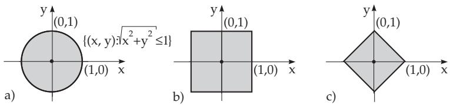

### 12.2 Metric Spaces

#### 12.2.1 Notion of a Metric Space

Let X be a set, and suppose a real, non-negative function $\rho ( x , y ) \ ( x , y \in \mathrm { X } )$ is defined on $\mathrm { \ X \times X }$ . If this function $\rho : \mathrm { ~ X \times X \to \mathbb { R } _ { + } ^ { 1 } }$ satisfies the following properties $( \mathbf { M 1 } ) { - } ( \mathbf { M 3 } )$ for arbitrary elements $x , y , z \in \mathrm { X }$ , then it is called a metric or distance in the set X, and the pair $\mathbf { \dot { X } } = \mathbf { \dot { ( X , } } \rho \mathbf { ) }$ is called a metric space. The axioms of metric spaces are:

$$
( \mathbf { M 1 } ) \quad \rho ( x , y ) \geq 0 { \mathrm { ~ a n d ~ } } \rho ( x , y ) = 0 { \mathrm { ~ i f ~ a n d ~ o n l y ~ i f ~ } } x = y \ ( { \mathrm { n o n - n e g a t i v i t y } } ) ,\tag{12.40}
$$

$$
\begin{array} { r l } { ( \mathbf { M } 2 ) } & { { } \rho ( x , y ) = \rho ( y , x ) } \end{array}\tag{12.41}
$$

$$
\begin{array} { r l } { ( \mathbf { M 3 } ) } & { { } \rho ( x , y ) \leq \rho ( x , z ) + \rho ( z , y ) } \end{array}\tag{12.42}
$$

A metric can be defined on every subset Y of a metric space $\mathbf { X } = ( \mathbf { X } , \rho )$ in a natural way if the metric ρ of the space X is restricted to the set $\mathrm { Y , i . e . , i f } \rho$ is considered only on the subset $\mathbb { Y } \times \mathbb { Y }$ . The space $( \mathbb { Y } , \rho )$ of $\dot { \mathrm { X } } \times \mathrm { X }$ is called a subspace of the metric space X.

A: The sets $\mathbb { R } ^ { n }$ and $\mathbb { C } ^ { n }$ are metric spaces with the Euclidean metric defined for points

$$
{ \boldsymbol { x } } = ( \xi _ { 1 } , \dots , \xi _ { n } )
$$

$$
y = ( \eta _ { 1 } , \dotsc , \eta _ { n } )
$$

$$
\rho ( x , y ) = \sqrt { \sum _ { k = 1 } ^ { n } | \xi _ { k } - \eta _ { k } | ^ { 2 } } .\tag{12.43}
$$

B: The function

$$
\rho ( x , y ) = \underset { 1 \leq k \leq n } { \operatorname* { m a x } } \left| \xi _ { k } - \eta _ { k } \right|\tag{12.44}
$$

for vectors $x = ( \xi _ { 1 } , \ldots , \xi _ { n } )$ and $y = ( \eta _ { 1 } , \dots , \eta _ { n } )$ also defines a metric in $\mathbb { R } ^ { n }$ and $\mathbb { C } ^ { n }$ , the so-called maximum metric. $\operatorname { I f } \tilde { x } = ( \tilde { \xi _ { 1 } } , \dots , \tilde { \xi _ { n } } )$ is an approximation of the vector $x ,$ then it is of interest to know how much is the maximal deviation between the coordinates: $\operatorname* { m a x } _ { 1 \leq k \leq n } | \xi _ { k } - \tilde { \xi _ { k } } |$

The function

$$
\rho ( x , y ) = \sum _ { k = 1 } ^ { n } \left| \xi _ { k } - \eta _ { k } \right|\tag{12.45}
$$

for vectors $x , y \in \mathbb { R } ^ { n }$ (or $\mathbb { C } ^ { n } )$ defines a metric in $\mathbb { R } ^ { n }$ and $\mathbb { C } ^ { n }$ , the so-called absolute value metric. The metrics (12.43), (12.44) and (12.45) are reduced in the case of $n = 1$ to the absolute value $| x - y |$ in the spaces IR and C (the sets of real and complex numbers).

C: Finite 0-1 sequences, e.g., 1110 and 010110, are called words in coding theory. If the number of positions is counted where two words of the same length n have diferent digits, i.e., for $x =$ $( \xi _ { 1 } , \ldots , \xi _ { n } ) , \ y = ( \eta _ { 1 } , \ldots , \eta _ { n } ) , \ \xi _ { k } , \ \eta _ { k } \in \{ 0 , 1 \} , \varrho ( x , y )$ is defined as the number of the $k \in \{ 1 , \ldots , n \}$ values such that $\xi _ { k } \neq \eta _ { k }$ , then the set of words with a given length n is a metric space, and the metric is the so-called Hamming distance, $\mathrm { e . g . } , \varrho ( ( 1 1 1 0 ) , ( 0 1 0 \bar { 0 } ) ) = 2$

D: In the set m and in its subsets c and $\mathbf { c _ { 0 } }$ (see (12.12), p. 656) a metric is defined by

$$
\rho ( x , y ) = \operatorname* { s u p } _ { k } | \xi _ { k } - \eta _ { k } | , \quad ( x = ( \xi _ { 1 } , \xi _ { 2 } , \ldots ) , y = \eta _ { 1 } , \eta _ { 2 } , \ldots ) ) .\tag{12.46}
$$

E: In the set $1 ^ { p } \left( 1 \leq p < \infty \right)$ of sequences $\boldsymbol { x } = ( \xi _ { 1 } , \xi _ { 2 } , \ldots )$ with absolutely convergent series $\sum _ { n = 1 } ^ { \infty } | \xi _ { n } | ^ { p }$ a metric is defined by

$$
\rho ( x , y ) = \sqrt [ ] { \sum _ { n = 1 } ^ { \infty } | \xi _ { n } - \eta _ { n } | ^ { p } } , \quad ( x , y \in l ^ { p } ) .\tag{12.47}
$$

F: In the set $\mathcal { C } ( [ a , b ] )$ a metric is defined by

$$
\rho ( x , y ) = \operatorname* { m a x } _ { t \in [ a , b ] } | x ( t ) - y ( t ) | .\tag{12.48}
$$

G: In the set $\mathcal { C } ^ { ( k ) } ( [ a , b ] )$ a metric is defined by

$$
\rho ( x , y ) = \sum _ { l = 0 } ^ { k } \operatorname* { m a x } _ { t \in [ a , b ] } | x ^ { ( l ) } ( t ) - y ^ { ( l ) } ( t ) | ,\tag{12.49}
$$

where (see (12.14) $\mathcal { C } ^ { ( 0 ) } ( [ a , b ] )$ is understood as ${ \mathcal { C } } ( [ a , b ] ) )$

H: Consider the set $L ^ { p } ( \Omega ) \ ( 1 \leq p < \infty )$ of the equivalence classes of Lebesgue measurable functions which are defined almost everywhere on a bounded domain $\Omega \subset \mathbb { R } ^ { n }$ and $\int _ { \Omega } | x ( t ) | ^ { p } d \mu < \infty$ (see also

12.9, p. 693). A metric in this set is defined by

$$
\rho ( x , y ) = \sqrt [ p ] { \int _ { \Omega } | x ( t ) - y ( t ) | ^ { p } d \mu } .\tag{12.50}
$$

##### 12.2.1.1 Balls, Neighborhoods and Open Sets

In a metric space $\mathbf { X } = \left( \mathbf { X } , \rho \right)$ , whose elements are also called points, the following sets

$$
B ( x _ { 0 } ; r ) = \{ x \in \mathrm { X } : \rho ( x , x _ { 0 } ) < r \} , \ ( 1 2 . 5 1 ) \qquad \overline { { B } } ( x _ { 0 } ; r ) = \{ x \in \mathrm { X } : \rho ( x , x _ { 0 } ) \leq r \}\tag{12.52}
$$

defined by means of a real number $r > 0$ and a fixed point $x _ { 0 }$ , are called an open and closed ball with radius r and center at $x _ { 0 }$ , respectively.

The balls (circles) defined by the metrics (12.43) and (12.44) and (12.45) in the vector space $\mathbb { R } ^ { 2 }$ are represented in Fig. 12.4a,b with $x _ { 0 } = 0$ and $r = 1$

  
Figure 12.4

A subset $U$ of a metric space $\mathbf { \boldsymbol { X } } = ( \mathbf { \boldsymbol { X } } , \rho )$ is called a neighborhood of the point $x _ { 0 }$ if U contains $x _ { 0 }$ together with an open ball centered at $x _ { 0 } ,$ in other words, if there exists an $r > 0$ such that $B ( x _ { 0 } ; r ) \subset U$ . A neighborhood $U$ of the point x is also denoted by $U ( x )$ . Obviously, every ball is a neighborhood of its center; an open ball is a neighborhood of all of its points. A point $x _ { 0 }$ is called an interior point of a set $A \subset \mathbf { X } \mathrm { i f } \ x _ { 0 }$ belongs to $A$ together with some of its neighborhood, i.e., there is a neighborhood U of $x _ { 0 }$ such that $x _ { 0 } \in U \subset A$ . A subset of a metric space is called open if all of its points are interior points. Obviously, X is an open set.

The open balls in every metric space, especially the open intervals in $\mathbb { R } .$ are the prototypes of open sets.

The set of all open sets satisfies the following axioms of open sets:

If $G _ { \alpha }$ is open for $\forall \alpha \in I$ , then the set $\bigcup _ { \alpha \in I } G _ { \alpha }$ is also open.

If $G _ { 1 } , G _ { 2 } , \ldots , G _ { n }$ are finitely many arbitrary open sets, then the set $\bigcap _ { k = 1 } ^ { n } G _ { k }$ is also open.

The empty set is open by definition.

A subset A of a metric space is bounded if for a certain element $x _ { 0 }$ (which does not necessarily belong to A) and a real number $R > 0$ the set A is in the ball $B ( x _ { 0 } ; R ) , { \mathrm { i . e . , } } \rho ( x , x _ { 0 } ) < R$ for all $x \in A$

##### 12.2.1.2 Convergence of Sequences in Metric Spaces

Let $\mathbf { X } = ( \mathbf { X } , \rho )$ be a metric space, $x _ { 0 } \in \mathrm { X }$ and $\{ x _ { n } \} _ { n = 1 } ^ { \infty } , \ x _ { n } \in \mathrm { X }$ a sequence of elements of X. The sequence $\{ x _ { n } \} _ { n = 1 } ^ { \infty }$ is called convergent to the point $x _ { 0 }$ if for every neighborhood $U ( x _ { 0 } )$ there is an index $n _ { 0 } = n _ { 0 } ( U ( x _ { 0 } ) )$ such that for all n $> n _ { 0 } , x _ { n } \in U ( x _ { 0 } )$ . The usual notation

$$
x _ { n } \longrightarrow x _ { 0 } \quad ( n  \infty ) \quad { \mathrm { o r } } \quad \operatorname* { l i m } _ { n  \infty } x _ { n } = x _ { 0 }\tag{12.53}
$$

is used and the point $x _ { 0 }$ is called the limit ofthe sequence $\{ x _ { n } \} _ { n = 1 } ^ { \infty }$ . The limit of a sequence is uniquely determined. Instead of an arbitrary neighborhood of the point $x _ { 0 }$ , it is suficient to consider only open balls with arbitrary radii, so (12.53) is equivalent to the following: $\forall \varepsilon > 0$ (now thinking about the open ball $B ( x _ { 0 } ; \varepsilon ) )$ , there is an index $n _ { 0 } = n _ { 0 } ( \varepsilon )$ , such that if $n > n _ { 0 }$ , then $\rho ( x _ { n } , x _ { 0 } ) < \varepsilon$ . Notice that (12.53) means $\rho ( x _ { n } , x _ { 0 } ) \longrightarrow 0$

With these notions introduced in special metric spaces the distance between points can be calculated and the convergence of point sequences can be investigated. This has a great importance in numerical methods and in approximating functions by certain classes of functions (see, e.g., 19.6, p. 982).

In the space $\mathbb { R } ^ { n }$ , equipped with one of the metrics given above, convergence always means coordinatewise convergence.

In the spaces $B ( [ a , b ] )$ and $\mathcal { C } ( [ a , b ] )$ , the convergence introduced by (12.48) means uniform convergence of the function sequence on the set [a, b] (see 7.3.2, p. 468).

In the space $L ^ { 2 } ( \Omega )$ convergence with respect to the metric (12.50) means convergence in the (quadratic) mean, $\mathrm { i . e . , } x _ { n }  x _ { 0 }$ if

$$
\int _ { \Omega } | x _ { n } - x _ { 0 } | ^ { 2 } d \mu \longrightarrow 0 \quad \mathrm { f o r } \quad n  \infty .\tag{12.54}
$$

##### 12.2.1.3 Closed Sets and Closure

1. Closed Sets

A subset F of a metric space X is called closed if $\mathrm { ~ X ~ } \backslash F$ is an open set. Every closed ball in a metric space, especially every interval of the form $[ a , b ] , [ a , \dot { \infty } ) , ( - \infty , \dot { a } ]$ in IR, is a closed set.

Corresponding to the axioms of open sets, the collection of all closed sets of a metric space has the following properties:

If $F _ { \alpha }$ are closed for $\forall \alpha \in I$ , then the set $\bigcap _ { \alpha \in I } F _ { \alpha }$ is closed.

If $F _ { 1 } , \ldots , F _ { n }$ are finitely many closed sets, then the set $\bigcup _ { k = 1 } ^ { n } F _ { k }$ is closed.

The empty set is a closed set by definition.

The sets and X are open and closed at the same time.

A point $x _ { 0 }$ of a metric space X is called a limit point of the subset $A \subset \mathrm { X }$ if for every neighborhood $U ( x _ { 0 } )$

$$
U ( x _ { 0 } ) \cap A \neq \varnothing .\tag{12.55}
$$

If this intersection always contains at least one point diferent from $x _ { 0 }$ , then $x _ { 0 }$ is called an accumulation point of the set A. A limit point, which is not an accumulation point, is called an isolated point.

An accumulation point of A does not need to belong to the set A, e.g., the point a with respect to the set $A = ( a , b ]$ , while an isolated point of A must belong to the set A.

A point $x _ { 0 }$ is a limit point of the set A if there exists a sequence $\{ x _ { n } \} _ { n = 1 } ^ { \infty }$ with elements $x _ { n }$ from A, which converges to $x _ { 0 } , \mathrm { H } x _ { 0 }$ is an isolated point, then $x _ { n } = x _ { 0 } , \forall n \ge n _ { 0 }$ for some index $n _ { 0 }$

2. The Closure of a Set

Every subset A of a metric space X obviously lies in the closed set X. Therefore, there always exists a smallest closed set containing A, namely the intersection of all closed sets of X, which contain A. This set is called the closure of the set A and it is usually denoted by A. A is identical to the set of all limit points of A; A is obtained from the set A by adding all of its accumulation points to it. A is a closed set if and only if $A = { \overline { { A } } }$ . Consequently, closed sets can be characterized by sequences in the following way: A is closed if and only if for every sequence $\{ x _ { n } \} _ { n = 1 } ^ { \infty }$ of elements of A, which converges in X to an element $x _ { 0 } ( \in \mathrm { X } )$ , the limit $x _ { 0 }$ also belongs to A.

Boundary points of A are defined as follows: $x _ { 0 }$ is a boundary point of A if for every neighborhood $U ( x _ { 0 } ) , { \bar { U ( x _ { 0 } ) } } \cap A \neq \emptyset$ and also $U ( x _ { 0 } ) \cap ( X \setminus A ) \neq \emptyset . \ x _ { 0 }$ itself does not need to belong to A. Another characterization of a closed set is the following: A is closed if it contains all of its boundary points. (The set of boundary points of the metric space X is the empty set.)

##### 12.2.1.4 Dense Subsets and Separable Metric Spaces

A subset A of a metric space X is called everywhere dense if ${ \overline { { A } } } = \mathrm { X }$ , i.e., each point $x \in \mathrm { X }$ is a limit point of the set A. That is, for each $x \in \mathrm { X }$ , there is a sequence $\left\{ x _ { n } \right\} { \mathrm { ~ } } x _ { n } \in A$ such that $x _ { n } \longrightarrow x$

A: According to the Weierstrass approximation theorem, every continuous function on a bounded closed interval $[ \bar { a } , b ]$ can be approximated arbitrarily well by polynomials in the metric space of the space $\mathcal { C } ( [ a , b ] )$ , i.e., uniformly. This theorem can now be formulated as follows: The set of polynomials on the interval [a, b] is everywhere dense in $\mathcal { C } ( [ a , b ] )$

B: Further examples for everywhere dense subsets are the set of rational numbers Q and the set of irrational numbers in the space of the real numbers IR .

A metric space X is called separable if there exists a countable everywhere dense subset in X. A countable everywhere dense subset in $\mathbb { R } ^ { n }$ is, e.g., the set of all vectors with rational components. The space $1 = 1 ^ { 1 }$ is also separable, since a countable everywhere dense subset is formed, for example, by the set of its elements of the form $\boldsymbol { x } = ( r _ { 1 } , r _ { 2 } , \ldots , r _ { N } , 0 , 0 , \ldots )$ , where $r _ { i }$ are rational numbers and $N = N ( x )$ is an arbitrary natural number. The space m is not separable.

#### 12.2.2 Complete Metric Spaces

##### 12.2.2.1 Cauchy Sequences

Let $\mathbf { X } = ( \mathbf { X } , \rho )$ be a metric space. A sequence $\{ x _ { n } \} _ { n = 1 } ^ { \infty }$ with $x _ { n } \in \mathrm { X }$ is called a Cauchy sequence if for $\forall \varepsilon > 0$ there is an index $n _ { 0 } = n _ { 0 } ( \varepsilon )$ such that for $\forall n , m > n _ { 0 }$ there holds the inequality

$$
\rho ( x _ { n } , x _ { m } ) < \varepsilon .\tag{12.56}
$$

Every Cauchy sequence is a bounded set. Furthermore, every convergent sequence is a Cauchy sequence. In general, the converse statement is not true, as is shown in the following example.

Consider the space l1 with the metric (12.46) of the space m. Obviously, the elements $x ^ { ( n ) } =$ $\left( 1 , { \frac { 1 } { 2 } } , { \frac { 1 } { 3 } } , \ldots , { \frac { 1 } { n } } , 0 , 0 , \ldots \right)$ belong to l1 for every $n = 1 , 2 , \ldots$ . and the sequence $\{ x ^ { ( n ) } \} _ { n = 1 } ^ { \infty }$ is a Cauchy sequence in this space. If the sequence (of sequences) $\{ x ^ { ( n ) } \} _ { n = 1 } ^ { \infty }$ converges, then it has to be convergent also coordinate-wise to the element $x ^ { ( 0 ) } = \left( 1 , { \frac { 1 } { 2 } } , { \frac { 1 } { 3 } } , \ldots , { \frac { 1 } { n } } , { \frac { 1 } { n + 1 } } , \ldots \right)$ . However, $x ^ { ( 0 ) }$ does not belong to l1, since $\sum _ { n = 1 } ^ { \infty } { \frac { 1 } { n } } = + \infty$ (see 7.2.1.1, 2., p. 459, harmonic series).

##### 12.2.2.2 Complete Metric Spaces

A metric space X is called complete if every Cauchy sequence converges in X. Hence, complete metric spaces are the spaces for which the Cauchy principle, known from real calculus, is valid: A sequence is convergent if and only if it is a Cauchy sequence. Every closed subspace of a complete metric space (considered as a metric space on its own) is complete. The converse statement is valid in a certain way: If a subspace Y of a (not necessary complete) metric space X is complete, then the set Y is closed in X.

Complete metric spaces are, e.g., the spaces: m, $\begin{array} { r } { \mathrm { l } ^ { p } ( 1 \leq p < \infty ) , \ \mathbf { c } , \ B ( T ) , \ { \mathcal C } ( [ a , b ] ) , \ { \mathcal C } ^ { ( k ) } ( [ a , b ] ) } \end{array}$ $L ^ { p } ( a , b ) \ { \stackrel { - } { ( } } 1 \leq p < \infty ) $

##### 12.2.2.3 Some Fundamental Theorems in Complete Metric Spaces

The importance of complete metric spaces can be illustrated by a series of theorems and principles, which are known and used in real calculus, and which are to be applied even in the case of infinite dimensional spaces.

1. Theorem on Nested Balls

Let X be a complete metric space. If

$$
\overline { { { B } } } ( x _ { 1 } ; r _ { 1 } ) \supset \overline { { { B } } } ( x _ { 2 } ; r _ { 2 } ) \supset \cdots \supset \overline { { { B } } } ( x _ { n } ; r _ { n } ) \supset \cdots\tag{12.57}
$$

is a sequence of nested closed balls with $r _ { n } \longrightarrow 0$ , then the intersection of all of those balls is nonempty and consists of only a single point. If this property is valid in some metric space for any sequence satisfying the assumptions, then the metric space is complete.

2. Baire Category Theorem

Let X be a complete metric space and $\{ F _ { k } \} _ { k = 1 } ^ { \infty }$ a sequence of closed sets in X with ${ \underset { k = 1 } { \infty } } F _ { k } = \mathbf { X } .$ Then

there exists at least one index $k _ { 0 }$ such that the set $F _ { k _ { 0 } }$ has an interior point.

3. Banach Fixed-Point Theorem

Let F be a non-empty closed subset of a complete metric space $\left( \mathrm { X } , \rho \right)$ . Let $T \colon X \longrightarrow \mathrm { X }$ be a contracting operator on $F , { \mathrm { i . e . } }$ , there exists a constant $q \in [ 0 , 1 )$ such that

$$
\rho ( T x , T y ) \leq q \rho ( x , y ) \quad { \mathrm { f o r ~ a l l } } \quad x , y \in F .\tag{12.58}
$$

Suppose, if $x \in F$ , then $T x \in F$ . Then the following statements are valid:

a) For an arbitrary initial point $x _ { 0 } \in F$ the iteration

$$
x _ { n + 1 } : = T x _ { n } \quad ( n = 0 , 1 , 2 , . . . )\tag{12.59}
$$

is well defined, $\mathrm { i } . \mathrm { e } . , x _ { n } \in F$ for every n.

b) The iteration sequence $\{ x _ { n } \} _ { n = 0 } ^ { \infty }$ converges to an element $x ^ { * } \in F$

c) $T x ^ { * } = x ^ { * }$ , i.e., x∗ is a fixed point of the operator T.

(12.60)

d) The only fixed point of T in F is $x ^ { * }$

e) The following error estimation is valid:

$$
\rho ( x ^ { * } , x _ { n } ) \leq \frac { q ^ { n } } { 1 - q } \rho ( x _ { 1 } , x _ { 0 } ) .\tag{12.61}
$$

The Banach fixed-point theorem is sometimes called the contraction mapping principle.

##### 12.2.2.4 Some Applications of the Contraction Mapping Principle

1. Iteration Method for Solving a System of Linear Equations The given linear $( n , n )$ system of equations

$$
\begin{array} { r l } & { a _ { 1 1 } x _ { 1 } + a _ { 1 2 } x _ { 2 } + \dotsc + a _ { 1 n } x _ { 1 } = b _ { 1 } , } \\ & { a _ { 2 1 } x _ { 1 } + a _ { 2 2 } x _ { 2 } + \dotsc + a _ { 2 n } x _ { n } = b _ { 2 } , } \end{array}\tag{12.62a}
$$

$$
a _ { n 1 } x _ { 1 } + a _ { n 2 } x _ { 2 } + \ldots + a _ { n n } x _ { n } = b _ { n }
$$

can be transformed according to 19.2.1, p. 955, into the equivalent system

$$
\begin{array} { r l r } & { x _ { 1 } - ( 1 - a _ { 1 1 } ) x _ { 1 } \qquad } & { + a _ { 1 2 } x _ { 2 } + \cdot \cdot \cdot } \\ & { x _ { 2 } \qquad } & { + a _ { 2 1 } x _ { 1 } - ( 1 - a _ { 2 2 } ) x _ { 2 } + \cdot \cdot \cdot \cdot } & { + a _ { 2 n } x _ { n } = b _ { 2 } , } \\ & { \cdot \cdot \cdot \cdot \cdot \cdot \cdot \cdot \cdot \cdot \cdot \cdot \cdot \cdot \cdot \cdot \cdot \cdot \cdot \cdot \cdot \cdot \cdot \cdot \cdot \cdot \cdot \cdot \cdot \cdot \cdot \cdot \cdot \cdot \cdot \cdot \cdot \cdot \cdot \cdot \cdot \cdot \cdot \cdot \cdot \cdot \cdot \cdot \cdot \cdot \cdot \cdot \cdot \cdot \cdot \cdot \cdot \cdot \cdot } \\ & { x _ { n } \qquad } & { + a _ { n 1 } x _ { 1 } \qquad } & { + a _ { n 2 } x _ { 2 } + \cdot \cdot \cdot \cdot - ( 1 - a _ { n n } ) x _ { n } = b _ { n } . } \end{array}\tag{12.62b}
$$

If the operator T: $\mathbb { F } ^ { n } \to \mathbb { F } ^ { n }$ is defined by

$$
T x = { \Bigg ( } x _ { 1 } - \sum _ { k = 1 } ^ { n } a _ { 1 k } x _ { k } + b _ { 1 } , \ldots , x _ { n } - \sum _ { k = 1 } ^ { n } a _ { n k } x _ { k } + b _ { n } { \Bigg ) } ^ { \mathrm { T } } ,\tag{12.63}
$$

then the last system is transformed into the fixed-point problem

$$
x = T x\tag{12.64}
$$

in the metric space $\mathbb { F } ^ { n }$ , where an appropriate metric is considered: The Euclidean (12.43), the maximum (12.44) or the absolute value metric $\rho ( x , y ) = \sum _ { k = 1 } ^ { n } \left| x _ { k } - y _ { k } \right|$ (compare with (12.45)). If one of the numbers

$$
\sqrt { \sum _ { j , k = 1 } ^ { n } | a _ { j k } | ^ { 2 } } , \quad \operatorname* { m a x } _ { 1 \leq j \leq n } \sum _ { k = 1 } ^ { n } \big | a _ { j k } \big | , \quad \operatorname* { m a x } _ { 1 \leq k \leq n } \sum _ { j = 1 } ^ { n } \big | a _ { j k } \big |\tag{12.65}
$$

is smaller than one, then $T$ turns out to be a contracting operator. It has exactly one fixed point according to the Banach fixed-point theorem, which is the componentwise limit of the iteration sequence started from an arbitrary point of $\mathbb { F } ^ { n }$

2. Fredholm Integral Equations

The Fredholm integral equation of second kind (see also 11.2, p. 622)

$$
\varphi ( x ) - \int _ { a } ^ { b } K ( x , y ) \varphi ( y ) d y = f ( x ) , \quad x \in [ a , b ]\tag{12.66}
$$

with a continuous kerne $K ( x , y )$ and continuous right-hand side $f ( x )$ can be solved by iteration. By means of the operator T: ${ \mathcal { C } } ( [ a , b ] ) \longrightarrow { \mathcal { C } } ( [ a , b ] )$ defined as

$$
T \varphi ( x ) = \int _ { a } ^ { b } K ( x , y ) \varphi ( y ) d y + f ( x ) \quad \forall \varphi \in { \mathcal { C } } ( [ a , b ] ) ,\tag{12.67}
$$

it is transformed into a fixed-point problem $T \varphi = \varphi$ in the metric space $\mathcal { C } ( [ a , b ] )$ (see example A in 12.1.2, 4., p. 655). If max $\int _ { a } ^ { b } | K ( x , y ) | d y < 1$ , then T is a contracting operator and the fixed-point a x b   
theorem can be applied. The unique solution is now obtained as the uniform limit of the iteration sequence $\{ \varphi _ { n } \} _ { n = 1 } ^ { \infty }$ , where $\varphi _ { n } = T \varphi _ { n - 1 }$ , starting with an arbitrary function $\varphi _ { 0 } ( x ) \in { \mathcal { C } } ( [ a , b ] )$ . It is clear that $\varphi _ { n } = T ^ { n } \varphi _ { 0 }$ and the iteration sequence is $\check { \{ T ^ { n } \varphi _ { 0 } \} } _ { n = 1 } ^ { \infty }$

3. Volterra Integral Equations

The Volterra integral equation of second kind (see 11.4, p. 643)

$$
\varphi ( x ) - \int _ { a } ^ { x } K ( x , y ) \varphi ( y ) d y = f ( x ) , \quad x \in [ a , b ]\tag{12.68}
$$

with a continuous kernel and a continuous right-hand side can be solved by means of the Volterra integral operator

$$
( V \varphi ) ( x ) : = \int _ { a } ^ { x } K ( x , y ) \varphi ( y ) d y \quad \forall \varphi \in { \mathcal { C } } ( [ a , b ] )\tag{12.69}
$$

and $T \varphi = f + V \varphi$ as the fixed-point problem $T \varphi = \varphi$ in the space $\mathcal { C } ( [ a , b ] )$

4. Picard-Lindel¨of Theorem

Consider the diferential equation

$$
{ \dot { x } } = f ( t , x )\tag{12.70}
$$

with a continuous mapping $f \colon I \times G \longrightarrow \mathbb { R } ^ { n }$ , where I is an open interval of IR and G is an open domain of $\mathbb { R } ^ { n }$ . Suppose the function $f$ satisfies a Lipschitz condition with respect to x (see 9.1.1.1, 2. p. 541), i.e., there is a positive constant L such that

$$
\varrho \big ( f ( t , x _ { 1 } ) , f ( t , x _ { 2 } ) \big ) \leq L \varrho ( x _ { 1 } , x _ { 2 } ) \quad \forall ( t , x _ { 1 } ) , ( t , x _ { 2 } ) \in I \times G ,\tag{12.71}
$$

where $\varrho$ is the Euclidean metric in $\mathbb { R } ^ { n }$ . (Using the norm (see 12.3.1, p. 669) and the formula (12.81) $\varrho ( x , y ) = \| x - y \| \left( 1 2 . 7 1 \right)$ ) can be written as $\| f ( t , x _ { 1 } ) - f ( t , x _ { 2 } ) \| \leq L \cdot \| x _ { 1 } - x _ { 2 } \| . ) \ \mathrm { L e t } \ ( t _ { 0 } , x _ { 0 } ) \in I \times G .$ Then there are numbers $\beta > 0$ and $r > 0$ such that the set $\Omega = \{ ( t , x ) \in \mathbb { R } \times \mathbb { R } ^ { n } \colon | t - t _ { 0 } | \leq \beta , \varrho ( x , x _ { 0 } ) \leq$ $r \}$ lies in $I \times G$ . Let $M = \operatorname* { m a x } _ { \Omega } \varrho ( f ( t , x ) , 0 )$ and $\alpha = \operatorname* { m i n } \{ \beta , \frac { r } { M } \}$ . Then there is a number $b > 0$ such that for each $\tilde { x } \in B = \{ x \in \mathbb { R } ^ { n } \colon \varrho ( x , x _ { 0 } ) \leq b \}$ , the initial value problem

$$
{ \dot { x } } = f ( t , x ) , \quad x ( t _ { 0 } ) = { \tilde { x } }\tag{12.72}
$$

has exactly one solution $\varphi ( t , \tilde { x } ) , \mathrm { i . e . , } \dot { \varphi } ( t , \tilde { x } ) = f ( t , \varphi ( t , \tilde { x } ) )$ for t satisfying $| t - t _ { 0 } | \leq \alpha$ and $\varphi ( t _ { 0 } , \tilde { x } ) = \tilde { x }$ The solution of this initial value problem is equivalent to the solution of the integral equation

$$
\varphi ( t , \tilde { x } ) = \tilde { x } + \intop _ { t _ { 0 } } ^ { t } f ( s , \varphi ( s , \tilde { x } ) ) d s , \quad t \in [ t _ { 0 } - \alpha , t _ { 0 } + \alpha ] .\tag{12.73}
$$

If X denotes the closed ball $\{ \varphi ( t , x ) \colon d ( \varphi ( t , x ) , x _ { 0 } ) \leq r \}$ in the complete metric space $\mathcal { C } ( [ t _ { 0 } - \alpha , t _ { 0 } +$ $\alpha ] \times B ; \mathbb { R } ^ { n } )$ ) with metric

$$
d ( \varphi , \psi ) = \operatorname* { m a x } _ { ( t , x ) \in \{ | t - t _ { 0 } | \leq \alpha \} \times B } \varrho ( \varphi ( t , x ) , \psi ( t , x ) ) ,\tag{12.74}
$$

then X is a complete metric space with the induced metric. If the operator $T \colon \mathrm { X } \longrightarrow \mathrm { X }$ is defined by

$$
T \varphi ( t , x ) = \tilde { x } + \intop _ { t _ { 0 } } ^ { t } f ( s , \varphi ( s , \tilde { x } ) ) d s\tag{12.75}
$$

then $T$ is a contracting operator and the solution of the integral equation (12.73) is the unique fixed point of $T$ which can be calculated by iteration.

##### 12.2.2.5 Completion of a Metric Space

Every (non-complete) metric space X can be completed; more precisely, there exists a metric space $\tilde { \mathrm { X } }$ with the following properties:

a) $\tilde { \mathrm { X } }$ contains a subspace Y isometric to X (see 12.2.3, 2., p. 669).

b) Y is everywhere dense in $\tilde { \mathrm { X } }$

c) $\tilde { \mathrm { X } }$ is a complete metric space.

d) If Z is any metric space with the properties a)–c), then Z and $\tilde { \mathrm { X } }$ are isometric.

The complete metric space, defined uniquely in this way up to isometry, is called the completion of the space X.

#### 12.2.3 Continuous Operators

1. Continuous Operators

Let $T \colon \mathrm { X } \longrightarrow \mathrm { Y }$ be a mapping of the metric space $\mathbf { X } = ( \mathbf { X } , \rho )$ into the metric space $\mathrm { Y } = ( \mathrm { Y } , \varrho )$ . T is called continuous at the point $x _ { 0 } \in \mathrm { X }$ if for every neighborhood $V = V ( y _ { 0 } )$ of the point $y _ { 0 } = T ( x _ { 0 } )$

there is a neighborhood $U = U ( x _ { 0 } )$ such that:

$$
T ( x ) \in V \quad { \mathrm { f o r ~ a l l } } \quad x \in U .\tag{12.76}
$$

T is called continuous on the set $A \subset \mathrm { X }$ if T is continuous at every point of A. Equivalent properties for T to be continuous on X are:

a) For any point $x \in \mathrm { X }$ and any arbitrary sequence $\{ x _ { n } \} _ { n = 1 } ^ { \infty } , \ x _ { n } \in \mathrm { X }$ with $x _ { n } \longrightarrow x$ there always holds ${ \dot { T ( x _ { n } ) } } \longrightarrow { \dot { T } } ( x )$ . Hence $\rho ( x _ { n } , \overset { \cdot } { x } ) \to 0$ implies $\varrho ( T ( x _ { n } ) , { \hat { T } } ( x ) )  0 .$

b) For any open subset $G \subset \mathbb { Y }$ the inverse image $T ^ { - 1 } ( G )$ is an open subset in X.

c) For any closed subset $F \subset \mathbb { Y }$ the inverse image $T ^ { - 1 } ( F )$ is a closed subset in X.

d) For any subset $A \subset \mathbf { X }$ one has $T ( { \overline { { A } } } ) \subset { \overline { { T ( A ) } } }$

2. Isometric Spaces

If there is a bijective mapping $T \colon \mathrm { X } \longrightarrow \mathrm { Y }$ for two metric spaces $\mathbf { X } = \left( \mathbf { X } , \rho \right)$ and ${ \mathbb Y } = ( { \mathbb Y } , \varrho )$ such that

$$
\rho ( x , y ) = \varrho ( T ( x ) , T ( y ) ) \quad \forall x , y \in \mathrm { X } ,\tag{12.77}
$$

then the spaces X and Y are called isometric, and T is called an isometry.
