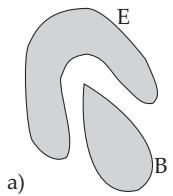
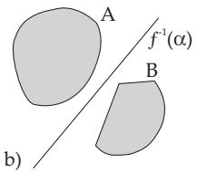
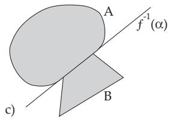

### 12.5 Continuous Linear Operators and Functionals

#### 12.5.1 Boundedness, Norm and Continuity of Linear Operators

##### 12.5.1.1 Boundedness and the Norm of Linear Operators

Let $\mathbf { X } = ( \mathbf { X } , \| \cdot \| )$ and $\mathrm { Y } = ( \mathrm { Y } , \| \cdot \| )$ be normed spaces. In the following discussion the index X in the notation $\| \cdot \| _ { \dot { \mathrm { X } } }$ , which emphasizes being in the space X , is omitted, because from the text it will be always clear, which norms and spaces are considered. An arbitrary operator $T \colon \mathrm { X } \longrightarrow \mathrm { Y }$ is called bounded if there is a real number $\lambda > 0$ such that

$$
\| T ( x ) \| \leq \lambda \| x \| \quad \forall x \in \mathrm { X } .\tag{12.132}
$$

A bounded operator with a constant λ “stretches” every vector at most λ times and it transforms every bounded set of X into a bounded set of Y, in particular the image of the unit ball of X is bounded in $\check { \mathbb { Y } } .$ This last property is characteristic of bounded linear operators. A linear operator is continuous (see 12.2.3, p. 668) if and only if it is bounded.

The smallest constant $\lambda ,$ for which (12.132) still holds, is called the norm of the operator $T$ and it is denoted by T , i.e.,

$$
\| T \| : = \operatorname* { i n f } \{ \lambda > 0 : \| T x \| \leq \lambda \| x \| , \ x \in \mathrm { { X } } \} .\tag{12.133}
$$

For a continuous linear operator the following equalities hold:

$$
\left\| T \right\| = \operatorname* { s u p } _ { \| x \| \leq 1 } \left\| T x \right\| = \operatorname* { s u p } _ { \| x \| < 1 } \left\| T x \right\| = \operatorname* { s u p } _ { \| x \| = 1 } \left\| T x \right\|\tag{12.134}
$$

and, furthermore, the following estimation holds

$$
\| T x \| \leq \| T \| \cdot \| x \| \quad \forall x \in \mathrm { X } .\tag{12.135}
$$

Let $T$ be the operator in the space $\mathcal { C } ( [ a , b ] )$ with the norm (12.89e), defined by the integral

$$
( T x ) ( s ) = y ( s ) = \int _ { a } ^ { b } K ( s , t ) x ( t ) d t \quad ( s \in [ a , b ] ) ,\tag{12.136}
$$

where $K ( s , t )$ is a (complex-valued) continuous function on the rectangle $\{ a \leq s , t \leq b \}$ . Then $T$ is a bounded linear operator, which maps $\mathcal { C } ( [ a , b ] )$ into $\mathcal { C } ( [ a , b ] )$ . Its norm is

$$
\| T \| = \operatorname* { m a x } _ { s \in [ a , b ] } \int _ { a } ^ { b } \left| K ( s , t ) \right| d t .\tag{12.137}
$$

##### 12.5.1.2 The Space of Linear Continuous Operators

The sum $U = S + T$ and the multiple αT of two linear (continuous) operators S, $T \colon \mathrm { X } \longrightarrow \mathrm { Y }$ are defined point-wise:

$$
U ( x ) = S ( x ) + T ( x ) , \quad ( \alpha T ) ( x ) = \alpha \cdot T ( x ) , \quad \forall x \in \mathrm { X \ a n d \ } \forall \alpha \in \mathbb { F } .\tag{12.138}
$$

The set $L ( \mathrm { X } , \mathrm { Y } )$ , often denoted by $B ( \mathrm { X } , \mathrm { Y } )$ , of all linear continuous operators T from X into Y equipped with the operations (12.138) is a vector space, where T (12.133) turns out to be a norm on it. $\mathrm { S o . }$ $L ( \mathbb { X } , \mathbb { Y } )$ is a normed space and even a Banach space if Y is a Banach space. So the axioms $( \mathbf { V 1 } ) \mathbf { - } ( \mathbf { V 8 } )$ and (N1)–(N3) are satisfied (see 12.1.1, p. 654, 12.3.1, p. 669).

$$
T \in L ( \mathrm { X } , \mathrm { X } ) = L ( \mathrm { X } ) = B ( \mathrm { X } )
$$

$$
( S T ) ( x ) = S ( T x ) \quad ( \forall x \in \mathrm { X } ) ,\tag{12.139}
$$

which satisfies the axioms $( \mathbf { A 1 } ) \ – ( \mathbf { A 4 } )$ from 12.3.4, p. 672, and also the compatibility condition (12.100) with the norm. L(X) is in general a non-commutative normed algebra, and if X is a Banach space, then it is a Banach algebra. Then for every operator $T \in L ( \mathrm { X } )$ its powers are defined by

$$
T ^ { 0 } = I , T ^ { n } = T ^ { n - 1 } T \quad ( n = 1 , 2 , \ldots ) ,\tag{12.140}
$$

where I is the identity operator $I x = x$ A $x \in \mathrm { X }$ . Then

$$
\Vert T ^ { n } \Vert \leq \Vert T \Vert ^ { n } \quad ( n = 0 , 1 , \ldots ) ,\tag{12.141}
$$

and furthermore there always exists the (finite) limit

$$
r ( T ) = \operatorname* { l i m } _ { n \to \infty } \sqrt [ n ] { \| T ^ { n } \| } ,\tag{12.142}
$$

which is called the spectral radius of the operator T and satisfies the relations

$$
r ( T ) \leq \| T \| , \quad r ( T ^ { n } ) = [ r ( T ) ] ^ { n } , \quad r ( \alpha T ) = | \alpha | r ( T ) , \quad r ( T ) = r ( T ^ { * } ) ,\tag{12.143}
$$

where $T ^ { * }$ is the adjoint operator to $T$ (see 12.6, p. 684, and (12.159)). If $L ( \mathrm { X } )$ is complete, then for $| \lambda | > r ( T )$ , the operator $( \ ` I - T ) ^ { - 1 }$ has the representation in the form of a Neumann series

$$
( \lambda I - T ) ^ { - 1 } = \lambda ^ { - 1 } I + \lambda ^ { - 2 } T + . . . + \lambda ^ { - n } T ^ { n - 1 } + . . . ,\tag{12.144}
$$

which is convergent for $| \lambda | > r ( T )$ in the operator norm on $L ( \mathrm { X } )$

##### 12.5.1.3 Convergence of Operator Sequences

1. Point-wise Convergence

of a sequence of linear continuous operators $T _ { n } \colon \mathrm { X } \longrightarrow \mathbb { Y }$ to an operator $T \colon \mathrm { X } \longrightarrow \mathrm { Y }$ means that:

$$
T _ { n } x \longrightarrow T x \quad \mathrm { i n } \mathrm { Y ~ f o r ~ e a c h } \ : x \in \mathrm { X } .\tag{12.145}
$$

2. Uniform Convergence

The usual norm-convergence of a sequence of operators $\{ T _ { n } \} _ { n = 1 } ^ { \infty }$ in a space $L ( \mathrm { X } , \mathrm { Y } )$ to T, i.e.,

$$
\| T _ { n } - T \| = \operatorname* { s u p } _ { \| x \| \leq 1 } \| T _ { n } x - T x \| \longrightarrow 0 \quad ( n \to \infty )\tag{12.146}
$$

is the uniform convergence on the unit ball of X. It implies point-wise convergence, while the converse statement is not true in general.

3. Applications

The convergence of quadrature formulas when the number n of interpolation nodes tends to , the performance principle of summation, limiting methods, etc.

#### 12.5.2 Linear Continuous Operators in Banach Spaces

Now X and Y are supposed to be Banach spaces.

1. Banach-Steinhaus Theorem (Uniform Boundedness Principle)

The theorem characterizes the point-wise convergence of a sequence $\left\{ T _ { n } \right\}$ of linear continuous operators $T _ { n }$ to some linear continuous operator by the conditions:

a) For every element from an everywhere dense subset $D \subset \mathrm { X }$ , the sequence $\{ T _ { n } x \}$ has a limit in Y, b) there is a constant C such that $\| T _ { n } \| \leq C , \forall n$

2. Open Mappings Theorem

The theorem tells us that a linear continuous operator mapping from X onto Y is open, i.e., the image $T ( G )$ of every open set G from X is an open set in Y.

3. Closed Graph Theorem

An operator $T \colon D _ { T } \longrightarrow \mathbb { Y }$ with $D _ { T } \subset \mathrm { X }$ is called closed if $x _ { n } \in D _ { T } , x _ { n } \to x _ { 0 }$ in X and $T x _ { n }  y _ { 0 }$ in Y imply $x _ { 0 } \in D _ { T }$ and $y _ { 0 } = T x _ { 0 }$ . A necessary and suficient condition is that the graph of the operator T in the space ${ \mathrm { X } } \times { \mathrm { Y } } , { \mathrm { i . e . } }$ , the set

$$
{ \varGamma _ { T } } = \left\{ ( x , T x ) \colon x \in D _ { T } \right\}\tag{12.147}
$$

is closed, where here $( x , y )$ denotes an element of the set $\mathbb { X } \times \mathbb { Y }$

If T is a closed operator with a closed domain $D _ { T }$ , then $T$ is continuous.

4. Hellinger-Toeplitz Theorem

Let T be a linear operator in a Hilbert space IH. If $( x , T y ) = ( T x , y )$ for every $x , y \in \mathbb { H }$ , then $T$ is continuous (here $( x , T y )$ denotes the scalar product in IH).

5. Krein-Losanovskij Theorem on the Continuity of Positive Linear Operators

If $\mathrm {  ~ X ~ } = ~ ( \mathrm {  ~ X ~ } , \mathrm {  ~ X _ { + } ~ } , \| \mathrm {  ~ \cdot ~ } \| )$ and $\mathrm { ~ Y ~ } = \mathrm { ~ ( Y , Y _ { + } , \parallel \cdot \parallel ) ~ }$ are ordered normed spaces, where $\mathrm { X } _ { + }$ is a generating cone, then the set $\vec { L _ { + } } ( \mathrm { X } , \mathrm { Y } )$ of all positive linear and continuous operators T, i.e., $T ( \mathrm { X } _ { + } ) \subset \mathbb { Y } _ { + }$ , is a cone in $L ( \mathrm { X } , \mathrm { Y } )$ . The theorem of Krein and Losanovskij asserts (see [12.17]): If X and Y are ordered Banach spaces with closed cones $\mathrm { X } _ { + }$ and $\mathrm { Y } _ { + }$ , and $\mathrm { X } _ { + }$ is a generating cone, then the positivity of a linear operator implies its continuity.

6. Inverse Operator

Let X and Y be arbitrary normed spaces and let $T \colon \mathrm { X } \longrightarrow \mathrm { Y }$ be a linear, not necessarily continuous operator. T has a continuous inverse $T ^ { - 1 } \colon \mathbb { Y } \longrightarrow \mathrm { X } , \mathrm { i f } T ( \mathrm { X } ) = \mathrm { Y }$ and there exists a constant $m > 0$ such that $\| T x \| \geq m \| x \|$ for each $x \in X$ . Then $\| T ^ { - 1 } \| \leq \frac { 1 } { m }$ . The situation considered here is less general than that in (12.22) (see 12.1.5.2, p. 659), since there may be $D \neq \mathrm { X }$ and $\mathcal { R } ( T ) \neq \mathrm { Y }$

In the case of Banach spaces X, Y the following theorem is valid:

7. Banach Theorem on the Continuity of the Inverse Operator

If T is a linear continuous bijective operator from X onto Y, then the inverse operator $T ^ { - 1 }$ is also continuous.

An important application is, $\mathrm { e . g . }$ , the continuity of $( \lambda I - T ) ^ { - 1 }$ given the injectivity and surjectivity of $\lambda I - \bar { T }$ . This fact has importance in investigating the spectrum of an operator (see 12.5.3.2, p. 680). It also applies to the

8. Continuous Dependence of the Solution

on the right-hand side and also on the initial data of initial value problems for linear diferential equations. This fact is demonstrated by the following example.

The initial value problem

$$
\ddot { x } ( t ) + p _ { 1 } ( t ) \dot { x } ( t ) + p _ { 2 } ( t ) x ( t ) = q ( t ) , \quad t \in [ a , b ] , \quad x ( t _ { 0 } ) = \xi , \ \dot { x } ( t _ { 0 } ) = \dot { \xi } , \quad t _ { 0 } \in [ a , b ]\tag{12.148a}
$$

with coeficients $p _ { 1 } ( t ) , p _ { 2 } ( t ) \in \mathcal { C } ( [ a , b ] )$ ) has exactly one solution x from $\textstyle { \mathcal { C } } ^ { 2 } ( [ a , b ] )$ for every right-hand side $q ( t ) \in \mathcal { C } ( [ a , b ] )$ and for every pair of numbers $\xi , \dot { \xi } .$ The solution x depends continuously on $q ( t ) , \xi$ and $\dot { \xi }$ in the following sense. If $q _ { n } ( t ) \in \mathcal { C } ( [ a , b ] ) , \xi _ { n } , \ \dot { \xi } _ { n } \in \mathbb { R } ^ { 1 }$ are given and $x _ { n } \in { \mathcal { C } } ( [ a , b ] )$ denotes the solution of

$$
\ddot { x } _ { n } ( t ) + p _ { 1 } ( t ) \dot { x } _ { n } ( t ) + p _ { 2 } ( t ) x _ { n } ( t ) = q _ { n } ( t ) , \quad x _ { n } ( a ) = \xi _ { n } , \ \dot { x } _ { n } ( a ) = \dot { \xi } _ { n } ,\tag{12.148b}
$$

for $n = 1 , 2 , . . . ,$ then:

$$
\begin{array} { r l } & { q _ { n } ( t ) \to q ( t ) \mathrm { ~ i n ~ } \mathcal { C } ( [ a , b ] ) , } \\ & { \quad \xi _ { n } \to \xi , } \\ & { \quad \xi _ { n } \to \dot { \xi } , } \end{array} \} \mathrm { i m p l i e s ~ } x _ { n } \to x \mathrm { ~ i n ~ t h e ~ s p a c e ~ } \mathcal { C } ^ { 2 } ( [ a , b ] ) .\tag{12.148c}
$$

9. Method of Successive Approximation

to solve an equation of the form

$$
x - T x = y\tag{12.149}
$$

with a continuous linear operator $T$ in a Banach space X for a given y. This method starts with an arbitrary initial element $x _ { 0 }$ , and constructs a sequence $\left\{ x _ { n } \right\}$ of approximating solutions by the formula

$$
x _ { n + 1 } = y + T x _ { n } \quad ( n = 0 , 1 , \ldots ) .\tag{12.150}
$$

This sequence converges to the solution $x ^ { * }$ in X of (12.149). The convergence of the method, i.e., $x _ { n } \to x ^ { * }$ , is based on the convergence of the series (12.144) with $\lambda = 1$

$\| T \| \leq q < 1$ . Then the following statements are valid:

a) The operator $I - T$ has a continuous inverse with $\| ( I - T ) ^ { - 1 } \| \leq \frac { 1 } { 1 - q }$ , and (12.149) has exactly one solution for each $y$

b) The series (12.144) converges and its sum is the operator $( I - T ) ^ { - 1 }$

$\mathbf { c } )$ The method (12.150) converges to the unique solution $x ^ { * }$ of (12.149) for any initial element $x _ { 0 }$ , if the series (12.144) converges. Then the following estimation holds:

$$
\| x _ { n } - x ^ { * } \| \leq { \frac { q ^ { n } } { 1 - q } } \| T x _ { 0 } - x _ { 0 } \| \quad ( n = 1 , 2 , \ldots ) .\tag{12.151}
$$

Equations of the type

$$
x - \mu T x = y , \quad \lambda x - T x = y , \quad \mu , \lambda \in \mathbb { F }\tag{12.152}
$$

can be handled in an analogous way (see 11.2.2, p. 625, and [12.8]).

#### 12.5.3 Elements of the Spectral Theory of Linear Operators

##### 12.5.3.1 Resolvent Set and the Resolvent of an Operator

For an investigation of the solvability of equations one tries to rewrite the problem in the form

$$
( I - T ) x = y\tag{12.153}
$$

with some operator T having a possible small norm. This is especially convenient for using a functional analytic method because of (12.143) and (12.144). In order to handle large values of $\lVert \boldsymbol { T } \rVert$ as well, it is necessary to investigate the whole family of equations

$$
( \lambda I - T ) x = y \quad x \in \mathrm { X } , \mathrm { w i t h } \lambda \in \mathbb { C }\tag{12.154}
$$

in a complex Banach space X. Let T be a linear, but in general not a bounded operator in a Banach space X. The set $\varrho ( T )$ of all complex numbers λ such that $( \lambda I - T ) ^ { - 1 } \in B ( \mathrm { X } ) \overset { \cdot } { = } L ( \mathrm { X } )$ is called the resolvent set and the operator $\hat { R _ { \lambda } } = \bar { R _ { \lambda } } ( T ) = ( \lambda I - T ) ^ { - 1 }$ is called the resolvent. Let $T$ now be a bounded linear operator in a complex Banach space X. Then the following statements are valid:

a) The set $\varrho ( T )$ is open. More precisely, if $\lambda _ { 0 } \in \varrho ( T )$ and $\lambda \in \mathbb { C }$ satisfy the inequality

$$
| \lambda - \lambda _ { 0 } | < \frac { 1 } { \| R _ { \lambda _ { 0 } } \| } ,\tag{12.155}
$$

then $R _ { \lambda }$ exists and

$$
{ R _ { \lambda } = R _ { \lambda } = ( \lambda - \lambda _ { 0 } ) R _ { \lambda _ { 0 } } ^ { 2 } + ( \lambda - \lambda _ { 0 } ) ^ { 2 } R _ { \lambda _ { 0 } } ^ { 3 } + . . . = \sum _ { k = 1 } ^ { \infty } ( \lambda - \lambda _ { 0 } ) ^ { k - 1 } R _ { \lambda _ { 0 } } ^ { k } } .\tag{12.156}
$$

b) $\{ \lambda \in \mathbb { C } : | \lambda | > \| T \| \} \subset \varrho ( T )$ . More precisely, $\forall \lambda \in \mathbb { C }$ with $| \lambda | > \| T \|$ , the operator $R _ { \lambda }$ exists and

$$
R _ { \lambda } = - \frac { I } { \lambda } - \frac { T } { \lambda ^ { 2 } } - \frac { T ^ { 2 } } { \lambda ^ { 3 } } - . . . .\tag{12.157}
$$

$$
 \bf c ) \Delta \| { \cal R } _ { \lambda } - { \cal R } _ { \lambda _ { 0 } } \|  0 , \mathrm { i f } \lambda  \lambda _ { 0 } \quad ( \lambda , \lambda _ { 0 } \in \varrho ( T ) ) , \mathrm { a n d } \| { \cal R } _ { \lambda } \|  0 , \mathrm { i f } \lambda  \infty \quad ( \lambda \in \varrho ( T ) ) .
$$

$$
\mathbf { d ) } \| \frac { R _ { \lambda } - R _ { \lambda _ { 0 } } } { \lambda - \lambda _ { 0 } } - R _ { \lambda _ { 0 } } ^ { 2 } \| \longrightarrow 0 , \mathrm { i f } \lambda  \lambda _ { 0 } .
$$

@ @e) For an arbitrary functional $f \in \mathbf { X } ^ { * }$ (see 12.5.4.1, p. 681) and arbitrary $x \in \mathrm { X }$ the function $F ( \lambda ) =$ $f ( R _ { \lambda } ( x ) )$ is holomorphic on $\varrho ( T )$

f) For arbitrary λ, $\mu \in \varrho ( T )$ , and $\lambda \neq \mu$ one has:

$$
R _ { \lambda } R _ { \mu } = R _ { \mu } R _ { \lambda } = { \frac { R _ { \lambda } - R _ { \mu } } { \lambda - \mu } } .\tag{12.158}
$$

##### 12.5.3.2 Spectrum of an Operator

1. Definition of the Spectrum

The set $\sigma ( T ) = \mathbb { C } \setminus \varrho ( T )$ is called the spectrum of the operator T. Since $I - T$ has a continuous inverse (and consequently (12.153) has a solution, which continuously depends on the right-hand side) if and only if $1 \in \varrho ( T )$ , the spectrum $\sigma ( T )$ must be known as well as possible. From the properties of the

resolvent set it follows immediately that the spectrum $\sigma ( T )$ is a closed set of C which lies in the disk $\{ \lambda \in \mathbb { C } \colon | \lambda | \leq \| T \| \}$ , however, in many cases $\sigma ( T )$ is much smaller than this disk. The spectrum of any linear continuous operator on a complex Banach space is never empty and

$$
r ( T ) = \operatorname* { s u p } _ { \lambda \in \sigma ( T ) } | \lambda | .\tag{12.159}
$$

It is possible to say more about the spectrum in the cases of diferent special classes of operators. $\mathrm { I f } T$ is an operator in a finite dimensional space X and if the equation $( \lambda I - T ) x = 0$ has only the trivial solution $( \mathrm { i . e . , } \lambda I - T$ is injective), then $\bar { \lambda ^ { } } \in \varrho ( T ) \ ( \mathrm { i . e . , } \ \lambda I \ \bar { - } \ T$ is surjective). If this equation has a non-trivial solution in some Banach space, then the operator $\lambda I - T$ is not injective and $\dot { ( \lambda I - T ) } ^ { - 1 }$ is in general not defined.

The number $\lambda \in \mathbb { C }$ is called an eigenvalue of the linear operator $T _ { : }$ , if the equation $\lambda x = T x$ has a nontrivial solution. All those solutions are called eigenvectors, or in the case when X is a function space (which occurs very often in applications), they are called eigenfunctions of the operator $T$ associated to λ. The subspace spanned by them is called the eigenspace (or characteristic space) associated to λ. The set $\sigma _ { p } ( T )$ of all eigenvalues of $T$ is called the point spectrum of the operator $\bar { T }$

2. Comparison to Linear Algebra, Residual Spectrum

An essential diference between the finite dimensional case which is considered in linear algebra and the infinite dimensional case discussed in functional analysis is that in the first case $\sigma ( T ) = \mathsf { \bar { \sigma } } \sigma _ { p } ( T )$ always holds, while in the second case the spectrum usually also contains points which are not eigenvalues of $T$ $\mathrm { I f } \lambda I - T$ is injective and surjective as well, then $\lambda \in \varrho ( T )$ due to the theorem on the continuity of the inverse (see $\mathrm { 1 2 . 5 . 2 , 7 . , p . 6 \bar { 7 } 9 ) }$ . In contrast to the finite dimensional case where the surjectivity follows automatically from the injectivity, the infinite dimensional case has to be dealt with in a very diferent way.

The set $\sigma _ { c } ( T )$ of all $\lambda \in \sigma ( T )$ , for which $\lambda I - T$ is injective and $I m ( \lambda I - T )$ is dense in X, is called the continuous spectrum and the set $\sigma _ { r } ( T )$ of all λ with an injective $\lambda \dot { I } - T$ and a non-dense image, is called the residual spectrum of operator $T$

For a bounded linear operator $T$ in a complex Banach space X

$$
\sigma ( T ) = \sigma _ { p } ( T ) \cup \sigma _ { c } ( T ) \cup \sigma _ { r } ( T ) ,\tag{12.160}
$$

where the terms of the right-hand side are mutually disjoint.

#### 12.5.4 Continuous Linear Functionals

##### 12.5.4.1 Definition

For $\mathbb { Y } = \mathbb { F }$ a linear mapping is called a linear functional or a linear form. In the following discussions, for a Hilbert space the complex case is considered; in other situations almost every times the real case is considered. The Banach space $L ( \mathrm { X } , \mathbb { F } )$ of all continuous linear functionals is called the adjoint space or the dual space of X and it is denoted by $\mathrm { X ^ { * } }$ (sometimes also by $\mathrm { X ^ { \prime } } )$ . The value (in IF) of a linear continuous functional $f \in \mathrm { X } ^ { * }$ on an element $x \in \mathrm { X }$ is denoted by $f ( \dot { x } )$ , often also by $( x , f ) -$ emphasizing the bilinear relation of X and $\mathrm { X ^ { * } - ( c o m p a r e }$ also with the Riesz theorem (see 12.5.4.2, p. 682).

A: Let $t _ { 1 } , t _ { 2 } , \ldots , t _ { n }$ be fixed points of the interval $[ a , b ]$ and $c _ { 1 } , c _ { 2 } , \ldots , c _ { n }$ real numbers. By the formula

$$
f ( x ) = \sum _ { k = 1 } ^ { n } c _ { k } x ( t _ { k } )\tag{12.161}
$$

a linear continuous functional is defined on the space $\mathcal { C } ( [ a , b ] )$ ; the norm of $f \operatorname { i s } \| f \| = \sum _ { k = 1 } ^ { n } \left| c _ { k } \right|$ . A special case of (12.161) for a fixed $t \in [ a , b ]$ is the $\delta$ functional

$$
\delta _ { t } ( x ) = x ( t ) \quad ( x \in { \mathcal { C } } ( [ a , b ] ) ) .\tag{12.162}
$$

B: With an integrable function $\varphi ( t )$ (see 12.9.3.1, p. 696) on [a, b]

$$
f ( x ) = \int _ { a } ^ { b } \varphi ( t ) x ( t ) d t\tag{12.163}
$$

is a linear continuous functional on $\mathcal { C } ( [ a , b ] )$ and also on $B ( [ a , b ] )$ in each case with the norm $\| f \| =$ $\int _ { a } ^ { b } \left| \varphi ( t ) \right| d t$

##### 12.5.4.2 Continuous Linear Functionals in Hilbert Spaces. Riesz Representation Theorem

In a Hilbert space IH equipped with the scalar product $( \cdot , \cdot )$ every element $y \in \mathbb { H }$ defines a linear continuous functional by the formula $f ( x ) = ( x , { \bar { y } } )$ , where its norm is $\| f \| = \| y \|$ . Conversely, if f is a linear continuous functional on IH, then there exists a unique element $y \in \mathbb { H }$ such that

$$
f ( x ) = ( x , y ) \quad \forall x \in \mathbb { H } ,\tag{12.164}
$$

where $\| f \| = \| y \|$ . According to this theorem the spaces IH and $\mathbb { H } ^ { * }$ are isomorphic and might be identified.

The Riesz representation theorem contains a hint on how to introduce the notion of orthogonality in an arbitrary normed space. Let $A \subset \mathrm { X }$ and $A ^ { * } \subset \mathrm { X } ^ { * }$ . The sets

$$
A ^ { \bot } = \left\{ f \in \mathrm { X } \colon f ( x ) = 0 \quad \forall x \in A \right\} \quad { \mathrm { a n d } } \quad A ^ { * \bot } = \left\{ x \in \mathrm { X } \colon f ( x ) = 0 \quad \forall f \in A ^ { * } \right\}\tag{12.165}
$$

are called the orthogonal complement or the annulator of A and $A ^ { * }$ , respectively.

##### 12.5.4.3 Continuous Linear Functionals in

Let $p \geq 1$ . The number q is called the conjugate exponent to p i $\frac { \ d H } { \ d p } + \frac { \ d H } { \ d q } = 1$ , where it is assumed that $q = \infty$ in the case of $p = 1$

Based on the H¨older integral inequality (see 1.4.2.12, p. 32) the functional (12.163) can be considered also in the spaces $L ^ { p } ( [ a , b ] ) \ ( 1 \leq p \leq \infty )$ (see 12.9.4, p. 697) if $\varphi \in L ^ { q } ( [ a , b ] )$ and $\frac { 1 } { p } + \frac { 1 } { q } = 1$ . Its norm is then

$$
\| f \| = \| \varphi \| = \left\{ \left( \int _ { a } ^ { b } | \varphi ( t ) | ^ { q } d t \right) ^ { \frac { 1 } { q } } , \quad \mathrm { i f } \quad 1 < p \leq \infty , \right.\tag{12.166}
$$

(with respect to the definition of ess. sup ϕ see (12.221), p. 698). To every linear continuous functional f in the space $L ^ { p } ( [ a , b ] )$ ) there is a uniquely (up to its equivalence class) defined element $y \in L ^ { q } ( [ a , b ] )$ such that

$$
f ( x ) = ( x , y ) = \int _ { a } ^ { b } x ( t ) { \overline { { y ( t ) } } } d t , \quad x \in L ^ { p } \quad { \mathrm { a n d } } \quad \| f \| = \| y \| _ { q } = \left( \int _ { a } ^ { b } | y ( t ) | ^ { q } d t \right) ^ { \frac { 1 } { q } } .\tag{12.167}
$$

For the case of $p = \infty$ see [12.15].

#### 12.5.5 Extension of a Linear Functional

1. Semi-Norm

A mapping p: $\mathbf X \longrightarrow \mathbb R$ of a vector space X is called a semi-norm or pseudonorm, if it has the following properties:

$$
( { \bf H } { \bf N } { \bf 1 } ) \quad p ( x ) \ge 0 ,\tag{12.168}
$$

$$
( \mathbf { H } \mathbf { N } 2 ) \quad p ( \alpha x ) = | \alpha | p ( x ) ,\tag{12.169}
$$

$$
\begin{array} { r l } { ( \mathbf { H } \mathbf { N } 3 ) } & { { } p ( x + y ) \le p ( x ) + p ( y ) . } \end{array}\tag{12.170}
$$

Comparison with 12.3.1, p. 669, shows that a semi-norm is a norm if and only if $p ( x ) = 0$ holds only for $x = 0$

Both for theoretical mathematical questions and for practical reasons in applications of mathematics, the problem of the extension of a linear functional given on a linear subspace $\mathrm { X } _ { 0 } ~ \subset ~ \mathrm { X }$ to the entire space (and, in order to avoid trivial and uninteresting cases) with preserving certain “ good” properties became a fundamental question. The solution of this problem is guaranteed by

2. Analytic Form of the Hahn-Banach Extension Theorem

Let X be a vector space over $\mathbb { F }$ and $p$ a pseudonorm on X. Let $\mathrm { X } _ { 0 }$ be a linear (complex in the case of $\mathbb { F } = \mathbb { C }$ and real in the case of $\mathbb { F } = \mathbb { R } )$ subspace of $\mathrm { X } ,$ and let $f _ { 0 }$ be a (complex-valued in the case of $\mathbb { F } = \mathbb { C }$ and real-valued in the case of $\mathbb { F } = \mathbb { R } )$ linear functional on $\mathrm { X } _ { 0 }$ satisfying the relation

$$
| f _ { 0 } ( x ) | \leq p ( x ) \quad \forall x \in \mathrm { X } _ { 0 } .\tag{12.171}
$$

Then there exists a linear functional f on X with the following properties:

$$
f ( x ) = f _ { 0 } ( x ) \quad \forall x \in \mathrm { X } _ { 0 } , \quad | f ( x ) | \leq p ( x ) \quad \forall x \in \mathrm { X } .\tag{12.172}
$$

So, f is an extension of the functional $f _ { 0 }$ onto the whole space X preserving the relation (12.171).

If $\mathrm { X } _ { 0 }$ is a linear subspace of a normed space X and $f _ { 0 }$ is a continuous linear functional on $\mathrm { X } _ { 0 }$ , then $p ( x ) = \| f _ { 0 } \| \cdot \| x \|$ is a pseudonorm on X satisfying (12.171), so the Hahn-Banach extension theorem for continuous linear functionals is obtained.

Two important consequences are:

1. For every element x $\neq 0$ there is a functional $f \in \mathrm { X } ^ { * }$ with $f ( x ) = \| x \|$ and $\| f \| = 1$

2. For every linear subspace $\mathrm { X } _ { 0 } \subset \mathrm { X }$ and $x _ { 0 } \notin \mathrm { X } _ { 0 }$ with the positive distance $\begin{array} { r } { d = \operatorname* { i n f } _ { x \in X _ { 0 } } \| x - x _ { 0 } \| > 0 } \end{array}$ there is an $\bar { f } \in \mathrm { X } ^ { * }$ such that

$$
f ( x ) = 0 \ \forall x \in \mathbf { X } _ { 0 } , f ( x _ { 0 } ) = 1 \quad { \mathrm { a n d } } \quad \| f \| = { \frac { 1 } { d } } .\tag{12.173}
$$

#### 12.5.6 Separation of Convex Sets

1. Hyperplanes

A linear subset L of the real vector space $X , L \neq \mathrm { X }$ , is called a hypersubspace or hyperplane through 0 if there exists an $x _ { 0 } \in \mathrm { X }$ such that $\mathrm { X } \stackrel { \cdot } { = } l i n ( x _ { 0 } , L )$ . Sets of the form $x + L$ (L a linear subset) are afinelinear manifolds (see 12.1.2, p. 655). If L is a hypersubspace, these manifolds are called hyperplanes.

There exist the following close relations between hypersubspaces, hyperplanes and linear functionals: a) The kernel $f ^ { - 1 } ( 0 ) = \{ x \in \mathrm { X } \colon f ( x ) = 0 \}$ of a linear functional f on X is a hypersubspace in X, and for each number $\lambda \in \mathbb { R }$ there exists an element $x _ { \lambda } \in \mathrm { X }$ with $f ( x _ { \lambda } ) = \lambda$ and $f ^ { - \ddot { 1 } } \hat { ( } \lambda ) = x _ { \lambda } \overset { \cdot } { + } f ^ { - 1 } ( 0 )$

b) For any given hypersubspace $L \subset X$ and each $x _ { 0 } \notin { L }$ and $\lambda \neq 0 \ ( \lambda \in \mathbb { R } )$ there always exists a uniquely determined linear functional f on X with $f ^ { - 1 } ( 0 ) = L$ and $f ( x _ { 0 } ) = \lambda$

The closedness of $f ^ { - 1 } ( 0 )$ in the case of a normed space X is equivalent to the continuity of the functional $f .$

2. Geometric Form of the Hahn–Banach Extension Theorem

Let X be a normed space, $x _ { 0 } \in \mathrm { X }$ and L a linear subspace of X. Then for every non-empty convex open set K which does not intersect the afine-linear manifold $x _ { 0 } + L$ , there exists a closed hypersubspace H such that $x _ { 0 } + L \subset H$ and $H \cap K = \emptyset$

3. Separation of Convex Sets

Two subsets A, B of a real normed space X are called separated by a hyperplane if there is a functional $f \in \mathrm { X } ^ { * }$ such that:

$$
\operatorname* { s u p } _ { x \in A } f ( x ) \leq \operatorname* { i n f } _ { y \in B } f ( y ) .\tag{12.174}
$$

The separating hyperplane is then given by $f ^ { - 1 } ( \alpha )$ with $\alpha = \operatorname* { s u p } _ { x \in A } f ( x )$ , which means that the two sets are contained in the diferent half-spaces

$$
{ \cal A } \subset \{ x \in \mathrm { X } \colon f ( x ) \leq \alpha \} \quad \mathrm { a n d } \quad { \cal B } \subset \{ x \in \mathrm { X } \colon f ( x ) \geq \alpha \} .\tag{12.175}
$$

In Fig. 12.5b,c two cases of the separation by a hyperplane are shown.

Their disjointness is less decisive for the separation of two sets. In fact, Fig. 12.5a shows two sets E and B, which are not separated although E and B are disjoint and B is convex. The convexity of both sets is the intrinsic property for separating them. In this case it is possible that the sets have common points which are contained in the hyperplane.

  
Figure 12.5

If A is a convex set of a normed space X with a non-empty interior $I n t ( A )$ and $B \subset \mathrm { X }$ is a non-empty convex set with $I n t ( A ) \cap B = \varnothing$ , then A and B can be separated. The hypothesis $I n t ( A ) \neq \varnothing$ in that statement cannot be dropped (see [12.3], example 4.47). A (real linear) functional $f \in \mathrm { X } ^ { * }$ is called a supporting functional of the set A at the point $x _ { 0 } \in A$ , if there is a real number $\lambda \in \mathbb { R }$ such that $f ( x _ { 0 } ) = \lambda$ , and $A \subset \{ x \in \mathbf { X } : f ( x ) \leq \lambda \} . \ f ^ { - 1 } ( \lambda )$ is called the supporting hyperplane at the point $x _ { 0 }$

For a convex set K with a non-empty interior, there exists a supporting functional at each of its boundary points.

Remark: The famous Kuhn-Tucker theorem (see 18.2, p. 925) which yields practical methods to determine the minimum of convex optimization problems (see [12.5]), is also based on the separation of convex sets.

#### 12.5.7 Second Adjoint Space and Reflexive Spaces

The adjoint space $\mathbf { X } ^ { * }$ of a normed space X is also a normed space if it is equipped with the norm $\| f \| =$ sup $| f ( x ) |$ , so $( \mathrm { X } ^ { * } ) ^ { * } = \mathrm { X } ^ { * * }$ – the second adjoint space to X can also be considered. The canonical x 1

embedding

$$
J { \mathrm { : ~ X \longrightarrow X ^ { * * } ~ } } \quad { \mathrm { w i t h } } \quad J x = F _ { x } , { \mathrm { ~ w h e r e } } \quad F _ { x } ( f ) = f ( x ) \quad \forall f \in \mathrm { X } ^ { * }\tag{12.176}
$$

is a norm isomorphism (see 12.3.1, p. 669), hence X is identified with the subset $J ( \mathrm { X } ) \subset \mathrm { X } ^ { * * }$ . A Banach space X is called reflexive if $J ( \mathbf { X } ) \stackrel { - } { = } \mathbf { X } ^ { * * }$ . Hence the canonical embedding is then a surjective norm isomorphism.

Every finite dimensional Banach space and every Hilbert space is reflexive, as well as the spaces $L ^ { p } ( 1 \leq p < \infty )$ , however $\mathcal { C } ( [ a , b ] ) , \ L ^ { \hat { 1 } } ( [ 0 , 1 ] )$ , c0 are examples of non-reflexive spaces.
