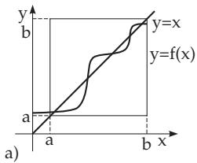
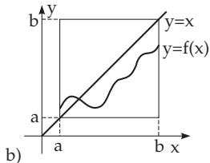

### 12.8 Non-Linear Operators

In the theory of non-linear operator equations the most important methods are based on the following principles:

1. Principle of the Contracting Mapping, Banach Fixed-Point Theorem (see 12.2.2.3, p. 666, and 12.2.2.4, p. 666). For further modifications of this principle see [12.8],[12.11], [12.12], [12.18].

2. Generalization of the Newton Method (see 18.2.5.2, p. 931 and 19.1.1.2, p. 950) for the infinite dimensional case.

3. Schauder Fixed-Point Principle (see 12.8.4, p. 691)

4. Leray-Schauder Theory (see 12.8.5, p. 692)

Methods based on principles 1 and 2 yield information on the existence, uniqueness, constructivity etc. of the solution, while methods based on principles 3 and 4, in general, allow “only” the qualitative statement of the existence of a solution. If further properties of operators are known then see also 12.8.6, p. 692, and 12.8.7, p. 693.

#### 12.8.1 Examples of Non-Linear Operators

For non-linear operators the relation between continuity and boundedness discussed for linear operators in 12.5.1, p. 677 is no longer valid in general. In studying non-linear operator equations, e.g., nonlinear boundary value problems or integral equations, the following non-linear operators occur most often. Iteration methods described in 12.2.2.4, p. 666, can be successfully applied for solving non-linear integral equations.

1. Nemytskij Operator

Let Ω be an open measurable subset from $\mathbb { R } ^ { n }$ (12.9.1, p. 693) and $f \colon \Omega \times \mathbb { R } \longrightarrow \mathbb { R }$ a function of two variables $f ( x , s )$ , which is continuous with respect to x for almost every s and measurable with respect to s for every x (Caratheodory conditions). The non-linear operator $\check { \mathcal { N } }$ to $\mathcal F ( \Omega )$ defined as

$$
(  { \mathcal { N } } u ) ( x ) = f [ x , u ( x ) ] \quad ( x \in \Omega )\tag{12.190}
$$

is called the Nemytskij operator. It is continuous and bounded if it maps $L ^ { p } ( \Omega )$ into $L ^ { q } ( \Omega )$ , where $\frac { 1 } { p } + \frac { 1 } { q } = 1$ . This is the case, e.g., if

$$
| f ( x , s ) | \leq a ( x ) + b | s | ^ { \frac { p } { q } } \quad { \mathrm { w i t h } } \quad a ( x ) \in L ^ { q } ( \Omega ) \quad ( b > 0 )\tag{12.191}
$$

or if f: Ω IR IR is continuous. The operator is compact only in special cases.

2. Hammerstein Operator

Let Ω be a relatively compact subset of $\mathbb { R } ^ { n } , f$ a function satisfying the Caratheodory conditions and $K ( x , y )$ a continuous function on $\overline { { \Omega } } \times \overline { { \Omega } }$ . The non-linear operator on $\mathcal { F } ( \Omega )$

$$
( { \mathcal { H } } u ) ( x ) = \intop _ { \Omega } K ( x , y ) f [ y , u ( y ) ] d y \quad ( x \in \Omega )\tag{12.192}
$$

is called the Hammerstein operator. can be written in the form $\mathscr { H } = \mathscr { K } \cdot \mathscr { N }$ with the Nemytskij operator and the integral operator determined by the kernel K

$$
( \mathcal K u ) ( x ) = \underset { \Omega } { \int } K ( x , y ) u ( y ) d y \quad ( x \in \Omega ) .\tag{12.193}
$$

If the kernel $K ( x , y )$ satisfies the additional condition

$$
\int _ { \Omega \times \Omega } | K ( x , y ) | ^ { q } d x d y < \infty\tag{12.194}
$$

and the function f satisfies the condition (12.191), then is a continuous and compact operator on $L ^ { p } ( \Omega )$

3. Urysohn Operator

Let $\Omega \subset \mathbb { R } ^ { n }$ be an open measurable subset and $K ( x , y , s ) : \ \Omega \times \Omega \times \mathbb { R } \longrightarrow \mathbb { R }$ a function of three variables. Then the non-linear operator on $\mathcal { F } ( \Omega )$

$$
( \mathcal { U } u ) ( x ) = \intop _ { \Omega } K [ x , y , u ( y ) ] d y \quad ( x \in \Omega )\tag{12.195}
$$

is called the Urysohn operator. If the kernel K satisfies the appropriate conditions, then is a continuous and compact operator in ${ \mathcal { C } } ( \Omega )$ or in $L ^ { p } ( \Omega )$ , respectively.

#### 12.8.2 Differentiability of Non-Linear Operators

Let X, Y be Banach spaces, $D \subset \mathrm { X }$ be an open set and $T \colon D \longrightarrow \mathbb { Y }$ . The operator $T$ is called Fr´echet diferentiable (or, briefly, diferentiable) at the point $x \in D$ if there exists a linear operator $L \in B ( \mathrm { X } , \mathrm { Y } )$ (in general depending on the point x) such that

$$
T ( x + h ) - T ( x ) = L h + \omega ( h ) \quad \mathrm { w i t h } \quad \| \omega ( h ) \| = o ( \| h \| )\tag{12.196}
$$

or in an equivalent form

$$
\operatorname* { l i m } _ { \| h \| \to 0 } { \frac { \| T ( x + h ) - T ( x ) - L h \| } { \| h \| } } = 0 ,\tag{12.197}
$$

$\mathrm { i . e . , } \forall \varepsilon > 0 , \exists \delta > 0$ , such that $\| h \| < \delta$ implies $\| T ( x + h ) - T ( x ) - L h \| \leq \varepsilon \| h \|$ . The operator $L ,$ which is usually denoted by $T ^ { \prime } ( x ) { \stackrel { . . } { , } } { \ddot { T ^ { \prime } } } ( x , \cdot ) \ \mathrm { o r } \ { \mathrm { \tilde { \cal T } } } ^ { \prime } ( x ) { \ddot { ( \cdot ) } }$ , is called the Fr´echet derivative of the operator $\dot { T }$ at the point $x .$ The value $d T ( x ; h ) = T ^ { \prime } ( x ) h$ is called the Fr´echet diferential of the operator $T$ at the point $x$ (for the increment $h )$

The diferentiability of an operator at a point implies its continuity at that point. $\mathrm { I f } T \in B ( { \mathrm { X } } , { \mathrm { Y } } )$ , i,e., $T$ itself is linear and continuous, then $\dot { T }$ is diferentiable at every point, and its derivative is equal to $T$

#### 12.8.3 Newton’s Method

Let X, D be as in the previous paragraph and $T \colon D \longrightarrow \mathbb { Y }$ . Under the assumption of the diferentiability of $T$ at every point of the set D an operator $T ^ { \prime } \colon D \longrightarrow B ( \mathrm { X } , \mathrm { Y } )$ is defined by assigning the element $T ^ { \prime } ( x ) \in B ( \bar { \mathrm { X } } , \bar { \mathrm { Y } } )$ to every point $x \in D$ . Suppose the operator $T ^ { \prime }$ is continuous on $\bar { D }$ (in the operator norm); in this case $T$ is called continuously diferentiable on D.

Suppose $\mathbb { Y } = \mathrm { X }$ and also that the set D contains a solution $x ^ { * }$ of the equation

$$
T ( x ) = 0 .\tag{12.198}
$$

Furthermore, it is assumed that the operator $T ^ { \prime } ( x )$ is continuously invertible for each $x \in D$ , hence $[ T ^ { \prime } ( x ) ] ^ { - 1 }$ is in $B ( \mathbf { X } )$ . Because of (12.196) for an arbitrary $x _ { 0 } \in D$ one conjectures that the elements ${ \dot { T } } ( { \dot { x } } _ { 0 } ) { \dot { = } } T ( x _ { 0 } ) - { \dot { T } } ( x ^ { * } )$ and $T ^ { \prime } ( x _ { 0 } ) \dot { ( x _ { 0 } - x ^ { * } ) }$ ) are “not $\mathrm { f a r } ^ { \mathrm { * } }$ from each other and therefore the element $x _ { 1 }$ defined as

$$
x _ { 1 } = x _ { 0 } - [ T ^ { \prime } ( x _ { 0 } ) ] ^ { - 1 } T ( x _ { 0 } )\tag{12.199}
$$

is an approximation of $x ^ { * }$ (under the given assumptions). Starting with an arbitrary $x _ { 0 }$ the so-called Newton approximation sequence

$$
x _ { n + 1 } = x _ { n } - [ T ^ { \prime } ( x _ { n } ) ] ^ { - 1 } T ( x _ { n } ) \quad ( n = 0 , 1 , \ldots )\tag{12.200}
$$

can be constructed. There are many theorems known from the literature discussing the behavior and the convergence properties of this method. Here only the following most important result is mentioned which demonstrates the main properties and advantages of Newton’s method:

$\forall \ : \varepsilon \in ( 0 , 1 )$ there exists a ball $B = B ( x _ { 0 } ; \delta ) , \delta = \delta ( \varepsilon )$ in X, such that all points $x _ { n }$ lie in B and the Newton sequence converges to the solution $x ^ { * }$ of (12.198). Moreover, $\| x _ { n } - \dot { x } _ { 0 } \| \leq \varepsilon ^ { n } \| x _ { 0 } - x ^ { * } \|$ which yields a practical error estimation.

The modified Newton’s method is obtained if the operator $[ T ^ { \prime } ( x _ { 0 } ) ] ^ { - 1 }$ is used instead of $[ T ^ { \prime } ( x _ { n } ) ] ^ { - 1 } { \mathrm { ~ } } \forall n =$ $0 , 1 , \ldots$ . in formula (12.200). For further estimations of the speed of convergence and for the (in general sensitive) dependence of the method on the choice of the starting point $x _ { 0 }$ see [12.7], [12.12], [12.18].

Jacobian or Functional Matrix Given a non-linear operator $T = F \colon D \longrightarrow \mathbb { R } ^ { m }$ on an open set $D \subset \mathbb { R } ^ { n }$ with m non-linear coordinate functions $F _ { 1 } , F _ { 2 } , \dots , \bar { F } _ { m }$ and n independent variables $x _ { 1 } , x _ { 2 } , \ldots , x _ { n } .$ Then

$$
F ( x ) = { \left( \begin{array} { l } { F _ { 1 } ( x ) } \\ { F _ { 2 } ( x ) } \\ { \vdots } \\ { F _ { m } ( x ) } \end{array} \right) } \quad \in \mathbb { R } ^ { m } \quad \forall x = ( x _ { 1 } , x _ { 2 } , \ldots , x _ { n } ) \in D\tag{12.201}
$$

holds. If the partial derivatives ${ \frac { \partial F _ { i } } { \partial x _ { k } } } \left( k = 1 , 2 , \ldots , n \right)$ of the coordinate functions $F _ { i } \ ( i = 1 , 2 , \dots , m )$ on D exist and are continuous, then the mapping (the operator) F in every point of D is diferentiable and its derivative at the point $x = ( x _ { 1 } , x _ { 2 } , \ldots , x _ { n } ) \in D$ is the linear operator $F ^ { \prime } ( x ) : \mathbb { R } ^ { n } \longrightarrow \mathbb { R } ^ { m }$ with the matrix representation

$$
F ^ { \prime } ( x ) = \left( \begin{array} { c c c c } { { \displaystyle \frac { \partial F _ { 1 } ( x ) } { \partial x _ { 1 } } } } & { { \displaystyle \frac { \partial F _ { 1 } ( x ) } { \partial x _ { 2 } } } } & { { \ldots } } & { { \displaystyle \frac { \partial F _ { 1 } ( x ) } { \partial x _ { n } } } } \\ { { \displaystyle \frac { \partial F _ { 2 } ( x ) } { \partial x _ { 1 } } } } & { { \displaystyle \frac { \partial F _ { 2 } ( x ) } { \partial x _ { 2 } } } } & { { \ldots } } & { { \displaystyle \frac { \partial F _ { 2 } ( x ) } { \partial x _ { n } } } } \\ { { \vdots } } & { { \vdots } } & { { \vdots } } & { { \vdots } } \\ { { \displaystyle \frac { \partial F _ { m } ( x ) } { \partial x _ { 1 } } } } & { { \displaystyle \frac { \partial F _ { m } ( x ) } { \partial x _ { 2 } } } } & { { \ldots } } & { { \displaystyle \frac { \partial F _ { m } ( x ) } { \partial x _ { n } } } } \end{array} \right) .\tag{12.202}
$$

The derivative $F ^ { \prime } ( x )$ is a matrix of the type $( m , n )$ . It is called the Jacobian or functional matrix of F . Special cases of occurrence are, e.g., the iterative solution of systems of non-linear equations by the Newton method (see 19.2.2.2, p. 962) or describing the independence of functions (see 2.18.2.6, 3., p. 123).

For $m = n$ the so-called functional determinant or Jacobian determinant can be formed, which is denoted shortly by

$$
{ \frac { D ( F _ { 1 } , F _ { 2 } , \ldots , F _ { n } ) } { D ( x _ { 1 } , x _ { 2 } , \ldots , x _ { n } ) } } .\tag{12.203}
$$

This determinant is used for the solution of (mostly inner-mathematical) problems (see also, e.g., 8.5.3.2, p. 539).

#### 12.8.4 Schauder’s Fixed-Point Theorem

Let $T : D \longrightarrow X$ be a non-linear operator defined on a subset D of a Banach space X. The non-trivial question of whether the equation $x = T ( x )$ has at least one solution, can be answered as follows: If $\bar { \mathbf { X } } = \mathbb { R }$ and $D = [ - 1 , 1 ]$ , then every continuous function, mapping D into D, has a fixed point in D. If X is an arbitrary finite dimensional normed space $\mathrm { ( d i m X \geq 2 ) }$ , then Brouwer’s fixed-point theorem holds.

1. Brouwer’s Fixed-Point Theorem Let D be a non-empty closed bounded and convex subset of a finite dimensional normed space. If T is a continuous operator, which maps D into itself, then T has at least one fixed point in D.

The answer in the case of an arbitrary infinite dimensional Banach space X is given by Schauder’s fixed-point theorem.

2. Schauder’s Fixed-Point Theorem Let D be a non-empty closed bounded and convex subset of a Banach space X. If the operator $T : D \longrightarrow \mathrm { X }$ is continuous and compact (hence completel continuous) and it maps D into itself, then T has at least one fixed point in D. By using this theorem, it is proved, e.g., that the initial value problem (12.70), p. 668, always has a By using this theorem, it is proved. e g., that the initial value problem (12.70), p. 668, always has a

local solution for $t \geq 0$ , if the right-hand side is assumed only to be continuous.

#### 12.8.5 Leray-Schauder Theory

For the existence of solutions of the equations $x = T ( x )$ and $( I + T ) ( x ) = y$ with a completely continuous operator $T _ { i }$ , a further principle is found which is based on deep properties of the mapping degree. It can be successfully applied to prove the existence of a solution of non-linear boundary value problems. Here only those results of this theory are mentioned which are the most useful ones in practical problems, and for simplicity a formulation is chosen which avoids the notion of the mapping degree.

Leray–Schauder Theorem: Let D be an open bounded set in a real Banach space X and let $T$ ${ \overline { { D } } } { : } \longrightarrow \mathrm { X }$ be a completely continuous operator. Let $y \in D$ be a point such that $x + \bar { \lambda } T ( x ) \neq y$ for each $x \in \partial D$ and $\lambda \in [ 0 , 1 ]$ , where ∂D denotes the boundary of the set D. Then the equation $( I + T ) ( x ) = y$ has at least one solution.

The following version of this theorem is very useful in applications:

Let T be a completely continuous operator in the Banach space X. If all solutions of the family of equations

$$
x = \lambda T ( x ) \quad ( \lambda \in [ 0 , 1 ] )\tag{12.204}
$$

are uniformly bounded, i.e., $\exists c > 0$ such that λ and $\forall x$ satisfying (12.204) the a priori estimation $\| x \| \leq c$ holds, then the equation $x = T ( x )$ has a solution.

#### 12.8.6 Positive Non-Linear Operators

The successful application of Schauder’s fixed-point theorem requires the choice of a set with appropriate properties, which is mapped into itself by the considered operator. In applications, especially in the theory of non-linear boundary value problems, ordered normed function spaces and positive operators are often considered, i.e., which leave the corresponding cone invariant, or isotone increasing operators, i.e., if $x \leq y \Rightarrow T ( x ) \leq T ( y )$ . If confusions (see, e.g., 12.8.7, p. 693) are excluded, these operators are also called monotone.

Let $\mathrm {  ~ X ~ } = ~ ( \mathrm {  ~ X ~ } , \mathrm {  ~ X _ { + } ~ } , \| \mathrm {  ~ \cdot ~ } \| )$ be an ordered Banach space, $\mathrm { X } _ { + }$ a closed cone and $[ a , b ]$ an order interval of X. If $\mathrm { X } _ { + }$ ·is normal and $T$ is a completely continuous (not necessarily isotone) operator that satisfies $T ( [ a , b ] ) ^ { \dot { } } \subset [ a , b ]$ , then T has at least one fixed point in [a, b] (Fig. 12.6b).

  
Figure 12.6

Notice that the condition $T ( [ a , b ] ) \subset [ a , b ]$ automatically holds for any isotone increasing operator $T ,$ which is defined on an (o)-interval (order interval) [a, b] of the space X if it maps only the endpoints a, b into $[ a , b ] , \mathrm { i . e . }$ , when the two conditions $T ( a ) \geq a$ and ${ \dot { T } } ( b ) \leq b$ are satisfied. Then both sequences

$$
x _ { 0 } = a { \mathrm { ~ a n d ~ } } x _ { n + 1 } = T ( x _ { n } ) { \mathrm { ~ } } ( n \geq 0 ) { \mathrm { ~ a n d ~ } } y _ { 0 } = b { \mathrm { ~ a n d ~ } } y _ { n + 1 } = T ( y _ { n } ) { \mathrm { ~ } } ( n \geq 0 )\tag{12.205}
$$

are well defined, $\mathrm { i . e . , } x _ { n } , y _ { n } \in [ a , b ] , n \geq 0$ . They are monotone increasing and decreasing, respectively, ${ \mathrm { i . e . , } } a = x _ { 0 } \leq x _ { 1 } \leq . . . \leq x _ { n } \leq . .$ . and $b = y _ { 0 } \geq y _ { 1 } \geq . . . y _ { n } \geq . . . . \mathrm { ~ A ~ }$ fixed point $x _ { * } , x ^ { * }$ of the operator T is called minimal, maximal, respectively, if for every fixed point z of T the inequalities x $\leq z , z \leq x ^ { * }$ hold, respectively.

Now,the following statement is valid (Fig. 12.6a)): Let X be an ordered Banach space with a closed cone $\mathrm { X _ { + } }$ and $T \colon D \longrightarrow \mathrm { X } , ~ D \subset \mathrm { X }$ a continuous isotone increasing operator. Let $[ a , b ] \subset D$ be such that $T ( a ) \geq a$ and $T ( b ) \leq b$ . Then $T ( [ a , b ] ) \subset [ a , b ]$ , and the operator $\dot { T }$ has a fixed point in $[ a , b ]$ if one of the following conditions is fulfilled:

a) $\mathrm { X } _ { + }$ is normal and $T$ is compact;

b) $\mathrm { X } _ { + }$ is regular.

Then the sequences $\{ x _ { n } \} _ { n = 0 } ^ { \infty }$ and $\{ y _ { n } \} _ { n = 0 } ^ { \infty } ,$ defined in (12.205), converge to the minimal and to the maximal fixed points of T in $[ a , b ]$ , respectively.

The notion of the super- and sub-solutions is based on these results (see [12.14]).

#### 12.8.7 Monotone Operators in Banach Spaces

1. Special Properties

An arbitrary operator T: $D \subset \mathrm { X } \longrightarrow \mathbb { Y }$ (X, Y normed spaces) is called demi-continuous at the point $x _ { 0 } \in D$ if for each sequence $\{ x _ { n } \} _ { n = 1 } ^ { \infty } \subset D$ converging to $x _ { 0 }$ (in the norm of $\mathrm { X } )$ the sequence $\{ T ( x _ { n } ) \} _ { n = 1 } ^ { \infty }$ converges weakly to ${ \bf { \dot { T } } } ( x _ { 0 } )$ in $\check { \Upsilon } . \check { T }$ is called demi-continuous on the set D if T is demi-continuous at every point of $D$

In this paragraph another generalization of the notion of monotonicity known from real analysis are introduced. Let X now be a real Banach space, $\mathrm { \mathbf { X } ^ { * } }$ its dual, $D \subset \mathrm { X }$ and $T \colon D \longrightarrow \mathrm { X } ^ { * }$ a non-linear operator. $T$ is called monotone if $\forall x , y \in \bar { D }$ the inequality $( T ( x ) - T ( y ) , x - y ) \geq 0$ holds. $\mathrm { I f } \mathrm { X } = \mathbb { H }$ is a Hilbert space, then $( \cdot , \cdot )$ means the scalar product, while in the case of an arbitrary Banach space one refers to the notation introduced in 12.5.4.1, p. 681. The operator $T$ is called strongly monotone if there is a constant $c > 0$ such that $( T ( x ) - T ( { \hat { y } } ) , x - y ) \geq c \Vert x - y \Vert ^ { 2 }$ for $\forall x , y \in D$ . An operator $T \colon \mathrm { X } \longrightarrow \mathrm { X } ^ { * }$ is called coercive if $\operatorname* { l i m } _ { \| x \|  \infty } \frac { ( T ( x ) , x ) } { \| x \| } = \infty$

2. Existence Theorems

for solutions of operator equations with monotone operators are given here only exemplarily: If the operator $T _ { \ast }$ , mapping the real separable Banach space X into $\mathbf { X } ^ { * }$ $( \bar { D _ { T } } = \mathrm { X } )$ , is monotone demi-continuous and coercive, then the equation $T ( x ) = f$ has a solution for arbitrary $f \in \mathbf { X } ^ { * }$

If in addition the operator $T$ is strongly monotone, then the solution is unique. In this case the inverse operator $T ^ { - 1 }$ also exists.

For a monotone, demi-continuous operator $T \colon \mathbb { H } \longrightarrow \mathbb { H }$ in a Hilbert space IH with $D _ { T } = \mathbb { H }$ , there holds $I m ( I + T ) = \mathbb { H }$ , where $( I + T ) ^ { - 1 }$ is continuous. If T is supposed to be strongly monotone, then $T ^ { - 1 }$ is bijective with a continuous $T ^ { - 1 }$

Constructive approximation methods for the solution of the equation $T ( x ) = 0$ with a monotone operator T in a Hilbert space are based on the idea of Galerkin’s method (see 19.4.2.2, p. 974, or [12.10], [12.18]). By means of this theory set-valued operators $T \colon \mathrm { X } \longrightarrow 2 ^ { X ^ { * } }$ can also be handled. The notion of monotonicity is then generalized by $( f - g , x - y ) \ge 0 , \forall x , y \in D _ { T }$ and $f \in T ( x ) , g \in T ( y )$
