### 13.1 Basic Notions of the Theory of Vector Fields

#### 13.1.1 Vector Functions of a Scalar Variable

##### 13.1.1.1 Definitions

1. Vector Function of a Scalar Variable t

A vector function of a scalar variable is a vector a whose components are real functions of t:

$$
\vec { \mathbf { a } } = \vec { \mathbf { a } } ( t ) = a _ { x } ( t ) \vec { \mathbf { e } } _ { x } + a _ { y } ( t ) \vec { \mathbf { e } } _ { y } + a _ { z } ( t ) \vec { \mathbf { e } } _ { z } .\tag{13.1}
$$

The notions of limit, continuity, diferentiability are defined componentwise for the vector $\vec { \bf a } ( t )$

2. Hodograph of a Vector Function

Considering the vector function $\vec { \bf a } ( t )$ as a position or radius vector $\vec { \bf r } = \vec { \bf r } ( t )$ of a point P, then this function describes a space curve while t varies (Fig. 13.1). This space curve is called the hodograph of the vector function a(t).

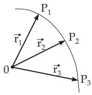  
Figure 13.1

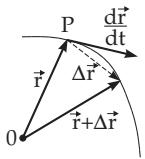  
Figure 13.2

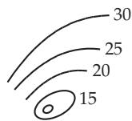  
Figure 13.3

##### 13.1.1.2 Derivative of a Vector Function

The derivative of (13.1) with respect to t is also a vector function of t:

$$
\frac { d \vec { \mathbf { a } } } { d t } = \operatorname* { l i m } _ { \Delta t  0 } \frac { \vec { \mathbf { a } } ( t + \Delta t ) - \vec { \mathbf { a } } ( t ) } { \Delta t } = \frac { d a _ { x } ( t ) } { d t } \vec { \mathbf { e } } _ { x } + \frac { d a _ { y } ( t ) } { d t } \vec { \mathbf { e } } _ { y } + \frac { d a _ { z } ( t ) } { d t } \vec { \mathbf { e } } _ { z } .\tag{13.2}
$$

The geometric representation of the derivative $\frac { d \vec { \mathbf { r } } } { d t }$ of the radius vector is a vector pointing in the direction of the tangent of the hodograph at the point P (Fig. 13.2). Its length depends on the choice of the parameter t. If t is the time, then the vector r(t) describes the motion of a point P in space (the space curve is its path), and $\frac { d \vec { \mathbf { r } } } { d t }$ has the direction and magnitude of the velocity of this motion. If $t = s$ is the arclength of this space curve, measured from a certain point, then obviously $\left| \frac { d \vec { \mathbf { r } } } { d s } \right| = 1$

##### 13.1.1.3 Rules of Differentiation for Vectors

$$
{ \frac { d } { d t } } \ ( { \vec { \mathbf { a } } } \pm { \vec { \mathbf { b } } } \pm { \vec { \mathbf { c } } } ) = { \frac { d { \vec { \mathbf { a } } } } { d t } } \pm { \frac { d { \vec { \mathbf { b } } } } { d t } } \pm { \frac { d { \vec { \mathbf { c } } } } { d t } } ,\tag{13.3a}
$$

$$
{ \frac { d } { d t } } \ ( \varphi { \vec { \mathbf { a } } } ) = { \frac { d \varphi } { d t } } { \vec { \mathbf { a } } } + \varphi { \frac { d { \vec { \mathbf { a } } } } { d t } }
$$

(ϕ is a scalar function of t),

(13.3b)

$$
\frac { d } { d t } \mathbf { \Gamma } ( \vec { \mathbf { a } } \vec { \mathbf { b } } ) = \frac { d \vec { \mathbf { a } } } { d t } \vec { \mathbf { b } } + \vec { \mathbf { a } } \frac { d \vec { \mathbf { b } } } { d t } ,\tag{13.3c}
$$

\- Springer-Verlag Berlin Heidelberg 2015 I.N. Bronshtein et al., Handbook of Mathematics, DOI 10.1007/978-3-662-46221-8\_13

$$
{ \frac { d } { d t } } \ ( { \vec { \mathbf { a } } } \times { \vec { \mathbf { b } } } ) = { \frac { d { \vec { \mathbf { a } } } } { d t } } \times { \vec { \mathbf { b } } } + { \vec { \mathbf { a } } } \times { \frac { d { \vec { \mathbf { b } } } } { d t } } \qquad { \mathrm { ( t h e ~ f a c t o r s ~ m u s t ~ n o t ~ b e ~ i n t e r c h a n g e d ) , } }\tag{13.3d}
$$

$$
{ \frac { d } { d t } } { \vec { \mathbf { a } } } [ \varphi ( t ) ] = { \frac { d { \vec { \mathbf { a } } } } { d \varphi } } \cdot { \frac { d \varphi } { d t } } { \mathrm { ( c h a i n ~ r u l e ) . } }\tag{13.3e}
$$

If a(t) = const, i.e., $\vec { \mathbf { a } } ^ { 2 } ( t ) = \vec { \mathbf { a } } ( t ) \cdot \vec { \mathbf { a } } ( t ) = \mathrm { c o n s t }$ , then it follows from (13.3c) that $\vec { \bf a } \cdot \frac { d \vec { \bf a } } { d t } = 0 , \mathrm { i . e . , } \frac { d \vec { \bf a } } { d t }$ and a are perpendicular to each other. Examples of this fact:

A: Radius and tangent vectors of a circle in the plane and

B: position and tangent vectors of a curve on the sphere. Then the hodograph is a spherical curve.

##### 13.1.1.4 Taylor Expansion for Vector Functions

$$
{ \vec { \mathbf { a } } } ( t + h ) = { \vec { \mathbf { a } } } ( t ) + h { \frac { d { \vec { \mathbf { a } } } } { d t } } + { \frac { h ^ { 2 } } { 2 ! } } { \frac { d ^ { 2 } { \vec { \mathbf { a } } } } { d t ^ { 2 } } } + \cdots + { \frac { h ^ { n } } { n ! } } { \frac { d ^ { n } { \vec { \mathbf { a } } } } { d t ^ { n } } } + \cdots .\tag{13.4}
$$

The expansion of a vector function in a Taylor series makes sense only if it is convergent. Because the limit is defined componentwise, the convergence can be checked componentwise, so the convergence of this series with vector terms can be determined exactly by the same methods as the convergence of a series with complex terms (see 14.3.2, p. 751). So the convergence of a series with vector terms is reduced to the convergence of a series with scalar terms.

The diferential of a vector function $\vec { \bf a } ( t )$ is defined by:

$$
d \vec { \mathbf { a } } = \frac { d \vec { \mathbf { a } } } { d t } \Delta t .\tag{13.5}
$$

#### 13.1.2 Scalar Fields

##### 13.1.2.1 Scalar Field or Scalar Point Function

If a number (scalar value) U is assigned to every point $P$ of a subset of space, then one writes

$$
U = U ( P )\tag{13.6a}
$$

and one calls (13.6a) a scalar field (or scalar function).

Examples of scalar fields are temperature, density, potential, etc., of solids.

A scalar field $U = U ( P )$ can also be considered as

$$
U = U ( { \vec { \mathbf { r } } } ) ,\tag{13.6b}
$$

where r is the position vector of the point P with a given pole 0 (see 3.5.1.1, 6., p. 182).

##### 13.1.2.2 Important Special Cases of Scalar Fields

1. Plane Field

One speaks of a plane field, if the function is defined only for the points of a plane in space.

2. Central Field

If a function has the same value at all points P lying at the same distance from a fixed point $C ( \vec { \bf r } _ { 1 } )$ called the center, then it is called a central symmetric field or also a central or spherical field. The function U depends only on the distance ${ \overline { { C P } } } = | { \vec { \mathbf { r } } } |$

$$
U = f ( | { \vec { \mathbf { r } } } | ) .\tag{13.7a}
$$

The field of the intensity of a point-like source, e.g., the field of brightness of a point-like source of light at the pole, can be described with $| { \vec { \mathbf { r } } } | = r$ as the distance from the light source:

$$
U = { \frac { c } { r ^ { 2 } } } \quad ( c \operatorname { c o n s t } ) .\tag{13.7b}
$$

3. Axial Field

If the function U has the same value at all points lying at an equal distance from a certain straight line (axis of the field) then the field is called cylindrically symmetric or an axially symmetric field, or briefly an axial field.

##### 13.1.2.3 Coordinate Representation of Scalar Fields

If the points of a subset of space are given by their coordinates, e.g., by Cartesian, cylindrical, or spherical coordinates, then the corresponding scalar field (13.6a) is represented, in general, by a function of three variables:

$$
U = \varPhi ( x , y , z ) , \qquad U = \varPsi ( \rho , \varphi , z ) \qquad \mathrm { o r } \qquad U = \chi ( r , \vartheta , \varphi ) .\tag{13.8a}
$$

In the case of a plane field, a function with two variables is suficient. It has the form in Cartesian and polar coordinates:

$$
U = \phi ( x , y ) \qquad { \mathrm { o r } } \qquad U = \varPsi ( \rho , \varphi ) .\tag{13.8b}
$$

The functions in (13.8a) and (13.8b), in general, are assumed to be continuous, except, maybe, at some points, curves or surfaces of discontinuity. The functions have the form

a) for a central field:

$$
U = U ( { \sqrt { x ^ { 2 } + y ^ { 2 } + z ^ { 2 } } } ) = U ( { \sqrt { \rho ^ { 2 } + z ^ { 2 } } } ) = U ( r )\tag{13.9a}
$$

with the origin of the coordinate system as the pole of the field,

b) for an axial field:

$$
U = U ( { \sqrt { x ^ { 2 } + y ^ { 2 } } } ) = U ( \rho ) = U ( r \sin \vartheta )\tag{13.9b}
$$

with the z-axis as the axis of the field.

Dealing with central fields is easiest using spherical coordinates, with axial fields using cylindrical coordinates.

##### 13.1.2.4 Level Surfaces and Level Lines of a Field

1. Level Surface

A level surface is the union of all points P in space where the function (13.6a) has a constant value

$$
U = U ( P ) = { \mathrm { c o n s t . } }\tag{13.10a}
$$

Diferent constants $U _ { 0 } , U _ { 1 } , U _ { 2 } , . . .$ . define diferent level surfaces. There is a level surface passing through every point except the points where the function is not defined. The level surface equations in the three coordinate systems used so far are:

$$
U = \phi ( x , y , z ) = \mathrm { c o n s t } , \qquad U = \varPsi ( \rho , \varphi , z ) = \mathrm { c o n s t } , \qquad U = \chi ( r , \vartheta , \varphi ) = \mathrm { c o n s t } .\tag{13.10b}
$$

Examples of level surfaces of diferent fields:

A: $U = { \vec { \mathbf { c } } } { \vec { \mathbf { r } } } = c _ { x } x + c _ { y } y + c _ { z } z { \mathrm { : } }$ Parallel planes.

B: $U = x ^ { 2 } + 2 y ^ { 2 } + 4 z ^ { 2 } \colon$ Similar ellipsoids in similar positions.

C: Central field:

Concentric spheres.

D: Axial field: Coaxial cylinders.

2. Level Lines

Level lines replace level surfaces in plane fields. They satisfy the equation

$$
U = \mathrm { c o n s t . }\tag{13.11}
$$

Level lines are usually drawn for equal intervals of U and each of them is marked by the corresponding value of U (Fig. 13.3).

Well-known examples are the isobaric lines on a synoptic map or the contour lines on topographic maps.

In particular cases, level surfaces degenerate into points or lines, and level lines degenerate into separate points.

The level lines of the fields a) $U = x y ,$ b) $U = { \frac { y } { x ^ { 2 } } } , \operatorname { c } ) U = x ^ { 2 } + y ^ { 2 } = \rho ^ { 2 } , \operatorname { d } ) U = { \frac { 1 } { \rho } }$ are represented in Fig. 13.4.

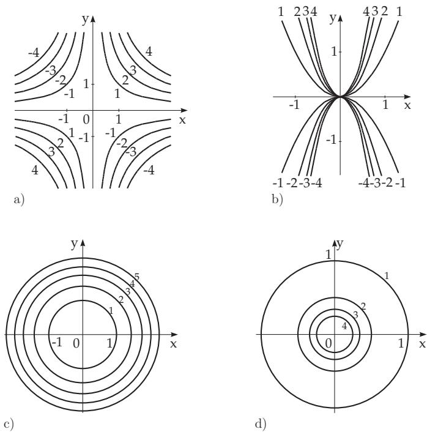  
Figure 13.4

#### 13.1.3 Vector Fields

##### 13.1.3.1 Vector Field or Vector Point Function

If a vector $\vec { \bf V }$ is assigned to every point P of a subset of space, then it is denoted by

$$
\vec { \mathbf { V } } = \vec { \mathbf { V } } ( P )\tag{13.12a}
$$

and calls (13.12a) a vector field.

Examples of vector fields are the velocity field of a fluid in motion, a field of force, and a magnetic or electric intensity field.

A vector field $\vec { \mathbf { V } } = \vec { \mathbf { V } } ( P )$ can be regarded as a vector function

$$
\vec { \mathbf { V } } = \vec { \mathbf { V } } ( \vec { \mathbf { r } } ) ,\tag{13.12b}
$$

where $\vec { \bf r }$ is the position vector of the point $P$ with a given pole 0. If all values of $\vec { \bf r }$ as well as $\vec { \bf V }$ lie in a plane, then the field is called a plane vector field (see 3.5.2, p. 190).

##### 13.1.3.2 Important Cases of Vector Fields

1. Central Vector Field

In a central vector field all vectors $\vec { \bf V }$ lie on straight lines passing through a fixed point called the center (Fig. 13.5a).

Locating the pole at the center, then the field is defined by the formula

$$
{ \vec { \mathbf { V } } } = f ( { \vec { \mathbf { r } } } ) { \vec { \mathbf { r } } } ,\tag{13.13a}
$$

where all the vectors have the same direction as the radius vector $\vec { \mathbf { r } } .$ It often has some advantage to define the field by the formula

$$
\vec { \bf V } = \varphi ( \vec { \bf r } ) \frac { \vec { \bf r } } { r } \quad ( r = | \vec { \bf r } | ) ,\tag{13.13b}
$$

where $| \varphi ( \vec { \bf r } ) |$ is the length of the vector $\vec { \bf V }$ and $\frac { \vec { \mathbf { r } } } { r }$ is a unit vector into the direction of $\vec { \mathbf { r } } .$

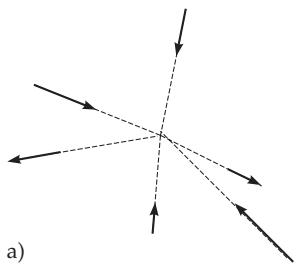

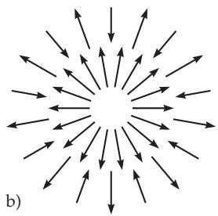

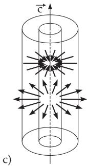  
Figure 13.5

2. Spherical Vector Field

A spherical vector field is a special case of a central vector field, where the length of the vector $\vec { \bf V }$ depends only on the distance $| { \vec { \bf r } } |$ (Fig. 13.5b).

Examples are the Newton and the Coulomb force field of a point-like mass or of a point-like electric charge:

$$
{ \vec { \mathbf { V } } } = { \frac { c } { r ^ { 3 } } } { \vec { \mathbf { r } } } = { \frac { c } { r ^ { 2 } } } { \frac { \vec { \mathbf { r } } } { r } } ( c \operatorname { c o n s t } ) .\tag{13.14}
$$

The special case of a plane spherical vector field is called a circular field.

3. Cylindrical Vector Field

a) All vectors $\vec { \bf V }$ lie on straight lines intersecting a certain line (called the axis) and perpendicular to it, and

b) all vectors $\vec { \bf V }$ at the points lying at the same distance from the axis have equal length, and they are directed either toward the axis or away from it (Fig. 13.5c).

Locating the pole on the axis parallel to the unit vector ${ \vec { \mathbf { c } } } ,$ then the field has the form

$$
\vec { \mathbf { V } } = \varphi ( \rho ) \frac { \vec { \mathbf { r } } ^ { * } } { \rho } ,\tag{13.15a}
$$

where $\vec { \mathbf { r } } ^ { * }$ is the projection of $\vec { \bf r }$ on a plane perpendicular to the axis:

$$
\vec { \mathbf { r } } ^ { * } = \vec { \mathbf { c } } \times ( \vec { \mathbf { r } } \times \vec { \mathbf { c } } ) .\tag{13.15b}
$$

By intersecting this field with planes perpendicular to the axis, one always gets equal circular fields.

##### 13.1.3.3 Coordinate Representation of Vector Fields

1. Vector Field in Cartesian Coordinates

The vector field (13.12a) can be defined by scalar fields $V _ { 1 } ( \vec { \bf r } ) , V _ { 2 } ( \vec { \bf r } )$ , and $V _ { 3 } ( \vec { \bf r } )$ which are the coordinate functions of $\vec { \bf V } .$ , i.e., the coeficients of its decomposition into any three non-coplanar base vectors $\vec { \mathbf { e } } _ { 1 }$ $\vec { \mathbf { e } } _ { 2 } ,$ , and $\vec { \mathbf { e } } _ { 3 }$

$$
\vec { \bf V } = V _ { 1 } \vec { \bf e } _ { 1 } + V _ { 2 } \vec { \bf e } _ { 2 } + V _ { 3 } \vec { \bf e } _ { 3 } .\tag{13.16a}
$$

With the coordinate unit vectors $\vec { \bf i } , \vec { \bf j } , \vec { \bf k }$ as base vectors and expressing the coeficients $V _ { 1 } , \ V _ { 2 } , \ V _ { 3 }$ in Cartesian coordinates one gets

$$
\vec { \bf V } = V _ { x } ( x , y , z ) \vec { \bf i } + V _ { y } ( x , y , z ) \vec { \bf j } + V _ { z } ( x , y , z ) \vec { \bf k } .\tag{13.16b}
$$

So, the vector field can be defined with the help of three scalar functions of three scalar variables.

2. Vector Field in Cylindrical and Spherical Coordinates

In cylindrical and spherical coordinates, the coordinate unit vectors

$$
\vec { \bf e } _ { \rho } , ~ \vec { \bf e } _ { \varphi } , ~ \vec { \bf e } _ { z } ~ ( = \vec { \bf k } ) , \qquad \mathrm { a n d } \qquad \vec { \bf e } _ { r } ~ ( = \frac { \vec { \bf r } } { r } ) , ~ \vec { \bf e } _ { \vartheta } , ~ \vec { \bf e } _ { \varphi }\tag{13.17a}
$$

are tangents to the coordinate lines at each point (Fig. 13.6, 13.7). In this order they always form a right-handed system. The coeficients are expressed as functions of the corresponding coordinates:

$$
\vec { \bf V } = V _ { \rho } ( \rho , \varphi , z ) \vec { \bf e } _ { \rho } + V _ { \varphi } ( \rho , \varphi , z ) \vec { \bf e } _ { \varphi } + V _ { z } ( \rho , \varphi , z ) \vec { \bf e } _ { z } ,\tag{13.17b}
$$

$$
\vec { \mathbf { V } } = V _ { r } ( r , \vartheta , \varphi ) \vec { \mathbf { e } } _ { r } + V _ { \varphi } ( r , \vartheta , \varphi ) \vec { \mathbf { e } } _ { \varphi } + V _ { \vartheta } ( r , \vartheta , \varphi ) \vec { \mathbf { e } } _ { \vartheta } .\tag{13.17c}
$$

At transition from one point to the other, the coordinate unit vectors change their directions, but remain mutually perpendicular.

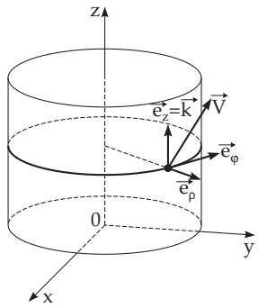  
Figure 13.6

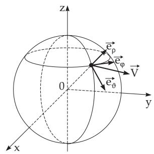  
Figure 13.7

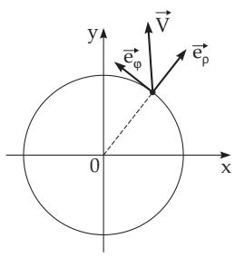  
Figure 13.8

See also Table 13.1.

1. Cartesian Coordinates in Terms of Cylindrical Coordinates

$$
V _ { x } = V _ { \rho } \cos \varphi - V _ { \varphi } \sin \varphi , \qquad V _ { y } = V _ { \rho } \sin \varphi + V _ { \varphi } \cos \varphi , \qquad V _ { z } = V _ { z } .\tag{13.18}
$$

2. Cylindrical Coordinates in Terms of Cartesian Coordinates

$$
V _ { \rho } = V _ { x } \cos \varphi + V _ { y } \sin \varphi , \qquad V _ { \varphi } = - V _ { x } \sin \varphi + V _ { y } \cos \varphi , \qquad V _ { z } = V _ { z } .\tag{13.19}
$$

3. Cartesian Coordinates in Terms of Spherical Coordinates

$$
V _ { x } = V _ { r } \sin { \vartheta } \cos { \varphi } - V _ { \varphi } \sin { \varphi } + V _ { \vartheta } \cos { \varphi } \cos { \vartheta } ,
$$

$$
V _ { y } = V _ { r } \sin { \vartheta } \sin { \varphi } + V _ { \varphi } \cos { \varphi } + V _ { \vartheta } \sin { \varphi } \cos { \vartheta } ,
$$

$$
V _ { z } = V _ { r } \cos \vartheta - V _ { \vartheta } \sin \vartheta .\tag{13.20}
$$

4. Spherical Coordinates in Terms of Cartesian Coordinates

$$
V _ { r } = V _ { x } \sin { \vartheta } \cos { \varphi } + V _ { y } \sin { \vartheta } \sin { \varphi } + V _ { z } \cos { \vartheta } ,
$$

$$
V _ { \vartheta } = V _ { x } \cos \vartheta \cos \varphi + V _ { y } \cos \vartheta \sin \varphi - V _ { z } \sin \vartheta ,\tag{13.21}
$$

$$
\begin{array} { r } { V _ { \varphi } = - \operatorname { \mathrm { \Gamma } } _ { x } \sin \varphi + \operatorname { \mathrm { } } V _ { y } \cos \varphi . } \end{array}
$$

5. Expression of a Spherical Vector Field in Cartesian Coordinates

$$
\vec { \mathbf { V } } = \varphi ( \sqrt { x ^ { 2 } + y ^ { 2 } + z ^ { 2 } } ) ( x \vec { \mathbf { i } } + y \vec { \mathbf { j } } + z \vec { \mathbf { k } } ) .\tag{13.22}
$$

6. Expression of a Cylindrical Vector Field in Cartesian Coordinates

$$
\vec { \mathbf { V } } = \varphi ( \sqrt { x ^ { 2 } + y ^ { 2 } } ) ( x \vec { \mathbf { i } } + y \vec { \mathbf { j } } ) .\tag{13.23}
$$

In the case of a spherical vector field, spherical coordinates are most convenient for investigations, i.e., the form ${ \vec { \mathbf { V } } } = V ( r ) { \vec { \mathbf { e } } } _ { r } ;$ ; and for investigations in cylindrical fields, cylindrical coordinates are most convenient, i.e., the form $\vec { \mathbf { V } } = V ( \varphi ) \vec { \mathbf { e } } _ { \varphi }$ . In the case of a plane field (Fig. 13.8)

$$
\vec { \mathbf { V } } = V _ { x } ( x , y ) \vec { \mathbf { i } } + V _ { y } ( x , y ) \vec { \mathbf { j } } = V _ { \rho } ( \rho , \varphi ) \vec { \mathbf { e } } _ { \rho } + V _ { \varphi } ( \rho , \varphi ) \vec { \mathbf { e } } _ { \varphi } ,\tag{13.24}
$$

holds and for a circular field

$$
\vec { \mathbf { V } } = \varphi ( \sqrt { x ^ { 2 } + y ^ { 2 } } ) ( x \vec { \mathbf { i } } + y \vec { \mathbf { j } } ) = \varphi ( \rho ) \vec { \mathbf { e } } _ { \rho } .\tag{13.25}
$$

Table 13.1 Relations between the components of a vector in Cartesian, cylindrical, and spherical coordinates
<table><tr><td rowspan=1 colspan=1>Cartesian coordinates</td><td rowspan=1 colspan=1>Cylindrical coord.</td><td rowspan=1 colspan=1>Spherical coordinates</td></tr><tr><td rowspan=1 colspan=1> $\vec { \mathbf { V } } = V _ { x } \vec { \mathbf { e } } _ { x } + V _ { y } \vec { \mathbf { e } } _ { y } + V _ { z } \vec { \mathbf { e } } _ { z }$ </td><td rowspan=1 colspan=1> $V _ { \rho } \vec { \mathbf { e } } _ { \rho } + V _ { \varphi } \vec { \mathbf { e } } _ { \varphi } + V _ { z } \vec { \mathbf { e } } _ { z }$ </td><td rowspan=1 colspan=1> $V _ { r } \vec { \mathbf { e } } _ { r } + V _ { \vartheta } \vec { \mathbf { e } } _ { \vartheta } + V _ { \varphi } \vec { \mathbf { e } } _ { \varphi }$ </td></tr><tr><td rowspan=1 colspan=1> $V _ { x }$  $V _ { y }$  $V _ { z }$ </td><td rowspan=1 colspan=1> $= V _ { \rho } \cos \varphi - V _ { \varphi } \sin \varphi$  $= V _ { \rho } \sin \varphi + V _ { \varphi } \cos \varphi$  $= V _ { z }$ </td><td rowspan=1 colspan=1> $= V _ { r } \sin \vartheta \cos \varphi + V _ { \vartheta } \cos \vartheta \cos \varphi$  $- \ V _ { \varphi } \sin \varphi$  $\begin{array} { r } { = V _ { r } \sin \vartheta \sin \varphi + V _ { \vartheta } \cos \vartheta \sin \varphi \quad } \\ { = V _ { r } \sin \vartheta \sin \varphi + V _ { \varphi } \cos \varphi \quad } \\ { + V _ { \varphi } \cos \varphi \quad } \end{array}$  $= V _ { r } \cos \vartheta - V _ { \vartheta } \sin \vartheta$ </td></tr><tr><td rowspan=1 colspan=1> $V _ { x } \cos \varphi + V _ { y } \sin \varphi$  $- V _ { x } \sin \varphi + V _ { y } \cos \varphi$  $V _ { z }$ </td><td rowspan=1 colspan=1> $= V _ { \rho }$  $= V _ { \varphi }$  $= V _ { z }$ </td><td rowspan=1 colspan=1> $= V _ { r } \sin \vartheta + V _ { \vartheta } \cos \vartheta$  $= V _ { \varphi }$  $= V _ { r } \cos \vartheta - V _ { \vartheta } \sin \vartheta$ </td></tr><tr><td rowspan=1 colspan=1> $V _ { x } \sin \vartheta \cos \varphi + V _ { y } \sin \vartheta \sin \varphi + V _ { z } \cos \vartheta$  $V _ { x } \cos \vartheta \cos \varphi + V _ { y } \cos \vartheta \sin \varphi - V _ { z } \sin \varphi$  $- V _ { x } \sin \varphi + V _ { y } \cos \varphi$ </td><td rowspan=1 colspan=1> $= V _ { \rho } \sin \vartheta + V _ { z } \cos \vartheta$  $= V _ { \rho } \cos \vartheta - V _ { z } \sin \vartheta$  $= V _ { \varphi }$ </td><td rowspan=1 colspan=1>= Vr $= V _ { \vartheta }$  $= V _ { \varphi }$ </td></tr></table>

##### 13.1.3.4 Transformation of Coordinate Systems

##### 13.1.3.5 Vector Lines

A curve C is called a line ofa vector or a vector line of the vector field $\vec { \mathbf { V } } ( \vec { \mathbf { r } } )$ (Fig. 13.9) if the vector $\vec { \mathbf { V } } ( \vec { \mathbf { r } } )$ is a tangent vector of the curve at every point $P .$ There is a vector line passing through every point of the field. Vector lines do not intersect each other, except, maybe, at points where the function $\vec { \bf V }$ is not defined, or where it is the zero vector. The diferential equations of the vector lines of a vector field $\vec { \bf V }$ given in Cartesian coordinates are

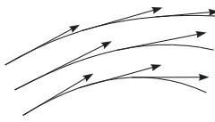  
Figure 13.9

a) in general: ${ \frac { d x } { V _ { x } } } = { \frac { d y } { V _ { y } } } = { \frac { d z } { V _ { z } } } , { \mathrm { ( 1 3 . 2 6 a ) } }$ b) for a plane field: ${ \frac { d x } { V _ { x } } } = { \frac { d y } { V _ { y } } }$

(13.26b)

To solve these diferential equations see 9.1.1.2, p. 542 or 9.2.1.1, p. 571.

A: The vector lines of a central field are rays starting at the center of the vector field.

B: The vector lines of the vector field $\vec { \mathbf { V } } = \vec { \mathbf { c } } \times \vec { \mathbf { r } }$ are circles lying in planes perpendicular to the vector c. Their centers are on the axis parallel to c.
