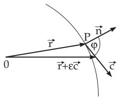
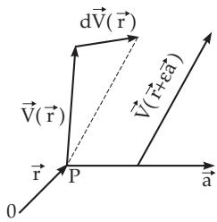

#### 13.2.1 Directional and Space Derivatives

##### 13.2.1.1 Directional Derivative of a Scalar Field

The directional derivative of a scalar field $U = U ( { \vec { \mathbf { r } } } )$ at a point P with position vector r in the direction c (Fig. 13.10) is defined as the limit of the quotient

$$
{ \frac { \partial U } { \partial { \vec { \mathbf { c } } } } } = \operatorname* { l i m } _ { \varepsilon \to 0 } { \frac { U ( { \vec { \mathbf { r } } } + \varepsilon { \vec { \mathbf { c } } } ) - U ( { \vec { \mathbf { r } } } ) } { \varepsilon } } .\tag{13.27}
$$

If the derivative of the field $U = U ( { \vec { \mathbf { r } } } )$ at a point $\vec { \bf r }$ in the direction of the unit vector $\vec { \mathbf { c } } ^ { 0 }$ of c is denoted by $\frac { { \partial } U } { { \partial } { { \vec { \mathbf { c } } } ^ { 0 } } }$ , then the relation between the derivative of the function with respect to the vector $\vec { \mathbf { c } }$ and with respect to its unit vector c 0 at the same point is $\vec { \mathbf { c } } ^ { 0 }$

$$
\frac { \partial U } { \partial \vec { \mathbf { c } } } = | \vec { \mathbf { c } } | \frac { \partial U } { \partial \vec { \mathbf { c } } ^ { 0 } } .\tag{13.28}
$$

The derivative $\frac { { \partial } U } { { \partial } { { \vec { \mathbf { c } } } ^ { 0 } } }$ with respect to the unit vector represents the speed of increase of the function $U$ in the direction of the vector $\vec { \mathbf { c } } ^ { 0 }$ at the point r. If n is the normal unit vector to the level surface passing through the point ${ \vec { \mathbf { r } } } ,$ and n is pointing in the direction of increasing $U _ { i }$ , then $\frac { { \partial { U } } } { { \partial \vec { \bf { n } } } }$ has the greatest value among all the derivatives at the point with respect to the unit vectors in diferent directions. Between the directional derivatives with respect to n and with respect to any direction $\vec { \mathbf { c } } ^ { 0 }$ holds the relation

$$
{ \frac { \partial U } { \partial { \bar { \bf c } } ^ { 0 } } } = { \frac { \partial U } { \partial { \vec { \bf n } } } } \cos ( { \vec { \bf c } } ^ { 0 } , { \vec { \bf n } } ) = { \frac { \partial U } { \partial { \vec { \bf n } } } } \cos \varphi = { \vec { \bf c } } ^ { 0 } \cdot \mathrm { g r a d } U \quad ( \sec { ( 1 3 . 3 4 ) } , { \bf p } . 7 1 0 ) .\tag{13.29}
$$

Hereafter, directional derivatives always mean the directional derivative with respect to a unit vector.

##### 13.2.1.2 Directional Derivative of a Vector Field

The directional derivative of a vector field is defined analogously to the directional derivative of a scalar field. The directional derivative of the vector field $\vec { \bf V } = \vec { \bf V } ( \vec { \bf r } )$ at a point P with position vector $\vec { \bf r }$

  
Figure 13.10

  
Figure 13.11

(Fig. 13.11) with respect to the vector a is defined as the limit of the quotient

$$
\frac { \partial \vec { \mathbf { V } } } { \partial \vec { \mathbf { a } } } = \operatorname* { l i m } _ { \varepsilon  0 } \frac { \vec { \mathbf { V } } ( \vec { \mathbf { r } } + \varepsilon \vec { \mathbf { a } } ) - \vec { \mathbf { V } } ( \vec { \mathbf { r } } ) } { \varepsilon } .\tag{13.30}
$$

If the derivative of the vector field $\vec { \mathbf { V } } = \vec { \mathbf { V } } ( \vec { \mathbf { r } } )$ at a point $\vec { \bf r }$ in the direction of the unit vector $\vec { \bf a } ^ { 0 }$ of a is denoted by $\frac { \partial \vec { \mathbf { V } } } { \partial \vec { \mathbf { a } } ^ { 0 } }$ , then

$$
\frac { \partial \vec { \mathbf { V } } } { \partial \vec { \mathbf { a } } } = | \vec { \mathbf { a } } | \frac { \partial \vec { \mathbf { V } } } { \partial \vec { \mathbf { a } } ^ { 0 } } .\tag{13.31}
$$

In Cartesian coordinates, i.e., for ${ \vec { \mathbf { V } } } = V _ { x } { \vec { \mathbf { e } } } _ { x } + V _ { y } { \vec { \mathbf { e } } } _ { y } + V _ { z } { \vec { \mathbf { e } } } _ { z } , { \vec { \mathbf { a } } } = a _ { x } { \vec { \mathbf { e } } } _ { x } + a _ { y } { \vec { \mathbf { e } } } _ { y } + a _ { z } { \vec { \mathbf { e } } } _ { z }$ , holds:

$$
( { \vec { \bf a } } \cdot \mathrm { g r a d } ) { \vec { \bf V } } = ( { \vec { \bf a } } \cdot \mathrm { g r a d } V _ { x } ) { \vec { \bf e _ { x } } } + ( { \vec { \bf a } } \cdot \mathrm { g r a d } V _ { y } ) { \vec { \bf e _ { y } } } + ( { \vec { \bf a } } \cdot \mathrm { g r a d } V _ { z } ) { \vec { \bf e _ { z } } } ,\tag{13.32a}
$$

in general coordinates:

$$
( \vec { \bf a } \cdot \mathrm { g r a d } ) \vec { \bf V } = \frac { 1 } { 2 } ( \mathrm { r o t } ( \vec { \bf V } \times \vec { \bf a } ) + \mathrm { g r a d } ( \vec { \bf a } \cdot \vec { \bf V } ) + \vec { \bf a } \mathrm { d i v } \vec { \bf V } - \vec { \bf V } \mathrm { d i v } \vec { \bf a } - \vec { \bf a } \times \mathrm { r o t } \vec { \bf V } - \vec { \bf V } \times \mathrm { r o t } \vec { \bf a } .\tag{13.32b}
$$

##### 13.2.1.3 Volume Derivative

Volume derivatives of a scalar field $U = U ( { \vec { \mathbf { r } } } )$ or a vector field $\vec { \bf V }$ at a point $\vec { \bf r }$ are quantities of three forms, which are obtained as follows:

1. Surrounding the pointr of the scalar field or of the vector field by a closed surface Σ. This surface can be represented in parametric form $\vec { \mathbf { r } } = \vec { \mathbf { r } } ( u , v ) = x ( u , v ) \vec { \mathbf { e } } _ { x } + y ( u , v ) \vec { \mathbf { e } } _ { y } + z ( u , v ) \vec { \mathbf { e } } _ { z }$ , so the corresponding vectorial surface element is

$$
d \vec { \mathbf S } = \frac { \partial \vec { \mathbf { r } } } { \partial u } \times \frac { \partial \vec { \mathbf { r } } } { \partial v } d u d v .\tag{13.33a}
$$

2. Evaluating the surface integral over the closed surface Σ . Here, the following three types of integrals can be considered:

$$
\begin{array} { r } { \iiint U d \vec { \mathbf { S } } , \qquad \iiint \vec { \mathbf { V } } \cdot d \vec { \mathbf { S } } , \qquad \iiint \vec { \mathbf { V } } \times d \vec { \mathbf { S } } . } \end{array}\tag{13.33b}
$$

3. Determining the limits (if they exist)

$$
\operatorname* { l i m } _ { V \to 0 } \frac { 1 } { V } \ointop _ { ( \Sigma ) } U d \vec { \mathbf S } , \quad \operatorname* { l i m } _ { V \to 0 } \frac { 1 } { V } \ointop _ { ( \Sigma ) } \vec { \boldsymbol { \nabla } } \cdot d \vec { \mathbf S } , \quad \operatorname* { l i m } _ { V \to 0 } \frac { 1 } { V } \ointop _ { ( \Sigma ) } \vec { \boldsymbol { \nabla } } \times d \vec { \mathbf S } .\tag{13.33c}
$$

Here V denotes the volume of the region of space that contains the point with the position vector $\vec { \bf r }$ inside, and which is bounded by the considered closed surface $\Sigma$

The limits (13.33c) are called volume derivatives. The gradient ofa scalar field and the divergence and the rotation of a vector field can be derived from them in the given order. In the following paragraphs, these notions will be discussed in details (even defining them again.)
