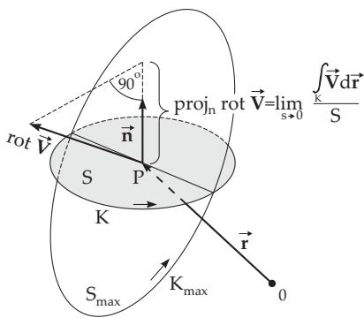

#### 13.2.5 Rotation ofVector Fields

##### 13.2.5.1 Definitions of the Rotation

1. Definition

The rotation or curl of a vector field $\vec { \bf V }$ at the point $\vec { \bf r }$ is a vector denoted by rot $\vec { \bf V } .$ curl $\vec { \bf V }$ or with the nabla operator $\nabla \times \vec { \mathbf V }$ , and defined as the negative space derivative of the vector field:

$$
\begin{array}{c} \begin{array} { r l r } & { } & { \displaystyle \iint \vec { \bf V } \times d \vec { \bf S } \qquad } \end{array} \oint \oint \mathrm { } d \vec { \bf S } \times \vec { \bf V }  \\ & { } & { \mathrm { r o t } \vec { \bf V } = - \displaystyle \operatorname* { l i m } _ { V \to 0 } \frac { ( \Sigma ) } { V } \qquad = \operatorname* { l i m } _ { V \to 0 } \frac { ( \Sigma ) } { V } . } \end{array}\tag{13.57}
$$

2. Definition

The vector field of the rotation of the vector field $\vec { \mathbf { V } } ( \vec { \mathbf { r } } )$ can be defined in the following way:

  
Figure 13.12

a) Putting a small surface sheet S (Fig. 13.12) through the point r and describing this surface sheet by a vector $\vec { \mathbf { S } }$ whose direction is the direction of the surface normal n and its absolute value is equal to the area of this surface region. The boundary of this surface is denoted by $C .$

b) Evaluating the integral $\underset { ( C ) } { \oint } \vec { \mathbf { V } }$ dr along the closed

boundary curve $C$ of the surface (the sense of the curve is positive looking to the surface from the direction of the surface normal (see Fig. 13.12).

c) Determining the limit (if it exists) $\operatorname * { l i m } _ { S  0 } \frac { 1 } { S } \oint _ { ( C ) } \vec { \bf V } \cdot d \vec { \bf r } ,$

while the position of the surface sheet remains unchanged.

d) Changing the position of the surface sheet in order to get a maximum value of the limit. The surface area in this position is $S _ { \mathrm { m a x } }$ and the corresponding boundary curve is $C _ { \mathrm { m a x } }$

e) Determining the vector rot $\vec { \bf r }$ at the point ${ \vec { \mathbf { r } } } ,$ whose absolute value is equal to the maximum value found above and its direction coincides with the direction of the surface normal of the corresponding surface. Then one gets:

$$
\left| \mathrm { r o t } \vec { \mathbf { V } } \right| = \operatorname* { l i m } _ { S _ { \mathrm { m a x } } \to 0 } \frac { \oint \vec { \mathbf { V } } \cdot d \vec { \mathbf { r } } } { S _ { \mathrm { m a x } } } .\tag{13.58a}
$$

The projection of rot $\vec { \bf V }$ onto the surface normal $\vec { \bf n }$ of a surface with area $S ,$ i.e., the component of the vector rot $\vec { \bf V }$ in an arbitrary direction n = l is

$$
\vec { \bf l } \cdot \mathrm { r o t } \vec { \bf V } = \mathrm { r o t } _ { l } \vec { \bf V } = \operatorname * { l i m } _ { S  0 } \frac { \oint \vec { \bf V } \cdot d \vec { \bf r } } { S } .\tag{13.58b}
$$

The vector lines of the field rot $\vec { \bf V }$ are called the curl lines ofthe vector field $\vec { \bf V }$

##### 13.2.5.2 Rotation in Different Coordinates

1. Rotation in Cartesian Coordinates

$$
\mathrm { r o t } \vec { \bf V } = \vec { \bf i } ( \frac { \partial V _ { z } } { \partial y } - \frac { \partial V _ { y } } { \partial z } ) + \vec { \bf j } ( \frac { \partial V _ { x } } { \partial z } - \frac { \partial V _ { z } } { \partial x } ) + \vec { \bf k } ( \frac { \partial V _ { y } } { \partial x } - \frac { \partial V _ { x } } { \partial y } ) = |  \frac { \vec { \bf i } } { \partial x } \frac { \partial } { \partial y } \frac { \partial } { \partial z } | .\tag{13.59a}
$$

The vector field rot $\vec { \bf V }$ can be represented as the cross product of the nabla operator $\nabla$ and the vector $\vec { \bf V } ;$

rot $\vec { \mathbf { V } } = \nabla \times \vec { \mathbf { V } } .$

(13.59b)

2. Rotation in Cylindrical Coordinates

$$
\mathrm { r o t } ~ { \vec { \mathbf { V } } } = \mathrm { r o t } ~ _ { \rho } { \vec { \mathbf { V } } } { \vec { \mathbf { e } } } _ { \rho } + \mathrm { r o t } ~ _ { \varphi } { \vec { \mathbf { V } } } { \vec { \mathbf { e } } } _ { \varphi } + \mathrm { r o t } ~ _ { z } { \vec { \mathbf { V } } } { \vec { \mathbf { e } } } _ { z } \qquad \mathrm { w i t h }\tag{13.60a}
$$

$$
\mathrm { r o t } _ { \rho } \vec { \bf V } = \frac { 1 } { \rho } \frac { \partial V _ { z } } { \partial \varphi } - \frac { \partial V _ { \varphi } } { \partial z } , \quad \mathrm { r o t } _ { \varphi } \vec { \bf V } = \frac { \partial V _ { \rho } } { \partial z } - \frac { \partial V _ { z } } { \partial \rho } , \quad \mathrm { r o t } _ { z } \vec { \bf V } = \frac { 1 } { \rho } \left\{ \frac { \partial } { \partial \rho } ( \rho V _ { \varphi } ) - \frac { \partial V _ { \rho } } { \partial \varphi } \right\} .\tag{13.60b}
$$

3. Rotation in Spherical Coordinates

$$
\mathrm { r o t } ~ { \vec { \mathbf { V } } } = \mathrm { r o t } _ { r } { \vec { \mathbf { V } } } { \vec { \mathbf { e } } } _ { r } + \mathrm { r o t } _ { \vartheta } { \vec { \mathbf { V } } } { \vec { \mathbf { e } } } _ { \vartheta } + \mathrm { r o t } _ { \varphi } { \vec { \mathbf { V } } } { \vec { \mathbf { e } } } _ { \varphi } \qquad \mathrm { w i t h }\tag{13.61a}
$$

$$
\mathrm { r o t } _ { r } \vec { \mathbf { V } } = \frac { 1 } { r \sin \vartheta } \{ \frac { \partial } { \partial \vartheta } ( \sin \vartheta V _ { \varphi } ) - \frac { \partial V _ { \vartheta } } { \partial \varphi } \} , 
$$

$$
\cot _ { \vartheta } \vec { \mathbf { V } } = \frac { 1 } { r \sin \vartheta } \frac { \partial V _ { r } } { \partial \varphi } - \frac { 1 } { r } \frac { \partial } { \partial r } ( r V _ { \varphi } ) ,\tag{13.61b}
$$

$$
\mathrm { r o t } _ { \varphi } { \vec { \mathbf { V } } } = { \frac { 1 } { r } } \left\{ { \frac { \partial } { \partial r } } ( r V _ { \vartheta } ) - { \frac { \partial V _ { r } } { \partial \vartheta } } \right\} .
$$

4. Rotation in General Orthogonal Coordinates

$$
\mathrm { r o t } \ { \vec { \mathbf { V } } } = \mathrm { r o t } _ { \xi } { \vec { \mathbf { V } } } { \vec { \mathbf { e } } } _ { \xi } + \mathrm { r o t } _ { \eta } { \vec { \mathbf { V } } } { \vec { \mathbf { e } } } _ { \eta } + \mathrm { r o t } _ { \zeta } { \vec { \mathbf { V } } } { \vec { \mathbf { e } } } _ { \zeta } \qquad \mathrm { w i t h }\tag{13.62a}
$$

$$
\mathrm { r o t } _ { \xi } { \vec { \mathbf { V } } } = { \frac { 1 } { \mathrm { D } } } | { \frac { \partial { \vec { \mathbf { r } } } } { \partial \xi } } | [ { \frac { \partial } { \partial \eta } } ( | { \frac { \partial { \vec { \mathbf { r } } } } { \partial \zeta } } | V _ { \zeta } ) - { \frac { \partial } { \partial \zeta } } ( | { \frac { \partial { \vec { \mathbf { r } } } } { \partial \eta } } | V _ { \eta } ) ] , |
$$

$$
\mathrm { r o t } _ { \eta } { \vec { \mathbf { V } } } = { \frac { 1 } { \mathrm { D } } } \left| { \frac { \partial { \vec { \mathbf { r } } } } { \partial \eta } } \right| \left[ { \frac { \partial } { \partial \zeta } } \left( \left| { \frac { \partial { \vec { \mathbf { r } } } } { \partial \xi } } \right| V _ { \xi } \right) - { \frac { \partial } { \partial \xi } } \left( \left| { \frac { \partial { \vec { \mathbf { r } } } } { \partial \zeta } } \right| V _ { \zeta } \right) \right] , \left\{ \right.\tag{13.62b}
$$

$$
\mathrm { r o t } _ { \zeta } { \vec { \mathbf { V } } } = { \frac { 1 } { \mathrm { D } } } | { \frac { \partial { \vec { \mathbf { r } } } } { \partial \zeta } } | [ { \frac { \partial } { \partial \xi } } ( | { \frac { \partial { \vec { \mathbf { r } } } } { \partial \eta } } | V _ { \eta } ) - { \frac { \partial } { \partial \eta } } ( | { \frac { \partial { \vec { \mathbf { r } } } } { \partial \xi } } | V _ { \xi } ) ] , |
$$

$$
\vec { \bf r } ( \xi , \eta , \zeta ) = x ( \xi , \eta , \zeta ) \vec { \bf i } + y ( \xi , \eta , \zeta ) \vec { \bf j } + z ( \xi , \eta , \zeta ) \vec { \bf k } ; \qquad \mathrm { D } = \left| \frac { \partial \vec { \bf r } } { \partial \xi } \right| \cdot \left| \frac { \partial \vec { \bf r } } { \partial \eta } \right| \cdot \left| \frac { \partial \vec { \bf r } } { \partial \zeta } \right| .\tag{13.62c}
$$

##### 13.2.5.3 Rules for Evaluating the Rotation

$$
\mathrm { r o t } \left( \vec { \bf V _ { 1 } } + \vec { \bf V _ { 2 } } \right) = \mathrm { r o t } \vec { \bf V _ { 1 } } + \mathrm { r o t } \vec { \bf V _ { 2 } } , \quad \mathrm { r o t } \left( c \vec { \bf V } \right) = c \mathrm { r o t } \vec { \bf V } .\tag{13.63}
$$

$$
\mathrm { r o t } \left( U \vec { \mathbf { V } } \right) = U \mathrm { r o t } \vec { \mathbf { V } } + \mathrm { g r a d } U \times \vec { \mathbf { V } } .\tag{13.64}
$$

$$
\mathrm { r o t } \ ( { \vec { \mathbf { V _ { 1 } } } } \times { \vec { \mathbf { V _ { 2 } } } } ) = ( { \vec { \mathbf { V _ { 2 } } } } \cdot \mathrm { g r a d } ) { \vec { \mathbf { V _ { 1 } } } } - ( { \vec { \mathbf { V _ { 1 } } } } \cdot \mathrm { g r a d } ) { \vec { \mathbf { V _ { 2 } } } } + { \vec { \mathbf { V _ { 1 } } } } \mathrm { d i v } { \vec { \mathbf { V _ { 2 } } } } - { \vec { \mathbf { V _ { 2 } } } } \mathrm { d i v } { \vec { \mathbf { V _ { 1 } } } } .\tag{13.65}
$$

##### 13.2.5.4 Rotation of a Potential Field

This also follows from the Stokes theorem (see 13.3.3.2, p. 725) that the rotation of a potential field is identically zero:

$$
\mathrm { r o t } \ \vec { \mathbf V } = \mathrm { r o t } \left( \mathrm { g r a d \ \vec { U } } \right) = \vec { \mathbf { 0 } } .\tag{13.66}
$$

This also follows from (13.59a) for V = grad U, if the assumptions of the Schwarz interchanging theorem are fulfilled (see 6.2.2.2, 1., p. 448).

For $\vec { \bf r } = x \vec { \bf i } + y \vec { \bf j } + z \vec { \bf k }$ with $r = | { \vec { \mathbf { r } } } | = { \sqrt { x ^ { 2 } + y ^ { 2 } + z ^ { 2 } } }$ holds: rot $\vec { \bf r } = \vec { \bf 0 }$ and rot $( \varphi ( r ) { \vec { \mathbf { r } } } ) = { \vec { \mathbf { 0 } } }$ where $\varphi ( r )$ is a diferentiable function of r.
