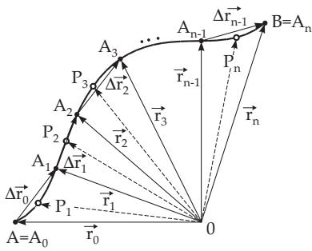
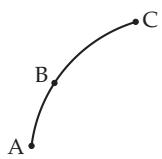
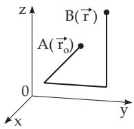
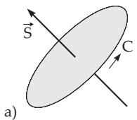
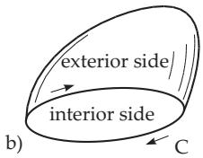
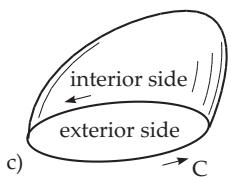
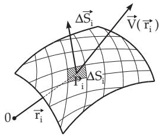
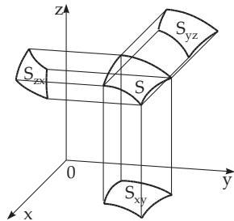

### 13.3 Integration in Vector Fields

Integration in vector fields is usually performed in Cartesian, cylindrical or in spherical coordinate systems. Usually one integrates along curves, surfaces, or volumes. The line, surface, and volume elements needed for these calculations are collected in Table 13.4.

Table 13.4 Line, surface, and volume elements in Cartesian, cylindrical, and spherical coordinates
<table><tr><td rowspan=1 colspan=1></td><td rowspan=1 colspan=1>Cartesian coordinates</td><td rowspan=1 colspan=1>Cylindrical coordinates</td><td rowspan=1 colspan=1>Spherical coordinates</td></tr><tr><td rowspan=1 colspan=1> $d \vec { \bf r }$ </td><td rowspan=1 colspan=1> $\vec { \bf e } _ { x } d x + \vec { \bf e } _ { y } d y + \vec { \bf e } _ { z } d z$ </td><td rowspan=1 colspan=1> $\vec { \bf e } _ { \rho } d \rho + \vec { \bf e } _ { \varphi } \rho d \varphi + \vec { \bf e } _ { z } d z$ </td><td rowspan=1 colspan=1> $\vec { \bf e } _ { r } d r + \vec { \bf e } _ { \vartheta } r d \vartheta + \vec { \bf e } _ { \varphi } r$ sin $\vartheta d \varphi$ </td></tr><tr><td rowspan=1 colspan=1> $d \vec { \bf S }$ </td><td rowspan=1 colspan=1> $\vec { \bf e } _ { x } d y d z + \vec { \bf e } _ { y } d x d z + \vec { \bf e } _ { z } d x d y$ </td><td rowspan=1 colspan=1> $\vec { \bf e } _ { \rho } \rho d \varphi d z + \vec { \bf e } _ { \varphi } d \rho d z + \vec { \bf e } _ { z } \rho d \rho d \varphi$ </td><td rowspan=1 colspan=1> $\vec { \mathbf { e } } _ { r } r ^ { 2 } \sin \vartheta d \vartheta d \varphi$  $+ \vec { \mathbf { e } } _ { \vartheta } r \sin \vartheta d r d \varphi$  $+ \vec { \mathbf { e } } _ { \varphi } r d r d \vartheta d \varphi$ </td></tr><tr><td rowspan=1 colspan=1> $d v ^ { * }$ </td><td rowspan=1 colspan=1> $d x d y d z$ </td><td rowspan=1 colspan=1> $\rho d \rho d \varphi d z$ </td><td rowspan=1 colspan=1> $r ^ { 2 } \sin \vartheta d r d \vartheta d \varphi$ </td></tr><tr><td rowspan=1 colspan=1></td><td rowspan=1 colspan=1> $\vec { \mathbf { e } } _ { x } = \vec { \mathbf { e } } _ { y } \times \vec { \mathbf { e } } _ { z }$  $\vec { \mathbf { e } } _ { y } = \vec { \mathbf { e } } _ { z } \times \vec { \mathbf { e } } _ { x }$  $\vec { \mathbf { e } } _ { z } = \vec { \mathbf { e } } _ { x } \times \vec { \mathbf { e } } _ { y }$ </td><td rowspan=1 colspan=1> $\vec { \mathbf { e } } _ { \rho } = \vec { \mathbf { e } } _ { \varphi } \times \vec { \mathbf { e } } _ { z }$  $\vec { \mathbf { e } } _ { \varphi } = \vec { \mathbf { e } } _ { z } \times \vec { \mathbf { e } } _ { \rho }$  $\vec { \mathbf { e } } _ { z } = \vec { \mathbf { e } } _ { \rho } \times \vec { \mathbf { e } } _ { \varphi }$ </td><td rowspan=1 colspan=1> $\vec { \mathbf { e } } _ { r } = \vec { \mathbf { e } } _ { \vartheta } \times \vec { \mathbf { e } } _ { \varphi }$  $\vec { \mathbf { e } } _ { \vartheta } = \vec { \mathbf { e } } _ { \varphi } \times \vec { \mathbf { e } } _ { r }$  $\vec { \mathbf { e } } _ { \varphi } = \vec { \mathbf { e } } _ { r } \times \vec { \mathbf { e } } _ { \vartheta }$ </td></tr><tr><td rowspan=1 colspan=1></td><td rowspan=1 colspan=3> ${ \vec { \mathbf { e } } } _ { i } \cdot { \vec { \mathbf { e } } } _ { j } = { \left\{ \begin{array} { l l } { 0 } & { i \neq j } \\ { 1 } & { i = j } \end{array} \right. }$                                        ${ \vec { \mathbf { e } } } _ { i } \cdot { \vec { \mathbf { e } } } _ { j } = { \left\{ \begin{array} { l l } { 0 } & { i \neq j } \\ { 1 } & { i = j } \end{array} \right. }$ The indices i and $j$ take the place of x, $y , z \ \mathrm { o r } \rho , \varphi , z \ \mathrm { o r } \ r , \vartheta , \varphi .$ </td></tr><tr><td rowspan=1 colspan=1> $^ *$ </td><td rowspan=1 colspan=3>The volume is denoted here by v to avoid confusion with the absolute value of the vectorfunction $| { \vec { \mathbf { V } } } | = V .$ </td></tr></table>

#### 13.3.1 Line Integral and Potential in Vector Fields

##### 13.3.1.1 Line Integral in Vector Fields

1. Definition The scalar-valued curvilinear integral or line integral of a vector function $\vec { \mathbf { V } } ( \vec { \mathbf { r } } )$ along a rectificable curve $\widehat { A B }$ (Fig. 13.13) is the scalar value

$$
P = \underbrace { \int \vec { \mathbf { V } } ( \vec { \mathbf { r } } ) \cdot d \vec { \mathbf { r } } } _ { A B }\tag{13.99a}
$$

  
Figure 13.13

2. Evaluation of this Integral in Five Steps

a) Dividing the path $\mathbf { \overset { . } { A } \overset { . } { B } ( F i g . 1 3 . 1 3 ) }$ by division points $A _ { 1 } ( { \vec { \bf r } } _ { 1 } ) , \ A _ { 2 } ( { \vec { \bf r } } _ { 2 } ) , \ldots , A _ { n - 1 } ( { \vec { \bf r } } _ { n - 1 } ) \ ( A \ = \ A _ { 0 } , \ B \ = \ A _ { n } )$ into n small arcs which are approximated by the vectors $\vec { \bf r } _ { i } - \vec { \bf r } _ { i - 1 } = \Delta \vec { \bf r } _ { i - 1 }$

b) Choosing arbitrarily the points $P _ { i }$ with position vectors $\vec { \xi _ { i } }$ lying inside or at the boundary of each small arc. c) Calculating the dot product of the value of the function $\vec { \bf V } ( \vec { \xi _ { i } } )$ at these chosen points with the corresponding $\Delta \vec { \bf r } _ { i - 1 }$

d) Taking the sum of all the n products.

e) Calculating the limit of the sums got in this way $\sum _ { i = 1 } ^ { n } \tilde { \vec { \bf V } } ( \vec { \xi } _ { i } ) \cdot \Delta \vec { \bf r } _ { i - 1 }$ for $| \Delta \vec { \bf r } _ { i - 1 } |  0$ , while $n  \infty$ obviously.

If this limit exists independently of the choice of the points $A _ { i }$ and $P _ { i } ,$ then it is called the line integral

$$
\underset { A B } { \int } \vec { \mathbf { V } } \cdot d \vec { \mathbf { r } } = \underset { n  \infty } { \operatorname* { l i m } } \sum _ { i = 1 } ^ { n } \tilde { \vec { \mathbf { V } } } ( \vec { \xi _ { i } } ) \cdot \Delta \vec { \mathbf { r } } _ { i - 1 } .\tag{13.99b}
$$

A suficient condition for the existence of the line integral (13.99a,b) is that the vector function $\vec { \mathbf { V } } ( \vec { \mathbf { r } } )$

  
Figure 13.14

and the curve $\widehat { A B }$ are continuous and the curve has a tangent varying continuously. A vector function $\vec { \bf V } ( \vec { \bf r } )$ is continuous if its components, the three scalar functions, are continuous.

13.3.1.2 Interpretation of the Line Integral in Mechanics If $\vec { \mathbf { V } } ( \vec { \mathbf { r } } )$ is a field of force, i.e., $\vec { \bf V } ( \vec { \bf r } ) ~ = ~ \vec { \bf F } ( \vec { \bf r } )$ , then the line integral (13.99a) represents the work done by $\vec { \mathbf { F } }$ while a particle m moves along the path $\widehat { A B }$ (Fig. 13.13,13.14).

##### 13.3.1.2 Interpretation of the Line Integral in Mechanics

##### 13.3.1.3 Properties of the Line Integral

$$
\int \limits _ { A B C } \vec { \nabla } ( \vec { \bf r } ) \cdot d \vec { \bf r } = \int \underset { A B } { \nabla } \vec { \bf V } ( \vec { \bf r } ) \cdot d \vec { \bf r } + \int \underset { B C } { \nabla } \vec { \bf V } ( \vec { \bf r } ) \cdot d \vec { \bf r } \qquad ( \mathrm { F i g . ~ \vec { ~ } 1 3 . 1 4 } ) .\tag{13.100}
$$

$$
\int _ { A B } \vec { \mathbf { V } } ( \vec { \mathbf { r } } ) \cdot d \vec { \mathbf { r } } = - \underbrace { \int _ { \ r { B A } } \vec { \mathbf { V } } ( \vec { \mathbf { r } } ) \cdot d \vec { \mathbf { r } } } _ { B A }\tag{13.101}
$$

$$
\begin{array} { r l r } & {  { \int _ { \widehat { A } B } [ \vec { \bf V } ( \vec { \bf r } ) + \vec { \bf W } ( \vec { \bf r } ) ] \cdot d \vec { \bf r } = \underset { A B } { \int } \vec { \bf V } ( \vec { \bf r } ) \cdot d \vec { \bf r } + \underset { A B } { \int } \vec { \bf W } ( \vec { \bf r } ) \cdot d \vec { \bf r } . } } \end{array}\tag{13.102}
$$

$$
\underbrace { \int _ { } ^ { } \ d { c } { d } \vec { \mathbf { V } } ( \vec { \mathbf { r } } ) \cdot d \vec { \mathbf { r } } } _ { A B } = c \underbrace { \int _ { } ^ { } \vec { \mathbf { V } } ( \vec { \mathbf { r } } ) \cdot d \vec { \mathbf { r } } } _ { A B } \qquad \mathrm { ( c ~ c o n s t ) . }\tag{13.103}
$$

##### 13.3.1.4 Line Integral in Cartesian Coordinates

In Cartesian coordinates the following formula holds:

$$
\int _ { A B } \vec { \mathbf { V } } ( \vec { \mathbf { r } } ) \cdot d \vec { \mathbf { r } } = \underbrace { \int _ { A B } \left( V _ { x } d x + V _ { y } d y + V _ { z } d z \right) } _ { A B } .\tag{13.104}
$$

##### 13.3.1.5 Integral Along a Closed Curve in a Vector Field

A line integral is called a contour integral if the path of integration is a closed curve. If the scalar value of the integral is denoted by P and the closed curve is denoted by $C _ { i }$ , then the following notation is used:

$$
P = \oint _ { ( C ) } { \vec { \mathbf { V } } } ( { \vec { \mathbf { r } } } ) \cdot d { \vec { \mathbf { r } } } .\tag{13.105}
$$

##### 13.3.1.6 Conservative Field or Potential Field

1. Definition

If the value $P$ of the line integral (13.99a) in a vector field depends only on the initial point A and the endpoint $B .$ , and is independent of the path between them, then this field is called a conservative field or a potential field.

The value of the contour integral in a conservative field is always equal to zero:

$$
\intop _ { ( C ) } \vec { \mathbf { V } } ( \vec { \mathbf { r } } ) \cdot d \vec { \mathbf { r } } = 0 .\tag{13.106}
$$

A conservative field is always irrotational:

$$
\mathrm { r o t } \vec { \mathbf { V } } = \vec { \mathbf { 0 } } ,\tag{13.107}
$$

and conversely, this equality is a suficient condition for a vector field to be conservative. Of course, it is to be supposed that the partial derivatives of the field function $\vec { \bf V }$ are continuous with respect to the corresponding coordinates, and the domain of $\vec { \bf V }$ is simply connected. This condition, also called the integrability condition (see 8.3.4.2, p. 521), has the following form in Cartesian coordinates

$$
\frac { \partial V _ { x } } { \partial y } = \frac { \partial V _ { y } } { \partial x } , \quad \frac { \partial V _ { y } } { \partial z } = \frac { \partial V _ { z } } { \partial y } , \quad \frac { \partial V _ { z } } { \partial x } = \frac { \partial V _ { x } } { \partial z } .\tag{13.108}
$$

2. Potential of a Conservative Field,

or its potential function or briefly its potential is the scalar function

$$
U ( \vec { \mathbf { r } } ) = \int _ { \vec { \mathbf { r } } _ { 0 } } ^ { \vec { \mathbf { r } } } \vec { \mathbf { V } } ( \vec { \mathbf { r } } ) \cdot d \vec { \mathbf { r } } .\tag{13.109a}
$$

In a conservative field it is calculated with a fixed initial point $A ( \vec { \bf r } _ { 0 } )$ and a variable endpoint $B ( \vec { \bf r } )$ as the line integral

$$
U ( { \vec { \mathbf { r } } } ) = \int _ { \widehat { A B } } { \vec { \nabla } } ( { \vec { \mathbf { r } } } ) \cdot d { \vec { \mathbf { r } } } .\tag{13.109b}
$$

$$
U ^ { * } ( \vec { \bf r } ) = - \int _ { \vec { \bf r } _ { 0 } } ^ { \vec { \bf r } } { \vec { \bf V } } ( \vec { \bf r } ) \cdot d \vec { \bf r } = - U ( \vec { \bf r } ) .
$$

Remark: In physics, the potential $U ^ { * } ( \vec { \bf r } )$ of a function $\vec { \bf V } ( \vec { \bf r } )$ at the point r is often considered with the opposite sign:

(13.110)

3. Relations between Gradient, Line Integral, and Potential

If the relation ${ \vec { \mathbf { V } } } ( { \vec { \mathbf { r } } } ) = \operatorname { g r a d } U ( { \vec { \mathbf { r } } } )$ holds, then $U ( \vec { \bf r } )$ is the potential of the field $\vec { \mathbf { V } } ( \vec { \mathbf { r } } )$ , and conversely, $\vec { \mathbf { V } } ( \vec { \mathbf { r } } )$ is a conservative or potential field. In physics often the negative sign is used corresponding to (13.110).

4. Calculation of the Potential in a Conservative Field

If the function $\vec { \mathbf { V } } ( \vec { \mathbf { r } } )$ is given in Cartesian coordinates $\vec { \bf V } = V _ { x } \vec { \bf i } + V _ { y } \vec { \bf j } + V _ { z } \vec { \bf k } .$ , then for the total diferen-

tial of its potential function U

  
Figure 13.15

$$
d U = V _ { x } d x + V _ { y } d y + V _ { z } d z\tag{13.111a}
$$

holds. Here, the coeficients $V _ { x } , V _ { y } , V _ { z }$ must fulfill the integrability condition (13.108). The determination of U follows from the equation system

$$
{ \frac { \partial U } { \partial x } } = V _ { x } , \quad { \frac { \partial U } { \partial y } } = V _ { y } , \quad { \frac { \partial U } { \partial z } } = V _ { z } .\tag{13.111b}
$$

In practice, the calculation of the potential can be done by performing the integration along three straight line segments parallel to the coordinate axes and connected to each other (Fig. 13.15):

$$
U = \int _ { \vec { \mathbf { r } _ { 0 } } } ^ { \vec { \mathbf { r } } } \vec { \mathbf { V } } \cdot d \vec { \mathbf { r } } = U ( x _ { 0 } , y _ { 0 } , z _ { 0 } ) + \int _ { x _ { 0 } } ^ { x } V _ { x } ( x , y _ { 0 } , z _ { 0 } ) d x + \int _ { y _ { 0 } } ^ { y } V _ { y } ( x , y , z _ { 0 } ) d y + \int _ { z _ { 0 } } ^ { z } V _ { z } ( x , y , z ) d z .\tag{13.112}
$$

#### 13.3.2 Surface Integrals

##### 13.3.2.1 Vector of a Plane Sheet

The vector representation of the surface integral of general type (see 8.3.4.2, p. 537) requires to assign a vector $\vec { \mathbf { S } }$ to a plane surface region S, which is perpendicular to this region and its absolute value is equal to the area of S. Fig. 13.16a shows the case of a plane sheet. The positive direction in S is given by defining the positive sense along a closed curve C according to the right-hand law (also called right-screw rule): Looking from the initial point of the vector into the direction of its final point, then the positive sense is the clockwise direction. By this choice of orientation of the boundary curve one fixes the exterior side of this surface region, i.e., the side on which the vector lies. This definition works in the case of any surface region bounded by a closed curve (Fig. 13.16b,c).

  
Figure 13.16

##### 13.3.2.2 Evaluation of the Surface Integral

The evaluation of a surface integral in scalar or vector fields is independent of whether the surface S is bounded by a closed curve or is itself a closed surface. The evaluation is performed in five steps:

a) Dividing the surface region S on the exterior side defined by the orientation of the boundary curve (Fig. 13.17) into n arbitrary elementary surfaces $\Delta { \cal { S } } _ { i }$ so that each of these surface elements can be approximated by a plane surface element. Assigning the vector $\Delta \vec { \mathbf { S _ { i } } }$ to every surface element $\Delta \boldsymbol { S } _ { i }$ as given in (13.33a). In the case of a closed surface, the positive direction is defined so that the exterior

side is where $\Delta \vec { \mathbf { S _ { i } } }$ should start.

b) Choosing an arbitrary point $P _ { i }$ with the position vector $\vec { \bf r _ { i } }$ inside or on the boundary of each surface element.

c) Producing the products $U ( \vec { \bf r _ { i } } ) \Delta \vec { \bf S _ { i } }$ in the case of a scalar field and the product $\vec { \bf V } ( \vec { \bf r _ { i } } ) \cdot \Delta \vec { \bf S _ { i } } \ o r \vec { \bf V } ( \vec { \bf r _ { i } } ) \times$ $\Delta \vec { \mathbf { S _ { i } } }$ in the case of a vector field.

d) Taking the sum of all these products.

e) Evaluating the limit while the diameters of $\Delta S _ { i }$ tend to zero, i.e., $| \Delta \vec { \mathbf { S _ { i } } } |  0$ for $n \to \infty$ . So, the surface elements tend to zero in the sense given in 8.4.1, 1., p. 524, for double integrals.

If this limit exists independently of the partition and of the choice of the points $\vec { \bf r _ { i } }$ , then one calls it the surface integral of $\vec { \bf V }$ on the given surface.

  
Figure 13.17

  
Figure 13.18

13.3.2.3 Surface Integrals and Flow of Fields

1. Vector Flow of a Scalar Field

$$
{ \vec { \mathbf { P } } } = \operatorname* { l i m } _ {  { n  \infty } { \operatorname { l i m } }  } \sum _ { i = 1 } ^ { n } U ( { \vec { \mathbf { r } } } _ { i } ) \Delta \vec { \mathbf { S } } _ { i } = \int U ( { \vec { \mathbf { r } } } ) d \vec { \mathbf { S } } .\tag{13.113}
$$

2. Scalar Flow of a Vector Field

$$
Q = \operatorname* { l i m } _ { | \Delta \vec { \mathbf { S } } _ { i } | \to 0 } \sum _ { i = 1 } ^ { n } \vec { \mathbf { V } } ( \vec { \mathbf { r } } _ { i } ) \cdot \Delta \vec { \mathbf { S } } _ { i } = \int \vec { \mathbf { V } } ( \vec { \mathbf { r } } ) \cdot d \vec { \mathbf { S } } .\tag{13.114}
$$

3. Vector Flow of a Vector Field

$$
\vec { \bf R } = \operatorname* { l i m } _ { | \Delta \vec { \bf S } _ { i } |  0 } \sum _ { i = 1 } ^ { n } \vec { \bf V } ( \vec { \bf r } _ { i } ) \times \Delta \vec { \bf S } _ { i } = \int \vec { \bf V } ( \vec { \bf r } ) \times d \vec { \bf S } .\tag{13.115}
$$

13.3.2.4 Surface Integral in Cartesian Coordinates as Surface Integrals of Second Type

$$
\int _ { ( S ) } U d \vec { \bf S } = \ \int _ { ( S _ { y z } ) } \int U d y d z \vec { \bf i } + \ \int _ { ( S _ { z x } ) } \int U d z d x \vec { \bf j } + \ \int _ { ( S _ { x y } ) } \int U d x d y \vec { \bf k } .\tag{13.116}
$$

$$
\int _ { ( S ) } \vec { { \bf V } } \cdot d \vec { { \bf S } } = \ \int \int V _ { x } d y d z + \ \int \int V _ { y } d z d x + \ \int \int V _ { z } d x d y .\tag{13.117}
$$

$$
\begin{array}{c} \int _ { ( S ) } \vec { \mathbf { V } } \times d \vec { \mathbf { S } } = \begin{array} { l } { \displaystyle \int \int ( V _ { z } \vec { \mathbf { j } } - V _ { y } \vec { \mathbf { k } } ) d y d z + \ \int \int ( V _ { x } \vec { \mathbf { k } } - V _ { z } \vec { \mathbf { i } } ) d z d x + \ \int \int ( V _ { y } \vec { \mathbf { i } } - V _ { x } \vec { \mathbf { j } } ) d x d y . } \\ { ( S _ { y z } ) } \end{array}  \end{array}\tag{13.118}
$$

The existence theorems for these integrals can be given similarly to those in 8.5.2, 4., p. 537. In the formulas above, each of the integrals is taken over the projection $S$ on the corresponding coordinate plane (Fig. 13.18), where one of the variables x, y or z should be expressed by the others from the equation of S.

Remark: Integrals over a closed surface are denoted by

$$
\begin{array} { l } { \ointop U d \vec { \mathbf { S } } = \underset { ( S ) } { \iint } U d \vec { \mathbf { S } } , \qquad \ointop \vec { \mathbf { V } } \cdot d \vec { \mathbf { S } } = \underset { ( S ) } { \iint } \vec { \mathbf { V } } \cdot d \vec { \mathbf { S } } , \qquad \ointop \vec { \mathbf { V } } \times d \vec { \mathbf { S } } = \underset { ( S ) } { \iint } \vec { \mathbf { V } } \times d \vec { \mathbf { S } } . } \end{array}\tag{13.119}
$$

A: Calculate the integral $\vec { \mathbf { P } } = \intop _ { ( S ) } x y z d \vec { \mathbf { S } }$ , where the surface is the plane region $x + y + z = 1$ bounded

by the coordinate planes. The upward side is the positive side:

$$
\vec { \mathbf { P } } = \underset { ( S _ { x x } ) } { \int } ( 1 - y - z ) y z d y d z \vec { \mathbf { i } } + \underset { ( S _ { z x } ) } { \int } ( 1 - x - z ) x z d z d x \vec { \mathbf { j } } + \underset { ( S _ { x y } ) } { \int } ( 1 - x - y ) x y d x d y \vec { \mathbf { k } } ;
$$

$\int _ { ( S _ { y z } ) } \int ( 1 - y - z ) y z d y d z \ = \ \int _ { 0 } ^ { 1 } \int _ { 0 } ^ { 1 - z } ( 1 - y - z ) y z d y d z \ = \ { \frac { 1 } { 1 2 0 } } .$ . We get the two further integrals

analogously. The result is: $\vec { \bf P } = \frac { 1 } { 1 2 0 } ( \vec { \bf i } + \vec { \bf j } + \vec { \bf k } )$

B: Calculate the integral $Q = \int _ { ( S ) } { \vec { \mathbf { r } } } \cdot d { \vec { \mathbf { S } } } = \ \int \int x d y d z + \ \int \int y d z d x + \ \int \int z d x d y$ over the

same plane region as in A: $\int \limits _ { ( S _ { y z } ) } \int x d y d z = \int _ { 0 } ^ { 1 } \int _ { 0 } ^ { 1 - z } ( 1 - y - z ) d y d z = \frac { 1 } { 6 } .$ . Both other integrals are

calculated similarly. The result is: $Q = { \frac { 1 } { 6 } } + { \frac { 1 } { 6 } } + { \frac { 1 } { 6 } } = { \frac { 1 } { 2 } }$

C: Calculate the integral ${ \vec { \mathbf { R } } } = \int _ { ( S ) } { \vec { \mathbf { r } } } \times d { \vec { \mathbf { S } } } = \int _ { ( S ) } ( x { \vec { \mathbf { i } } } + y { \vec { \mathbf { j } } } + z { \vec { \mathbf { k } } } ) \times \left( d y d z { \vec { \mathbf { i } } } + d z d x { \vec { \mathbf { j } } } + d x d y { \vec { \mathbf { k } } } \right)$ , where

the surface region is the same as in A: Performing the computations gives $\vec { \bf R } = \vec { \bf 0 }$

##### 13.3.2.3 Surface Integrals and Flow of Fields

##### 13.3.2.4 Surface Integral in Cartesian Coordinates as Surface Integrals of Second Type

#### 13.3.3 Integral Theorems

##### 13.3.3.1 Integral Theorem and Integral Formula of Gauss

1. Integral Theorem of Gauss or the Divergence Theorem

The integral theorem ofGauss gives the relation between a volume integral of the divergence of $\vec { \bf V }$ over a volume v, and a surface integral over the surface S surrounding this volume. The orientation of the surface (see 8.5.2.1, p. 535) is defined so that the exterior side is the positive one. The vector function $\vec { \bf V }$ should be continuous, their first partial derivatives should exist and be continuous. The integral theorem of Gauss reads as follows:

$$
\oint _ { ( S ) } { \vec { \mathbf { V } } } \cdot d { \vec { \mathbf { S } } } = \iiint \operatorname { d i v } { \vec { \mathbf { V } } } d v ,\tag{13.120a}
$$

i.e., the scalar flow of the field $\vec { \bf V }$ through a closed surface S is equal to the integral of divergence of $\vec { \bf V }$ over the volume v bounded by S. In Cartesian coordinates one gets:

$$
\oint _ { ( S ) } ( V _ { x } d y d z + V _ { y } d z d x + V _ { z } d x d y ) = \iint _ { ( v ) } \left( { \frac { \partial V _ { x } } { \partial x } } + { \frac { \partial V _ { y } } { \partial y } } + { \frac { \partial V _ { z } } { \partial z } } \right) d x d y d z .\tag{13.120b}
$$

2. Integral Formula of Gauss

In the planar case, the integral theorem of Gauss restricted to the $x , y$ plane becomes the integral formula ofGauss. It represents the correspondence between a line integral and the corresponding surface integral. The integral formula of Gauss reads as follows:

$$
\iint _ { ( B ) } \left[ { \frac { \partial Q ( x , y ) } { \partial x } } - { \frac { \partial P ( x , y ) } { \partial y } } \right] d x d y = \oint _ { ( C ) } \left[ P ( x , y ) d x + Q ( x , y ) d y \right] .\tag{13.121}
$$

B denotes a plane region which is bounded by $C , \ P$ and $Q$ are continuous functions with continuous first partial derivatives.

3. Sector Formula

The sector formula is an important special case of the Gauss integral formula to calculate the area of plane regions. For $Q = x , P = - y$ it follows that

$$
F = \int _ { ( B ) } \int d x d y = { \frac { 1 } { 2 } } \oint _ { ( C ) } [ x d y - y d x ] .\tag{13.122}
$$

##### 13.3.3.2 Integral Theorem of Stokes

The integral theorem of Stokes gives the relation between a surface integral over an oriented surface region S, in which the vector field $\vec { \bf V }$ is defined, and the integral along the closed boundary curve $C$ of the surface S. The sense of the curve C is chosen so that the sense of traverse forms a right-screw with the surface normal (see 13.3.2.1, p. 722). The vector function $\vec { \bf V }$ should be continuous and it should have continuous first partial derivatives. The integral theorem of Stokes reads as follows:

$$
\int _ { ( S ) } \int \ d S \mathrm { r o t } \vec { \mathbf V } \cdot d \vec { \mathbf S } = \oint _ { ( C ) } \vec { \mathbf V } \cdot d \vec { \mathbf r } ,\tag{13.123a}
$$

i.e., the vector flow of the rotation through a surface S bounded by the closed curve C is equal to the contour integral of the vector field $\vec { \bf V }$ along the curve $C .$

In Cartesian coordinates

$$
{ \begin{array} { l } { \displaystyle \iint \left[ \left( { \frac { \partial V _ { z } } { \partial y } } - { \frac { \partial V _ { y } } { \partial z } } \right) d y d z + \left( { \frac { \partial V _ { x } } { \partial z } } - { \frac { \partial V _ { z } } { \partial x } } \right) d z d x + \left( { \frac { \partial V _ { y } } { \partial x } } - { \frac { \partial V _ { x } } { \partial y } } \right) d x d y \right] } \\ { \displaystyle = \oint _ { ( C ) } \left( V _ { x } d x + V _ { y } d y + V _ { z } d z \right) } \\ { ( C ) } \end{array} }\tag{13.123b}
$$

holds. In the planar case, the integral theorem of Stokes, just as that of Gauss, becomes into the integral formula (13.121) of Gauss.

##### 13.3.3.3 Integral Theorems of Green

The Green integral theorems give relations between volume and surface integrals. They are the applications of the Gauss theorem for the function $\vec { \mathbf { V } } = U _ { 1 } \mathbf { \Sigma }$ grad $U _ { 2 }$ , where $U _ { 1 }$ and $U _ { 2 }$ are scalar field functions and v is the volume surrounded by the surface S. The following theorems hold:

$$
\mathbf { 1 . } \ \int _ { ( v ) } \iint _ { ( v ) } \left( U _ { 1 } \Delta U _ { 2 } + \operatorname { g r a d } U _ { 2 } \cdot \operatorname { g r a d } U _ { 1 } \right) d v = \underset { ( S ) } { \iint } U _ { 1 } \operatorname { g r a d } U _ { 2 } \cdot d \vec { \mathbf { S } } ,\tag{13.124}
$$

$$
2 . \quad \int \limits _ { ( v ) } \iint ( U _ { 1 } \Delta U _ { 2 } - U _ { 2 } \Delta U _ { 1 } ) d v = \bigoplus _ { ( S ) } ( U _ { 1 } \mathrm { g r a d } U _ { 2 } - U _ { 2 } \mathrm { g r a d } U _ { 1 } ) \cdot d \vec { S } .\tag{13.125}
$$

In particular for $U _ { 1 } = 1 , U _ { 2 } = U$

$$
\mathbf { 3 } . \int \int \limits _ { ( v ) } ^ { } \Delta U d v = \bigoplus _ { ( S ) } ^ { } \mathrm { g r a d } U \cdot d \vec { \mathbf { S } }\tag{13.126}
$$

holds. In Cartesian coordinates the third Green theorem has the following form (compare (13.120b)):

$$
\iiint _ { ( v ) } \left( { \frac { \partial ^ { 2 } U } { \partial x ^ { 2 } } } + { \frac { \partial ^ { 2 } U } { \partial y ^ { 2 } } } + { \frac { \partial ^ { 2 } U } { \partial z ^ { 2 } } } \right) d v = \oiint _ { ( S ) } \left( { \frac { \partial U } { \partial x } } d y d z + { \frac { \partial U } { \partial y } } d z d x + { \frac { \partial U } { \partial z } } d x d y \right) .\tag{13.127}
$$

A: Calculating the line integral $I = \oint _ { ( C ) } \left( x ^ { 2 } y ^ { 3 } d x + d y + z d z \right)$ with a circle C as the intersection curve

of the cylinder $x ^ { 2 } + y ^ { 2 } = a ^ { 2 }$ and the plane $z = 0$ . With the Stokes theorem (13.123a) one gets:

$$
I = { \underset { ( C ) } { \oint } } { \vec { \nabla } } \cdot d { \vec { \mathbf { r } } } = \iint \operatorname { r o t } { \vec { \nabla } } \cdot d { \vec { \mathbf { S } } } = - \int _ { ( S ^ { * } ) } \int 3 x ^ { 2 } y ^ { 2 } d x d y = - 3 \int _ { \varphi = 0 } ^ { 2 \pi } \int _ { r ^ { 5 } } ^ { a } \cos ^ { 2 } \varphi \sin ^ { 2 } \varphi d r d \varphi = - { \frac { a ^ { 6 } } { 8 } } \pi \ln { \frac { \partial \theta } { \partial x } }
$$

rot $\vec { \bf V } = - 3 x ^ { 2 } y ^ { 2 } \vec { \bf k } , d \vec { \bf S } = \vec { \bf k }$ dx dy and the circle $S ^ { * } \colon x ^ { 2 } + y ^ { 2 } \leq a ^ { 2 }$

B: Determine the flux $I = \oint _ { ( S ) } { \vec { \mathbf { V } } }$ dS in the drift space $\vec { \mathbf { V } } = x ^ { 3 } \vec { \mathbf { i } } + y ^ { 3 } \vec { \mathbf { j } } + z ^ { 3 } \vec { \mathbf { k } }$ through the surface S of the sphere $x ^ { 2 } + y ^ { 2 } + z ^ { 2 } = a ^ { 2 }$ . The theorem of Gauss yields:

$$
I = \oint _ { ( \infty ) } { \vec { \nabla } } \cdot d { \vec { \mathbf { S } } } = \iint _ { ( \infty ) } \iint \mathrm { d i v } { \vec { \nabla } } d v = 3 \iint _ { ( v ) } \iint ( x ^ { 2 } + y ^ { 2 } + z ^ { 2 } ) d x d y d z = 3 \int _ { \varphi = 0 } ^ { 2 \pi } \int _ { \partial = 0 } ^ { \pi } \int _ { r = 0 } ^ { \alpha } r ^ { 4 } \sin \vartheta d r d \vartheta d \varphi = { \frac { 1 2 } { 5 } } a ^ { 5 } \pi .
$$

C: Heat conduction equation: The change in time of the heat $Q$ of a space region v containing no heat source is given by ${ \frac { d Q } { d t } } = \int \int \int _ { ( v ) } c \varrho { \frac { \partial T } { \partial t } } { d v }$ (specific heat-capacity $c ,$ density $\varrho ,$ temperature T),

while the corresponding time-dependent change of the heat flow through the surface S of v is given by ${ \frac { d Q } { d t } } = \oint _ { ( S ) } ^ { } \lambda$ grad T  dS (thermal conductivity λ). Applying the theorem of Gauss for the surface

$$
\iiint _ { ( v ) } \left[ c \varrho \frac { \partial T } { \partial t } - \mathrm { d i v } \left( \lambda \mathrm { g r a d } T \right) \right] d v = 0
$$

$c \lambda { \frac { \partial T } { \partial t } } = \operatorname { d i v } \left( \lambda \operatorname { g r a d } T \right)$ , which has the form ${ \frac { \partial T } { \partial t } } = a ^ { 2 } \Delta T$ in the case of a homogeneous solid $( c , \varrho , \lambda$ constants).
