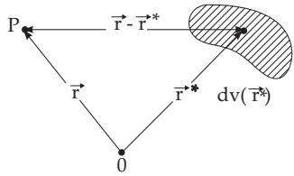
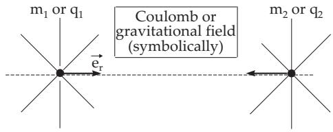

### 13.4 Evaluation of Fields

#### 13.4.1 Pure Source Fields

A field $\vec { \mathbf { V } } _ { 1 }$ is called a pure source field or an irrotational source field when its rotation is equal to zero everywhere. If the divergence is $q ( \vec { \bf r } )$ , then

$$
\mathrm { d i v } \vec { \mathbf { V } } _ { 1 } = q ( \vec { \mathbf { r } } ) , \qquad \mathrm { r o t } \vec { \mathbf { V } } _ { 1 } \equiv \vec { \mathbf { 0 } }\tag{13.128}
$$

holds. In this case, the field has a potential $U$ , which is defined at every point P by the Poisson diferential equation (see 13.5.2, p. 729)

$$
\begin{array} { r } { \vec { \mathbf { V } } _ { 1 } = \mathrm { g r a d } U , \qquad \mathrm { d i v } \mathrm { g r a d } U = \Delta U = q ( \vec { \mathbf { r } } ) , } \end{array}\tag{13.129a}
$$

where $\vec { \bf r }$ is the position vector of $P .$ (In physics most often ${ \vec { \mathbf { V } } } _ { 1 } = - \mathrm { g r a d } U$ is used.) The evaluation of U comes from

$$
U ( \vec { \bf r } ) = - \frac { 1 } { 4 \pi } \iiint \frac { \mathrm { d i v } \vec { \bf V } ( \vec { \bf r } ^ { * } ) d v ( \vec { \bf r } ^ { * } ) } { \left| \vec { \bf r } - \vec { \bf r } ^ { * } \right| } .\tag{13.129b}
$$

The integration is taken over the whole of space (Fig. 13.19). The divergence of $\vec { \bf V }$ must be diferentiable and be decreasing suficiently rapidly for large distances.

  
Figure 13.19

  
Figure 13.20

#### 13.4.2 Pure Rotation Field or Zero-Divergence Field

A pure rotation (or curl) field or a solenoidal field is a vector field $\vec { \mathbf { V } } _ { 2 }$ whose divergence is equal to zero everywhere; this field is free of sources. With $\vec { \bf w } ( \vec { \bf r } )$ as the rotation density

$$
\begin{array} { r } { \mathrm { d i v } \vec { \mathbf { V } } _ { 2 } \equiv 0 , \qquad \mathrm { r o t } \vec { \mathbf { V } } _ { 2 } = \vec { \mathbf { w } } ( \vec { \mathbf { r } } ) } \end{array}\tag{13.130a}
$$

hold. The rotation density $\vec { \bf w } ( \vec { \bf r } )$ cannot be arbitrary; it must satisfy the equation div $\vec { \bf w } = 0$ . With the approach

$$
\vec { \bf V } _ { 2 } ( \vec { \bf r } ) = \mathrm { r o t } \vec { \bf A } ( \vec { \bf r } ) , \qquad \mathrm { d i v } \vec { \bf A } = 0 , \quad \mathrm { i . e . , ~ \ r o t } \ r o t \vec { \bf A } = \vec { \bf w }\tag{13.130b}
$$

follows according to (13.97)

$$
\mathrm { g r a d d i v } \vec { \bf A } - \Delta \vec { \bf A } = \vec { \bf w } , \quad \mathrm { i . e . , } \quad \Delta \vec { \bf A } = - \vec { \bf w } .\tag{13.130c}
$$

$\mathrm { S o } , \vec { \mathbf { A } } ( \vec { \mathbf { r } } )$ formally satisfies the Poisson diferential equation (see (13.135a), p. 729) just as the potential U of an irrotational field $\vec { \mathbf { V } } _ { 1 }$ and that is why it is called a vector potential. For every point P, then

$$
\vec { \bf V } _ { 2 } = \mathrm { r o t } \vec { \bf A } \qquad \mathrm { h o l d s ~ w i t h } \quad \vec { \bf A } = \frac { 1 } { 4 \pi } \iiint \frac { \vec { \bf w } ( { \vec { \bf r } } ^ { * } ) } { | { \vec { \bf r } } - { \vec { \bf r } } ^ { * } | } d v ( { \vec { \bf r } } ^ { * } ) .\tag{13.130d}
$$

The meaning of r is the same as in (13.129b); the integration is taken over the whole of space.

#### 13.4.3 Vector Fields with Point-Like Sources

##### 13.4.3.1 Coulomb Field of a Point-Like Charge

The Coulomb field is an example of an irrotational field, which is also solenoidal, except at the location of the point charge q, the point source (Fig. 13.20). For the Coulomb force

$$
\vec { \mathbf { F } } _ { \mathrm { C } } = \frac { 1 } { 4 \pi \varepsilon _ { 0 } } \frac { q _ { 1 } q _ { 2 } } { r ^ { 2 } } \vec { \mathbf { e } } _ { r } = \frac { q _ { 1 } } { 4 \pi \varepsilon _ { 0 } } q _ { 2 } \frac { \vec { \mathbf { r } } } { r ^ { 3 } } = e q _ { 2 } \frac { \vec { \mathbf { r } } } { r ^ { 3 } } , \quad e = \frac { q _ { 1 } } { 4 \pi \varepsilon _ { 0 } }\tag{13.131a}
$$

holds. This force afects attractively for electric charges $q _ { 1 } , q _ { 2 }$ with diferent signs and repulsively for charges with equal signs. $\varepsilon _ { 0 }$ is the electric constant (see Table 21.2, p. 1053), e is the intensity or

source strength of the source. The electric field strength and the electrostatic potential, generated in the space around the charge $q _ { 1 }$ and afecting to the charge $q _ { 2 }$ are given as

$$
\vec { \bf E } _ { \mathrm { C } } = \frac { \vec { \bf F } _ { \mathrm { C } } } { q _ { 2 } } = \frac { e } { r ^ { 3 } } \vec { \bf r } = - \mathrm { g r a d } \cal U , \quad \cal U = \frac { e } { r } .\tag{13.131b}
$$

U denotes the electrostatic potential of the field. The scalar flow in accordance with the theorem of Gauss (see (13.120a), p. 724) is equal to 4πe or 0, depending on whether the surface S encloses the point source or not:

$$
\begin{array} { r l } & { \oint \vec { \mathbf { E } } \cdot d \vec { \mathbf { S } } = \left\{ \begin{array} { l l } { 4 \pi e , } & { \mathrm { i f ~ } S \mathrm { ~ e n c l o s e s ~ t h e ~ p o i n t ~ s o u r c e } , } \\ { 0 , } & { \mathrm { o t h e r w i s e } . } \end{array} \right. } \\ & { \begin{array} { r l } { ( S ) } & { \mathrm { o t h e r w i s e } . } \end{array} } \end{array}\tag{13.131c}
$$

Because of the irrotationality of the electrostatic field

$$
\mathrm { r o t } \vec { \mathbf { E } } _ { \mathrm { C } } \equiv \vec { \mathbf { 0 } } .\tag{13.131d}
$$

##### 13.4.3.2 Gravitational Field of a Point Mass

The field of gravity of a point mass or the Newton field is a second example of an irrotational and at the same time solenoidal field, except at the point of the center of mass. For the Newton mass attraction

$$
{ \vec { \mathbf { F } } } _ { \mathrm { N } } = \gamma { \frac { m _ { 1 } m _ { 2 } } { r ^ { 2 } } } { \vec { \mathbf { e } } } _ { r }\tag{13.132}
$$

holds, where $\gamma$ is the gravitational constant (see Table 21.2, p. 1053). Every relation valid for the Coulomb field is valid analogously also for the Newton field.

#### 13.4.4 Superposition of Fields

##### 13.4.4.1 Discrete Source Distribution

Analogously to superposition of fields in physics, vector fields superpose each other. The superposition law is: If the vector fields $\vec { \mathbf { V } } _ { \nu }$ have the potentials $U _ { \nu } { : }$ , then the vector field

$\vec { \mathbf { V } } = \Sigma \vec { \mathbf { V } } _ { \nu }$ has the potential $U = \Sigma U _ { \nu }$

(13.133a)

For n discrete point sources with source strength $e _ { \nu } ( \nu = 1 , 2 , \ldots , n )$ , whose fields are superposed, the resulting field can be determined by the algebraic sum of the potentials $U _ { \nu } \mathbf { : }$

$$
\vec { \mathbf { V } } ( \vec { \mathbf { r } } ) = - \mathrm { g r a d } \sum _ { \nu = 1 } ^ { n } U _ { \nu } \qquad \mathrm { w i t h } \qquad U _ { \nu } = \frac { e _ { \nu } } { | \vec { \mathbf { r } } - \vec { \mathbf { r } } _ { \nu } | } .\tag{13.133b}
$$

Here, the vector $\vec { \bf r }$ is again the position vector of the point under consideration, $\vec { \mathbf { r } } _ { \nu }$ are the position vectors of the sources.

If there is an irrotational field $\vec { \bf V } _ { 1 }$ and a zero-divergence field $\vec { \mathbf { V } } _ { 2 }$ together and they are everywhere continuous, then

$$
\vec { \bf V } = \vec { \bf V } _ { 1 } + \vec { \bf V } _ { 2 } = - \frac { 1 } { 4 \pi } \left[ \mathrm { g r a d } \ \iiint \frac { q ( \vec { \bf r } ^ { * } ) } { | \vec { \bf r } - \vec { \bf r } ^ { * } | } d v ( \vec { \bf r } ^ { * } ) - \mathrm { r o t } \iint \int \frac { \vec { \bf w } ( \vec { \bf r } ^ { * } ) } { | \vec { \bf r } - \vec { \bf r } ^ { * } | } d v ( \vec { \bf r } ^ { * } ) \right] .\tag{13.133c}
$$

If the vector field is extended to infinity, then the decomposition of $\vec { \mathbf { V } } ( \vec { \mathbf { r } } )$ is unique if $| \vec { \mathbf { V } } ( \vec { \mathbf { r } } ) |$ decreases suficient rapidly for $r = | \vec { \mathbf { r } } | \to \infty$ . The integration is taken over the whole of space.

##### 13.4.4.2 Continuous Source Distribution

If the sources are distributed continuously along lines, surfaces, or in domains of space, then, instead of the finite source strength $e _ { \nu }$ , there are infinitesimals corresponding to the density of the source distributions, and instead of the sums, we have integrals over the domain. In the case of a continuous space distribution of source strength, the divergence is $q ( \vec { \bf r } ) = \mathrm { d i v } \vec { \bf V }$

Similar statements are valid for the potential of a field defined by rotation. In the case of a continuous space rotation distribution, the “ rotation density ” is defined by $\vec { \bf w } ( \vec { \bf r } ) = \mathrm { r o t } \vec { \bf V }$

##### 13.4.4.3 Conclusion

A vector field is determined uniquely by its sources and rotations in space if all these sources and rotations located inside a finite space.
