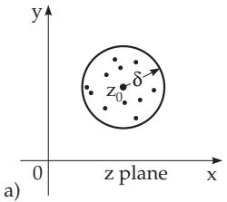
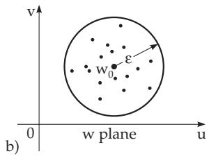

#### 14.1.1 Continuity, Differentiability

##### 14.1.1.1 Definition of a Complex Function

Analogously to real functions, complex values can be assigned to complex values, i.e., to the value $z = x + \mathrm { i } y$ one can assign a complex number $w = u + \mathrm { ~ i ~ } v$ , where $u = u ( x , y )$ and $v = v ( x , y )$ are real functions of two real variables. This relation is denoted by $w = f ( z )$ . The function $w = f ( z )$ is a mapping from the complex z plane to the complex w plane.

The notions of limit, continuity, and derivative of a complex function $w = f ( z )$ can be defined analogously to real functions of real variables.

##### 14.1.1.2 Limit of a Complex Function

The limit of a function $f ( z )$ is equal to the complex number $w _ { 0 }$ if for $z { \mathrm { ~ a p p r o a c h i n g ~ } } z _ { 0 }$ the value of the function $f ( z )$ approaches w :

$$
w _ { 0 } = \operatorname* { l i m } _ { z \to z _ { 0 } } f ( z ) .\tag{14.1a}
$$

In other words: For any positive ε there is a (real) $\delta > 0$ such that for every z satisfying (14.1b), except maybe $z _ { \mathrm { 0 } }$ itself, the inequality (14.1c) holds:

$$
| z _ { 0 } - z | < \delta ,\tag{14.1b}
$$

$$
| w _ { 0 } - f ( z ) | < \varepsilon .\tag{14.1c}
$$

The geometrical meaning is as follows: Any point z in the circle with center $z _ { \mathrm { 0 } }$ and radius $\delta ,$ except maybe the center $z _ { 0 }$ itself, is mapped into a point $w = f ( z )$ inside a circle with center $w _ { 0 }$ and radius $\varepsilon$ in the w plane where $f$ has its range, as shown in Fig. 14.1. The circles with radii $\delta$ and $\varepsilon$ are also called the neighborhoods $U _ { \varepsilon } ( w _ { 0 } )$ and $U _ { \delta } ( z _ { 0 } )$

  
Figure 14.1

##### 14.1.1.3 Continuous Complex Functions

A function $w = f ( z )$ is continuous at $z _ { 0 }$ if it has a limit there, and a substitution value, and these two are equal, i.e., if for an arbitrarily small given neighborhood $U _ { \varepsilon } ( w _ { 0 } )$ of the point $w _ { 0 } = f ( z _ { 0 } )$ in the w plane there exists a neighborhood $U _ { \delta } ( z _ { 0 } )$ of $z _ { \mathrm { 0 } }$ in the z plane such that $w = f ( z ) \in U _ { \varepsilon } ( w _ { 0 } )$ for every $z \in U _ { \delta } ( z _ { 0 } )$ . As represented in Fig. 14.1, $U _ { \varepsilon } ( w _ { 0 } )$ is, e.g., a circle with radius ε around the point $w _ { 0 }$ The continuity of $\dot { \boldsymbol { f } }$ is expressed by the usual notation

$$
\operatorname* { l i m } _ { z \to z _ { 0 } } f ( z ) = f ( z _ { 0 } ) \qquad { \mathrm { o r } } \qquad \operatorname* { l i m } _ { \delta \to 0 } f ( z _ { 0 } + \delta ) = f ( z _ { 0 } ) .\tag{14.2}
$$

##### 14.1.1.4 Differentiability of a Complex Function

A function $w = f ( z )$ is diferentiable $\mathrm { a t } ~ z \mathrm { i f }$ the diference quotient

$$
{ \frac { \Delta w } { \Delta z } } = { \frac { f ( z + \Delta z ) - f ( z ) } { \Delta z } }\tag{14.3}
$$

has a limit for $\varDelta z  0$ , independently of how Δ z approaches zero. This limit is denoted by $f ^ { \prime } ( z )$ and it is called the derivative of $\bar { f } ( z )$

The function $f ( z ) = \operatorname { R e } z = x$ is not diferentiable at any point $z = z _ { 0 }$ , since approaching $z _ { \mathrm { 0 } }$ parallel to the x-axis the limit of the diference quotient is one, and approaching parallel to the y-axis this value is zero.
