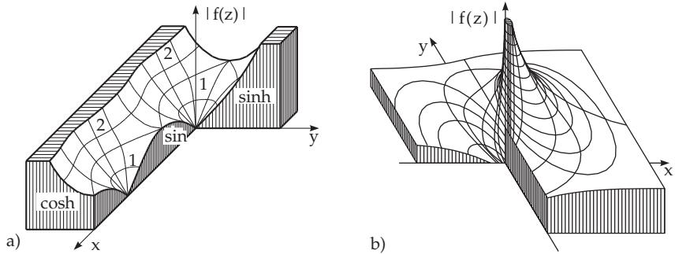

#### 14.1.2 Analytic Functions

##### 14.1.2.1 Definition of Analytic Functions

A function $f ( z )$ is called analytic, regular or holomorphic on a domain G, if it is diferentiable at every point of G. The boundary points of $G ,$ where $f ^ { \prime } ( z )$ does not exist, are singular points of $f ( z )$

The function $f ( z ) = u ( x , y ) + \mathrm { i } v ( x , y )$ is diferentiable in G if u and v have continuous partial derivatives in $G$ with respect to x and y and they also satisfy the Cauchy-Riemann diferential equations:

$$
{ \frac { \partial u } { \partial x } } = { \frac { \partial v } { \partial y } } , \quad { \frac { \partial u } { \partial y } } = - { \frac { \partial v } { \partial x } } .\tag{14.4}
$$

The real and imaginary parts of an analytic function satisfy the Laplace diferential equation:

$$
\varDelta u ( x , y ) = \frac { \partial ^ { 2 } u } { \partial x ^ { 2 } } + \frac { \partial ^ { 2 } u } { \partial y ^ { 2 } } = 0 , \qquad \quad ( 1 4 . 5 \mathrm { a } ) \qquad \quad \varDelta v ( x , y ) = \frac { \partial ^ { 2 } v } { \partial x ^ { 2 } } + \frac { \partial ^ { 2 } v } { \partial y ^ { 2 } } = 0 .\tag{14.5b}
$$

The derivatives of the elementary functions of a complex variable can be calculated with the help of the same formulas as the derivative of the corresponding real functions.

$$
{ \bf A } \colon { \bf f } ( z ) = z ^ { 3 } , \quad { \bf f } ^ { \prime } ( z ) = 3 z ^ { 2 } ; \quad \quad { \bf H } { \bf B } \colon { \bf f } ( z ) = \sin z , \quad { \bf f } ^ { \prime } ( z ) = \cos z .
$$

##### 14.1.2.2 Examples of Analytic Functions

1. Elementary Functions

The elementary algebraic and transcendental functions are analytic in the whole z plane except at some isolated singular points. If a function is analytic on a domain, i.e., it is diferentiable, then it is diferentiable arbitrarily many times.

A: The function $w = z ^ { 2 }$ with $u = x ^ { 2 } - y ^ { 2 } , \ v = 2 x y$ is everywhere analytic.

B: The function $w = u + \mathrm { i } v$ , defined by the equations $u = 2 x + y , \ v = x + 2 y$ , is not analytic at any point.

C: The function $f ( z ) = z ^ { 3 }$ with $f ^ { \prime } ( z ) = 3 z ^ { 2 }$ is analytic.

D: The function f(z) = sin z with f(z) = cos z is analytic.

2. Determination of the Functions u and v

If both the functions u and v satisfy the Laplace diferential equation, then they are harmonic functions (see 13.5.1, p. 729). If one of these harmonic functions is known, e.g., u , then the second one, as the conjugate harmonic function v, can be determined up to an additive constant with the Cauchy– Riemann diferential equations:

$$
v = \int { \frac { \partial u } { \partial x } } d y + \varphi ( x ) \quad { \mathrm { w i t h } } \quad { \frac { d \varphi } { d x } } = - \left( { \frac { \partial u } { \partial y } } + { \frac { \partial } { \partial x } } \int { \frac { \partial u } { \partial x } } d y \right) .\tag{14.6}
$$

Analogously u can be determined if v is known.

##### 14.1.2.3 Properties of Analytic Functions

1. Absolute Value or Modulus of an Analytic Function

The absolute value (modulus) of an analytic function is:

$$
| w | = | f ( z ) | = { \sqrt { [ u ( x , y ) ] ^ { 2 } + [ v ( x , y ) ] ^ { 2 } } } = \varphi ( x , y ) .\tag{14.7}
$$

The surface $| w | = \varphi ( x , y )$ is called its relief, i.e., w is the third coordinate above every point $z = x { + } \mathrm { i } y .$

A: The absolute value of the function sin z = sin x cosh y+i cos x sinh y is sin $z | = \sqrt { \sin ^ { 2 } x + \sinh ^ { 2 } y }$ The relief is shown in Fig. 14.2a.

B: The relief of the function $w = e ^ { 1 / z }$ is shown in Fig. 14.2b.

For the reliefs of several analytic functions see [14.10].

  
Figure 14.2

2. Roots

Since the absolute value of a function is positive or zero, the relief is always above the z plane, except the points where $| f ( z ) | = 0$ holds, so $f ( z ) = 0$ . The z values, where $f ( z ) = 0$ holds, are called the roots ofthe function f(z).

3. Boundedness

A function f(z) is bounded on a certain domain G, if there exists a positive number N such that $| f ( z ) | <$ N for all z in G. In the opposite case, if no such number N exists, then the function is called unbounded in G.

4. Theorem about the Maximum Value

If $w = f ( z )$ is an analytic function on a closed domain, then the maximum of its absolute value is attained on the boundar of the domain.

5. Theorem about the Constant (Theorem ofLiouville)

If $w = f ( z )$ is analytic in the whole z plane and also bounded, then this function is a constant: $f ( z ) =$ const.

##### 14.1.2.4 Singular Points

If a function $w = f ( z )$ is analytic in a neighborhood of $z = a$ , i.e., in a small circle with center a, except a itself, then f has a singularity at a. There exist three types of singularities:

1. f(z) is bounded in the neighborhood. Then there exists $w = \operatorname* { l i m } _ { z \to a } f ( z )$ , and setting $f ( a ) = w$ the function becomes analytic also at a. In this case, f has a removable singularity at a.

2. If $\operatorname* { l i m } _ { z \to a } | f ( z ) | = \infty$ , then f has a pole at a. About poles of diferent orders see 14.3.5.1, p. 753.

3. If f has neither a removable singularity nor a pole at a, then f has an essential singularity at a. In this case, for any complex w there exists a sequence $z _ { n } \to a$ such that $f ( z _ { n } )  w$

A: The function $w = \frac { 1 } { z - a }$ has a pole at a.

B: The function $w = e ^ { 1 / z }$ has an essential singularity at 0 (Fig. 14.2b).
