#### 14.1.3 Conformal Mapping

##### 14.1.3.1 Notion and Properties of Conformal Mappings

1. Definition

A mapping from the z plane to the w plane is called a conformal mapping if it is analytic and injective. In this case,

$$
w = f ( z ) = u + \mathrm { i } v , \quad f ^ { \prime } ( z ) \neq 0 .\tag{14.8}
$$

The conformal mapping has the following properties:

The transformation $d w = f ^ { \prime } ( z )$ dz of the line element $d z = { \binom { d x } { d y } }$ is the composition of a dilatation by $\sigma = | f ^ { \prime } ( z ) |$ and of a rotation by $\alpha = \arg f ^ { \prime } ( z )$ . This means that infinitesimal circles are transformed into almost circles, triangles into (almost) similar triangles (Fig. 14.3). The curves keep their angles of intersection, so an orthogonal family of curves is transformed into an orthogonal family (Fig. 14.4).

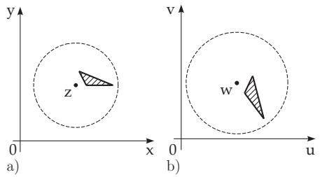  
Figure 14.3

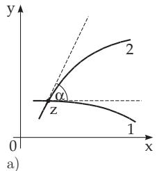

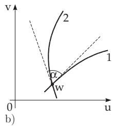  
Figure 14.4

Remark: Conformal mappings can be found in physics, electrotechnics, hydro- and aerodynamics and in other areas of mathematics

2. The Cauchy–Riemann Equations

The mapping between dz and dw is given by the afine diferential transformation

$$
d u = { \frac { \partial u } { \partial x } } d x + { \frac { \partial u } { \partial y } } d y , \qquad d v = { \frac { \partial v } { \partial x } } d x + { \frac { \partial v } { \partial y } } d y\tag{14.9a}
$$

and in matrix form

$$
d w = \mathbf { A } d z \qquad { \mathrm { w i t h } } \qquad \mathbf { A } = \left( { \begin{array} { l l } { u _ { x } \ u _ { y } } \\ { v _ { x } \ v _ { y } } \end{array} } \right) .\tag{14.9b}
$$

According to the Cauchy–Riemann diferential equations, A has the form of a rotation-stretching matrix (see 3.5.2.2, 2., p. 192) with σ as the stretching factor:

$$
\mathbf { A } = { \binom { u _ { x } - v _ { x } } { v _ { x } } } = \sigma \left( { \begin{array} { l l } { \cos \alpha - \sin \alpha } \\ { \sin \alpha \quad \cos \alpha } \end{array} } \right) ,\tag{14.10a}
$$

$$
u _ { x } = v _ { y } = \sigma \cos \alpha ,\tag{14.10b}
$$

$$
\sigma = | f ^ { \prime } ( z ) | = \sqrt { u _ { x } ^ { 2 } + u _ { y } ^ { 2 } } = \sqrt { v _ { x } ^ { 2 } + v _ { y } ^ { 2 } } ,\tag{14.10c}
$$

$$
- u _ { y } = v _ { x } = \sigma \sin \alpha ,\tag{14.10d}
$$

$$
\alpha = \arg f ^ { \prime } ( z ) = \arg \left( u _ { x } + \mathrm { i } v _ { x } \right) .\tag{14.10e}
$$

3. Orthogonal Systems

The coordinate lines x = const and $y = \mathrm { c o n s t }$ of the z plane are transformed by a conformal mapping into two orthogonal families of curves. In general, a bunch of orthogonal curvilinear coordinate systems

can be generated by analytic functions; and conversely, for every conformal mapping there exist an orthogonal net of curves which is transformed into an orthogonal coordinate system.

A: In the case of u = 2x + y, v = x + 2y (Fig. 14.5), orthogonality does not hold.

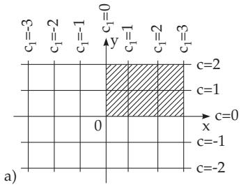

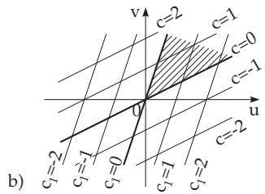  
Figure 14.5

B: In the case $w = z ^ { 2 }$ the orthogonality is retained, except at the point $z = 0$ because here $w ^ { \prime } = 0$ The coordinate lines are transformed into two confocal families of parabolas (Fig. 14.6), the first quadrant of the z plane into the upper half of the w plane.

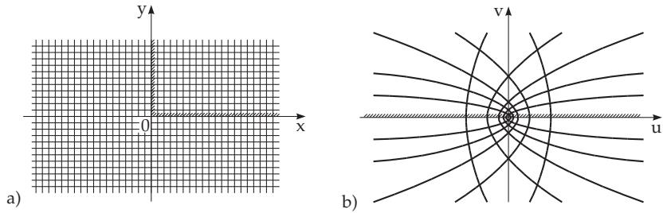  
Figure 14.6

##### 14.1.3.2 Simplest Conformal Mappings

In this paragraph, some transformations are discussed with their most important properties, and there are given the graphs of isometric nets in the z plane, i.e., the nets which are transformed into an orthogonal Cartesian net in the w plane. The boundaries of the z regions mapped into the upper half of the w plane are denoted by shading. Black regions are mapped by the conformal mapping onto the square in the w plane with vertices (0, 0), (0, 1), (1, 0), and (1, 1) (Fig. 14.7).

1. Linear Function

For the conformal mapping given in the form of a linear function

$$
w = a z + b \quad ( a , b \mathrm { c o m p l e x } , \mathrm { c o n s t } ; a \ne 0 ) ,\tag{14.11a}
$$

the transformation can be done in three steps:

a) Rotation of the z plane by the angle $\alpha = \arg a$ according to : $w _ { 1 } = e ^ { \mathrm { i } \alpha } z .$

b) Stretching of the $w _ { 1 }$ plane by the factor a : w2 = a w1.

(14.11b)

c) Parallel translation of the $w _ { 2 }$ plane by b :

$$
\begin{array} { r } { w \ = w _ { 2 } + b . } \end{array}
$$

Altogether, every figure of the z plane is transformed into a similar one of the w plane. The points $z _ { 1 } = \infty$ and $z _ { 2 } = { \frac { b } { 1 - a } }$ for a = 1 are transformed into themselves, and they are called fixed points.

Fig. 14.8 shows the orthogonal net which is transformed into the orthogonal Cartesian net.

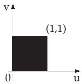  
Figure 14.7

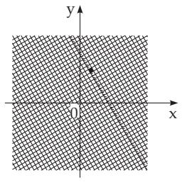  
Figure 14.8

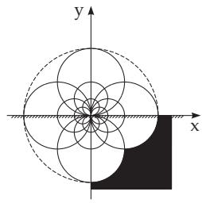  
Figure 14.9

2. Inversion

The conformal mapping

$$
w = \frac { 1 } { z }\tag{14.12}
$$

represents an inversion with respect to the unit circle and a reflection in the real axis, namely, a point $z = r e ^ { \mathrm { i } \varphi }$ of the z plane with the absolute value r and with the argument $\varphi$ is transformed into a point $w = { \textstyle \frac { 1 } { r } } e ^ { - \mathrm { i } \varphi }$ of the w plane with the absolute value $1 / r$ and with the argument $- \varphi$ (see Fig. 14.10). Circles are transformed into circles, where lines are considered as limiting cases of circles (radius $ \infty )$ Points of the interior of the unit circle become exterior points and conversely (see Fig. 14.11). The point $z = 0$ is transformed into $w = \infty$ . The points $z = - 1$ and $z = 1$ are fixed points of this conformal mapping. The orthogonal net of the transformation (14.12) is shown in Fig. 14.9.

Remark: In general a geometric transformation is called inversion with respect to a circle with radius r, when a point $P _ { 2 }$ with radius $r _ { 2 }$ inside the circle is transformed into a point $P _ { 1 }$ on the elongation of the same radius vector $\xrightarrow [ O P _ { 2 }$ outside of the circle with radius $\overline { { O P } } _ { 1 } = r _ { 1 } = r ^ { 2 } / r _ { 2 }$ . Points of the interior of the circle become exterior points and conversely.

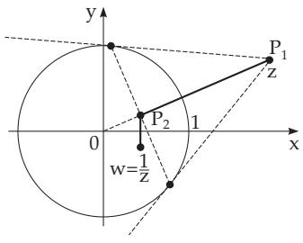  
Figure 14.10

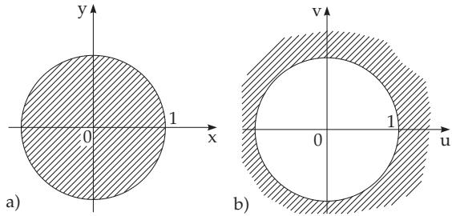  
Figure 14.11

3. Linear Fractional Function

For the conformal mapping given in the form of a linear fractional function

$$
w = { \frac { a z + b } { c z + d } } \quad ( a , b , c , d \mathrm { c o m p l e x , c o n s t } ; b c - a d \neq 0 ; c \neq 0 )\tag{14.13a}
$$

the transformation can be performed in three steps:

a) Linear function: $w _ { 1 } = c z + d .$

b) Inversion:

$$
w _ { 2 } = \frac { 1 } { w _ { 1 } } .\tag{14.13b}
$$

c) Linear function:

$$
w \ = { \frac { a } { c } } + { \frac { b c - a d } { c } } w _ { 2 } .
$$

Circles are transformed again into circles (circular transformation), where straight lines are considered as limiting cases of circles with radius $r  \infty$ . Fixed points of this conformal mapping are the both points satisfying the quadratic equation

$$
z = { \frac { a z + b } { c z + d } } .\tag{14.14}
$$

If the points $z _ { 1 }$ and $z _ { 2 }$ are inverses of each other with respect to a circle $K _ { 1 }$ of the z plane, then their images $w _ { 1 }$ and $w _ { 2 }$ in the w plane are also inversions of each other with respect to the image circle $K _ { 2 }$ of $K _ { 1 }$

The orthogonal net which has the orthogonal Cartesian net as its image is represented in Fig. 14.12.

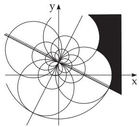  
Figure 14.12

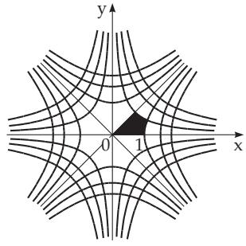  
Figure 14.13

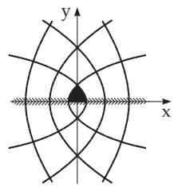  
Figure 14.14

4. Quadratic Function

The conformal mapping described by a quadratic function

$$
w = z ^ { 2 }\tag{14.15a}
$$

has the form in polar coordinates and as a function of x and $y \colon$

$$
w = \rho ^ { 2 } e ^ { \mathrm { i } 2 \varphi } ,\tag{14.15b}
$$

$$
w = u + \mathrm { i } v = x ^ { 2 } - y ^ { 2 } + 2 \mathrm { i } x y .\tag{14.15c}
$$

It is obvious from the polar coordinate representation that the upper half of the z plane is mapped onto the whole w plane, i.e., the whole image of the z plane will cover twice the whole w plane.

The representation in Cartesian coordinates shows that the coordinate lines of the w plane, u = const and $v = \mathrm { c o n s t }$ , come from the orthogonal families of hyperbolas $x ^ { 2 } - y ^ { 2 } = u$ and $2 x y = v$ of the z plane (Fig. 14.13).

Fixed points of this mapping are $z = 0$ and $z = 1$ . This mapping is not conformal at $z = 0$

5. Square Root

The conformal mapping given in the form as a square root of $z ,$

$$
w = { \sqrt { z } } ,\tag{14.16}
$$

transforms the whole z plane whether onto the upper half of the w plane or onto the lower half of it, i.e., the function is double-valued, i.e., to every value o $\mathrm { ~ f ~ } z \ ( z \neq 0 )$ belong two values of w (see 1.5.3.6, p. 38). The coordinate lines of the w plane come from two orthogonal families of confocal parabolas with the focus at the origin of the z plane and with the positive or with the negative real half-axis as

their axis (Fig. 14.14).

Fixed points of the mapping are $z = 0$ and $z = 1$ . The mapping is not conformal at $z = 0$

6. Sum of Linear and Fractional Linear Functions

The conformal mapping given by the function

$$
w = { \frac { k } { 2 } } \left( z + { \frac { 1 } { z } } \right) \quad ( k { \mathrm { ~ a r e a l c o n s t a n t } } , k > 0 )\tag{14.17a}
$$

can be transformed by the polar coordinate representation of $z = \rho e ^ { \mathrm { i } \varphi }$ and by separating the real and imaginary parts according to (14.8):

$$
u = { \frac { k } { 2 } } \left( \rho + { \frac { 1 } { \rho } } \right) \cos \varphi , \quad v = { \frac { k } { 2 } } \left( \rho - { \frac { 1 } { \rho } } \right) \sin \varphi .\tag{14.17b}
$$

Circles with $\rho = \rho _ { 0 } = \mathrm { c o n s t }$ of the z plane (Fig. 14.15a) are transformed into confocal ellipses

$$
{ \frac { u ^ { 2 } } { a ^ { 2 } } } + { \frac { v ^ { 2 } } { b ^ { 2 } } } = 1 \quad { \mathrm { w i t h } } \quad a = { \frac { k } { 2 } } \left( \rho _ { 0 } + { \frac { 1 } { \rho _ { 0 } } } \right) , \quad b = { \frac { k } { 2 } } \left| \rho _ { 0 } - { \frac { 1 } { \rho _ { 0 } } } \right|\tag{14.17c}
$$

in the w plane (Fig. 14.15b). The foci are the points k of the real axis. For the unit circle with $\rho = \rho _ { 0 } = 1$ one gets the degenerated ellipse of the w plane, the twice overrunning segment $( - k , + k )$ of the real axis. Both the interior and the exterior of the unit circle are transformed onto the entire w plane with the cut $( - k , + k )$ , so its inverse function is double-valued:

$$
z = \frac { w + \sqrt { w ^ { 2 } - k ^ { 2 } } } { k } .\tag{14.17d}
$$

The lines $\varphi = \varphi _ { 0 }$ of the z plane (Fig. 14.15c) become confocal hyperbolas

$$
{ \frac { u ^ { 2 } } { \alpha ^ { 2 } } } - { \frac { v ^ { 2 } } { \beta ^ { 2 } } } = 1 \quad { \mathrm { w i t h } } \quad \alpha = k \cos \varphi _ { 0 } , \quad \beta = k \sin \varphi _ { 0 }\tag{14.17e}
$$

with foci $\pm k$ (Fig. 14.15d). The hyperbolas corresponding to the coordinate half-axis of the z plane $\left( \varphi = 0 , \ { \frac { \pi } { 2 } } , \pi , { \frac { 3 } { 2 } } \pi \right)$ are degenerate in the axis u = 0 (v axis) and in the intervals $( - \infty , - k )$ and $( k , \infty )$ of the real axis running there and back.

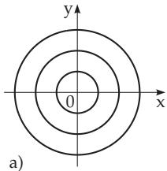

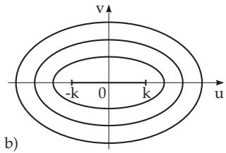  
Figure 14.15

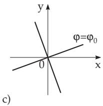

7. Logarithm

The conformal mapping given in the form of the logarithm function

$$
w = \operatorname { L n } z\tag{14.18a}
$$

has the form for z given in polar coordinates:

$$
u = \ln \rho , \quad v = \varphi + 2 k \pi \qquad ( k = 0 , \pm 1 , \pm 2 , \ldots ) .\tag{14.18b}
$$

One can see from this representation that the coordinate lines $u = \mathrm { c o n s t }$ and $v =$ const come from concentric circles around the origin of the z plane and from rays starting at the origin of the z plane

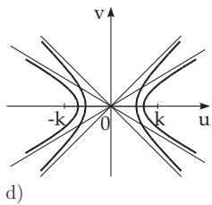

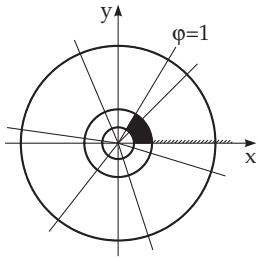  
Figure 14.15  
Figure 14.16

(Fig. 14.16). The isometric net is a polar net.

The logarithm function Ln z is infinitely many valued (see (14.74c), p. 758).

Restricting the investigation to the principal value ln z of $\ L \ n z \ ( - \pi < v \leq + \pi )$ , then the whole z plane is transformed into a stripe of the w plane bounded by the lines $v = \pm \pi$ , where $v = \pi$ belongs to the stripe.

8. Exponential Function

The conformal mapping given in the form of an exponential function (see also 14.5.2, 1., p. 758)

$$
w = e ^ { z }\tag{14.19a}
$$

has the form in polar coordinates:

$$
w = \rho e ^ { \mathrm { i } \psi } .\tag{14.19b}
$$

From $z = x + \mathrm { i } y$ follows:

$$
\rho = e ^ { x } \quad { \mathrm { a n d } } \quad \psi = y .\tag{14.19c}
$$

If y changes from π to +π, and x changes from to + , then $\rho$ takes all values from 0 to $\infty$ and ψ from π to π. A 2π wide stripe of the z plane, parallel to the x-axis, will be transformed into the entire w plane (Fig. 14.17).

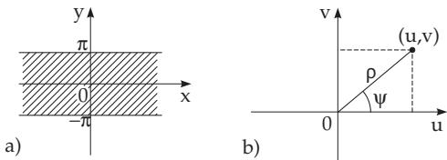  
Figure 14.17

9. The Schwarz-Christofel Formula

By the Schwarz-Christofel formula

$$
z = C _ { 1 } \int _ { 0 } \displaylimits ^ { w } \frac { d t } { ( t - w _ { 1 } ) ^ { \alpha _ { 1 } } ( t - w _ { 2 } ) ^ { \alpha _ { 2 } } ( t - w _ { n } ) ^ { \alpha _ { n } } } + C _ { 2 }\tag{14.20a}
$$

the interior of a polygon of the z plane can be mapped onto the upper half of the w plane. The polygon has n exterior angles $\alpha _ { 1 } \pi , \alpha _ { 2 } \pi , \ldots , \alpha _ { n } \pi \ ( { \bf F i g . 1 4 . 1 8 a , b } )$ . The points of the real axis in the w plane assigned to the vertices of the polygon are denoted by w $( i = 1 , \ldots , n )$ , and the integration variable is denoted by t. The oriented boundary of the polygon is transformed into the oriented real axis of the w plane by this mapping. For large values of $| t | ,$ , the integrand behaves as $1 / t ^ { 2 }$ 1/t2 and is regular at infinity. Since the sum of all the exterior angles of an n-gon is equal to $2 \pi$ , consequently

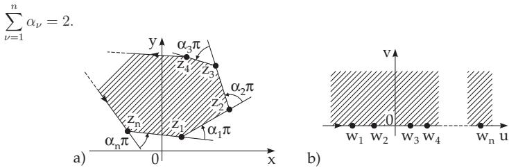  
Figure 14.18

(14.20b)

The complex constants $C _ { 1 }$ and $C _ { 2 }$ yield a rotation, a stretching and a translation; they do not depend on the form of the polygon, only on the size and the position of the polygon in the z plane.

Three arbitrary points $w _ { 1 } , w _ { 2 } , w _ { 3 }$ of the w plane can be assigned to three points $z _ { 1 } , z _ { 2 } , z _ { 3 }$ of the polygon in the z plane. Assigning a point at infinity in the w plane, $\mathrm { i . e . , } w _ { 1 } = \pm \infty$ to a vertex of the polygon in the z plane, e.g., to $z = z _ { 1 }$ , then the factor $( t - w _ { 1 } ) ^ { \alpha _ { 1 } }$ is omitted. If the polygon is degenerated, $\mathrm { e . g . }$ , a vertex is at infinity, then the corresponding exterior angle is π, so $\alpha _ { \infty } = 1 , \mathrm { i . e }$ ., the polygon is a half-stripe.

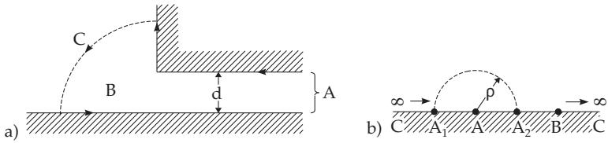  
Figure 14.19

A: Mapping of a certain region of the z plane (shaded region in Fig. 14.19a): Considering $\textstyle \sum \alpha _ { \nu } = 2$ one chooses three points as the table shows (Fig. 14.19a,b). The formula of the mapping is:

$$
z = C _ { 1 } \int _ { 0 } ^ { w } { \frac { d t } { ( t + 1 ) t ^ { - 1 / 2 } } } = 2 C _ { 1 } \left( { \sqrt { w } } - \arctan { \sqrt { w } } \right) = \mathrm { i } { \frac { 2 d } { \pi } } \left( { \sqrt { w } } - \arctan { \sqrt { w } } \right)
$$

<table><tr><td></td><td>Zν</td><td> $\alpha _ { \nu }$ </td><td> $w _ { \nu }$ </td></tr><tr><td>A</td><td>∞</td><td>1</td><td>-1</td></tr><tr><td>B</td><td>0</td><td>-1/2</td><td>0</td></tr><tr><td>C</td><td>∞</td><td>3/2</td><td>∞</td></tr></table>

0 −1 + ρeiϕ 1/2 iρeiϕdϕ To determinate $C _ { 1 }$ one substitutes $t = \rho e ^ { \mathrm { i } \varphi } - 1$ , giving id = C lim = C1π, ρ 0 π ρeiϕ

i.e., $C _ { 1 } = \mathrm { i } { \frac { d } { \pi } }$

For the constant $C _ { 2 }$ follows $C _ { 2 } = 0$ , considering that the mapping assigns ${ } ^ { \iint } z = 0  w = 0 { } ^ { ; 5 }$ B: Mapping of a rectangle. Let the vertices of the rectangle be $z _ { 1 , 4 } = \pm K , z _ { 2 , 3 } = \pm K + \mathrm { i } K ^ { \prime }$ . The points $z _ { 1 }$ and $z _ { 2 }$ should be transformed into the points $w _ { 1 } = 1$ and $w _ { 2 } = 1 / k ( 0 < k < 1 )$ of the real $\mathrm { a x i s } , z _ { 4 }$ and $z _ { 3 }$ are reflections of $z _ { 1 }$ and $z _ { 2 }$ with respect to the imaginary axis. According to the Schwarz reflection principle (see 14.1.3.3, p. 741) they must correspond to the points $w _ { 4 } = - 1$ and $w _ { 3 } = - 1 / k$ (Fig. 14.20a,b). So, the mapping formula for a rectangle $( \alpha _ { 1 } = \alpha _ { 2 } = \alpha _ { 3 } = \alpha _ { 4 } = 1 / 2 )$ of the position sketched above is: $z = C _ { 1 } \int _ { 0 } ^ { w } { \frac { d t } { \sqrt { ( t - w _ { 1 } ) ( t - w _ { 2 } ) ( t - w _ { 3 } ) ( t - w _ { 4 } ) } } } = C _ { 1 } \int _ { 0 } ^ { w } { \frac { d t } { \sqrt { ( t ^ { 2 } - 1 ) \left( t ^ { 2 } - { \frac { 1 } { k ^ { 2 } } } \right) } } }$ . The point $z ~ = ~ 0$ has the image $w = 0$ and the image of $z ~ = \mathrm { i } K$ is $w = \infty$ . With $C _ { 1 } = 1 / k$ follows $z = \int _ { 0 } ^ { w } \frac { d t } { \sqrt { ( 1 - t ^ { 2 } ) ( 1 - k ^ { 2 } t ^ { 2 } ) } } = \int _ { 0 } ^ { \varphi } \frac { d \vartheta } { \sqrt { 1 - k ^ { 2 } \sin ^ { 2 } \vartheta } } = F ( \varphi , k )$ (substituting t = sin ϑ, $w = \sin \varphi )$

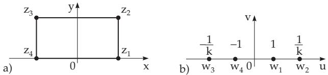  
Figure 14.20

$F ( \varphi , k )$ is the elliptic integral of the first kind (see 8.1.4.3, p. 490).

For the constant $C _ { 2 }$ one gets $C _ { 2 } = 0$ , considering that the mapping assigns ${ } ^ { \mathfrak { a } } z = 0 \to w = 0 { } ^ { \mathfrak { n } }$

##### 14.1.3.3 Schwarz Reflection Principle

1. Statement

Suppose $f ( z )$ is an analytic complex function in a domain $G ,$ and the boundary of G contains a line segment $g _ { 1 }$ . If the function is continuous on $g _ { 1 }$ and it maps the line $g _ { 1 }$ into a line $g _ { 1 } ^ { \prime }$ , then the points lying symmetric with respect to $g _ { 1 }$ are transformed into points lying symmetric with respect to $g _ { 1 } ^ { \prime }$ (Fig. 14.21).

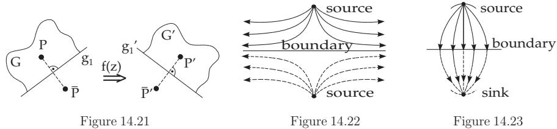

2. Application

The application of this principle makes it easier to perform calculations and the representations of plane regions with straight line boundaries: If the line boundary is a stream line (isolating boundary in Fig. 14.22), then the sources are reflected as sources, the sinks as sinks and curls as curls with the opposite sense of rotation. If the line boundary is a potential line (heavy conducting boundary in Fig. 14.23), then the sources are reflected as sinks, the sinks as sources and curls as curls with the same sense of rotation.

##### 14.1.3.4 Complex Potential

1. Notion of the Complex Potential

A field $\vec { \mathbf { V } } = \vec { \mathbf { V } } ( x , y )$ is considered in the x, y plane for the zero-divergence and the irrotational case with continuous and diferentiable components $V _ { x } ( x , y )$ and $V _ { y } ( x , y )$ of the vector $\vec { \bf V }$

a) Zero-divergence field with div $\vec { \bf V } = 0 , \mathrm { i . e . , } \frac { \partial V _ { x } } { \partial x } + \frac { \partial V _ { y } } { \partial y } = 0 \mathrm { . }$ That is the integrability condition for the diferential equation expressed with the field or stream function $\varPsi ( x , y )$

$$
d \psi = - V _ { y } d x + V _ { x } d y = 0 , \quad ( 1 4 . 2 1 \mathrm { a } ) \quad \mathrm { a n d ~ t h e n } \quad V _ { x } = \frac { \partial \varPsi } { \partial y } , \qquad V _ { y } = - \frac { \partial \varPsi } { \partial x } .\tag{14.21b}
$$

For two points $P _ { 1 } , P _ { 2 }$ of the field $\vec { \bf V }$ the diference $\varPsi ( P _ { 2 } ) - \varPsi ( P _ { 1 } )$ is a measure of the flux through a curve connecting the points $P _ { 1 }$ and $P _ { 2 }$ , in the case when the whole curve is in the field.

b) Irrotational field with rot $\vec { \bf V } = \vec { \bf 0 } , \mathrm { i . e . , } \frac { \partial V _ { y } } { \partial x } - \frac { \partial V _ { x } } { \partial y } = 0 ;$ : That is the integrability condition for the diferential equation with the potential function $\varPhi ( x , y )$

$$
d \Phi = V _ { x } d x + V _ { y } d y = 0 , \ ( 1 4 . 2 2 \mathrm { a } ) \qquad \mathrm { a n d ~ t h e n } \quad V _ { x } = \frac { \partial \varPhi } { \partial x } , \qquad V _ { y } = \frac { \partial \varPhi } { \partial y } .\tag{14.22b}
$$

If the field is free of sources and rotations, then the functions $\varPhi$ and $\varPsi$ satisfy the Cauchy–Riemann diferential equations (see 14.1.2.1, p. 732) and both satisfy the Laplace diferential equation $( \varDelta \varPhi =$ $0 , \varDelta \varPsi = 0 )$ . Combining the functions Φ and $\varPsi$ into the analytic function

$$
W = f ( z ) = \varPhi ( x , y ) + \mathrm { i } \varPsi ( x , y ) ,\tag{14.23}
$$

then this function is called the complex potential of the field $\vec { \bf V }$

Then $- \varPhi ( x , y )$ is the potential of the vector field $\vec { \bf V }$ in the sense of the usual notation in physics and electrotechnics (see 13.3.1.6, 2., p. 721). The level lines of $\varPsi$ and $\varPhi$ form an orthogonal net. For the derivation of the complex potential and the field vector $\vec { \bf V }$ the following equations hold:

$$
{ \frac { d W } { d z } } = { \frac { \partial \phi } { \partial x } } - \mathrm { i } { \frac { \partial \phi } { \partial y } } = V _ { x } - \mathrm { i } V _ { y } , { \frac { \overline { { d W } } } { d z } } = \overline { { f ^ { \prime } ( z ) } } = V _ { x } + \mathrm { i } V _ { y } .\tag{14.24}
$$

2. Complex Potential of a Homogeneous Field

The function

$$
W = a z ,\tag{14.25}
$$

with real a is the complex potential of a field whose potential lines are parallel to the y-axis and whose direction lines are parallel to the x-axis (Fig. 14.24). A complex a results in a rotation of the field (Fig. 14.25).

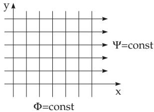  
Figure 14.24

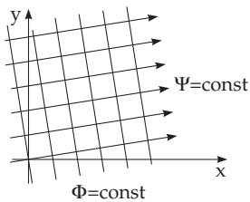  
Figure 14.25

3. Complex Potential of Source and Sink

The complex potential of a field with a strength of source $s > 0$ at the point $z = z _ { 0 }$ has the equation:

$$
W = \frac { s } { 2 \pi } \ln ( z - z _ { 0 } ) .\tag{14.26}
$$

A sink with the same intensity has the equation:

$$
W = - \frac { s } { 2 \pi } \ln ( z - z _ { 0 } ) .\tag{14.27}
$$

The direction lines run away radially from $z = z _ { 0 }$ , while the potential lines are concentric circles around the point z (Fig. 14.26).

4. Complex Potential of a Source–Sink System

One gets the complex potential for a source at the point $z _ { 1 }$ and for a sink at the point $z _ { 2 }$ , both having the same intensity, by superposition:

$$
W = \frac { s } { 2 \pi } \ln \frac { z - z _ { 1 } } { z - z _ { 2 } } .\tag{14.28}
$$

The potential lines $\varPhi =$ const form Apollonius circles with respect to $z _ { 1 }$ and $z _ { 2 } ;$ the direction lines $\varPsi =$ const are circles through $z _ { 1 }$ and z (Fig. 14.27).

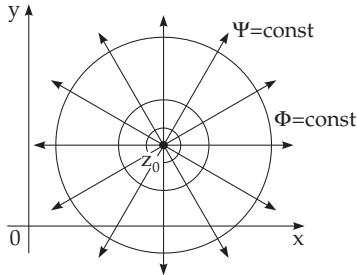  
Figure 14.26

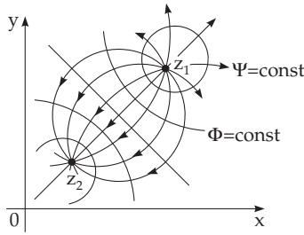  
Figure 14.27

5. Complex Potential of a Dipole

The complex potential of a dipole with dipole moment $M > 0$ at the point $z _ { \mathrm { 0 } }$ , whose axis encloses an angle α with the real axis (Fig. 14.28), has the equation:

$$
W = \frac { M e ^ { \mathrm { i } \alpha } } { 2 \pi ( z - z _ { 0 } ) } .\tag{14.29}
$$

6. Complex Potential of a Curl

If the intensity of the curl is $| { \cal { T } } |$ with real Γ and its center is at the point $z _ { \mathrm { 0 } }$ , then its equation is:

$$
W = \frac { \Gamma } { 2 \pi \mathrm { i } } \ln ( z - z _ { 0 } ) .\tag{14.30}
$$

In comparison with Fig. 14.26, the roles of the direction lines and the potential are interchanged. For complex $\varGamma$ (14.30) gives the potential of a source of curl, whose direction and potential lines form two families of spirals orthogonal to each other (Fig. 14.29).

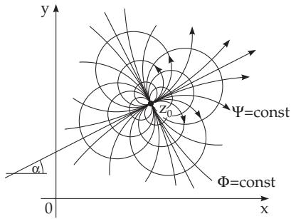  
Figure 14.28

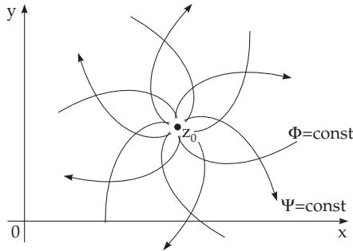  
Figure 14.29

##### 14.1.3.5 Superposition Principle

1. Superposition of Complex Potentials

A system composed of several sources, sinks, and curls is an additive superposition of single fields, $\mathrm { i . e . }$ one gets its function by adding their complex potential and stream functions. Mathematically this is possible because of the linearity of the Laplace diferential equations $\varDelta \varPhi = 0$ and $\varDelta \varPsi = 0$

2. Composition of Vector Fields

1. Integration Beside addition from complex potentials new fields can be constructed also by integration with the application of weight functions.

A curl-covering is given on a line segment l with density function $\varrho ( s )$ . The derivative of the complex potential is given by an integral of Cauchy-type (see 14.2.3, p. 748)

$$
\frac { d W } { d z } = \frac { 1 } { 2 \pi \mathrm { i } } \int \frac { \varrho ( s ) d s } { z - \zeta ( s ) } = \frac { 1 } { 2 \pi \mathrm { i } } \int \frac { \varrho ^ { * } ( \zeta ) } { z - \zeta } d \zeta ,\tag{14.31}
$$

where $\zeta ( s )$ is the complex parameter representation of the curve l with arc length parameter s.

2. Maxwell Diagonal Method If one wants to compose the superposition of two fields with the potentials $\varPhi _ { 1 }$ and $\bar { \phi _ { 2 } }$ , then one can draw the potential line figures $[ [ \tilde { \phi } _ { 1 } ] ]$ and $\left[ \left[ \varPhi _ { 2 } \right] \right]$ so that the value of the potential changes by the same amount h between two neighboring lines in both systems. Then the lines are directed so that the higher $\varPhi$ values are on the left-hand side. The lines lying in the diagonal direction to the net elements formed by $\left[ \left[ \phi _ { 1 } \right] \right]$ and $\left[ \left[ \varPhi _ { 2 } \right] \right]$ give the potential lines of the field [[Φ]], whose potential is $\varPhi = \varPhi _ { 1 } + \varPhi _ { 2 }$ or $\varPhi = \varPhi _ { 1 } - \varPhi _ { 2 }$ . One gets the figure of $\left[ \left[ \tilde { \phi } _ { 1 } + \bar { \phi } _ { 2 } \right] \right]$ if the oriented sides of the net elements are added as vectors (Fig. 14.30a), and one gets the figure of $\left[ \left[ \Phi _ { 1 } - \phi _ { 2 } \right] \right]$ by subtracting them (Fig. 14.30b). The value of the composed potential changes by h at transition from one potential line to the next one.

Vector lines and potential lines of a source and a sink with an intensity quotient $| e _ { 1 } | / | e _ { 2 } | = 3 / 2$ (see Fig. 14.31a,b).

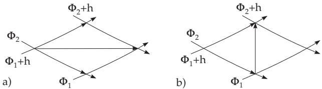  
Figure 14.30

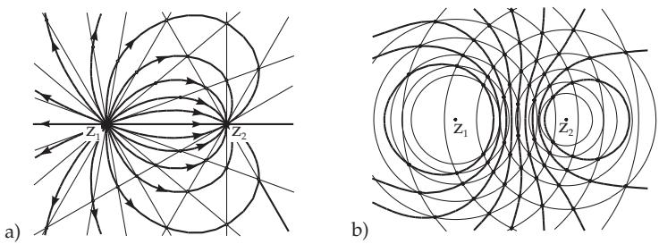  
Figure 14.31

##### 14.1.3.6 Arbitrary Mappings ofthe Complex Plane A function

$$
w = f ( z = x + \mathrm { i } y ) = u ( x , y ) + \mathrm { i } v ( x , y )\tag{14.32a}
$$

is defined if the two functions $u = u ( x , y )$ and $v = v ( x , y )$ with real variables are defined and known. The function $f ( z )$ must not be analytic, as it was required in conformal mappings. The function w maps the z plane into the w plane, i.e., it assigns to every point $z _ { \nu }$ a corresponding point $w _ { \nu }$

a) Transformation of the Coordinate Lines

$$
\begin{array} { l l l } { { y = c ~ \longrightarrow ~ u = u ( x , c ) , ~ } } & { { v = v ( x , c ) , } } & { { x \mathrm { ~ i s ~ a ~ p a r a m e t e r } ; } } \\ { { x = c _ { 1 } \longrightarrow u = u ( c _ { 1 } , y ) , } } & { { v = v ( c _ { 1 } , y ) , } } & { { y \mathrm { ~ i s ~ a ~ p a r a m e t e r } . } } \end{array}\tag{14.32b}
$$

b) Transformation of Geometric Figures Geometric figures as curves or regions of the z plane are usually transformed into curves or regions of the w plane:

$$
x = x ( t ) , \ y = y ( t ) \quad \to \quad u = u ( x ( t ) , y ( t ) ) , \ v = v ( x ( t ) , y ( t ) ) , \quad t { \mathrm { i s ~ a ~ p a r a m e t e r . } }\tag{14.32c}
$$

For $u = 2 x + y , v = x + 2 y$ , the lines $y = c$ are transformed into $u = 2 x + c , v = x + 2 c ,$ , hence into the lines $v = \frac { u } { 2 } + \frac { 3 } { 2 } c .$ . The lines $x = c _ { 1 }$ are transformed into the lines $v = 2 u - 3 c _ { 1 }$ (Fig. 14.5). The shaded region in Fig. 14.5a is transformed into the shaded region in Fig. 14.5b.

c) Riemann Surface Getting the same value w for several diferent z of the mapping $w = f ( z )$ then the image of the function consists of several planes “lying on each other”. Cutting these planes and connecting them along a curve gives a many-sheeted surface, the so-called many-sheeted Riemann surface (see [14.13]). This correspondence can be considered also in an inverse relation, in the case of multiple-valued functions as, e.g., the functions $\sqrt [ n ] { z }$ , Ln z, Arcsin z, Arctan z.

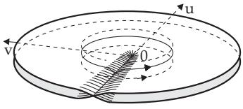  
Figure 14.32

$w = z ^ { 2 } ;$ While $z = r e ^ { \mathrm { i } \varphi }$ overruns the entire z plane, i.e., $0 \leq \varphi < 2 \pi$ , the values of $w = \varrho e ^ { \mathrm { i } \psi } = r ^ { 2 } e ^ { \mathrm { i } 2 \varphi }$ , cover twice the w plane. One can imagine to place two w planes one on each other, and cut and connect them along the negative real axis according to Fig. 14.32. This surface is called the Riemann surface of the function $w = z ^ { 2 }$ . The zero point is called a branch point. The image of the function $e ^ { z }$ (see 14.69) is a Riemann surface of infinitely many sheets.

(In many cases the planes are cut along the positive real axis. It depends on whether the principal value of the complex number is defined for the interval $( - \pi , + \pi ]$ or for the interval [0, 2π).)
