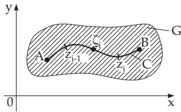
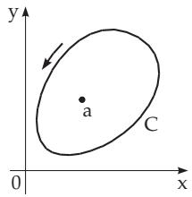
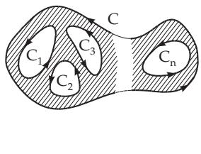
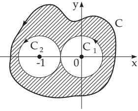
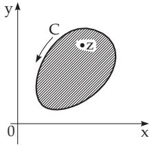
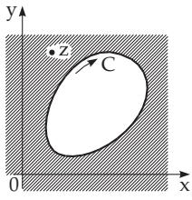

### 14.2 Integration in the Complex Plane

#### 14.2.1 Definite and Indefinite Integral

##### 14.2.1.1 Definition of the Integral in the Complex Plane

  
Figure 14.33

1. Definite Complex Integral

Suppose f(z) is continuous in a domain G, and the curve C is rectifiable, it connects the points A and B, and the whole curve is in this domain. The curve C is decomposed between the points A and B by arbitrary division points $z _ { i }$ into n subarcs (Fig.14.33).

A point $\zeta _ { i }$ is chosen on every arc segment and forms the sum

$$
\sum _ { i = 1 } ^ { n } f ( \zeta _ { i } ) \Delta z _ { i } \quad \mathrm { w i t h } \quad \varDelta z _ { i } = z _ { i } - z _ { i - 1 } .\tag{14.33a}
$$

If the limit

$$
\operatorname* { l i m } _ { n \to \infty } \sum _ { i = 1 } ^ { n } f ( \zeta _ { i } ) \varDelta z _ { i }\tag{14.33b}
$$

exists for $\Delta z _ { i } \to 0$ and $n \to \infty$ independently of the choice of the points $z _ { i }$ and $\zeta _ { i } ,$ , then this limit is called the definite complex integral

$$
I = \underbrace { \int _ { \vphantom { \int _ { \vphantom { \infty } } } } f ( z ) d z } _ { A B } = ( C ) \int _ { A } ^ { B } f ( z ) d z\tag{14.33c}
$$

along the curve $C$ between the points A and B. The value of the integral usually depends on the path of the integral.

2. Indefinite Complex Integral

If the definite integral is independent of the path of the integral (see 14.2.2, p. 747), then holds:

$$
F ( z ) = \int f ( z ) d z + C \quad { \mathrm { w i t h } } \quad F ^ { \prime } ( z ) = f ( z ) .\tag{14.34}
$$

Here C is the integration constant which is complex, in general. The function $F ( z )$ is called an indefinite complex integral.

The indefinite integrals of the elementary functions of a complex variable can be calculated with the same formulas as the integrals of the corresponding elementary function of a real variable.

$$
\Pi : \int \sin { z } d z = - \cos { z } + C . \qquad { \mathrm { ~ } } \mathbf { B } : \int e ^ { z } d z = e ^ { z } + C .
$$

3. Relation between Definite and Indefinite Complex Integrals

If the function $f ( z )$ is analytic (see 14.1.2.1, p. 732) and has an indefinite integral, then the relation between its definite and indefinite integral is

$$
\int _ { A B } f ( z ) d z = \int _ { A } ^ { B } f ( z ) d z = F ( z _ { B } ) - F ( z _ { A } ) .\tag{14.35}
$$

##### 14.2.1.2 Properties and Evaluation of Complex Integrals

1. Comparison with the curvilinear integral of the second type

The definite complex integral has the same properties as the curvilinear integral of the second type (see 8.3.2, p. 517):

a) Reversing the direction of the path of integration the integral changes its sign.

b) Decomposing the path of integration into several parts the value of the total integral is the sum of the integrals on the parts.

2. Estimation of the Value of the Integral

If the absolute value of the function $f ( z )$ does not exceed a positive number M at the points z of the path of integration $\widehat { A B }$ which has the length s, then:

$$
\left| \displaystyle \int _ { A B } f ( z ) d z \right| \leq M s { \mathrm { ~ i f ~ } } | f ( z ) | \leq M .\tag{14.36}
$$

3. Evaluation of the Complex Integral in Parametric Representation

If the path of integration $\widehat { A B }$ (or the curve $C )$ is given in the form

$$
x = x ( t ) , \qquad y = y ( t )\tag{14.37}
$$

where x and y are diferentiable functions of t and the t values for the initial and endpoint are $t _ { A }$ and $t _ { B }$ , then the definite complex integral can be calculated with two real integrals. Separating the real and the imaginary parts of the integrand the integral is

$$
\begin{array} { c } { { ( C ) \displaystyle \int _ { A } ^ { B } f ( z ) d z = \displaystyle \int _ { A } ^ { B } ( u d x - v d y ) + \mathrm { i } \displaystyle \int _ { A } ^ { B } ( v d x + u d y ) } } \\ { { = \displaystyle \int _ { t _ { A } } ^ { t _ { B } } [ u ( t ) x ^ { \prime } ( t ) - v ( t ) y ^ { \prime } ( t ) ] d t + \mathrm { i } \displaystyle \int _ { t _ { A } } ^ { t _ { B } } [ v ( t ) x ^ { \prime } ( t ) + u ( t ) y ^ { \prime } ( t ) ] d t } } \end{array}\tag{14.38a}
$$

with $f ( z ) = u ( x , y ) + \mathrm { i } v ( x , y ) , \quad z = x + \mathrm { i } y .$

(14.38b)

The notation $( C ) \intop _ { A } ^ { B } f ( z ) d z$ means that the definite integral is calculated along the curve C between

the points A and B. The notation $\int f ( z ) d z$ is also often used, and has the same meaning.

$I = \int _ { ( C ) } ( z - z _ { 0 } ) ^ { n } d z \quad ( n \in \mathbb { Z } ) ^ { A } $ B . Let the curve C be a circle around the point $z _ { 0 }$ with radius $r _ { 0 } \mathbf { : }$ $x = x _ { 0 } + r _ { 0 }$ cos t, $y = y _ { 0 } + r _ { 0 }$ sin t with $0 \leq t \leq 2 \pi$ . For every point z of the curve $C \colon z = x + \mathrm { i } \ y =$ $z _ { 0 } + r _ { 0 } ( \cos t + \mathrm { i } \sin t )$ $d z = r _ { 0 } ( - \sin t + \mathrm { i } \cos t ) d t$ . After substituting these values and transforming according to the de Moivre formula follows: $I = r _ { 0 } ^ { n + 1 } \int _ { 0 } ^ { 2 \pi } ( \cos n t + \mathrm { i } \sin n t ) ( - \sin t + \mathrm { i } \cos t ) d t$

$$
= r _ { 0 } ^ { n + 1 } \int _ { 0 } ^ { 2 \pi } [ { \mathrm { i } } \cos ( n + 1 ) t - \sin ( n + 1 ) t ] d t = { \left\{ \begin{array} { l l } { 0 { \mathrm { ~ f o r ~ } } n \neq - 1 , } \\ { 2 \pi { \mathrm { i } } { \mathrm { ~ f o r ~ } } n = - 1 . } \end{array} \right. }
$$

4. Independence of the Path of Integration

Suppose a function $f ( z )$ of a complex variable is defined in a simply connected domain. The integral (14.33c) of the function can be independent of the path of integration, which connects the fixed points $\overset { \triangledown } { \boldsymbol { A } } ( \boldsymbol { z } _ { A } )$ and $B ( z _ { B } )$ . A suficient and necessary condition is that the function $f ( z )$ is analytic in this domain, i.e., u and v satisfy the Cauchy–Riemann diferential equations (14.4, p. 732). Then also the equality (14.35) is valid. If a domain is bounded by a simple closed curve, then the domain is simply connected.

5. Complex Integral along a Closed Curve

Suppose $f ( z )$ is analytic in a simply connected domain G. Integrating the function $f ( z )$ along a closed curve C which is the boundary of this domain, the value of the integral according to the Cauchy integral theorem is equal to zero (see 14.2.2, p. 747):

$$
\left( C \right) \oint f \left( z \right) d z = 0 .\tag{14.39}
$$

If f(z) has singular points in this domain, then the integral is calculated by using the residue theorem (see 14.3.5.5, p. 754), or by the formula (14.38a).

The function $f ( z ) = { \frac { 1 } { z - a } }$ , with a singular point at $z = a$ has an integral value for the closed curve

C directed counterclockwise around a (Fig.14.34) (C) $\oint { \frac { d z } { z - a } } = 2 \pi \mathrm { i } \operatorname { R e s } f ( z ) | _ { z = a } = 2 \pi \mathrm { i } ,$

#### 14.2.2 Cauchy Integral Theorem

##### 14.2.2.1 Cauchy Integral Theorem for Simply Connected Domains

If a function $f ( z )$ is analytic in a simply connected domain G, then two equivalent statements hold:

a) The integral is equal to zero along any closed curve C inside of $G \mathrm { : }$

$$
\left( C \right) \oint f \left( z \right) d z = 0 .\tag{14.40}
$$

b) The value of the integral $\int _ { A } ^ { B } f ( z ) d z$ is independent of the curve connecting the points A and B and running inside of G, i.e., it depends only on A and B.

This is the Cauchy integral theorem.

##### 14.2.2.2 Cauchy Integral Theorem for Multiply Connected Domains

$\operatorname { I f } C , C _ { 1 } , C _ { 2 } , . . . , C _ { n }$ are simple closed curves such that the curve C encloses all the $C _ { \nu } \left( \nu = 1 , 2 , \ldots , n \right)$ none of the curves $C _ { \nu }$ encloses or intersects another one, and furthermore the function $f ( z )$ is analytic in a domain G which contains the curves and the region between C and $C _ { \nu }$ , i.e., at least the region shaded in Fig.14.35, then

$$
\oint _ { ( C ) } f ( z ) d z = \oint _ { ( C _ { 1 } ) } f ( z ) d z + \oint _ { ( C _ { 2 } ) } f ( z ) d z + \ldots + \oint _ { ( C _ { n } ) } f ( z ) d z ,\tag{14.41}
$$

if the curves $C , C _ { 1 } , . . . , C _ { n }$ are oriented in the same direction, e.g., counterclockwise.

This theorem is useful for the calculation of an integral along a closed curve C, if it also encloses singular points of the function $f ( z )$ (see 14.3.5.5, p. 754).

  
Figure 14.34

  
Figure 14.35

  
Figure 14.36

Calculate the integral $\oint _ { ( C ) } { \frac { z - 1 } { z ( z + 1 ) } } d z$ , where C is a curve enclosing the origin and the point $z = - 1$

(Fig. 14.36). Applying the Cauchy integral theorem, the integral along C is equal to the sum of the integrals along $C _ { 1 }$ and $\bar { C } _ { 2 }$ , where $C _ { 1 }$ is a circle around the origin with radius $r _ { 1 } = 1 / 2$ and $C _ { 2 }$ is a circle around the point $z = - 1$ with radius $r _ { 2 } = 1 / 2$ . The integrand can be decomposed into partial fractions.

Then follows: $\oint _ { ( C ) } \frac { z - 1 } { z ( z + 1 ) } d z = \oint _ { ( C _ { 1 } ) } \frac { 2 d z } { z + 1 } + \oint _ { ( C _ { 2 } ) } \frac { 2 d z } { z + 1 } - \oint _ { ( C _ { 1 } ) } \frac { d z } { z } - \oint _ { ( C _ { 2 } ) } \frac { d z } { z } = 0 + 4 \pi \mathrm { i } - 2 \pi \mathrm { i } - 0 = 2 \pi \mathrm { i } .$

(Compare the integrals with the example in 14.2.1.2, 3., p. 747.)

#### 14.2.3 Cauchy Integral Formulas

##### 14.2.3.1 Analytic Function on the Interior of a Domain

If f(z) is analytic on a simple closed curve C and on the simply connected domain inside it, then the following representation is valid for every interior point z of this domain (Fig. 14.37):

$$
f ( z ) = \frac { 1 } { 2 \pi \mathrm { i } } \ointop _ { ( C ) } \frac { f ( \zeta ) } { \zeta - z } d \zeta \qquad ( C a u c h y i n t e g r a l f o r m u l a ) ,\tag{14.42}
$$

where ζ traces the curve C counterclockwise. With this formula, the values of an analytic function in the interior of a domain are expressed by the values of the function on the boundary of this domain. The existence and the integral representation of the n-th derivative of the function analytic on the domain G follows from (14.42):

$$
f ^ { ( n ) } ( z ) = { \frac { n ! } { 2 \pi \mathrm { i } } } \ointop _ { ( C ) } { \frac { f ( \zeta ) } { ( \zeta - z ) ^ { n + 1 } } } d \zeta .\tag{14.43}
$$

Consequently, if a complex function is diferentiable, i.e., it is analytic, then it is diferentiable arbitrarily many times. In contrast to this, in the real case diferentiability does not include repeated diferentiability.

The equations (14.42) and (14.43) are called the Cauchy integral formulas.

##### 14.2.3.2 Analytic Function on the Exterior of a Domain

If a function $f ( z )$ is analytic on the entire part of the plane outside of a closed curve of integration $C ,$ then the values and the derivatives of the function $f ( z )$ at a point z of this domain can be given with the same Cauchy formulas (14.42), (14.43), but the orientation of the curve C is now clockwise (Fig. 14.38).

Also certain real integrals can be calculated with the help of the Cauchy integral formulas (see 14.4, p. 754).

  
Figure 14.37

  
Figure 14.38
