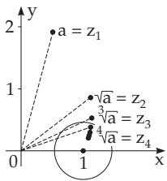
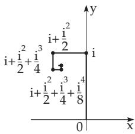
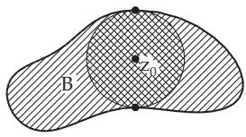
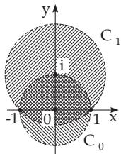
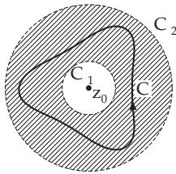
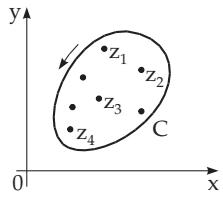
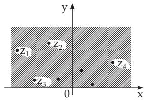

### 14.3 Power Series Expansion of Analytic Functions

#### 14.3.1 Convergence of Series with Complex Terms

##### 14.3.1.1 Convergence of a Number Sequence with Complex Terms

An infinite sequence of complex numbers $z _ { 1 } , z _ { 2 } , \ldots , z _ { n } , . . .$ . has a limit $\quad z \quad ( z \ = \ \operatorname* { l i m } _ { n \to \infty } \ z _ { n } )$ if for every arbitrarily given positive $\varepsilon$ there exists an $n _ { 0 }$ such that the inequality $| z - z _ { n } | < \varepsilon$ holds for every $n > n _ { 0 } .$ , i.e., from a certain $n _ { 0 }$ the points representing the numbers $z _ { n } , z _ { n + 1 } , . . .$ . are inside of a circle with radius ε and center at z.

If the expression $\{ \sqrt [ n ] { a } \}$ means the root with the smallest non-negative argument, then the limit lim $\left\{ \sqrt [ n ] { a } \right\} \stackrel { - } { = } 1$ is valid for arbitrarily complex $a \neq 0$ (Fig. 14.39).   
n→∞

##### 14.3.1.2 Convergence of an Infinite Series with Complex Terms

A series $a _ { 1 } + a _ { 2 } + \cdots + a _ { n } + \cdots$ with complex terms $a _ { i }$ converges to the number s, the sum of the series, if the sequence of the partial sums $s _ { n }$ with

$$
s _ { n } = a _ { 1 } + a _ { 2 } + \cdots + a _ { n } \quad ( n = 1 , 2 , \ldots )\tag{14.44}
$$

converges. Connecting the points corresponding to the numbers $s _ { n } = a _ { 1 } + a _ { 2 } + \cdots + a _ { n }$ in the z plane by a broken line, then convergence means that the end of the broken line approaches the point s.

$$
\mathbf { a } : \mathrm { i } + { \frac { \mathrm { i } ^ { 2 } } { 2 } } + { \frac { \mathrm { i } ^ { 3 } } { 3 } } + { \frac { \mathrm { i } ^ { 4 } } { 4 } } + \cdots . \qquad \mathbf { \equiv \mathbf { B } } : \mathrm { i } + { \frac { \mathrm { i } ^ { 2 } } { 2 } } + { \frac { \mathrm { i } ^ { 3 } } { 2 ^ { 2 } } } + \cdots \quad \left( \mathbf { F } \mathrm { i } \mathbf { g } . \ \mathbf { 1 } \mathbf { 4 } . 4 \mathbf { 0 } \right) .
$$

  
Figure 14.39  
Figure 14.40

A series is called absolutely convergent (see B), if the series of absolute values of the terms $| a _ { 1 } | +$ $| a _ { 2 } | + | a _ { 3 } | + \cdots$ is also convergent. The series is called conditionally convergent (see A) if the series is convergent but not absolutely convergent. If the terms of a series are functions $f _ { i } ( z )$ , like

$$
f _ { 1 } ( z ) + f _ { 2 } ( z ) + \cdots + f _ { n } ( z ) + \cdots ,\tag{14.45}
$$

then its sum is a function defined for the values z for which the series of the function values is convergent.

##### 14.3.1.3 Power Series with Complex Terms

1. Convergence

A power series with complex coeficients has the form

$$
P ( z - z _ { 0 } ) = a _ { 0 } + a _ { 1 } ( z - z _ { 0 } ) + a _ { 2 } ( z - z _ { 0 } ) ^ { 2 } + \cdots + a _ { n } ( z - z _ { 0 } ) ^ { n } + \cdots ,\tag{14.46a}
$$

where $z _ { \mathrm { 0 } }$ is a fixed point in the complex plane and the coeficients $a _ { \nu }$ are complex constants (which can also have real values). For $z _ { 0 } = 0$ the power series has the form

$$
P ( z ) = a _ { 0 } + a _ { 1 } z + a _ { 2 } z ^ { 2 } + \cdots + a _ { n } z ^ { n } + \cdots .\tag{14.46b}
$$

If the power series $P ( z - z _ { 0 } )$ is convergent for a value $z _ { 1 }$ , then it is absolutely and uniformly convergent for every z in the interior of the circle with radius $r = | z _ { 1 } - z _ { 0 } |$ and center at $z _ { 0 }$

2. Circle of Convergence

The limit between the domain of convergence and the domain of divergence of a complex power series is a uniquely defined circle. One determines its radius just as in the real case, if the limits

$$
r = { \frac { 1 } { \operatorname* { l i m } _ { n \to \infty } { \sqrt [ { n } ] { | a _ { n } | } } } } \qquad { \mathrm { o r } } \qquad r = \operatorname* { l i m } _ { n \to \infty } \left| { \frac { a _ { n } } { a _ { n + 1 } } } \right|\tag{14.47}
$$

exist. If the series is divergent everywhere except at $z = z _ { 0 }$ , then $r = 0 ;$ if it is convergent everywhere, then $r = \infty$ . The behavior of the power series on the boundary circle of the domain of convergence should be investigated point by point.

The power series $P ( z ) = \sum _ { n = 1 } ^ { \infty } { \frac { z ^ { n } } { n } }$ with radius of convergence $r = 1$ is divergent for $z = 1$ (harmonic series) and convergent for $z = - 1$ (according to the Leibniz criteria for alternating series (see 7.2.3.3,1., p. 463)). This power series is convergent for all further points of the unit circle $| z | = 1$ except the point $z = 1$

3. Derivative of Power Series in the Circle of Convergence

Every power series represents an analytic function $f ( z )$ inside of the circle of convergence. One gets the derivative by a term-by-term diferentiation. The derivative series has the same radius of convergence as the original one.

4. Integral of Power Series in the Circle of Convergence

The power series expansion of the integral $\int _ { z _ { 0 } } ^ { z } f ( \zeta ) d \zeta$ can be obtained by a term-by-term integration of the power series of f(z) . The radius of convergence remains the same.

#### 14.3.2 Taylor Series

Every function $f ( z )$ analytic in a domain G can be expanded uniquely into a power series of the form

$$
f ( z ) = \sum _ { n = 0 } ^ { \infty } a _ { n } ( z - z _ { 0 } ) ^ { n }
$$

(Taylor series),

(14.48a)

for any $z _ { 0 }$ in $G ,$ where the circle of convergence is the greatest circle around $z _ { \mathrm { 0 } }$ which belongs entirely to the domain G (Fig. 14.41). The coeficients $a _ { n }$ are complex numbers in general; for them one gets:

$$
a _ { n } = \frac { f ^ { ( n ) } ( z _ { 0 } ) } { n ! } .\tag{14.48b}
$$

The Taylor series can be written in the form

$$
f ( z ) = f ( z _ { 0 } ) + \frac { f ^ { \prime } ( z _ { 0 } ) } { 1 ! } ( z - z _ { 0 } ) + \frac { f ^ { \prime \prime } ( z _ { 0 } ) } { 2 ! } ( z - z _ { 0 } ) ^ { 2 } + \cdots + \frac { f ^ { ( n ) } ( z _ { 0 } ) } { n ! } ( z - z _ { 0 } ) ^ { n } + \cdots .\tag{14.48c}
$$

Every power series is the Taylor expansion of its sum function in the interior of its circle of convergence. Examples of Taylor expansions are the series representations of the functions $e ^ { z }$ , sin z, cos z, sinh $z ,$ and cosh z in 14.5.2, p. 758.

  
Figure 14.41

  
Figure 14.42

  
Figure 14.43

#### 14.3.3 Principle of Analytic Continuation

Let consider the case when the circles of convergence $K _ { 0 }$ around $z _ { \mathrm { 0 } }$ and $K _ { 1 }$ around $z _ { 1 }$ of the two power series

$$
f _ { 0 } ( z ) = \sum _ { n = 0 } ^ { \infty } a _ { n } ( z - z _ { 0 } ) ^ { n } \qquad { \mathrm { a n d } } \qquad f _ { 1 } ( z ) = \sum _ { n = 0 } ^ { \infty } b _ { n } ( z - z _ { 1 } ) ^ { n }\tag{14.49a}
$$

have a certain common domain (Fig. 14.42) and in this domain they are equal:

$$
f _ { 0 } ( z ) = f _ { 1 } ( z ) .\tag{14.49b}
$$

Then both power series are the Taylor expansions of the same analytic function $f ( z )$ , belonging to the points $z _ { \mathrm { 0 } }$ and $z _ { 1 }$ . The function $f _ { 1 } ( z )$ is called the analytic continuation into $K _ { 1 }$ of the function $f _ { 0 } ( z )$ defined only in $K _ { 0 }$

The geometric series $f _ { 0 } ( z ) = \sum _ { n = 0 } ^ { \infty } z ^ { n }$ with the circle of convergence $K _ { 0 } ( r _ { 0 } = 1 )$ around $z _ { 0 } = 0$ and $f _ { 1 } ( z ) = { \frac { 1 } { 1 - \mathrm { i } } } \sum _ { n = 0 } ^ { \infty } \left( { \frac { z - \mathrm { i } } { 1 - \mathrm { i } } } \right) ^ { n }$ with the circle of convergence $K _ { 1 } \ ( r _ { 1 } = { \sqrt { 2 } } )$ around $z _ { 1 } = \mathrm { i }$ have the same

analytic function $f ( z ) = 1 / ( 1 - z )$ as their sum in their own circle of convergence, consequently also on the common part of them (doubly shaded region in Fig. 14.42) for $z \neq 1$ . So, $f _ { 1 } ( z )$ is the analytic continuation of $\bar { f } _ { 0 } ( z )$ from $K _ { 0 }$ into $K _ { 1 }$ (and conversely).

#### 14.3.4 Laurent Expansion

Every function $f ( z )$ , which is analytic in the interior of a circular ring between two concentric circles with center $z _ { \mathrm { 0 } }$ and radii $r _ { 1 }$ and $r _ { 2 }$ , can be expanded into a generalized power series, into the so-called Laurent series:

$$
\begin{array} { l } { { f ( z ) = \displaystyle \sum _ { n = - \infty } ^ { \infty } a _ { n } ( z - z _ { 0 } ) ^ { n } = \cdots + \displaystyle \frac { a _ { - k } } { ( z - z _ { 0 } ) ^ { k } } + \displaystyle \frac { a _ { - k + 1 } } { ( z - z _ { 0 } ) ^ { k - 1 } } + \cdots } } \\ { { + \displaystyle \frac { a _ { - 1 } } { z - z _ { 0 } } + a _ { 0 } + a _ { 1 } ( z - z _ { 0 } ) + a _ { 2 } ( z - z _ { 0 } ) ^ { 2 } + \cdots + a _ { k } ( z - z _ { 0 } ) ^ { k } + \cdots . } } \end{array}\tag{14.50a}
$$

The coeficients $a _ { n }$ are usually complex and they are uniquely defined by the formula

$$
a _ { n } = { \frac { 1 } { 2 \pi { \mathrm { i } } } } \ointop _ { ( C ) } { \frac { f ( \zeta ) } { ( \zeta - z _ { 0 } ) ^ { n + 1 } } } d \zeta \qquad ( n = 0 , \pm 1 , \pm 2 , \ldots ) ,\tag{14.50b}
$$

where $C$ denotes an arbitrary closed curve which is in the circular ring $r _ { 1 } < | z | < r _ { 2 } ,$ , and the circle with radius $r _ { 1 }$ is inside of ${ \mathrm { i t } } ,$ and its orientation is counterclockwise (Fig. 14.43). If the domain G of the function $f ( z )$ is larger than the circular ring, then the domain of convergence of the Laurent series is the largest circular ring with center $z _ { 0 }$ lying entirely in $G _ { \ast }$

The Laurent series expansion of the function $f ( z ) = { \frac { 1 } { ( z - 1 ) ( z - 2 ) } }$ is determined around $z _ { 0 } = 0$ in the circular ring $1 < | z | < 2$ where $f ( z )$ is analytic. First the function $f ( z )$ is decomposed into partial fractions: $f ( z ) = { \frac { 1 } { z - 2 } } - { \frac { 1 } { z - 1 } }$ . Since $| 1 / z | < 1$ and $| z / 2 | < 1$ holds in the considered domain, the two terms of this decomposition can be written as the sums of geometric series being absolutely convergent in the entire circular ring $1 < | z | < 2$ . One gets:

$$
f ( z ) = { \frac { 1 } { ( z - 1 ) ( z - 2 ) } } = - { \frac { 1 } { z \left( 1 - { \frac { 1 } { z } } \right) } } - { \frac { 1 } { 2 \left( 1 - { \frac { z } { 2 } } \right) } } = - \sum _ { \frac { n = 1 } { | z | > 1 } } ^ { \infty } - { \frac { 1 } { 2 } } \sum _ { \underset { | z | < 2 } { \underbrace { \sum _ { n = 0 } ^ { \infty } \left( { \frac { z } { 2 } } \right) ^ { n } } } }
$$

$$
= \sum _ { n = - \infty } ^ { \infty } a _ { n } z ^ { n } \quad { \mathrm { w i t h } } \quad a _ { n } = { \left\{ \begin{array} { l l } { - 1 } & { { \mathrm { f o r } } ~ n = - 1 , - 2 , \dots , } \\ { { \cfrac { - 1 } { 2 ^ { n + 1 } } } } & { { \mathrm { f o r } } ~ n = 0 , 1 , 2 , \dots ~ . } \end{array} \right. }
$$

#### 14.3.5 Isolated Singular Points and the Residue Theorem

##### 14.3.5.1 Isolated Singular Points

If a function $f ( z )$ is analytic in the neighborhood of a point $z _ { 0 }$ but not at the point $z _ { \mathrm { 0 } }$ itself, then $z _ { 0 }$ is called an isolated singular point of the function $f ( z )$ . If $f ( z )$ can be expanded into a Laurent series in the neighborhood of $z _ { 0 }$

$$
f ( z ) = \sum _ { n = - \infty } ^ { \infty } a _ { n } ( z - z _ { 0 } ) ^ { n } ,\tag{14.51}
$$

then the isolated singular point can be classified by the behavior of the Laurent series: 1. If the Laurent series does not contain any term with a negative power of $( z - z _ { 0 } )$ , i.e., $a _ { n } = 0$ for

$n < 0$ holds, then the Laurent series is a Taylor series with coeficients given by the Cauchy integral formula

$$
a _ { n } = \frac { 1 } { 2 \pi \mathrm { i } } \mathop { \oint } _ { ( K ) } ( \zeta - z _ { 0 } ) ^ { - n - 1 } f ( \zeta ) d \zeta = \frac { f ^ { ( n ) } ( z _ { 0 } ) } { n ! } \quad ( n = 0 , 1 , 2 , \ldots . ) .\tag{14.52}
$$

In this case, the function $f ( z )$ itself is either analytic at the point $z _ { \mathrm { 0 } }$ and $f ( z _ { 0 } ) = a _ { 0 }$ or z is a removable singularity.

2. If the Laurent series contains a finite number of terms with negative powers of $( z - z _ { 0 } ) , \mathrm { i . e . , } a _ { m } \neq 0$ $a _ { n } = 0$ for $n < m < 0$ , then $z _ { 0 }$ is called a $p o l e ,$ a pole oforder m, or a pole ofmultiplicity m. Multiplying by $( z - z _ { 0 } ) ^ { m }$ , and not by any lower power, then $f ( z )$ is transformed into a function which is analytic at $z _ { 0 }$ and in its neighborhood.

$f ( z ) = { \frac { 1 } { 2 } } \left( z + { \frac { 1 } { z } } \right)$ has a pole of order one at $z = 0$

3. If the Laurent series contains an infinite number of terms with negative powers of $( z - z _ { 0 } )$ , then $z _ { 0 }$ essential sin ularit $f ( z )$

Approaching a pole, $| f ( z ) |$ tends to . Approaching an essential singularity, $f ( z )$ gets arbitrarily close to any complex number c.

The function $f ( z ) = e ^ { 1 / z }$ , whose Laurent series is $f ( z ) = \sum _ { n = 0 } ^ { \infty } { \frac { 1 } { n ! } } { \frac { 1 } { z ^ { n } } }$ , has an essential singularity at $z = 0$

##### 14.3.5.2 Meromorphic Functions

If an otherwise holomorphic function has only isolated singularities which are poles, then it is called meromorphic. A meromorphic function can always be represented as the quotient of two analytic functions.

Examples of functions meromorphic on the whole plane are the rational functions which have a finite number of poles, and also transcendental functions such as tan $z = { \frac { \sin z } { \cos z } } { \mathrm { ~ a n d ~ } } \cot z = { \frac { \cos z } { \sin z } } .$

##### 14.3.5.3 Elliptic Functions

Elliptic functions are double periodic functions whose singularities are poles, i.e., they are meromorphic functions with two independent periods (see 14.6, p. 762). If the two periods are $\omega _ { 1 }$ and $\omega _ { 2 }$ , which are in a non-real relation, then

$$
\begin{array} { r l } { f ( z + m \omega _ { 1 } + n \omega _ { 2 } ) = f ( z ) } & { { } ( m , n = 0 , \pm 1 , \pm 2 , . . . ; \operatorname { I m } \left( \frac { \omega _ { 1 } } { \omega _ { 2 } } \right) \neq 0 ) . } \end{array}\tag{14.53}
$$

The range of $f ( z )$ is already attained in a primitive period parallelogram with the points $0 , \omega _ { 1 } , \omega _ { 1 } +$ $\omega _ { 2 } , \omega _ { 2 }$

##### 14.3.5.4 Residue

With $z _ { \mathrm { 0 } }$ as an isolated singularity of the function $f ( z )$ the coeficient $a _ { - 1 }$ of the power $( z - z _ { 0 } ) ^ { - 1 }$ in the Laurent expansion of $f ( z )$ valid in the neighborhood of $z _ { \mathrm { 0 } }$ is called the residue of the function $f ( z )$ at the point $z _ { \mathrm { 0 } }$ . According to (14.50b)

$$
a _ { - 1 } = \operatorname { R e s } f ( z ) | _ { z = z _ { 0 } } = { \frac { 1 } { 2 \pi \mathrm { i } } } \ointop f ( \zeta ) d \zeta\tag{14.54a}
$$

holds. The residue belonging to a pole of order m can be calculated by the formula

$$
a _ { - 1 } = \operatorname { R e s } f ( z ) | _ { z = z _ { 0 } } = \operatorname * { l i m } _ { z \to z _ { 0 } } \frac 1 { ( m - 1 ) ! } \frac { d ^ { m - 1 } } { d z ^ { m - 1 } } [ f ( z ) ( z - z _ { 0 } ) ^ { m } ] .\tag{14.54b}
$$

If the function $f ( z )$ can be represented as a quotient $f ( z ) = \varphi ( z ) / \psi ( z )$ , where the functions $\varphi ( z )$ and $\psi ( z )$ are analytic at the point $z = z _ { 0 }$ and $z _ { 0 }$ is a simple root of the function $\psi ( z ) , \mathrm { i . e . , } \psi ( z _ { 0 } ) = 0$ and $\psi ^ { \prime } ( z _ { 0 } ) \neq 0$ holds, then the point $z ~ = ~ z _ { 0 }$ is a pole of order one of the function $f ( z )$ . It follows from (14.54b) that

$$
\mathrm { R e s } \left[ \frac { \varphi ( z ) } { \psi ( z ) } \right] _ { z = z _ { 0 } } = \frac { \varphi ( z _ { 0 } ) } { \psi ^ { \prime } ( z _ { 0 } ) } .\tag{14.54c}
$$

If $z _ { \mathrm { 0 } }$ is a root of multiplicity m of the function $\psi ( z )$ ${ \mathrm { i . e . , ~ } } \psi ( z _ { 0 } ) = \psi ^ { \prime } ( z _ { 0 } ) = \cdot \cdot \cdot = \psi ^ { ( m - 1 ) } ( z _ { 0 } ) =$ $0 , \ \psi ^ { ( m ) } ( z _ { 0 } ) \neq 0$ holds, then the point $z = z _ { 0 }$ is a pole of order m of $f ( z )$

##### 14.3.5.5 Residue Theorem

With the help of residues one can calculate the integral of a function along a closed curve enclosing isolated singular points (Fig. 14.44).

If the function $f ( z )$ is single valued and analytic in a simply connected domain G except at a finite number of points $z _ { 0 } , z _ { 1 } , z _ { 2 } , \ldots , z _ { n } ,$ and the domain is bounded by the closed curve $C ,$ , then the value of the integral of the function along this closed curve in a counterclockwise direction is the product of 2πi and the sum of the residues in all these singular points:

$$
\oint _ { ( K ) } f ( z ) d z = 2 \pi \mathrm { i } \sum _ { k = 0 } ^ { n } \operatorname { R e s } f ( z ) | _ { z = z _ { k } } .\tag{14.55}
$$

The function $f ( z ) = e ^ { z } / ( z ^ { 2 } + 1 )$ has poles of order one at $z _ { 1 , 2 } = \pm \mathrm { i }$ . The corresponding residues have the sum sin 1. If K is a circle around the origin with radius $r > 1$ , then

$$
\oint _ { ( K ) } \frac { e ^ { z } } { z ^ { 2 } + 1 } d z = 2 \pi \mathrm { i } \left( \frac { e ^ { z _ { 1 } } } { 2 z _ { 1 } } + \frac { e ^ { z _ { 2 } } } { 2 z _ { 2 } } \right) = 2 \pi \mathrm { i } \left( \frac { e ^ { \mathrm { i } } } { 2 \mathrm { i } } - \frac { e ^ { - \mathrm { i } } } { 2 \mathrm { i } } \right) = 2 \pi \mathrm { i } \sin 1 .
$$

  
Figure 14.44

  
Figure 14.45
