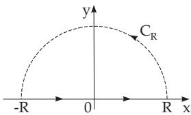
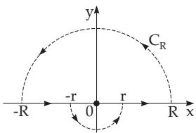
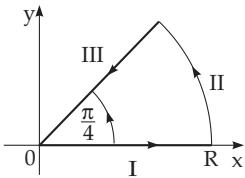

### 14.4 Evaluation of Real Integrals by Complex Integrals

#### 14.4.1 Application of Cauchy Integral Formulas

The value of certain real integrals can be calculated with the help of the Cauchy integral formula.

The function $f ( z ) = e ^ { z }$ , which is analytic in the whole z plane, can be represented with the Cauchy integral formula (14.42), where the path of integration C is a circle with center z and radius r. The equation of the circle is $\zeta = z + r e ^ { \mathrm { i } \varphi }$ . From (14.43) follows

$$
e ^ { z } = { \frac { n ! } { 2 \pi \mathrm { i } } } \oint { \frac { e ^ { \zeta } } { ( \zeta - z ) ^ { n + 1 } } } d \zeta = { \frac { n ! } { 2 \pi \mathrm { i } } } \int _ { \varphi = 0 } ^ { \varphi = 2 \pi } { \frac { e ^ { ( z + r \mathrm { e } ^ { \mathrm { i } \varphi } ) } } { r ^ { n + 1 } e ^ { \mathrm { i } \varphi ( n + 1 ) } } } \mathrm { i } r \mathrm { e } ^ { \mathrm { i } \varphi } d \varphi = { \frac { n ! } { 2 \pi r ^ { n } } } \int _ { 0 } ^ { 2 \pi } e ^ { z + r \cos \varphi + \mathrm { i } r \sin \varphi - \mathrm { i } n \varphi } d \varphi ,
$$

$$
\frac { 2 \pi r ^ { n } } { n ! } = \int _ { 0 } ^ { 2 \pi } e ^ { r \cos \varphi + \mathrm { i } ( r \sin \varphi - n \varphi ) } d \varphi = \int _ { 0 } ^ { 2 \pi } e ^ { r \cos \varphi } [ \cos ( r \sin \varphi - n \varphi ) ] d \varphi + \mathrm { i } \int _ { 0 } ^ { 2 \pi } e ^ { r \cos \varphi } [ \sin ( r \sin \varphi - n \varphi ) ] d \varphi .
$$

Comparing real and imaginary part gives $\int _ { 0 } ^ { 2 \pi } e ^ { r \cos \varphi } \cos ( r \sin \varphi - n \varphi ) d \varphi = { \frac { 2 \pi r ^ { n } } { n ! } }$ , since the imaginary part is equal to zero.

#### 14.4.2 Application of the Residue Theorem

Several definite integrals of real functions with one variable can be calculated with the help of the residue theorem. If $\bar { f } ( z )$ is a function which is analytic in the whole upper half of the complex plane including the real axis except the singular points $z _ { 1 } , z _ { 2 } , \ldots , z _ { n }$ above the real axis (Fig. 14.45), and if one of the roots of the equation $f ( 1 / \bar { z } ) = 0$ has multiplicity $m \geq 2$ (see 1.6.3.1, 1., p. 43), then

$$
\int _ { - \infty } ^ { + \infty } f ( x ) d x = 2 \pi \mathrm { i } \sum _ { i = 1 } ^ { n } \operatorname { R e s } f ( z ) | _ { z = z _ { i } } .\tag{14.56}
$$

Calculation of the integral $\int _ { - \infty } ^ { + \infty } { \frac { d x } { ( 1 + x ^ { 2 } ) ^ { 3 } } } ;$ The equation $f \left( { \frac { 1 } { x } } \right) = { \frac { 1 } { \left( 1 + { \frac { 1 } { x ^ { 2 } } } \right) ^ { 3 } } } = { \frac { x ^ { 6 } } { ( x ^ { 2 } + 1 ) ^ { 3 } } } = 0$ has

a root of order six at $x = 0$ . The function $w = \frac { 1 } { ( 1 + z ^ { 2 } ) ^ { 3 } }$ has a single singular point $z = \mathrm { i }$ in the upper half-plane, which is a pole of order 3, since the equation $( 1 + z ^ { 2 } ) ^ { 3 } = 0$ has two triple roots at i and i. The residue is according to (14.54b):

Res $\frac { 1 } { ( 1 + z ^ { 2 } ) ^ { 3 } | _ { z = \mathrm { i } } } =  \frac { 1 } { 2 ! } \frac { d ^ { 2 } } { d z ^ { 2 } } [ \frac { ( z - \mathrm { i } ) ^ { 3 } } { ( 1 + z ^ { 2 } ) ^ { 3 } } ] _ { z = \mathrm { i } } $ . From ${ \frac { d ^ { 2 } } { d z ^ { 2 } } } \left( { \frac { z - \mathrm { i } } { 1 + z ^ { 2 } } } \right) ^ { 3 } \ = \ { \frac { d ^ { 2 } } { d z ^ { 2 } } } ( z + \mathrm { i } ) ^ { - 3 } \ = \ 1 2 ( z + \mathrm { i } ) ^ { - 5 }$ it follows that Res ${ \frac { 1 } { ( 1 + z ^ { 2 } ) ^ { 3 } | _ { z = \mathrm { i } } } } = 6 ( z + \mathrm { i } ) ^ { - 5 } | _ { z = \mathrm { i } } = { \frac { 6 } { ( 2 \mathrm { i } ) ^ { 5 } } } = - { \frac { 3 } { 1 6 } } \mathrm { i }$ , and with (14.56): $\int _ { - \infty } ^ { + \infty } f ( x ) d x =$ $2 \pi \mathrm { i } \left( - { \frac { 3 } { 1 6 } } \mathrm { i } \right) = { \frac { 3 } { 8 } } \pi$ . For further applications of residue theory see, e.g., [14.12].

#### 14.4.3 Application of the Jordan Lemma

##### 14.4.3.1 Jordan Lemma

In many cases, real improper integrals with an infinite interval of integration can be calculated by

  
Figure 14.46

complex integrals along a closed curve. To avoid the always recurrent estimations, the Jordan lemma is used about improper integrals of the form

$$
\int _ { ( C _ { R } ) } f ( \boldsymbol { z } ) e ^ { \mathrm { i } \alpha z } d \boldsymbol { z } ,\tag{14.57a}
$$

where $C _ { R }$ is the half-circle arc with center at the origin and with the radius R in the upper half of the z plane (Fig. 14.46). The Jordan lemma distinguishes the following cases:

a) $\alpha > 0 { : }$ If $f ( z )$ tends to zero uniformly in the upper half-plane and also on the real axis for $| z | \to \infty$ and if $\alpha > 0$ holds, then for $R \to \infty$ is valid:

$$
\begin{array} { l } { \displaystyle { \int f ( z ) e ^ { \mathrm { i } \alpha z } d z  0 . } } \end{array}\tag{14.57b}
$$

b) $\alpha = 0$ : If the expression $z f ( z )$ tends to zero uniformly for $| z | \to \infty$ , then the above statement $\mathrm { ( 1 4 . 5 7 b ) }$ is also valid in the case $\alpha = 0$

c) $\alpha < 0 !$ : If the half-circle $C _ { R }$ is now below the real axis, then the statement corresponding to (14.57b) is also valid for $\alpha < 0$

d) The statement to (14.57b) is also valid if only an arc segment is considered instead of the complete half-circle.

e) When $C _ { R } ^ { * }$ is a half-circle or an arc segment in the left half-plane with $\alpha > 0$ , or in the right one with $\alpha < 0$ , then the statement corresponding to (14.57b) is valid for the integral in the form

$$
\int _ { ( C _ { R } ^ { * } ) } f ( z ) e ^ { \alpha z } d z .\tag{14.57c}
$$

##### 14.4.3.2 Examples of the Jordan Lemma

1. Evaluation of the Integral $\int _ { 0 } ^ { \infty } { \frac { x \sin \alpha x } { x ^ { 2 } + a ^ { 2 } } } d x \quad ( \alpha > 0 , a \geq 0 )$

(14.58a)

The following complex integral is assigned to the above real integral:

$$
\begin{array} { r l } & { \mathrm { 2 i } \displaystyle \int _ { 0 } ^ { R } \displaystyle \frac { x \sin \alpha x } { x ^ { 2 } + a ^ { 2 } } d x = \mathrm { i } \int _ { - R } ^ { R } \displaystyle \frac { x \sin \alpha x } { x ^ { 2 } + a ^ { 2 } } d x + \displaystyle \int _ { - R } ^ { R } \displaystyle \frac { x \cos \alpha x } { x ^ { 2 } + a ^ { 2 } } d x \ = \int _ { - R } ^ { R } \displaystyle \frac { x e ^ { \mathrm { i } \alpha x } } { x ^ { 2 } + a ^ { 2 } } d x . } \\ & { \mathrm { e v e n ~ f u n c t i o n } \quad \quad \quad \quad \quad = 0 \mathrm { ~ ( o d d ~ i n t e g r a n d ) } } \end{array}\tag{14.58b}
$$

The very last of these integrals is part of the complex integral $\oint _ { ( C ) } { \frac { z e ^ { \mathrm { i } \alpha z } } { z ^ { 2 } + a ^ { 2 } } } d z$ . The curve C contains the   
$C _ { R }$ half-circle defined above and the part of the real axis between the values R and R $\left( R > | a | \right)$   
The complex integrand has the only singular point in the upper half-plane $z = a \mathrm { i }$ . From the residue   
theorem follows: $I = \oint _ { ( C ) } { \frac { z e ^ { \mathrm { i } \alpha z } } { z ^ { 2 } + a ^ { 2 } } } d z = 2 \pi \mathrm { i } \operatorname * { l i m } _ { z  a \mathrm { i } } [ { \frac { z e ^ { \mathrm { i } \alpha z } } { z ^ { 2 } + a ^ { 2 } } } ( z - a \mathrm { i } ) ] = 2 \pi \mathrm { i } \operatorname * { l i m } _ { z  a \mathrm { i } } { \frac { z e ^ { \mathrm { i } \alpha z } } { z + a \mathrm { i } } } = \pi \mathrm { i } e ^ { - \alpha a }$ , hence   
$I = \int \frac { z e ^ { \mathrm { i } \alpha z } } { ( C _ { R } ) } d z + \int \frac { R } { - R } \frac { x e ^ { \mathrm { i } \alpha x } } { x ^ { 2 } + a ^ { 2 } } d x = \pi \mathrm { i } e ^ { - \alpha a }$ . From $\operatorname* { l i m } _ { R \to \infty } I$ and from the Jordan lemma follows ∞ x sin αx π dx = e αa (α > 0, a 0). (14.58c) x2 + a2 2 0

Several further integrals can be evaluated in a similar way (see Table 21.8, p. 1098).

  
Figure 14.47

2. Sine Integral (see also 8.2.5,1., (8.95), p. 513)

The integral $\int _ { 0 } ^ { \infty } { \frac { \sin { x } } { x } }$ dx is called the sine integral or the integral sine (see also 8.2.5, 1., p. 513). Analogously to the previous example, here the complex integral $I = \oint _ { C _ { R } } { \frac { e ^ { \mathrm { i } z } } { z } }$ dz is investigated with the curve $C _ { R }$ according to Fig. 14.47. The integrand of the complex integral has a pole of first order at $z = 0$ , so

$I = 2 \pi { \mathrm { i } \operatorname* { l i m } _ { z  0 } } [ { \frac { e ^ { \mathrm { i } z } } { z } } z ] = 2 \pi { \mathrm { i } }$ , hence $I = 2 \mathrm { i } \int _ { r } { \frac { \sin { x } } { x } } d x + \mathrm { i } \int _ { \pi } ^ { 2 \pi } e ^ { \mathrm { i } r ( \cos \varphi + \mathrm { i } \sin \varphi ) } d \varphi + \int _ { C _ { R } } { \frac { e ^ { \mathrm { i } z } } { z } } d z = 2 \pi \mathrm { i }$ . This limit is evaluated as $R \to \infty , r \to 0$ , where the second integral tends to 1 uniformly for $r  0$ with respect to $\varphi , \mathrm { i . e . }$ , the limiting process $r  0$ can be done behind the integral sign. With the Jordan lemma follows:

$$
2 \mathrm { i } \int _ { 0 } ^ { \infty } { \frac { \sin { x } } { x } } d x + \pi \mathrm { i } = 2 \pi \mathrm { i } , { \mathrm { h e n c e } } \int _ { 0 } ^ { \infty } { \frac { \sin { x } } { x } } d x = { \frac { \pi } { 2 } } .\tag{14.59}
$$

3. Step Function

Discontinuous real functions can be represented as complex integrals. The so-called step function (see also 15.2.1.3, p. 774) is an example:

$$
F ( t ) = { \frac { 1 } { 2 \pi \mathrm { i } } } \int _ { - \infty } { \frac { e ^ { \mathrm { i } t z } } { z } } d z = { \left\{ { 1 / 2 } { \mathrm { f o r } } t = 0 , \right. }\tag{14.60}
$$

The symbol  denotes a path of integration along the real axis $( \mid R \mid \to \infty )$ going round the origin (Fig. 14.47).

If t denotes time, then the function $\varPhi ( t ) = c F ( t - t _ { 0 } )$ represents a quantity which jumps at time $t = t _ { 0 }$ from 0 through the value $c / 2$ to the value c. It is called a step function or also a Heaviside function. It is used in the electrotechnics to describe suddenly occurring voltage or current jumps.

4. Rectangular Pulse

A further example of the application of complex integrals and the Jordan lemma is the representation of the rectangular pulse (see also 15.2.1.3, p. 774):

$$
\varPsi ( t ) = \frac { 1 } { 2 \pi \mathrm { i } } \int _ { - \infty } \frac { e ^ { \mathrm { i } ( b - t ) z } } { z } d z - \frac { 1 } { 2 \pi \mathrm { i } } \int _ { - \infty } \frac { e ^ { \mathrm { i } ( a - t ) z } } { z } d z = \left\{ \begin{array} { l l } { 0 } & { \mathrm { f o r } t < a \mathrm { ~ a n d ~ } t > b , } \\ { 1 } & { \mathrm { f o r } a < t < b , } \\ { 1 / 2 \mathrm { ~ f o r } t = a \mathrm { ~ a n d ~ } t = b . } \end{array} \right.\tag{14.61}
$$

5. Fresnel Integrals

  
Figure 14.48

To derive the Fresnel integral

$$
\intop _ { 0 } ^ { \infty } \sin ( x ^ { 2 } ) d x = \intop _ { 0 } ^ { \infty } \cos ( x ^ { 2 } ) d x = { \frac { 1 } { 2 } } { \sqrt { \pi / 2 } }\tag{14.62}
$$

the integral $I = \int _ { \stackrel { K } { K } } e ^ { - z ^ { 2 } }$ dz has to be investigated on the closed path of integration shown in Fig. 14.48. According to the Cauchy integral

theorem holds: $I = I _ { \mathrm { I } } + I _ { \mathrm { I I } } + I _ { \mathrm { I I I } } = 0$ with $\begin{array} { r } { I _ { \mathrm { I } } = \int _ { 0 } ^ { R } e ^ { - x ^ { 2 } } d x , I _ { \mathrm { I I } } = \mathrm { i } R \int _ { 0 } ^ { \pi / 4 } e ^ { - R ^ { 2 } ( \cos 2 \varphi + \mathrm { i } \sin 2 \varphi ) + \mathrm { i } \varphi } d \varphi , } \end{array}$

$I _ { \mathrm { I I I } } = e ^ { { \frac { \mathrm { i } \pi } { 4 } } } \int _ { R } ^ { 0 } e ^ { { \mathrm { i } } r ^ { 2 } } d r = { \frac { 1 } { 2 } } { \sqrt { 2 } } ( 1 + \mathrm { i } ) \left[ \mathrm { i } \int _ { 0 } ^ { R } \sin r ^ { 2 } d r - \int _ { 0 } ^ { R } \cos r ^ { 2 } d r \right]$ . Estimation of $I _ { \mathrm { I I } } { : }$ Since $| \mathrm { i } | = | e ^ { \mathrm { i } \tau } | =$ 1 (τ real) holds, one gets: $| I _ { \mathrm { I I } } | \le R \int _ { 0 } ^ { \pi / 4 } e ^ { - R ^ { 2 } \cos 2 \varphi } d \varphi = \frac { R } { 2 } \int _ { 0 } ^ { \alpha } e ^ { - R ^ { 2 } \cos \varphi } d \varphi + \frac { R } { 2 } \int _ { \alpha } ^ { \pi / 2 } e ^ { - R ^ { 2 } \cos \varphi } d \varphi \ <$ $\frac { R } { 2 } \int _ { 0 } ^ { \alpha } e ^ { - R ^ { 2 } \cos \alpha } d \varphi + \frac { R } { 2 } \int _ { \alpha } ^ { \pi / 2 } \frac { \sin \varphi } { \sin \alpha } e ^ { - R ^ { 2 } \cos \varphi } d \varphi < \frac { \alpha R } { 2 } e ^ { - R ^ { 2 } \cos \alpha } + \frac { 1 - e ^ { - R ^ { 2 } \cos \alpha } } { 2 R \sin \alpha } \quad \left( 0 < \alpha < \frac { \pi } { 2 } \right)$ . Performing the limiting process lim I yields the values of the integrals $I _ { \mathrm { I } }$ and $I _ { \mathrm { I I } } { \mathrm { : } }$ lim $I _ { \mathrm { I } } = { \frac { 1 } { 2 } } { \sqrt { \pi } }$ lim $I _ { \mathrm { I I } } =$ R→∞ R→∞ R→∞ 0. The given formulas (14.62) can be obtained by separating the real and imaginary parts.

(14.64)
