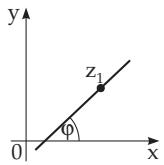
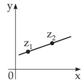
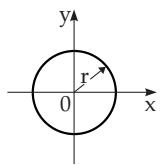
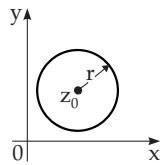
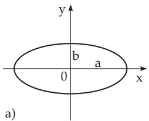
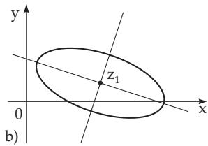
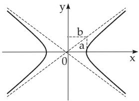
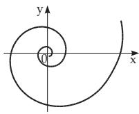

### 14.5 Algebraic and Elementary Transcendental Functions

#### 14.5.1 Algebraic Functions

1. Definition

A function which is the result of finitely many algebraic operations performed with z and maybe also with finitely many constants, is called an algebraic function. In general, a complex algebraic function w(z) can be defined in an implicit way as a polynomial, just as its real analogue

$$
a _ { 1 } z ^ { m _ { 1 } } w ^ { n _ { 1 } } + a _ { 2 } z ^ { m _ { 2 } } w ^ { n _ { 2 } } + \cdot \cdot \cdot + a _ { k } z ^ { m _ { k } } w ^ { n _ { k } } = 0 .\tag{14.63}
$$

It happens that w cannot be expressed explicitly.

2. Examples of Algebraic Functions

Linear function:

$$
w = a z + b .
$$

$$
\mathrm { I n v e r s e ~ f u n c t i o n : } \quad w = \frac { 1 } { z } .\tag{14.65}
$$

Quadratic function:

$$
w = z ^ { 2 } .
$$

$$
{ \mathrm { S q u a r e ~ r o o t ~ f u n c t i o n } } \colon \ w = { \sqrt { z ^ { 2 } - a ^ { 2 } } } .\tag{14.67}
$$

Fractional linear function:

$$
w = \frac { z + \mathrm { i } } { z - \mathrm { i } } .\tag{14.68}
$$

#### 14.5.2 Elementary Transcendental Functions

The complex transcendental functions have definitions corresponding to the transcendental real functions, just as in the case of the algebraic functions. For a detailed discussion of them see, e.g., [21.1] or [21.12].

1. Natural Exponential Function

$$
e ^ { z } = 1 + { \frac { z } { 1 ! } } + { \frac { z ^ { 2 } } { 2 ! } } + { \frac { z ^ { 3 } } { 3 ! } } + \cdot \cdot \cdot .\tag{14.69}
$$

The series is absolutely convergent in the whole z plane.

a) Pure imaginary exponent iy: This is valid according to the Euler relation (see 1.5.2.4, p. 36):

$$
e ^ { \mathrm { i } y } = \cos y + \mathrm { i } \sin y \quad \mathrm { w i t h } \quad e ^ { \pi \mathrm { i } } = - 1 .\tag{14.70}
$$

b) General case $z = x + \mathrm { i } y \mathrm { : }$

$$
e ^ { z } = e ^ { x + \mathrm { i } y } = e ^ { x } e ^ { \mathrm { i } y } = e ^ { x } ( \cos y + \mathrm { i } \sin y ) ,\tag{14.71a}
$$

$$
\operatorname { R e } { ( e ^ { z } ) } = e ^ { x } \cos y , \quad \operatorname { I m } { ( e ^ { z } ) } = e ^ { x } \sin y , \quad { \lvert e ^ { z } \rvert } = e ^ { x } , \quad \arg ( e ^ { z } ) = y .\tag{14.71b}
$$

The function $e ^ { z }$ is periodic, its period is 2π i: ez = ez+2kπ i (k = 0, 1. 2, . . .) .

(14.71c)

In particular: $e ^ { 0 } = e ^ { 2 k \pi \mathrm { i } } = 1 , \qquad e ^ { ( 2 k + 1 ) \pi \mathrm { i } } = - 1$

(14.71d)

c) Exponential form of a complex number (see 1.5.2.4, p. 36):

$$
a + \mathrm { i } b = \rho e ^ { \mathrm { i } \varphi } .\tag{14.72}
$$

d) Euler relation for complex numbers:

$$
e ^ { \mathrm { i } z } = \cos z + \mathrm { i } \sin z ,
$$

$$
\mathrm { ( 1 4 . 7 3 a ) }
$$

$$
e ^ { - \mathrm { i } z } = \cos z - \mathrm { i } \sin z .\tag{14.73b}
$$

2. Natural Logarithm

$$
w = \operatorname { L n } z , \quad { \mathrm { i f } } \quad z = e ^ { w } .\tag{14.74a}
$$

Since $z = \rho e ^ { \mathrm { i } \varphi } ;$ , one can write:

$$
\operatorname { L n } z = \ln \rho + \mathrm { i } \left( \varphi + 2 k \pi \right) \quad { \mathrm { a n d } }\tag{14.74b}
$$

$$
\mathrm { R e } \left( \mathrm { L n } z \right) = \ln \rho , \quad \mathrm { I m } \left( \mathrm { L n } z \right) = \varphi + 2 k \pi \qquad ( k = 0 , \pm 1 , \pm 2 , \ldots ) .\tag{14.74c}
$$

Since Ln z is a multiple-valued function (see 2.8.2, p. 86), we usually give only the principal value ofthe logarithm ln z:

$$
\ln z = \ln \rho + \mathrm { i } \varphi ( - \pi < \varphi \leq + \pi ) .\tag{14.74d}
$$

The function Ln z is defined for every complex number, except for $z = 0$

3. General Exponential Function

$$
a ^ { z } = e ^ { z \mathrm { L n } a } .\tag{14.75a}
$$

$a ^ { z } \left( a \neq 0 \right)$ is a multiple-valued function (see 2.8.2, p. 86) with principal value

$$
a ^ { z } = e ^ { z \ln a } .\tag{14.75b}
$$

4. Trigonometric Functions and Hyperbolic Functions

$$
\sin z = { \frac { e ^ { \mathrm { i } z } - e ^ { - \mathrm { i } z } } { 2 \mathrm { i } } } = z - { \frac { z ^ { 3 } } { 3 ! } } + { \frac { z ^ { 5 } } { 5 ! } } - \cdots ,\tag{14.76a}
$$

$$
\cos z = { \frac { e ^ { \mathrm { i } z } + e ^ { - \mathrm { i } z } } { 2 } } = 1 - { \frac { z ^ { 2 } } { 2 ! } } + { \frac { z ^ { 4 } } { 4 ! } } - \cdots ,\tag{14.76b}
$$

$$
\sinh z = { \frac { e ^ { z } - e ^ { - z } } { 2 } } = z + { \frac { z ^ { 3 } } { 3 ! } } + { \frac { z ^ { 5 } } { 5 ! } } + \cdots ,\tag{14.77a}
$$

$$
\cosh z = { \frac { e ^ { z } + e ^ { - z } } { 2 } } = 1 + { \frac { z ^ { 2 } } { 2 ! } } + { \frac { z ^ { 4 } } { 4 ! } } + \cdots .\tag{14.77b}
$$

All four series are convergent on the entire z plane and they are all periodic. The period of the functions (14.76a,b) is 2π, the period of the functions (14.77a,b) is 2π i.

The relations between these functions for any real or complex z are:

$$
\sin \mathrm { i } z = \mathrm { i } \sinh z ,
$$

(14.78a)

$$
\cos { \mathrm { i } z } = \cosh { z } ,\tag{14.78b}
$$

$$
\sinh { \mathrm { i } z } = \mathrm { i } \sin z ,
$$

(14.79a)

$$
\cosh \mathrm { i } z = \cos z .\tag{14.79b}
$$

The transformation formulas of the real trigonometric and hyperbolic functions (see 2.7.2, p. 81, and $2 . 9 . 3 , \mathrm { p . 9 1 } )$ are also valid for the complex functions. The values of the functions sin z, cos z, sinh z, and cosh z for the argument $z = x + \mathrm { i } y$ can be calculated with the help of the formulas sin(a + b), cos(a + b), sinh(a + b), and cosh(a + b) or by using the Euler relation (see 1.5.2.4, p. 36).

$$
\mid \cos ( x + \mathrm { i } y ) = \cos x \cos \mathrm { i } y - \sin x \sin \mathrm { i } y = \cos x \cosh y - \mathrm { i } \sin x \sinh y .\tag{14.80}
$$

Therefore:

$$
\operatorname { R e } { ( \cos z ) } = \cos \operatorname { R e } { ( z ) } \cosh { \operatorname { I m } { ( z ) } } ,\tag{14.81a}
$$

$$
\operatorname { I m } { \big ( } \cos z { \big ) } = - \sin \operatorname { R e } { \big ( } z { \big ) } \sinh \operatorname { I m } { \big ( } z { \big ) } .\tag{14.81b}
$$

The functions tan z, cot z, tanh z, and coth z are defined by the following formulas:

$$
\tan z = { \frac { \sin z } { \cos z } } , \quad \cot z = { \frac { \cos z } { \sin z } } , \qquad ( 1 4 . 8 2 \mathrm { a } ) \quad \operatorname { t a n h } z = { \frac { \sinh z } { \cosh z } } , \quad \coth z = { \frac { \cosh z } { \sinh z } } .\tag{14.82b}
$$

5. Inverse Trigonometric Functions and Inverse Hyperbolic Functions

These functions are many-valued functions, and one can express them with the help of the logarithm function:

$$
\operatorname { A r c s i n } z = - \mathrm { i } \operatorname { L n } { \big ( } \mathrm { i } z + { \sqrt { 1 - z ^ { 2 } } } { \big ) } , \qquad ( 1 4 . 8 3 \mathrm { a } ) \qquad \operatorname { A r s i n h } z = \operatorname { L n } { \big ( } z + { \sqrt { z ^ { 2 } + 1 } } { \big ) } ,\tag{14.83b}
$$

$$
\operatorname { A r c c o s } z = - \mathrm { i } \operatorname { L n } { \left( z + { \sqrt { z ^ { 2 } - 1 } } \right) } ,\tag{14.84a}
$$

$$
\operatorname { A r c o s h } z = \operatorname { L n } { \big ( } z + { \sqrt { z ^ { 2 } - 1 } } { \big ) } ,\tag{14.84b}
$$

$$
\mathrm { A r c t a n } z = { \frac { 1 } { 2 \mathrm { i } } } \mathrm { L n } { \frac { 1 + \mathrm { i } z } { 1 - \mathrm { i } z } } ,\tag{14.85a}
$$

$$
\operatorname { A r t a n h } z = { \frac { 1 } { 2 } } \mathrm { L n } { \frac { 1 + z } { 1 - z } } ,\tag{14.85b}
$$

$$
\operatorname { A r c c o t } z = - { \frac { 1 } { 2 \mathrm { i } } } \operatorname { L n } { \frac { \mathrm { i } z + 1 } { \mathrm { i } z - 1 } } ,
$$

(14.86a)

$$
\operatorname { A r c o t h } z = { \frac { 1 } { 2 } } \mathrm { L n } { \frac { z + 1 } { z - 1 } } .\tag{14.86b}
$$

The principal values of the inverse trigonometric and the inverse hyperbolic functions can be expressed by the same formulas using the principal value of the logarithm ln z:

$$
\arcsin z = - \mathrm { i } \ln ( \mathrm { i } z + { \sqrt { 1 - z ^ { 2 } } } ) ,
$$

(14.87a)

$$
\operatorname { a r s i n h } z = \ln ( z + { \sqrt { z ^ { 2 } + 1 } } ) ,\tag{14.87b}
$$

$$
\operatorname { a r c c o s } z = - \mathrm { i } \ln ( z + { \sqrt { z ^ { 2 } - 1 } } ) ,
$$

(14.88a)

$$
\arctan z = { \frac { 1 } { 2 \mathrm { i } } } \ln { \frac { 1 + \mathrm { i } z } { 1 - \mathrm { i } z } } ,\tag{14.88b}
$$

(14.89a)

$$
\operatorname { a r t a n h } z = { \frac { 1 } { 2 } } \ln { \frac { 1 + z } { 1 - z } } ,\tag{14.89b}
$$

$$
\operatorname { a r c c o t } z = - { \frac { 1 } { 2 \mathrm { i } } } \ln { \frac { \mathrm { i } z + 1 } { \mathrm { i } z - 1 } } ,
$$

(14.90a)

$$
\operatorname { a r c o t h } z = { \frac { 1 } { 2 } } \ln { \frac { z + 1 } { z - 1 } } .\tag{14.90b}
$$

6. Real and Imaginary Part of the Trigonometric and Hyperbolic Functions (See Table 14.1)

Table 14.1 Real and imaginary parts of the trigonometric and hyperbolic functions
<table><tr><td>Function  ${ \pmb w } = f ( { \pmb x } + \mathrm { i } { \pmb y } )$ </td><td>Real part Re (w)</td><td>Imaginary part Im (w)</td></tr><tr><td> $\sin ( x \pm \mathrm { i } y )$ </td><td>sin x cosh y</td><td> $\pm \cos x \sinh y$ </td></tr><tr><td> $\cos ( x \pm \mathrm { i } y )$ </td><td>cos x cosh y sin 2x</td><td> $\mp \sin x \sinh y$ </td></tr><tr><td> $\tan ( x \pm \mathrm { i } y )$ </td><td> $\cos 2 x + \cosh 2 y$ </td><td> $\pm \frac { \sinh 2 y } { \cos 2 x + \cosh 2 y }$ </td></tr><tr><td> $\sinh ( x \pm \mathrm { i } y )$   $\cosh ( x \pm \mathrm { i } y )$ </td><td>sinh x cos y</td><td> $\pm \cosh x \sin y$ </td></tr><tr><td></td><td>cosh x cos y sinh 2x</td><td> $\pm \sinh x \sin y$ </td></tr><tr><td> $\operatorname { t a n h } ( x \pm \mathrm { i } y )$ </td><td> $\overline { { \cosh { 2 x } + \cos { 2 y } } }$ </td><td> $\pm { \frac { \sin 2 y } { \cosh 2 x + \cos 2 y } }$ </td></tr></table>

7. Absolute Values and Arguments of the Trigonometric and Hyperbolic Functions (See Table 14.2)

Table 14.2 Absolute values and arguments of the trigonometric and hyperbolic functions

<table><tr><td>Function  ${ \pmb w } = { \pmb f } ( { \pmb x } + i { \pmb y } )$ </td><td>Absolute value |w|</td><td>Argument arg w</td></tr><tr><td> $\sin ( x \pm \mathrm { i } y )$ </td><td> $\sqrt { \sin ^ { 2 } x + \sinh ^ { 2 } y }$ </td><td> $\pm \arctan ( \cot x \operatorname { t a n h } y )$ </td></tr><tr><td> $\cos ( x \pm \mathrm { i } y )$ </td><td> $\sqrt { \cos ^ { 2 } x + \sinh ^ { 2 } y }$ </td><td> $\mp \arctan ( \tan x \operatorname { t a n h } y )$ </td></tr><tr><td> $\sinh ( x \pm \mathrm { i } y )$ </td><td> $\sqrt { \sinh ^ { 2 } x + \sin ^ { 2 } y }$ </td><td> $\pm \arctan ( \coth x \tan y )$ </td></tr><tr><td> $\cosh ( x \pm \mathrm { i } y )$ </td><td> $\sqrt { \sinh ^ { 2 } x + \cos ^ { 2 } y }$ </td><td> $\pm \arctan ( \operatorname { t a n h } x \tan y )$ </td></tr></table>

#### 14.5.3 Description of Curves in Complex Form

A complex function of one real variable t can be represented in parameter form:

$$
z = x ( t ) + \mathrm { i } y ( t ) = f ( t ) .\tag{14.91}
$$

As t changes, the points z draw a curve $z ( t )$ . Now, the equations and the corresponding graphical representations of the line, circle, hyperbola, ellipse, and logarithmic spiral are represented.

1. Straight Line

a) Line through a point $( z _ { 1 } , \varphi )$ (ϕ is the angle with the x-axis, Fig. 14.49a):

$$
z = z _ { 1 } + t e ^ { \mathrm { i } \varphi } .\tag{14.92a}
$$

b) Line through two points $z _ { 1 } , \ z _ { 2 }$ (Fig. 14.49b):

$$
z = z _ { 1 } + t ( z _ { 2 } - z _ { 1 } ) .\tag{14.92b}
$$

2. Circle

a) Circle with radius $r ,$ center at the point $z _ { 0 } = 0$ (Fig. 14.50a):

$$
z = r e ^ { \mathrm { i } t } \quad ( | z | = r ) .\tag{14.93a}
$$

b) Circle with radius r, center at the point $z _ { 0 }$ (Fig. 14.50b):

$$
z = z _ { 0 } + r e ^ { \mathrm { i } t } \quad ( | z - z _ { 0 } | = r ) .\tag{14.93b}
$$

  
a)

  
b)  
Figure 14.49

  
a)

  
b)  
Figure 14.50

3. Ellipse

a) Ellipse, Normal Form ${ \frac { x ^ { 2 } } { a ^ { 2 } } } + { \frac { y ^ { 2 } } { b ^ { 2 } } } = 1$ (Fig. 14.51a):

z = a cos t + ib sin t (14.94a) or $z = c e ^ { \mathrm { i } t } + d e ^ { - \mathrm { i } t }$ (14.94b) with $c = { \frac { a + b } { 2 } } , d = { \frac { a - b } { 2 } } ,$

(14.94c)

i.e., c and d are arbitrary real numbers.

b) Ellipse, General Form (Fig. 14.51b): The center is at $z _ { 1 }$ , the axes are rotated by an angle.

$$
z = z _ { 1 } + c e ^ { \mathrm { i } t } + d e ^ { - \mathrm { i } t } .
$$

Here c and d are arbitrary complex numbers, they determine the length of the axis of the ellipse and the angle of rotation.

(14.95)

  
Figure 14.51

  
Figure 14.52

4. Hyperbola, Normal Form ${ \frac { x ^ { 2 } } { a ^ { 2 } } } - { \frac { y ^ { 2 } } { b ^ { 2 } } } = 1 ( \mathbf { F i g . 1 4 . 5 2 } )$

$$
z = a \cosh t + \mathrm { i } b \sinh t\tag{14.96a}
$$

or

$$
z = c e ^ { t } + \bar { c } e ^ { - t } ,\tag{14.97}
$$

where c and $\bar { c }$ are conjugate complex numbers:

$$
c = \frac { a + \mathrm { i } b } 2 , \bar { c } = \frac { a - \mathrm { i } b } 2 .\tag{14.98}
$$

5. Logarithmic Spiral (Fig. 14.53):

$$
z = a e ^ { \mathrm { i } b t } ,\tag{14.99}
$$

where a and $b$ are arbitrary complex numbers.

  
Figure 14.53
