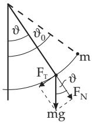
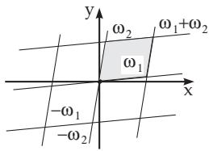
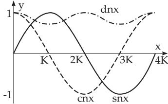

### 14.6 Elliptic Functions

#### 14.6.1 Relation to Elliptic Integrals

Integrals in the form (8.22) with integrands $R ( x , \sqrt { P ( x ) } )$ can not be integrated in closed form if $P ( x )$ is a polynomial of degree three or four, except in some special cases, but they are calculated numerically as elliptic integrals (see 8.1.4.3, p. 490). The inverse functions of elliptic integrals are the elliptic functions. They are similar to the trigonometric functions and they can be considered as their generalization. As an illustration the special case

$$
\int _ { 0 } ^ { u } ( 1 - t ^ { 2 } ) ^ { - { \frac { 1 } { 2 } } } d t = x \quad ( | u | \leq 1 ) .\tag{14.100}
$$

is considered.

a) There is a relation between the trigonometric function u = sin x and the principal value of its inverse function

$$
u = \sin x \Leftrightarrow x = \arcsin u \quad { \mathrm { f o r } } \quad - { \frac { \pi } { 2 } } \leq x \leq { \frac { \pi } { 2 } } , - 1 \leq u \leq 1 ,\tag{14.101}
$$

b) the integral (14.100) is equal to arcsin u. The sine function can be considered as the inverse function of the integral (14.100). Analogies are valid for the elliptic integrals.

The period of a mathematical pendulum, with mass m, hanging on a non-elastic weightless thread of length l (Fig. 14.54), can be calculated by a second-order non-linear diferential equation. This equation follows from the balance of the forces acting on the mass of the pendulum:

$$
{ \frac { d ^ { 2 } \vartheta } { d t ^ { 2 } } } + { \frac { g } { l } } \sin \vartheta = 0 \ \mathrm { w i t h } \ \vartheta ( 0 ) = \vartheta _ { 0 } , \ \dot { \vartheta } ( 0 ) = 0 \ \mathrm { o r } \ { \frac { d } { d t } } \left[ \left( { \frac { d \vartheta } { d t } } \right) ^ { 2 } \right] = 2 \frac { g } { l } { \frac { d } { d t } } ( \cos \vartheta ) .\tag{14.102a}
$$

The relation between the length l and the amplitude s from the normal position is $s = l \vartheta$ , so ${ \dot { s } } = l { \dot { \vartheta } }$ and $\ddot { s } = l \ddot { \vartheta }$ hold. The force acting on the mass is $F = m g$ , where $g$ is the acceleration due to gravity (see Table 21.2, p. 1053), and it is decomposed into a normal component $F _ { N }$ and a tangential component $F _ { T }$ with respect to its path (Fig. 14.54). The normal component $F _ { N } = m g \cos \vartheta$ is balanced by the thread stress. Since it is perpendicular to the direction of motion, it has no efect to the equation of motion. The tangential component $F _ { T }$ yields the acceleration of the motion. $F _ { T } = m \ddot { s } = m l \ddot { \vartheta } =$ $- m g$ sin ϑ. The tangential component always points in the direction of the normal position. By separation of variables follows:

$$
t - t _ { 0 } = \sqrt { \frac { l } { g } } \int _ { 0 } ^ { \vartheta } \frac { d \theta } { \sqrt { 2 ( \cos \theta - \cos \vartheta _ { 0 } ) } } .\tag{14.102b}
$$

Here, $t _ { 0 }$ denotes the time for which the pendulum is in the deepest position for the first time, i.e., where $\dot { \vartheta } ( t _ { 0 } ) = 0$ holds. Θ denotes the integration variable. After some transformations and with the substitutions sin ${ \frac { \Theta } { 2 } } = k$ sin ψ , $k = \sin \frac { \vartheta _ { 0 } } { 2 }$ follows

$$
t - t _ { 0 } = \sqrt { \frac { l } { g } } \int _ { 0 } ^ { \varphi } \frac { d \psi } { \sqrt { 1 - k ^ { 2 } \sin ^ { 2 } \psi } } = \sqrt { \frac { l } { g } } F ( k , \varphi ) .\tag{14.102c}
$$

Here $F ( k , \varphi )$ is an elliptic integral of the first kind (see (8.25a), p. 490). The angle of deflection $\vartheta = \vartheta ( t )$ is a periodic function of period 2T with

$$
T = \sqrt { \frac { l } { g } } F \left( k , { \frac { \pi } { 2 } } \right) = \sqrt { \frac { l } { g } } K ,\tag{14.102d}
$$

where K represents a complete elliptic integral of the first kind (Table 21.9, p. 1103). T denotes the period of the pendulum, i.e., the time between two consecutive extreme positions for which $\frac { d \vartheta } { d t } = 0$ . If the amplitude is small, i.e., sin $\vartheta \approx \vartheta$ , then $T = 2 \pi \sqrt { l / g }$ holds.

  
Figure 14.54

  
Figure 14.55

  
Figure 14.56

#### 14.6.2 Jacobian Functions

1. Definition

It follows for $0 < k < 1$ from the representation (8.24a) and (8.25a) (see 8.1.4.3, p. 490) for the elliptic integral of the first kind $F ( k , \varphi )$ that

$$
\frac { d F } { d \varphi } = ( 1 - k ^ { 2 } \sin ^ { 2 } \varphi ) ^ { - \frac { 1 } { 2 } } > 0 ,\tag{14.103}
$$

i.e., $F ( k , \varphi )$ is strictly monotone with respect to $\varphi _ { ; }$ , so the inverse function

$$
\varphi = \operatorname { a m } ( k , u ) = \varphi ( u )
$$

(14.104a)

$$
\mathrm { o f } \quad u = \int _ { 0 } ^ { \varphi } { \frac { d \psi } { \sqrt { 1 - k ^ { 2 } \sin ^ { 2 } \psi } } } = u ( \varphi )\tag{14.104b}
$$

exists. It is called the amplitude function. The so-called Jacobian functions are defined as:

snu = sin ϕ = sin am(k, u) (amplitude sine),

(14.105a)

$$
\mathrm { c n } u = \cos \varphi = \cos \mathrm { a m } ( k , u ) \mathrm { ( a m p l i t u d e \ c o s i n e ) } ,\tag{14.105b}
$$

$$
\mathrm { d n } u = \sqrt { 1 - k ^ { 2 } \mathrm { s n } ^ { 2 } u }
$$

(amplitude delta).

(14.105c)

2. Meromorphic and Double Periodic Functions

The Jacobian functions can be continued analytically in the z plane. The functions snz, cnz, and dnz are then meromorphic functions (see 14.3.5.2, p. 753), i.e., they have only poles as singularities. Besides,

they are double periodic: Each of these functions $f ( z )$ has exactly two periods $\omega _ { 1 }$ and $\omega _ { 2 }$ with

$$
f ( z + \omega _ { 1 } ) = f ( z ) , \quad f ( z + \omega _ { 2 } ) = f ( z ) .\tag{14.106}
$$

Here, $\omega _ { 1 }$ and $\omega _ { 2 }$ are two arbitrary complex numbers, whose ratio is not real. The general formula

$$
f ( z + m \omega _ { 1 } + n \omega _ { 2 } ) = f ( z )\tag{14.107}
$$

follows from (14.106), and here m and n are arbitrary integers. Meromorphic double periodic functions are called elliptic functions. The set

$$
\{ z _ { 0 } + \alpha _ { 1 } \omega _ { 1 } + \alpha _ { 2 } \omega _ { 2 } \colon 0 \leq \alpha _ { 1 } , \alpha _ { 2 } < 1 \} ,\tag{14.108}
$$

with an arbitrary fixed $z _ { 0 } \in \mathbb { C }$ , is called the period parallelogram of the elliptic function. If this function is bounded in the whole period parallelogram (Fig. 14.55), then it is a constant.

The Jacobian functions (14.105a) and (14.105b) are elliptic functions. The amplitude function (14.104a) is not an elliptic function.

3. Properties of the Jacobian functions

The properties of the Jacobian functions given in Table 14.3 can be got by the substitutions

$$
k ^ { \prime 2 } = 1 - k ^ { 2 } , \quad K ^ { \prime } = F \left( k ^ { \prime } , \frac { \pi } { 2 } \right) , \ : K = F \left( k , \frac { \pi } { 2 } \right) ,\tag{14.109}
$$

where m and n are arbitrary integers.

Table 14.3 Periods, roots and poles of Jacobian functions
<table><tr><td></td><td>Periods  $\omega _ { 1 } , \omega _ { 2 }$ </td><td>Roots</td><td>Poles</td></tr><tr><td>snz</td><td> $4 K , 2 \mathrm { i } K ^ { \prime }$ </td><td> $2 m K + 2 n \mathrm { i } K ^ { \prime }$ </td><td></td></tr><tr><td>cnz</td><td> $4 K , 2 ( K + \mathrm { i } K ^ { \prime } )$ </td><td> $( 2 m + 1 ) K + 2 n \mathrm { i } K ^ { \prime }$ </td><td> $\Biggr \} 2 m K + ( 2 n + 1 ) \mathrm { i } K ^ { \prime }$ </td></tr><tr><td>dnz</td><td> $2 K , 4 \mathrm { i } K ^ { \prime }$ </td><td> $( 2 m + 1 ) K + ( 2 n + 1 ) \mathrm { i } K ^ { \prime }$ </td><td></td></tr></table>

The shape of snz, cnz, and dnz can be found in Fig. 14.56. The following relations are valid for the Jacobian functions except at the poles:

$$
\mathbf { 1 } . \quad \mathrm { { s n } } ^ { 2 } z + \mathrm { { c n } } ^ { 2 } z = 1 , \quad k ^ { 2 } \mathrm { { s n } } ^ { 2 } z + \mathrm { { d n } } ^ { 2 } z = 1 ,\tag{14.110}
$$

$$
{ \bf 2 . } \quad \mathrm { } \mathrm { } \mathrm { } \mathrm { } \mathrm { } \mathrm { } \mathrm { } \mathrm { } \mathrm { } \mathrm { } \mathrm { } \mathrm { } \mathrm { } \mathrm { } \mathrm { } \mathrm { } \mathrm { } \mathrm { } \mathrm { } \mathrm { } \mathrm { } \mathrm { } \mathrm { } \mathrm { } \mathrm { } \mathrm { } \mathrm { } \mathrm { } \mathrm { } \mathrm { } \mathrm { } \mathrm { } \mathrm { } \mathrm { } \mathrm { } \mathrm { } \mathrm { } \mathrm { } \mathrm { } \mathrm { } \mathrm { } \mathrm { } \mathrm { } \mathrm { } \mathrm { } \mathrm { } \mathrm { } \mathrm { } \mathrm { } \mathrm { } \mathrm { } \mathrm { } \mathrm { } \mathrm { } \mathrm { } \mathrm { } \mathrm { } \mathrm { } \mathrm { } \mathrm { } \mathrm { } \mathrm { } \mathrm { } \mathrm { } \mathrm { } \mathrm { } \mathrm { } \mathrm { } \mathrm { } \mathrm { } \mathrm { } \mathrm { } \mathrm { } \mathrm { } \mathrm { } \mathrm { } \mathrm { } \mathrm { } \mathrm { } \mathrm { } \mathrm { } \mathrm { } \mathrm { } \mathrm { } \mathrm { } \mathrm { } \mathrm { } \mathrm { } \mathrm { } \mathrm { } \mathrm { } \mathrm { } \mathrm { } \mathrm { } \mathrm { } \mathrm { } \mathrm { } \mathrm { } \mathrm { } \mathrm { } \mathrm { } \mathrm { } \mathrm { } \mathrm { } \mathrm { } \mathrm { } \mathrm { } \mathrm { } \mathrm { } \mathrm { } \mathrm { } \mathrm { } \mathrm { } \mathrm { } \mathrm { } \mathrm { } \mathrm { } \mathrm { } \mathrm { } \mathrm { } \mathrm { } \mathrm { } \mathrm { } \mathrm { } \mathrm { } \mathrm { } \mathrm { } \mathrm { } \mathrm { } \mathrm { } \mathrm { } \mathrm { } \mathrm { } \mathrm { } \mathrm { } \mathrm { } \mathrm { } \mathrm { } \mathrm { } \mathrm { } \mathrm { } \mathrm { } \mathrm { } \mathrm { } \mathrm { } \mathrm { } \mathrm { } \mathrm { } \mathrm { } \mathrm { } \mathrm { } \mathrm { } \mathrm { } \mathrm { } \mathrm { } \mathrm { } \mathrm { } \mathrm { } \mathrm { } \mathrm { } \mathrm { } \mathrm { } \mathrm\tag{14.111a}
$$

$$
\mathrm { c n } ( u + v ) = \frac { ( \mathrm { c n } u ) ( \mathrm { c n } v ) - ( \mathrm { s n } u ) ( \mathrm { d n } u ) ( \mathrm { s n } v ) ( \mathrm { d n } v ) } { 1 - k ^ { 2 } ( \mathrm { s n } ^ { 2 } u ) ( \mathrm { s n } ^ { 2 } v ) } ,\tag{14.111b}
$$

$$
\mathrm { d n } ( u + v ) = \frac { ( \mathrm { d n } u ) ( \mathrm { d n } v ) - k ^ { 2 } ( \mathrm { s n } u ) ( \mathrm { c n } u ) ( \mathrm { s n } v ) ( \mathrm { c n } v ) } { 1 - k ^ { 2 } ( \mathrm { s n } ^ { 2 } u ) ( \mathrm { s n } ^ { 2 } v ) } ,\tag{14.111c}
$$

$$
3 . \quad ( \mathrm { s n } z ) ^ { \prime } = ( \mathrm { c n } z ) ( \mathrm { d n } z ) , \qquad \quad ( \mathrm { 1 4 . 1 1 2 a } ) \qquad \quad ( \mathrm { c n } z ) ^ { \prime } = - ( \mathrm { s n } z ) ( \mathrm { d n } z ) , \qquad \quad\tag{14.112b}
$$

$$
( \mathrm { d n } z ) ^ { \prime } = - k ^ { 2 } ( \mathrm { s n } z ) ( \mathrm { c n } z ) .\tag{14.112c}
$$

For further properties of the Jacobian functions and further elliptic functions see [14.8], [14.12].

#### 14.6.3 Theta Functions

The theta functions can be used to evaluate the Jacobian functions:

$$
\vartheta _ { 1 } ( z , q ) = 2 q ^ { \frac { 1 } { 4 } } \sum _ { n = 0 } ^ { \infty } ( - 1 ) ^ { n } q ^ { n ( n + 1 ) } \sin ( 2 n + 1 ) z ,\tag{14.113a}
$$

$$
\vartheta _ { 2 } ( z , q ) = 2 q ^ { \frac { 1 } { 4 } } \sum _ { n = 0 } ^ { \infty } q ^ { n ( n + 1 ) } \cos ( 2 n + 1 ) z ,\tag{14.113b}
$$

$$
\vartheta _ { 3 } ( z , q ) = 1 + 2 \sum _ { n = 1 } ^ { \infty } q ^ { n ^ { 2 } } \cos 2 n z ,\tag{14.113c}
$$

$$
\vartheta _ { 4 } ( z , q ) = 1 + 2 \sum _ { n = 1 } ^ { \infty } ( - 1 ) ^ { n } q ^ { n ^ { 2 } } \cos 2 n z .\tag{14.113d}
$$

$\mathrm { I f } \ | q | \ < \ 1$ (q complex) holds, then the series (14.113a)–(14.113d) are convergent for every complex argument z. In the case of a constant q one uses the following brief notations:

$$
\vartheta _ { k } ( z ) : = \vartheta _ { k } ( \pi z , q ) \quad ( k = 1 , 2 , 3 , 4 ) .\tag{14.114}
$$

Then, the Jacobian functions have the representations:

$$
\mathrm { s n } z = 2 K \frac { \vartheta _ { 4 } ( 0 ) } { \vartheta _ { 1 } ^ { \prime } ( 0 ) } \frac { \vartheta _ { 1 } \left( \frac { z } { 2 K } \right) } { \vartheta _ { 4 } \left( \displaystyle \frac { z } { 2 K } \right) } , \quad \mathrm { ( 1 4 . 1 1 5 a ) } \quad \qquad \mathrm { c n } z = \frac { \vartheta _ { 4 } ( 0 ) } { \vartheta _ { 2 } ( 0 ) } \frac { \vartheta _ { 2 } \left( \displaystyle \frac { z } { 2 K } \right) } { \vartheta _ { 4 } \left( \displaystyle \frac { z } { 2 K } \right) } ,\tag{14.115b}
$$

$$
\mathrm { d n } z = \frac { \vartheta _ { 4 } ( 0 ) } { \vartheta _ { 3 } ( 0 ) } \frac { \vartheta _ { 3 } \left( \displaystyle \frac { z } { 2 K } \right) } { \vartheta _ { 4 } \left( \displaystyle \frac { z } { 2 K } \right) } ,
$$

(14.115c)

$$
\mathrm { w i t h } q = \exp \left( - \pi \frac { K ^ { \prime } } { K } \right) , k = \left( \frac { \vartheta _ { 2 } ( 0 ) } { \vartheta _ { 3 } ( 0 ) } \right) ^ { 2 }\tag{14.115d}
$$

and $K , K ^ { \prime }$ are as in (14.109).

#### 14.6.4 Weierstrass Functions

The functions

$$
\wp ( z ) = \wp ( z , \omega _ { 1 } , \omega _ { 2 } ) , \qquad ( { \mathrm { 1 4 . 1 1 6 a } } )
$$

$$
\zeta ( z ) = \zeta ( z , \omega _ { 1 } , \omega _ { 2 } ) ,\tag{14.116b}
$$

$$
\sigma ( z ) = \sigma ( z , \omega _ { 1 } , \omega _ { 2 } ) ,\tag{14.116c}
$$

were introduced by Weierstrass, and here $\omega _ { 1 }$ and $\omega _ { 2 }$ represent two arbitrary complex numbers whose quotient is not real. One substitutes

$$
\omega _ { m n } = 2 ( m \omega _ { 1 } + n \omega _ { 2 } ) ,\tag{14.117a}
$$

where m and n are arbitrary real numbers, and defines

$$
\wp ( z , \omega _ { 1 } , \omega _ { 2 } ) = z ^ { - 2 } + \sum _ { m , n } { } ^ { \prime } \left[ ( z - \omega _ { m n } ) ^ { - 2 } - \omega _ { m n } ^ { - 2 } \right] .\tag{14.117b}
$$

The accent behind the sum sign denotes that the value pair $m = n = 0$ is omitted. The function $\wp ( z , \omega _ { 1 } , \omega _ { 2 } )$ has the following properties:

1. It is an elliptic function with periods $\omega _ { 1 }$ and $\omega _ { 2 }$

2. The series (14.117b) is convergent for every $z \neq \omega _ { m n }$

3. The function $\wp ( z , \omega _ { 1 } , \omega _ { 2 } )$ satisfies the diferential equation

$$
\boldsymbol { \wp } ^ { \prime 2 } = 4 \wp ^ { 3 } - g _ { 2 } \boldsymbol { \wp } - g _ { 3 } \quad ( 1 4 . 1 1 8 \mathrm { a } ) \qquad \mathrm { w i t h } \ g _ { 2 } = 6 0 \sum _ { m , n } { \sp \prime } \boldsymbol { \omega } _ { m n } ^ { - 4 } , \quad g _ { 3 } = 1 4 0 \sum _ { m , n } { \sp \prime } \boldsymbol { \omega } _ { m n } ^ { - 6 } .\tag{14.118b}
$$

The quantities $g _ { 2 }$ and $g _ { 3 }$ are called the invariants of $\wp ( z , \omega _ { 1 } , \omega _ { 2 } )$

4. The function $u = \wp ( z , \omega _ { 1 } , \omega _ { 2 } )$ is the inverse function of the integral

$$
z = \int _ { u } ^ { \infty } { \frac { d t } { \sqrt { 4 t ^ { 3 } - g _ { 2 } t - g _ { 3 } } } } .\tag{14.119}
$$

$$
\wp ( u + v ) = { \frac { 1 } { 4 } } \left[ { \frac { \wp ^ { \prime } ( u ) - \wp ^ { \prime } ( v ) } { \wp ( u ) - \wp ( v ) } } \right] ^ { 2 } - \wp ( u ) - \wp ( v ) .\tag{14.120}
$$

The Weierstrass functions

$$
\zeta ( z ) = z ^ { - 1 } + \sum _ { m , n } { } ^ { \prime } \left[ ( z - \omega _ { m n } ) ^ { - 1 } + \omega _ { m n } ^ { - 1 } + \omega _ { m n } ^ { - 2 } z \right] ,\tag{14.121a}
$$

$$
\sigma ( z ) = z \mathrm { e x p } \left( \int _ { 0 } ^ { z } \left[ \zeta ( t ) - t ^ { - 1 } \right] d t \right) = z \prod _ { m , n } { } ^ { \prime } \left( 1 - { \frac { z } { \omega _ { m n } } } \right) \mathrm { e x p } \left( { \frac { z } { \omega _ { m n } } } + { \frac { z ^ { 2 } } { 2 \omega _ { m n } ^ { 2 } } } \right)\tag{14.121b}
$$

are not double periodic, so they are not elliptic functions. The following relations are valid:

$$
{ \bf 1 . } \qquad \zeta ^ { \prime } ( z ) = - \wp ( z ) , \zeta ( z ) = \left( \ln \sigma ( z ) \right) ,\tag{14.122}
$$

$$
2 . \qquad \zeta ( - z ) = - \zeta ( z ) , \sigma ( - z ) = - \sigma ( z ) ,\tag{14.123}
$$

$$
{ \bf 3 . } \qquad \zeta ( z + 2 \omega _ { 1 } ) = \zeta ( z ) + 2 \zeta ( \omega _ { 1 } ) , \quad \zeta ( z + 2 \omega _ { 2 } ) = \zeta ( z ) + 2 \zeta ( \omega _ { 2 } ) ,\tag{14.124}
$$

$$
4 . \qquad \zeta ( u + v ) = \zeta ( u ) + \zeta ( v ) + { \frac { 1 } { 2 } } { \frac { \wp ^ { \prime } ( u ) - \wp ^ { \prime } ( v ) } { \wp ( u ) - \wp ( v ) } } .\tag{14.125}
$$

5. Every elliptic function is a rational function of the Weierstrass functions $\wp ( z )$ and $\zeta ( z )$
