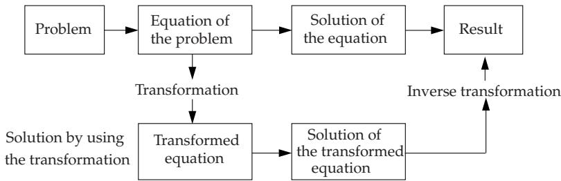

### 15.1 Notion of Integral Transformation

#### 15.1.1 General Definition of Integral Transformations

AnIntegral transformation is a correspondence between two functions $f ( t )$ and $F ( p )$ in the form

$$
F ( p ) = \int _ { - \infty } ^ { + \infty } K ( p , t ) f ( t ) d t .\tag{15.1a}
$$

The function $f ( t )$ is called the original function, its domain is the original space. The function $F ( p )$ is called the transform, its domain is the image space.

The function $K ( p , t )$ is called the kernel of the transformation. In general, t is a real variable, and $p = \sigma +$ iω is a complex variable.

The shorter notation can be used by introducing the symbol $\tau$ for the integral transformation with kernel $K ( p , t )$

$$
F ( p ) = T \{ f ( t ) \} .\tag{15.1b}
$$

Then, (15.1b) is called transformation.

#### 15.1.2 Special Integral Transformations

Diferent kernels $K ( p , t )$ and diferent original spaces yield diferent integral transformations. The most widely known transformations are the Laplace transformation, the Laplace-Carson transformation, and the Fourier transformation. In this book an overview is given about the integral transformations of functions of one variable (see also Table 15.1). More recently, some additional transformations have been introduced for use in pattern recognition and in characterizing signals, such as the Wavelet transformation, the Gabor transformation and the Walsh transformation (see 15.6, p. 800f.).

#### 15.1.3 Inverse Transformations

The inverse transformation of a transform into the original function has special importance in applications. With the symbol $\scriptstyle { \mathcal { T } } ^ { - 1 }$ the inverse integral transformation of (15.1a) is

$$
f ( t ) = { \mathcal { T } } ^ { - 1 } \{ F ( p ) \} .\tag{15.2a}
$$

The operator $\tau ^ { - 1 }$ is called the inverse operator of  , so

$$
{ \mathcal { T } } ^ { - 1 } \{ { \mathcal { T } } \{ f ( t ) \} \} = f ( t ) .\tag{15.2b}
$$

The determination of the inverse transformation means the solution of the integral equation (15.1a), where the function $F ( p )$ is given and function $f ( t )$ is to be determined. If there is a solution, then it can be written in the form

$$
f ( t ) = { \mathcal { T } } ^ { - 1 } \{ F ( p ) \} .\tag{15.2c}
$$

The explicit determination of inverse operators for diferent integral transformations, i.e., for diferent kernels $K ( p , t )$ , belongs to the fundamental problems of the theory of integral transformations. The user can solve practical problems by using the given correspondences between transforms and original functions in the corresponding tables (Table 21.13, p. 1109, Table 21.14, p. 1114, and Table 21.15, p. 1128).

#### 15.1.4 Linearity of Integral Transformations

If $f _ { 1 } ( t )$ and $f _ { 2 } ( t )$ are transformable functions, then

$$
{ \mathcal { T } } \{ k _ { 1 } f _ { 1 } ( t ) + k _ { 2 } f _ { 2 } ( t ) \} = k _ { 1 } { \mathcal { T } } \{ f _ { 1 } ( t ) \} + k _ { 2 } { \mathcal { T } } \{ f _ { 2 } ( t ) \} ,\tag{15.3}
$$

where $k _ { 1 }$ and $k _ { 2 }$ are arbitrary numbers. That is, an integral transformation represents a linear operation on the set $T$ of the -transformable functions.

\- Springer-Verlag Berlin Heidelberg 2015 I.N. Bronshtein et al., Handbook of Mathematics, DOI 10.1007/978-3-662-46221-8\_15

Table 15.1 Overview of integral transformations of functions of one variable
<table><tr><td rowspan=1 colspan=1>Transformation</td><td rowspan=1 colspan=1>Kernel $K ( p , t )$ </td><td rowspan=1 colspan=1>Symbol</td><td rowspan=1 colspan=1>Remark</td></tr><tr><td rowspan=1 colspan=1>Laplacetransformation</td><td rowspan=1 colspan=1> $\displaystyle { \left\{ \begin{array} { l l } { 0 } & { { \mathrm { f o r } } t < 0 } \\ { e ^ { - p t } { \mathrm { f o r } } t > 0 } \end{array} \right. }$ </td><td rowspan=1 colspan=1> ${ \overline { { \mathcal { L } \{ f ( t ) \} } } } = \int _ { 0 } ^ { \infty } e ^ { - p t } f ( t ) d t$ </td><td rowspan=1 colspan=1> $| p = \sigma + \mathrm { i } \omega$ </td></tr><tr><td rowspan=1 colspan=1>Two-sidedLaplacetransformation</td><td rowspan=1 colspan=1> $e ^ { - p t }$ </td><td rowspan=1 colspan=1> $\mathcal { L } _ { \mathrm { I I } } \{ f ( t ) \} = \int _ { - \infty } ^ { + \infty } e ^ { - p t } f ( t ) d t$ </td><td rowspan=1 colspan=1> $\overline { { { \mathscr { L } } _ { \mathrm { I I } } \{ f ( t ) I ( t ) \} } } = \mathcal { L } \{ f ( t ) \}$ where $1 ( t ) = \left\{ \begin{array} { l l } { 0 \ \mathrm { f o r } \ t < 0 } \\ { 1 \ \mathrm { f o r } \ t > 0 } \end{array} \right.$ </td></tr><tr><td rowspan=1 colspan=1>FiniteLaplacetransformation</td><td rowspan=1 colspan=1> $\left\{ \begin{array} { l l } { 0 } & { { \mathrm { f o r ~ } } t < 0 } \\ { e ^ { - p t } { \mathrm { ~ f o r ~ } } 0 < t < a } \\ { 0 } & { { \mathrm { f o r ~ } } t > a } \end{array} \right.$ </td><td rowspan=1 colspan=1> $\mathcal { L } _ { a } \{ f ( t ) \} = \intop _ { 0 } ^ { a } e ^ { - p t } f ( t ) d t$ </td><td rowspan=1 colspan=1></td></tr><tr><td rowspan=1 colspan=1>Laplace-Carsontransformation</td><td rowspan=1 colspan=1> $\left\{ { \begin{array} { l } { 0 } & { { \mathrm { f o r } } \ t < 0 } \\ { p e ^ { - p t } { \mathrm { f o r } } \ t > 0 } \end{array} } \right.$ </td><td rowspan=1 colspan=1> $\mathcal { C } \{ f ( t ) \} = \intop _ { 0 } ^ { \infty } p e ^ { - p t } f ( t ) d t$ </td><td rowspan=1 colspan=1>The Carson transforma-tion can also be a two-sided and finite transfor-mation.</td></tr><tr><td rowspan=1 colspan=1>Fouriertransformation</td><td rowspan=1 colspan=1> $e ^ { - \mathrm { i } \omega t }$ </td><td rowspan=1 colspan=1> $\overline { { \mathcal { F } \{ f ( t ) \} } } = \int _ { - \infty } ^ { + \infty } e ^ { - \mathrm { i } \omega t } f ( t ) d t$ </td><td rowspan=1 colspan=1> $p = \sigma + \mathrm { i } \omega$     $\sigma = 0$ </td></tr><tr><td rowspan=1 colspan=1>One-sidedFouriertransformation</td><td rowspan=1 colspan=1> $\left\{ { \begin{array} { l } { 0 \qquad { \mathrm { f o r } } \ t < 0 } \\ { e ^ { - { \mathrm { i } } \omega t } \ { \mathrm { f o r } } \ t > 0 } \end{array} } \right.$ </td><td rowspan=1 colspan=1> $\mathcal { F } _ { \mathrm { I } } \{ f ( t ) \} = \intop _ { 0 } ^ { \infty } e ^ { - \mathrm { i } \omega t } f ( t ) d t$ </td><td rowspan=1 colspan=1> $p = \sigma + \mathrm { i } \omega$     $\sigma = 0$ </td></tr><tr><td rowspan=1 colspan=1>FiniteFouriertransformation</td><td rowspan=1 colspan=1> $\left\{ \begin{array} { l l } { 0 } & { \mathrm { f o r } t < 0 } \\ { e ^ { - \mathrm { i } \omega t } \mathrm { f o r } 0 < t < a } \\ { 0 } & { \mathrm { f o r } t > a } \end{array} \right.$ </td><td rowspan=1 colspan=1> $\mathcal { F } _ { a } \{ f ( t ) \} = \intop _ { 0 } ^ { a } e ^ { - \mathrm { i } \omega t } f ( t ) d t$ </td><td rowspan=1 colspan=1> $| p = \sigma + \mathrm { i } \omega$     $\sigma = 0$ </td></tr><tr><td rowspan=1 colspan=1>Fourier cosinetransformation</td><td rowspan=1 colspan=1> $\left\{ \begin{array} { l l } { 0 } & { { \mathrm { f o r } } t < 0 } \\ { \operatorname { R e } [ e ^ { \mathrm { i } \omega t } ] { \mathrm { f o r } } t > 0 } \end{array} \right.$ </td><td rowspan=1 colspan=1> $\mathcal { F } _ { c } \{ f ( t ) \} = \intop _ { 0 } ^ { \infty } f ( t ) \cos \omega t d t$ </td><td rowspan=1 colspan=1> $p = \sigma + \mathrm { i } \omega$     $\sigma = 0$ </td></tr><tr><td rowspan=1 colspan=1>Fourier sinetransformation</td><td rowspan=1 colspan=1> $\left\{ \begin{array} { l l } { 0 } & { { \mathrm { f o r } } \ t < 0 } \\ { \operatorname { I m } \left[ e ^ { \mathrm { i } \omega t } \right] { \mathrm { f o r } } \ t > 0 } \end{array} \right.$ </td><td rowspan=1 colspan=1> $\mathcal { F } _ { s } \{ f ( t ) \} = \intop _ { 0 } ^ { \infty } f ( t ) \sin \omega t d t$ </td><td rowspan=1 colspan=1> $p = \sigma + \mathrm { i } \omega$     $\sigma = 0$ </td></tr><tr><td rowspan=1 colspan=1>Mellintransformation</td><td rowspan=1 colspan=1> $\left\{ { \begin{array} { l } { 0 } \\ { t ^ { p - 1 } { \mathrm { f o r } } t > 0 } \end{array} } \right.$ </td><td rowspan=1 colspan=1> $\mathcal { M } \{ f ( t ) \} = \intop _ { 0 } ^ { \infty } t ^ { p - 1 } f ( t ) d t$ </td><td rowspan=1 colspan=1></td></tr><tr><td rowspan=1 colspan=1>Hankeltransformationof order ν</td><td rowspan=1 colspan=1> $\left\{ \begin{array} { l l } { { 0 } } & { { \mathrm { f o r } ~ t < 0 } } \\ { { t J _ { \nu } ( \sigma t ) } } & { { \mathrm { f o r } ~ t > 0 } } \end{array} \right.$ </td><td rowspan=1 colspan=1> $\mathcal { H } _ { \nu } \{ f ( t ) \} = \intop _ { 0 } ^ { \infty } t J _ { \nu } ( \sigma t ) f ( t ) d t$ </td><td rowspan=1 colspan=1> $p = \sigma + \mathrm { i } \omega \quad \omega = 0$ Jν(σt) is the ν-th or-der Bessel function of thefirst kind.</td></tr><tr><td rowspan=1 colspan=1>Stieltjestransformation</td><td rowspan=1 colspan=1> $\left\{ { \begin{array} { l } { 0 \qquad { \mathrm { f o r } } \ t < 0 } \\ { \displaystyle { \frac { 1 } { p + t } } \ { \mathrm { f o r } } \ t > 0 } \end{array} } \right.$ </td><td rowspan=1 colspan=1> ${ \cal { S } } \{ f ( t ) \} = \int _ { 0 } ^ { \infty } { \frac { f ( t ) } { p + t } } d t$ </td><td rowspan=1 colspan=1></td></tr></table>

#### 15.1.5 Integral Transformations for Functions of Several Variables

Integral transformations for functions of several variables are also called multiple integral transformations (see [15.13]). The best-known ones are the double Laplace transformation, i.e., the Laplace transformation for functions of two variables, the double Laplace-Carson transformation and the double Fourier transformation. The definition of the double Laplace transformation is

$$
F ( p , q ) = { \mathcal { L } } ^ { 2 } \{ f ( x , y ) \} \equiv \int _ { x = 0 } ^ { \infty } \int _ { y = 0 } ^ { \infty } e ^ { - p x - q y } f ( x , y ) d x d y .\tag{15.4}
$$

The symbol $\mathcal { L }$ denotes the Laplace transformation for functions of one variable (see Table 15.1).

#### 15.1.6 Applications of Integral Transformations

1. Fields of Applications

Besides the great theoretical importance that integral transformations have in such basic fields of mathematics as the theory of integral equations and the theory of linear operators, they have a large field of applications in the solutions of practical problems in physics and engineering. Methods with applications of integral transformations are often called operator methods. They are suitable to solve ordinary and partial diferential equations, integral equations and diference equations.

2. Scheme of the Operator Method

The general scheme to the use of an operator method with an integral transformation is represented in Fig. 15.1. One gets the solution of a problem not directly from the original defining equation; first an integral transformation is applied. The inverse transformation of the solution of the transformed equation gives the solution of the original problem.

  
Figure 15.1

The application of the operator method to solve ordinary diferential equations consists of the following three steps:

1. Transition from a diferential equation of an unknown function to an equation of its transform.

2. Solution of the transformed equation in the image space. The transformed equation is usually no longer a diferential equation, but an algebraic equation.

3. Inverse transformation of the transform with help of $\tau ^ { - 1 }$ into the original space, i.e., determination of the solution of the original problem.

The major dificulty of the operator method is usually not the solution of the transformed equation, but the transformation of the function and the inverse transformation.
