#### 15.2.1 Properties of the Laplace Transformation

##### 15.2.1.1 Laplace Transformation, Original and Image Space

1. Definition of the Laplace Transformation

The Laplace transformation

$$
{ \mathcal { L } } \{ f ( t ) \} = \int _ { 0 } ^ { \infty } e ^ { - p t } f ( t ) d t = F ( p )\tag{15.5}
$$

assigns a function $F ( p )$ of a complex variable p to a function $f ( t )$ of $^ \mathrm { a }$ real variable t, if the given improper integral exists. $f ( t )$ is called the original function, $F ( p )$ is called the transform of $f ( t )$ . In the further discussion it is assumed that the improper integral exists if the original function $\dot { f } ( t )$ is piecewise smooth in its domain $t \geq 0$ , in the so called original space, and for $t \overset { \cdot } {  } \infty , | f ( t ) | \leq K e ^ { \alpha t }$ holds with certain constants $K > 0 , \alpha > 0$ . The domain of the transform $F ( p )$ is called the image space.

In the literature the Laplace transformation is often found also in the Wagner or Laplace-Carson form

$$
{ \mathcal { L } } _ { W } \{ f ( t ) \} = p \intop _ { 0 } ^ { \infty } e ^ { - p t } f ( t ) d t = p F ( p ) .\tag{15.6}
$$

2. Convergence

The Laplace integral $\mathcal { L } \{ f ( t ) \}$ converges in the half-plane Re $p > \alpha$ (Fig. 15.2). The transform $F ( p )$ is an analytic function with the properties:

$$
\mathbf { 1 . } \operatorname* { l i m } _ { \mathrm { R e } p \to \infty } F ( p ) = 0 .\tag{15.7a}
$$

This property is a necessary condition for $F ( p )$ to be a transform.

$$
2 . \qquad \operatorname* { l i m } _ { \stackrel { p \to 0 } { ( p \to \infty ) } } p F ( p ) = A ,\tag{15.7b}
$$

if the original function $f ( t )$ has a finite limit $\operatorname* { l i m } _ { t  \infty \atop ( t  0 ) } f ( t ) = A .$

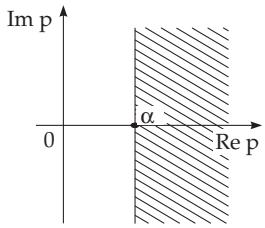  
Figure 15.2

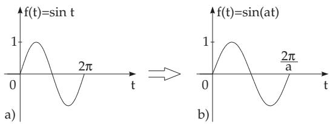  
Figure 15.3

3. Inverse Laplace Transformation

One can retrieve the original function from the transform with the formula

$$
{ \mathcal { L } } ^ { - 1 } \{ F ( p ) \} = { \frac { 1 } { 2 \pi \mathrm { i } } } \int _ { c - \mathrm { i } \infty } ^ { c + \mathrm { i } \infty } e ^ { p t } F ( p ) d p = { \left\{ \begin{array} { l l } { f ( t ) } & { { \mathrm { ~ f o r ~ } } t > 0 , } \\ { 0 } & { { \mathrm { ~ f o r ~ } } t < 0 . } \end{array} \right. }\tag{15.8}
$$

The path of integration of this complex integral is a line Re ${ \mathrm { : } } p = c$ parallel to the imaginary axis, where Re $p = c > \alpha$ . If the function $f ( t )$ has a jump at $t = 0$ , i.e., $\operatorname* { l i m } _ { t \to + 0 } f ( t ) \neq 0$ , then the integral has the value ${ \frac { 1 } { 2 } } f ( + 0 )$ there.

##### 15.2.1.2 Rules for the Evaluation of the Laplace Transformation

The rules for evaluation are the mappings of operations in the original domain into operations in the transform space.

Hereafter the original functions will be denoted by lowercase letters, the transforms are denoted by the corresponding capital letters.

1. Addition or Linearity Law

The Laplace transform of a linear combination of functions is the same linear combination of the Laplace transforms, if they exist. With constants $\lambda _ { 1 } , \ldots , \lambda _ { n }$ that is

$$
{ \mathcal { L } } \{ \lambda _ { 1 } f _ { 1 } ( t ) + \lambda _ { 2 } f _ { 2 } ( t ) + \cdot \cdot \cdot + \lambda _ { n } f _ { n } ( t ) \} = \lambda _ { 1 } F _ { 1 } ( p ) + \lambda _ { 2 } F _ { 2 } ( p ) + \cdot \cdot \cdot + \lambda _ { n } F _ { n } ( p ) .\tag{15.9}
$$

2. Similarity Laws

The Laplace transform of $f ( a t ) ~ ( a > 0$ , a real) is the Laplace transform of the original function divided by a and with the argument $p / a \colon$

$$
{ \mathcal { L } } \{ f ( a t ) \} = { \frac { 1 } { a } } F \left( { \frac { p } { a } } \right) \quad ( a > 0 , \operatorname { r e a l } ) .\tag{15.10a}
$$

Analogously for the inverse transformation

$$
{ \mathcal { L } } ^ { - 1 } \{ F ( a p ) \} = { \frac { 1 } { a } } f \left( { \frac { t } { a } } \right) \quad ( a > 0 ) .\tag{15.10b}
$$

Fig. 15.3 shows the application of the similarity laws for a sine function.

Determination of the Laplace transform of $f ( t ) = \sin ( \omega t )$ . The transform of the sine function is ${ \mathcal { L } } \{ \sin ( t ) \} = F ( p ) = 1 / ( p ^ { 2 } + 1 )$ . Application of the similarity law gives ${ \mathcal { L } } \{ \sin ( \omega t ) \} = { \frac { 1 } { \omega } } F ( p / \omega ) =$ $\frac { 1 } { \omega } \frac { 1 } { ( p / \omega ) ^ { 2 } + 1 } = \frac { \omega } { p ^ { 2 } + \omega ^ { 2 } } .$

3. Translation Laws

1. Shifting to the Right The Laplace transform of an original function shifted to the right by a $( a > 0 )$ is equal to the Laplace transform of the non-shifted original function multiplied by the factor $e ^ { - a p }$

$$
{ \mathcal { L } } \{ f ( t - a ) \} = e ^ { - a p } F ( p ) .\tag{15.11a}
$$

2. Shifting to the Left The Laplace transform of an original function shifted to the left by a is equal to $e ^ { a p }$ multiplied by the diference of the transform of the non-shifted function and the integral $\textstyle \int _ { 0 } ^ { \hat { a } } f ( t ) e ^ { - p t } d t$

$$
{ \mathcal { L } } \{ f ( t + a ) \} = e ^ { a p } \left[ F ( p ) - \intop _ { 0 } ^ { a } e ^ { - p t } f ( t ) d t \right] .\tag{15.11b}
$$

Figs. 15.4 and 15.5 show the cosine function shifted to the right and a line shifted to the left.

4. Frequency Shift Theorem

The Laplace transform of an original function multiplied by $e ^ { - b t }$ is equal to the Laplace transform with the argument $p + b$ ( b is an arbitrary complex number):

$$
{ \mathcal { L } } \{ e ^ { - b t } f ( t ) \} = F ( p + b ) .\tag{15.12}
$$

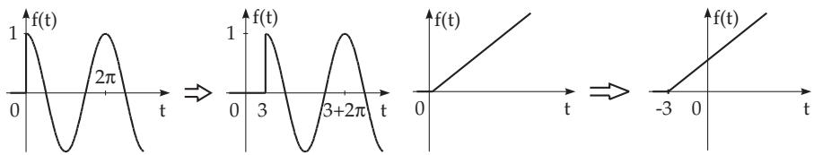  
Figure 15.4  
Figure 15.5

5. Diferentiation in the Original Space

If the derivatives $f ^ { \prime } ( t ) , f ^ { \prime \prime } ( t ) , \ldots , f ^ { ( n ) } ( t )$ exist for $t > 0$ and the highest derivative of $f ( t )$ has a transform, then the lower derivatives of $f ( t )$ and also $f ( t )$ have a transform, and:

$$
\begin{array} { l } { { { \mathcal L } \{ f ^ { \prime } ( t ) \} = p F ( p ) - f ( + 0 ) , } } \\ { { { \mathcal L } \{ f ^ { \prime \prime } ( t ) \} = p ^ { 2 } F ( p ) - f ( + 0 ) p - f ^ { \prime } ( + 0 ) , } } \\ { { . . . . . . . . . . . . . . . . . . . . . . . . . . . . . . . . . . . . . . . . . . . . . . . . . . . } } \\ { { { \mathcal L } \{ f ^ { ( n ) } ( t ) \} = p ^ { n } F ( p ) - f ( + 0 ) p ^ { n - 1 } - f ^ { \prime } ( + 0 ) p ^ { n - 2 } - \cdots } } \\ { { -  f ^ { ( n - 2 ) } ( + 0 ) p - f ^ { ( n - 1 ) } ( + 0 ) \mathrm { ~ w i t h }  } } \\ { {  f ^ { ( \nu ) } ( + 0 ) = \underset { t \to + 0 } { \operatorname* { l i m } } f ^ { ( \nu ) } ( t ) . } } \end{array} \}\tag{15.13}
$$

Equation (15.13) gives the following representation of the Laplace integral, which can be used for approximating the Laplace integral:

$$
{ \mathcal { L } } \{ f ( t ) \} = { \frac { f ( + 0 ) } { p } } + { \frac { f ^ { \prime } ( + 0 ) } { p ^ { 2 } } } + { \frac { f ^ { \prime \prime } ( + 0 ) } { p ^ { 3 } } } + \cdots + { \frac { f ^ { ( n - 1 ) } ( + 0 ) } { p ^ { n - 1 } } } + { \frac { 1 } { p ^ { n } } } { \mathcal { L } } \{ f ^ { ( n ) } ( t ) \} .\tag{15.14}
$$

6. Diferentiation in the Image Space

$$
{ \mathcal { L } } \{ t ^ { n } f ( t ) \} = ( - 1 ) ^ { n } F ^ { ( n ) } ( p ) .\tag{15.15}
$$

The n-th derivative of the transform is equal to the Laplace transform of the $( - t ) ^ { n } .$ -th multiple of the original function $f ( t )$

$$
{ \mathcal { L } } \{ ( - 1 ) ^ { n } t ^ { n } f ( t ) \} = F ^ { ( n ) } ( p ) \qquad ( n = 1 , 2 , \ldots ) .\tag{15.16}
$$

7. Integration in the Original Space

The transform of an integral of the original function is equal to $1 / p ^ { n } ( n > 0 )$ multiplied by the transform of the original function:

$$
{ \mathcal { L } } \left\{ \int _ { 0 } ^ { t } d \tau _ { 1 } \int _ { 0 } ^ { \tau _ { 1 } } d \tau _ { 2 } \ldots \int _ { 0 } ^ { \tau _ { n - 1 } } f ( \tau _ { n } ) d \tau _ { n } \right\} = { \frac { 1 } { ( n - 1 ) ! } } { \mathcal { L } } \left\{ \int _ { 0 } ^ { t } ( t - \tau ) ^ { ( n - 1 ) } f ( \tau ) d \tau \right\} = { \frac { 1 } { p ^ { n } } } F ( p ) .\tag{15.17a}
$$

In the special case of the ordinary simple integral

$$
\mathcal { L } \left\{ \int _ { 0 } ^ { t } f ( \tau ) d \tau \right\} = \frac { 1 } { p } F ( p )\tag{15.17b}
$$

holds. In the original space, diferentiation and integration act in converse ways if the initial values are zeros.

8. Integration in the Image Space

$$
{ \mathcal { L } } \left\{ { \frac { f ( t ) } { t ^ { n } } } \right\} = \int _ { p } ^ { \infty } d p _ { 1 } \int _ { p _ { 1 } } ^ { \infty } d p _ { 2 } \ldots \int _ { p _ { n - 1 } } ^ { \infty } F ( p _ { n } ) d p _ { n } = { \frac { 1 } { ( n - 1 ) ! } } \int _ { p } ^ { \infty } ( z - p ) ^ { n - 1 } F ( z ) d z .\tag{15.18}
$$

This formula is valid only if $f ( t ) / t ^ { n }$ has a Laplace transform. For this purpose, $f ( x )$ must tend to zero fast enough as $t \to 0$ . The path of integration can be any ray starting at $p ,$ which forms an acute angle with the positive half of the real axis.

9. Division Law

In the special case of $n = 1$ of (15.18)

$$
\mathcal { L } \left\{ \frac { f ( t ) } { t } \right\} = \intop _ { p } ^ { \infty } F ( z ) d z\tag{15.19}
$$

holds. For the existence of the integral (15.19), the limit $\operatorname* { l i m } _ { t \to 0 } { \frac { f ( t ) } { t } }$ must also exist.

10. Diferentiation and Integration with Respect to a Parameter

$$
\mathscr { L } \left\{ \frac { \partial f ( t , \alpha ) } { \partial \alpha } \right\} = \frac { \partial F ( \boldsymbol { p } , \alpha ) } { \partial \alpha } ,\tag{15.20a}
$$

$$
{ \mathcal { L } } \left\{ \int _ { \alpha _ { 1 } } ^ { \alpha _ { 2 } } f ( t , \alpha ) d \alpha \right\} = \int _ { \alpha _ { 1 } } ^ { \alpha _ { 2 } } F ( p , \alpha ) d \alpha .\tag{15.20b}
$$

Sometimes one can calculate Laplace integrals from known integrals with the help of these formulas.

11. Convolution

1. Convolution in the Original Space The convolution of two functions $f _ { 1 } ( t )$ and $f _ { 2 } ( t )$ is the integral

$$
f _ { 1 } * f _ { 2 } = \int _ { 0 } ^ { t } f _ { 1 } ( \tau ) \cdot f _ { 2 } ( t - \tau ) d \tau .\tag{15.21}
$$

Equation (15.21) is also called the one-sided convolution in the interval $( 0 , t )$ . A two-sided convolution occurs for the Fourier transformation (convolution in the interval $( - \infty , \infty )$ see 15.3.1.3, 9., p. 789). The convolution (15.21) has the properties

a) Commutative law: f1 f2 = f2 f1.

(15.22a)

$$
{ \bf b } ) \ \mathrm { { A s s o c i a t i v e \ l a w : } } \qquad ( f _ { 1 } \ast f _ { 2 } ) \ast f _ { 3 } = f _ { 1 } \ast ( f _ { 2 } \ast f _ { 3 } ) .\tag{15.22b}
$$

$$
{ \mathrm {  ~ c ) ~ D i s t r i b u t i v e ~ l a w : } } \qquad ( f _ { 1 } + f _ { 2 } ) * f _ { 3 } = f _ { 1 } * f _ { 3 } + f _ { 2 } * f _ { 3 } .\tag{15.22c}
$$

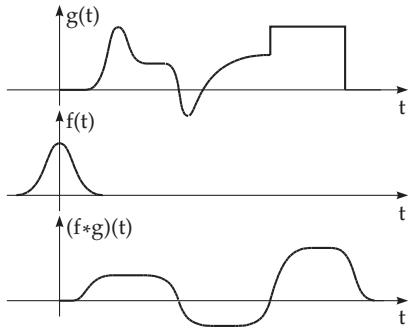  
Figure 15.6

In the image domain, the usual multiplication corresponds to the convolution:

$$
{ \mathcal { L } } \{ f _ { 1 } * f _ { 2 } \} = F _ { 1 } ( p ) \cdot F _ { 2 } ( p ) .\tag{15.23}
$$

The convolution of two functions is shown in Fig. 15.6. One can apply the convolution theorem to determine the original function:

a) Factoring the transform

$$
F ( p ) = F _ { 1 } ( p ) \cdot F _ { 2 } ( p ) .
$$

b) Determining the original functions $f _ { 1 } ( t )$ and $f _ { 2 } ( t )$ of the transforms $\mathrm { \bar { \it F } } _ { 1 } ( p )$ and $F _ { 2 } ( p )$ (from a table).

c) Determining the original function associated to $F ( p )$ by convolution of $f _ { 1 } ( t )$ and $f _ { 2 } ( t )$ in the original space $( f ( t ) = f _ { 1 } ( t ) \ast \dot { f } _ { 2 } ( t ) )$

2. Convolution in the Image Space (Complex Convolution)

$$
{ \mathcal { L } } \{ f _ { 1 } ( t ) \cdot f _ { 2 } ( t ) \} = { \left\{ \begin{array} { l l } { { \displaystyle { \frac { 1 } { 2 \pi \mathrm { i } } } } { \int _ { x _ { 1 } - \mathrm { i } \infty } ^ { x _ { 1 } + \mathrm { i } \infty } } F _ { 1 } ( z ) \cdot F _ { 2 } ( p - z ) d z , } \\ { { \displaystyle { \frac { 1 } { 2 \pi \mathrm { i } } } } { \int _ { x _ { 2 } - \mathrm { i } \infty } ^ { x _ { 2 } + \mathrm { i } \infty } } F _ { 1 } ( p - z ) \cdot F _ { 2 } ( z ) d z . \ } \end{array} \right. }\tag{15.24}
$$

The integration is performed along a line parallel to the imaginary axis. In the first integral, $x _ { 1 }$ and $p$ must be chosen so that z is in the half plane of convergence of ${ \mathcal { L } } \{ f _ { 1 } \}$ and $p - z$ is in the half plane of convergence of $\mathcal { L } \{ f _ { 2 } \}$ . The corresponding requirements must be valid for the second integral.

##### 15.2.1.3 Transforms of Special Functions

1. Step Function

The unit jump at $t = t _ { 0 }$ is called a step function (Fig. 15.7) (see also 14.4.3.2, 3., p. 757); it is also called the Heaviside unit step function:

$$
u ( t - t _ { 0 } ) = { \left\{ \begin{array} { l l } { 1 { \mathrm { ~ f o r ~ } } t > t _ { 0 } , } \\ { 0 { \mathrm { ~ f o r ~ } } t < t _ { 0 } } \end{array} \right. } \quad ( t _ { 0 } > 0 ) .\tag{15.25}
$$

A: f(t) = u(t  t0) sin ωt,

$$
F ( p ) = e ^ { - t _ { 0 } p } \frac { \omega \cos \omega t _ { 0 } + p \sin \omega t _ { 0 } } { p ^ { 2 } + \omega ^ { 2 } }\tag{Fig. 15.8).}
$$

$$
F ( p ) = e ^ { - t _ { 0 } p } \frac { \omega } { p ^ { 2 } + \omega ^ { 2 } }\tag{Fig. 15.9).}
$$

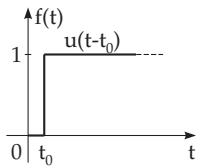  
Figure 15.7

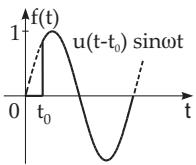  
Figure 15.8

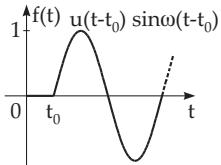  
Figure 15.9

2. Rectangular Impulse

A rectangular impulse of height 1 and width T (Fig. 15.10) is composed by the superposition of two step functions in the form

$$
u _ { T } ( t - t _ { 0 } ) = u ( t - t _ { 0 } ) - u ( t - t _ { 0 } - T ) = \left\{ \begin{array} { l l } { 0 } & { \mathrm { ~ f o r ~ } t < t _ { 0 } , } \\ { 1 } & { \mathrm { ~ f o r ~ } t _ { 0 } < t < t _ { 0 } + T , } \\ { 0 } & { \mathrm { ~ f o r ~ } t > t _ { 0 } + T ; } \end{array} \right.\tag{15.26}
$$

$$
\mathcal { L } \{ u _ { T } ( t - t _ { 0 } ) \} = \frac { e ^ { - t _ { 0 } p } ( 1 - e ^ { - T p } ) } { p } .\tag{15.27}
$$

3. Impulse Function (Dirac δ Function)

(See also 12.9.5.4, p. 700.) The impulse function $\delta ( t - t _ { 0 } )$ can obviously be interpreted as a limit of the rectangular impulse of width T and height $1 / T$ at the point $t = t _ { 0 } \ ( { \bf F i g . 1 5 . 1 1 } )$

$$
\delta ( t - t _ { 0 } ) = \operatorname * { l i m } _ { T  0 } \frac { 1 } { T } [ u ( t - t _ { 0 } ) - u ( t - t _ { 0 } - T ) ] .\tag{15.28}
$$

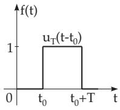  
Figure 15.10

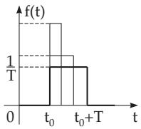  
Figure 15.11

For a continuous function $h ( t )$

$$
\int _ { a } ^ { b } h ( t ) \delta ( t - t _ { 0 } ) d t = { \left\{ \begin{array} { l l } { h ( t _ { 0 } ) , \ } & { { \mathrm { i f ~ } } t _ { 0 } { \mathrm { ~ i s ~ i n s i d e ~ } } ( a , b ) , } \\ { 0 , \ } & { { \mathrm { i f ~ } } t _ { 0 } { \mathrm { ~ i s ~ o u t s i d e ~ } } ( a , b ) . } \end{array} \right. }\tag{15.29}
$$

Relations such as

$$
\delta ( t - t _ { 0 } ) = \frac { d u ( t - t _ { 0 } ) } { d t } , \qquad \mathcal { L } \{ \delta ( t - t _ { 0 } ) \} = e ^ { - t _ { 0 } p } \qquad ( t _ { 0 } \ge 0 )\tag{15.30}
$$

are investigated generally in distribution theory (see 12.9.5.3, p. 699).

4. Piecewise Diferentiable Functions

The transform of a piecewise diferentiable function can be determined easily with the help of the δ function: If $f ( t )$ is piecewise diferentiable and at the points $t _ { \nu } \ ( \nu = 1 , 2 , \ldots , n )$ it has jumps $a _ { \nu }$ then its first derivative can be represented in the form

$$
{ \frac { d f ( t ) } { d t } } = f _ { s } ^ { \prime } ( t ) + a _ { 1 } \delta ( t - t _ { 1 } ) + a _ { 2 } \delta ( t - t _ { 2 } ) + \cdot \cdot \cdot + a _ { n } \delta ( t - t _ { n } )\tag{15.31}
$$

where $f _ { s } ^ { \prime } ( t )$ is the usual derivative of $f ( t )$ , where it is diferentiable.

If jumps occur first in the derivative, then similar formulas are valid. In this way, one can easily determine the transform of functions which correspond to curves composed of parabolic arcs of arbitrarily high degree, e.g., curves found empirically. In formal application of (15.13), the values $f ( + 0 ) , f ^ { \prime } ( + 0 ) , \ldots$ should be replaced by zero in the case of a jump.

$$
\begin{array} { r l } & { \quad \mathbf { A } : } \\ & { \quad f ( t ) = \left\{ \begin{array} { l l } { a t + b \mathrm { ~ f o r ~ } 0 < t < t _ { 0 } , } \\ { 0 \quad \mathrm { ~ o t h e r w i s e } , } \end{array} \right. \left( \mathbf { F i g } . \ \mathbf { . 1 5 . 1 2 } \right) ; \ t ^ { \prime } ( t ) = a u _ { t _ { 0 } } ( t ) + b \delta ( t ) - \left( a t _ { 0 } + b \right) \delta ( t - t _ { 0 } ) ; \ \mathcal { L } \{ f ^ { \prime } ( t ) \} = } \\ & { \frac { a } { p } ( 1 - e ^ { - t _ { 0 } p } ) + b - \left( a t _ { 0 } + b \right) e ^ { - t _ { 0 } p } ; \quad \mathcal { L } \{ f ( t ) \} = \frac { 1 } { p } \left[ \frac { a } { p } + b - e ^ { - t _ { 0 } p } \left( \frac { a } { p } + a t _ { 0 } + b \right) \right] . } \end{array}
$$

B:

$$
f ( t ) = \left\{ \begin{array} { l l } { t } & { \mathrm { f o r ~ } ~ 0 < t < t _ { 0 } , } \\ { 2 t _ { 0 } - t } & { \mathrm { f o r ~ } ~ t _ { 0 } < t < 2 t _ { 0 } , ~ \mathrm { ( F i g . ~ 1 5 . 1 3 ) } ; f ^ { \prime } ( t ) = \left\{ \begin{array} { l l } { 1 } & { \mathrm { f o r ~ } ~ 0 < t < t _ { 0 } , } \\ { - 1 } & { \mathrm { f o r ~ } ~ t _ { 0 } < t < 2 t _ { 0 } , ~ \mathrm { ( F i g . ~ 1 5 . 1 4 ) } ; } \\ { 0 } & { \mathrm { f o r ~ } ~ t > 2 t _ { 0 } , } \end{array} \right. } \end{array} \right.
$$

$$
f ^ { \prime \prime } ( t ) = \delta ( t ) - \delta ( t - t _ { 0 } ) - \delta ( t - t _ { 0 } ) + \delta ( t - 2 t _ { 0 } ) ; \quad \mathcal { L } \{ f ^ { \prime \prime } ( t ) \} = 1 - 2 e ^ { - t _ { 0 p } } + e ^ { - 2 t _ { 0 p } } ; \quad \mathcal { L } \{ f ( t ) \} = \frac { ( 1 - e ^ { - t _ { 0 p } } ) ^ { 2 } } { p ^ { 2 } } .
$$

$$
\mathbf { C } \colon f ( t ) = \left\{ \begin{array} { l l } { E t / t _ { 0 } } & { \mathrm { f o r } } \\ { E } & { \mathrm { f o r } } \\ { - E ( t - T ) / t _ { 0 } } & { T - t _ { 0 } < t < T , } \\ { 0 } & { \mathrm { o t h e r w i s e } , } \end{array} \right. ( \mathrm { F i g . ~ } 1 5 . 1 5 ) ;
$$

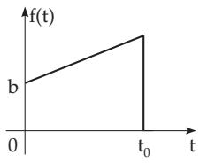  
Figure 15.12

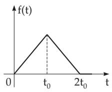  
Figure 15.13

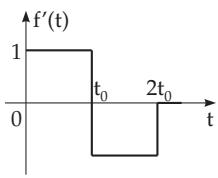  
Figure 15.14

$$
f ^ { \prime \prime } ( t ) = \frac { E } { t _ { 0 } } \delta ( t ) - \frac { E } { t _ { 0 } } \delta ( t - t _ { 0 } ) - \frac { E } { t _ { 0 } } \delta ( t - T + t _ { 0 } ) + \frac { E } { t _ { 0 } } \delta ( t - T ) ; \ C \{ f ^ { \prime \prime } ( t ) \} = \frac { E } { t _ { 0 } } \left[ 1 - e ^ { - t _ { 0 } p } - e ^ { - ( T - t _ { 0 } ) p } + e ^ { - T p } \right] ;
$$

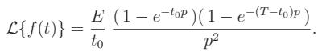

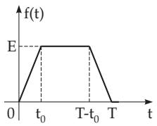  
Figure 15.15

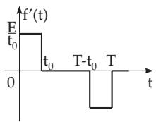  
Figure 15.16

$f ( t ) = { \left\{ \begin{array} { l l } { t - t ^ { 2 } } \\ { 0 } \end{array} \right. }$ for 0 < t < 1, otherwise, (Fig. 15.17); $f ^ { \prime } ( t ) = { \left\{ \begin{array} { l l } { 1 - 2 t } \\ { 0 } \end{array} \right. }$ for 0 < t < 1, (Fig. 15.18);

$$
f ^ { \prime \prime } ( t ) = - 2 u _ { 1 } ( t ) + \delta ( t ) + \delta ( t - 1 ) ;
$$

$$
\mathcal { L } \{ f ^ { \prime \prime } ( t ) \} = - \frac { 2 } { p } ( 1 - e ^ { - p } ) + 1 + e ^ { - p } ; \quad \mathcal { L } \{ f ( t ) \} = \frac { 1 + e ^ { - p } } { p ^ { 2 } } - \frac { 2 \left( 1 - e ^ { - p } \right) } { p ^ { 3 } } .
$$

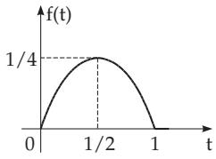  
Figure 15.17

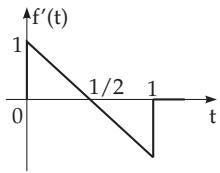  
Figure 15.18

5. Periodic Functions

The transform of a periodic function $f ^ { * } ( t )$ with period $T ,$ which is a periodic continuation of a function $f ( t )$ , can be obtained from the Laplace transform of $f ( t )$ multiplied by the periodization factor

$$
( 1 - e ^ { - T p } ) ^ { - 1 } .\tag{15.32}
$$

A: The periodic continuation of $f ( t )$ from example B (see above) with period $T = 2 t _ { 0 }$ is $f ^ { * } ( t )$ with (1 e−t0p)2 1 1 e−t0p   
f ∗(t) = p2 1 e−2t0p p2(1 + e−t0p)

B: The periodic continuation of $f ( t )$ from example C (see above) with period T is $f ^ { * } ( t )$ with $\mathcal { L } \{ f ^ { * } ( t ) \} = \frac { E \left( 1 - e ^ { - t _ { 0 } p } \right) \left( 1 - e ^ { - ( T - t _ { 0 } ) p } \right) } { t _ { 0 } p ^ { 2 } \left( 1 - e ^ { - T p } \right) } .$

##### 15.2.1.4 Dirac Function and Distributions

In describing certain technical systems by linear diferential equations, functions $u ( t )$ and $\delta ( t )$ often occur as perturbation or input functions, although the conditions required in 15.2.1.1, 1. p. 770, are not satisfied: $u ( t )$ is discontinuous, and $\delta ( t )$ cannot be defined in the sense of classical analysis.

Distribution theory ofers a solution by introducing so-called generalized functions (distributions), so that with the known continuous real functions $\delta ( t )$ can also be examined, where the necessary diferentiability is also guaranteed. Distributions can be represented in diferent ways. One of the best known representations is the continuous real linear form, introduced by L. Schwartz (see 12.9.5, p. 698).

Fourier coeficients and Fourier series can be associated uniquely to periodic distributions, analogously to real functions (see 7.4, p. 474).

1. Approximations of the δ Function

Analogously to (15.28), the impulse function $\delta ( t )$ can be approximated by a rectangular impulse of width ε and height $1 / \bar { \varepsilon } ( \varepsilon > 0 )$

$$
f ( t , \varepsilon ) = \left\{ { \begin{array} { l l } { { 1 / \varepsilon } } & { { \mathrm { f o r } \ \left| t \right| < \varepsilon / 2 , } } \\ { { 0 } } & { { \mathrm { f o r } \ \left| t \right| \geq \varepsilon / 2 . } } \end{array} } \right.\tag{15.33a}
$$

Further examples of the approximation of $\delta ( t )$ are the error curve (see 2.6.3, p. 73) and Lorentz function (see 2.11.2, p. 95):

$$
f ( t , \varepsilon ) = { \frac { 1 } { \varepsilon { \sqrt { 2 \pi } } } } e ^ { - { \frac { t ^ { 2 } } { 2 \varepsilon ^ { 2 } } } } \quad ( \varepsilon > 0 ) ,\tag{15.33b}
$$

$$
f ( t , \varepsilon ) = { \frac { \varepsilon / \pi } { t ^ { 2 } + \varepsilon ^ { 2 } } } \qquad ( \varepsilon > 0 ) .\tag{15.33c}
$$

These functions have the common properties:

$$
\mathbf { 1 } . \int _ { - \infty } ^ { \infty } f ( t , \varepsilon ) d t = 1 .\tag{15.34a}
$$

2. $f ( - t , \varepsilon ) = f ( t , \varepsilon )$ , i.e., they are even functions.

(15.34b)

3. $\operatorname* { l i m } _ { \varepsilon \to 0 } f ( t , \varepsilon ) = { \left\{ \begin{array} { l l } { \infty } & { { \mathrm { f o r } } \ t = 0 , } \\ { 0 } & { { \mathrm { f o r } } \ t \neq 0 . } \end{array} \right. }$

(15.34c)

2. Properties of the δ Function

Important properties of the δ function are:

$$
1 . \quad \int _ { x - a } ^ { x + a } f ( t ) \delta ( x - t ) d t = f ( x ) \quad ( f { \mathrm { ~ i s ~ c o n t i n u o u s , ~ } } a > 0 ) .\tag{15.35}
$$

$$
2 . \quad \delta ( \alpha x ) = { \frac { 1 } { \alpha } } \delta ( x ) \quad ( \alpha > 0 ) .\tag{15.36}
$$

$$
3 . \delta \left( g ( x ) \right) = \sum _ { i = 1 } ^ { n } { \frac { 1 } { | g ^ { \prime } ( x _ { i } ) | } } \delta ( x - x _ { i } ) \quad { \mathrm { w i t h ~ } } g ( x _ { i } ) = 0 { \mathrm { ~ a n d ~ } } g ^ { \prime } ( x _ { i } ) \neq 0 ( i = 1 , 2 , \ldots , n ) .\tag{15.37}
$$

Here all roots of $g ( x )$ are considered and they must be simple.

4. n-th Derivative of the δ Function: After n repeated partial integrations of

$$
f ^ { ( n ) } ( x ) = \int _ { x - a } ^ { x + a } f ^ { ( n ) } ( t ) \delta ( x - t ) d t ,\tag{15.38a}
$$

a rule is obtained for the n-th derivative of the δ function:

$$
( - 1 ) ^ { n } f ^ { ( n ) } ( x ) = \int _ { x - a } ^ { x + a } f ( t ) \delta ^ { ( n ) } ( x - t ) d t .\tag{15.38b}
$$

##### Function and Distributions
