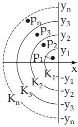
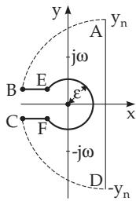

#### 15.2.2 Inverse Transformation into the Original Space

To perform an inverse transformation, there are the following possibilities:

1. Using a table of correspondences, i.e., a table with the corresponding original functions and transforms (see Table 21.13, p. 1109).

2. Reducing to known correspondences by using some properties of the transformation (see 15.2.2.2, p. 778, and 15.2.2.3, p. 779).

3. Evaluating the inverse formula (see 15.2.2.4, p. 780).

##### 15.2.2.1 Inverse Transformation with the Help of Tables

The use of a table is shown here by an example with Table 21.13, p. 1109.

Further tables can be found, e.g., in [15.3].

$$
\boldsymbol { F } ( \boldsymbol { p } ) = \frac { 1 } { ( p ^ { 2 } + \omega ^ { 2 } ) ( p + c ) } = \boldsymbol { F } _ { 1 } ( \boldsymbol { p } ) \cdot \boldsymbol { F } _ { 2 } ( \boldsymbol { p } ) , \mathcal { L } ^ { - 1 } \{ \boldsymbol { F } _ { 1 } ( \boldsymbol { p } ) \} = \mathcal { L } ^ { - 1 } \left\{ \frac { 1 } { p ^ { 2 } + \omega ^ { 2 } } \right\} = \frac { 1 } { \omega } \sin \omega t = f _ { 1 } ( t ) ,
$$

${ \mathcal { L } } ^ { - 1 } \{ F _ { 2 } ( p ) \} = { \mathcal { L } } ^ { - 1 } \left\{ { \frac { 1 } { p + c } } \right\} = e ^ { - c t } = f _ { 2 } ( t )$ . Applying the convolution theorem (15.23) yields:

$$
{ \begin{array} { r l } { f ( t ) } & { = { \mathcal { L } } ^ { - 1 } \{ F _ { 1 } ( p ) \cdot F _ { 2 } ( p ) \} } \\ & { = \int _ { 0 } ^ { t } f _ { 1 } ( \tau ) \cdot f _ { 2 } ( t - \tau ) d \tau = \int _ { 0 } ^ { t } e ^ { - c ( t - \tau ) } { \frac { \sin \omega \tau } { \omega } } d \tau = { \frac { 1 } { c ^ { 2 } + \omega ^ { 2 } } } \left( { \frac { c \sin \omega t - \omega \cos \omega t } { \omega } } + e ^ { - c t } \right) . } \end{array} }
$$

##### 15.2.2.2 Partial Fraction Decomposition

1. Principle

In many applications, there are transforms in the form $F ( p ) = H ( p ) / G ( p )$ , where $G ( \boldsymbol { p } )$ is a polynomial of p. If the original functions for $H ( p )$ and $1 / G ( \boldsymbol { p } )$ are already known, then the required original function of $\mathsf { \bar { F } } ( p )$ can be got by applying the convolution theorem.

2. Simple Real Roots of $G ( \boldsymbol { p } )$

If the transform $1 / G ( \boldsymbol { p } )$ has only simple poles $p _ { \nu } ~ ( \nu = 1 , 2 , \ldots , n )$ , then it has the following partial fraction decomposition:

$$
{ \frac { 1 } { G ( p ) } } = \sum _ { \nu = 1 } ^ { n } { \frac { 1 } { G ^ { \prime } ( p _ { \nu } ) ( p - p _ { \nu } ) } } .\tag{15.39}
$$

The corresponding original function is

$$
q ( t ) = { \mathcal { L } } ^ { - 1 } \left\{ { \frac { 1 } { G ( p ) } } \right\} = \sum _ { \nu = 1 } ^ { n } { \frac { 1 } { G ^ { \prime } ( p _ { \nu } ) } } e ^ { p _ { \nu } t } .\tag{15.40}
$$

3. The Heaviside Expansion Theorem

If the numerator $H ( p )$ is also a polynomial of $p$ with a lower degree than $G ( \boldsymbol { p } )$ , then we can obtain the original function of $F ( p )$ with the help of the Heaviside formula

$$
f ( t ) = \sum _ { \nu = 1 } ^ { n } { \frac { H ( p _ { \nu } ) } { G ^ { \prime } ( p _ { \nu } ) } } e ^ { p _ { \nu } t } .\tag{15.41}
$$

4. Complex Roots

Even in cases when the denominator has simple complex roots, the Heaviside expansion theorem can be used in the same way. The terms belonging to complex conjugate roots can be collected into one quadratic expression, whose inverse transformation can be found in tables also in the case of roots of higher multiplicity.

$F ( p ) = \frac { 1 } { ( p + c ) ( p ^ { 2 } + \omega ^ { 2 } ) } , \mathrm { i . e . , ~ } H ( p ) = 1 , G ( p ) = ( p + c ) ( p ^ { 2 } + \omega ^ { 2 } ) , G ^ { \prime } ( p ) = 3 p ^ { 2 } + 2 p c + \omega ^ { 2 } .$ The zeroes of $G ( p ) p _ { 1 } = - c , p _ { 2 } = \mathrm { i } \omega , p _ { 3 } = - \mathrm { i } \omega$ are all simple. According to the Heaviside theorem one gets $f ( t ) = { \frac { 1 } { \omega ^ { 2 } + c ^ { 2 } } } e ^ { - c t } - { \frac { 1 } { 2 \omega ( \omega - \mathrm { i } c ) } } e ^ { \mathrm { i } \omega t } - { \frac { 1 } { 2 \omega ( \omega + \mathrm { i } c ) } } e ^ { - \mathrm { i } \omega t }$ or by using partial fraction decomposition and the table $F ( p ) \ = \ \frac 1 { \omega ^ { 2 } + c ^ { 2 } } \left[ \frac 1 { p + c } + \frac { c - p } { p ^ { 2 } + \omega ^ { 2 } } \right] , f ( t ) \ = \ \frac 1 { \omega ^ { 2 } + c ^ { 2 } } \left[ e ^ { - c t } + \frac c \omega \sin \omega t - \cos \omega t \right]$ . These expressions for $f ( t )$ are identical.

##### 15.2.2.3 Series Expansion

In order to obtain $f ( t )$ from $F ( p )$ one can try to expand $F ( p )$ into a series $F ( p ) = \sum _ { n = 0 } ^ { \infty } F _ { n } ( p )$ , whose terms $F _ { n } ( p )$ are transforms of known functions, i.e., $F _ { n } ( p ) = { \mathcal { L } } \{ f _ { n } ( t ) \}$ .

$\mathbf { 1 } . \quad F ( p )$ is an Absolutely Convergent Series

$F ( p )$ has an absolutely convergent series

$$
F ( p ) = \sum _ { n = 0 } ^ { \infty } \frac { a _ { n } } { p ^ { \lambda _ { n } } } ,\tag{15.42}
$$

for $| p | > R$ , where the values $\lambda _ { n }$ form an arbitrary increasing sequences of numbers $0 < \lambda _ { 0 } < \lambda _ { 1 } <$ $\cdots < \lambda _ { n } < \cdot \cdot \cdot < \cdot \cdot \cdot  \infty$ , then a termwise inverse transformation is possible:

$$
f ( t ) = \sum _ { n = 0 } ^ { \infty } a _ { n } \frac { t ^ { \lambda _ { n } - 1 } } { T ( \lambda _ { n } ) } .\tag{15.43}
$$

Γ denotes the gamma function (see 8.2.5, 6., p. 514). In particular, for $\lambda _ { n } = n + 1 , \mathrm { i . e . }$ , for $F ( p ) =$ $\sum _ { n = 0 } ^ { \infty } { \frac { a _ { n + 1 } } { p ^ { n + 1 } } }$ the series $f ( t ) = \sum _ { n = 0 } ^ { \infty } { \frac { a _ { n + 1 } } { n ! } } t ^ { n }$ is obtained, which is convergent for every real and complex t. Furthermore, one can have an estimation in the form $| f ( t ) | < C e ^ { c | t | }$ (C, c real constants).

$F ( p ) = { \frac { 1 } { \sqrt { 1 + p ^ { 2 } } } } = { \frac { 1 } { p } } \left( 1 + { \frac { 1 } { p ^ { 2 } } } \right) ^ { - 1 / 2 } = \sum _ { n = 0 } ^ { \infty } \left( { - { \frac { 1 } { 2 } } } \right) { \frac { 1 } { p ^ { 2 n + 1 } } }$ . After a termwise transformation into the original space the result is $f ( t ) = \sum _ { n = 0 } ^ { \infty } \left( - { \frac { 1 } { 2 } } \right) { \frac { t ^ { 2 n } } { ( 2 n ) ! } } = \sum _ { n = 0 } ^ { \infty } { \frac { ( - 1 ) ^ { n } } { ( n ! ) ^ { 2 } } } \left( { \frac { t } { 2 } } \right) ^ { 2 n } = J _ { 0 } ( t )$ (Bessel function of 0 order).

2. $F ( p )$ is a Meromorphic Function

If $F ( p )$ is a meromorphic function, which can be represented as the quotient of two integer functions (of two functions having everywhere convergent power series expansions) which do not have common

roots, and so can be rewritten as the sum of an integer function and infinitely many partial fractions, then the equality

$$
{ \frac { 1 } { 2 \pi \mathrm { i } } } \int _ { c - \mathrm { i } y _ { n } } ^ { c + \mathrm { i } y _ { n } } e ^ { t p } F ( p ) d p = \sum _ { \nu = 1 } ^ { n } b _ { \nu } e ^ { p _ { \nu } t } - { \frac { 1 } { 2 \pi \mathrm { i } } } \intop e ^ { t p } F ( p ) d p\tag{15.44}
$$

is obtained. Here $p _ { \nu } \ ( \nu = 1 , 2 , \ldots , n )$ are the first-order poles of the function $F ( p ) , b _ { \nu }$ are the corresponding residues (see 14.3.5.4, p. 753), $y _ { \nu }$ are certain values and $K _ { \nu }$ are certain curves, for example, half circles in the sense represented in Fig. 15.19. The solution $f ( t )$ has the form

$$
f ( t ) = \sum _ { \nu = 1 } ^ { \infty } b _ { \nu } e ^ { p _ { \nu } t } , \qquad \mathrm { i f } \qquad { \frac { 1 } { 2 \pi \mathrm { i } } } \intop _ { ( K _ { n } ) } e ^ { t p } F ( p ) d p  0\tag{15.45}
$$

as $y  \infty$ , what is often not easy to verify.

  
Figure 15.19

  
Figure 15.20

In certain cases, $\mathrm { e . g . }$ , when the rational part of the meromorphic function $F ( p )$ is identically zero, the above result is a formal application of the Heaviside expansion theorem to meromorphic functions.

##### 15.2.2.4 Inverse Integral

The inverse formula

$$
f ( t ) = \operatorname* { l i m } _ { y _ { n } \to \infty } { \frac { 1 } { 2 \pi \mathrm { i } } } \int _ { c - \mathrm { i } y _ { n } } ^ { c + \mathrm { i } y _ { n } } e ^ { t p } F ( p ) d p\tag{15.46}
$$

represents a complex integral of a function analytic in a certain domain. The usual methods of integration for complex functions can be used, e.g., the residue calculation or certain changes of the path of integration according to the Cauchy integral theorem.

$F ( p ) = \frac { p } { p ^ { 2 } + \omega ^ { 2 } } e ^ { - \sqrt { p } \alpha }$ is double valued because of ${ \sqrt { p } } .$ . Therefore, we chose the following path of integration (Fig. 15.20): ${ \frac { 1 } { 2 \pi \mathrm { i } } } \oint _ { ( K ) } ^ { t } e ^ { t p } { \frac { p } { p ^ { 2 } + \omega ^ { 2 } } } e ^ { - \sqrt { p } \alpha } d p = \int _ { \widehat { A B } } \cdots + \int _ { C D } \cdots + \int _ { E F } \cdots + \int _ { D A } \cdots + \int _ { B E } \cdots + \int _ { \overline { { F C } } } \cdots = 0 ,$

$\begin{array} { r } { \sum \operatorname { R e s } e ^ { t p } F ( p ) = e ^ { - \alpha \sqrt { \omega / 2 } } \cos ( \omega t - \alpha \sqrt { \omega / 2 } ) } \end{array}$ . According to the Jordan lemma (see 14.4.3, p. 755), the integral part over $\widehat { A B }$ and $\widehat { C D }$ vanishes as $y _ { n } \to \infty$ . The integrand remains bounded on the circular arc $E F \ ( \mathrm { r a d i u s } \varepsilon )$ , and the length of the path of integration tends to zero for $\varepsilon  0 ;$ so this term of the integral also vanishes. There are to investigate the integrals on the two horizontal segments $\overline { { B E } }$ and ${ \overline { { F C } } } .$ where it is to consider the upper side $\overset { \textstyle - } { \left( p \right. } = r e ^ { \mathrm { i } \pi } \overset { \textstyle \mathrm { i } } { \quad } )$ and the lower side $( p = r e ^ { - \mathrm { i } \pi } )$ of the negative real axis:

$$
\int _ { - \infty } ^ { 0 } F ( p ) e ^ { t p } d p = - \int _ { 0 } ^ { \infty } e ^ { - t r } \frac { r } { r ^ { 2 } + \omega ^ { 2 } } e ^ { - \mathrm { i } \alpha \sqrt { r } } d r , \qquad \int _ { 0 } ^ { - \infty } F ( p ) e ^ { t p } d p = \int _ { 0 } ^ { \infty } e ^ { - t r } \frac { r } { r ^ { 2 } + \omega ^ { 2 } } e ^ { \mathrm { i } \alpha \sqrt { r } } d r .
$$

Finally one gets:

$$
\begin{array} { c c c } { { f ( t ) = e ^ { - \alpha \sqrt { \omega / 2 } } \cos \left( \omega t - \alpha \sqrt { \frac { \omega } { 2 } } \right) - \frac { 1 } { \pi } \int _ { 0 } ^ { \infty } e ^ { - t r } \frac { r \sin \alpha \sqrt { r } } { r ^ { 2 } + \omega ^ { 2 } } d r . } } \end{array}
$$
