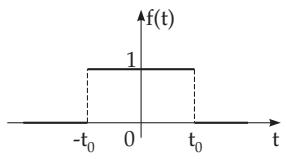
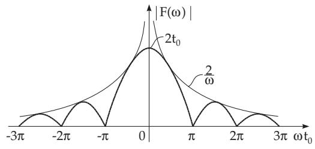
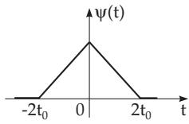
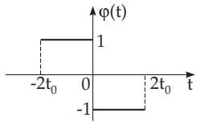
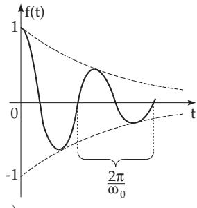
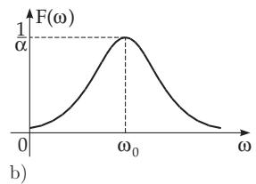
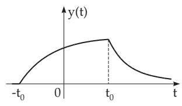

#### 15.3.1 Properties of the Fourier Transformation

##### 15.3.1.1 Fourier Integral

1. Fourier Integral in Complex Representation

The basis of the Fourier transformation is the Fourier integral, also called the integral formula of Fourier: If a non-periodic function $f ( t )$ satisfies the Dirichlet conditions (see 7.4.1.2, 3., p. 475) in an arbitrary finite interval, and furthermore the integra

$$
\int _ { - \infty } ^ { + \infty } \left| f ( t ) \right| d t \quad \mathrm { ~ ( 1 5 . 6 4 a ) ~ } \quad \quad \mathrm { i s ~ c o n v e r g e n t , ~ t h e n } \quad f ( t ) = \frac { 1 } { 2 \pi } \int \displaylimits _ { - \infty } ^ { + \infty } \int \displaylimits _ { - \infty } ^ { + \infty } e ^ { \mathrm { i } \omega ( t - \tau ) } f ( \tau ) d \omega d \tau\tag{15.64b}
$$

at every point where the function $f ( t )$ is continuous, and

$$
{ \frac { f ( t + 0 ) + f ( t - 0 ) } { 2 } } = { \frac { 1 } { \pi } } \intop _ { 0 } ^ { \infty } d \omega \intop _ { - \infty } ^ { + \infty } f ( \tau ) \cos \omega \left( t - \tau \right) d \tau\tag{15.64c}
$$

at the points of discontinuity.

2. Equivalent Representations

Other equivalent forms for the Fourier integral (15.64b) are:

$$
\mathbf { 1 . } \quad f ( t ) = { \frac { 1 } { 2 \pi } } \intop _ { - \infty } ^ { + \infty } \intop _ { - \infty } ^ { + \infty } f ( \tau ) \cos \left[ \omega \left( t - \tau \right) \right] d \omega d \tau .\tag{15.65a}
$$

$$
2 . \quad f ( t ) = \int _ { 0 } ^ { \infty } [ a ( \omega ) \cos \omega t + b ( \omega ) \sin \omega t ] d \omega \qquad { \mathrm { w i t h ~ t h e ~ c o e f f i c i e n t s } }\tag{15.65b}
$$

$$
a ( \omega ) = \frac { 1 } { \pi } \int _ { - \infty } ^ { + \infty } f ( t ) \cos \omega t d t \qquad \quad ( 1 5 . 6 5 \mathrm { c } ) \qquad b ( \omega ) = \frac { 1 } { \pi } \int _ { - \infty } ^ { + \infty } f ( t ) \sin \omega t d t .\tag{15.65d}
$$

$$
\begin{array} { r l } { { 3 } . } & { { } f ( t ) = \displaystyle \int _ { 0 } ^ { \infty } A ( \omega ) \cos \left[ \omega t + \psi ( \omega ) \right] d \omega . } \end{array}\tag{15.66}
$$

$$
4 . \quad f ( t ) = \int _ { 0 } ^ { \infty } A ( \omega ) \sin \left[ \omega t + \varphi ( \omega ) \right] d \omega .\tag{15.67}
$$

The following relations are valid here:

$$
A ( \omega ) = \sqrt { a ^ { 2 } ( \omega ) + b ^ { 2 } ( \omega ) } , \qquad \mathrm { ( 1 5 . 6 8 a ) } \qquad \varphi ( \omega ) = \psi ( \omega ) + \frac { \pi } { 2 } ,\tag{15.68b}
$$

$$
\cos \psi ( \omega ) = \frac { a ( \omega ) } { A ( \omega ) } ,
$$

(15.68c)

$$
\sin \psi ( \omega ) = \frac { b ( \omega ) } { A ( \omega ) } ,\tag{15.68d}
$$

$$
\cos \varphi ( \omega ) = { \frac { b ( \omega ) } { A ( \omega ) } } ,
$$

(15.68e)

$$
\sin { \varphi ( \omega ) } = \frac { a ( \omega ) } { A ( \omega ) } .\tag{15.68f}
$$

##### 15.3.1.2 Fourier Transformation and Inverse Transformation

1. Definition of the Fourier Transformation

The Fourier transformation is an integral transformation of the form (15.1a), which comes from the Fourier integral (15.64b) by substituting

$$
F ( \omega ) = \int _ { - \infty } ^ { + \infty } e ^ { - \mathrm { i } \omega \tau } f ( \tau ) d \tau .\tag{15.69}
$$

The following relation is valid between the real original function $f ( t )$ and the usually complex transform $F ( \omega )$ :

$$
f ( t ) = { \frac { 1 } { 2 \pi } } \int _ { - \infty } ^ { + \infty } e ^ { \mathrm { i } \omega t } F ( \omega ) d \omega .\tag{15.70}
$$

In the brief notation one uses $\mathcal { F } ;$

$$
F ( \omega ) = { \mathcal { F } } \{ f ( t ) \} = \int _ { - \infty } ^ { + \infty } e ^ { - \mathrm { i } \omega t } f ( t ) d t .\tag{15.71}
$$

The original function $f ( t )$ is Fourier transformable if the integral (15.69), i.e., an improper integral with the parameter $\omega ,$ , exists. If the Fourier integral does not exist as an ordinary improper integral, then it is considered as the Cauchy principal value (see 8.2.3.3, 1., p. 510). The transform $F ( \omega )$ is also called the Fourier transform; it is bounded, continuous, and it tends to zero for $| \omega |  \infty ;$

$$
\operatorname* { l i m } _ { | \omega | \to \infty } F ( \omega ) = 0 .\tag{15.72}
$$

The existence and boundedness of $F ( \omega )$ follow directly from the obvious inequality

$$
| F ( \omega ) | \leq \intop _ { - \infty } ^ { + \infty } | e ^ { - \mathrm { i } \omega t } f ( t ) | d t \leq \intop _ { - \infty } ^ { + \infty } | f ( t ) | d t .\tag{15.73}
$$

The existence of the Fourier transform is a suficient condition for the continuity of $F ( \omega )$ and for the properties $F ( \omega )  0 \mathrm { f o r } | \omega |  \infty$ . This statement is often used in the following form: If the function ${ \bf { \bar { \rho } } } ( t )$ in $( - \infty , \infty )$ is absolutely integrable, then its Fourier transform is a continuous function of $\omega ,$ and (15.72) holds.

The following functions are not Fourier transformable: Constant functions, arbitrary periodic functions $( \mathrm { e . g . } ,$ sin $\omega t ,$ cos $\omega t )$ , power functions, polynomials, exponential functions $( \mathrm { e . g . , } \bar { e } ^ { \bar { \alpha } t }$ , hyperbolic functions).

2. Fourier Cosine and Fourier Sine Transformation

In the Fourier transformation (15.71), the integrand can be decomposed into a sine and a cosine part.   
${ \mathrm { S o } } ,$ one gets the sine and the cosine Fourier transformation.

1. Fourier Sine Transformation

$$
F _ { s } ( \omega ) = \mathcal { F } _ { s } \{ f ( t ) \} = \intop _ { 0 } ^ { \infty } f ( t ) \sin { ( \omega t ) } d t .\tag{15.74a}
$$

2. Fourier Cosine Transformation

$$
F _ { c } ( \omega ) = \mathcal { F } _ { c } \{ f ( t ) \} = \intop _ { 0 } ^ { \infty } f ( t ) \cos { ( \omega t ) } d t .\tag{15.74b}
$$

3. Conversion Formulas Between the Fourier sine (15.74a) and the Fourier cosine transformation (15.74b) on one hand, and the Fourier transformation (15.71) on the other hand, the following relations are valid:

$$
F ( \omega ) = \mathcal { F } \{ f ( t ) \} = \mathcal { F } _ { c } \{ f ( t ) + f ( - t ) \} - \mathrm { i } \mathcal { F } _ { s } \{ f ( t ) - f ( - t ) \} ,\tag{15.75a}
$$

$$
F _ { s } ( \omega ) = \frac { \mathrm { i } } { 2 } \mathcal { F } \{ f ( | t | ) \mathrm { s i g n } t \} , \qquad ( 1 5 . 7 5 \mathrm { b } ) \qquad F _ { c } ( \omega ) = \frac { 1 } { 2 } \mathcal { F } \{ f ( | t | ) \} .\tag{15.75c}
$$

For an even or for an odd function $f ( t )$ the following representations hold:

f(t) even: $\mathcal { F } \{ f ( t ) \} = 2 \mathcal { F } _ { c } \{ f ( t ) \}$

f(t) odd: $\mathcal { F } \{ f ( t ) \} = - 2 \mathrm { i } \mathcal { F } _ { s } \{ f ( t ) \}$

(15.75d)

3. Exponential Fourier Transformation

Diferently from the definition of $F ( \omega )$ in (15.71), the transform

$$
F _ { e } ( \omega ) = { \mathcal { F } } _ { e } \{ f ( t ) \} = { \frac { 1 } { 2 } } \int _ { - \infty } ^ { + \infty } e ^ { \mathrm { i } \omega t } f ( t ) d t\tag{15.76}
$$

is called the exponential Fourier transformation, so that

$$
F ( \omega ) = 2 F _ { e } ( - \omega ) .\tag{15.77}
$$

4. Tables of the Fourier Transformation

Based on formulas $\left( 1 5 . 7 5 \mathrm { a } , \mathrm { b } , \mathrm { c } \right)$ one either does not need special tables for the corresponding Fourier sine and Fourier cosine transformations, or one uses tables for Fourier sine and Fourier cosine transformations and calculates $\mathcal { F } ( \omega )$ with the help of $\left( 1 5 . 7 5 \mathrm { a } , \mathrm { b } , \mathrm { c } \right)$ . In Table 21.14.1 (see p. 1114) and Table 21.14.2 (see p. 1120) the Fourier sine transforms $\mathcal { F } _ { s } ( \omega )$ , the Fourier cosine transforms $\mathcal { F } _ { c } ( \omega )$ respectively, in Table 21.14.3 (see p. 1125) for some functions the Fourier transform $\mathcal { F } ( \omega )$ and in Table 21.14.4 (see p. 1127) the exponential transform $\mathcal { F } _ { e } ( \omega )$ are given.

The function of the unipolar rectangular impulse $f ( t ) = 1$ for $| t | < t _ { 0 } , ~ f ( t ) = 0$ for $| t | > t _ { 0 } ( \mathrm { A } . 1 )$ (Fig. 15.21) satisfies the assumptions of the existence of the Fourier integral (15.64a). According to $\mathrm { ( 1 5 . 6 5 c , d ) }$ the coeficients are $a ( \omega ) = \frac { 1 } { \pi } \int _ { - t _ { 0 } } ^ { + t _ { 0 } }$ cos $\omega t d t = { \frac { 2 } { \pi \omega } }$ sin $\omega t _ { 0 }$ and $b ( \omega ) = \frac { 1 } { \pi } \int _ { - t _ { 0 } } ^ { + t _ { 0 } }$ sin $\omega t d t = 0$ (A.2) and so from (15.65b) follows $f ( t ) = \frac { 2 } { \pi } \int _ { 0 } ^ { \infty } \frac { \sin \omega t _ { 0 } \cos \omega t } { \omega } d \omega ( \mathrm { A . 3 } )$

5. Spectral Interpretation of the Fourier Transformation

Analogously to the Fourier series of a periodic function, the Fourier integral for a non-periodic function has a simple physical interpretation. A function $f ( t )$ , for which the Fourier integral exists, can be represented according to (15.66) and (15.67) as a sum of sinusoidal vibrations with continuously changing frequency ω in the form

$$
A ( \omega ) d \omega \sin { [ \omega t + \varphi ( \omega ) ] } , \qquad \mathrm { ( 1 5 . 7 8 a ) }
$$

$$
A ( \omega ) d \omega \cos { \left[ \omega t + \psi ( \omega ) \right] } .\tag{15.78b}
$$

The expression $A ( \omega )$ dω gives the amplitude of the wave components and $\varphi ( \omega )$ and $\psi ( \omega )$ are the phases. The same interpretation holds for the complex formulation: The function $f ( t )$ is a sum (or integral) of summands depending on $\omega$ of the form

$$
{ \frac { 1 } { 2 \pi } } F ( \omega ) d \omega e ^ { \mathrm { i } \omega t } ,\tag{15.79}
$$

where the quantity ${ \frac { 1 } { 2 \pi } } F ( \omega )$ also determines the amplitude and the phase of all the parts.

This spectral interpretation of the Fourier integral and the Fourier transformation has a big advantage in applications in physics and engineering. The transform

$$
F ( \omega ) = | F ( \omega ) | e ^ { \mathrm { i } \psi ( \omega ) } \quad \mathrm { o r } \quad F ( \omega ) = | F ( \omega ) | e ^ { \mathrm { i } \varphi ( \omega ) }\tag{15.80a}
$$

is called the spectrum or frequency spectrum of the function $f ( t )$ , the quantity

$$
| F ( \omega ) | = \pi A ( \omega )\tag{15.80b}
$$

is the amplitude spectrum and $\varphi ( \omega )$ and $\psi ( \omega )$ are the phase spectra of the function $f ( t )$ . The relation between the spectrum $F ( \omega )$ and the coeficients (15.65c,d) is

$$
F ( \omega ) = \pi [ a ( \omega ) - \mathrm { i } b ( \omega ) ] ,\tag{15.81}
$$

from which one gets the following statements:

1. If f(t) is a real function, then the amplitude spectrum $| F ( \omega ) |$ is an even function of $\omega ,$ and the phase spectrum is an odd function of ω.

2. If $f ( t )$ is a real and even function, then its spectrum $F ( \omega )$ is real, and if $f ( t )$ is real and odd, then the spectrum $F ( \omega )$ is imaginary.

  
Figure 15.21  
Figure 15.22

Substituting the result (A.2) for the unipolar rectangular impulse function on p. 786 into (15.81), then one gets for the transform $F ( \omega )$ and for the amplitude spectrum $| F ( \omega ) |$ (Fig. 15.22)

$F ( \omega ) = \mathscr { F } \{ f ( t ) \} = \pi a ( \omega ) = 2 \frac { \sin \omega t _ { 0 } } { \omega } ( \mathrm { A } . 3 ) , | F ( \omega ) | = 2 \left| \frac { \sin \omega t _ { 0 } } { \omega } \right|$ (A.4). The points of contact of

the amplitude spectrum $| F ( \omega ) |$ with the hyperbola $\frac { 2 } { \omega }$ are at $\omega t _ { 0 } = \pm ( 2 n + 1 ) \frac { \pi } { 2 } \quad ( n = 0 , 1 , 2 , \ldots )$

##### 15.3.1.3 Rules of Calculation with the Fourier Transformation

As it has been already pointed out for the Laplace transformation, the rules of calculation with integral transformations mean the mappings of certain operations in the original space into operations in the image space. Supposing that both functions $f ( t )$ and $g ( t )$ are absolutely integrable in the interval $( - \infty , \infty )$ and their Fourier transforms are

$$
F ( \omega ) = { \mathcal { F } } { \left\{ \ f ( t ) \right\} } \qquad { \mathrm { a n d } } \qquad G ( \omega ) = { \mathcal { F } } { \left\{ \ g ( t ) \right\} }\tag{15.82}
$$

then the following rules are valid.

1. Addition or Linearity Laws

If α and $\beta$ are two coeficients from $( - \infty , \infty )$ , then:

$$
\mathcal { F } \{ \alpha f ( t ) + \beta g ( t ) \} = \alpha F ( \omega ) + \beta G ( \omega ) .\tag{15.83}
$$

2. Similarity Law

For real $\alpha \neq 0$

$$
{ \mathcal { F } } \{ f ( t / \alpha ) \} = | \alpha | F ( \alpha \omega ) .\tag{15.84}
$$

3. Shifting Theorem

For real $\alpha \neq 0$ and real $\beta$

$$
{ \mathcal { F } } \{ f ( \alpha t + \beta ) \} = ( 1 / | \alpha | ) e ^ { \mathrm { i } \beta \omega / \alpha } F ( \omega / \alpha )\tag{15.85a}
$$

$$
\mathcal { F } \{ f ( t - t _ { 0 } ) \} = e ^ { - \mathrm { i } \omega t _ { 0 } } F ( \omega ) .\tag{15.85b}
$$

If $t _ { 0 }$ is replaced by $- t _ { 0 }$ in (15.85b), then

$$
{ \mathcal { F } } \{ f ( t + t _ { 0 } ) \} = e ^ { \mathrm { i } \omega t _ { 0 } } F ( \omega ) .\tag{15.85c}
$$

4. Frequency-Shift Theorem

For real $\alpha > 0$ and $\beta \in ( - \infty , \infty )$

$$
{ \mathcal { F } } \{ e ^ { \mathrm { i } \beta t } f ( \alpha t ) \} = ( 1 / \alpha ) F ( ( \omega - \beta ) / \alpha )\tag{15.86a}
$$

$$
{ \mathcal { F } } \{ e ^ { \mathrm { i } \omega _ { 0 } t } f ( t ) \} = F ( \omega - \omega _ { 0 } ) .\tag{15.86b}
$$

5. Diferentiation in the Image Space

If the function $t ^ { n } f ( t )$ is absolutely integrable in $( - \infty , \infty )$ , then the Fourier transform of the function $f ( t )$ has n continuous derivatives, which can be determined for $k = 1 , 2 , \ldots , n :$ as

$$
\frac { d ^ { k } F ( \omega ) } { d \omega ^ { k } } = \int _ { - \infty } ^ { + \infty } \frac { \partial ^ { k } } { \partial \omega ^ { k } } \left[ e ^ { - \mathrm { i } \omega t } f ( t ) \right] d t = ( - 1 ) ^ { k } \intop _ { - \infty } ^ { + \infty } e ^ { - \mathrm { i } \omega t } t ^ { k } f ( t ) d t ,\tag{15.87a}
$$

where

$$
\operatorname* { l i m } _ { \omega \to \pm \infty } \frac { d ^ { k } F ( \omega ) } { d \omega ^ { k } } = 0 .\tag{15.87b}
$$

With the above assumptions these relations imply that

$$
{ \mathcal { F } } \{ t ^ { n } f ( t ) \} = \mathrm { i } ^ { n } { \frac { d ^ { n } F ( \omega ) } { d \omega ^ { n } } } .\tag{15.87c}
$$

6. Diferentiation in the Original Space

1. First Derivative If a function $f ( t )$ is continuous and absolutely integrable in $( - \infty , \infty )$ and it tends to zero for $t \to \pm \infty$ , and the derivative $f ^ { \prime } ( t )$ exists everywhere except, maybe, at certain points, and this derivative is absolutely integrable in $( - \infty , \infty )$ , then

$$
{ \mathcal { F } } \{ f ^ { \prime } ( t ) \} = { \mathrm { i } } \omega { \mathcal { F } } \{ f ( t ) \} .\tag{15.88a}
$$

2. n-th Derivative If the requirements of the theorem for the first derivative are valid for all derivatives up to $f ^ { ( n - 1 ) }$ , then

$$
{ \mathcal { F } } \{ f ^ { ( n ) } ( t ) \} = ( \mathrm { i } \omega ) ^ { n } { \mathcal { F } } \{ f ( t ) \} .\tag{15.88b}
$$

These rules of diferentiation will be used in the solution of diferential equations (see 15.3.2, p. 791).

7. Integration in the Image Space

$$
\int _ { \alpha _ { 1 } } ^ { \alpha _ { 2 } } F ( \omega ) d \omega = \mathrm { i } [ G ( \alpha _ { 2 } ) - G ( \alpha _ { 1 } ) ] \mathrm { w i t h } G ( \omega ) = \mathcal { F } \{ g ( t ) \} \mathrm { a n d } g ( t ) = \frac { f ( t ) } { t } .\tag{15.89}
$$

8. Integration in the Original Space and the Parseval Formula

1. Integration Theorem If the assumption

$$
\begin{array} { r l r l r } { \underset { - \infty } { \overset { \displaystyle + \infty } { \int } } f ( t ) d t = 0 } & { } & { ( 1 5 . 9 0 \mathrm { a } ) } & { \quad \mathrm { i s ~ f u l f i l l e d , t h e n } } & { } & { \mathcal { F } \left\{ \underset { - \infty } { \overset { t } { \int } } f ( t ) d t \right\} = \frac { 1 } { \mathrm { i } \omega } F ( \omega ) . } \end{array}\tag{15.90b}
$$

2. Parseval Formula If the function $f ( t )$ and its square are integrable in the interval $( - \infty , \infty )$ then

$$
\int _ { - \infty } ^ { + \infty } | f ( t ) | ^ { 2 } d t = \frac { 1 } { 2 \pi } \int _ { - \infty } ^ { + \infty } | F ( \omega ) | ^ { 2 } d \omega .\tag{15.91}
$$

9. Convolution

The two-sided convolution

$$
f _ { 1 } ( t ) * f _ { 2 } ( t ) = \int _ { - \infty } ^ { + \infty } f _ { 1 } ( \tau ) f _ { 2 } ( t - \tau ) d \tau\tag{15.92}
$$

is considered in the interva $( - \infty , \infty )$ and it exists under the assumptions that the functions $f _ { 1 } ( t )$ and $f _ { 2 } ( t )$ are absolutely integrable in the interval $( - \infty , \infty )$ . If $f _ { 1 } ( t )$ and $f _ { 2 } ( t )$ both yanish for $t < 0$ , then one gets the one-sided convolution from (15.92)

$$
f _ { 1 } ( t ) \ast f _ { 2 } ( t ) = \left\{ \begin{array} { l l } { t } \\ { \displaystyle \int _ { 0 } f _ { 1 } ( \tau ) f _ { 2 } ( t - \tau ) d \tau \quad } & { \mathrm { f o r } t \geq 0 , } \\ { 0 } & { \mathrm { f o r } t < 0 . } \end{array} \right.\tag{15.93}
$$

${ \mathrm { S o } } ,$ it is a special case of the two-sided convolution. While the Fourier transformation uses the twosided convolution, the Laplace transformation uses the one-sided convolution.

For the Fourier transformation of a two-sided convolution

$$
{ \mathcal { F } } \{ f _ { 1 } ( t ) * f _ { 2 } ( t ) \} = { \mathcal { F } } \{ f _ { 1 } ( t ) \} \cdot { \mathcal { F } } \{ f _ { 2 } ( t ) \}\tag{15.94}
$$

holds, if both integrals

$$
\begin{array} { c c c } { { \displaystyle { \begin{array} { c } { { + \infty } } \\ { { \int } \vert f _ { 1 } ( t ) \vert ^ { 2 } d t } \end{array} } } } & { { \mathrm { a n d } } } & { { \displaystyle { \begin{array} { c } { { + \infty } } \\ { { \int } \vert f _ { 2 } ( t ) \vert ^ { 2 } d t } \end{array} } } } \end{array}\tag{15.95}
$$

exist, i.e., the functions and their squares are integrable in the interval $( - \infty , \infty )$

Calculation of the two-sided convolution $\psi ( t ) = f ( t ) * f ( t ) = \int _ { - \infty } ^ { + \infty } f ( \tau ) f ( t - \tau ) d \tau ( \mathrm { A . } 1 )$ for the function of the unipolar rectangular impulse function (A.1) in 15.3.1.2, 4., p. 786.

Since $\psi ( t ) = \int _ { - t _ { 0 } } ^ { t _ { 0 } } f ( t - \tau ) d \tau = \int _ { t - t _ { 0 } } ^ { t + t _ { 0 } } f ( \tau ) d \tau ( \mathrm { A . 2 } )$ one gets for $t < - 2 t _ { 0 }$ and $t > 2 t _ { 0 }$ $\psi ( t ) = 0$ and for $- 2 t _ { 0 } \le t \le 0 , ~ \psi ( t ) = \int _ { - t _ { 0 } } ^ { t + t _ { 0 } } d \tau = t + 2 t _ { 0 } .$ (A.3)

Analogously, for $0 < t \leq 2 t _ { 0 } \colon \ \psi ( t ) = \int _ { t - t _ { 0 } } ^ { t _ { 0 } } d \tau = - t + 2 t _ { 0 } \quad \mathrm { ( A . 4 ) }$ holds.

Altogether, for this convolution (Fig. 15.23)

$$
\psi ( t ) = f ( t ) * f ( t ) = \left\{ { \begin{array} { l l } { t + 2 t _ { 0 } } & { { \mathrm { f o r } } \quad - 2 t _ { 0 } \leq t \leq 0 , } \\ { - t + 2 t _ { 0 } } & { { \mathrm { f o r } } \quad 0 < t \leq 2 t _ { 0 } , } \\ { 0 } & { { \mathrm { f o r } } \quad | t | > 2 t _ { 0 } } \end{array} } \right.\tag{A.5}
$$

⎩follows. For the Fourier transform $F ( \omega )$ of the unipolar rectangular impulse (A.1) (see p. 786 and

Fig. 15.21) $\varPsi ( \omega ) = \mathscr { F } \{ \psi ( t ) \} = \mathscr { F } \{ \ f ( t ) \ * \ f ( t ) \} = [ F ( \omega ) ] ^ { 2 } = 4 \frac { \sin ^ { 2 } \omega t _ { 0 } } { \omega ^ { 2 } }$ (A.6) follows and for the amplitude spectrum of the function $f ( t ) \left| F ( \omega ) \right| = 2 \left| \frac { \sin \omega t _ { 0 } } { \omega } \right| \ \left( \mathrm { A . 7 } \right) \mathrm { h o l d s }$

  
Figure 15.23

  
Figure 15.24

10. Comparing the Fourier and Laplace Transformations

There is a strong relation between the Fourier and Laplace transformation, since the Fourier transformation is a special case of the Laplace transformation with $p = \mathrm { i } \omega .$ Consequently, every Fourier transformable function is also Laplace transformable, while the reverse statement is not valid for every f(t). Table 15.2 contains comparisons of several properties of both integral transformations.

Table 15.2 Comparison of the properties of the Fourier and the Laplace transformation
<table><tr><td rowspan=1 colspan=1>Fourier transformation</td><td rowspan=1 colspan=1>Laplace transformation</td></tr><tr><td rowspan=1 colspan=1> $\overline { { F ( \omega ) = \mathcal { F } \{ f ( t ) \} } } = \int _ { - \infty } ^ { + \infty } e ^ { - \mathrm { i } \omega t } f ( t ) d t$ ω is real, it has a physical meaning, e.g.,frequency.</td><td rowspan=1 colspan=1> $\begin{array} { r } { F ( p ) = \mathcal { L } \{ f ( t ) , p \} = \intop _ { 0 } ^ { \infty } e ^ { - p t } f ( t ) d t } \end{array}$ p is complex, $p = r + \mathrm { i } x$ </td></tr><tr><td rowspan=1 colspan=1>One shifting theorem.</td><td rowspan=1 colspan=1>Two shifting theorems.</td></tr><tr><td rowspan=1 colspan=1>interval: $( - \infty , + \infty )$ Solution of differential equations, problems de-scribed by two-sided domain, e.g., the waveequation.</td><td rowspan=1 colspan=1>interval: $\lbrack 0 , \infty )$ Solution of differential equations, problems de-scribed by one-sided domain, e.g., the heat con-duction equation.</td></tr><tr><td rowspan=1 colspan=1>Differentiation law contains no initial values.</td><td rowspan=1 colspan=1>Differentiation law contains initial values.</td></tr><tr><td rowspan=1 colspan=1>Convergence of the Fourier integral depends onlyon f(t).</td><td rowspan=1 colspan=1>Convergence of the Laplace integral can be im-proved by the factor $e ^ { - { \hat { p } } t }$ </td></tr><tr><td rowspan=1 colspan=1>It satisfies the two-sided convolution law.</td><td rowspan=1 colspan=1>It satisfies the one-sided convolution law.</td></tr></table>

##### 15.3.1.4 Transforms of Special Functions

A: Which image function belongs to the original function $f ( t ) = e ^ { - a | t | }$ , Re $a > 0 \ \mathrm { ( A . 1 ) ? }$ Considering that $| t | = - t$ for $t < 0$ and $| t | = t$ for $t > 0$ with (15.71) one gets: $\int _ { - A } ^ { + A } e ^ { - \mathrm { i } \omega t - a | t | } d t =$ $\int _ { - A } ^ { 0 } e ^ { - ( \mathrm { i } \omega - a ) t } d t + \int _ { 0 } ^ { + A } e ^ { - ( \mathrm { i } \omega + a ) t } d t =  - { \frac { e ^ { - ( \mathrm { i } \omega - a ) t } } { \mathrm { i } \omega - a } } | _ { - A } ^ { 0 } - \frac { e ^ { - ( \mathrm { i } \omega + a ) t } } { \mathrm { i } \omega + a } | _ { 0 } ^ { + A } = \frac { - 1 + e ^ { ( \mathrm { i } \omega - a ) A } } { \mathrm { i } \omega - a } + \frac { 1 - e ^ { - ( \mathrm { i } \omega + a ) A } } { \mathrm { i } \omega + a }$ (A.2). Since $| e ^ { - a A } | = e$ e−A Re a and $\mathrm { R e } a > 0$ , the limit of (A2) exists for $A \to \infty$ , so that $F ( \omega ) = \mathcal { F } \{ e ^ { - a | t | } \} =$ $\frac { 2 a } { a ^ { 2 } + \omega ^ { 2 } } \ \mathrm { ( A . 3 ) }$

B: Which image function belongs to the original function $f ( t ) = e ^ { - a t }$ , Re $a > 0 ?$ The function is

not Fourier transformable, since the limit of $\int _ { - A } ^ { A } e ^ { - \mathrm { i } \omega t - a t } d t$ does not exist for $A \to \infty$

C: Determination of the Fourier transform of the bipolar rectangular impulse function (Fig. 15.24) $\varphi ( t ) = \left\{ { \begin{array} { l l } { 1 } & { { \mathrm { f o r } } \ - 2 t _ { 0 } < t < 0 , } \\ { - 1 } & { { \mathrm { f o r } } \ 0 < t < 2 t _ { 0 } , } \\ { 0 } & { { \mathrm { f o r } } \ | t | > 2 t _ { 0 } , } \end{array} } \right.$ (C.1)

where $\varphi ( t )$ can be expressed by using equation $( \mathrm { A . 1 } )$ given for the unipolar rectangular impulse on p. 786. There is $\varphi ( t ) \ \mathrm { { = } } \ f ( t + \tilde { t } _ { 0 } ) - \tilde { f } ( t \ \mathrm { { - } } \ t _ { 0 } ) \ ( \mathrm { C . 2 } )$ With the Fourier transformation according to (15.85b, 15.85c) one gets $\begin{array} { r } { \dot { \boldsymbol { \phi } ( \omega ) } = \mathcal { F } \{ \dot { \varphi } ( t ) \} = e ^ { \mathrm { i } \omega t _ { 0 } } \boldsymbol { F } ( \omega ) - e ^ { - \mathrm { i } \omega t _ { 0 } } \boldsymbol { F } ( \omega ) } \end{array}$ , (C.3) from which, using (A.1), $\phi ( \omega ) = ( e ^ { \mathrm { i } \omega t _ { 0 } } - e ^ { - \mathrm { i } \omega t _ { 0 } } ) \frac { 2 \sin \omega t _ { 0 } } { \omega } = 4 \mathrm { i } \frac { \sin ^ { 2 } \omega t _ { 0 } } { \omega } \ ( \mathrm { C } . 4 )$ follows.

D: Image function of a damped oscillation: The damped oscillation represented in Fig. 15.25a is   
given by the function $f ( t ) = { \left\{ \begin{array} { l l } { \qquad 0 } \\ { e ^ { - \alpha t } \cos { \omega _ { 0 } t } } \end{array} \right. }$ for for $t < 0$ , $t \geq 0 .$

To simplify the calculations, the Fourier transformation is calculated with the complex function $f ^ { * } ( t ) =$ $e ^ { ( - \alpha + \mathrm { i } \omega _ { 0 } ) t }$ , with $f ( t ) = \operatorname { R e } \left( f ^ { * } ( t ) \right)$ . The Fourier transformation gives

$$
\mathcal { F } \{ f ^ { * } ( t ) \} = \int _ { 0 } ^ { \infty } e ^ { - \mathrm { i } \omega t } e ^ { ( - \alpha + \mathrm { i } \omega _ { 0 } ) t } d t = \int _ { 0 } ^ { \infty } e ^ { ( - \alpha + ( \omega - \omega _ { 0 } ) \mathrm { i } t } d t = \left. \frac { e ^ { - \alpha t } e ^ { \mathrm { i } ( \omega - \omega _ { 0 } ) t } } { - \alpha + \mathrm { i } ( \omega _ { 0 } - \omega ) } \right| _ { 0 } ^ { \infty } = \frac { 1 } { \alpha - \mathrm { i } \omega _ { 0 } - \omega } = 0 ,
$$

$\frac { \alpha + \mathrm { i } ( \omega _ { 0 } - \omega ) } { \alpha ^ { 2 } + ( \omega - \omega _ { 0 } ) ^ { 2 } }$ . The result is the Lorentz or Breit-Wigner curve (see also 2.11.2, p. 95)

${ \mathcal { F } } \{ f ( t ) \} = { \frac { \alpha } { \alpha ^ { 2 } + ( \omega - \omega _ { 0 } ) ^ { 2 } } }$ (Fig. 15.25b). A damped oscillation in the time domain corresponds to a unique peak in the frequency domain.

  
Figure 15.25

  
Figure 15.26
