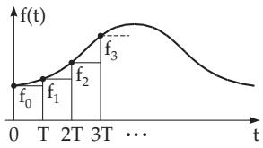

### 15.4 Z-Transformation

In natural sciences and also in engineering one often has to distinguish between continuous and discrete processes. While continuous processes can be described by diferential equations, the discrete processes result mostly in diference equations. The solution of diferential equations mostly uses Fourier and Laplace transformations, however, to solve diference equations other operator methods have been developed. The best known method is the z-transformation, which is closely related to the Laplace transformation.

#### 15.4.1 Properties of the Z-Transformation

##### 15.4.1.1 Discrete Functions

  
Figure 15.27

If a function $f ( t ) ~ \left( 0 \leq t < \infty \right)$ is known only at discrete values $t _ { n } = n T \ ( n = 0 , 1 , 2 , . . . \ ; \ T > 0$ is a constant) of the argument, then one writes $f ( n T ) ~ = ~ f _ { n }$ and forms the sequence $\left\{ f _ { n } \right\}$ . Such a sequence is produced, e.g., in electrotechnics by $\mathrm { \ddot { \ s c a n n i n g } ^ { \mathrm { 3 } } }$ a function $f ( t )$ at discrete time periods $t _ { n }$ . Its representation results in a step function (Fig. 15.27).

The sequence $\left\{ f _ { n } \right\}$ and the function $f ( n T )$ defined only at discrete points of the argument, which is called a discrete function, are equivalent.

##### 15.4.1.2 Definition of the Z-Transformation

1. Original Sequence and Transform

The infinite series

$$
F ( z ) = \sum _ { n = 0 } ^ { \infty } f _ { n } \left( { \frac { 1 } { z } } \right) ^ { n }\tag{15.105}
$$

is assigned to the sequence $\left\{ f _ { n } \right\}$ . If this series is convergent, then the sequence $\left\{ f _ { n } \right\}$ is called z-transformable, and it is denoted by

$$
F ( z ) = { \mathcal { Z } } \{ f _ { n } \}\tag{15.106}
$$

$\left\{ f _ { n } \right\}$ is called the original sequence, $F ( z )$ is the transform, z denotes a complex variable and $F ( z )$ is a complex-valued function.

$f _ { n } = 1 \ ( n = 0 , 1 , 2 , . . . )$ . The corresponding infinite series is

$$
F ( z ) = \sum _ { n = 0 } ^ { \infty } \left( { \frac { 1 } { z } } \right) ^ { n } .\tag{15.107}
$$

It represents a geometric series with common ratio $1 / z ,$ , which is convergent if $\left| \frac { 1 } { z } \right| < 1$ and its sum is $F ( z ) = { \frac { z } { z - 1 } }$ . It is divergent for $\left| \frac { 1 } { z } \right| \geq 1$ . Therefore, the sequence 1 is z-transformable for $\left| \frac { 1 } { z } \right| < 1$ 1, i.e., for every exterior point of the unit circle $| z | = 1$ in the z plane.

2. Properties

Since the transform $F ( z )$ according to (15.105) is a power series of the complex variable $1 / z$ , the properties of the complex power series (see 14.3.1.3, p. 750) imply the following results:

a) For a z-transformable sequence $\left\{ f _ { n } \right\}$ , there exists a real number R such that the series (15.105) is absolutely convergent for $| z | > 1 / \dot { R }$ and divergent for $| z | < 1 / R$ . The series is uniformly convergent for $| z | \geq 1 / R _ { 0 } > \breve { 1 } / R$ . R is the radius of convergence of the power series (15.105) of $1 / z$ . If the series is convergent for every $| z | > 0$ , then $R = \infty$ . For non z-transformable sequences there is $R = 0$

b) If $\left\{ f _ { n } \right\}$ is z-transformable for $| z | > 1 / R$ , then the corresponding transform $F ( z )$ is an analytic function for $| z | > 1 / R$ and it is the unique transform of $\left\{ f _ { n } \right\}$ . Conversely, if $F ( z )$ is an analytic function for $| z | > 1 / R$ and is regular also at $z = \infty$ , then there is a unique original sequence $\left\{ f _ { n } \right\}$ for $F ( z )$ Here, $F ( z )$ is called regular at $z = \infty$ , if $F ( z )$ has a power series expansion in the form (15.105) and $F ( \infty ) = \dot { f } _ { 0 }$

3. Limit Theorems

Analogously to the limit properties of the Laplace transformation ((15.7b), p. 770), the following limit theorems are valid for the z-transformation:

a) If $F ( z ) = { \mathcal { Z } } \{ f _ { n } \}$ exists, then

$$
f _ { 0 } = \operatorname* { l i m } _ { z \to \infty } F ( z ) .\tag{15.108}
$$

Here z can tend to infinity along the real axis or along any other path. Since the series

$$
z \{ F ( z ) - f _ { 0 } \} = f _ { 1 } + f _ { 2 } \frac { 1 } { z } + f _ { 3 } \frac { 1 } { z ^ { 2 } } + \cdots ,\tag{15.109}
$$

$$
z ^ { 2 } \left\{ F ( z ) - f _ { 0 } - \frac { 1 } { z } \right\} = f _ { 2 } + f _ { 3 } \frac { 1 } { z } + f _ { 4 } \frac { 1 } { z ^ { 2 } } + \cdots ,\tag{15.110}
$$

are obviously z transforms, analogously to (15.108) one gets

$$
f _ { 1 } = \operatorname * { l i m } _ { z \to \infty } z \{ F ( z ) - f _ { 0 } \} , \qquad f _ { 2 } = \operatorname * { l i m } _ { z \to \infty } z ^ { 2 } \Big \{ F ( z ) - f _ { 0 } - f _ { 1 } \frac { 1 } { z } \Big \} , \dots .\tag{15.111}
$$

The original sequence $\left\{ f _ { n } \right\}$ can be determined from its transform $F ( z )$ in this way. b) $\operatorname { I f } \operatorname* { l i m } _ { n \to \infty } f _ { n }$ exists, then

$$
\operatorname* { l i m } _ { n \to \infty } f _ { n } = \operatorname* { l i m } _ { z \to 1 + 0 } ( z - 1 ) F ( z ) .\tag{15.112}
$$

However the value $\operatorname* { l i m } _ { n \to \infty } f _ { n }$ from (15.112) can be determined only if its existence is guaranteed, since the above statement is not reversible.

■ $f _ { n } = ( - 1 ) ^ { n } ( n = 0 , 1 , 2 , . . . )$ . Then ${ \mathcal { Z } } \{ f _ { n } \} = { \frac { z } { z + 1 } }$ and $\operatorname* { l i m } _ { z  1 + 0 } ( z - 1 ) \frac { z } { z + 1 } = 0$ , but $\operatorname* { l i m } _ { n \to \infty } ( - 1 ) ^ { n }$ does not exist.

##### 15.4.1.3 Rules of Calculations

In applications of the z-transformation it is very important to know how certain operations defined on the original sequences afect the transforms, and conversely. For the sake of simplicity here the notation $F ( z ) = { \mathcal { Z } } \{ f _ { n } \}$ for $| z | > 1 / R$ is used.

1. Translation

Forward and backward translations are distinguished.

1. First Shifting Theorem: fn k = z−kF(z) (k = 0, 1, 2, . . .) ,

(15.113)

here $f _ { n - k } = 0$ is defined for $n - k < 0$

$$
2 . \quad \operatorname { S e c o n d } \operatorname { S h i f t i n g } \operatorname { T h e o r e m : } \quad { \mathcal { Z } } \{ f _ { n + k } \} = z ^ { k } \left[ F ( z ) - \sum _ { \nu = 0 } ^ { k - 1 } f _ { \nu } \left( { \frac { 1 } { z } } \right) ^ { \nu } \right] \qquad ( k = 1 , 2 , \dots ) .\tag{15.114}
$$

2. Summation

For $| z | > \operatorname* { m a x } \left( 1 , \frac { 1 } { R } \right)$

$$
{ \mathcal Z } \left\{ \sum _ { \nu = 0 } ^ { n - 1 } f _ { \nu } \right\} = \frac { 1 } { z - 1 } F ( z ) .\tag{15.115}
$$

3. Diferences

For the diferences

$$
\Delta f _ { n } = f _ { n + 1 } - f _ { n } , \quad \Delta ^ { m } f _ { n } = \Delta ( \Delta ^ { m - 1 } f _ { n } ) \qquad ( m = 1 , 2 , \ldots ; \Delta ^ { 0 } f _ { n } = f _ { n } ) |
$$

the following equalities hold

(15.116)

$$
\begin{array} { r c l } { { \mathcal Z \{ \Delta f _ { n } \} } } & { { = } } & { { ( z - 1 ) F ( z ) - z f _ { 0 } , } } \\ { { \mathcal Z \{ \Delta ^ { 2 } f _ { n } \} } } & { { = } } & { { ( z - 1 ) ^ { 2 } F ( z ) - z ( z - 1 ) f _ { 0 } - z \Delta f _ { 0 } , } } \\ { { \vdots } } & { { = } } & { { \vdots } } \\ { { \mathcal Z \{ \Delta ^ { k } f _ { n } \} } } & { { = } } & { { ( z - 1 ) ^ { k } F ( z ) - z \displaystyle \sum _ { \nu = 0 } ^ { k - 1 } ( z - 1 ) ^ { k - \nu - 1 } \Delta ^ { \nu } f _ { 0 } . } } \end{array}\tag{15.117}
$$

4. Damping For an arbitrary complex number $\lambda \neq 0$ and $| z | > \frac { | \lambda | } { R }$

$$
{ \mathcal { Z } } \{ \lambda ^ { n } f _ { n } \} = F \left( { \frac { z } { \lambda } } \right) .\tag{15.118}
$$

5. Convolution

The convolution of two sequences $\left\{ f _ { n } \right\}$ and $\left\{ g _ { n } \right\}$ is the operation

$$
f _ { n } * g _ { n } = \sum _ { \nu = 0 } ^ { n } f _ { \nu } g _ { n - \nu } .\tag{15.119}
$$

If the z-transformed functions ${ \mathcal { Z } } \{ f _ { n } \} = F ( z )$ for $| z | > 1 / R _ { 1 }$ and ${ \mathcal { Z } } \{ g _ { n } \} = G ( z )$ for $| z | > 1 / R _ { 2 }$ exist, then

$$
{ \mathcal { Z } } \{ f _ { n } * g _ { n } \} = F ( z ) G ( z )\tag{15.120}
$$

for $| z | > \operatorname* { m a x } { \left( \frac { 1 } { R _ { 1 } } , \frac { 1 } { R _ { 2 } } \right) }$ . Relation (15.120) is called the convolution theorem of the z-transformation.   
It corresponds to the rules of multiplying two power series.

6. Diferentiation of the Transform

$$
{ \mathcal { Z } } \{ n f _ { n } \} = - z { \frac { d F ( z ) } { d z } } .\tag{15.121}
$$

Higher-order derivatives of $F ( z )$ can be determined by the repeated application of (15.121).

7. Integration of the Transform

Under the assumption $f _ { 0 } = 0$

$$
{ \mathcal { Z } } \left\{ { \frac { f _ { n } } { n } } \right\} = \int _ { z } ^ { \infty } { \frac { F ( \xi ) } { \xi } } d \xi .\tag{15.122}
$$

##### 15.4.1.4 Relation to the Laplace Transformation

Describing a discrete function $f ( t )$ (see 15.4.1.1, p. 794) as a step function, then

$$
f ( t ) = f ( n T ) = f _ { n } \qquad \mathrm { f o r } \quad n T \leq t < ( n + 1 ) T \quad ( n = 0 , 1 , 2 , \ldots ; T > 0 , T \ \mathrm { c o n s t } )\tag{15.123}
$$

holds. Using the Laplace transformation (see 15.2.1.1, 1., p. 770) for this piecewise constant function, for $T = 1$ yields:

$$
\mathcal { L } \{ f ( t ) \} = F ( p ) = \sum _ { n = 0 } ^ { \infty } \int _ { n } ^ { } f _ { n } e ^ { - p t } d t = \sum _ { n = 0 } ^ { \infty } f _ { n } \frac { e ^ { - n p } - e ^ { - ( n + 1 ) p } } { p } = \frac { 1 - e ^ { - p } } { p } \sum _ { n = 0 } ^ { \infty } f _ { n } e ^ { - n p } .\tag{15.124}
$$

The infinite series in (15.124) is called the discrete Laplace transformation and is denoted by $\mathcal { D } \mathrm { : }$

$$
{ \mathcal { D } } \{ f ( t ) \} = { \mathcal { D } } \{ f _ { n } \} = \sum _ { n = 0 } ^ { \infty } f _ { n } e ^ { - n p } .\tag{15.125}
$$

After the substitution of $e ^ { p } = z$ in (15.125) $\mathcal { D } \{ f _ { n } \}$ represents a series with powers of $1 / z$ , which is a so-called Laurent series (see 14.3.4, p. 752). The substitution $e ^ { p } = z { \mathrm { ~ s u g g e s t e d } }$ the name of the z transformation. With this substitution from (15.124) one finally gets the following relations between the Laplace and z-transformation in the case of step functions:

$$
p F ( p ) = \left( 1 - { \frac { 1 } { z } } \right) F ( z ) \ \mathrm { ( 1 5 . 1 2 6 a ) }
$$

$$
\mathrm { o r } \quad p \mathcal { L } \{ f ( t ) \} = \left( 1 - \frac { 1 } { z } \right) \mathcal { Z } \{ f _ { n } \} .\tag{15.126b}
$$

In this way the relations of z-transforms of step functions (see Table 21.15, p. 1128) can be transformed into relations of Laplace transforms of step functions (see Table 21.13, p. 1109), and conversely.

##### 15.4.1.5 Inverse of the Z-Transformation

The inverse of the z-transformation is to find the corresponding unique original sequence $\left\{ f _ { n } \right\}$ from its transform $F ( z )$

$$
{ \mathcal { Z } } ^ { - 1 } \{ F ( z ) \} = \{ f _ { n } \} .\tag{15.127}
$$

There are diferent possibilities for the inverse transformation.

1. Using Tables

If the function $F ( z )$ is not given in tables, then one can try to transform it to a function which is given in Table 21.15.

2. Laurent Series of $F ( z )$

Using the definition (15.105), p. 794 the inverse transform can be determined directly if a series expansion of $F ( z )$ with respect to $1 / z$ is known or if it can be determined.

3. Taylor Series of $F \left( { \frac { 1 } { z } } \right)$

Since $F \left( { \frac { 1 } { z } } \right)$ is a series of increasing powers of $z ,$ from (15.105) and using the Taylor formula follows

$$
f _ { n } = { \frac { 1 } { n ! } } { \frac { d ^ { n } } { d z ^ { n } } } F \left( { \frac { 1 } { z } } \right) \Big | _ { z = 0 } \quad ( n = 0 , 1 , 2 , \ldots ) .\tag{15.128}
$$

4. Application of Limit Theorems

Using the limits (15.108) and (15.111), p. 795, the original sequence $\left\{ f _ { n } \right\}$ can be directly determined from its transform $F ( z )$

$F ( z ) = \frac { 2 z } { ( z - 2 ) ( z - 1 ) ^ { 2 } }$ . Using the previous four methods:

1. Partial fraction decomposition (see 1.1.7.3, p. 15) of $F ( z ) / z$ yields functions which are contained in Table 21.15.

$$
{ \frac { F ( z ) } { z } } = { \frac { 2 } { ( z - 2 ) ( z - 1 ) ^ { 2 } } } = { \frac { A } { z - 2 } } + { \frac { B } { ( z - 1 ) ^ { 2 } } } + { \frac { C } { z - 1 } } . \quad { \mathrm { S o } }
$$

$$
F ( z ) = { \frac { 2 z } { z - 2 } } - { \frac { 2 z } { ( z - 1 ) ^ { 2 } } } - { \frac { 2 z } { z - 1 } } \quad { \mathrm { a n d ~ t h e r e f o r e } } \quad f _ { n } = 2 ( 2 ^ { n } - n - 1 ) \quad { \mathrm { f o r ~ } } n \geq 0 .
$$

2. By division $F ( z )$ gets a series with decreasing powers of z:

$$
F ( z ) = \frac { 2 z } { z ^ { 3 } - 4 z ^ { 2 } + 5 z - 2 } = 2 \frac { 1 } { z ^ { 2 } } + 8 \frac { 1 } { z ^ { 3 } } + 2 2 \frac { 1 } { z ^ { 4 } } + 5 2 \frac { 1 } { z ^ { 5 } } + 1 1 4 \frac { 1 } { z ^ { 6 } } + \dots .\tag{15.129}
$$

From this expression one gets $f _ { 0 } = f _ { 1 } = 0 , \ f _ { 2 } = 2 , \ f _ { 3 } = 8 , \ f _ { 4 } = 2 2 , \ f _ { 5 } = 5 2 , \ f _ { 6 } = 1 1 4 , \ . . . ,$ but not a closed expression is obtained for the general term $f _ { n }$

3. For formulating $F \left( { \frac { 1 } { z } } \right)$ and its required derivatives, (see (15.128)) it is advisable to consider the

partial fraction decomposition of $F ( z )$

$$
\begin{array} { r } { \begin{array} { r l } { F \left( \displaystyle \frac { 1 } { z } \right) } & { = \displaystyle \frac { 2 } { 1 - 2 z } - \frac { 2 z } { ( 1 - z ) ^ { 2 } } - \frac { 2 } { 1 - z } , \qquad \mathrm { i . e . } \quad F \left( \displaystyle \frac { 1 } { z } \right) = 0 \quad \mathrm { ~ f o r ~ } z = 0 \ : , } \end{array} } \end{array}
$$

$$
\frac { d F \left( \frac { 1 } { z } \right) } { d z } \ = \frac { 4 } { ( 1 - 2 z ) ^ { 2 } } - \frac { 4 z } { ( 1 - z ) ^ { 3 } } - \frac { 4 } { ( 1 - z ) ^ { 2 } } , \ \mathrm { i . e . } \ \frac { d F \left( \frac { 1 } { z } \right) } { d z } = 0 \quad \mathrm { f o r } \ z = 0 ,
$$

$$
\frac { d ^ { 2 } F \left( \frac { 1 } { z } \right) } { d z ^ { 2 } } = \frac { 1 6 } { ( 1 - 2 z ) ^ { 3 } } - \frac { 1 2 z } { ( 1 - z ) ^ { 4 } } - \frac { 1 2 } { ( 1 - z ) ^ { 3 } } , \mathrm { ~ i . e . ~ } \frac { d ^ { 2 } F \left( \frac { 1 } { z } \right) } { d z ^ { 2 } } = 4 \mathrm { f o r ~ } z = 0 , \left. \frac { 1 } { z ^ { 2 } } \right. = 0 .\tag{15.130}
$$

$$
{ \frac { d ^ { 3 } F \left( { \frac { 1 } { z } } \right) } { d z ^ { 3 } } } = { \frac { 9 6 } { ( 1 - 2 z ) ^ { 4 } } } - { \frac { 4 8 z } { ( 1 - z ) ^ { 5 } } } - { \frac { 4 8 } { ( 1 - z ) ^ { 4 } } } , { \mathrm { ~ i . e . ~ } } \cdot { \frac { d ^ { 3 } F \left( { \frac { 1 } { z } } \right) } { d z ^ { 3 } } } = 4 8 { \mathrm { ~ f o r ~ } } z = 0 , \left. { \begin{array} { r l r } { \left[ { \frac { 3 } { z } } \right] } & { { \mathrm { ~ i . e . ~ } } } & { 0 } \\ { \vdots } & { \vdots } & { \vdots } \\ { \vdots } & { } & { \vdots } \end{array} } \right\}
$$

from which $f _ { 0 } , \ f _ { 1 } , \ f _ { 2 } , \ f _ { 3 } , \ . . .$ . are easily obtained considering (15.128).

4. Application of the limit theorems (see 15.4.1.2, 3., p. 795) gives:

$$
f _ { 0 } = \operatorname* { l i m } _ { z \to \infty } F ( z ) = \operatorname* { l i m } _ { z \to \infty } \frac { 2 z } { z ^ { 3 } - 4 z ^ { 2 } + 5 z - 2 } = 0 ,\tag{15.131a}
$$

$$
f _ { 1 } = \operatorname* { l i m } _ { z \to \infty } z ( F ( z ) - f _ { 0 } ) = \operatorname* { l i m } _ { z \to \infty } \frac { 2 z ^ { 2 } } { z ^ { 3 } - 4 z ^ { 2 } + 5 z - 2 } = 0 ,\tag{15.131b}
$$

$$
f _ { 2 } = \operatorname* { l i m } _ { z \to \infty } z ^ { 2 } \left( F ( z ) - f _ { 0 } - f _ { 1 } \frac { 1 } { z } \right) = \operatorname* { l i m } _ { z \to \infty } \frac { 2 z ^ { 3 } } { z ^ { 3 } - 4 z ^ { 2 } + 5 z - 2 } = 2 ,\tag{15.131c}
$$

$$
f _ { 3 } = \operatorname* { l i m } _ { z \to \infty } z ^ { 3 } \left( F ( z ) - f _ { 0 } - f _ { 1 } { \frac { 1 } { z } } - f _ { 2 } { \frac { 1 } { z ^ { 2 } } } \right) = \operatorname* { l i m } _ { z \to \infty } z ^ { 3 } \left( { \frac { 2 z } { z ^ { 3 } - 4 z ^ { 2 } + 5 z - 2 } } - { \frac { 2 } { z ^ { 2 } } } \right) = 8 , \ldots\tag{15.131d}
$$

where the Bernoulli–l’Hospital rule is applied (see 2.1.4.8, 2., p. 56). The original sequence $\left\{ f _ { n } \right\}$ can be determined successively.

#### 15.4.2 Applications of the Z-Transformation

##### 15.4.2.1 General Solution of Linear Difference Equations

A linear diference equation of order k with constant coeficients has the form

$$
a _ { k } y _ { n + k } + a _ { k - 1 } y _ { n + k - 1 } + \cdot \cdot \cdot + a _ { 2 } y _ { n + 2 } + a _ { 1 } y _ { n + 1 } + a _ { 0 } y _ { n } = g _ { n } \quad ( n = 0 , 1 , 2 \dots ) .\tag{15.132}
$$

Here k is a natural number. The coeficients $a _ { i } \ ( i = 0 , 1 , \ldots , k )$ are given real or complex numbers and they do not depend on n. Here $a _ { 0 }$ and $a _ { k }$ are non-zero numbers. The sequence $\left\{ g _ { n } \right\}$ is given, and the sequence $\left\{ y _ { n } \right\}$ is to be determined

To determine a particular solution of (15.132) the values $y _ { 0 } , y _ { 1 } , \ldots , y _ { k - 1 }$ have to be previously given. Then the next value $y _ { k }$ can be determined for $n = 0$ from (15.132). Next one gets $y _ { k + 1 }$ for $n = 1$ from $y _ { 1 } , ~ y _ { 2 } , ~ . ~ . ~ . ~ , ~ y _ { k }$ and from (15.132). In this way all values $y _ { n }$ can be calculated recursively. However a general solution can be given for the values $y _ { n }$ with the z-transformation, using the second shifting theorem (15.114) applied for (15.132):

$$
a _ { k } z ^ { k } \left[ Y ( z ) - y _ { 0 } - y _ { 1 } z ^ { - 1 } - \cdots - y _ { k - 1 } z ^ { - ( k - 1 ) } \right] + \cdots + a _ { 1 } z [ Y ( z ) - y _ { 0 } ] + a _ { 0 } Y ( z ) = G ( z ) .\tag{15.133}
$$

Here one denotes $Y ( z ) = { \mathcal { Z } } \{ y _ { n } \}$ and $G ( z ) = \mathcal { Z } \{ g _ { n } \}$ . Substituting $a _ { k } z ^ { k } + a _ { k - 1 } z ^ { k - 1 } + \cdot \cdot \cdot + a _ { 1 } z + a _ { 0 } =$ $p ( z )$ , the solution of the so-called transformed equation (15.133) is

$$
Y ( z ) = { \frac { 1 } { p ( z ) } } G ( z ) + { \frac { 1 } { p ( z ) } } \sum _ { i = 0 } ^ { k - 1 } y _ { i } \sum _ { j = i + 1 } ^ { k } a _ { j } z ^ { j - i } .\tag{15.134}
$$

As in the case of solving linear diferential equations with the Laplace transformation, there is the similar advantage of the z-transformation that initial values are included in the transformed equation, so the solution contains them automatically. The required solution $\{ y _ { n } \} = \mathcal { Z } ^ { - 1 } \{ Y ( z ) \}$ follows from (15.134) by the inverse transformation discussed in 15.4.1.5, p. 797.

##### 15.4.2.2 Second-Order Difference Equations (Initial Value Problem)

The linear second-order diference equation has the form

$$
y _ { n + 2 } + a _ { 1 } y _ { n + 1 } + a _ { 0 } y _ { n } = g _ { n } ,\tag{15.135}
$$

where $y _ { 0 }$ and $y _ { 1 }$ are given as initial values. Using the second shifting theorem for (15.135) the transformed equation is

$$
z ^ { 2 } \left[ Y ( z ) - y _ { 0 } - y _ { 1 } { \frac { 1 } { z } } \right] + a _ { 1 } z [ Y ( z ) - y _ { 0 } ] + a _ { 0 } Y ( z ) = G ( z ) .\tag{15.136}
$$

Substituting $z ^ { 2 } + a _ { 1 } z + a _ { 0 } = p ( z )$ , the transform is

$$
Y ( z ) = { \frac { 1 } { p ( z ) } } G ( z ) + y _ { 0 } { \frac { z ( z + a _ { 1 } ) } { p ( z ) } } + y _ { 1 } { \frac { z } { p ( z ) } } .\tag{15.137}
$$

If the roots of the polynomial $p ( z )$ are $\alpha _ { 1 }$ and $\alpha _ { 2 }$ , then $\alpha _ { 1 } \neq 0$ and $\alpha _ { 2 } \neq 0 ,$ otherwise $a _ { 0 }$ is zero, and then the diference equation could be reduced to a first-order one. By partial fraction decomposition and applying Table 21.15 for the z-transformation one gets from

$$
\frac { z } { p ( z ) } = \left\{ \begin{array} { c c } { \displaystyle \frac { 1 } { \alpha _ { 1 } - \alpha _ { 2 } } \left( \frac { z } { z - \alpha _ { 1 } } - \frac { z } { z - \alpha _ { 2 } } \right) } & { \mathrm { f o r } \ \alpha _ { 1 } \neq \alpha _ { 2 } , } \\ { \displaystyle \frac { z } { ( z - \alpha _ { 1 } ) ^ { 2 } } } & { \mathrm { f o r } \ \alpha _ { 1 } = \alpha _ { 2 } , } \end{array} \right.
$$

$$
\mathcal { Z } ^ { - 1 } \left\{ \frac { z } { p ( z ) } \right\} = \{ p _ { n } \} = \left\{ \begin{array} { l l } { \displaystyle \frac { \alpha _ { 1 } ^ { n } - \alpha _ { 2 } ^ { n } } { \alpha _ { 1 } - \alpha _ { 2 } } \quad \mathrm { f o r } \alpha _ { 1 } \neq \alpha _ { 2 } , } \\ { \displaystyle n \alpha _ { 1 } ^ { n - 1 } \quad \mathrm { f o r } \alpha _ { 1 } = \alpha _ { 2 } . } \end{array} \right.\tag{15.138a}
$$

Since $p _ { 0 } = 0$ , by the second shifting theorem there is

$$
\mathcal { Z } ^ { - 1 } \left\{ \frac { z ^ { 2 } } { p ( z ) } \right\} = \mathcal { Z } ^ { - 1 } \left\{ z \frac { z } { p ( z ) } \right\} = \{ p _ { n + 1 } \}\tag{15.138b}
$$

and by the first shifting theorem

$$
{ \mathcal { Z } } ^ { - 1 } \left\{ { \frac { 1 } { p ( z ) } } \right\} = { \mathcal { Z } } ^ { - 1 } \left\{ { \frac { 1 } { z } } { \frac { z } { p ( z ) } } \right\} = \{ p _ { n - 1 } \} .\tag{15.138c}
$$

Substituting here $p _ { - 1 } = 0$ , based on the convolution theorem one gets the original sequence with

$$
y _ { n } = \sum _ { \nu = 0 } ^ { n } p _ { \nu - 1 } g _ { n - \nu } + y _ { 0 } ( p _ { n + 1 } + a _ { 1 } p _ { n } ) + y _ { 1 } p _ { n } .\tag{15.138d}
$$

Since $p _ { - 1 } = p _ { 0 } = 0$ , this relation and (15.138a) imply that in the case of $\alpha _ { 1 } \neq \alpha _ { 2 }$ it follows

$$
y _ { n } = \sum _ { \nu = 2 } ^ { n } g _ { n - \nu } { \frac { \alpha _ { 1 } ^ { \nu - 1 } - \alpha _ { 2 } ^ { \nu - 1 } } { \alpha _ { 1 } - \alpha _ { 2 } } } + y _ { 0 } \left( { \frac { \alpha _ { 1 } ^ { n + 1 } - \alpha _ { 2 } ^ { n + 1 } } { \alpha _ { 1 } - \alpha _ { 2 } } } + a _ { 1 } { \frac { \alpha _ { 1 } ^ { n } - \alpha _ { 2 } ^ { n } } { \alpha _ { 1 } - \alpha _ { 2 } } } \right) + y _ { 1 } { \frac { \alpha _ { 1 } ^ { n } - \alpha _ { 2 } ^ { n } } { \alpha _ { 1 } - \alpha _ { 2 } } } .\tag{15.138e}
$$

This form can be further simplified, since $a _ { 1 } = - ( \alpha _ { 1 } + \alpha _ { 2 } )$ and $a _ { 0 } = \alpha _ { 1 } \alpha _ { 2 }$ (see the root theorems of Vieta, 1.6.3.1, 3., p. 44), so

$$
y _ { n } = \sum _ { \nu = 2 } ^ { n } g _ { n - \nu } \frac { \alpha _ { 1 } ^ { \nu - 1 } - \alpha _ { 2 } ^ { \nu - 1 } } { \alpha _ { 1 } - \alpha _ { 2 } } - y _ { 0 } a _ { 0 } \frac { \alpha _ { 1 } ^ { n - 1 } - \alpha _ { 2 } ^ { n - 1 } } { \alpha _ { 1 } - \alpha _ { 2 } } + y _ { 1 } \frac { \alpha _ { 1 } ^ { n } - \alpha _ { 2 } ^ { n } } { \alpha _ { 1 } - \alpha _ { 2 } } .\tag{15.138f}
$$

In the case of $\alpha _ { 1 } = \alpha _ { 2 }$ similarly

$$
y _ { n } = \sum _ { \nu = 2 } ^ { n } g _ { n - \nu } ( \nu - 1 ) \alpha _ { 1 } ^ { \nu - 2 } - y _ { 0 } a _ { 0 } ( n - 1 ) \alpha _ { 1 } ^ { n - 2 } + y _ { 1 } n \alpha _ { 1 } ^ { n - 1 } .\tag{15.138g}
$$

In the case of second-order diference equations the inverse transformation of the transform $Y ( z )$ can be performed without partial fraction decomposition using correspondences such as, e.g.,

$$
{ \mathcal { Z } } ^ { - 1 } \left\{ { \frac { z } { z ^ { 2 } - 2 a z \cosh b + a ^ { 2 } } } \right\} = a ^ { n - 1 } { \frac { \sinh b n } { \sinh n } }\tag{15.139}
$$

and the second shifting theorem. By substituting $a _ { 1 } = - 2$ a cosh b, and $a _ { 0 } = a ^ { 2 }$ the original sequence of (15.137) becomes:

$$
y _ { n } = { \frac { 1 } { \sinh b } } \left[ \sum _ { \nu = 2 } ^ { n } g _ { n - \nu } a ^ { \nu - 2 } \sinh ( \nu - 1 ) b - y _ { 0 } a ^ { n } \sinh ( n - 1 ) b + y _ { 1 } a ^ { n - 1 } \sinh n b \right] .\tag{15.140}
$$

This formula is useful in numerical computations especially if $a _ { 0 }$ and $a _ { 1 }$ are complex numbers.

Remark: Notice that the hyperbolic functions are also defined for complex variables.

##### 15.4.2.3 Second-Order Difference Equations (Boundary Value Problem)

It often happens in applications that the values $y _ { n }$ of a diference equation are needed only for a finite number of indices $0 \leq n \leq N$ . In the case of a second-order diference equation (15.135) both boundary values $y _ { 0 }$ and $y _ { N }$ are usually given. To solve this boundary value problem one starts with the solution (15.138f) of the corresponding initial value problem, where instead of the unknown value $y _ { 1 }$ it is to introduce $y _ { N }$ . Substituting $n = N$ into (15.138f), $y _ { 1 }$ can be obtained which depends on $y _ { 0 }$ and $y _ { N } \colon$

$$
y _ { 1 } = \frac { 1 } { \alpha _ { 1 } ^ { N } - \alpha _ { 2 } ^ { N } } \left[ y _ { 0 } a _ { 0 } ( \alpha _ { 1 } ^ { N - 1 } - \alpha _ { 2 } ^ { N - 1 } ) + y _ { N } ( \alpha _ { 1 } - \alpha _ { 2 } ) - \sum _ { \nu = 2 } ^ { N } ( \alpha _ { 1 } ^ { \nu - 1 } - \alpha _ { 2 } ^ { \nu - 1 } ) g _ { N - \nu } \right] .\tag{15.141}
$$

Substituting this value into (15.138f)

$$
\begin{array} { l } { { y _ { n } = \displaystyle \frac { 1 } { \alpha _ { 1 } - \alpha _ { 2 } } \sum _ { \nu = 2 } ^ { n } ( \alpha _ { 1 } ^ { \nu - 1 } - \alpha _ { 2 } ^ { \nu - 1 } ) g _ { n - \nu } - \displaystyle \frac { 1 } { \alpha _ { 1 } - \alpha _ { 2 } } \frac { \alpha _ { 1 } ^ { n } - \alpha _ { 2 } ^ { n } } { \alpha _ { 1 } ^ { N } - \alpha _ { 2 } ^ { N } } \sum _ { \nu = 2 } ^ { N } ( \alpha _ { 1 } ^ { \nu - 1 } - \alpha _ { 2 } ^ { \nu - 1 } ) g _ { N - \nu } } } \\ { { \displaystyle \quad \quad + \frac { 1 } { \alpha _ { 1 } ^ { N } - \alpha _ { 2 } ^ { N } } [ y _ { 0 } ( \alpha _ { 1 } ^ { N } \alpha _ { 2 } ^ { n } - \alpha _ { 1 } ^ { n } \alpha _ { 2 } ^ { N } ) + y _ { N } ( \alpha _ { 1 } ^ { n } - \alpha _ { 2 } ^ { n } ) ] . } } \end{array}\tag{15.142}
$$

The solution (15.142) makes sense only if $\alpha _ { 1 } ^ { N } - \alpha _ { 2 } ^ { N } \neq 0$ holds. Otherwise, the boundary value problem has no general solution, but analogously to the boundary value problems of diferential equations eigenvalues and eigenfunctions emerge.
