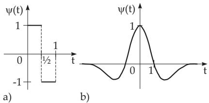
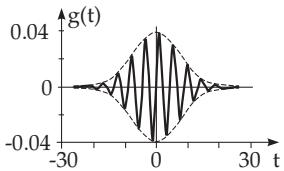

### 15.5 Wavelet Transformation

#### 15.5.1 Signals

If a physical object emits an efect which spreads out and can be described mathematically, $\mathrm { e . g . }$ , by a function or a number sequence, then it is called a signal.

Signal analysis means to characterize a signal by a quantity that is typical for the signal. This means mathematically: The function or the number sequence, which describes the signal, will be mapped into another function or number sequence, from which the typical properties of the signal can be clearly seen. For such mappings, of course, some informations can also be lost.

The reverse operation of signal analysis, i.e., the reconstruction of the original signal, is called signal synthesis.

The connection between signal analysis and signal synthesis can be well represented by an example of Fourier transformation: A signal f(t) (t denotes time) is characterized by the frequency $\omega .$ . Then, formula (15.143a) describes the signal analysis, and formula (15.143b) describes the signal synthesis:

$$
F ( \omega ) = \int _ { - \infty } ^ { \infty } e ^ { - \mathrm { i } \omega t } f ( t ) d t \qquad \quad ( 1 5 . 1 4 3 \mathrm { a } ) \quad \mathrm { a n d } \quad f ( t ) = \frac { 1 } { 2 \pi } \int _ { - \infty } ^ { \infty } e ^ { \mathrm { i } \omega t } F ( \omega ) d \omega .\tag{15.143b}
$$

#### 15.5.2 Wavelets

The Fourier transformation has no localization property, i.e., if a signal changes at one position, then the transform changes everywhere without the possibility that the position of the change could be recognized “at a glance”. The basis of this fact is that the Fourier transformation decomposes a signal into plane waves. These are described by trigonometric functions, which oscillate with the same period for arbitrary long time. However, for wavelet transformations there is an almost freely chosen function $\psi ,$ , the wavelet (small localized wave), that is shifted and compressed for analysing a signal.

Examples are the Haar wavelet (Fig. 15.28a) and the Mexican hat (Fig. 15.28b).

A Haar wavelet:

$$
\psi = { \left\{ \begin{array} { l l } { 1 } & { { \mathrm { i f } } } & { 0 \leq x < { \frac { 1 } { 2 } } , } \\ { - 1 } & { { \mathrm { i f } } } & { { \frac { 1 } { 2 } } \leq x \leq 1 , } \\ { 0 } & { { \mathrm { o t h e r w i s e . } } } & { } \end{array} \right. }\tag{15.144}
$$

⎩B Mexican hat:

$$
\begin{array} { l } { \displaystyle \psi ( \boldsymbol { x } ) = - \frac { d ^ { 2 } } { d x ^ { 2 } } e ^ { - x ^ { 2 } / 2 } } \\ { = ( 1 - x ^ { 2 } ) e ^ { - x ^ { 2 } / 2 } . } \end{array}\tag{15.145}
$$

(15.146)

  
Figure 15.28

Generally, it holds that every function $\psi$ comes into consideration as a wavelet if it is quadratically integrable and its Fourier transform $\Psi ( \omega )$ according to (15.143a) results in a positive finite integral

$$
\int _ { - \infty } ^ { \infty } { \frac { | \Psi ( \omega ) | } { | \omega | } } d \omega .\tag{15.147}
$$

Concerning wavelets, the following properties and definitions are essential:

1. For the mean value of the wavelet:

$$
\intop _ { - \infty } ^ { \infty } \psi ( t ) d t = 0 .\tag{15.148}
$$

2. The following integral is called the k-th moment of a wavelet $\psi :$

$$
\mu _ { k } = \intop _ { - \infty } ^ { \infty } t ^ { k } \psi ( t ) d t .\tag{15.149}
$$

The smallest positive integer n such that $\mu _ { n } \neq 0$ , is called the order of the wavelet $\psi .$

For the Haar wavelet (15.144), n = 1, and for the Mexican hat (15.146), $n = 2$

3. When $\mu _ { k } = 0$ for every k, ψ has infinite order. Wavelets with bounded support always have finite order.

4. A wavelet of order n is orthogonal to every polynomial of degree $\leq n - 1$

#### 15.5.3 Wavelet Transformation

For a wavelet $\psi ( t )$ a family of curves can be formed with parameter a:

$$
\psi _ { a } ( t ) = { \frac { 1 } { \sqrt { | a | } } } \psi \left( { \frac { t } { a } } \right) \qquad ( a \neq 0 ) .\tag{15.150}
$$

In the case of $| a | > 0$ the initial function $\psi ( t )$ is compressed. In the case of $a < 0$ there is an additional reflection. The factor $1 / { \sqrt { | a | } }$ is a scaling factor.

The functions $\psi _ { a } ( t )$ can also be shifted by a second parameter b. Then a two-parameter family of curves arises:

$$
\psi _ { a , b } = { \frac { 1 } { \sqrt { | a | } } } \psi \left( { \frac { t - b } { a } } \right) \qquad ( a , b \operatorname { r e a l } ; a \neq 0 ) .\tag{15.151}
$$

The real shifting parameter b characterizes the first moment, while parameter a gives the deviation of the function $\psi _ { a , b } ( t )$ . The function $\psi _ { a , b } ( t )$ is called a basis function in connection to the wavelet transformation.

The wavelet transformation of a function $f ( t )$ is defined as:

$$
{ \mathcal { L } } _ { \psi } f ( a , b ) = c \intop _ { - \infty } ^ { \infty } f ( t ) \psi _ { a , b } ( t ) d t = { \frac { c } { \sqrt { \left| a \right| } } } \intop _ { - \infty } ^ { \infty } f ( t ) \psi \left( { \frac { t - b } { a } } \right) d t .\tag{15.152a}
$$

For the inverse transformation:

$$
f ( t ) = c \int \displaylimits _ { - \infty } ^ { \infty } \int \displaylimits _ { - \infty } ^ { \infty } \int \displaylimits _ { - \infty } ^ { } f ( t ) \psi _ { a , b } ( t ) \frac { 1 } { a ^ { 2 } } d a d b .\tag{15.152b}
$$

Here c is a constant dependent on the special wavelet $\psi .$

Using the Haar wavelets (15.146) gives

$$
\psi \left( { \frac { t - b } { a } } \right) = { \left\{ \begin{array} { l l } { 1 } & { { \mathrm { i f } } ~ b \leq t < b + a / 2 , } \\ { - 1 } & { { \mathrm { i f } } ~ b + a / 2 \leq t < b + a , } \\ { 0 } & { { \mathrm { o t h e r w i s e } } } \end{array} \right. }
$$

and therefore

$$
\begin{array} { l } { \displaystyle \mathcal { L } _ { \psi } f ( a , b ) = \frac { 1 } { \sqrt { | a | } } \left( \int _ { b } ^ { b + a / 2 } f ( t ) d t - \int _ { b + a / 2 } ^ { b + a } f ( t ) d t \right) } \\ { \displaystyle \qquad = \frac { \sqrt { | a | } } { 2 } \left( \frac { 2 } { a } \int _ { b } ^ { b + a / 2 } f ( t ) d t - \frac { 2 } { a } \int _ { b + a / 2 } ^ { b + a } f ( t ) d t \right) . } \end{array}\tag{15.153}
$$

The value $\mathcal { L } _ { \psi } f ( a , b )$ given in (15.153) represents the diference of the mean values of a function $f ( t )$ over two neighboring intervals of length $\frac { | a | } { 2 }$ , connected at the point b.

Remarks:

1. The dyadic wavelet transformation has an important role in applications. As basis functions are used the functions

$$
\psi _ { i , j } ( t ) = { \frac { 1 } { \sqrt { 2 ^ { i } } } } \psi \left( { \frac { t - 2 ^ { i } j } { 2 ^ { i } } } \right) ,\tag{15.154}
$$

i.e., diferent basis functions can be generated from one wavelet $\psi ( t )$ by doubling or halving the width and shifting by an integer multiple of the width.

2. A wavelet $\psi ( t )$ is called an orthogonal wavelet, if the basis functions given in (15.154) form an orthogonal system.

3. The Daubechies wavelets have especially good numerical properties. They are orthogonal wavelets with compact support, i.e., they are diferent from zero only on a bounded subset of the time scale.

They do not have a closed form representation (see [15.9]).

#### 15.5.4 Discrete Wavelet Transformation

##### 15.5.4.1 Fast Wavelet Transformation

The integral representation (15.152b) is very redundant, and so the double integral can be replaced by a double sum without loss of information. Considering this idea at the concrete application of the wavelet transformation one needs

1. an eficient algorithm of the transformation, which leads to the concept of multi-scale analysis, and 2. an eficient algorithm of the inverse transformation, i.e., an eficient way to reconstruct signals from their wavelet transformations, which leads to the concept of frames.

For more details about these concepts see [15.9], [15.1].

Remark: The great success of wavelets in many diferent applications, such as

calculation of physical quantities from measured sequences

pattern and voice recognition

data compression in news transmission

is based on “fast algorithms”. Analogously to the FFT (Fast Fourier Transformation, see 19.6.4.2, p. 993) one talks here about FWT (Fast Wavelet Transformation).

##### 15.5.4.2 Discrete Haar Wavelet Transformation

An example of a discrete wavelet transformation is the Haar wavelet transformation: The values $f _ { i } \ \left( i = \right.$ $1 , 2 , \ldots , { \bar { N } } )$ are given from a signal. The detailed values $d _ { i } \ ( i = 1 , 2 , \dots , N / 2 )$ are calculated as:

$$
s _ { i } = \frac { 1 } { \sqrt { 2 } } ( f _ { 2 i - 1 } + f _ { 2 i } ) , \quad d _ { i } = \frac { 1 } { \sqrt { 2 } } ( f _ { 2 i - 1 } - f _ { 2 i } ) .\tag{15.155}
$$

The values $d _ { i }$ are to be stored while the rule (15.155) is applied to the values $s _ { i } , \mathrm { i . e . }$ , in (15.155) the values $f _ { i }$ are replaced by the values $s _ { i }$ . This procedure is continued, sequentially so that finally from

$$
s _ { i } ^ { ( n + 1 ) } = \frac { 1 } { \sqrt { 2 } } \left( s _ { 2 i - 1 } ^ { ( n ) } + s _ { 2 i } ^ { ( n ) } \right) , \quad d _ { i } ^ { ( n + 1 ) } = \frac { 1 } { \sqrt { 2 } } \left( s _ { 2 i - 1 } ^ { ( n ) } - s _ { 2 i } ^ { ( n ) } \right)\tag{15.156}
$$

a sequence of detailed vectors is formed with components $d _ { i } ^ { ( n ) }$ . Every detailed vector contains information about the properties of the signals.

Remark: For large values of N the discrete wavelet transformation converges to the integral wavelet transformation (15.152a).

#### 15.5.5 Gabor Transformation

Time-frequency analysis is the characterization of a signal with respect to the contained frequencies and time periods when these frequencies appear. Therefore, the signal is divided into time segments (windows) and a Fourier transform is used. It is called a Windowed Fourier Transformation (WFT).

  
Figure 15.29

The window function should be chosen so that a signal is considered only in the window. Gabor applied the window function

$$
g ( t ) = \frac { 1 } { \sqrt { 2 \pi } \sigma } e ^ { - \displaystyle \frac { t ^ { 2 } } { 2 \sigma ^ { 2 } } }\tag{15.157}
$$

(Fig. 15.29). This choice can be explained as $g ( t )$ , with the “total unit mass”, is concentrated at the point $t = 0$ and the width of the window can be considered as a constant (about 2σ).

The Gabor transformation of a function f(t) then has the form

$$
{ \mathcal { G } } f ( \omega , s ) = \intop _ { - \infty } ^ { \infty } f ( t ) g ( t - s ) e ^ { - \mathrm { i } \omega t } d t .\tag{15.158}
$$

This determines, with which complex amplitude the dominant wave (fundamental harmonic) $e ^ { \mathrm { i } \omega t }$ occurs during the time interval $[ s - \sigma , s + \sigma ]$ in $f , { \mathrm { i . e . } }$ , if the frequency ω occurs in this interval, then it has the amplitude $| \mathcal { G } f ( \omega , s ) |$
