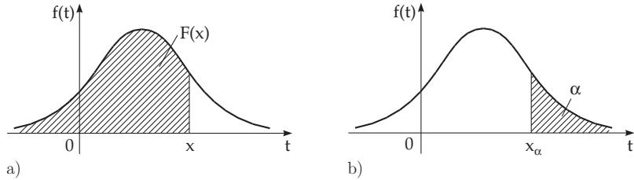

#### 16.2.2 Random Variables, Distribution Functions

To apply the methods of analysis in probability theory, the notions of variable and function are necessary.

##### 16.2.2.1 Random Variable

A set of elementary events is to be described by a random variable X. The random variable X can be considered as a quantity which takes its values x randomly from a subset R of the real numbers.

If R contains finitely or countably many diferent values, then X is called a discrete random variable. In the case of a continuous random variable, R can be the whole real axis or it may contain subintervals. For the precise definition see 16.2.2.2, 2., p. 812. There are also mixed random variables.

A: Assigning the values 1, 2, 3, 4 to the elementary events $A _ { 1 1 } , A _ { 1 2 } , A _ { 2 1 } , A _ { 2 2 }$ , respectively, in example A, p. 808, then a discrete random variable X is defined.

B: The lifetime T of a randomly selected light-bulb is a continuous random variable. The elementary event $T = t$ occurs if the lifetime T is equal to t.

##### 16.2.2.2 Distribution Function

1. Distribution Function and its Properties

The distribution of a random variable X can be given by its distribution function

$$
F ( x ) = P ( X \leq x ) \quad { \mathrm { f o r ~ } } - \infty \leq x \leq \infty .\tag{16.44}
$$

It determines the probability that the random variable X takes a value between and x. Its domain is the whole real axis. The distribution function has the following properties:

1. $F ( - \infty ) = 0 , F ( + \infty ) = 1$

2. $F ( x )$ is a non-decreasing function of x.

3. $F ( x )$ is continuous on the right.

Remarks:

1. From the definition it follows that $P ( X = a ) = F ( a ) - \operatorname* { l i m } _ { x \to a - 0 } F ( x )$

2. In the literature, also the definition $F ( x ) = P ( X < x )$ is often used. In this case $P ( X = a ) = \operatorname* { l i m } _ { x  a + 0 } F ( x ) - F ( a ) .$

2. Distribution Function of Discrete and Continuous Random Variables a) Discrete Random Variable: A discrete random variable X, which takes the values $x _ { i } ~ ( i ~ =$ $1 , 2 , \ldots )$ with probabilities $P ( X = x _ { i } ) = p _ { i } \ ( i = 1 , 2 , . . . )$ , has the distribution function

$$
F ( x ) = \sum _ { x _ { i } \leq x } p _ { i } .\tag{16.45}
$$

b) Continuous Random Variable: A random variable is called continuous if there exists a nonnegative function $f ( x )$ such that the probability $P ( X \in S )$ can be expressed as $\textstyle P ( X \in S ) = \int _ { S } f ( x ) d x$ <for any domain S such that it is possible to consider an integral over it. This function is the so-called density function. A continuous random variable takes any given value $x _ { i }$ with 0 probability, so one rather considers the probability that X takes its value from a finite interval $[ a , b ]$

$$
P ( a \leq X \leq b ) = \intop _ { a } ^ { b } f ( t ) d t .\tag{16.46}
$$

A continuous random variable has an everywhere continuous distribution function:

$$
F ( x ) = P ( X \leq x ) = \intop _ { - \infty } ^ { x } f ( t ) d t .\tag{16.47}
$$

$F ^ { \prime } ( x ) = f ( x )$ holds at the points where $f ( x )$ is continuous.

Remark: When there is no confusion about the upper integration limit, often the integration variable is denoted by x instead of t.

3. Area Interpretation of the Probability, Quantile

By introducing the distribution function and density function in (16.47), the probability $P ( X \leq x ) =$ $\dot { F ( x ) }$ can be represented as an area between the density function f(t) and the x-axis on the interval $- \infty < t \leq x \ \mathrm { ( F i g . 1 6 . 1 a ) }$

  
Figure 16.1

Often there is given (frequently in %) a probability value α. If

$$
P ( X > x ) = \alpha\tag{16.48}
$$

holds, the corresponding value of the abscissa $x = x _ { \alpha }$ is called the quantile or the fractile oforder α (Fig. 16.1b). This means the area under the density function $f ( t )$ to the right of $x _ { \alpha }$ is equal to α. Remark: In the literature, the area to the left of $x _ { \alpha }$ is also used for the definition of quantile.

In mathematical statistics, for small values of $\alpha , \mathrm { e . g . } , \alpha = 5 \% \mathrm { o r } \alpha = 1 \%$ , is also used the notion significance level offirst type or type 1 error rate. The most often used quantile for the most important distributions in practice are given in tables (Table 21.16, p. 1131, to Table 21.20, p. 1138).

##### 16.2.2.3 Expected Value and Variance, Chebyshev Inequality

For a coarse characterization of the distribution of a random variable X, mostly the parameters expected value, denoted by $\mu ,$ and variance, denoted by $\sigma ^ { 2 }$ are used. The expected value can be interpreted with the terminology of mechanics as the abscissa of the center of gravity of a surface bounded by the curve of the density function $f ( x )$ and the x-axis. The variance represents a measure of deviation of the random variable X from its expected value $\mu$

1. Expected Value

If $g ( X )$ is a function of the random variable X, then $g ( X )$ is also a random variable. Its expected value or expectation is defined as:

a) Discrete Case:

$$
E ( g ( X ) ) = \sum _ { k } g ( x _ { k } ) p _ { k } , \mathrm { i f ~ t h e ~ s e r i e s ~ } \sum _ { k = 1 } ^ { \infty } | g ( x _ { k } ) | p _ { k } \mathrm { e x i s t s . }\tag{16.49a}
$$

b) Continuous Case:

$$
E { \big ( } g ( X ) { \big ) } = \int _ { - \infty } ^ { + \infty } g ( x ) f ( x ) d x , { \mathrm { ~ i f ~ } } \int _ { - \infty } ^ { + \infty } | g ( x ) | f ( x ) d x { \mathrm { ~ e x i s t s . } }\tag{16.49b}
$$

The expected value of the random variable with $g ( X ) = X$ is defined as

$$
\mu _ { X } = E ( X ) = \sum _ { k } x _ { k } p _ { k } \quad { \mathrm { o r } } \quad \intop _ { - \infty } ^ { + \infty } x f ( x ) d x ,\tag{16.50a}
$$

if the corresponding sum or integral with the absolute values exists. Because of (16.49a,b)

$$
E ( a X + b ) = a \mu _ { X } + b \quad ( a , b \mathrm { c o n s t } )\tag{16.50b}
$$

is also valid. Of course, it is possible that a random variable do not have any expected value.

2. Moments of Order n

Furthermore one introduces:

a) Moment of Order n: $E ( X ^ { n } )$

(16.51a)

b) Central Moment of Order n: $E ( ( X - \mu _ { X } ) ^ { n } )$

(16.51b)

3. Variance and Standard Deviation

In particular, for $n = 2$ , the central moment is called the variance or dispersion:

$$
E ( ( X - \mu _ { X } ) ^ { 2 } ) = D ^ { 2 } ( X ) = \sigma _ { X } ^ { 2 } = \left\{ \begin{array} { l l } { \displaystyle \sum _ { k } ( x _ { k } - \mu _ { X } ) ^ { 2 } p _ { k } \quad \mathrm { o r } } \\ { \displaystyle + \infty } \\ { \displaystyle \int _ { - \infty } ( x - \mu _ { X } ) ^ { 2 } f ( x ) d x , } \end{array} \right.\tag{16.52}
$$

⎩if the expected values occurring in the formula exist. The quantity $\sigma _ { X }$ is called the standard deviation. The following relations are valid:

$$
D ^ { 2 } ( X ) = \sigma _ { X } ^ { 2 } = E ( X ^ { 2 } ) - \mu _ { X } ^ { 2 } , \quad D ^ { 2 } ( a X + b ) = a ^ { 2 } D ^ { 2 } ( X ) .\tag{16.53}
$$

4. Weighted and Arithmetical Mean

In the discrete case, the expected value is obviously the weighted mean

$$
E ( X ) = p _ { 1 } x _ { 1 } + . . . + p _ { n } x _ { n }\tag{16.54}
$$

of the values $x _ { 1 } , \ldots , x _ { n }$ with the probabilities $p _ { k }$ as weights $( k = 1 , \ldots , n )$ . The probabilities for the uniform distribution are $p _ { 1 } = p _ { 2 } = . . . = p _ { n } = 1 / n$ , and $E ( \dot { X } )$ is the arithmetical mean of the values

xk:

$$
E ( X ) = { \frac { x _ { 1 } + x _ { 2 } + \ldots + x _ { n } } { n } } .\tag{16.55}
$$

In the continuous case, the density function of the continuous uniform distribution on the finite interval [a, b] is

$$
f ( x ) = { \left\{ \begin{array} { l l } { \displaystyle { \frac { 1 } { b - a } } } & { { \mathrm { f o r } } a \leq x \leq b , } \\ { 0 } & { { \mathrm { o t h e r w i s e } } , } \end{array} \right. }\tag{16.56}
$$

and it follows that

$$
E ( X ) = { \frac { 1 } { b - a } } \int _ { a } ^ { b } x d x = { \frac { a + b } { 2 } } , \quad \sigma _ { X } ^ { 2 } = { \frac { ( b - a ) ^ { 2 } } { 1 2 } } .\tag{16.57}
$$

5. Chebyshev Inequality

If the random variable X has the expected value $\mu$ and standard deviation $\sigma _ { : }$ then for arbitrary $\lambda > 0$ the Chebyshev inequality (see 1.4.2.10, p. 31) is valid:

$$
P ( | X - \mu | \geq \lambda \sigma ) \leq { \frac { 1 } { \lambda ^ { 2 } } } .\tag{16.58}
$$

That is, it is very unlikely that the values of the random variable X are farther from the expected value $\mu$ than a multiple of the standard deviation (λ large).

##### 16.2.2.4 Multidimensional Random Variable

If the elementary events mean that n random variables $X _ { 1 } , \ldots , X _ { n }$ take n real values $x _ { 1 } , \ldots , x _ { n }$ , then a random vector $\mathbf { X } = ( X _ { 1 } , X _ { 2 } , \ldots , X _ { n } )$ is defined (see also random vector, 16.3.1.1, 4., p. 830). The corresponding distribution function is defined by

$$
F ( x _ { 1 } , \ldots , x _ { n } ) = P ( X _ { 1 } \leq x _ { 1 } , \ldots , X _ { n } \leq x _ { n } ) .\tag{16.59}
$$

The random vector is called continuous if there is a function $f ( t _ { 1 } , \ldots , t _ { n } )$ such that

$$
F ( x _ { 1 } , \ldots , x _ { n } ) = \int _ { - \infty } ^ { x _ { 1 } } \cdots \int _ { - \infty } ^ { x _ { n } } f ( t _ { 1 } , \ldots , t _ { n } ) d t _ { 1 } \ldots d t _ { n }\tag{16.60}
$$

holds. The function $f ( t _ { 1 } , \ldots , t _ { n } )$ is called the density function. It is non-negative. If some of the variables $x _ { 1 } , \ldots , x _ { n }$ tend to infinity, then one gets the so-called marginal distributions. Further investigations and examples can be found in the literature.

The random variables $X _ { 1 } , \ldots , X _ { n }$ are independent random variables if

$$
F ( x _ { 1 } , \ldots , x _ { n } ) = F _ { 1 } ( x _ { 1 } ) F _ { 2 } ( x _ { 2 } ) \ldots F _ { n } ( x _ { n } ) , \quad f ( t _ { 1 } , \ldots , t _ { n } ) = f _ { 1 } ( t _ { 1 } ) \ldots f _ { n } ( t _ { n } ) .\tag{16.61}
$$
