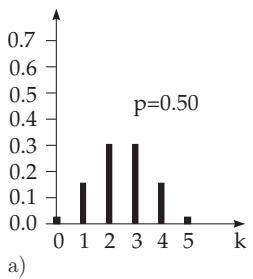
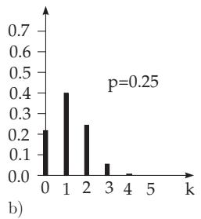
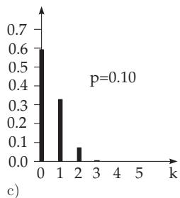
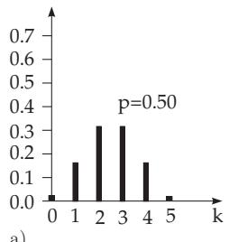
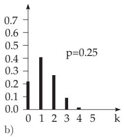
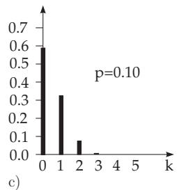
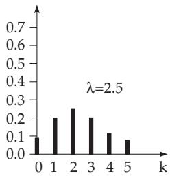
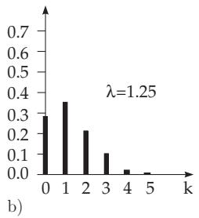
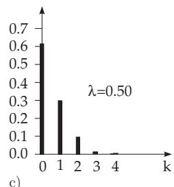

#### 16.2.3 Discrete Distributions

1. Two-Stage Population and Urn Model

Suppose one has a two-stage population with N elements, i.e., the population to be considered has two classes of elements. One class has M elements with a property A, the other one has $N - M$ elements which does not have the property A. If investigating the probabilities $P ( A ) = p$ and $P ( \overline { { A } } ) = 1 - p$ for randomly chosen elements, then one has to distinguish between two cases: When selecting n elements one after the other, either the previously selected element is replaced before selecting the next one, or it is not. The selected n elements, which contain k elements with the property A, is called the sample, n being the size ofthe sample. This can be illustrated by the urn model.

2. Urn Model

Suppose there are a lot of black balls and white balls in a container. The question is: What is the probability that among n randomly selected balls there are k black ones. If putting every chosen ball

back into the container after the determination of its color, then the number k of black ones among the chosen n balls has a binomial distribution. If one does not put back the chosen balls and $n \leq M$ and $n \leq N - M$ , then the number of black ones has a hypergeometric distribution.

##### 16.2.3.1 Binomial Distribution

Suppose in an experiment only the two events A and $\overline { { A } }$ are possible and the experiment is repeated n times and the accompanying probabilities are $P ( A ) = p$ and $P ( { \overline { { A } } } ) = 1 - p$ every time, then the probability that A takes place exactly k times is

$$
W _ { p } ^ { n } ( k ) = \binom { n } { k } p ^ { k } ( 1 - p ) ^ { n - k } \quad ( k = 0 , 1 , 2 , \ldots , n ) .\tag{16.62}
$$

For every choice of an independent element from the population, the probabilities are

$$
P ( A ) = { \frac { M } { N } } = p , \quad P ( { \overline { { A } } } ) = { \frac { N - M } { N } } = 1 - p = q .\tag{16.63}
$$

The probability of getting an element with property A for the first k choices, then an element with the remaining property $\breve { A }$ for the $n - k$ choices is $p ^ { k } ( 1 - p ) ^ { n - k }$ , because the results of choices are independent of each other. The sequence of the choices plays no role because the combinations have the same probability independently of the order of the choices, and these events are mutually exclusive, so one adds

$$
{ \binom { n } { k } } = { \frac { n ! } { k ! ( n - k ) ! } }\tag{16.64}
$$

equal numbers to get the required probability.

$\mathrm { A }$ random variable $X _ { n }$ , for which $\ P ( X _ { n } = k ) = W _ { p } ^ { n } ( k )$ holds, is called binomially distributed with parameters n and $p .$

1. Expected Value and Variance

$$
E ( X _ { n } ) = \mu = n \cdot p ,\tag{16.65a}
$$

$$
D ^ { 2 } ( X _ { n } ) = \sigma ^ { 2 } = n \cdot p ( 1 - p ) .\tag{16.65b}
$$

2. Approximation of the Binomial Distribution by the Normal Distribution If $X _ { n }$ has a binomial distribution, then

$$
\operatorname* { l i m } _ { n \to \infty } P \left( { \frac { X _ { n } - E ( X _ { n } ) } { D ( X _ { n } ) } } \leq \lambda \right) = { \frac { 1 } { \sqrt { 2 \pi } } } \intop _ { - \infty } ^ { \lambda } \exp \left( { \frac { - t ^ { 2 } } { 2 } } \right) d t .\tag{16.65c}
$$

This means that, if n is large, the binomial distribution can be well approximated by a normal distribution (see 16.2.4.1, p. 818) with parameters $\mu _ { X } = E ( X _ { n } ) $ and $\sigma ^ { 2 } = \tilde { D ^ { 2 } } ( X _ { n } )$ , if p or $1 - p$ are not too small. The approximation is the more accurate the closer p is to 0.5 and the larger n is, but acceptable if $n p > 4$ and $\bar { n } ( 1 - p ) > 4$ 4 hold. For very small $p$ or $1 - p ,$ , the approximation by the Poisson distribution (see (16.68) in $1 6 . 2 . 3 . 3 )$ is useful.

3. Recursion Formula

The following recursion formula is recommended for practical calculations with the binomial distribution:

$$
W _ { p } ^ { n } ( k + 1 ) = \frac { n - k } { k + 1 } \cdot \frac { p } { q } \cdot W _ { p } ^ { n } ( k ) .\tag{16.65d}
$$

4. Sum of Binomially Distributed Random Variables

If $X _ { n }$ and $X _ { m }$ are both binomially distributed random variables with parameters $n , p$ and $m , p ,$ then the random variable $X = X _ { n } + \dot { X } _ { m }$ is also binomially distributed with parameters $n + m , p .$

Fig. 16.2a,b,c represents the distributions of three binomially distributed random variables with parameters $n = 5 ; p = 0 . 5 , 0 . 2 5$ , and 0.1. Since the binomial coeficients are symmetric, the distribution

is symmetric for $p = q = 0 . 5$ , and the farther p is from 0.5 the less symmetric the distribution is.

##### 16.2.3.2 Hypergeometric Distribution

Just as with the binomial distribution, a two-stage population with N elements is considered, i.e., the population has two classes of elements. One class has M elements with a property A, the other one has ${ \bar { N } } - M$ elements which does not have the property A. In contrast to the case of binomial distribution, the chosen ball of the urn model is not replaced before choosing the next one. The probability that among the n chosen balls there are k black ones is

$$
P ( X = k ) = W _ { M , N } ^ { n } ( k ) = { \frac { { \binom { M } { k } } { \binom { N - M } { n - k } } } { \binom { N } { n } } } \quad { \mathrm { w i t h ~ } }\tag{16.66a}
$$

$$
0 \leq k \leq n , \quad k \leq M , \quad n - k \leq N - M .\tag{16.66b}
$$

If also $n \leq M$ and $n \leq N - M$ hold, then the random variable X with the distribution (16.66a) is called hypergeometrically distributed.

  
Figure 16.2

1. Expected Value and Variance of the Hypergeometric Distribution

$$
\mu = E ( X ) = \sum _ { k = 0 } ^ { n } k { \frac { { \binom { M } { k } } { \binom { N - M } { n - k } } } { \binom { N } { k } } } = n { \frac { M } { N } } ,\tag{16.67a}
$$

$$
\begin{array} { c } { { \displaystyle \sigma ^ { 2 } = D ^ { 2 } ( X ) = E ( X ^ { 2 } ) - [ E ( X ) ] ^ { 2 } = \sum _ { k = 0 } ^ { n } k ^ { 2 } \frac { \binom { M } { k } \binom { N - M } { n - k } } { \binom { N } { k } } - \left( n \frac { M } { N } \right) ^ { 2 } } } \\ { { = n \displaystyle \frac { M } { N } \left( 1 - \frac { M } { N } \right) \frac { N - n } { N - 1 } . } } \end{array}\tag{16.67b}
$$

2. Recursion Formula

$$
W _ { M , N } ^ { n } ( k + 1 ) = \frac { ( n - k ) ( M - k ) } { ( k + 1 ) ( N - M - n + k + 1 ) } W _ { M , N } ^ { n } ( k ) .\tag{16.67c}
$$

In Fig. ${ \bf 1 6 . 3 a , b , c }$ three hypergeometric distributions are represented for the cases $N = 1 0 0 , M = 5 0$ 25 and 10, for $n = 5$ . These cases correspond to the cases $p = 0 . 5 ; 0 . 2 5$ , and 0.1 of Fig. 16.2a,b,c.

There is no significant diference between the binomial and hypergeometric distributions in these examples. If also M and $N - M$ are much larger than n, then the hypergeometric distribution can be well approximated by a binomial one with parameters as in (16.63).

  
a)

  
Figure 16.3

##### 16.2.3.3 Poisson Distribution

If the possible values of a random variable X are the non-negative integers with probabilities

$$
P ( X = k ) = \frac { \lambda ^ { k } } { k ! } e ^ { - \lambda } \qquad ( k = 0 , 1 , 2 , \ldots ; \lambda > 0 ) ,\tag{16.68}
$$

then it has a Poisson distribution with parameter λ.

1. Expected Value and Variance of the Poisson Distribution

$$
E ( X ) = \lambda ,\tag{16.69a}
$$

$$
D ^ { 2 } ( X ) = \lambda .\tag{16.69b}
$$

2. Sum of Independent Poisson Distributed Random Variables

If $X _ { 1 }$ and $X _ { 2 }$ are independent Poisson distributed random variables with parameters $\lambda _ { 1 }$ and $\lambda _ { 2 }$ , then the random variable ${ \dot { X } } = X _ { 1 } + X _ { 2 }$ also has a Poisson distribution with parameter $\lambda = \lambda _ { 1 } + \lambda _ { 2 }$

3. Recursion Formula

$$
P ( X = k + 1 ) = \frac { \lambda } { k + 1 } P ( X = k ) ) .\tag{16.69c}
$$

4. Connection between Poisson and Binomial Distribution

The Poisson distribution can be obtained as a limit of binomial distributions with parameters n and $p$ if $n \to \infty$ , and $p \ ( p  0 )$ changes with n so that np = λ = const, i.e., the Poisson distribution is a good approximation for a binomial distribution for large n and small p with $\lambda = n p$ . In practice, one uses it if $p \leq 0 . 0 8$ and $n \geq 1 5 0 0 p$ hold, because the calculations are easier with a Poisson distribution. Table 21.16, p. 1131, contains numerical values for the Poisson distribution. Fig. 16.4a,b,c represents three Poisson distributions with $\lambda = n p = 2 . 5$ , 1.25 and 0.5, i.e., with parameters corresponding to Figs. 16.2 and 16.3.

5. Application

The number of independently occurring point-like discontinuities in a continuous medium can usually be described by a Poisson distribution, e.g., number of clients arriving in a store during a certain time interval; number of misprints in a book, the rate of radioactive decay, etc.

  
a)

  
Figure 16.4

  
c)
