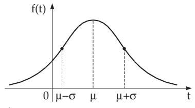
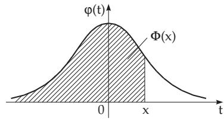
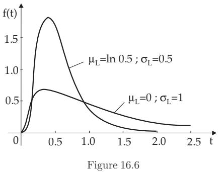
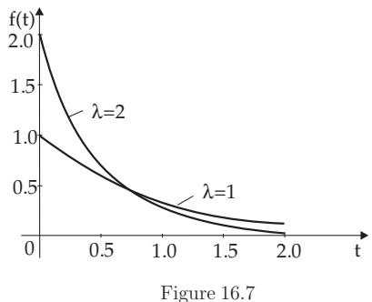
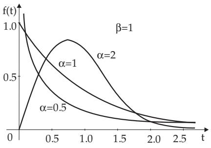
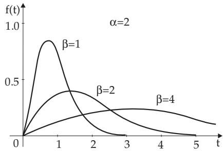
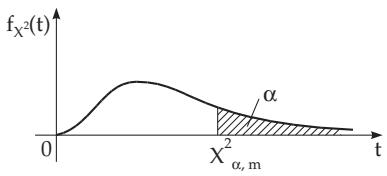
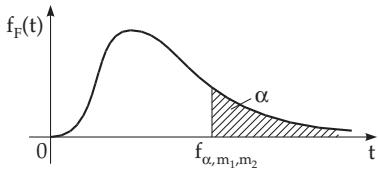
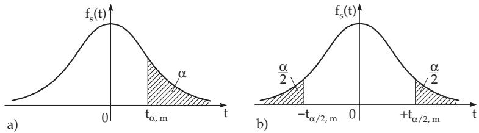

#### 16.2.4 Continuous Distributions

##### 16.2.4.1 Normal Distribution

1. Distribution Function and Density Function

A random variable X has a normal distribution if its distribution function is

$$
P ( X \leq x ) = F ( x ) = { \frac { 1 } { \sigma { \sqrt { 2 \pi } } } } \int _ { - \infty } ^ { x } e ^ { - { \frac { ( t - \mu ) ^ { 2 } } { 2 \sigma ^ { 2 } } } } d t .\tag{16.70a}
$$

Then it is also called a normal varia $; b l e ,$ and the distribution is called a $( \mu , \sigma ^ { 2 } )$ normal distribution. The function

$$
f ( t ) = \frac { 1 } { \sigma \sqrt { 2 \pi } } e ^ { - \frac { ( t - \mu ) ^ { 2 } } { 2 \sigma ^ { 2 } } }\tag{16.70b}
$$

is the density function of the normal distribution. It takes its maximum at $t = \mu$ and it has inflection points at $\mu \pm \sigma$ (see (2.59), p. 73, and Fig. 16.5a).

a)  

  
b)  
Figure 16.5

2. Expected Value and Variance

The parameters $\mu$ and $\sigma ^ { 2 }$ of the normal distribution are its expected value and variance, respectively, i.e.,

$$
E ( X ) = { \frac { 1 } { \sigma { \sqrt { 2 \pi } } } } \int _ { - \infty } ^ { + \infty } x e ^ { - { \frac { ( x - \mu ) ^ { 2 } } { 2 \sigma ^ { 2 } } } } d x = \mu ,\tag{16.71a}
$$

$$
D ^ { 2 } ( X ) = E [ ( X - \mu ) ^ { 2 } ] = { \frac { 1 } { \sigma { \sqrt { 2 \pi } } \ } } \int _ { - \infty } ^ { + \infty } ( x - \mu ) ^ { 2 } e ^ { - { \frac { ( x - \mu ) ^ { 2 } } { 2 \sigma ^ { 2 } } } } d x = \sigma ^ { 2 } .\tag{16.71b}
$$

If the normal random variables $X _ { 1 }$ and $X _ { 2 }$ are independent with parameters $\mu _ { 1 } , \sigma _ { 1 }$ and $\mu _ { 2 } , \sigma _ { 2 }$ , resp., then the random variable $X = k _ { 1 } \bar { X _ { 1 } } + k _ { 2 } \bar { X _ { 2 } } ( k _ { 1 } , k _ { 2 }$ real constants) also has a normal distribution with parameters $\mu = k _ { 1 } \mu _ { 1 } + k _ { 2 } \mu _ { 2 } , \sigma = \sqrt { { k _ { 1 } } ^ { 2 } \sigma _ { 1 } { } ^ { 2 } + { k _ { 2 } } ^ { 2 } \sigma _ { 2 } { } ^ { 2 } } ,$

By the substitution $\tau = \frac { t - \mu } { \sigma } \mathrm { i n } \ : ( 1 6 . 7 0 \mathrm { a } )$ , the calculation of the values of the distribution function of any normal distribution is reduced to the calculation of the values of the distribution function of the $( 0 , 1 )$ normal distribution, which is called the standard normal distribution. Consequently, the probability $P ( a \leq X \leq b )$ of a normal variable can be expressed by the distribution function $\varPhi ( x )$ of the standard normal distribution:

$$
P ( a \leq X \leq b ) = \phi \left( { \frac { b - \mu } { \sigma } } \right) - \phi \left( { \frac { a - \mu } { \sigma } } \right) .\tag{16.72}
$$

##### 16.2.4.2 Standard Normal Distribution, Gaussian Error Function

1. Distribution Function and Density Function

From (16.70a) with $\mu = 0$ and $\sigma ^ { 2 } = 1$ follows the distribution function

$$
P ( X \leq x ) = \varPhi ( x ) = { \frac { 1 } { \sqrt { 2 \pi } } } \int _ { - \infty } ^ { x } e ^ { - { \frac { t ^ { 2 } } { 2 } } } d t = \intop _ { - \infty } ^ { x } \varphi ( t ) d t\tag{16.73a}
$$

of the so-called standard normal distribution. Its density function is

$$
\varphi ( t ) = { \frac { 1 } { \sqrt { 2 \pi } } } e ^ { - { \frac { t ^ { 2 } } { 2 } } } ,\tag{16.73b}
$$

it is called the Gaussian error curve (Fig. 16.5b).

The values of the distribution function $\varPhi ( x )$ of the (0, 1) normal distribution are given in Table 21.17, p. 1133. Only the values for the positive arguments x are given, while the values for the negative arguments can be got from the relation

$$
\begin{array} { r } { \phi ( - x ) = 1 - \phi ( x ) . } \end{array}\tag{16.74}
$$

2. Probability Integral

The integral $\varPhi ( x )$ is also called the probability integral or Gaussian error integral. In the literature the functions $\varPhi _ { 0 } ( x )$ and erf (x) are sometimes denoted as error integral with the following definitions:

$$
\varPhi _ { 0 } ( x ) = \frac { 1 } { \sqrt { 2 \pi } } \int _ { 0 } ^ { x } e ^ { - \frac { t ^ { 2 } } { 2 } } d t = \varPhi ( x ) - \frac { 1 } { 2 } , \ : \ : ( 1 6 . 7 5 \mathrm { a } ) \ : \ : \mathrm { \ e r f } \ : ( x ) = \frac { 2 } { \sqrt { \pi } } \int _ { 0 } ^ { x } e ^ { - t ^ { 2 } } d t = 2 \cdot \varPhi _ { 0 } ( \sqrt { 2 } x ) .\tag{16.75b}
$$

With erf the error function is denoted.

##### 16.2.4.3 Logarithmic Normal Distribution

1. Density Function and Distribution Function

The continuous random variable X has a logarithmic normal distribution, or lognormal distribution with parameters $\mu _ { L }$ and $\sigma _ { L } ^ { 2 }$ if it can take all positive values, and if the random variable Y, defined by

$$
Y = \log X ,\tag{16.76}
$$

has a normal distribution with expected value $\mu _ { L }$ and variance $\sigma _ { L } ^ { 2 }$ (see also remark b) on page 820). Consequently, the random variable X has the density function

$$
f ( t ) = \left\{ \begin{array} { l l } { 0 } & { \mathrm { f o r } \quad t \leq 0 , } \\ { \displaystyle \frac { \log e } { t \sigma _ { L } \sqrt { 2 \pi } } \exp \left( - \frac { ( \log t - \mu _ { L } ) ^ { 2 } } { 2 \sigma _ { L } ^ { 2 } } \right) } & { \mathrm { f o r } \quad t > 0 , } \end{array} \right.\tag{16.77a}
$$

and the distribution function

$$
F ( x ) = \left\{ \begin{array} { l l } { 0 } & { \mathrm { f o r } \quad x \leq 0 , } \\ { \displaystyle \frac { 1 } { \sigma _ { L } \sqrt { 2 \pi } } \displaystyle \int _ { - \infty } ^ { \log { x } } \exp \left( - \frac { ( t - \mu _ { L } ) ^ { 2 } } { 2 \sigma _ { L } ^ { 2 } } \right) d t } & { \mathrm { f o r } \quad x > 0 . } \end{array} \right.\tag{16.77b}
$$

In practical applications either the natural or the decimal logarithm is used.

2. Expected Value and Variance

Using the natural logarithm one gets the expected value and the variance of the lognormal distribution as:

$$
\mu = \exp \left( \mu _ { L } + \frac { \sigma _ { L } ^ { 2 } } { 2 } \right) , \qquad \sigma ^ { 2 } = \left( \exp \sigma _ { L } ^ { 2 } - 1 \right) \exp \left( 2 \mu _ { L } + \sigma _ { L } ^ { 2 } \right) .\tag{16.78}
$$

3. Remarks

a) The density function of the lognormal distribution is continuous everywhere and it has positive values only for positive arguments. Fig. 16.6 shows the density functions of lognormal distributions for diferent $\mu _ { L }$ and $\sigma _ { L }$ . Here has been used the natural logarithm.

b) Here the values $\mu _ { L }$ and $\sigma _ { L } ^ { 2 }$ are not the expected value and variance of the lognormal random variable itself, but of the variable $Y \overset { - } { = }$ log X, while $\mu$ and $\sigma ^ { 2 }$ are in conformity with (16.78) expected value and variance of the random variable X.

c) The values of the distribution function $F ( x )$ of the lognormal distribution can be calculated by the distribution function $\varPhi ( x )$ of the standard normal distribution (see (16.73a)), in the following way:

$$
F ( x ) = \varPhi \left( \frac { \log x - \mu _ { L } } { \sigma _ { L } } \right) .\tag{16.79}
$$

d) The lognormal distribution is often applied in lifetime analysis of economical, technical, and biological processes.

e) The normal distribution can be used in additive superposition of a large number of independent random variables, and the lognormal distribution is used for multiplicative superposition of a large number of independent random variables.

##### 16.2.4.4 Exponential Distribution

1. Density Function and Distribution Function

A continuous random variable X has an exponential distribution with parameter λ $( \lambda > 0 )$ if its density function is (Fig. 16.7)

$$
f ( t ) = { \left\{ \begin{array} { l l l } { 0 } & { { \mathrm { f o r } } } & { t < 0 } \\ { \lambda e ^ { - \lambda t } } & { { \mathrm { f o r } } } & { t \geq 0 , } \end{array} \right. }\tag{16.80a}
$$

consequently, the distribution function is

$$
F ( x ) = \intop _ { - \infty } ^ { x } f ( t ) d t = \left\{ \begin{array} { l l l } { 0 } & { \mathrm { f o r } } & { x < 0 , } \\ { 1 - e ^ { - \lambda x } } & { \mathrm { f o r } } & { x \ge 0 . } \end{array} \right.\tag{16.80b}
$$

2. Expected Value and Variance

$$
\mu = \frac { 1 } { \lambda } , \qquad \sigma ^ { 2 } = \frac { 1 } { \lambda ^ { 2 } } .\tag{16.81}
$$

Usually, the following quantities are described by an exponential distribution: Length of phone calls, lifetime of radioactive particles, working time of a machine between two stops in certain processes, lifetime of light-bulbs or certain building elements.

##### 16.2.4.5 Weibull Distribution

1. Density Function and Distribution Function

The continuous random variable X has a Weibull distribution with parameters α and $\beta \left( \alpha > 0 , \beta > 0 \right)$ ， if its density function is

$$
f ( t ) = \left\{ \begin{array} { l l l } { 0 } & { \mathrm { ~ f o r ~ } } & { t < 0 , } \\ { \displaystyle \frac { \alpha } { \beta } \left( \frac { t } { \beta } \right) ^ { \alpha - 1 } \exp \left[ - \left( \frac { t } { \beta } \right) ^ { \alpha } \right] } & { \mathrm { ~ f o r ~ } } & { t \geq 0 } \end{array} \right.\tag{16.82a}
$$

and so its distribution function is

$$
F ( x ) = { \left\{ \begin{array} { l l } { 0 } & { { \mathrm { ~ f o r ~ } } \quad x < 0 , } \\ { 1 - \exp \left[ - \left( { \frac { x } { \beta } } \right) ^ { \alpha } \right] } & { { \mathrm { ~ f o r ~ } } \quad x \geq 0 . } \end{array} \right. }\tag{16.82b}
$$

2. Expected Value and Variance

$$
\mu = \beta { \cal T } \left( 1 + \frac { 1 } { \alpha } \right) , \qquad \sigma ^ { 2 } = \beta ^ { 2 } \left[ { \cal T } \left( 1 + \frac { 2 } { \alpha } \right) - { \cal T } ^ { 2 } \left( 1 + \frac { 1 } { \alpha } \right) \right] .\tag{16.83}
$$

Here Γ(x) denotes the gamma function (see 8.2.5, 6., p. 514):

$$
\displaystyle { \cal T } ( x ) = \int _ { 0 } ^ { \infty } t ^ { x - 1 } e ^ { - t } d t \quad \mathrm { f o r } \quad x > 0 .\tag{16.84}
$$

In (16.82a), α is the shape parameter and $\beta$ is the scale parameter (Fig. 16.8, Fig. 16.9).

Remarks:

a) The Weibull distribution becomes an exponential distribution for $\alpha = 1 \mathrm { w i t h } \lambda = \frac { 1 } { \beta } .$

b) The Weibull distribution also has a three-parameter form by introducing a position parameter γ. Then the distribution function is:

$$
F ( x ) = 1 - \exp { \left[ - \left( \frac { x - \gamma } { \beta } \right) ^ { \alpha } \right] } .\tag{16.85}
$$

  
Figure 16.8  
Figure 16.9  
c) The Weibull distribution is especially useful in life expectancy theory, because, e.g., it describes the functional lifetime of building elements with great flexibility.

##### 16.2.4.6 (Chi-Square) Distribution

1. Density Function and Distribution Function

Let $X _ { 1 } , X _ { 2 } , \ldots , X _ { n }$ be n independent (0, 1) normal random variables. Then the distribution of the random variable

$$
\chi ^ { 2 } = { X _ { 1 } } ^ { 2 } + { X _ { 2 } } ^ { 2 } + \cdot \cdot \cdot + { X _ { n } } ^ { 2 }\tag{16.86}
$$

is called the $\chi ^ { 2 }$ distribution with n degrees of freedom. Its distribution function is denoted by $F _ { \chi ^ { 2 } } ( x )$ and the corresponding density function by $f _ { \chi ^ { 2 } } ( t )$

$$
f _ { \chi ^ { 2 } } ( t ) = { \left\{ \begin{array} { l l } { { \displaystyle { \frac { 1 } { 2 ^ { n / 2 } T \left( { \frac { n } { 2 } } \right) } } t ^ { { \frac { n } { 2 } } - 1 } e ^ { - { \frac { t } { 2 } } } } } & { { \mathrm { f o r ~ } ( t > 0 ) } } \\ { { 0 } } & { { \mathrm { f o r ~ } } t \leq 0 . } \end{array} \right. }\tag{16.87a}
$$

$$
F _ { \chi ^ { 2 } } ( x ) = P ( \chi ^ { 2 } \leq x ) = { \frac { 1 } { 2 ^ { n / 2 } { \cal T } \left( { \frac { n } { 2 } } \right) } } \int _ { 0 } ^ { x } t ^ { { \frac { n } { 2 } } - 1 } e ^ { - { \frac { t } { 2 } } } d t ~ ( x > 0 ) .\tag{16.87b}
$$

2. Expected Value and Variance

$$
E ( \chi ^ { 2 } ) = n ,
$$

$$
\mathrm { ( 1 6 . 8 8 a ) } D ^ { 2 } ( \chi ^ { 2 } ) = 2 n .\tag{16.88b}
$$

3. Sum of Independent Random Variables

If $X _ { 1 }$ and $X _ { 2 }$ are independent random variables both having $\mathrm { ~ a ~ } \chi ^ { 2 }$ distribution with n and m degrees of freedom, then the random variable $X = X _ { 1 } + X _ { 2 }$ has a $\chi ^ { 2 }$ distribution with $n + m$ degrees of freedom.

4. Sum of Independent Normal Random Variables

If $X _ { 1 } , X _ { 2 } , \ldots , X _ { n }$ are independent, (0, σ) normal random variables, then

$$
\begin{array} { r l r l } { X } & { { } = \displaystyle \sum _ { i = 1 } ^ { n } X _ { i } ^ { 2 } } & { } & { { } { \mathrm { h a s ~ t h e ~ d e n s i t y ~ f u n c t i o n } } \quad f ( t ) = \displaystyle { \frac { 1 } { \sigma ^ { 2 } } } f _ { \chi ^ { 2 } } \left( { \frac { t } { \sigma ^ { 2 } } } \right) , } \end{array}\tag{16.89}
$$

$$
X ~ = { \frac { 1 } { n } } \sum _ { i = 1 } ^ { n } { X _ { i } } ^ { 2 } ~ { \mathrm { h a s ~ t h e ~ d e n s i t y ~ f u n c t i o n } } ~ f ( t ) = { \frac { n } { \sigma ^ { 2 } } } f _ { \chi ^ { 2 } } \left( { \frac { n t } { \sigma ^ { 2 } } } \right) ,\tag{16.90}
$$

$$
X = { \sqrt { { \frac { 1 } { n } } \sum _ { i = 1 } ^ { n } X _ { i } ^ { 2 } } } \quad { \mathrm { ~ h a s ~ t h e ~ d e n s i t y ~ f u n c t i o n } } \quad f ( t ) = { \frac { 2 t } { \sigma ^ { 2 } } } f _ { \chi ^ { 2 } } \left( { \frac { t ^ { 2 } } { \sigma ^ { 2 } } } \right) .\tag{16.91}
$$

5. Quantile

For the quantile (see 16.2.2.2, 3., p. 812) $\chi _ { \alpha , m } ^ { 2 }$ of the $\chi ^ { 2 }$ distribution with m degrees of freedom (Fig. 16.10),

$$
P ( X > \chi _ { \alpha , m } ^ { 2 } ) = \alpha .\tag{16.92}
$$

Quantiles of the $\chi ^ { 2 }$ distribution can be found in Table 21.18, p. 1135.

  
Figure 16.10

  
Figure 16.11

##### 16.2.4.7 Fisher F Distribution

1. Density Function and Distribution Function

If $X _ { 1 }$ and $X _ { 2 }$ are independent random variables both having $\chi ^ { 2 }$ distribution with $m _ { 1 }$ and $m _ { 2 }$ degrees of freedom, then the distribution of the random variable

$$
F _ { m _ { 1 } , m _ { 2 } } = \frac { X _ { 1 } } { m _ { 1 } } \Big / \frac { X _ { 2 } } { m _ { 2 } }\tag{16.93}
$$

is a Fisher distribution or F distribution with $m _ { 1 }$ , m degrees of freedom. The density function is

$$
f _ { F } ( t ) = \left\{ \begin{array} { l l } { { \left( \displaystyle \frac { m _ { 1 } } { 2 } \right) ^ { m _ { 1 } / 2 } \left( \frac { m _ { 2 } } { 2 } \right) ^ { m _ { 2 } / 2 } \displaystyle \frac { \Gamma \left( \displaystyle \frac { m _ { 1 } } { 2 } + \frac { m _ { 2 } } { 2 } \right) } { \Gamma \left( \displaystyle \frac { m _ { 1 } } { 2 } \right) \Gamma \left( \displaystyle \frac { m _ { 2 } } { 2 } \right) } \displaystyle \frac { t ^ { \frac { m _ { 1 } } { 2 } } - 1 } { \left( \displaystyle \frac { m _ { 1 } } { 2 } t + \frac { m _ { 2 } } { 2 } \right) ^ { \frac { m _ { 1 } } { 2 } + \frac { m _ { 2 } } { 2 } } } } } & { { \mathrm { f o r ~ } t > 0 , } } \\ { { 0 } } & { { \mathrm { f o r ~ } t \leq 0 . } } \end{array} \right.\tag{16.94a}
$$

For $x \leq 0$ holds $F _ { F } ( x ) = P ( F _ { m _ { 1 } , m _ { 2 } } \leq x ) = 0$ , for $x > 0 { : }$

$$
{ \begin{array} { l } { F _ { F } ( x ) = P ( F _ { m _ { 1 } , m _ { 2 } } \leq x ) } \\ { \qquad = \left( { \frac { m _ { 1 } } { 2 } } \right) ^ { m _ { 1 } / 2 } \left( { \frac { m _ { 2 } } { 2 } } \right) ^ { m _ { 2 } / 2 } { \frac { \displaystyle { \Gamma \left( { \frac { m _ { 1 } } { 2 } } + { \frac { m _ { 2 } } { 2 } } \right) } } { \displaystyle { \Gamma \left( { \frac { m _ { 1 } } { 2 } } \right) } \Gamma \left( { \frac { m _ { 2 } } { 2 } } \right) } } { \int } { \frac { x } { \displaystyle { \left( { \frac { m _ { 1 } } { 2 } } t + { \frac { m _ { 2 } } { 2 } } \right) ^ { \frac { m _ { 1 } } { 2 } + { \frac { m _ { 2 } } { 2 } } } } } } } \end{array} }\tag{16.94b}
$$

2. Expected Value and Variance

$$
E ( F _ { m _ { 1 } , m _ { 2 } } ) = { \frac { m _ { 2 } } { m _ { 2 } - 2 } } \ , \qquad ( 1 6 . 9 5 \mathrm { a } ) \qquad D ^ { 2 } ( F _ { m _ { 1 } , m _ { 2 } } ) = { \frac { 2 m _ { 2 } ^ { 2 } ( m _ { 1 } + m _ { 2 } - 2 ) } { m _ { 1 } ( m _ { 2 } - 2 ) ^ { 2 } ( m _ { 2 } - 4 ) } } \cdotp\tag{16.95b}
$$

3. Quantile

The quantiles (see 16.2.2.2, 3., p. 812) $t _ { \alpha , m _ { 1 } , m _ { 2 } }$ of the Fisher distribution (Fig. 16.11) can be found in Table 21.19, p. 1136.

##### 16.2.4.8 Student Distribution

1. Density Function and Distribution Function

If X is a (0, 1) normal random variable and Y is a random variable independent from X and it has a $\chi ^ { 2 }$ distribution with $m = n - 1$ degrees of freedom, then the distribution of the random variable

$$
T = { \frac { X } { \sqrt { Y / m } } }\tag{16.96}
$$

is called a Student t distribution or t distribution with m degrees of freedom. The distribution function is denoted by $F _ { S } ( x )$ , and the corresponding density function by $f _ { S } ( t )$

$$
f _ { S } ( t ) = { \frac { 1 } { \sqrt { m \pi } } } { \frac { \Gamma \left( { \frac { m + 1 } { 2 } } \right) } { \Gamma \left( { \frac { m } { 2 } } \right) } } { \frac { 1 } { \left( 1 + { \frac { t ^ { 2 } } { m } } \right) ^ { \frac { m + 1 } { 2 } } } } ,\tag{16.97a}
$$

$$
F _ { S } ( x ) = P ( T \leq x ) = \int _ { - \infty } ^ { x } f _ { S } ( t ) d t = { \frac { 1 } { { \sqrt { m \pi } } } } { \frac { { \cal T } \left( { \frac { m + 1 } { 2 } } \right) } { T \left( { \frac { m } { 2 } } \right) } } \int _ { - \infty } ^ { x } { \frac { d t } { \left( 1 + { \frac { t ^ { 2 } } { m } } \right) ^ { \frac { m + 1 } { 2 } } } } .\tag{16.97b}
$$

  
Figure 16.12

2. Expected Value and Variance

$$
E ( T ) = 0 \quad ( m > 1 ) , \qquad ( 1 6 . 9 8 \mathrm { a } )
$$

$$
D ^ { 2 } ( T ) = \frac { m } { m - 2 } \quad ( m > 2 ) .\tag{16.98b}
$$

3. Quantile

The quantiles $t _ { \alpha , m }$ and $t _ { \alpha / 2 , m }$ of the t distribution (Fig. 16.12a,b), for which

$$
\begin{array} { r } { P ( T > t _ { \alpha , m } ) = \alpha \qquad \mathrm { ( 1 6 . 9 9 a ) } \qquad \mathrm { o r } \qquad P ( | T | > t _ { \alpha / 2 , m } ) = \alpha } \end{array}\tag{16.99b}
$$

holds, are given in Table 21.20, p. 1138.

The Student t distribution, introduced by Gosset under the name Student, is used in the case of samples with small sample size n, when only estimations can be given for the mean and for the standard deviation. The standard deviation (16.98b) no longer depends on the deviation of the population from where the sample is taken.
