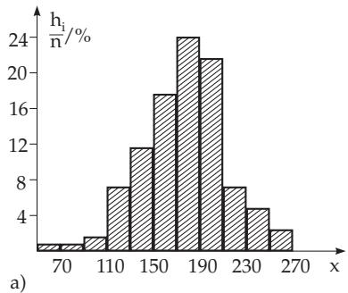
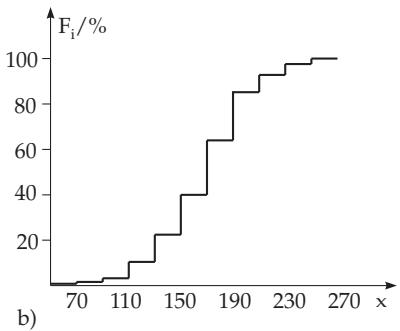

#### 16.3.2 Descriptive Statistics

##### 16.3.2.1 Statistical Summarization and Analysis of Given Data

In order to describe statistically a property of a certain element this property must be characterized by a random variable X. Usually, the n measured or observed values $x _ { i }$ of the property X form the starting point of a statistical investigation, which is made to find some parameters of the distribution or the distribution itself of X.

Every measured sequence of size n can be considered as a random sample from an infinite population, if the experiment or the measurement could be repeated infinitely many times under the same conditions. Since the size n of a measuring sequence can be very large, the statistical investigation proceeds as follows:

1. Protocol, Prime Notation The measured or observed values $x _ { i }$ are recorded in a protocol list. 2. Intervals or Classes Grouping the measured n data $x _ { i } \ ( i = 1 , 2 , \ldots , n )$ of the sample into k subintervals, so-called classes or class intervals of equal length or width h ; usually 10–20 classes.

3. Frequencies and Frequency Distribution The absolute frequencies ${ h _ { j } } \left( { j = 1 , 2 , . . . , k } \right)$ are the numbers $h _ { j }$ of data (occupancy number) belonging to a given interval $\Delta x _ { j }$ . The ratios $h _ { j } / n$ (in %) are called relative frequencies. If the values $h _ { j } / n$ are represented over the classes as rectangles, then one gets a graphical representation of the given frequency distribution, and this representation is called a histogram (Fig. 16.13a). The values $\bar { h _ { j } } / n$ can be considered as the empirical values of the probabilities or the density function $f ( x )$

Table 16.3 Frequency table
<table><tr><td rowspan=1 colspan=1>Class</td><td rowspan=1 colspan=1> $h _ { i }$ </td><td rowspan=1 colspan=1> $h _ { i } / n ( \% )$ </td><td rowspan=1 colspan=1> $\mathbf { \mathcal { F } } _ { i }$ (%)</td></tr><tr><td rowspan=2 colspan=1>50- 7071 - 90</td><td rowspan=2 colspan=1>11</td><td rowspan=1 colspan=1>0.8</td><td rowspan=1 colspan=1>0.8</td></tr><tr><td rowspan=1 colspan=1>0.8</td><td rowspan=1 colspan=1>1.6</td></tr><tr><td rowspan=1 colspan=1>91-110</td><td rowspan=1 colspan=1>2</td><td rowspan=1 colspan=1>1.6</td><td rowspan=1 colspan=1>3.2</td></tr><tr><td rowspan=1 colspan=1>111-130</td><td rowspan=1 colspan=1>9</td><td rowspan=1 colspan=1>7.2</td><td rowspan=1 colspan=1>10.4</td></tr><tr><td rowspan=1 colspan=1>131-150</td><td rowspan=1 colspan=1>15</td><td rowspan=1 colspan=1>12.0</td><td rowspan=1 colspan=1>22.4</td></tr><tr><td rowspan=1 colspan=1>151-170</td><td rowspan=1 colspan=1>22</td><td rowspan=1 colspan=1>17.6</td><td rowspan=1 colspan=1>40.0</td></tr><tr><td rowspan=1 colspan=1>171-190</td><td rowspan=1 colspan=1>30</td><td rowspan=1 colspan=1>24.0</td><td rowspan=1 colspan=1>64.0</td></tr><tr><td rowspan=1 colspan=1>191-210</td><td rowspan=1 colspan=1>27</td><td rowspan=1 colspan=1>21.6</td><td rowspan=1 colspan=1>85.6</td></tr><tr><td rowspan=1 colspan=1>211-230</td><td rowspan=1 colspan=1>9</td><td rowspan=1 colspan=1>7.2</td><td rowspan=1 colspan=1>92.8</td></tr><tr><td rowspan=1 colspan=1>231-250</td><td rowspan=1 colspan=1>6</td><td rowspan=1 colspan=1>4.8</td><td rowspan=1 colspan=1>97.6</td></tr><tr><td rowspan=1 colspan=1>251-270</td><td rowspan=1 colspan=1>3</td><td rowspan=1 colspan=1>2.4</td><td rowspan=1 colspan=1>100.0</td></tr></table>

4. Cumulative Frequency Adding the absolute or relative frequencies, gives the cumulative absolute or relative frequency

$$
F _ { j } = { \frac { h _ { 1 } + h _ { 2 } + \cdot \cdot \cdot + h _ { j } } { n } } \% \quad ( j = 1 , 2 , \ldots , k ) .\tag{16.125}
$$

A graphical representation of the empirical distribution function, which can be considered as an approximation of the unknown underlying distribution function $F ( x )$ is shown in Fig. 16.13b.

Suppose during a study $n = 1 2 5$ measurements have been performed. The results spread in the interval from 50 to 270, so it is reasonable to divide this interval into $k = 1 1$ classes with a length $h = 2 0$ . The frequency table see Table 16.3.

  
Figure 16.13

##### 16.3.2.2 Statistical Parameters

After summarizing and analyzing the data of the sample as given in 16.3.2.1, p. 832, it follows the approximation of the parameters of the distribution belonging to the random variable by the following parameters:

1. Mean

Using all measured data from the sample directly, the sample mean is

$$
{ \overline { { x } } } = { \frac { 1 } { n } } \sum _ { i = 1 } ^ { n } x _ { i } .\tag{16.126a}
$$

Using the means $\overline { { x } } _ { j }$ and frequencies $h _ { j }$ of the classes

$$
\overline { { x } } = \frac { 1 } { n } \sum _ { j = 1 } ^ { k } h _ { j } \overline { { x } } _ { j } .\tag{16.126b}
$$

2. Variance

Using all measured data directly the sample variance is

$$
s ^ { 2 } = { \frac { 1 } { n - 1 } } \sum _ { i = 1 } ^ { n } ( x _ { i } - { \overline { { x } } } ) ^ { 2 } .\tag{16.127a}
$$

Using the means $\overline { { x } } _ { j }$ and frequencies $h _ { j }$ of the classes

$$
s ^ { 2 } = { \frac { 1 } { n - 1 } } \sum _ { j = 1 } ^ { k } h _ { j } ( { \overline { { x } } } _ { j } - { \overline { { x } } } ) ^ { 2 } .\tag{16.127b}
$$

The class midpoint $u _ { j }$ (the midpoint of the corresponding interval) is also often used instead of $\overline { { x } } _ { j }$

3. Median

The median ˜x of a distribution is defined by

$$
P ( X < \tilde { x } ) = \frac { 1 } { 2 } .\tag{16.128a}
$$

The median may not be a uniquely determined point. The median of a sample is

$$
\tilde { x } = \left\{ \begin{array} { l l } { { x _ { m + 1 } , } } & { { \mathrm { i f ~ } n = 2 m + 1 , } } \\ { { \displaystyle { \frac { x _ { m + 1 } + x _ { m } } { 2 } } , } } & { { \mathrm { i f ~ } n = 2 m . } } \end{array} \right.\tag{16.128b}
$$

4. Range

$$
R = x _ { \operatorname* { m a x } } - x _ { \operatorname* { m i n } } .\tag{16.129}
$$

5. Mode or Modal Value

is the data value that occurs with greatest frequency. It is denoted by $D$
