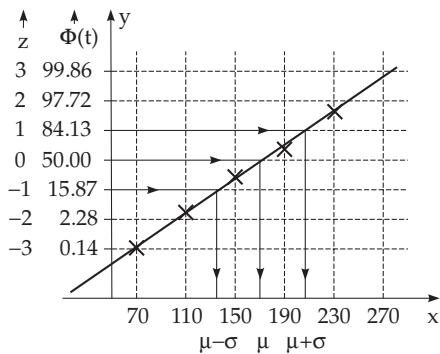
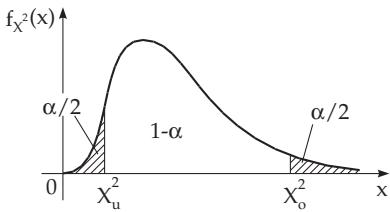

#### 16.3.3 Important Tests

One of the fundamental problems of mathematical statistics is to draw conclusions about the population from the sample. There are two types of the most important questions:

1. The type of the distribution is known, and one wants to get some estimate for its parameters. A distribution can be characterized mostly quite well by the parameters $\mu$ and $\sigma ^ { 2 }$ (here $\mu$ is the exact value of the expected value, and $\sigma ^ { 2 }$ is the exact variance), consequently one of the most important questions is how good an estimation can be given for them, based on the samples.

2. Some hypotheses are known about these parameters, and it is desirable to check if they are true. The most often occurring questions are:

a) Is the expected value equal to a given number or not?

b) Are the expected values for two populations equal or not?

c) Does the distribution of the random variable with $\mu$ and $\sigma ^ { 2 }$ fit a given distribution or not? etc.

Because in observations and measurements, the normal distribution has a very important role, it is to be discussed the goodness of a fit test for a normal distribution. The basic idea can be used for other distributions, too.

##### 16.3.3.1 Goodness of Fit Test for a Normal Distribution

There are diferent tests in mathematical statistics to decide if the data of a sample come from a normal distribution. Here a graphical one is discussed based on normal probability paper , and a numerical one based on the use of the chi-square distribution $\left( { } ^ { \mathfrak { a } } \chi ^ { 2 } \ \mathrm { t e s t } ^ { \mathfrak { n } } \right)$ .

1. Goodness of Fit Test with Probability Paper

a) Principle of Probability Paper The x-axis in a right-angled coordinate system is scaled equidistantly, while the y-axis is scaled on the following way: It is divided equidistantly with respect to ${ \bar { Z } } .$ but

scaled by

$$
y = \varPhi ( z ) = \frac { 1 } { \sqrt { 2 \pi } } \intop _ { - \infty } ^ { z } e ^ { - \frac { t ^ { 2 } } { 2 } } d t .\tag{16.130}
$$

If a random variable X has a normal distribution with expected value $\mu$ and variance $\sigma ^ { 2 }$ , then for its distribution function (see 16.2.4.2, p. 819)

$$
F ( x ) = \varPhi \left( \frac { x - \mu } { \sigma } \right) = \varPhi ( z )\tag{16.131a}
$$

holds, i.e.,

$$
\begin{array} { c } { { z } } \\ { { 0 } } \\ { { 1 } } \\ { { - 1 } } \end{array} \left| \begin{array} { c } { { x } } \\ { { \mu } } \\ { { \mu + \sigma } } \\ { { \mu - \sigma } } \end{array} \right.\tag{16.131c}
$$

$$
z = { \frac { x - \mu } { \sigma } }\tag{16.131b}
$$

must be valid, and so there is a linear relation between x and z and (16.131c).

b) Application of Probability Paper

Considering the data of the sample, calculating the cumulative relative frequencies according to (16.125), and sketch these onto the probability paper as the ordinates of the points with abscissae the upper class boundaries. If these points are approximately on a straight line, (with small deviations) then the random variable can be considered as a normal random variable (Fig. 16.14).

As it can be seen from Fig. 16.14, the distribution to which the data of Table 16.3 belong, can be considered as a normal distribution. Furthermore one can see that $\mu \approx 1 7 6 , \sigma \approx 3 7 . 5$ (from the x values belonging to the 0 and 1 values of Z).

Remark: The values $F _ { i }$ of the relative cumulative frequencies can be plotted more easily on the

Figure 16.14

probability paper, if its scaling is equidistant with respect to $y ,$ which means a non-equidistant scaling for the ordinates.

2. $\chi ^ { 2 }$ test for Goodness of Fit

It is to check if a random variable X can be considered as normal in the sense of 16.2.4.2, p. 819. The range of X is divided into k classes and the upper limit of the j-th $( j = 1 , 2 , \ldots , k )$ class is denoted by $\xi _ { j }$ . Let $p _ { j }$ be the “theoretical” probability that X is in the j-th class, i.e.,

$$
p _ { j } = F ( \xi _ { j } ) - F ( \xi _ { j - 1 } ) ,\tag{16.132a}
$$

where $F ( x )$ is the distribution function of X $( j = 1 , 2 , \ldots , k ; \xi _ { 0 }$ is the lower limit of the first class with $F ( \xi _ { 0 } ) = \mathrm { \dot { 0 } ) }$ . Because X is supposed to be normal, then

$$
F ( \xi _ { j } ) = \varPhi \left( \frac { \xi _ { j } - \mu } { \sigma } \right)\tag{16.132b}
$$

must hold, where $\varPhi ( x )$ is the distribution function of the standard normal distribution (see 16.2.4.2, p. 819). The parameters $\mu$ and $\sigma ^ { 2 }$ of the population are usually not known. Therefore x and $s ^ { 2 }$ are to be used as an approximation of them. The decomposition of the range of X should be made so that the expected frequencies for every class should exceed 5, i.e., if the size of the sample is $n ,$ then $n p _ { j } \geq 5$ Now, considering the sample $( x _ { 1 } , x _ { 2 } , \ldots , x _ { n } )$ of size n and calculating the corresponding frequencies $h _ { j }$ (for the classes given above), then the random variable

$$
\chi _ { S } ^ { 2 } = \sum _ { j = 1 } ^ { k } \frac { ( h _ { j } - n p _ { j } ) ^ { 2 } } { n p _ { j } }\tag{16.132c}
$$

has approximately $\mathrm { a } \chi ^ { 2 }$ distribution with $m = k - 1$ degrees of freedom, if $\mu$ and $\sigma ^ { 2 }$ are known, $m = k { - } 2$ if one of them is estimated from the sample, and $m = k - 3$ if both are estimated by x and $s ^ { 2 }$

The test, if a random variable X has a normal distribution (χ2-approximation test) consists in the comparison of the experimental $\chi _ { S } ^ { 2 }$ of the sample with the corresponding $\chi _ { \alpha ; m } ^ { 2 }$ from Table 21.18, p. 1135 for a given statistical significance level α and m degrees of freedom.

Now one decides a significant level α and one takes out of the Table 21.18, p. 1135 the quantile $\chi _ { \alpha ; k - i } ^ { 2 }$ of the corresponding $\chi ^ { 2 }$ distribution (i depends on the number of unknown parameters). This means $P ( \chi ^ { 2 } \geq \chi _ { \alpha ; k - i } ^ { 2 } ) = \alpha$ holds. Comparing the value $\chi _ { S } ^ { 2 }$ from (16.132c) and this quantile, and if

$$
\chi _ { S } ^ { 2 } < \chi _ { \alpha ; k - i } ^ { 2 }\tag{16.132d}
$$

holds, one can accept the assumption that the sample came from a normal distribution. This test is also called the $\chi ^ { 2 }$ test for goodness offit.

The following $\chi ^ { 2 }$ test is based on the example on p. 833. The sample size is $n = 1 2 5$ , with the mean $\overline { { x } } = 1 7 6 . 3 2$ and variance $s ^ { 2 } = 3 6 . 7 0$ . These values are used as approximations of the unknown parameters $\mu$ and $\sigma ^ { 2 }$ of the population. Determining the test statistic $\dot { \chi } _ { S } ^ { 2 }$ according to (16.132c) after performing the calculations according to (16.132a) and (16.132b), yields the data in Table 16.4.

Table 16.4 $\chi ^ { 2 }$ test
<table><tr><td rowspan=1 colspan=1> $\xi _ { j }$ </td><td rowspan=1 colspan=1> $h _ { j }$ </td><td rowspan=1 colspan=1> $\xi _ { j } - \mu$  $\sigma$ </td><td rowspan=1 colspan=1> $\varPhi \left( \frac { \xi _ { j } - \mu } { \sigma } \right)$ </td><td rowspan=1 colspan=2> $p _ { j }$ </td><td rowspan=1 colspan=2> $n p _ { j }$ </td><td rowspan=1 colspan=1> $( h _ { j } - n p _ { j } ) ^ { 2 }$  $n p _ { j }$ </td></tr><tr><td rowspan=1 colspan=1>70</td><td rowspan=1 colspan=1>1)</td><td rowspan=1 colspan=1>-2.90</td><td rowspan=1 colspan=1>0.0019</td><td rowspan=1 colspan=2>0.0019</td><td rowspan=5 colspan=2>0.23750.937512.97503.21258.585716.5000</td><td rowspan=5 colspan=1>0.000050.1635</td></tr><tr><td rowspan=1 colspan=1>90</td><td rowspan=1 colspan=1>1</td><td rowspan=1 colspan=1>-2.35</td><td rowspan=1 colspan=1>0.0094</td><td rowspan=2 colspan=2>0.00750.0257</td></tr><tr><td rowspan=1 colspan=1>110</td><td rowspan=1 colspan=1>2</td><td rowspan=1 colspan=1>-1.81</td><td rowspan=1 colspan=1>0.0351</td></tr><tr><td rowspan=1 colspan=1>130</td><td rowspan=1 colspan=1>9</td><td rowspan=1 colspan=1>-1.26</td><td rowspan=1 colspan=1>0.1038</td><td rowspan=1 colspan=2>0.0687</td></tr><tr><td rowspan=1 colspan=1>150</td><td rowspan=1 colspan=1>15</td><td rowspan=1 colspan=1>-0.72</td><td rowspan=1 colspan=1>0.2358</td><td rowspan=1 colspan=2>0.1320</td></tr><tr><td rowspan=1 colspan=1>170</td><td rowspan=1 colspan=1>22</td><td rowspan=1 colspan=1>-0.17</td><td rowspan=1 colspan=1>0.4325</td><td rowspan=1 colspan=2>0.1967</td><td rowspan=1 colspan=2>24.5875</td><td rowspan=1 colspan=1>0.2723</td></tr><tr><td rowspan=1 colspan=1>190</td><td rowspan=1 colspan=1>30</td><td rowspan=1 colspan=1>0.37</td><td rowspan=1 colspan=1>0.6443</td><td rowspan=1 colspan=2>0.2118</td><td rowspan=1 colspan=2>26.4750</td><td rowspan=1 colspan=1>0.4693</td></tr><tr><td rowspan=1 colspan=1>210</td><td rowspan=1 colspan=1>27</td><td rowspan=1 colspan=1>0.92</td><td rowspan=1 colspan=1>0.8212</td><td rowspan=1 colspan=2>0.1769</td><td rowspan=2 colspan=2>22.112513.3375</td><td rowspan=2 colspan=1>1.08031.4106</td></tr><tr><td rowspan=1 colspan=1>230</td><td rowspan=1 colspan=1>9</td><td rowspan=1 colspan=1>1.46</td><td rowspan=1 colspan=1>0.9279</td><td rowspan=1 colspan=2>0.1067</td></tr><tr><td rowspan=1 colspan=1>250</td><td rowspan=1 colspan=1></td><td rowspan=1 colspan=1>2.01</td><td rowspan=1 colspan=1>0.9778</td><td rowspan=2 colspan=2>0.04990.0168</td><td rowspan=2 colspan=1>6.23752.1000</td><td rowspan=2 colspan=1>8.3375</td><td rowspan=2 colspan=1>0.0526</td></tr><tr><td rowspan=2 colspan=1>270</td><td rowspan=2 colspan=1> $_ { \mathrm { ~ 3 ~ } } ^ { \mathrm { ~ 6 ~ } } \} \mathfrak { g }$ </td><td rowspan=2 colspan=1>2.55</td><td rowspan=2 colspan=1>0.9946</td><td rowspan=1 colspan=1>0.016</td></tr><tr><td rowspan=1 colspan=2></td><td rowspan=1 colspan=2></td><td rowspan=1 colspan=1> $\chi _ { S } ^ { 2 } = 3 . 4 4 8 6$ </td></tr></table>

It follows from the last column that $\chi _ { S } ^ { 2 } = 3 . 4 4 8 6$ . Because of the requirement $n p _ { j } \geq 5 ,$ , the number of classes is reduced from $k = 1 1$ to $k ^ { * } = \tilde { k } - 4 = 7$ . Since for the calculation of the theoretical frequencies $n p _ { j }$ the estimated values x and $s ^ { 2 }$ of the sample are used instead of $\mu$ and $\sigma ^ { 2 }$ of the population, so the number of degrees of freedom of the corresponding $\chi ^ { 2 }$ distribution is reduced by 2. The critical value is the quantile $\breve { \chi _ { \alpha ; k ^ { * } - 1 - 2 } ^ { 2 } }$ . For $\alpha = 0 . 0 5$ one gets $\chi _ { 0 . 0 5 ; 4 } ^ { 2 } = 9 . 5$ from Table 21.18, p. 1135, so because of the inequality $\chi _ { S } ^ { 2 } < \chi _ { 0 . 0 5 ; 4 } ^ { 2 }$ there is no contradiction to the assumption that the sample is from a population with a normal distribution.

##### 16.3.3.2 Distribution of the Sample Mean

Let X be a continuous random variable. Suppose arbitrarily many samples of size n can be taken from the corresponding population. Then the sample mean is also a random variable $\overline { { X } }$ , and it is also continuous.

1. Confidence Probability of the Sample Mean

If X has a normal distribution with parameters $\mu$ and $\sigma ^ { 2 }$ , then X is also a normal random variable with parameters $\mu$ and $\sigma ^ { 2 } / n .$ , i.e., the density function ${ \overline { { f } } } ( x )$ of $\overline { { X } }$ is concentrated more around $\mu$ than the density function $f ( x )$ of the population. For any value $\varepsilon > 0$

$$
P ( \left| X - \mu \right| \leq \varepsilon ) = 2 \varPhi \left( \frac { \varepsilon } { \sigma } \right) - 1 , \quad P ( | \overline { { X } } - \mu | \leq \varepsilon ) = 2 \varPhi \left( \frac { \varepsilon \sqrt { n } } { \sigma } \right) - 1\tag{16.133}
$$

Table 16.5 Confidence level for the sample mean  
holds. Consequently with increasing sample size n the probability that the sample mean is a good approximation of $\mu$ is also increasing.
<table><tr><td>n</td><td> $P \left( | { \overline { { X } } } - \mu | \leq { \frac { 1 } { 2 } } \sigma \right)$ </td><td></td><td></td></tr><tr><td>14</td><td>38.29 % 68.27 % 95.45 %</td></tr></table>

For $\varepsilon = \frac { 1 } { 2 } \sigma$ from (16.133) $P \left( | \overline { { X } } - \mu | \leq \frac { 1 } { 2 } \sigma \right) = 2 \varPhi \left( \frac { 1 } { 2 } \sqrt { n } \right) - 1$ and for diferent values of n one gets the values listed in Table 16.5. As can be seen from Table 16.5, e.g., that with a sample size $n = 4 9$ the probability that the sample mean x difers from $\mu$ by less than $\pm { \frac { 1 } { 2 } } \sigma \ { \mathrm { i s ~ 9 9 . 9 5 ~ \% } }$

2. Sample Mean Distribution for Arbitrary Distribution of the Population

The random variable X has an approximately normal distribution with parameters $\mu$ and $\sigma ^ { 2 } / n$ for any distribution of the population with expected value $\mu$ and variance $\sigma ^ { 2 }$ . This fact is based on the central limit theorem.

##### 16.3.3.3 Confidence Limits for the Mean

1. Confidence Interval for the Mean with a Known Variance $\sigma ^ { 2 }$

If X is a random variable with parameters $\mu$ and $\sigma ^ { 2 }$ , then according to 16.3.3.2, p. 836, $\overline { { X } }$ is approximately a normal random variable with parameters $\mu$ and $\sigma ^ { 2 } / n$ . Then substitution of

$$
{ \overline { { Z } } } = { \frac { { \overline { { X } } } - \mu } { \sigma } } { \sqrt { n } }\tag{16.134}
$$

yields a random variable $\overline { { Z } }$ which has approximately a standard normal distribution, therefore

$$
P ( | \overline { { Z } } | \leq \varepsilon ) = \int _ { - \varepsilon } ^ { \varepsilon } \varphi ( x ) d x = 2 \varPhi ( \varepsilon ) - 1 .\tag{16.135}
$$

If the given significance level is α, namely,

$$
P ( | \overline { { Z } } | \leq \varepsilon ) = 1 - \alpha ,\tag{16.136}
$$

is required, then $\varepsilon = \varepsilon ( \alpha )$ can be determined from (16.135), $\mathrm { e . g . }$ , from Table 21.17, p. 1133, for the standard normal distribution. From $| \overline { { Z } } | \leq \varepsilon ( \alpha )$ and from (16.134) the relation

$$
\mu = \overline { { x } } \pm \frac { \sigma } { \sqrt { n } } \varepsilon ( \alpha )\tag{16.137}
$$

follows. The values $\overline { { x } } \pm \frac { \sigma } { \sqrt { n } } \varepsilon ( \alpha )$ in (16.137) are called confidence limits for the expected value and the

interval between them is called a confidence interval for the expected value $\mu$ with a known $\sigma ^ { 2 }$ and given significance level $\alpha .$ . In other words: The expected value $\mu$ is between the confidence limits (16.137) with a probability $1 - \alpha$

Remark: If the sample size is large enough, then $s ^ { 2 }$ can be used instead of $\sigma ^ { 2 }$ in (16.137). The sample size is considered to be large, if $n > 1 0 0$ , but in practice, depending on the actual problem, it is considered to be suficiently large if $n > 3 0$ . If n is not large enough, then in the case of a normally distributed population the t distribution is applied to determine the confidence limits as in (16.140).

2. Confidence Interval for the Expected Value with an Unknown Variance $\sigma ^ { 2 }$ If the population is approximately normally distributed and its variance $\sigma ^ { 2 }$ is unknown, then it is replaced by the sample variance $s ^ { 2 }$ and instead of (16.134) one gets the random variable

$$
T = { \frac { { \overline { { X } } } - \mu } { s } } { \sqrt { n } } ,\tag{16.138}
$$

which has a t distribution (see 16.2.4.8, p. 824) with $m = n - 1$ degrees of freedom. Here n is the size of the sample. If n is large, $\mathrm { e . g . } , n > 1 0 0$ holds, then T can be considered as a normal random variable as $Z$ in (16.134). For a given significance level α holds

$$
P ( \left| T \right| \leq \varepsilon ) = \int _ { - \varepsilon } ^ { \varepsilon } f _ { t } ( x ) d x = P \left( { \frac { \left| { \overline { { X } } } - \mu \right| } { s } } { \sqrt { n } } \leq \varepsilon \right) = 1 - \alpha .\tag{16.139}
$$

From (16.139) follows that $\varepsilon = \varepsilon ( \alpha , n ) = t _ { \alpha / 2 ; n - 1 }$ , where $t _ { \alpha / 2 ; n - 1 }$ is the quantile of the t distribution (with n 1 degrees of freedom) for the significance level α (Table 21.20, p. 1138). From $| T | = t _ { \alpha / 2 ; n - 1 }$

$$
\mu = \overline { { x } } \pm \frac { s } { \sqrt { n } } t _ { \alpha / 2 ; n - 1 }\tag{16.140}
$$

follows. The values $\overline { { x } } \pm \frac { s } { \sqrt { n } } t _ { \alpha / 2 ; n - 1 }$ are called the confidence limits for the expected value $\mu$ of the distribution of the population with an unknown variance $\sigma ^ { 2 }$ and with a given significance level α. The interval between these limits is the confidence interval.

A sample contains the following 6 measured values: $0 . 8 4 2 ; 0 . 8 4 6 ; 0 . 8 3 5 ; 0 . 8 3 9 ; 0 . 8 4 3 ; 0 . 8 3 8$ . Then $\overline { { x } } = 0 . 8 4 0 5$ and $s = 0 . 0 0 3 9 4$ is obtained.

What is the maximum deviation of the sample mean $\overline { { x } }$ from the expected value $\mu$ of the population distribution, if the significance level α is given as 5 % or 1 % ?

1. $\alpha = 0 . 0 5 \mathrm { { : } }$ one reads from Table 21.20, p. 1138, that $t _ { \alpha / 2 ; 5 } = 2 . 5 7$ , consequently

$| \overline { { X } } - \mu | \leq 2 . 5 7 \cdot 0 . 0 0 3 9 4 / \sqrt { 6 } = 0 . 0 0 4 2$ . Thus, the sample mean $\overline { { x } } = 0 . 8 4 0 5$ difers from the expected value $\mu$ by less than $\pm 0 . 0 0 4 2$ with a probability 95 %.

2. $\alpha = 0 . 0 1 \colon t _ { \alpha / 2 ; 5 } = 4 . 0 3 ; | \overline { { X } } - \mu | \le 4 . 0 3 \cdot 0 . 0 0 3 9 4 / \sqrt { 6 } = 0 . 0 0 6 5$ , i.e., the sample mean $\overline { { x } }$ difers from $\mu$ by less than $\pm 0 . 0 0 6 5$ with a probability 99 %.

##### 16.3.3.4 Confidence Interval for the Variance

If the random variable X has a normal distribution with parameters $\mu$ and $\sigma ^ { 2 }$ , then the random variable

$$
\chi ^ { 2 } = \left( n - 1 \right) \frac { s ^ { 2 } } { \sigma ^ { 2 } }\tag{16.141}
$$

has a $\chi ^ { 2 }$ distribution with $m = n - 1$ degrees of freedom, where n is the sample size and $s ^ { \ 2 }$ is the sample deviation. $f _ { \chi ^ { 2 } } ( x )$ denotes the density function of the $\chi ^ { 2 }$ distribution in Fig. 16.15, and one sees that

$$
P ( \chi ^ { 2 } < \chi _ { u } ^ { 2 } ) = P ( \chi ^ { 2 } > \chi _ { o } ^ { 2 } ) = \frac { \alpha } { 2 } .\tag{16.142}
$$

Thus, using the quantiles of the $\chi ^ { 2 }$ distribution (see Table 21.18, p. 1135) gives

  
Figure 16.15

$$
\chi _ { u } ^ { 2 } = \chi _ { 1 - \alpha / 2 ; n - 1 } ^ { 2 } , \quad \chi _ { o } ^ { 2 } = \chi _ { \alpha / 2 ; n - 1 } ^ { 2 } .\tag{16.143}
$$

Considering (16.141) one gets the following estimation for the unknown variance $\sigma ^ { 2 }$ of the population

distribution with a significance level α:

$$
\frac { ( n - 1 ) s ^ { 2 } } { \chi _ { \alpha / 2 ; n - 1 } ^ { 2 } } \leq \sigma ^ { 2 } \leq \frac { ( n - 1 ) s ^ { 2 } } { \chi _ { 1 - \alpha / 2 ; n - 1 } ^ { 2 } } .\tag{16.144}
$$

The confidence interval given in (16.144) for $\sigma ^ { 2 }$ is fairly large for small sample sizes.

For the numerical example (p. 838) with 6 measured values and for $\alpha = 5 \%$ one gets from Table 21.18, p. 1135, $\chi _ { 0 . 0 2 5 ; 5 } ^ { 2 } = 0 . 8 3 \mathrm { i }$ and $\dot { \chi } _ { 0 . 9 7 5 ; 5 } ^ { 2 } = 1 2 . 8$ , so it follows from (16.144) that $0 . 6 2 5 \cdot s \leq \sigma \leq$ 2.453 s with $s = 0 . 0 0 3 9 4$

##### 16.3.3.5 Structure of Hypothesis Testing

A statistical hypothesis testing has the following structure:

1. First a hypothesis H is to be developed that the sample belongs to a population with some given properties, e.g.,

H: The population distribution has a normal distribution with parameters $\mu$ and $\sigma ^ { 2 }$ (or another given distribution), or

H: For the non-known $\mu$ an approximative value (estimate value) $\mu _ { 0 }$ is inserted which can be got ,e.g., by rounding of the sample mean ${ \overline { { x } } } ,$ or

H: Two populations have the same expected value, $\mu _ { 1 } - \mu _ { 2 } = 0$ , etc.

2. A confidence interval B is to be defined, based on the hypothesis H (in general with tables). The value of the sample function should be in this interval with the given probability, e.g., with probability 99% for $\alpha = 0 . 0 \bar { 1 }$

3. Calculating the value of the sample function and accepting the hypothesis if this value is in the given interval B, otherwise rejecting it.

Test of the hypothesis H: $\mu = \mu _ { 0 }$ with a significance level α.

The random variable $T = { \frac { { \overline { { X } } } - \mu _ { 0 } } { s } } { \sqrt { n } }$ has a t distribution with $m = n - 1$ degrees of freedom according to 16.3.3.3, p. 837. It follows from this that this hypothesis is to reject, if x is not in the confidence interval given by (16.140), i.e., if

$$
| \overline { { x } } - \mu _ { 0 } | \geq \frac { s } { \sqrt { n } } t _ { \alpha / 2 ; n - 1 }\tag{16.145}
$$

holds. One says that there is a significant diference. For further problems about tests see [16.16].
