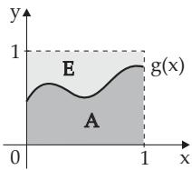
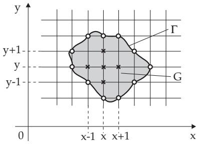

#### 16.3.5 Monte Carlo Methods

##### 16.3.5.1 Simulation

Simulation methods are based on constructing equivalent mathematical models. These models are then easily analyzed by computer. In such cases, one talks about digital simulation. A special case is given by Monte Carlo methods when certain quantities of the model are randomly selected. These random elements are selected by using random numbers.

##### 16.3.5.2 Random Numbers

Random numbers are realizations of certain random quantities (see 16.2.2, p. 811) satisfying given distributions. In this way it is possible to distinguish diferent kinds of random numbers.

1. Uniformly Distributed Random Numbers

These numbers are uniformly distributed in the interval $[ 0 , 1 ]$ , they are realizations of the random variable X with the following density function $f _ { 0 } ( x )$ and distribution function $F _ { 0 } ( x )$

$$
f _ { 0 } ( x ) = \left\{ \begin{array} { l l } { 1 } & { \mathrm { f o r } \quad 0 \leq x \leq 1 , } \\ { 0 } & { \mathrm { o t h e r w i s e } ; } \end{array} \right. \quad \quad F _ { 0 } ( x ) = \left\{ \begin{array} { l l } { 0 } & { \mathrm { f o r } \quad 0 \leq x , } \\ { x } & { \mathrm { f o r } \quad 0 < x \leq 1 , } \\ { 1 } & { \mathrm { f o r } \quad x \geq 1 . } \end{array} \right.\tag{16.168}
$$

1. Method of the Inner Digits of Squares A simple method to generate random numbers is suggested by J. v. Neumann. It is also called the method of the inner digits of squares, and it starts from a decimal number $z \in ( 0 , 1 )$ which has 2n digits. First $z ^ { 2 }$ is formed, getting a decimal number which has 4n digits. Erasing its first and its last n digits, so one again has a number with 2n digits. To get further numbers, this procedure is repeated. In this way 2n digit decimal numbers are produced from the interval [0, 1] which can be considered as random numbers with a uniform distribution. The value of $2 n$ is selected according to the largest number representable in the computer. For example, choosing $2 n = 1 0$ . This procedure is seldom recommended, since it produces more smaller numbers than it should. Several other diferent methods have been developed.

$$
z = z _ { 0 } = 0 , 1 2 3 4 , z _ { 0 } ^ { 2 } = 0 , 0 1 \overline { { 5 2 2 7 } } \overline { { 5 6 } } ,
$$

$$
z = z _ { 1 } = 0 , 5 2 2 7 , z _ { 1 } ^ { 2 } = 0 , 2 7 \overline { { { 3 2 1 5 } } } \overline { { { 2 9 } } } ,
$$

$$
z = z _ { 2 } = 0 , 3 2 1 5 \ \mathrm { e t c } .
$$

The first three random numbers are $z _ { 0 } , z _ { 1 }$ and $z _ { 2 }$ .

2. Congruence Method The so-called congruence method is widely used: A sequence of integers $z _ { i } ~ ( i = 0 , \bar { 1 } , 2 , \dots )$ is formed by the recursion formula

$$
z _ { i + 1 } \equiv c \cdot z _ { i } \mod m .\tag{16.169}
$$

Here $z _ { \mathrm { 0 } }$ is an arbitrary positive number and c and m denote positive integers, which must be suitably chosen. For $z _ { i + 1 }$ one takes the smallest non-negative integer satisfying the congruence (16.169). The numbers $z _ { i } / m$ are between 0 and 1 and can be used for uniformly distributed random numbers.

3. Remarks

a) Choosing $m = 2 ^ { r }$ , where r is the number of bits in a computer word, e.g., $r = 4 0$ . Then the number c is to be chosen in the order of $\sqrt { m }$

b) Random number generators using certain algorithms produce so-called pseudo-random numbers.

c) On calculators and also in computers, “ran” or “rand” is used for generating random numbers.

2. Random Numbers with other Distributions

To get random numbers with an arbitrary distribution function $F ( x )$ the following procedure is in use: Consider a sequence of uniformly distributed random numbers $\xi _ { 1 } , \xi _ { 2 } , \ldots$ from [0, 1]. With these numbers the numbers $\eta _ { i } = F ^ { - 1 } ( \xi _ { i } )$ are formed for $i = 1 , 2 , \dots$ . Here $\dot { F } ^ { - 1 } ( x )$ is the inverse function of the distribution function $F ( x )$ . Then one gets:

$$
P ( \eta _ { i } \leq x ) = P ( F ^ { - 1 } ( \xi _ { i } ) \leq x ) = P ( \xi _ { i } \leq F ( x ) ) = \intop _ { 0 } ^ { F ( x ) } f _ { 0 } ( t ) d t = F ( x ) ,\tag{16.170}
$$

i.e., the random numbers $\eta _ { 1 } , \eta _ { 2 } , . . .$ . satisfy a distribution with the distribution function $F ( x )$

3. Tables and Application of Random Numbers

1. Construction Random number tables can be constructed in the following way. Ten identical chips are indexed by the numbers $0 , 1 , 2 , \ldots , 9$ . Placing them into a box and shufle them. One of them is then selected, and its index is written into the table. Then the chip is to be replaced into the box, again shufling, and choosing the next one. In this way a sequence of random numbers is produced, which is written in groups (for easier usage) into the table. In Table 21.21, p. 1139, four random digits form a group.

In the procedure, it must be guaranteed that the digits 0, 1, 2, . . . , 9 always have equal probability.

2. Application of Random Numbers The use of a table of random numbers is demonstrated with an example.

Suppose one chooses randomly $n = 2 0$ items from a population of $N = 2 5 0 ~ \mathrm { i t e m s }$ . The objects are renumbered from 000 to 249. Then a number is chosen in an arbitrary column or row in Table 21.21, p. 1139, and a rule is determined of how the remaining 19 random numbers should be chosen, e.g., vertically, horizontally or diagonally. Only the first three digits are considered from these random numbers, and they are used only if they form a number smaller than 250.

##### 16.3.5.3 Example of a Monte Carlo Simulation

The approximate evaluation of the integral

$$
I = \int _ { 0 } ^ { 1 } g ( x ) d x\tag{16.171}
$$

is considered as an example of the use of uniformly distributed random numbers in a simulation. Two solution methods are discussed here.

1. Applying the Relative Frequency

  
Figure 16.16

Supposing $0 \leq \check { g } ( x ) \leq 1$ holds; this condition can always be guaranteed by a transformation (see (16.175), p. 845). Then the integral I is an area inside the unit square E (Fig. 16.16). Considering the numbers of a sequence of uniformly distributed random numbers from the interval [0, 1] in pairs as the coordinates of points of the unit square $E _ { i }$ , one gets n points ${ \cal P } _ { i } \left( i = \right.$ $1 , 2 , \ldots , n )$ . Denoting by $m$ the number of points inside the area $A ,$ then considering the notion of the relative frequency (see 16.2.1.2, p. 808) for the integral follows:

$$
\intop _ { 0 } ^ { 1 } g ( x ) d x \approx { \frac { m } { n } } .\tag{16.172}
$$

To achieve relatively good accuracy with the ratio in (16.172), a very large number of random numbers is necessary. This is the reason why one is looking for possibilities to improve the accuracy. One of these methods is the following Monte Carlo method. Some others can be found in the literature (see Lit. [16.20]).

2. Approximation by the Mean Value

To determine (16.171), one starts with n uniformly distributed random numbers $\xi _ { 1 } , \xi _ { 2 } , \ldots , \xi _ { n }$ as the realization of the uniformly distributed random variable $X$ Then the values $g _ { i } = g ( \xi _ { i } ) ( i = 1 , 2 , \ldots , n )$ are realizations of the random variable $g ( X )$ , whose expectation according to formula (16.49a,b), p. 813, is:

$$
E ( g ( X ) ) = \intop _ { - \infty } ^ { \infty } g ( x ) f _ { 0 } ( x ) d x = \intop _ { 0 } ^ { 1 } g ( x ) d x \approx \frac { 1 } { n } \sumop _ { i = 1 } ^ { n } g _ { i } .\tag{16.173}
$$

This method, which uses a sample to obtain the mean value, is also called the usual Monte Carlo method.

##### 16.3.5.4 Application of the Monte Carlo Method in Numerical Mathematics

1. Evaluation of Multiple Integrals

First, it is to show how to transform a definite integral of one variable (16.174a) into an expression which contains the integral (16.174b).

$$
I ^ { * } = \intop _ { a } ^ { b } h ( x ) d x
$$

$$
( 1 6 . 1 7 4 \mathrm { a } ) \qquad I = \int _ { 0 } ^ { 1 } g ( x ) d x \quad \mathrm { w i t h } \quad 0 \leq g ( x ) \leq 1 .\tag{16.174b}
$$

Then the Monte Carlo method given in 16.3.5.3 can be applied introducing the following notation:

$$
x = a + ( b - a ) u , \qquad m = \operatorname* { m i n } _ { x \in [ a , b ] } h ( x ) , \qquad M = \operatorname* { m a x } _ { x \in [ a , b ] } h ( x ) .\tag{16.175}
$$

Then (16.174a) becomes

$$
I ^ { * } = ( M - m ) ( b - a ) \int _ { 0 } ^ { 1 } \frac { h ( a + ( b - a ) u ) - m } { M - m } d u + ( b - a ) m ,\tag{16.176}
$$

where the integrand ${ \frac { h ( a + ( b - a ) u ) - m } { M - m } } = g ( u )$ satisfies the relation $0 \leq g ( u ) \leq 1$

The approximate evaluation of multiple integrals with Monte Carlo methods is demonstrated by an example of a double integral

$$
V = \iint _ { S } h ( x , y ) d x d y \quad { \mathrm { w i t h } } \quad h ( x , y ) \geq 0 .\tag{16.177}
$$

S denotes a plane surface domain given by the inequalities $a \leq x \leq b$ and $\varphi _ { 1 } ( x ) \leq y \leq \varphi _ { 2 } ( x )$ , where $\varphi _ { 1 } ( x )$ and $\varphi _ { 2 } ( x )$ denote given functions. Then $V$ can be considered as the volume of a cylindrical solid $K$ , which stands perpendicular to the x, y plane and its upper surface is given by $h ( x , y )$ . If $h ( x , y ) \leq e$ holds, then this solid is in a block $Q$ given by the inequalities $a \leq x \leq b , \ c \leq y \leq d , \ 0 \leq z \leq$ $\begin{array} { r l } { e } & { { } ( a , b , c , d , } \end{array}$ e const). After a transformation similar to (16.175), one gets from (16.177) an expression containing the integral

$$
V ^ { * } = \iint g ( u , v ) d u d v \quad \mathrm { w i t h } \quad 0 \leq g ( u , v ) \leq 1 ,\tag{16.178}
$$

where $V ^ { * }$ can be considered as the volume of a solid $K ^ { * }$ in the three-dimensional unit cube. The integral (16.178) is approximated by the Monte Carlo method in the following way: Triplets of the numbers of a sequence of uniformly distributed random numbers from the interval [0, 1] are considered as the coordinates of points $P _ { i } \ ( i = 1 , 2 , \dots , n )$ of the unit cube, and count how many points among $P _ { i }$ belong to the solid ${ \dot { K } } ^ { * }$ . If m point belong to $K ^ { * }$ , then analogously to (16.172)

$$
V ^ { * } \approx \frac { m } { n } .\tag{16.179}
$$

Remark: In definite integrals with one integration variable one should use the methods given in 19.3, p. 963. For the evaluation of multiple integrals, the Monte Carlo method is still often recommended.

2. Solution of Partial Diferential Equations with the Random Walk Process The Monte Carlo method can be used for the approximate solution of partial diferential equations with the random walk process.

  
Figure 16.17

a) Example of a Boundary Value Problem: Consider the following boundary value problem as an example:

$$
\Delta u = \frac { \partial ^ { 2 } u } { \partial x ^ { 2 } } + \frac { \partial ^ { 2 } u } { \partial y ^ { 2 } } = 0 \quad \mathrm { f o r } \quad ( x , y ) \in G ,\tag{16.180a}
$$

$$
u ( x , y ) = f ( x , y ) \quad { \mathrm { f o r } } \quad ( x , y ) \in T .\tag{16.180b}
$$

Here G is a simply connected domain in the x, y plane; Γ denotes the boundary of $G$ (Fig.16.17). Similarly to the diference method in paragraph 19.5.1, p. 976 G is covered by a quadratic lattice, where it can be assumed, without loss of generality, that the step size can be chosen as $h = 1$

In this way interior lattice points $P ( x , y )$ and boundary points $R _ { i }$ are obtained. The boundary points $R _ { i }$ , which are at the same time also lattice points, are considered in the following discussion as points of the boundary $\varGamma$ of G, i.e.:

$$
u ( R _ { i } ) = f ( R _ { i } ) \quad ( i = 1 , 2 , \ldots , N )\tag{16.181}
$$

b) Solution Principle: One imagines that a particle starts a random walk from an interior point $P ( x , y )$ . That is:

1. The particle moves randomly from $P ( x , y )$ to one of the four neighboring points. To each of these four grid points $1 / 4$ is assigned as the probability to move into them.

2. If the particle reaches a boundary point $R _ { i }$ , then the random walk terminates there with probability one.

It can be proven that a particle starting at any interior point P reaches a boundary point $R _ { i }$ after a finite number of steps with probability one. Denoting by

$$
p ( P , R _ { i } ) = p ( ( x , y ) , R _ { i } )\tag{16.182}
$$

the probability that a random walk starting at $P ( x , y )$ will terminate at the boundary point $R _ { i } .$ then one gets

$$
p ( R _ { i } , R _ { i } ) = 1 , \quad p ( R _ { i } , R _ { j } ) = 0 \quad \mathrm { f o r } \quad i \neq j \quad \mathrm { a n d }\tag{16.183}
$$

$$
p ( ( x , y ) , R _ { i } ) = \frac { 1 } { 4 } [ p ( ( x - 1 , y ) , R _ { i } ) + p ( ( x + 1 , y ) , R _ { i } ) + p ( ( x , y - 1 ) , R _ { i } ) + p ( ( x , y + 1 ) , R _ { i } ) ] .\tag{16.184}
$$

The equation (16.184) is a diference equation for $p ( ( x , y ) , R _ { i } )$ . If starting n random walks from the point $P ( x , y )$ , from which $m _ { i }$ terminates at $R _ { i } ( m _ { i } \leq \stackrel { \cdot } { n } )$ , then

$$
p ( ( x , y ) , R _ { i } ) ) \approx \frac { m _ { i } } { n } .\tag{16.185}
$$

The equation (16.185) gives an approximate solution of the diferential equation (16.180a) with the boundary condition (16.181). The boundary condition (16.180b) will be fulfilled if substituting

$$
v ( P ) = v ( x , y ) = \sum _ { i = 1 } ^ { N } f ( R _ { i } ) p ( ( x , y ) , R _ { i } ) ,\tag{16.186}
$$

because of (16.184), $v ( R _ { j } ) = \sum _ { i = 1 } ^ { N } f ( R _ { i } ) p ( R _ { j } , R _ { i } ) = f ( R _ { j } ) ,$

To calculate $v ( x , y )$ (16.184) is multiplied by $f ( R _ { i } )$ . Summation yields the following diference equation for $v ( x , y )$

$$
v ( x , y ) = { \frac { 1 } { 4 } } [ v ( x - 1 , y ) + v ( x + 1 , y ) + v ( x , y - 1 ) + v ( x , y + 1 ) ] .\tag{16.187}
$$

Starting n random walks from an interior point $P ( x , y )$ , and among them $m _ { j }$ terminate at the boundary point $\bar { R _ { i } } \ ( i = 1 , 2 , \ldots , N )$ , then an approximate value is obtained at the point $P ( x , y )$ of the boundary value problem (16.180a,b) by

$$
v ( x , y ) \approx \frac { 1 } { n } \sum _ { i = 1 } ^ { n } m _ { i } f ( R _ { i } ) .\tag{16.188}
$$

##### 16.3.5.5 Further Applications of the Monte Carlo Method

Monte Carlo methods as stochastic simulation, sometimes called methods ofstatistical experiments, are used in many diferent areas. For examples:

Nuclear techniques: Neutrons passing through material layers.

Communication: Separating signals and noise.

Operations research: Queueing systems, process design, inventory control, service.

For further details of these problem areas see for example [16.15].
