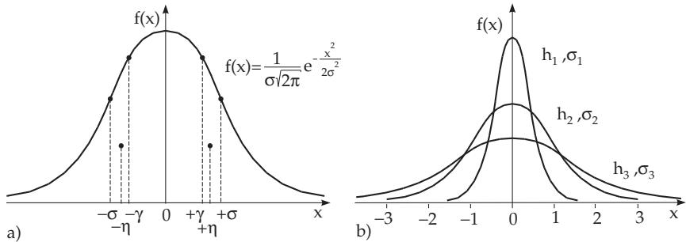

#### 16.4.1 Measurement Error and its Distribution

##### 16.4.1.1 Qualitative Characterization of Measurement Errors

Qualifying the measurement errors by their causes, the following three types of errors are distinguished:

1. Rough errors are caused by inaccurate readings or confusion; they are excludable.

2. Systematic measurement errors are caused by inaccurately scaled measuring devices and by the method of measuring, where the method of reading the data and also the measured error of the measurement system can play a role. They are not always avoidable.

3. Statistical or random measurement errors can arise from random changes of the measuring conditions that are dificult or impossible to control and also by certain random properties of the events observed.

In the theory of measurement errors usually it is assumed that the rough errors and the systematic measurement errors are excludable, so that only the statistical properties and the random measurement errors are included into the calculation of the errors.

##### 16.4.1.2 Density Function of the Measurement Error

1. Measurement Protocol

To calculate the characterization of the uncertainties it must be supposed that the measured results are listed in a measurement record as a prime notation and that the relative frequencies or the density function f(x) or the cumulative frequencies or the distribution function F(x) (see 16.3.2.1, p. 832) of the uncertain values are available. The realization of the random variable X under consideration is denoted by x.

2. Error Density Function

Special assumptions about the properties of the measurement error result in certain special properties of the density function of the error distribution:

1. Continuous Density Function Since the random measurement errors can take any value in a certain interval, they are described by a continuous density function f(x).

2. Even Density Function If measurement errors with the same absolute value but with diferent signs are equally likely, then the density function is an even function: $f ( - x ) = f ( x )$

3. Monotonically Decreasing Density Function If a measuring error with larger absolute value is less likely than an error with smaller absolute value, then the density function f(x) is monotonically decreasing for $x > 0$

4. Finite Expected Value The expected value of the absolute value of the error must be finite:

$$
E ( | X | ) = \intop _ { - \infty } ^ { \infty } | x | f ( x ) d x < \infty .\tag{16.189}
$$

Diferent properties of the errors result in diferent types of density functions.

3. Normal Distribution of the Error

1. Density Function and Distribution Function In most practical cases it can be supposed that the distribution of the measurement error is a normal distribution with expected value $\mu = 0$ and variance $\sigma ^ { 2 }$ , i.e., the density function $f ( x )$ and the distribution function $\bar { F } ( x )$ of the measurement error are:

$$
f ( x ) = { \frac { 1 } { \sigma { \sqrt { 2 \pi } } } } e ^ { - { \frac { x ^ { 2 } } { 2 \sigma ^ { 2 } } } } \qquad ( 1 6 . 1 9 0 \mathrm { a } ) \qquad \mathrm { a n d } \ F ( x ) = { \frac { 1 } { \sigma { \sqrt { 2 \pi } } } } \int _ { - \infty } ^ { x } e ^ { - { \frac { t ^ { 2 } } { 2 \sigma ^ { 2 } } } } d t = \Phi \left( { \frac { x } { \sigma } } \right) .\tag{16.190b}
$$

Here $\varPhi ( x )$ is the distribution function of the standard normal distribution (see (16.73a), p. 819, and Table 21.17, p. 1133). In the case of (16.190a,b) one speaks about normal errors.

2. Geometrical Representation The density function (16.190a) is represented in Fig. 16.18a with inflection points and points at the center of gravity, and its behavior is shown in Fig. 16.18b when the variance changes. The inflection points are at the abscissa values σ; the centers of gravity of the halfareas are at $\pm \eta$ . The maximum of the function is at $x = 0$ and it is $1 / ( \sigma \sqrt { 2 \pi } )$ . The curve widens as $\sigma ^ { 2 }$ increases, the area under the curve always equals one. This distribution shows that small errors occur often, large errors only seldom.

  
Figure 16.18

4. Parameters to Characterize the Normally Distributed Error

Beside the variance $\sigma ^ { 2 }$ or the standard deviation σ which is also called the mean square erroror standard error, there are other parameters to characterize the normally distributed error, such as the measure of accuracy h, the average error or mean error η, and the probable error γ.

1. Measure of Accuracy Beside the variance $\sigma ^ { 2 }$ , the measure of accuracy

$$
h = { \frac { 1 } { \sigma { \sqrt { 2 } } } }\tag{16.191}
$$

is used to characterize the width of the normal distribution. A narrower Gauss curve results in better accuracy (Fig. 16.18b). Replacing σ by the experimental value $\tilde { \sigma }$ or $\tilde { \sigma } _ { x }$ obtained from the measured values, the measure of accuracy characterizes the accuracy of the measurement method.

2. Average or Mean Error The expected value $\eta$ of the absolute value of the error is defined as

$$
\eta = E ( | { \cal X } | ) = 2 \intop _ { 0 } ^ { \infty } x f ( x ) d x = \sqrt { \frac { 2 } { \pi } } \sigma .\tag{16.192}
$$

3. Probable Error The bound $\gamma$ of the absolute value of the error with the property

$$
P ( | X | \leq \gamma ) = \frac { 1 } { 2 }\tag{16.193a}
$$

is called the probable error. It implies that

$$
\int _ { - \gamma } ^ { + \gamma } f ( x ) d x = 2 \varPhi \left( \frac { \gamma } { \sigma } \right) - 1 = \sqrt { \frac { 2 } { \pi } } \intop _ { 0 } ^ { \gamma / \sigma } e ^ { - t ^ { 2 } / 2 } d t = \frac { 1 } { 2 } ,\tag{16.193b}
$$

where $\varPhi ( x )$ is the distribution function of the standard normal distribution. The condition (16.193b) is a non-linear equation which can be solved approximately by the help of a computer algebra system to get $\gamma / \sigma$ . The result is

$$
\frac { \gamma } { \sigma } \approx 0 . 6 7 4 5 .\tag{16.193c}
$$

4. Given Error Bounds If an upper bound $a > 0$ of an error is given, then with (16.193b) can be calculated the probability that the error is in the interval $[ - a , a ]$

$$
P ( | X | \leq a ) = 2 \varPhi \left( \frac { a } { \sigma } \right) - 1 .\tag{16.194}
$$

5. Relations between Standard Deviation, Average Error, Probable Error,

and Accuracy If the error has a normal distribution, then the following relations hold using (16.193c):

$$
\eta = \sqrt { \frac { 2 } { \pi } } \sigma ,
$$

(16.195a)

(16.195b)

$$
h = { \frac { 1 } { 2 { \sqrt { \sigma } } } } .\tag{16.195c}
$$

##### 16.4.1.3 Quantitative Characterization of the Measurement Error

1. True Value and its Approximations

The true value $x _ { w }$ of a measurable quantity is usually unknown. Therefore the expected value of the random variables, whose realizations are the measured values $x _ { i } \ ( i = 1 , 2 , \ldots , n )$ , is chosen as an estimated value of $x _ { w }$ . Consequently, the following means can be considered as an approximation of $x _ { w } .$

1. Arithmetical Mean

$$
{ \overline { { x } } } = { \frac { 1 } { n } } \sum _ { i = 1 } ^ { n } x _ { i }
$$

$$
\overline { { x } } = \sum _ { j = 1 } ^ { k } h _ { j } \overline { { x } } _ { j } ,\tag{16.196b}
$$

if the measured values are distributed into k classes with absolute frequencies $h _ { j }$ and class means $\overline { { x } } _ { j } \ ( j = 1 , 2 , \ldots , k )$

2. Weighted Mean

$$
{ \overline { { x } } } ^ { ( g ) } = \sum _ { i = 1 } ^ { n } g _ { i } x _ { i } { \Bigg / } \sum _ { i = 1 } ^ { n } g _ { i } .\tag{16.197}
$$

Here the single measured values are weighted by the weighting factors g $( g _ { i } > 0 )$ (see 16.4.1.6, 1., p. 854).

2. Error of a Single Measurement in a Measurement Sequence

1. The True Error of a Single Measurement in a Measurement Sequence is the diference between the true value $x _ { w }$ and the measuring result. Because this is usually unknown, the true error

$\varepsilon _ { i }$ of the i-th measurement with the result $x _ { i }$ is also unknown:

$$
\varepsilon _ { i } = x _ { w } - x _ { i } .\tag{16.198}
$$

2. The Mean Error or Apparent Error of a Single Measurement in a Measurement Sequence is the diference of the arithmetical mean and the measurement result $x _ { i } { \mathrm { : } }$

$$
v _ { i } = { \overline { { x } } } - x _ { i } .\tag{16.199}
$$

3. Mean Square Error of a Single Measurement or Standard Error of a Single

Measurement Since the expected value of the sum of the true errors $\varepsilon _ { i }$ and the expected value of the sum of the apparent errors $v _ { i }$ of n measurements are zero (independently of how large they are), they are characterized by the sum of the error squares:

$$
\varepsilon ^ { 2 } = \sum _ { i = 1 } ^ { n } { \varepsilon _ { i } } ^ { 2 } ,
$$

(16.200a)

$$
v ^ { 2 } = \sum _ { i = 1 } ^ { n } { v _ { i } } ^ { 2 } .\tag{16.200b}
$$

From a practical point of view only the value of (16.200b) is interesting, since only the values of $v _ { i }$ can be determined from the measuring process. Therefore, the mean square error of a single measurement of a measurement sequence is defined by

$$
\tilde { \sigma } = \sqrt { \sum _ { i = 1 } ^ { n } { v _ { i } } ^ { 2 } \Big / ( n - 1 ) } .\tag{16.200c}
$$

The value $\tilde { \sigma }$ is an approximation of the standard deviation σ of the error distribution.

One gets for $\tilde { \sigma } = \sigma$ in the case of normally distributed error:

$$
\begin{array} { r } { P ( | \varepsilon | \leq \tilde { \sigma } ) = 2 \varPhi ( 1 ) - 1 = 0 . 6 8 2 6 . } \end{array}\tag{16.200d}
$$

That is: The probability that the absolute value of the true value does not exceed $\sigma _ { \mathrm { { i } } }$ is about 68%.

4. The Probable Error of a single measurement is the number $\gamma _ { ; }$ , for which

$$
P ( | \varepsilon | \leq \gamma ) = \frac { 1 } { 2 } .\tag{16.201a}
$$

That is: The probability that the absolute value of the error does not exceed $\gamma ,$ is 50%. The abscissae $\pm \gamma$ divide the area of the left and the right parts under the density function into two equal parts (Fig. 16.18a).

In the case of a normally distributed error in accordance to (16.193c) holds

$$
\gamma \approx 0 . 6 7 4 5 \sigma \approx 0 . 6 7 4 5 \tilde { \sigma } = \tilde { \gamma } .\tag{16.201b}
$$

5. Average Error of a single measurement is the number $\eta ,$ which is the expected value of the absolute value of the error:

$$
\eta = E ( | \varepsilon | ) = \int _ { - \infty } ^ { \infty } | x | f ( x ) d x .\tag{16.202a}
$$

In the case of a normally distributed error follows $\eta = \sqrt { \frac { 2 } { \pi } } \sigma$ and

$$
P ( | \varepsilon | \leq \eta ) = 2 \varPhi \left( \frac { \eta } { \sigma } \right) - 1 = 2 \varPhi \left( \sqrt { \frac { 2 } { \pi } } \right) - 1 \approx 0 . 5 7 5 1 :\tag{16.202b}
$$

The probability that the error does not exceed the value η is about 57.6 %. The centers of gravity of the left and right areas under the density function (Fig. 16.18a) are at abscissae $\pm \eta$ . In the case of normally distributed errors:

$$
\eta = \sqrt { \frac { 2 } { \pi } } \sigma \approx \sqrt { \frac { 2 } { \pi } } \tilde { \sigma } = \tilde { \eta } .\tag{16.202c}
$$

3. Error of the Arithmetical Mean of a Measurement Sequence

The error of the arithmetical mean $\overline { { x } }$ of a measurement sequence is given by the errors of the single measurement:

1. Mean Square Error or Standard Deviation

$$
\tilde { \sigma } _ { A M } = \sqrt { \sum _ { i = 1 } ^ { n } { v _ { i } } ^ { 2 } \Big / { [ n ( n - 1 ) ] } } = { \frac { \tilde { \sigma } } { \sqrt { n } } } .\tag{16.203}
$$

2. Probable Error

$$
\tilde { \gamma } _ { A M } \approx 0 . 6 7 4 5 \sqrt { \sum _ { i = 1 } ^ { n } { v _ { i } } ^ { 2 } \Big / [ n ( n - 1 ) ] } = 0 . 6 7 4 5 \frac { \tilde { \sigma } } { \sqrt { n } } .\tag{16.204}
$$

3. Average Error

$$
\tilde { \eta } _ { A M } \approx 0 . 7 9 7 9 \sqrt { \sum _ { i = 1 } ^ { n } { v _ { i } } ^ { 2 } \Big / [ n ( n - 1 ) ] } = 0 . 7 9 7 9 \frac { \tilde { \sigma } } { \sqrt { n } } .\tag{16.205}
$$

4. Accessible Level of Error Since the three types of errors defined above (16.203)–(16.205) are directly proportional to the corresponding error of the single measurement (16.200c), (16.201b) and (16.202c) and they are proportional to the reciprocal of the square root of n, it is not reasonable to increase the number of the measurements after a certain value. It is more eficient to improve the accuracy h of the measuring method (16.191).

4. Absolute and Relative Errors

1. Absolute Uncertainty, Absolute Error The uncertainty of the results of measurement is characterized by errors $\varepsilon _ { i } , v _ { i } , \sigma _ { i } , \gamma _ { i } , \eta _ { i } , \mathrm { o r } \varepsilon , v , \sigma , \gamma , \eta$ , which measure the reliability of the measurements. The notion of the absolute uncertainty, given as the absolute error, is meaningful for all these types of errors and for the calculation of error propagation (see 16.4.2, p. 854). They have the same dimension as the measured quantity.

The word “absolute” error is introduced to avoid confusion with the notion of relative error. Often the notation $\Delta x _ { i }$ or $\Delta x$ is used. The word “absolute” has a diferent meaning from the notion of absolute value: It refers to the numerical value of the measured quantity (e.g., length, weight, energy), without restriction of its sign.

2. Relative Uncertainty, Relative Error The relative uncertainty, given by the relative error, is a measure of the quality of the method of measurement with respect to the numerical value of the measured quantity. In contrast to the absolute error, the relative error has no dimension, because it is the quotient of the absolute error and the numerical value of the measured quantity. If this value is not known, one replaces it by the mean value of the quantity x:

$$
\delta x _ { i } = \frac { \Delta x _ { i } } { x } \approx \frac { \Delta x _ { i } } { \overline { { x } } } .\tag{16.206a}
$$

The relative error is given mostly as a percentage and it is also called the percentage error:

$$
\delta x _ { i } / \% = \delta x _ { i } \cdot 1 0 0 \% .\tag{16.206b}
$$

5. Absolute and Relative Maximum Error

1. Absolute Maximum Error If the quantity z is to be determined and is $z \textrm { a }$ function of the measured quantities $x _ { 1 } , x _ { 2 } , \ldots , x _ { n } , { \mathrm { i . e . , ~ } } z = f ( x _ { 1 } , x _ { 2 } , \ldots , x _ { n } )$ , then the resulting error must be calculated taking also the function $f$ into consideration. There are two diferent ways to examine errors. The first approach is that statistical error analysis is applied by smoothing the data values using the least squares method (min $\Sigma ( z _ { i } - z ) ^ { 2 } )$ . In the second approach, an upper bound $\Delta z _ { \mathrm { m a x } }$ is determined for the absolute error of the quantities. With n independent variables $x _ { i } ,$ holds:

$$
\Delta z _ { \mathrm { m a x } } = \sum _ { i = 1 } ^ { n } \left| \frac { \partial } { \partial x _ { i } } f ( x _ { 1 } , x _ { 2 } , \ldots , x _ { n } ) \right| \Delta x _ { i } ,\tag{16.207}
$$

where the mean value $\overline { { x } } _ { i }$ should be substituted for $x _ { i }$

2. Relative Maximum Error The relative maximum error is the absolute maximum error divided by the numerical value of the measured value (mostly by the mean of z):

$$
\delta z _ { \mathrm { m a x } } = \frac { \Delta z _ { \mathrm { m a x } } } { z } \approx \frac { \Delta z _ { \mathrm { m a x } } } { \overline { { z } } } .\tag{16.208}
$$

##### 16.4.1.4 Determining the Result of a Measurement with Bounds on the Error

A realistic interpretation of a measurement result is possible only if the expected error is also given; error estimations and bounds are components of measurement results. It must be clear from the data what is the type of the error, what is the confidence interval and what is the significance level.

1. Defining the Error The result of a single measurement is required to be given in the form

$$
x = x _ { i } \pm \Delta x \approx x _ { i } \pm \tilde { \sigma } ,\tag{16.209a}
$$

and the result of the mean has the form

$$
x = \overline { { x } } \pm \Delta x _ { A M } \approx \overline { { x } } \pm \tilde { \sigma } _ { A M } .\tag{16.209b}
$$

Here for $\Delta x$ the most often used standard deviation $\tilde { \sigma }$ is applied. $\tilde { \gamma }$ and $\tilde { \eta }$ could also be used.

2. Prescription of Arbitrary Confidence Limits The quantity $T = \frac { X - x _ { w } } { \tilde { \sigma } _ { A M } }$ has a t distribution

(16.97b) with $f = n - 1$ degrees of freedom in the case of a population with a distribution $N ( \mu , \sigma ^ { 2 } )$ according to (16.96). For a required significance level α or for an acceptance probability $S = 1 - \alpha$ the confidence limits for the unknown quantity $x _ { w } = \mu$ with the t quantile $t _ { \alpha / 2 ; f }$ are

$$
\mu = \overline { { { x } } } \pm t _ { \alpha / 2 ; f } \cdot \tilde { \sigma } _ { A M } .\tag{16.210}
$$

That is, the true value $x _ { w }$ is in the interval given by these limits with a probability $S = 1 - \alpha$

Mostly it is of interest keeping the size n of the measurement sequence at its lowest possible level. The length $2 t _ { \alpha / 2 ; f } \tilde { \sigma } _ { A M }$ of the confidence interval decreases for a smaller value of $1 - \alpha$ and also for a larger number n of measurements. Since $\tilde { \sigma } _ { A M }$ decreases proportionally to $1 / { \sqrt { n } }$ and the quantile $t _ { \alpha / 2 ; f }$ with $f = n - 1$ degrees of freedom also decreases proportionally to $1 / \sqrt { n }$ (for values of n between 5 and 10, see Table 21.20, p. 1138) the length of the confidence interval decreases proportionally to $1 / n$ for such values of n.

##### 16.4.1.5 Error Estimation for Direct Measurements with the Same Accuracy

If there is the same variance $\sigma _ { i }$ for all n measurements, one talks about measurements with the same accuracy $h \ = \ \mathrm { c o n s t }$ . In this case, the least squares method results in the error quantities given in (16.200c), (16.201b), and (16.202b).

Determine the final result for the measurement sequence given in the following table which contains $n = 1 0$ direct measurements with the same accuracy.
<table><tr><td rowspan=1 colspan=1> $x _ { i }$ </td><td rowspan=1 colspan=1>1.592</td><td rowspan=1 colspan=1>1.581</td><td rowspan=1 colspan=1>1.574</td><td rowspan=1 colspan=1>1.566</td><td rowspan=1 colspan=1>1.603</td><td rowspan=1 colspan=1>1.580</td><td rowspan=1 colspan=1>1.591</td><td rowspan=1 colspan=1>1.583</td><td rowspan=1 colspan=1>1.571</td><td rowspan=1 colspan=1>1.559</td></tr><tr><td rowspan=1 colspan=1> $v _ { i } \cdot 1 0 ^ { 3 }$ </td><td rowspan=1 colspan=1>-12</td><td rowspan=1 colspan=1>-1</td><td rowspan=1 colspan=1>+ 6</td><td rowspan=1 colspan=1>+ 14</td><td rowspan=1 colspan=1>-23</td><td rowspan=1 colspan=1>0</td><td rowspan=1 colspan=1>-11</td><td rowspan=1 colspan=1>-3</td><td rowspan=1 colspan=1>+ 9</td><td rowspan=1 colspan=1> $+ 2 1$ </td></tr><tr><td rowspan=1 colspan=1> ${ v _ { i } } ^ { 2 } \cdot 1 0 ^ { 6 }$ </td><td rowspan=1 colspan=1>144</td><td rowspan=1 colspan=1>1</td><td rowspan=1 colspan=1>36</td><td rowspan=1 colspan=1>196</td><td rowspan=1 colspan=1>529</td><td rowspan=1 colspan=1>0</td><td rowspan=1 colspan=1>121</td><td rowspan=1 colspan=1>9</td><td rowspan=1 colspan=1>81</td><td rowspan=1 colspan=1>441</td></tr></table>

$$
\overline { { x } } = 1 . 5 8 0 , \tilde { \sigma } = \sqrt { \sum _ { i = 1 } ^ { n } { v _ { i } } ^ { 2 } / ( n - 1 ) } = 0 . 0 1 3 1 , \tilde { \sigma } _ { A M } = \tilde { \sigma } / \sqrt { n } = 0 . 0 0 4 .
$$

Final result: $x = \overline { { x } } \pm \tilde { \sigma } _ { A M } = 1 . 5 8 0 \pm 0 . 0 0 4 .$

##### 16.4.1.6 Error Estimation for Direct Measurements with Different Accuracy

1. Weighted Measurements

If the direct measurement results $x _ { i }$ are obtained from diferent measuring methods or they represent means of single measurements, which belong to the same mean x with diferent variances $\mathbf { \widetilde { \sigma } } _ { i } ^ { 2 }$ , then a weighted mean

$$
{ \overline { { x } } } ^ { ( g ) } = \sum _ { i = 1 } ^ { n } g _ { i } x _ { i } { \Bigg / } \sum _ { i = 1 } ^ { n } g _ { i }\tag{16.211}
$$

is calculated, where $g _ { i }$ is defined as

$$
g _ { i } = \frac { \tilde { \sigma } ^ { 2 } } { \tilde { \sigma _ { i } } ^ { 2 } } .\tag{16.212}
$$

Here $\tilde { \sigma }$ is an arbitrary positive value, mostly the smallest ${ \tilde { \sigma _ { i } } }$ . It serves as a weight unit of the deviations, i.e., for $\tilde { \sigma _ { i } } = \tilde { \sigma }$ it is $g _ { i } = 1$ . It follows from (16.210) that a larger weight of a measurement results in a smaller deviation ${ \tilde { \sigma _ { i } } }$

2. Standard Deviations

The standard deviation of the weight unit is estimated as

$$
\tilde { \sigma } ^ { ( g ) } = \sqrt { \sum _ { i = 1 } ^ { n } { g _ { i } { v _ { i } } ^ { 2 } } \Big / ( n - 1 ) } .\tag{16.213}
$$

It must be sure that $\tilde { \sigma } ^ { ( g ) } < \tilde { \sigma }$ . In the opposite case, if $\tilde { \sigma } ^ { ( g ) } > \tilde { \sigma }$ , then there are $x _ { i }$ values which have systematic deviations.

The standard deviation of the single measurement is

$$
\tilde { \sigma _ { i } } ^ { ( g ) } = \frac { \tilde { \sigma } ^ { ( g ) } } { \sqrt { g _ { i } } } = \frac { \tilde { \sigma } ^ { ( g ) } } { \tilde { \sigma } } \tilde { \sigma _ { i } } ,\tag{16.214}
$$

where $\tilde { \sigma } _ { i } ^ { \ : ( g ) } < \tilde { \sigma } _ { i } ^ { \ : }$ can be expected.

The standard deviation of the weighted mean is:

$$
{ \tilde { \sigma } } _ { A M } ^ { ( g ) } = { \tilde { \sigma } } ^ { ( g ) } \Bigg / \sqrt { \sum _ { i = 1 } ^ { n } g _ { i } } = \sqrt { \sum _ { i = 1 } ^ { n } g _ { i } { v _ { i } } ^ { 2 } \bigg / \left( \left( n - 1 \right) \sum _ { i = 1 } ^ { n } g _ { i } \right) } .\tag{16.215}
$$

3. Error Description

The error can be described as it is represented in 16.4.1.4, p. 853, either by the definition of the error or by the t quantile with f degrees of freedom.

The final results of measurement sequences $( n = 5 )$ with diferent means $\overline { { x } } _ { i } \ ( i = 1 , 2 , \ldots , 5 )$ and with diferent standard deviations $\tilde { \sigma } _ { A M _ { i } }$ are given in Table 16.6. Calculating $( \overline { { x } } _ { i } ) _ { m } = 1 . 5 8 3 0$ and choosing $x _ { 0 } = 1 . 5 8 5$ and $\tilde { \sigma } = 0 . 0 0 9$ with $z _ { i } = \overline { { x } } _ { i } - x _ { 0 } , g _ { i } = \tilde { \sigma } ^ { 2 } / \tilde { \sigma } _ { i } ^ { 2 }$ one

gets $\overline { z } = - 0 . 0 0 3 6$ and $\overline { { x } } = x _ { 0 } + \overline { { z } } = 1 . 5 8 2$ . The standard deviation is ${ \tilde { \sigma } } ^ { ( g ) } = \sqrt { \sum _ { i = 1 } ^ { n } { g _ { i } { v _ { i } } ^ { 2 } } } { \Big / } ( n - 1 ) =$

$0 . 0 0 8 8 < \tilde { \sigma }$ and $\tilde { \sigma _ { x } } = \tilde { \sigma } _ { A M } = 0 . 0 0 2 7$ . The final result is $x = \overline { { x } } \pm \tilde { \sigma _ { x } } = 1 . 5 8 5 \pm 0 . 0 0 2 7$
