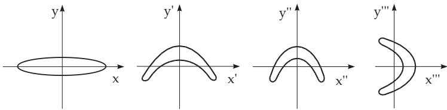

#### 17.1.1 Dynamical Systems

##### 17.1.1.1 Basic Notions

1. The Notion of Dynamical Systems and Orbits

A dynamical system is a mathematical object to describe the development of a physical, biological or another system from real life depending on time. It is defined by a phase space $\check { M }$ , and by a oneparameter family of mappings $\varphi ^ { t } \colon M \to M$ , where t is the parameter (the time). In the following discussion the phase space is often $\mathbb { R } ^ { n }$ , a subset of it, or a metric space. The time parameter t is from IR (time continuous system) or from Z or from $\mathbb { Z } _ { + }$ (time discrete system). Furthermore, it is required for arbitrary $x \in M$ that

a) $\varphi ^ { 0 } ( x ) = x$ and

b) $\varphi ^ { t } ( \varphi ^ { s } ( x ) ) = \varphi ^ { t + s } ( x )$ for all t, s. The mapping $\varphi ^ { 1 }$ is denoted briefly by $\varphi$

Hereafter, the time set is denoted by Γ, hence, ${ \cal T } = { \bf R } , { \cal T } = { \bf R } _ { + } , { \cal T } = \mathbb { Z } \mathrm { o r } { \cal T } = \mathbb { Z } _ { + } . \mathrm { ~ H ~ } { \cal T } = { \bf R }$ , then the dynamical system is also called a flow; if $T = \mathbb { Z }$ or $T = \mathbb { Z } _ { + }$ , then the dynamical system is discrete. In case $\varGamma =  { \mathbb { R } }$ and $T = \mathbb { Z }$ , the properties a) and b) are satisfied for every $t \in T$ , so the inverse mapping $( \varphi ^ { t } ) ^ { - 1 } = \varphi ^ { - t }$ also exists, and these systems are called invertible dynamical systems.

If the dynamical system is not invertible, then $\varphi ^ { - t } ( A )$ means the pre-image of A with respect to $\varphi ^ { t }$ for an arbitrary set $A \subset M$ and arbitrary $t > 0 , \operatorname { i . e . , } \varphi ^ { - t } ( A ) = \{ x ^ { * } \in M : \check { \varphi ^ { t } } ( x ) \in A \}$ . If the mapping $\varphi ^ { t } \colon M \to M$ is continuous or k times continuously diferentiable for every $t \in T$ (here $M \subset \mathbb { R } ^ { n } )$ , then the dynamical system is called continuous or $C ^ { k } \mathrm { - } s m o o t h ,$ respectively.

For an arbitrary fixed $x \in M$ , the mapping $t \longmapsto \varphi ^ { t } ( x ) , \ t \in T$ , defines a motion of the dynamical system starting from x at time $t = 0$ . The image $\gamma ( \boldsymbol { x } )$ of a motion starting at x is called the orbit (or the trajectory) through x, namely $\gamma ( x ) = \{ \varphi ^ { t } ( x ) \} _ { t \in T }$ . Analogously, the positive semiorbit through x is defined by $\gamma ^ { + } ( x ) = \{ \varphi ^ { t } ( x ) \} _ { t > 0 }$ and, if ${ \cal T } \ne \mathbb { R } _ { + }$ or $T \neq \mathbb { Z } _ { + }$ , then the negative semiorbit through x is defined by $\gamma ^ { - } ( x ) = \{ \varphi ^ { t } ( x ) \} _ { t \leq 0 }$

The orbit $\gamma ( x )$ is a steady state (also equilibrium point or stationary point) if $\gamma ( x ) = \{ x \}$ , and it is $T _ { - p e r i o d i c }$ if there exists a $T \in { \dot { \Gamma } } , T > 0$ , such that $\varphi ^ { t + T } ( x ) = \varphi ^ { t } ( \bar { x } )$ for all $t \in T$ , and ${ \bf \dot { \boldsymbol { T } } } \in \boldsymbol { \boldsymbol { \cal T } }$ is the smallest positive number with this property. The number T is called the period.

2. Flow of a Diferential Equation

Consider the ordinary linear planar diferential equation

$$
{ \dot { x } } = f ( x ) ,\tag{17.1}
$$

where $f \colon M \to \mathbb { R } ^ { n }$ (vector $\it \ f i e l d )$ is an r-times continuously diferentiable mapping and $M = \mathbb { R } ^ { n }$ or M is an open subset of $\mathbb { R } ^ { n }$ . From now on, the Euclidean norm $\| \cdot \|$ is used in $\mathbf { \bar { \mathbb { R } } } ^ { n }$ , i.e., for arbitrary $x \in \mathbb { R } ^ { n } , x = ( x _ { 1 } , \ldots , x _ { n } )$ , its norm is $\| x \| = \sqrt { \sum _ { i = 1 } ^ { n } x _ { i } ^ { 2 } }$ . If the mapping f is written componentwise $f = ( f _ { 1 } , \ldots , f _ { n } ) $ , then (17.1) is a system of n scalar diferential equations ${ \dot { x } } _ { i } = f _ { i } ( x _ { 1 } , \dots , x _ { n } ) , ~ i =$ $1 , 2 , \ldots , n .$

The Picard–Lindel¨of theorem on the local existence and uniqueness of solutions of diferential equations and the theorem on the r-times diferentiability ofsolutions with respect to the initial values (see [17.11]) guarantee that for every $x _ { 0 } \in M$ , there exist a number $\varepsilon > 0$ , a sphere $B _ { \delta } ( x _ { 0 } ) = \{ x \colon \| x - x _ { 0 } \| < \delta \}$ in M and a mapping ϕ: $( - \varepsilon , \varepsilon ) \times B _ { \delta } ( x _ { 0 } ) $ M such that:

1. $\varphi ( \cdot , \cdot )$ is (r + 1)-times continuously diferentiable with respect to its first argument (time) and $r -$ times continuously diferentiable with respect to its second argument (phase variable);

\- Springer-Verlag Berlin Heidelberg 2015 I.N. Bronshtein et al., Handbook of Mathematics, DOI 10.1007/978-3-662-46221-8\_17

2. For every fixed $x \in B _ { \delta } ( x _ { 0 } ) , \varphi \left( \cdot , x \right)$ is the locally unique solution of (17.1) in the time interval $( - \varepsilon , \varepsilon )$ which starts from x at time $t = 0 , { \mathrm { i . e . , ~ } } { \frac { \partial \varphi } { \partial t } } ( t , x ) = { \dot { \varphi } } ( t , x ) = f ( \varphi ( t , x ) )$ holds for every $t \in ( - \varepsilon , \varepsilon )$ $\varphi ( 0 , x ) = x$ , and every other solution with initial point x at time $t = 0$ coincides with $\varphi ( t , x )$ for all small t .

Suppose that every local solution of (17.1) can be extended uniquely to the whole of IR. Then there exists a mapping $\varphi \colon \mathbb { R } \times M \to M$ with the following properties:

$ 1 . ~ \varphi ( 0 , x ) = x$ for all $x \in M$

2. $\varphi ( t + s , x ) = \varphi ( t , \varphi ( s , x ) )$ for all $t , s \in \mathbb { R }$ and all $x \in M$

3. $\varphi ( \cdot , \cdot )$ is continuously diferentiable (r + 1) times with respect to its first argument and r times with respect to the second one.

4. For every fixed $x \in M , \varphi ( \cdot , x )$ is a solution of (17.1) on the whole of $\mathbb { R } .$

Then the $C ^ { r }$ -smooth flow generated by (17.1) can be defined by $\varphi ^ { t } : = \varphi ( t , \cdot )$ . The motions $\varphi ( \cdot , x )$ $\mathbb { R } \to M$ of a flow of (17.1) are called integral curves.

The equation

$$
\dot { x } = \sigma ( y - x ) , \quad \dot { y } = r x - y - x z , \quad \dot { z } = x y - b z\tag{17.2}
$$

is called a Lorenz system of convective turbulence (see also 17.2.4.3, p. 887). Here $\sigma > 0 , r > 0$ and $b > 0$ are parameters. $\mathrm { ~ A ~ } C ^ { \infty }$ flow on $M = \mathbb { R } ^ { 3 }$ corresponds to the Lorenz system .

3. Discrete Dynamical System

Consider the diference equation

$$
x _ { t + 1 } = \varphi ( x _ { t } ) ,\tag{17.3}
$$

which can also be written as an assignment $x \longmapsto \varphi ( x )$ . Here $\varphi \colon M \to M$ is a continuous or r times continuously diferentiable mapping, where in the second case $M \subset \mathbb { R } ^ { n }$ . If $\varphi$ is invertible, then (17.3) defines an invertible discrete dynamical system through the iteration of $\varphi _ { i }$ , namely,

$$
\varphi ^ { t } = \underbrace { \varphi \circ \cdots \circ \varphi } _ { t \ t i \mathrm { m e s } , } , \mathrm { f o r } t > 0 , \varphi ^ { t } = \underbrace { \varphi ^ { - 1 } \circ \cdots \circ \varphi ^ { - 1 } } _ { - t \ t i \mathrm { m e s } , } , \mathrm { f o r } t < 0 , \varphi ^ { 0 } = i d .\tag{17.4}
$$

If $\varphi$ is not invertible, then the mappings $\varphi ^ { t }$ are defined only for $t \geq 0$ . For the realization of $\varphi ^ { t }$ see (5.74), p. 333.

A: The diference equation

$$
x _ { t + 1 } = \alpha x _ { t } \left( 1 - x _ { t } \right) , \quad t = 0 , 1 , \ldots .\tag{17.5}
$$

with parameter $\alpha \in ( 0 , 4 ]$ is called a logistic equation. Here $M = [ 0 , 1 ]$ , and $\varphi : [ 0 , 1 ]  [ 0 , 1 ]$ is the function $\varphi ( x ) = \alpha x ( 1 - x )$ for a fixed α. Obviously, $\varphi$ is infinitely many times diferentiable, but not invertible. Hence (17.5) defines a non-invertible dynamical system.

B: The diference equation

$$
x _ { t + 1 } = y _ { t } + 1 - a x _ { t } ^ { 2 } , \quad y _ { t + 1 } = b x _ { t } , \quad t = 0 , \pm 1 , \ldots ,\tag{17.6}
$$

with parameters $a > 0$ and $b \neq 0$ is called a H´enon mapping. The mapping $\varphi : \mathbb { R } ^ { 2 }  \mathbb { R } ^ { 2 }$ corresponding to (17.6) is defined by $\varphi ( x , y ) \overset { \cdot } { = } ( y + 1 - a x ^ { 2 }$ , bx), it is infinitely many times diferentiable and invertible.

4. Volume Contracting and Volume Preserving Systems

The invertible dynamical system $\{ \varphi ^ { t } \} _ { t \in { \cal { T } } } \mathrm { o n } M \subset \mathbb { R } ^ { n }$ is called volume depressing or dissipative (volume preserving or conservative), if the relation vol $( \varphi ^ { t } ( A ) ) < \mathrm { v o l } ( A ) ( \mathrm { v o l } ( \varphi ^ { t } ( A ) ) = \mathrm { v o l } ( A ) )$ holds for every set $A \subset { \dot { M } }$ with a positive n-dimensional volume vol(A) and every $t > 0 ( t \in T )$

A: Let $\varphi$ in (17.3) be a Cr-difeomorphism $( { \mathrm { i . e . : ~ } } \varphi \colon M \to M$ is invertible, $M \subset \mathbb { R } ^ { n }$ open, $\varphi$ and $\varphi ^ { - 1 }$ are $C ^ { r } .$ -smooth mappings) and let $D \varphi ( x )$ be the Jacobi matrix of $\varphi$ in $x \in M$ . The discrete system $( 1 7 . 3 )$ is dissipative if det $\bar { D } \dot { \varphi } ( x ) | < 1$ for all $x \in M$ , and conservative if det $D \varphi ( x ) \mid \equiv 1$ in M.

B: For the system (17.6) $D \varphi ( x , y ) = \left( \begin{array} { c c } { { - 2 a x } } & { { 1 } } \\ { { b } } & { { 0 } } \end{array} \right) $ and so det $D \varphi ( x , y ) | \equiv b$ . Hence, (17.6) is dissipative if $| b | < 1$ , and conservative if $| b | = 1$

The H´enon mapping can be decomposed into three mappings (Fig. 17.1): First, the initial domain is stretched and bent by the mapping $x ^ { \prime } = x , y ^ { \prime } = y + 1 - a \dot { x } ^ { 2 }$ in a area-preserving way, then it is contracted in the direction of the x-axis by $x ^ { \prime \prime } = b x ^ { \prime } , \bar { y } ^ { \prime \prime } = y ^ { \prime } \left( \mathrm { a t } \ | b | < 1 \right)$ , and finally it is reflected with respect to the line $y ^ { \prime \prime } = x ^ { \prime \prime } \mathrm { b y } x ^ { \prime \prime \prime } = y ^ { \prime \prime } , y ^ { \prime \prime \prime } = x ^ { \prime \prime }$

  
Figure 17.1

##### 17.1.1.2 Invariant Sets

1. α - and ω -Limit Sets, Absorbing Sets

Let $\{ \varphi ^ { t } \} _ { t \in T }$ be a dynamical system on M. The set $A \subset M$ is invariant under $\{ \varphi ^ { t } \}$ , if $\varphi ^ { t } ( A ) = A$ holds for all $t \in T$ , and positively invariant under $\{ \varphi ^ { t } \} , \mathrm { i f } \varphi ^ { t } ( A ) \subset A$ holds for all $t > 0$ from Γ.

For every $x \in M$ , the ω-limit set of the orbit passing through x is the set

$$
\omega ( x ) = \{ y \in M \colon \exists t _ { n } \in I , \quad t _ { n } \to + \infty , \quad \varphi ^ { t _ { n } } ( x ) \to y \quad { \mathrm { a s ~ } } n \to + \infty \} .\tag{17.7}
$$

The elements of $\omega ( x )$ are called ω-limit points of the orbit. If the dynamical system is invertible, then for every $x \in M$ , the set

$$
\alpha ( x ) = \{ y \in M \colon \exists t _ { n } \in I , \quad t _ { n } \to - \infty , \quad \varphi ^ { t _ { n } } ( x ) \to y \quad { \mathrm { a s ~ } } n \to + \infty \}\tag{17.8}
$$

is called the α-limit set ofthe orbit passing through x; the elements of $\alpha ( x )$ are called the α-limit points of the orbit.

For many systems which are volume decreasing under the flow there exists a bounded set in phase space such that every orbit reaching it stays there as time increases. A bounded, open and connected set $U \subset M$ is called absorbing with respect to $\{ \varphi ^ { t } \} _ { t \in { \Gamma } } , \mathrm { i f } \varphi ^ { t } ( \overline { { U } } ) \subset U$ holds for all positive t from Γ. (U is the closure of U.)

Consider the system of diferential equations

$$
\dot { x } = - y + x ( 1 - x ^ { 2 } - y ^ { 2 } ) , \quad \dot { y } = x + y ( 1 - x ^ { 2 } - y ^ { 2 } )\tag{17.9a}
$$

in the plane. Using the polar coordinates $x = r$ cos ϑ, y = r sin ϑ, the solution of (17.9a) with initial state $( r _ { 0 } , \vartheta _ { 0 } )$ at time $t = 0$ has the form

$$
r ( t , r _ { 0 } ) = [ 1 + ( r _ { 0 } ^ { - 2 } - 1 ) e ^ { - 2 t } ] ^ { - 1 / 2 } , \vartheta ( t , \vartheta _ { 0 } ) = t + \vartheta _ { 0 } .\tag{17.9b}
$$

This representation of the solution shows that the flow of (17.9a) has a periodic orbit with period 2π, which can be given in the form $\gamma ( ( 1 , 0 ) ) = \{ ( \cos t , \sin t ) , t \in [ 0 , 2 \bar { \pi } ] \}$ . The limit sets of an orbit through p are:

$$
\alpha ( p ) = \left\{ \begin{array} { c } { ( 0 , 0 ) , \| p \| < 1 , } \\ { \gamma ( ( 1 , 0 ) ) , \| p \| = 1 , } \\ { \emptyset , \quad \parallel p \| > 1 } \end{array} \right. \quad \mathrm { ~ a n d ~ } \quad \omega ( p ) = \left\{ \begin{array} { c } { \gamma ( ( 1 , 0 ) ) , p \neq ( 0 , 0 ) , } \\ { ( 0 , 0 ) , p = ( 0 , 0 ) . } \end{array} \right.
$$

Every open sphere $B _ { r } = \{ ( x , y ) \colon x ^ { 2 } + y ^ { 2 } < r ^ { 2 } \}$ with $r > 1$ is an absorbing set for (17.9a).

2. Stability of Invariant Sets

Let A be an invariant set of the dynamical system $\{ \varphi ^ { t } \} _ { t \in T }$ defined on $( M , \rho )$ . The set A is called stable, if every neighborhood U of A contains another neighborhood $U _ { 1 } \subset U$ of A such that $\varphi ^ { t } ( U _ { 1 } ) \subset U$ holds

for all $t > 0$ . The set A, which is invariant under $\{ \varphi ^ { t } \}$ , is called asymptotically stable if it is stable and the following relations are satisfied:

$$
\begin{array}{c} \exists \Delta > 0 \quad \forall x \in M  \\ { \operatorname { d i s t } ( x , A ) < \Delta } \end{array} \biggr \} : \quad \operatorname { d i s t } ( \varphi ^ { t } ( x ) , A ) \longrightarrow 0 \quad \mathrm { f o r } \quad t \to + \infty .\tag{17.10}
$$

Here, dist $( x , A ) \ = \ \operatorname* { i n f } _ { y \in A } \ \rho ( x , y )$

3. Compact Sets

Let $( M , \rho )$ be a metric space. A system $\{ U _ { i } \} _ { i \in \mathbb { I } }$ of open sets is called an open covering of M if every point of M belongs to at least one $U _ { i }$ . The metric space $( M , \rho )$ is called compact if it is possible to choose finitely many $U _ { i _ { 1 } } , \ldots , U _ { i _ { r } }$ from every open covering $\{ U _ { i } \} _ { i \in \mathbf { I } }$ of M such that $M = U _ { i _ { 1 } } \cup \dots \cup U _ { i _ { r } }$ holds. The set $K \subset M$ is called compact if it is compact as a subspace.

4. Attractor, Domain of Attraction

Let $\{ \varphi ^ { t } \} _ { t \in T }$ be a dynamical system on $( M , \rho )$ and A an invariant set for $\{ \varphi ^ { t } \}$ . Then $W ( A ) \ = \ \{ x \in$ $M \colon \bar { \omega } ( x ) \subset A \}$ is called the domain of attraction of A. A compact set $\Lambda \subset M$ is called an attractor of $\{ \varphi ^ { t } \} _ { t \in T }$ on M if Λ is invariant under $\{ \varphi ^ { t } \}$ and there is an open neighborhood U of Λ such that $\omega ( x ) = \Lambda$ for almost every (in the sense of Lebesgue measure) $x \in U$

$\Lambda = \gamma ( ( 1 , 0 ) )$ is an attractor of the flow of (17.9a). Here $W ( \Lambda ) = { \mathbb R } ^ { 2 } \backslash \{ ( 0 , 0 ) \}$ . For some dynamical systems, a more general notion of an attractor makes sense. So, there are invariant sets Λ which have periodic orbits in every neighborhood of Λ which are not attracted by Λ, e.g., the Feigenbaum attractor. The set Λ may not be generated by a single limit set ω. A compact set Λ is called an attractor in the sense ofMilnor of the dynamical system $\forall \varphi ^ { t } \} _ { t \in I }$ on M if Λ is invariant under $\{ \varphi ^ { t } \}$ and the domain of attraction of Λ contains a set with positive Lebesgue measure.
