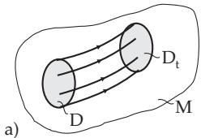
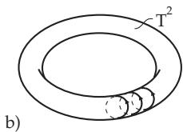

##### 17.1.2.1 Existence of Flows, Phase Space Structure

1. Extensibility of Solutions

Besides the diferential equation (17.1), which is called autonomous, there are diferential equations whose right-hand side depends explicitly on the time and they are called non-autonomous:

$$
{ \dot { x } } = f ( t , x ) .\tag{17.11}
$$

Let $f \colon \mathbb { R } \times M \to M$ be a Cr-mapping with $M \subset \mathbb { R } ^ { n }$ . By the new variable $x _ { n + 1 } : = t$ (17.11) can be interpreted as the autonomous diferential equation ${ \dot { x } } = f ( x _ { n + 1 } , x ) , { \dot { x } } _ { n + 1 } = 1$ . The solution of (17.11) starting from $x _ { 0 }$ at time $t _ { 0 }$ is denoted by $\varphi ( \cdot , t _ { 0 } , x _ { 0 } )$ . In order to show the global existence of the solutions and with this the existence of the flow of (17.1), the following theorems are useful.

1. Criterion of Wintner and Conti If $M = \mathbb { R } ^ { n }$ in (17.1) and there exists a continuous function $\omega \colon [ 0 , + \infty )  [ 1 , + \infty )$ , such that $\| f ( x ) \| \leq \omega \left( \| x \| \right)$ for all $\boldsymbol { x } \in \mathbb { R } ^ { n }$ and $\int _ { 0 } ^ { + \infty } \frac { 1 } { \omega ( r ) } d r = + \infty$ holds, then every solution of (17.1) can be extended onto the whole of $\mathbb { R } _ { + }$

For example, the following functions satisfy the criterion of Wintner and Conti: $\omega ( r ) = C r + 1$ or $\omega ( r ) = C r \vert \bar { \ln } r \vert + 1$ , where $\bar { C } > 0$ is a constant.

2. Extension Principle If a solution of (17.1) stays bounded as time increases, then it can be extended to the whole of $\mathbb { R } _ { + }$

Assumption: In the following discussion the existence of the flow $\{ \varphi ^ { t } \} _ { t \in \mathrm { R } }$ of (17.1) is always assumed.

2. Phase Portrait

a) If $\varphi ( t )$ is a solution of (17.1), then the function $\varphi ( t + c )$ with an arbitrary constant c is also a solution. b) Two arbitrary orbits of (17.1) have no common point or they coincide. Hence, the phase space of (17.1) is decomposed into disjoint orbits. The decomposition of the phase space into disjoint orbits is called a phase portrait.

c) Every orbit, diferent from a steady state, is a regular smooth curve, which can be closed or not closed.

3. Liouville’s Theorem

Let $\{ \varphi ^ { t } \} _ { t \in \mathrm { R } }$ be the flow of (17.1), $D \subset M \subset \mathbb { R } ^ { n }$ be an arbitrary bounded and measurable set, $D _ { t }$ : $= \varphi ^ { i } ( \boldsymbol { D } )$ and $V _ { t } : = \mathrm {  ~ \ v o l } ( \dot { D } _ { t } )$ be the n-dimensional volume of $\breve { D } _ { t } \ ( \mathrm { F i g . \ 1 7 . 2 a } )$ . Then the relation ${ \frac { d } { d t } } V _ { t } = \int _ { D _ { t } } { \mathrm { d i v } } f ( x )$ dx holds for arbitrary $t \in \mathbb { R }$ . For $n = 3$ , Liouville’s theorem states:

$$
{ \frac { d } { d t } } V _ { t } = \int \int _ { D _ { t } } \int \operatorname { d i v } f ( x _ { 1 } , x _ { 2 } , x _ { 3 } ) d x _ { 1 } d x _ { 2 } d x _ { 3 } .\tag{17.12}
$$

  
Figure 17.2

Corollary: If $\mathrm { d i v } f ( x ) < 0$ in M holds for (17.1), then the flow of (17.1) is volume contracting. If div $f ( x ) \equiv 0$ in M holds, then the flow of (17.1) is volume preserving.

A: For the Lorenz system (17.2), div $\cdot f ( x , y , z ) \equiv - ( \sigma + 1 + b )$ . Since $\sigma > 0$ and $b > 0$ , div $f ( x , y , z ) <$ 0 holds. With Liouville’s theorem, ${ \frac { d } { d t } } V _ { t } = \int \int \int - ( \sigma + 1 + b ) d x _ { 1 } d x _ { 2 } d x _ { 3 } = - ( \sigma + 1 + b ) V _ { t }$ obviously holds for any arbitrary bounded and measurable set $D \subset \mathbb { R } ^ { 3 }$ . The solution of the linear diferential equation $\dot { V } _ { t } = - ( \sigma + 1 + b ) V _ { t }$ is $V _ { t } = V _ { 0 } \cdot e ^ { - ( \sigma + 1 + b ) t }$ , so that $V _ { t } \to 0$ follows for $t \to + \infty$

B: Let $U \subset \mathbb { R } ^ { n } \times \mathbb { R } ^ { n }$ be an open subset and H: $U  \mathbb { R } \mathrm { ~ a ~ } C ^ { 2 } .$ -function. Then, $\dot { x } _ { i } = \frac { \partial H } { \partial y _ { i } } ( x , y ) , \dot { y } _ { i } =$ $- { \frac { \partial H } { \partial x _ { i } } } ( x , y ) \quad ( i = 1 , 2 , \dots , n )$ is called a Hamiltonian diferential equation. The function H is called the Hamiltonian of the system. If f denotes the right-hand side of this diferential equation, then obviously $\operatorname { d i v } f ( x , y ) = \sum _ { i = 1 } ^ { n } \left[ { \frac { \partial ^ { 2 } H } { \partial x _ { i } \partial y _ { i } } } ( x , y ) - { \frac { \partial ^ { 2 } H } { \partial y _ { i } \partial x _ { i } } } ( x , y ) \right] \equiv 0$ . Hence, the Hamiltonian diferential equations are volume preserving.
