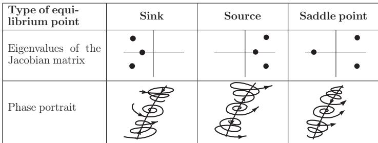
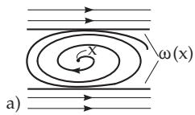
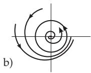
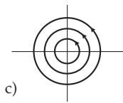

##### 17.1.2.3 Stability Theory

1. Lyapunov Stability and Orbital Stability

Consider the non-autonomous diferential equation (17.11). The solution $\varphi ( t , t _ { 0 } , x _ { 0 } )$ of (17.11) is said to be stable in the sense ofLyapunov if:

$$
\forall t _ { 1 } \geq t _ { 0 } ~ \forall \varepsilon > 0 ~ \exists \delta = \delta ( \varepsilon , t _ { 1 } ) \qquad \forall x _ { 1 } \in M  \\  \qquad \| x _ { 1 } - \varphi ( t _ { 1 } , t _ { 0 } , x _ { 0 } ) \| < \delta \} : \| \varphi ( t , t _ { 1 } , x _ { 1 } ) - \varphi ( t , t _ { 0 } , x _ { 0 } ) \| < \varepsilon\tag{17.16a}
$$

The solution $\varphi ( t , t _ { 0 } , x _ { 0 } )$ is called asymptotically stable in the sense ofLyapunov, if it is stable and:

$$
\begin{array} { c } { \forall t _ { 1 } \geq t _ { 0 } \ \exists \Delta = \Delta ( t _ { 1 } ) \qquad \forall x _ { 1 } \in M } \\ { \left. x _ { 1 } - \varphi ( t _ { 1 } , t _ { 0 } , x _ { 0 } ) \right. < \Delta \} : \left. \varphi ( t , t _ { 1 } , x _ { 1 } ) - \varphi ( t , t _ { 0 } , x _ { 0 } ) \right. \to 0 } \\ { \mathrm { f o r } \ t \to + \infty . } \end{array}\tag{17.16b}
$$

For the autonomous diferential equation (17.1), there are other important notions of stability besides the Lyapunov stability. The solution $\varphi ( t , \dot { x } _ { 0 } )$ of (17.1) is called orbitally stable (asymptotically orbitally stable), if the orbit $\gamma ( x _ { 0 } ) = \{ \varphi ( t , x _ { 0 } ) , t \in \mathbb { R } \}$ is stable (asymptotically stable) as an invariant set. $\mathrm { A }$ solution of (17.1) which represents an equilibrium point is Lyapunov stable exactly if it is orbitally stable. The two types of stability can be diferent for periodic solutions of (17.1).

Let a flow be given in $\mathbb { R } ^ { 3 }$ , whose invariant set is the torus $T ^ { 2 }$ . Locally, let the flow be described in a rectangular coordinate system by $\dot { \Theta } _ { 1 } = 0 , \dot { \Theta } _ { 2 } = f _ { 2 } ( \Theta _ { 1 } )$ , where $f _ { 2 } \colon  { \mathbb { R } } \to  { \mathbb { R } }$ is a $2 \pi$ periodic smooth function, for which:

$$
\begin{array}{c} \forall \theta _ { 1 } \in \mathbf { R } \quad \exists U _ { \theta _ { 1 } } ( { \mathrm { n e i g h b o r h o o d ~ o f } } \theta _ { 1 } ) \quad \forall \delta _ { 1 } , \delta _ { 2 } \in U _ { \theta _ { 1 } }  \\ { \delta _ { 1 } \not = \delta _ { 2 } } \end{array} \} : f _ { 2 } ( \delta _ { 1 } ) \neq f _ { 2 } ( \delta _ { 2 } ) .
$$

An arbitrary solution satisfying the initial conditions $( \Theta _ { 1 } ( 0 ) , \Theta _ { 2 } ( 0 ) )$ can be given on the torus by

$$
\begin{array} { r } { \theta _ { 1 } ( t ) \equiv \theta _ { 1 } ( 0 ) , \quad \theta _ { 2 } ( t ) = \theta _ { 2 } ( 0 ) + f _ { 2 } ( \theta _ { 1 } ( 0 ) t \quad ( t \in \mathbb { R } ) . } \end{array}
$$

From this representation it can be seen that every solution is orbitally stable but not Lyapunov stable (Fig. 17.2b).

2. Asymptotical Stability Theorem of Lyapunov

A scalar-valued function V is called positive definite in a neighborhood U of a point $p \in M \subset \mathbb { R } ^ { n }$ , if: 1. $V \colon U \subset M \to \mathbb { R }$ is continuous.

2. $V ( x ) > 0$ for all $x \in U \setminus \{ p \}$ and $V ( p ) = 0$

Let $U \subset M$ be an open subset and $V : U \to \mathbb { R }$ a continuous function. The function V is called a Lyapunov function of (17.1) in $U , \operatorname { i f } V ( \varphi ( t ) )$ does not increase while for the solution $\varphi ( t ) \in U$ holds. Let $V : U \to \mathbb { R }$ be a Lyapunov function of (17.1) and let V be positive definite in a neighborhood U of $p .$ . Then $p$ is stable. If the condition $V ( \varphi ( t , x _ { 0 } ) ) = \mathrm { c o n s t a n t }$ $\mathit { \Psi } \left( t \geq 0 \right)$ always yields $\varphi ( t , x _ { 0 } ) \equiv p$ for a solution $\varphi$ of (17.1) with $\varphi ( t , x ) \in U \quad ( t \geq 0 )$ , i.e., if the Lyapunov function is constant along a complete trajectory, then this trajectory can only be an equilibrium point, and the equilibrium point p is also asymptotically stable.

The point $( 0 , 0 )$ is a steady point of the planar diferential equation ${ \dot { x } } = y , { \dot { y } } = - x - x ^ { 2 } y$ The function $V ( x , y ) = x ^ { 2 } + y ^ { 2 }$ is positive definite in every neighborhood of $( 0 , 0 )$ and for its derivative $\frac { d } { d t } V ( x ( t ) , y ( t ) ) = - 2 x ( t ) ^ { 2 } y ( t ) ^ { 2 } < 0$ holds along an arbitrary solution for $x ( t ) y ( t ) \neq 0$ . Hence, $( 0 , 0 )$ is

3. Classification and Stability of Steady States

Let $x _ { 0 }$ be an equilibrium point of (17.1). In the neighborhood of $x _ { 0 }$ the local behavior of the orbits of (17.1) can be described under certain assumptions by the variational equation ${ \dot { y } } = D f ( x _ { 0 } ) y .$ where $D f ( x _ { 0 } )$ is the Jacobian matrix of f in $x _ { 0 }$ . If ${ \bf D } f ( x _ { 0 } )$ does not have an eigenvalue $\lambda _ { j }$ with Re $\lambda _ { j } = 0 ;$ then the equilibrium point $x _ { 0 }$ is called hyperbolic. The hyperbolic equilibrium point $x _ { 0 }$ is of type $( m , k )$ if $D f ( x _ { 0 } )$ has exactly m eigenvalues with negative real parts and $k = n - 1 - m$ eigenvalues with positive real parts. The hyperbolic equilibrium point of type $( m , k )$ is called a sink, if $m = n$ , a source, if $k = n$ , and a saddle point, if $m \neq 0$ and $k \neq 0$ (Fig. 17.3). A sink is asymptotically stable; sources and saddles are unstable (theorem on stability in the first approximation). Within the three topological basic types of hyperbolic equilibrium points (sink, source, saddle point) further algebraic distinctions can be made. A sink (source) is called a stable node (unstable node) if every eigenvalue of the Jacobian matrix is real, and a stable focus (unstable focus) if there are eigenvalues with non-vanishing imaginary parts. For $n = 3$ a classification of saddle points is obtained as saddle nodes and saddle foci.

  
Figure 17.3

4. Stability of Periodic Orbits

Let $\varphi ( t , x _ { 0 } )$ be a T-periodic solution of (17.1) and $\gamma ( x _ { 0 } ) ~ = ~ \{ \varphi ( t , x _ { 0 } ) , t ~ \in ~ [ 0 , T ] \}$ its orbit. Under certain assumptions, the phase portrait in a neighborhood of $\gamma ( \boldsymbol { x } _ { 0 } )$ can be described by the variational equation ${ \dot { y } } = D f ( \varphi ( t , x _ { 0 } ) ) y$ . Since $A ( t ) = D \bar { f } ( \varphi ( t , x _ { 0 } ) )$ is a T-periodic continuous matrix function of type $( n , n )$ , it follows from the Floquet theorem (see p. 863) that the fundamental matrix $\varPhi _ { x _ { 0 } } ( t )$ of the variational equation can be written in the form $\dot { \phi } _ { x _ { 0 } } ( t ) = \dot { G } ( t ) e ^ { R t }$ , where G is a T-periodic regular smooth matrix function with $G ( 0 ) = E _ { n }$ , and R represents a constant matrix of type $( n , n )$ which is not uniquely given. The matrix $\bar { \phi _ { x _ { 0 } } ( T ) } = e ^ { R T }$ is called the monodromy matrix of the periodic orbit $\gamma ( \boldsymbol { x } _ { 0 } )$ and the eigenvalues $\rho _ { 1 } , \ldots , \rho _ { n }$ of $\mathbf { \Psi } _ { e } \hat { R } T$ are called multipliers ofthe periodic $o r b i t \gamma ( x _ { 0 } )$ . If the orbit $\gamma ( \boldsymbol { x } _ { 0 } )$ is represented by another solution $\varphi ( t , x _ { 1 } ) , { \mathrm { i . e . , i f } } \gamma ( x _ { 0 } ) = \gamma ( x _ { 1 } )$ , then the multipliers of $\gamma ( \boldsymbol { x } _ { 0 } )$ and $\gamma ( x _ { 1 } )$ coincide. One of the multipliers of a periodic orbit is always equal to one (Andronov–Witt theorem). Let $\rho _ { 1 } , . . . , \rho _ { n - 1 } , \rho _ { n } = 1$ be the multipliers of the periodic orbit $\gamma ( \boldsymbol { x } _ { 0 } )$ and let $\varPhi _ { x _ { 0 } } ( T )$ be the monodrom matrix of $\gamma ( \boldsymbol { x } _ { 0 } )$ . Then

$$
\sum _ { j = 1 } ^ { n } \rho _ { j } = { \mathrm { T r } } \varPhi _ { x _ { 0 } } ( T ) { \mathrm { a n d ~ } } \prod _ { j = 1 } ^ { n } \rho _ { j } = \operatorname* { d e t } \varPhi _ { x _ { 0 } } ( T ) = \exp \left( \int _ { 0 } ^ { T } { \mathrm { T r } } D f ( \varphi ( t , x _ { 0 } ) ) d t \right)
$$

$$
= \exp \left( \int _ { 0 } ^ { T } \mathrm { d i v } f ( \varphi ( t , x _ { 0 } ) ) d t \right) .\tag{17.17}
$$

Hence, if $n = 2$ , then $\begin{array} { r } { \rho _ { 2 } = 1 \mathrm { a n d } \rho _ { 1 } = \exp \left( \int _ { 0 } ^ { T } \mathrm { d i v } f ( \varphi ( t , x _ { 0 } ) ) d t \right) } \end{array}$

Let $\varphi ( t , ( 1 , 0 ) ) = ( \cos { t } , \sin { t } )$ be a 2π-periodic solution of (17.9a). The matrix $A ( t )$ of the variational equation with respect to this solution is

$$
A ( t ) = D f ( \varphi ( t , ( 1 , 0 ) ) ) = { \binom { - 2 \cos ^ { 2 } t - 1 - \sin 2 t } { 1 - \sin 2 t - 2 \sin ^ { 2 } t } } .
$$

The fundamental matrix $\varPhi _ { ( 1 , 0 ) } ( t )$ normed at $t = 0$ is given by

$$
\varPhi _ { ( 1 , 0 ) } ( t ) = \left( \begin{array} { l } { e ^ { - 2 t } \cos t - \sin t } \\ { e ^ { - 2 t } \sin t \quad \cos t } \end{array} \right) = \left( \begin{array} { l l } { \cos t - \sin t } \\ { \sin t \quad \cos t } \end{array} \right) \left( \begin{array} { l l } { e ^ { - 2 t } 0 } \\ { 0 } & { 1 } \end{array} \right) ,
$$

where the last product is a Floquet representation of $\varPhi _ { ( 1 , 0 ) } ( t )$ . Thus, $\rho _ { 1 } = e ^ { - 4 \pi }$ and $\rho _ { 2 } = 1$ . The multipliers can be determined without the Floquet representation. For system $( 1 7 . 9 \mathrm { a } ) \mathrm { d i v } f ( x , y ) = 2 - 4 x ^ { 2 } -$ $4 y ^ { 2 }$ holds, and hence $\operatorname { d i v } f ( \cos t , \sin t ) \equiv - 2$ . According to the formula above, $\begin{array} { r } { \rho _ { 1 } = \exp \left( \int _ { 0 } ^ { 2 \pi } - 2 d t \right) = } \end{array}$ $\exp ( - 4 \pi )$

5. Classification of Periodic Orbits

If the periodic orbit γ of (17.1) has no further multiplier on the complex unit circle besides $\rho _ { n } = 1$ , then $\gamma$ is called hyperbolic. The hyperbolic periodic orbit is of type $( m , k )$ if there are m multipliers inside and $k = n - 1 - m$ multipliers outside the unit circle. If $m > 0$ and $k > 0$ , then the periodic orbit of type $( m , k )$ is called a saddle point.

According to the Andronov-Witt theorem, a hyperbolic periodic orbit γ of (17.1) of type $( n - 1 , 0 )$ is asymptotically stable. Hyperbolic periodic orbits of type $( m , k )$ with $k > 0$ are unstable.

A: A periodic orbit $\gamma = \{ \varphi ( t ) , t \in [ 0 , T ] \}$ in the plane with multipliers $\rho _ { 1 }$ and $\rho _ { 2 } = 1$ is asymptotically stable if $\begin{array} { r } { | \rho _ { 1 } | < 1 , \mathrm { i . e . , i f } \int _ { 0 } ^ { T } \mathrm { d i v } f ( \varphi ( t ) ) d t < 0 , } \end{array}$

B: If there is a further multiplier besides $\rho _ { n } = 1$ on the complex unit circle, then the Andronov– Witt theorem cannot be applied. The information about the multipliers is not suficient for the stability analysis of the periodic orbit.

C: As an example, let the planar system $\dot { x } = - y + x f ( x ^ { 2 } + y ^ { 2 } ) , \quad \dot { y } = x + y f ( x ^ { 2 } + y ^ { 2 } )$ be given by the smooth function $f \colon ( 0 , \mathsf { \bar { + } } \infty ) \to \mathbb { R }$ , which additionally satisfies the properties $f ( 1 ) = f ^ { \prime } ( 1 ) = 0$ and $f ( r ) ( r - 1 ) < 0$ for all $r \neq 1 , r > 0$ . Obviously, $\varphi ( t ) = ( \cos t , \sin t )$ is a 2π-periodic solution of the system and

$\phi _ { ( 1 , 0 ) } ( t ) = { \binom { \cos t - \sin t } { \sin t \quad \cos t } } { \binom { 1 ~ 0 } { 0 ~ 1 } }$ is the Floquet representation of the fundamental matrix. It follows

that $\rho _ { 1 } = \rho _ { 2 } = 1$ . The use of polar coordinates results in the system $\dot { r } = r f ( r ^ { 2 } ) , \dot { \vartheta } = 1$ . This representation yields that the periodic orbit $\gamma ( ( 1 , 0 ) )$ is asymptotically stable.

6. Properties of Limit Sets, Limit Cycles

The α - and ω -limit sets defined in 17.1.1.2, p. 859, have with respect to the flow of the diferential equation (17.1) with $M \subset \mathbb { R } ^ { n }$ the following properties. Let $x \in M$ be an arbitrary point. Then:

a) The sets $\alpha ( x )$ and $\omega ( x )$ are closed.

b) $\operatorname { I f } \gamma ^ { + } ( x )$ (respectively $\gamma ^ { - } ( x ) )$ is bounded, then $\omega ( x ) \neq \emptyset$ (respectively $\alpha ( x ) \neq \varnothing )$ holds. Furthermore, $\omega ( x )$ (respectively $\alpha ( x ) )$ are in this case invariant under the flow (17.1) and connected.

If for instance, $\gamma ^ { + } ( x )$ is not bounded, then $\omega ( x )$ is not necessarily connected (Fig. 17.4a).

For a planar autonomous diferential equation (17.1), $( \mathrm { i . e . , } M \subset \mathbb { R } ^ { 2 } )$ the Poincar´e–Bendixson theorem is valid.

Poincar´e–Bendixson Theorem: Let $\varphi ( \cdot , p )$ be a non-periodic solution of (17.1), for which $\gamma ^ { + } ( p )$

  
Figure 17.4

bounded. If $\omega _ { } ( p _ { } )$ contains no equilibrium point of (17.1), then $\omega _ { } ( \boldsymbol p )$ is a periodic orbit of (17.1). Hence, for autonomous diferential equations in the plane, attractors more complicated than an equilibrium point or a periodic orbit are not possible.

A periodic orbit $\gamma$ of (17.1) is called a limit cycle, if there exists an $x \notin \gamma$ such that either $\gamma \subset \omega ( x )$ or $\gamma \subset \alpha ( x )$ holds. A limit cycle is called a stable limit cycle if there exists a neighborhood U of $\gamma$ such that $\gamma = \omega ( x )$ holds for all ${ \bf { \bar { \boldsymbol { x } } } } \in U$ , and an unstable limit cycle if there exists a neighborhood $U$ of $\gamma$ such that $\gamma = \alpha ( x )$ holds for all $x \in U$

A: For the flow of (17.9a), the property $\gamma = \omega ( p )$ for all $p \neq ( 0 , 0 )$ is valid for the periodic orbit $\gamma = \{ ( \cos t , \sin t ) , \ t \in [ 0 , 2 \pi ) \}$ . Hence, $U = \mathbb { R } ^ { 2 } \backslash \{ ( 0 , 0 ) \}$ is a neighborhood of $\gamma$ such that with it, $\gamma$ is a stable limit cycle (Fig. 17.4b).

B: In contrast, for the linear diferential equation ${ \dot { x } } = - y , { \dot { y } } = x$ , the orbit $\gamma = \{ ( \cos t , \sin t )$ $t \in$ $[ 0 , 2 \pi ] \}$ is a periodic orbit, but not a limit cycle (Fig. 17.4c).

7. m-Dimensional Embedded Tori as Invariant Sets

A diferential equation (17.1) can have an m-dimensional torus as an invariant set. An m-dimensional torus $T ^ { m }$ embedded into the phase space $M \subset \mathbb { R } ^ { n }$ is defined by a diferentiable mapping $g \colon \mathbb { R } ^ { m }  \mathbb { R } ^ { n }$ , which is supposed to be 2π-periodic in every coordinate $\theta _ { i }$ as a function $( \theta _ { 1 } , \dots , \theta _ { m } ) \mapsto \bar { g } ( \theta _ { 1 } , \dots , \theta _ { m } )$

In simple cases, the motion of the system (17.1) on the torus can be described in a rightangular coordinate system by the diferential equations $\begin{array} { r l } { \dot { \Theta } _ { i } = \omega _ { i } } & { { } ( i = 1 , 2 , . . . , m ) } \end{array}$ . The solution of this system with initial values $( \theta _ { 1 } ( 0 ) , \dots , \theta _ { m } ( 0 ) )$ at time $t = 0 \mathrm { i s } \theta _ { i } ( t ) = \omega _ { i } t + \dot { \theta } _ { i } ( \dot { 0 } ) \quad ( i = 1 , 2 , \dots , m ; t \in \mathbb { R } )$ A continuous function $f \colon \mathbb { R } \to \mathbb { R } ^ { n }$ is called quasiperiodic if $f$ has a representation of the form $f ( t ) =$ $g ( \omega _ { 1 } t , \omega _ { 2 } t , \ldots , \omega _ { n } t )$ , where $g$ is also a diferentiable function as above, which is 2π-periodic in every component, and the frequencies $\omega _ { i }$ are incommensurable, i.e., there are no such integers $n _ { i }$ with

$\sum _ { i = 1 } ^ { m } n _ { i } ^ { 2 } > 0$ for which $n _ { 1 } \omega _ { 1 } + \cdot \cdot \cdot + n _ { m } \omega _ { m } = 0$ holds.
