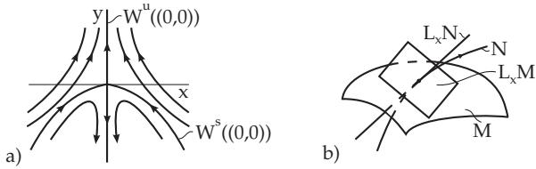
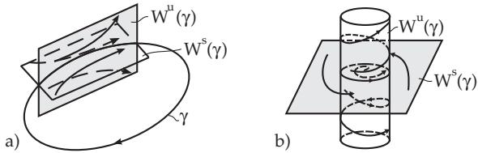
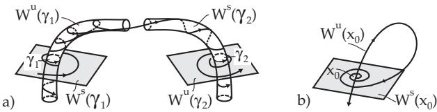

##### 17.1.2.4 Invariant Manifolds

1. Definition, Separatrix Surfaces

Let $\gamma$ be a hyperbolic equilibrium point or a hyperbolic periodic orbit of (17.1). The stable manifold $W ^ { s } ( \gamma )$ (respectively unstable manifold $W ^ { u } ( \gamma ) )$ of $\gamma$ is the set of all points of the phase space such that the orbits tending to $\gamma$ as $t \to + \infty$ (respectively $t \to - \infty )$ pass through these points:

$$
W ^ { s } ( \gamma ) = \{ x \in M \colon \omega ( x ) = \gamma \} \mathrm { ~ a n d ~ } W ^ { u } ( \gamma ) = \{ x \in M \colon \alpha ( x ) = \gamma \} .\tag{17.18}
$$

Stable and unstable manifolds are also called separatrix surfaces.

In the plane, the diferential equation

$$
\dot { x } = - x , \quad \dot { y } = y + x ^ { 2 }\tag{17.19a}
$$

is considered. The solution of (17.19a) with initial state $( x _ { 0 } , y _ { 0 } )$ at time $t = 0$ is explicitly given by

$$
\varphi ( t , x _ { 0 } , y _ { 0 } ) = ( e ^ { - t } x _ { 0 } , e ^ { t } y _ { 0 } + \frac { x _ { 0 } ^ { 2 } } { 3 } \left( e ^ { t } - e ^ { - 2 t } \right) ) .\tag{17.19b}
$$

For the stable and unstable manifolds of the equilibrium point (0, 0) of (17.19a) one gets:

$$
W ^ { s } ( ( 0 , 0 ) ) = \{ ( x _ { 0 } , y _ { 0 } ) \colon \operatorname* { l i m } _ { t \to + \infty } \varphi ( t , x _ { 0 } , y _ { 0 } ) = ( 0 , 0 ) \} = \{ ( x _ { 0 } , y _ { 0 } ) \colon y _ { 0 } + \frac { x _ { 0 } ^ { 2 } } { 3 } = 0 \} ,
$$

$$
W ^ { u } ( ( 0 , 0 ) ) = \left\{ ( x _ { 0 } , y _ { 0 } ) \colon \operatorname* { l i m } _ { t \to - \infty } \varphi ( t , x _ { 0 } , y _ { 0 } ) = ( 0 , 0 ) \right\} = \left\{ ( x _ { 0 } , y _ { 0 } ) \colon x _ { 0 } = 0 , \ y _ { 0 } \in \mathbb { R } \right\} ( \mathrm { F i g . ~ 1 7 . 5 a } ) .
$$

  
Figure 17.5

Let M and N be two smooth surfaces in $\mathbb { R } ^ { n }$ , and let $L _ { x } M$ and $L _ { x } N$ be the corresponding tangent planes to M and N through x. The surfaces M and N are transversal to each other if for all $\mathbf { \bar { \Phi } } _ { x } \in \bar { M } \cap \mathbf { \bar { N } }$ the following relation holds:

$$
\dim L _ { x } M + \dim L _ { x } N - n = \dim ( L _ { x } M \cap L _ { x } N ) .
$$

For the section represented in Fig. 17.5b one can see that dim $L _ { x } M = 2$ , dim $L _ { x } N = 1$ and dim $( L _ { x } M \cap L _ { x } N ) = { \bar { 0 } }$ holds. Hence, the section represented in Fig. 17.5b is transversal.

2. Theorem of Hadamard and Perron

Important properties of separatrix surfaces are given by the Theorem ofHadamard and Perron:

Let $\gamma$ be a hyperbolic equilibrium point or a hyperbolic periodic orbit of (17.1).

a) The manifolds $W ^ { s } ( \gamma )$ and $W ^ { u } ( \gamma )$ are generalized Cr-surfaces, which locally look like Cr-smooth elementary surfaces. Every orbit of (17.1), which does not tend to γ for $t \to + \infty \mathrm { o r } t \to - \infty$ , respectively, leaves a suficiently small neighborhood of $\gamma$ for $t \to + \infty$ or $t \to - \infty$ , respectively.

b) $\operatorname { I f } \gamma = x _ { 0 }$ is an equilibrium point of type $( m , k )$ , then $W ^ { s } ( x _ { 0 } )$ and $W ^ { u } ( x _ { 0 } )$ are surfaces of dimension m and k, respectively. The surfaces $W ^ { s } ( \bar { x } _ { 0 } )$ and $\dot { W } ^ { u } ( x _ { 0 } )$ are tangent at $x _ { 0 }$ to the stable vector subspace

$$
E ^ { s } = \{ y \in \mathbb { R } ^ { n } \colon e ^ { D f ( x _ { 0 } ) t } y  0 \mathrm { ~ f o r ~ } t  + \infty \} \mathrm { ~ o f ~ e q u a t i o n ~ } j = D f ( x _ { 0 } ) y\tag{17.20a}
$$

and the unstable vector subspace

$E ^ { u } = \{ y \in \mathbb { R } ^ { n } ; e ^ { D f ( x _ { 0 } ) t } y  0 { \mathrm { ~ f o r ~ } } t  - \infty \}$ of equation ${ \dot { y } } = D f ( x _ { 0 } ) y$ , respectively. (17.20b) c) If γ is a hyperbolic periodic orbit of type $( m , k )$ , then $W ^ { s } ( \gamma )$ and $W ^ { u } ( \gamma )$ are surfaces of dimension $\dot { m } + 1$ and $k + 1$ , respectively, and they intersect each other transversally along γ (Fig. 17.6a).

A: To determine a local stable manifold through the steady state $( 0 , 0 )$ of the diferential equation (17.19a) here it is supposed that $W _ { l o c } ^ { s } ( ( 0 , 0 ) )$ has the following form: $\begin{array} { r } { W _ { l o c } ^ { s } ( ( 0 , 0 ) ) = \{ ( x , y ) \colon y = h ( x ) , | x | < \Delta , h \colon ( - \Delta , \Delta ) \to \mathbb { R } } \end{array}$ diferentiable .

Let $( x ( t ) , y ( t ) )$ be a solution of (17.19a) lying in $W _ { l o c } ^ { s } ( ( 0 , 0 ) )$ . Based on the invariance, for times s near to $t \ y ( s ) = h ( x ( s ) )$ holds. By diferentiation and representation of ˙x and $\dot { y }$ from the system (17.19a) one gets the initial value problem $h ^ { \prime } ( x ) \left( - x \right) = h ( x ) { \bf \dot { \sigma } } + x ^ { 2 } , h ( 0 ) = 0$ for the unknown function ${ \dot { h } } ( x )$ . If looking for the solution in the form of a series expansion $h ( x ) = { \frac { a _ { 2 } } { 2 } } x ^ { 2 } + { \frac { a _ { 3 } } { 3 ! } } x ^ { 3 } + \cdot \cdot \cdot$ , where $h ^ { \prime } ( 0 ) = 0$ is

taken under consideration, then one gets by comparing the coeficients $a _ { 2 } = - { \frac { 2 } { 3 } }$ and $a _ { k } = 0$ for $k \geq 3$

B: For the system

$$
\dot { x } = - y + x ( 1 - x ^ { 2 } - y ^ { 2 } ) , \dot { y } = x + y ( 1 - x ^ { 2 } - y ^ { 2 } ) , \dot { z } = \alpha z\tag{17.21}
$$

with a parameter $\alpha > 0$ , the orbit $\gamma = \{ ( \cos t , \sin t , 0 ) , t \in [ 0 , 2 \pi ] \}$ is a periodic orbit with multipliers $\rho _ { 1 } = e ^ { - 4 \pi } , \rho _ { 2 } = e ^ { \alpha 2 \pi }$ and $\rho _ { 3 } = 1$ In cylindrical coordinates x = r cos $\vartheta , \ : y = r \sin \vartheta , z = z$ , with initial values $( r _ { 0 } , \vartheta _ { 0 } , z _ { 0 } )$ at time $t = 0$

the solution of (17.21) has the representation $( r ( t , r _ { 0 } ) , \vartheta ( t , \vartheta _ { 0 } ) , e ^ { \alpha t } z _ { 0 } )$ , where $r ( t , \boldsymbol { r } _ { 0 } )$ and $\vartheta ( t , \vartheta _ { 0 } )$ is the solution of (17.9a) in polar coordinates. Consequently,

$$
W ^ { s } ( \gamma ) = \{ ( x , y , z ) \colon z = 0 \} \setminus \{ ( 0 , 0 , 0 ) \} \quad \mathrm { a n d } \quad W ^ { u } ( \gamma ) = \{ ( x , y , z ) \colon x ^ { 2 } + y ^ { 2 } = 1 \} \quad \mathrm { ( c y l i n d e r ) } .
$$

Both separatrix surfaces are shown in Fig. 17.6b.

  
Figure 17.6

3. Local Phase Portraits Near Steady States for ${ \boldsymbol { n } } = 3$

Considered is the diferential equation (17.1) with the hyperbolic equilibrium point 0 for $n = 3$ . Set $A = D f ( 0 )$ and let det $\left[ \lambda E - A \right] = \lambda ^ { 3 } + p \lambda ^ { 2 } + q \lambda + r$ be the characteristic polynomial of A. With the notation $\delta = p q - r$ and $\Delta = { \dot { - } } p ^ { 2 } q ^ { 2 } + { \dot { 4 } } p ^ { 3 } r + { \dot { 4 } } q ^ { 3 } - 1 8 p q r + 2 7 r ^ { 2 }$ (discriminant of the characteristic polynomial), the diferent equilibrium point types are characterized in Table 17.1.

4. Homoclinic and Heteroclinic Orbits

Suppose $\gamma _ { 1 }$ and γ are two hyperbolic equilibrium points or periodic orbits of (17.1). If the separatrix surfaces $W ^ { s } ( \gamma _ { 1 } )$ and $W ^ { u } ( \gamma _ { 2 } )$ intersect each other, then the intersection consists of complete orbits. For two equilibrium points or periodic orbits, the orbit $\gamma \subset W ^ { s } ( \gamma _ { 1 } ) \cap W ^ { u } ( \gamma _ { 2 } )$ is called heteroclinic if $\gamma _ { 1 } \neq \gamma _ { 2 } ( \mathbf { F i g . 1 7 . 7 a } )$ , and homoclinic $\mathrm { f } \gamma _ { 1 } = \gamma _ { 2 }$ . Homoclinic orbits of equilibrium points are also called separatrix loops (Fig. 17.7b).

  
Figure 17.7

Consider the Lorenz system (17.2) with fixed parameters $\sigma = 1 0 , b = 8 / 3$ and with variable r. The equilibrium point $( 0 , 0 , 0 )$ of (17.2) is a saddle for $1 < r < 1 3 . 9 2 6 \dots$ , which is characterized by a twodimensional stable manifold $\dot { W } ^ { s }$ and a one-dimensional unstable manifold $W ^ { u } . \ \mathrm { I f } \ r = 1 3 . 9 2 6 \dots$ , then there are two separatrix loops at (0, 0, 0), i.e., as $t \to + \infty$ branches of the unstable manifold return (over the stable manifold) to the origin (see [17.9])
