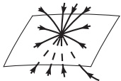
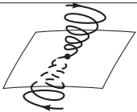
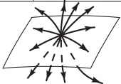
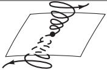
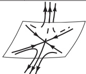
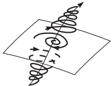
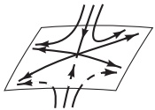
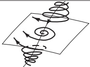
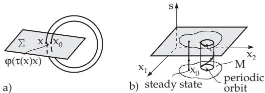

##### 17.1.2.5 Poincar´e Mapping

1. Poincar´e Mapping for Autonomous Diferential Equations

Let $\gamma = \{ \varphi ( t , x _ { 0 } ) , t \in [ 0 , T ] \}$ be a T-periodic orbit of (17.1) and $\Sigma \mathrm { ~ a ~ } ( n - 1 )$ -dimensional smooth hypersurface, which intersects the orbit transversally in $x _ { 0 } \ ( \mathrm { F i g . 1 7 . 8 a } )$ . Then, there is a neighborhood U of $x _ { 0 }$ and a smooth function $\tau \colon U $ IR such that $\tau ( x _ { 0 } ) = T$ and $\varphi ( \tau ( x ) , x ) \in \Sigma$ for all $x \in U$ The mapping $P \colon U \cap \Sigma \to \Sigma$ with $P ( x ) = \varphi ( \tau ( x ) , x )$ is called the Poincar´e mapping of $\gamma$ at $x _ { 0 }$ . If  the right-hand side f of (17.1) is $r$ times continuously diferentiable, then $P$ is also $r$ times continuously diferentiable . The eigenvalues of the Jacobi matrix $D P ( x _ { 0 } )$ are the multipliers $\rho _ { 1 } , \ldots , \rho _ { n - 1 }$ of the periodic orbit. They do not depend on the choice of $x _ { 0 }$ on $\gamma$ and on the choice of the transversal surface.

Table 17.1 Steady state types in three-dimensional phase spaces
<table><tr><td rowspan=1 colspan=1>Parameterdomain</td><td rowspan=1 colspan=1> $\Delta$ </td><td rowspan=1 colspan=1>Type of equili-brium point</td><td rowspan=1 colspan=1>Roots of the charac-teristic polynomial</td><td rowspan=1 colspan=1>Dimension of $W ^ { s } { \mathrm { ~ a n d ~ } } W ^ { u }$ </td></tr><tr><td rowspan=2 colspan=1> $\delta > 0 ; r > 0 .$  $q > 0$ </td><td rowspan=1 colspan=1> $\Delta < 0$ </td><td rowspan=1 colspan=1>stablenode</td><td rowspan=1 colspan=1> $\mathrm { I m } \lambda _ { j } = 0$  $\lambda _ { j } < 0 , j = 1 , 2 , 3$ </td><td rowspan=2 colspan=1> $\dim W ^ { s } = 3 .$ dim $W ^ { u } = 0$ </td></tr><tr><td rowspan=1 colspan=1> $\Delta > 0$ </td><td rowspan=1 colspan=1>stablefocus</td><td rowspan=1 colspan=1> $\overline { { \mathrm { R e } \lambda _ { 1 , 2 } < 0 } }$  $\lambda _ { 3 } < 0$ </td></tr><tr><td rowspan=1 colspan=5> $\Delta < 0 \colon$                                        $\Delta > 0 \colon$                 </td></tr><tr><td rowspan=1 colspan=1>Parameterdomain</td><td rowspan=1 colspan=1> $\Delta$ </td><td rowspan=1 colspan=1>Type of equili-brium point</td><td rowspan=1 colspan=1>Roots of the charac-teristic polynomial</td><td rowspan=1 colspan=1>Dimension of $W ^ { s } { \mathrm { ~ a n d ~ } } W ^ { u }$ </td></tr><tr><td rowspan=2 colspan=1> $\delta < 0 ; r < 0 .$  $q > 0$ </td><td rowspan=1 colspan=1> $\Delta < 0$ </td><td rowspan=1 colspan=1>unstablenode</td><td rowspan=1 colspan=1> $\overline { { \mathrm { I m } \lambda _ { i } = 0 } }$  $\lambda _ { j } > 0 , j = 1 , 2 , 3$ </td><td rowspan=2 colspan=1>dim $W ^ { s } = 0$  dim $W ^ { u } = 3$ </td></tr><tr><td rowspan=1 colspan=1> $\Delta > 0$ </td><td rowspan=1 colspan=1>unstablefocus</td><td rowspan=1 colspan=1> $\overline { { \mathrm { R e } \lambda _ { 1 , 2 } > 0 } }$  $\lambda _ { 3 } > 0$ </td></tr><tr><td rowspan=1 colspan=5> $\Delta < 0 \colon$                                        $\Delta > 0 \colon$                 </td></tr><tr><td rowspan=1 colspan=1>Parameterdomain</td><td rowspan=1 colspan=1> $\Delta$ </td><td rowspan=1 colspan=1>Type of equili-brium point</td><td rowspan=1 colspan=1>Roots of the charac-teristic polynomial</td><td rowspan=1 colspan=1>Dimension of $W ^ { s } { \mathrm { ~ a n d ~ } } W ^ { u }$ </td></tr><tr><td rowspan=2 colspan=1> $\delta > 0 ; r < 0 ,$  $q \leq 0 \ \mathrm { o r }$  $\bar { r } < 0 , q > 0$ </td><td rowspan=1 colspan=1> $\Delta < 0$ </td><td rowspan=1 colspan=1>saddlenode</td><td rowspan=1 colspan=1> $\overline { { \mathrm { I m } \lambda _ { j } = 0 } }$  $\lambda _ { 1 , 2 } < 0 , \lambda _ { 3 } > 0$ </td><td rowspan=2 colspan=1>dim $W ^ { s } = 2$ dim $W ^ { u } = 1$ </td></tr><tr><td rowspan=1 colspan=1> $\Delta > 0$ </td><td rowspan=1 colspan=1>saddlefocus</td><td rowspan=1 colspan=1> $\overline { { \mathrm { R e } \lambda _ { 1 , 2 } < 0 } }$  $\lambda _ { 3 } > 0$ </td></tr><tr><td rowspan=1 colspan=5> $\Delta < 0 \colon$                                        $\Delta > 0 \colon$                 </td></tr><tr><td rowspan=1 colspan=1>Parameterdomain</td><td rowspan=1 colspan=1> $\Delta$ </td><td rowspan=1 colspan=1>Type of equili-brium point</td><td rowspan=1 colspan=1>Roots of the charac-teristic polynomial</td><td rowspan=1 colspan=1>Dimension of $W ^ { s } { \mathrm { ~ a n d ~ } } W ^ { u }$ </td></tr><tr><td rowspan=2 colspan=1> $\delta < 0 ; r > 0 .$  $q \leq 0 \ \mathrm { o r }$  $r > 0 , q > 0$ </td><td rowspan=1 colspan=1> $\Delta < 0$ </td><td rowspan=1 colspan=1>saddlenode</td><td rowspan=1 colspan=1> $\overline { { \mathrm { I m } \lambda _ { j } = 0 } }$  $\lambda _ { 1 , 2 } > 0 , \lambda _ { 3 } < 0$ </td><td rowspan=2 colspan=1>dim $W ^ { s } = 1$ , dim $W ^ { u } = 2$ </td></tr><tr><td rowspan=1 colspan=1> $\Delta > 0$ </td><td rowspan=1 colspan=1>saddlefocus</td><td rowspan=1 colspan=1> $\overline { { \mathrm { R e } \lambda _ { 1 , 2 } > 0 } }$  $\lambda _ { 3 } < 0$ </td></tr><tr><td rowspan=1 colspan=5> $\Delta < 0 \colon$                                       $\Delta > 0 \colon$                 </td></tr></table>

A system (17.3) in $M = U$ can be connected with the Poincar´e mapping, which makes sense until the iterates stay in U. The periodic orbits of (17.1) correspond to the equilibrium points of this discrete system, and the stability of these equilibrium points corresponds to the stability of the periodic orbits of (17.1).

  
Figure 17.8

Considered is for the system (17.9a) the transversal hyperplanes

$$
\sum = \left\{ ( r , \vartheta ) \colon r > 0 , \vartheta = \vartheta _ { 0 } \right\}
$$

in polar coordinate form. For these planes $U = \Sigma$ can be chosen. Obviously, $\tau ( r ) = 2 \pi ( \forall r > 0 )$ and so

$$
P ( r ) = [ 1 + ( r ^ { - 2 } - 1 ) e ^ { - 4 \pi } ] ^ { - 1 / 2 } ,
$$

where the solution representation of (17.9a) is used. It is also valid that $P ( \Sigma ) = \Sigma , P ( 1 ) = 1$ and $P ^ { \prime } ( 1 ) = e ^ { - 4 \pi } < 1$

2. Poincar´e Mapping for Non-Autonomous Time-Periodic Diferential Equations A non-autonomous diferential equation (17.11), whose right-hand side f has period T with respect to t, i.e., for which $f ( t + T , x ) = f ( t , x ) \ ( \forall t \in \mathbb { R } , \forall x \in M )$ holds, is interpreted as an autonomous diferential equation ${ \dot { x } } = f ( s , x ) , { \dot { s } } = 1$ with cylindrical phase space $M \times \{ s { \bmod { T } } \}$ . Let $s _ { 0 } \in \{ \colon$ s mod $T \}$ be arbitrary. Then, $\Sigma = \cal M \times \{ s _ { 0 } \}$ is a transversal plane (Fig. 17.8b). The Poincar´e mapping is given globally as $P \colon \Sigma  \Sigma$ over $x _ { 0 } \longmapsto \varphi ( s _ { 0 } + T , s _ { 0 } , x _ { 0 } )$ , where $\varphi ( t , s _ { 0 } , x _ { 0 } )$ is the solution of (17.11)  with the initial state x at time $s _ { 0 }$
