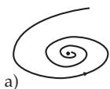
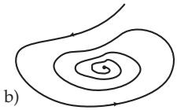
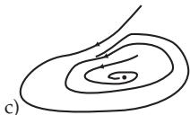
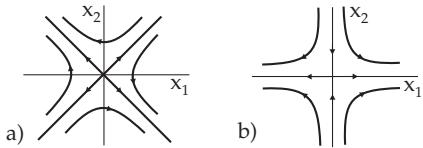

##### 17.1.2.6 Topological Equivalence of Differential Equations

1. Definition

Suppose, besides (17.1) with the corresponding flow $\{ \varphi ^ { t } \} _ { t \in \mathrm { R } }$ , that a further autonomous diferential equation

$$
{ \dot { x } } = g ( x ) ,\tag{17.22}
$$

is given, where $g \colon N \to \mathbb { R } ^ { n }$ is a Cr-mapping on the open set $N \subset \mathbb { R } ^ { n }$ . Of course, the flow $\{ \psi ^ { t } \} _ { t \in \mathrm { R } }$ of (17.22) should exist.

The diferential equations (17.1) and (17.22) (or their flows) are called topologically equivalent if there exists a homeomorphism $h \colon M \to N \left( \mathrm { i . e . } \right.$ , h is bijective, h and $h ^ { - 1 }$ are continuous), which transforms each orbit of (17.1) to an orbit of (17.22) preserving the orientation, but not necessarily preserving the parametrization. The systems (17.1) and (17.22) are topologically equivalent if there also exists a continuous mapping τ : $\mathbb { R } \times M \to \dot { \mathbb { R } }$ , besides the homeomorphism $h \colon M \to N$ , such that τ is strictly monotonically increasing at every fixed $x \in M$ , maps IR onto IR, with $\tau ( 0 , x ) = 0$ for all $x \in M$ and satisfies the relation $h ( \varphi ^ { t } ( x ) ) = \psi ^ { \tau ( t , x ) } ( h ( x ) )$ for all $x \in M$ and $t \in \mathbb { R }$

In the case of topological equivalence, the equilibrium points of (17.1) go over into steady states of (17.22) and periodic orbits of (17.1) go over into periodic orbits of (17.22), where the periods are not necessarily coincident. Hence, if two systems (17.1) and (17.22) are topologically equivalent, then the topological structure of the decomposition of the phase spaces into orbits is the same. If two systems (17.1) and (17.22) are topologically equivalent with the homeomorphism $h \colon M \to N$ and if h preserves the parametrization, i.e., $h ( \breve { \varphi } ^ { t } ( x ) ) = \dot { \psi } ^ { t } ( h ( x ) )$ holds for every t, x, then (17.1) and (17.22) are called

topologically conjugate.

Topological equivalence or conjugation can also refer to subsets of the phase spaces M and N. Suppose, e.g., (17.1) is defined on $\breve { U } _ { 1 } \subset M$ and (17.22) on $U _ { 2 } \subset N$ . Then (17.1) on $U _ { 1 }$ is called topologically equivalent to (17.22) on $U _ { 2 }$ if there exists a homeomorphism $h \colon U _ { 1 } \to U _ { 2 }$ which transforms the intersection of the orbits of (17.1) with $U _ { 1 }$ into the intersection of the orbits of (17.22) with $U _ { 2 }$ preserving the orientation

A: Homeomorphisms for (17.1) and (17.22) are mappings where, e.g., stretching and shrinking of the orbits are allowed; cutting and closing are not.

The flows corresponding to phase portraits of Fig. 17.9a and Fig. 17.9b are topologically equivalent;   
the flows shown in Fig. 17.9a and Fig. 17.9c are not.

  
Figure 17.9

B: Consider the two linear planar diferential equations (see [17.11])

${ \dot { x } } = A x$ and $\dot { x } = B x$ with $A = \left( { - 1 - 3 \atop - 3 - 1 } \right)$ and $B = \left( \begin{array} { c r } { { 4 } } & { { 0 } } \\ { { 0 } } & { { - 8 } } \end{array} \right)$ . The phase portraits of these systems close to (0, 0) are shown in Fig. 17.10a and Fig. 17.10b.

The homeomorphism h : $\mathbb { R } ^ { 2 } \to \mathbb { R } ^ { 2 }$ with $h ( x ) \ : = \ : R x$ , where $R = \frac { 1 } { \sqrt { 2 } } \left( { 1 - 1 \atop 1 } \right)$ , and the function $\tau \colon  { \mathbb { R } } \times  { \mathbb { R } } ^ { 2 } \to  { \mathbb { R } }$ with $\tau ( t , x ) = \frac { 1 } { 2 }$ t transform the orbits of the first system into the orbits of the second one. Hence, the two systems are topologically equivalent.

  
Figure 17.10

2. Theorem of Grobman and Hartman

Let p be a hyperbolic equilibrium point of (17.1). Then, in a neighborhood of $p$ the diferential equation (17.1) is topologically equivalent to its linearization $\dot { y } = D f ( p ) \bar { y }$
