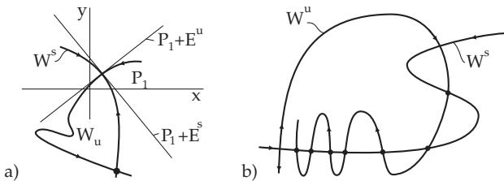

#### 17.1.3 Discrete Dynamical Systems

##### 17.1.3.1 Steady States, Periodic Orbits and Limit Sets

1. Types of Steady State Points

Let $x _ { 0 }$ be an equilibrium point of (17.3) with $M \subset \mathbb { R } ^ { n }$ . The local behavior of the iteration (17.3) close to $x _ { 0 }$ is given, under certain assumptions, by the variational equation $y _ { t + 1 } = D \varphi ( x _ { 0 } ) y _ { t } , t \in T$ . If $D \varphi ( x _ { 0 } )$ has no eigenvalue $\lambda _ { i }$ with $| \lambda _ { i } | = 1$ , then the steady state point $x _ { 0 }$ , analogously to the diferential equation case, is called hyperbolic. The hyperbolic equilibrium point $x _ { 0 }$ is of type $( \dot { m } , k )$ if $D f ( x _ { 0 } )$ has exactly m eigenvalues inside and $k = n - m$ eigenvalues outside the complex unit circle. The hyperbolic equilibrium point of type $( m , k )$ is called a sink for $m = n$ , a source for $k = n$ and a saddle point for $m > 0$ and $k > 0$ . A sink is asymptotically stable; sources and saddles are unstable (theorem on stability in the first approximation for discrete systems).

2. Periodic Orbits

Let $\gamma ( x _ { 0 } ) = \{ \varphi ^ { k } ( x _ { 0 } ) , \ k = 0 , \cdots , T - 1 \}$ be a T-periodic orbit $( T \geq 2 )$ of (17.3). If $x _ { 0 }$ is a hyperbolic equilibrium point of the mapping $\varphi ^ { T }$ , then $\gamma ( \boldsymbol { x } _ { 0 } )$ is called hyperbolic.   
The matrix $\mathsf { \tilde { D } } \varphi ^ { T } ( x _ { 0 } ) = \bar { D \varphi ( } \bar { \varphi } ^ { T - 1 } ( x _ { 0 } ) ) \cdot \cdot \cdot \bar { D \varphi } ( x _ { 0 } )$ is called the monodromy matrix; the eigenvalues $\rho _ { i }$ of $D \varphi ^ { T } ( x _ { 0 } )$ are the multipliers of $\gamma ( \boldsymbol { x } _ { 0 } )$

If all multipliers $\rho _ { i } \ \mathrm { o f } \gamma ( x _ { 0 } )$ have an absolute value less than one, then the periodic orbit $\gamma ( \boldsymbol { x } _ { 0 } )$ is asymptotically stable.

3. Properties of ω -Limit Set

Every ω -limit set $\omega ( x )$ of $( 1 7 . 3 )$ with $M = \mathbb { R } ^ { n }$ is closed, and $\omega ( \varphi ( x ) ) = \omega ( x )$ . If the semiorbit $\gamma ^ { + } ( x )$ is bounded, then $\omega ( x ) \dot { = } \emptyset$ and $\omega ( x )$ is invariant under $\varphi .$ . Analogous properties are valid for α-limit sets. Suppose the diference equation $x _ { t + 1 } = - x _ { t } , \ t = 0 , \pm 1 , \cdot \cdot \cdot$ , is given on IR with $\varphi ( x ) = - x$ . Obviously, the relations $\omega ( 1 ) = \{ 1 , - 1 \} , \omega ( \varphi ( 1 ) ) = \omega ( - 1 ) = \omega ( 1 )$ , and $\varphi ( \omega ( 1 ) ) = \omega ( 1 )$ are satisfied for $x = 1$ . It is to be mentioned that $\omega ( 1 )$ is not connected, is diferent from the case of diferential equations.

##### 17.1.3.2 Invariant Manifolds

1. Separatrix Surfaces

Let $x _ { 0 }$ be an equilibrium point of (17.3). Then $W ^ { s } ( x _ { 0 } ) = \{ y \in M \colon \varphi ^ { i } ( y ) \to x _ { 0 }$ for $i \to + \infty \}$ is called a stable manifold and $W ^ { u } ( x _ { 0 } ) = \{ y \in M : \varphi ^ { i } ( y ) \to x _ { 0 }$ for $i  - \infty \}$ an unstable manifold of $x _ { 0 }$ . Stable and unstable manifolds are also called separatrix surfaces.

2. Theorem of Hadamard and Perron

The theorem of Hadamard and Perron describes the properties of separatrix surfaces for discrete systems in $M \subset \mathbb { R } ^ { n }$

If $x _ { 0 }$ is a hyperbolic equilibrium point of (17.3) of type $( m , k )$ , then $W ^ { s } ( x _ { 0 } )$ and $W ^ { u } ( x _ { 0 } )$ are generalized Cr-smooth surfaces of dimension m and $k ,$ , respectively, which locally look like Cr-smooth elementary surfaces. The orbits of (17.3), which do not tend to $x _ { 0 }$ for $i  + \infty$ or $i \to - \infty$ , leave a suficiently small neighborhood of $x _ { 0 }$ for $i \to + \infty \mathrm { o r } i \to - \infty$ , respectively. The surfaces $W ^ { s } ( x _ { 0 } )$ and $W ^ { u } ( x _ { 0 } )$ are tangent at $x _ { 0 }$ to the stable vector subspace $E ^ { s } = \{ y \in \mathbb { R } ^ { n } : [ D \varphi ( x _ { 0 } ) ] ^ { i } \ y \to 0 { \mathrm { ~ f o r ~ } } i \to - \infty \}$ of $y _ { i + 1 } = D \varphi ( x _ { 0 } ) y _ { i }$ and the unstable vector subspace $E ^ { u } \ { \stackrel { . } { = } } \ \{ y \in \mathbb { R } ^ { \hat { n } } : [ D \varphi ( x _ { 0 } ) ] ^ { i } y \to 0 { \mathrm { ~ f o r ~ } } i \to - \infty \}$ respectively.

Considered is the following time discrete dynamical system from the family of H´enon mappings:

$$
x _ { i + 1 } = x _ { i } ^ { 2 } + y _ { i } - 2 , \ y _ { i + 1 } = x _ { i } , \ i \in \mathbb { Z } .\tag{17.23}
$$

Both hyperbolic equilibrium points of (17.23) are $P _ { 1 } = ( { \sqrt { 2 } } , { \sqrt { 2 } } )$ and $P _ { 2 } = ( - { \sqrt { 2 } } , - { \sqrt { 2 } } )$ Determination of the local stable and unstable manifolds of $P _ { 1 }$ : The variable transformation $x _ { i } =$ $\xi _ { i } + \sqrt { 2 } , \ y _ { i } = \eta _ { i } + \sqrt { 2 }$ transforms system (17.23) into the system $\xi _ { i + 1 } = \xi _ { i } ^ { 2 } + 2 \sqrt 2 \ \xi _ { i } + \eta _ { i } , \ \eta _ { i + 1 } = \xi _ { i }$ with the equilibrium point $( 0 , 0 )$ . The eigenvectors $a _ { 1 } = ( { \sqrt { 2 } } + { \sqrt { 3 } } , 1 )$ and $a _ { 2 } = ( { \sqrt { 2 } } - { \sqrt { 3 } } , 1 )$ of the Jacobian matrix $D f ( ( 0 , 0 ) )$ ) correspond to the eigenvalues $\lambda _ { 1 , 2 } ~ = ~ \sqrt { 2 } \pm \sqrt { 3 }$ , so $E ^ { s } = \{ t a _ { 2 } , t \in \mathbb { R } \}$ and $E ^ { u } = \{ t a _ { 1 } , t \in \mathbb { R } \}$ . Supposing that $W _ { l o c } ^ { u } ( ( 0 , 0 ) ) = \{ ( \xi , \dot { \eta } ) \colon \eta = \beta ( \xi ) , | \xi | < \Delta , \beta \colon ( - \Delta , \Delta ) \ \overset { \circ } {  } \ $ IR diferentiable , one looks for $\beta$ in the form of a power series $\beta ( \xi ) = ( \sqrt { 3 } - \sqrt { 2 } ) \xi + k \xi ^ { 2 } + \cdot \cdot \cdot$ . From $( \xi _ { i } , \eta _ { i } ) \in W _ { l o c } ^ { u } ( ( 0 , 0 ) ) , ( \xi _ { i + 1 } , \eta _ { i + 1 } ) \in W _ { l o c } ^ { u } ( ( 0 , 0 ) )$ follows. This leads to an equation for the coeficients of the decomposition of $\beta$ , where $k < 0$ . The theoretical shape of the stable and unstable manifolds is shown in Fig. 17.11a (see [17.12]).

3. Transverse Homoclinic Points

The separatrix surfaces $W ^ { s } ( x _ { 0 } )$ and $W ^ { u } ( x _ { 0 } )$ of a hyperbolic equilibrium point $x _ { 0 }$ of $\left( 1 7 . 3 \right)$ can intersect each other. If the intersection $\tilde { W } ^ { s } ( x _ { 0 } ) \cap \tilde { W } ^ { u } ( x _ { 0 } )$ is transversal, then every point $y \in W ^ { s } ( x _ { 0 } ) \cap W ^ { u } ( x _ { 0 } )$ is called a transversal homoclinic point.

  
Figure 17.11

Fact: If y is a transversal homoclinic point, then the orbit $\{ \varphi ^ { i } ( y ) \}$ of the invertible system (17.3) consists only of transversal homoclinic points (Fig. 17.11b).

##### 17.1.3.3 Topological Conjugation of Discrete Systems

1. Definition

Suppose, besides (17.3), a further discrete system

$$
x _ { t + 1 } = \psi ( x _ { t } )\tag{17.24}
$$

with $\psi : N \to N$ is given, where $N \subset \mathbb { R } ^ { n }$ is an arbitrary set and $\psi$ is continuous (M and $N$ can be general metric spaces). The discrete systems (17.3) and (17.24) (or the mappings $\varphi$ and $\psi )$ are called topologically conjugate if there exists a homeomorphism h: M N such that $\varphi \overset { \cdot } { = } \dot { h } ^ { - 1 } \circ \psi \circ \dot { h }$ . If (17.3) and (17.24) are topologically conjugated, then the homeomorphism h transforms the orbits of (17.3) into orbits of (17.24).

2. Theorem of Grobman and Hartman

If $\varphi$ in (17.3) is a difeomorphism $\varphi \colon \mathbb { R } ^ { n }  \mathbb { R } ^ { n }$ , and $x _ { 0 }$ a hyperbolic equilibrium point of (17.3), then in a neighborhood of $x _ { 0 }$ (17.3) is topologically conjugate to the linearization $y _ { t + 1 } = D \varphi ( x _ { 0 } ) y _ { t }$
