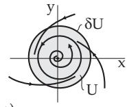
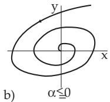
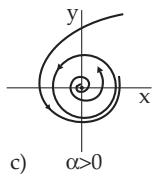

#### 17.1.4 Structural Stability (Robustness)

##### 17.1.4.1 Structurally Stable Differential Equations

1. Definition

The diferential equation (17.1), i.e., the vector field $f \colon M \to \mathbb { R } ^ { n }$ , is called structurally stable or robust, if small perturbations of $f$ result in topologically equivalent diferential equations. The precise definition of robustness requires the notion of distance between two vector fields defined on $M$ . The further investigations are restricted to smooth vector fields on M, which have a common open connected absorbing set $U \subset M$ . Let the boundary ∂U of U be a smooth (n 1)-dimensional hypersurface and suppose that it can be represented as $\mathcal { \bar { O } } U = \{ x \in \mathbb { R } ^ { n } \colon h ( x ) = 0 \}$ , where $h \colon  { \mathbb { R } } ^ { n } \to  { \mathbb { R } }$ is a $C ^ { 1 }$ -function with grad $h ( x ) \neq 0$ in a neighborhood of ∂U. Let $\mathrm { X } ^ { 1 } ( U )$ be the metric space of all smooth vector fields on M with the $\dot { C } ^ { 1 }$ metric

$$
\rho ( f , g ) = \operatorname* { s u p } _ { x \in U } \| f ( x ) - g ( x ) \| + \operatorname* { s u p } _ { x \in U } \| D f ( x ) - D g ( x ) \| .\tag{17.25}
$$

(In the first term of the right-hand side $\| \cdot \|$ means the Euclidean vector norm, in the second one the operator norm.) The smooth vector fields f intersecting transversally the boundary $\partial U$ in the direction $\bar { U } , \mathrm { i . e . }$ , for which grad $h ( x ) ^ { T } f ( x ) \neq 0 , \ ( \bar { x } \in \partial U )$ and $\varphi ^ { t } ( x ) \in U \left( { \bar { x } } \in \partial U , t > 0 \right)$ hold, form the set $\mathrm { X } _ { + } ^ { 1 } ( U ) \subset \mathrm { X } ^ { 1 } ( U )$ . The vector field $f \in \mathbf { X } _ { + } ^ { 1 } ( U )$ is called structurally stable if there is a $\delta > 0$ such that every other vector field $g \in \mathrm { X } _ { + } ^ { 1 } ( U )$ with $\rho ( f , g ) < \delta$ is topologically equivalent to $f .$

Consider the planar diferential equation $g \left( \cdot , \alpha \right)$

$$
\dot { x } = - y + x ( \alpha - x ^ { 2 } - y ^ { 2 } ) , \quad \dot { y } = x + y ( \alpha - x ^ { 2 } - y ^ { 2 } )\tag{17.26}
$$

with parameter α, where $| \alpha | < 1$ . The diferential equation g belongs, e.g., to $\mathrm { X } _ { + } ^ { 1 } ( U )$ with $U = \{ ( x , y )$ $x ^ { 2 } + y ^ { 2 } < 2 \}$ (Fig. 17.12a). Obviously, $\rho ( g \left( \cdot , 0 \right) , g \left( \cdot , \alpha \right) ) = \left| \alpha \right| ( \sqrt { 2 } + 1 )$ . The vector field $g \left( \cdot , 0 \right)$ is structurally unstable; there exist vector fields arbitrarily close to $g \left( \cdot , 0 \right)$ , which are not topologically equivalent to $g \left( \cdot , 0 \right)$ (Fig. 17.12b,c). This is clear, if the polar coordinate representation $\dot { \boldsymbol { r } } = - \boldsymbol { r } ^ { 3 } +$ αr, ${ \dot { \vartheta } } = 1$ of (17.26) is considered. For $\alpha > 0$ there always exists a stable limit cycle $r = \sqrt { \alpha }$

  
Figure 17.12

2. Structurally Stable Systems in the Plane

$$
f \in \mathbf { X } _ { + } ^ { 1 } ( U )
$$

a) (17.1) has only a finite number of equilibrium points and periodic orbits.

b) All ω-limit sets $\omega ( x )$ with $x \in { \overline { { U } } }$ of (17.1) consist of equilibrium points and periodic orbits only.

Theorem of Andronov and Pontryagin: The planar diferential equation (17.1) with $f \in \mathbf { X } _ { + } ^ { 1 } ( U )$ is structurally stable if and only if:

a) All equilibrium points and periodic orbits in $\overline { { U } }$ are hyperbolic.

b) There are no separatrices, i.e., no heteroclinic or homoclinic orbits, coming from a saddle and tending to a saddle point.

##### 17.1.4.2 Structurally Stable Time Discrete Systems

In the case of time discrete systems (17.3), i.e., of mappings $\varphi : M \to M$ , let $U \subset M \subset \mathbb { R } ^ { n }$ be a bounded, open, and connected set with a smooth boundary. Let $\operatorname { D i f f } ^ { 1 } ( U )$ be the metric space of all difeomorphisms on M with the corresponding U defined $\check { C } ^ { 1 }$ -metric. Suppose the set Dif $^ { 1 } _ { + } ( U ) \subset$ Dif(U) consists of the difeomorphisms $\varphi ,$ for which $\varphi ( { \overline { { U } } } ) \subset U$ is valid. The mapping $\varphi \in \mathsf { \Gamma } \operatorname { D i f f } _ { + } ^ { 1 } ( U )$ (and the corresponding dynamical system (17.3)) is called structurally stable if there exists a $\delta > 0$ such that every other mapping $\psi \in \operatorname { D i f f } _ { + } ^ { 1 } ( U )$ with $\rho ( \varphi , \psi ) < \delta$ is topologically conjugate to $\varphi .$

##### 17.1.4.3 Generic Properties

1. Definition

A property of elements of a metric space $( M , \rho )$ is called generic (or typical) if the set of the elements $B$ of M with this property form a set of the second Baire category, i.e., it can be represented as $B =$ $\bigcap _ { m = 1 , 2 \ldots } B _ { m }$ , where every set $B _ { m }$ is open and dense in M.

A: The sets IR and $\mathbb { I } \subset \mathbb { R }$ (irrational numbers) are sets of second Baire category, but $\mathbb { Q } \subset \mathbb { R }$ is not.

B: Density alone as a property of “typical” is not enough: $\mathbb { Q } \subset \mathbb { R }$ and $\mathbb { I } \subset \mathbb { R }$ are both dense, but they cannot be typical at the same time.

C: There is no connection between the Lebesgue measure λ (see 12.9.1, 2., p. 694) of a set from IR and the Baire category of this set. The set $B = \bigcap _ { k = 1 , 2 , \ldots } B _ { k }$ with $B _ { k } = \bigcup _ { n \geq 0 } \left( a _ { n } - { \frac { 1 } { k 2 ^ { n } } } , a _ { n } + { \frac { 1 } { k 2 ^ { n } } } \right)$ , where $\mathbb { Q } = \{ a _ { n } \} _ { n = 0 } ^ { \infty }$ represents the rational numbers, is a set of second Baire category (see [17.5], [17.10]).

On the other hand, since $B _ { k } \supset B _ { k + 1 }$ and $\lambda ( B _ { k } ) < + \infty$ also $\lambda ( B ) = \operatorname* { l i m } _ { k \to \infty } \lambda ( B _ { k } ) \leq \operatorname* { l i m } _ { k \to \infty } \frac { 2 } { k } \frac { 1 } { 1 - 1 / 2 } = 0$ holds.

2. Generic Properties of Planar Systems, Hamiltonian Systems

For planar diferential equations the set of all structurally stable systems from $\mathrm { X } _ { + } ^ { 1 } ( U )$ is open and dense in $\mathrm { X } _ { + } ^ { 1 } ( U )$ . Hence, structurally stable systems are typical for the plane. It is also typical that every orbit of a planar system from $X _ { + } ^ { 1 } ( U )$ for increasing time tends to one of a finite number of equilibrium points and periodic orbits. Quasiperiodic orbits are not typical. Under certain assumptions, in the case of Hamiltonian systems, the quasiperiodic orbits of diferential equation are preserved in the case of small perturbations. Hence, Hamiltonian systems are not typical systems.

Given in $\mathbb { R } ^ { 4 }$ a Hamiltonian system in action-angle variables $\dot { j } _ { 1 } = 0 , \dot { j } _ { 2 } = 0 , \dot { \theta } _ { 1 } = \frac { \partial H _ { 0 } } { \partial j _ { 1 } } , \dot { \theta } _ { 2 } = \frac { \partial H _ { 0 } } { \partial j _ { 2 } }$

where the Hamiltonian $H _ { 0 } ( j _ { 1 } , j _ { 2 } )$ is analytical. Obviously, this system has the solutions $j _ { 1 } = c _ { 1 } , j _ { 2 } =$ $c _ { 2 } , \theta _ { 1 } = \omega _ { 1 } t + c _ { 3 } , \theta _ { 2 } = \omega _ { 2 } t + c _ { 4 }$ with constants $c _ { 1 } , \ldots , c _ { 4 } .$ , where $\omega _ { 1 }$ and $\omega _ { 2 }$ can depend on $c _ { 1 }$ and $c _ { 2 }$ The relation $( j _ { 1 } , j _ { 2 } ) = ( c _ { 1 } , c _ { 2 } )$ defines an invariant torus $T ^ { 2 }$ . Consider now the perturbed Hamiltonian $H _ { 0 } ( j _ { 1 } , j _ { 2 } ) + \varepsilon H _ { 1 } ( j _ { 1 } , j _ { 2 } , \theta _ { 1 } , \theta _ { 2 } )$

instead of $H _ { 0 }$ , where $H _ { 1 }$ is analytical and $\varepsilon > 0$ is a small parameter.

The Kolmogorov-Arnold-Moser theorem (KAMtheorem) says in this case that if $H _ { 0 }$ is non-degenerate, i.e., det $\left( \frac { \partial ^ { 2 } H _ { 0 } } { \partial j _ { k } ^ { 2 } } \right) \neq 0$ , then in the perturbed Hamiltonian system most of the invariant non-resonant tori will not vanish for suficiently small $\varepsilon > 0$ but will be only slightly deformed. “Most of the $\mathrm { \ t o r i ^ { \prime } }$ means that the Lebesgue measure of the complement set with respect to the tori tends to zero if ε tends to 0. A torus, defined as above and characterized by $\omega _ { 1 }$ and $\omega _ { 2 }$ , is called non-resonant if there exists a

constant $c > 0$ such that the inequality $\left| { \frac { \omega _ { 1 } } { \omega _ { 2 } } } - { \frac { p } { q } } \right| \geq { \frac { c } { q ^ { 2 . 5 } } }$ holds for all positive integers p and $q .$

3. Non-Wandering Points, Morse-Smale Systems

Let $\{ \varphi ^ { t } \} _ { t \in \mathrm { R } }$ be a dynamical system on the n-dimensional compact orientable manifold M. The point $p \in M$ is called non-wandering with respect to $\{ \varphi ^ { t } \}$ if

$$
\forall T > 0 \quad \exists t , \quad | t | \geq T \colon \quad \varphi ^ { t } ( U _ { p } ) \cap U _ { p } \neq \emptyset\tag{17.27}
$$

holds for an arbitrary neighborhood $U _ { p } \subset M$ of $p .$

Steady states and periodic orbits consist only of non-wandering points.

The set $\Omega ( \varphi ^ { t } )$ of all non-wandering points of the dynamical systems generated by (17.1) is closed, invariant under $\{ \varphi ^ { t } \}$ and contains all periodic orbits and all ω -limit sets of points from M.

$$
\{ \varphi ^ { t } \} _ { t \in \mathrm { R } }
$$

$$
\bar { M }
$$

1. The system has finitely many equilibrium points and periodic orbits and they are all hyperbolic.

2. All stable and unstable manifolds of equilibrium points and periodic orbits are transversal to each other.

3. The set of all non-wandering points consists only of equilibrium points and periodic orbits.

Theorem of Palis and Smale: Morse-Smale systems are structurally stable.

The converse statement of the theorem of Palis and Smale is not true: In the case of $n \geq 3$ , there exist structurally stable systems with infinitely many periodic orbits.

For $n \geq 3$ , structurally stable systems are not typical.
