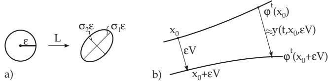

#### 17.2.3 Lyapunov Exponents

1. Singular Values of a Matrix

Let L be an arbitrary matrix of type $( n , n )$ . The singular values $\sigma _ { 1 } \geq \sigma _ { 2 } \geq \cdot \cdot \cdot \geq \sigma _ { n }$ of L are the non-negative roots of the eigenvalues $\alpha _ { 1 } \geq \cdot \cdot \cdot \geq \alpha _ { n } \geq 0$ of the positive semidefinite matrix $L ^ { \mathrm { T } } L$ . The eigenvalues $\alpha _ { i }$ are enumerated according to their multiplicity.

The singular values can be interpreted geometrically. If $K _ { \varepsilon }$ is a sphere with center at 0 and with radius $\varepsilon > 0$ , then the image $L ( K _ { \varepsilon } )$ is an ellipsoid with semi-axis lengths $\sigma _ { i } \varepsilon \ ( i = 1 , 2 , \ldots , n )$ (Fig. 17.13a).

  
Figure 17.13

2. Definition of Lyapunov Exponents

Let $\{ \varphi ^ { t } \} _ { t \in T }$ be a smooth dynamical system on $M \subset \mathbb { R } ^ { n }$ , which has an attractor Λ with an invariant ergodic probability measure μ concentrated on Λ. Let $\sigma _ { 1 } ( t , x ) \geq \cdot \cdot \cdot \geq \sigma _ { n } ( t , x )$ be the singular values of the Jacobian matrix $D \varphi ^ { t } ( x )$ of $\varphi ^ { t }$ at the point x for arbitrary $t \geq 0$ and $x \in \Lambda$ . Then there exists a sequence of numbers $\lambda _ { 1 } \geq \cdots \geq \lambda _ { n }$ , the Lyapunov exponents, such that $\frac { 1 } { t } \ln \ \sigma _ { i } ( t , x ) \ \to \ \lambda _ { i }$ for $t \to + \infty \mu \mathrm { - a . e }$ . in the sense of $L ^ { 1 }$ . According to the theorem of Oseledec, there exists $\mu { - } \mathrm { a . e }$ . a sequence of subspaces of $\mathbb { R } ^ { n }$

$$
\mathbb { R } ^ { n } = E _ { s _ { 1 } } ^ { x } \supset E _ { s _ { 2 } } ^ { x } \supset \dots \supset E _ { s _ { r + 1 } } ^ { x } = \{ 0 \} ,\tag{17.38}
$$

such that for $\mu \mathrm { - a . e . ~ } x$ the quantity ${ \frac { 1 } { t } } \ln \| D \varphi ^ { t } ( x ) v \|$ tends to an element $\lambda _ { s _ { j } } \in \{ \lambda _ { 1 } , . . . , \lambda _ { n } \}$ uniformly with respect to $v \in E _ { s _ { j } } ^ { x } \setminus E _ { s _ { j + 1 } } ^ { x }$

3. Calculation of Lyapunov Exponents

Suppose $\sigma _ { i } ( t , x )$ are the semi-axis lengths of the ellipsoid got by deformation of the unit sphere with center at x by $D \varphi ^ { t } ( x )$ . The formula $\chi _ { i } ( x ) = \operatorname* { l i m } _ { t \to \infty } \operatorname* { s u p } _ { t } \frac { 1 } { t } \ln \sigma _ { i } ( t , x )$ can be used to calculate the Lyapunov exponents, if additionally a reorthonormalization method, such as Householder, is used. The function $y ( t , x , v ) = D \varphi ^ { t } ( x ) v$ is the solution of the variational equation with v at $t = 0$ associated to the semiorbit $\gamma ^ { + } ( x )$ of the flow $\{ \varphi ^ { t } \}$ . Actually, $\{ \varphi ^ { t } \} _ { t \in \mathrm { R } }$ is the flow of (17.1), so the variational equation is $\dot { y } = D f ( \varphi ^ { t } ( x ) ) \dot { y }$ . The solution of this equation with initial v at time $t = 0$ can be represented as $y ( t , x , v ) = \varPhi _ { x } ( t ) v ,$ , where $\varPhi _ { x } ( t )$ is the normed fundamental matrix of the variational equation at $t = 0$ , which is a solution of the matrix diferential equation $\dot { Z } = D f ( \varphi ^ { t } ( x ) ) Z$ with initial $Z ( 0 ) = E _ { n }$ according to the theorem about diferentiability with respect to the initial state (see 17.1.1.1, 2., p. 857).

The number $\chi ( x , v ) = \operatorname* { l i m } _ { t \to \infty } \operatorname* { s u p } _ { t } { \frac { 1 } { t } } \ln \| D \varphi ^ { t } ( x ) v \|$ describes the behavior of the orbit $\gamma ( x + \varepsilon v ) , 0 < \varepsilon \ll 1$ with initial $x + \varepsilon v$ with respect to the initial orbit $\gamma ( x )$ in the direction v. $\operatorname { I f } \chi ( x , v ) < 0$ , then the orbits move nearer to x for increasing t in the direction v. If, on the contrary, $\chi ( x , v ) > 0$ , then the orbits move away (Fig. 17.13b).

Let Λ be the attractor of the dynamical system $\{ \varphi ^ { t } \} _ { t \in T }$ and $\mu$ the invariant ergodic measure concentrated on it. Then, the sum of all Lyapunov exponents $\mu { \mathrm { - a . e . ~ } } x \in \Lambda$ is

$$
\sum _ { i = 1 } ^ { n } \lambda _ { i } = \operatorname* { l i m } _ { t \to \infty } \frac { 1 } { t } \intop _ { 0 } ^ { t } \mathrm { d i v } f ( \varphi ^ { s } ( x ) ) d s\tag{17.39a}
$$

in the case of flows (17.1) and for a discrete system (17.3), it is

$$
\sum _ { i = 1 } ^ { n } \lambda _ { i } = \operatorname* { l i m } _ { k \to \infty } \frac { 1 } { k } \sum _ { i = 0 } ^ { k - 1 } \ln | \operatorname* { d e t } D \varphi ( \varphi ^ { i } ( x ) ) | .\tag{17.39b}
$$

Hence, in dissipative systems $\sum _ { i = 1 } ^ { n } \lambda _ { i } < 0$ holds. Considering that one of the Lyapunov exponents is equal to zero if the attractor is not an equilibrium point, the calculation of Lyapunov exponents can be simplified (see [17.9]).

A: Let be $x _ { 0 }$ an equilibrium point of the flow of (17.1) and let $\alpha _ { i }$ be the eigenvalues of the Jacobian matrix at $x _ { 0 }$ . With the measure concentrated on $x _ { 0 }$ , the following holds for the Lyapunov exponents: $\lambda _ { i } = \operatorname { R e } \alpha _ { i } \ ( i = 1 , 2 , \ldots , n )$

B: Let $\gamma ( x _ { 0 } ) = \{ \varphi ^ { t } ( x _ { 0 } ) , \ t \in [ 0 , T ] \}$ be a $T \cdot$ periodic orbit of (17.1) and let $\rho _ { i }$ be the multipliers of $\gamma ( \boldsymbol { x } _ { 0 } )$ . With the measure concentrated on $\gamma ( \boldsymbol { x } _ { 0 } )$ there is $\lambda _ { i } = \frac { 1 } { T } \ln | \rho _ { i } | \mathrm { f o r } i = 1 , 2 . . . , n .$

4. Metric Entropy and Lyapunov Exponents

If $\{ \varphi ^ { t } \} _ { t \in T }$ is a dynamical system on $M \subset \mathbb { R } ^ { n }$ with attractor Λ and an ergodic probability measure $\mu$ concentrated on Λ, then the inequality $h _ { \mu } \leq \sum _ { \lambda _ { i } > 0 } \lambda _ { i }$ holds for the metric entropy $h _ { \mu } ,$ , where in the sum

the Lyapunov exponents are repeated according to their multiplicity. The equality

$$
h _ { \mu } = \sum _ { \lambda _ { i } > 0 } \lambda _ { i } \mathrm { ( P e s i n " s f o r m u l a ) }\tag{17.40}
$$

is not valid in general (see also $1 7 . 2 . 4 . 4 ,  { \mathbf { B } } ,  { \mathrm { p } }$ . 888). If the measure $\mu$ is absolutely continuous with respect to the Lebesgue measure and $\varphi \colon M \to M$ is a $\mathrm { \dot { C } ^ { 2 } }$ -difeomorphism, then Pesin’s formula is valid.
