#### 17.2.4 Dimensions

##### 17.2.4.1 Metric Dimensions

1. Fractals

Attractors or other invariant sets of dynamical systems can be geometrically more complicated than point, line or torus. Fractals, independently of dynamics, are sets which distinguish themselves by one or several characteristics such as fraying, porosity, complexity, and self-similarity. Since the usual notion of dimension used for smooth surfaces and curves cannot be applied to fractals, a generalized definition of the dimension is necessary. For more details see [17.2], [17.12].

The interval $G _ { 0 } = [ 0 , 1 ]$ is divided into three subintervals with the same length and the middle open third is removed, so the set $G _ { 1 } = [ 0 , \frac { 1 } { 3 } ] \cup [ \frac { 2 } { 3 } , 1 ]$ is obtained. Then from both subintervals of $G _ { 1 }$ the open middle third ones are removed, which yields the set $\begin{array} { r } { G _ { 2 } = \left[ 0 , \frac { 1 } { 9 } \right] \cup \left[ \frac { 2 } { 9 } , \frac { 1 } { 3 } \right] \cup \left[ \frac { 2 } { 3 } , \frac { 7 } { 9 } \right] \cup \left[ \frac { 8 } { 9 } , 1 \right] } \end{array}$ . Continuing this procedure, $G _ { k }$ is obtained from $G _ { k - 1 }$ by removing the open middle thirds from the subintervals. $\mathrm { S o }$ , a sequence of sets $G _ { 0 } \supset G _ { 1 } \supset \cdots \supset G _ { n } \supset \cdots$ is obtained, where every $G _ { n }$ consists of $2 ^ { n }$ intervals of length $\frac { 1 } { 3 ^ { n } }$

The Cantor set C is defined as the set of all points belonging to all $G _ { n } , { \mathrm { i . e . , } } C = \bigcap _ { n = 1 } ^ { \infty } G _ { n }$ . The set $C$ is compact, uncountable, its Lebesgue measure is zero and it is perfect, $\mathrm { i . e . , } C$ is closed and every point is an accumulation point. The Cantor set can be an example of a fractal.

2. Hausdorf Dimension

The motivation for this dimension comes from volume calculation based on Lebesgue measure. If supposing that a bounded set $A \subset \mathbb { R } ^ { 3 }$ is covered by a finite number of spheres $B _ { r _ { i } }$ with radius $r _ { i } \ \leq \ \varepsilon$ so that $\cup _ { i } B _ { r _ { i } } \supset A$ holds, then for A a “rough volume” is $\sum _ { i } { \frac { 4 } { 3 } } \pi r _ { i } ^ { 3 }$ . Now, one defines the quantity $\mu _ { \varepsilon } ( A ) = \operatorname* { i n f } \{ \sum _ { i } { \frac { 4 } { 3 } } \pi r _ { i } ^ { 3 } \}$ over all finite coverings of A by spheres with radius $r _ { i } \leq \varepsilon$ . If ε tends to zero, then one gets the Lebesgue outer measure $\overline { { \lambda } } ( A )$ of A. If A is measurable, the outer measure is equal to the volume vol(A). Suppose M is the Euclidean space $\mathbb { R } ^ { n }$ or, more generally, a separable metric space with metric $\rho$ and let ${ \bar { A } } \subset M$ be a subset of it. For arbitrary parameters $d \geq 0$ and $\varepsilon > 0$ , the quantity

$$
\mu _ { d , \varepsilon } ( A ) = \operatorname* { i n f } \left\{ \sum _ { i } ( \mathrm { d i a m } B _ { i } ) ^ { d } : A \subset \bigcup B _ { i } , \mathrm { d i a m } B _ { i } \leq \varepsilon \right\}\tag{17.41a}
$$

is determined, where $B _ { i } \subset M$ are arbitrary subsets with diameter diam $B _ { i } = \operatorname* { s u p } _ { x , y \in B _ { i } } \rho ( x , y )$

The Hausdorfouter measure ofdimension d ofA is defined by

$$
\mu _ { d } ( A ) = \operatorname* { l i m } _ { \varepsilon \to 0 } \mu _ { d , \varepsilon } ( A ) = \operatorname* { s u p } _ { \varepsilon > 0 } \mu _ { d , \varepsilon } ( A )\tag{17.41b}
$$

and it can be either finite or infinite. The Hausdorfdimension $d _ { H } ( A )$ of the set A is then the (unique) critical value of the Hausdorf measure:

$$
d _ { H } ( A ) = { \left\{ \begin{array} { l l } { + \infty , { \mathrm { ~ i f ~ } } \mu _ { d } ( A ) \neq 0 { \mathrm { ~ f o r ~ a l l ~ } } d \geq 0 , } \\ { { \mathrm { ~ i n f ~ } } \{ d \geq 0 \colon \mu _ { d } ( A ) = 0 \} . } \end{array} \right. }\tag{17.41c}
$$

Remark: The quantities $\mu _ { d , \varepsilon } ( A )$ can be defined with coverings of spheres with radius $r _ { i } \le \varepsilon \mathrm { o r }$ , in the case of $\mathbb { R } ^ { n }$ , of cubes with side length $\leq \varepsilon$

Important Properties of the Hausdorf Dimension:

(HD1) $d _ { H } ( \varnothing ) = 0 .$

(HD2) If $A \subset \mathbb { R } ^ { n }$ , then $0 \leq d _ { H } ( A ) \leq n$

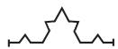

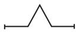

(HD3) From $A \subset B$ , it follows that ${ d _ { H } ( A ) \leq d _ { H } ( B ) }$

(HD4) $\operatorname { I f } A = \bigcup _ { i = 1 } ^ { \infty } A _ { i }$ , then $d _ { H } ( A ) = \operatorname* { s u p } _ { i } d _ { H } ( A _ { i } )$

(HD5) If A is finite or countable, then $d _ { H } ( A ) = 0$

(HD6) $\operatorname { I f } \varphi \colon M \to M$ is Lipschitz continuous, i.e., there exists a constant $L > 0$ such that $\rho ( \varphi ( x ) , \varphi ( y ) )$ $\dot { \le } L \rho ( \dot { x } , y ) \forall x , y \in M$ , then $d _ { H } ( \varphi ( A ) ) \leq d _ { H } ( \dot { A } )$ . If the inverse mapping $\varphi ^ { - 1 }$ exists as well, and it is also Lipschitz continuous, then $d _ { H } ( A ) = d _ { H } ( \varphi ( A ) )$

For the set Q of all rational numbers $d _ { H } ( \mathbb { Q } ) = 0$ because of (HD5). The dimension of the Cantor set C is $d _ { H } ( C ) = { \frac { \ln 2 } { \ln 3 } } \approx 0 . 6 3 0 9 . . .$

3. Box-Counting Dimension or Capacity

Let A be a compact set of the metric space $( M , \rho )$ and let $N _ { \varepsilon } ( A )$ be the minimal number of sets of diameter $\leq \varepsilon$ , necessary to cover A. The quantity

$$
\overline { { d } } _ { B } ( A ) = \operatorname* { l i m } _ { \varepsilon \to 0 } \operatorname* { l n } _ { \mathbf { \varepsilon } } N _ { \varepsilon } ( A )\tag{17.42a}
$$

is called the upper box-counting dimension or upper capacity, the quantity

$$
\underline { { d } } _ { B } ( A ) = \operatorname* { l i m } _ { \varepsilon \to 0 } \operatorname* { i n f } _ { \mathbf { \varepsilon } \to \mathbf { \varepsilon } } \frac { \ln N _ { \varepsilon } ( A ) } { \ln \frac { 1 } { \varepsilon } }\tag{17.42b}
$$

is called the lowerbox-counting dimension or lowercapacity $( \mathrm { t h e n } d _ { C } )$ of A. If $\overline { { d } } _ { B } ( A ) = \underline { { d } } _ { B } ( A ) : = d _ { B } ( A )$ holds, then $d _ { B } ( A )$ is called the box-counting dimension of A. In $\mathbb { R } ^ { n }$ the box-counting dimension can be considered also for bounded sets which are not closed.

For a bounded set $A \subset \mathbb { R } ^ { n }$ , the number $N _ { \varepsilon } ( A )$ in the above definition can also be defined in the following way: Let $\mathbb { R } ^ { n }$ be covered by a grid from n-dimensional cubes with side length ε. Then, $N _ { \varepsilon } ( A )$ can be the number of cubes of the grid having a non-empty intersecting A.

Important Properties of the Box-Counting Dimension:

(BD1) $d _ { H } ( A ) \leq d _ { B } ( A )$ always holds.

(BD2) For m-dimensional surfaces $F \subset \mathbb { R } ^ { n }$ holds $d _ { H } ( F ) = d _ { B } ( F ) = m$

(BD3) $d _ { B } ( A ) = d _ { B } ( \overline { { A } } )$ holds for the closure $\overline { { A } }$ of A, while often $d _ { H } ( A ) < d _ { H } ( \overline { { A } } )$ is valid.

(BD4) If $A = \bigcup _ { n } A _ { n }$ , then, in general, the formula $d _ { B } ( A ) = \operatorname* { s u p } _ { n } d _ { B } ( A _ { n } )$ does not hold for the boxcounting dimension.

Suppose $A = \{ 0 , 1 , \frac { 1 } { 2 } , \frac { 1 } { 3 } , \ldots \}$ . Then $d _ { H } ( A ) = 0$ and $d _ { B } ( A ) = \frac { 1 } { 2 }$

If A is the set of all rational points in [0, 1], then because of BD2 and BD3 $d _ { B } ( A ) = 1$ holds. On the other hand $d _ { H } ( A ) = 0$

4. Self-Similarity

Several geometric figures, which are called self-similar, can be derived by the following procedure: An initial figure is replaced by a new one which is composed of p copies of the original, any of them scaled linearly by a factor $q > 1$ . All figures that are k times scalings of the initial figure in the k-th step are handled as the in the first step.

A: Cantor set: $p = 2 , q = 3$

B: Koch curve: $p = 4 , q = 3$ . The first three steps are shown in Fig. 17.14.

Figure 17.14

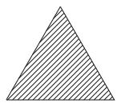

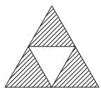

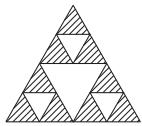  
C: Sierpinski gasket: $p = 3 , q = 2$ . The first three steps are shown in $\mathbf { F i g } .$ . 17.15. (The white triangles are always removed.)

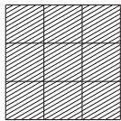

Figure 17.15  
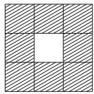  
Figure 17.16

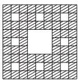

D: Sierpinski carpet: $p = 8 , q = 3$ . The first three steps are shown in Fig. 17.16. (The white squares are always removed.)

For the sets in the examples A–D:

$$
d _ { B } = d _ { H } = { \frac { \ln p } { \ln q } } .
$$

##### 17.2.4.2 Dimensions Defined by Invariant Measures

1. Dimension of a Measure

Let $\mu$ be a probability measure in $( M , \rho )$ , concentrated on Λ. If $x \in \Lambda$ is an arbitrary point and $B _ { \delta } ( x )$ is a sphere with radius $\delta$ and center at x, then

$$
\overline { { { d } } } _ { \mu } ( x ) = \operatorname * { l i m } _ { \delta  0 } \ \frac { \ln \mu ( B _ { \delta } ( x ) ) } { \ln \delta }\tag{17.43a}
$$

denotes the upper and

$$
\underline { { { d } } } _ { \mu } ( x ) = \operatorname* { l i m } _ { \delta \to 0 } \operatorname* { i n f } _ { } \frac { \ln \mu ( B _ { \delta } ( x ) ) } { \ln \delta }\tag{17.43b}
$$

denotes the lower point-wise dimension of $\mu$ in x. If $\underline { { { d } } } _ { \mu } ( x ) = \overline { { { d } } } _ { \mu } ( x ) : = d _ { \mu } ( x )$ , then $d _ { \mu } ( x )$ is called the dimension ofthe measure $\mu$ in x.

Young Theorem 1: If the relation $d _ { \mu } ( x ) = \alpha$ holds for $\mu { \mathrm { - a . e . } } ^ { * } , x \in \Lambda$ , then

$$
\alpha = d _ { H } ( \mu ) : = \operatorname* { i n f } _ { X \subset \Lambda , \mu ( X ) = 1 } \{ d _ { H } ( X ) \} .\tag{17.44}
$$

The quantity $d _ { H } ( \mu )$ is called the Hausdorfdimension ofthe measure $\mu$

Suppose $M = \mathbb { R } ^ { n }$ and let $\Lambda \subset \mathbb { R } ^ { n }$ be a compact sphere with Lebesgue measure $\lambda ( \Lambda ) > 0$ . The restriction of $\mu$ to Λ is $\mu _ { \Lambda } = \frac { \lambda } { \lambda ( \Lambda ) }$ . Then

$$
\mu ( B _ { \delta } ( x ) ) \sim \delta ^ { n } \mathrm { a n d } d _ { H } ( \mu ) = n .
$$

2. Information Dimension

Suppose, the attractor Λ of $\{ \varphi ^ { t } \} _ { t \in T }$ is covered by cubes $Q _ { 1 } ( \varepsilon ) , \dots , Q _ { n ( \varepsilon ) } ( \varepsilon )$ of side length ε as in 17.2.2.2, p. 879. Let $\mu$ be an invariant probability measure on Λ.

The entropy of the covering $\bar { Q _ { 1 } } ( \varepsilon ) , \dots , \bar { Q _ { n ( \varepsilon ) } } ( \varepsilon )$ is

$$
H ( \varepsilon ) = - \sum _ { i = 1 } ^ { n ( \varepsilon ) } p _ { i } ( \varepsilon ) \ln p _ { i } ( \varepsilon ) , \quad { \mathrm { w i t h } } \quad p _ { i } ( \varepsilon ) = \mu ( Q _ { i } ( \varepsilon ) ) \quad ( i = 1 , \ldots , n ( \varepsilon ) ) .\tag{17.45}
$$

If the limit $d _ { I } ( \mu ) = - \operatorname * { l i m } _ { \varepsilon  0 } \frac { H ( \varepsilon ) } { \ln \varepsilon }$ exists, then this quantity has the property of a dimension and is called the information dimension.

Young Theorem 2: If the relation $d _ { \mu } ( x ) =$ α holds for $\mu { \mathrm { - a . e . ~ } } x \in \Lambda$ , then

$$
\alpha = d _ { H } ( \mu ) = d _ { I } ( \mu ) .\tag{17.46}
$$

A: Let the measure $\mu$ be concentrated at the equilibrium point $x _ { 0 }$ of $\{ \varphi ^ { t } \}$ . Since $H _ { \varepsilon } ( \mu ) = - 1 \ln 1 =$ 0 always holds for $\varepsilon > 0$ , so $d _ { I } ( \mu ) = 0$

B: Suppose the measure $\mu$ is concentrated on the limit cycle of $\{ \varphi ^ { t } \}$ . For $\varepsilon > 0 , H _ { \varepsilon } ( \mu ) = - \ln \varepsilon$ holds and so $d _ { I } ( \mu ) = 1$

3. Correlation Dimension

Let $\{ y _ { i } \} _ { i = 1 } ^ { \infty }$ be a typical sequence of points of the attractor $\Lambda \subset \mathbb { R } ^ { n }$ of $\{ \varphi ^ { t } \} _ { t \in T } , \mu$ an invariant probability measure on $\Lambda$ and let m IN be arbitrary. For the vectors $x _ { i } : = ( y _ { i } , \ldots , y _ { i + m } )$ let the distance be defined as dist $( x _ { i } , x _ { j } ) : = \operatorname* { m a x } _ { 0 \leq s \leq m } \| y _ { i + s } - y _ { j + s } \|$ , where $\| \cdot \|$ is the Euclidean vector norm. If Θ denotes

the Heaviside function $\begin{array} { r } { \theta ( x ) = \left\{ \begin{array} { l l } { 0 , x \le 0 , } \\ { 1 , x > 0 , } \end{array} \right. } \end{array}$ then the expression

$$
\begin{array} { c } { { C ^ { m } ( \varepsilon ) = \displaystyle \operatorname* { l i m } _ { N  + \infty } \frac { 1 } { N ^ { 2 } } \mathrm { c a r d } \{ ( x _ { i } , x _ { j } ) \colon \mathrm { d i s t } ( x _ { i } , x _ { j } ) < \varepsilon \} } } \\ { { = \displaystyle \operatorname* { l i m } _ { N  \infty } \frac { 1 } { N ^ { 2 } } \sum _ { i , j = 1 } ^ { N } \theta ( \varepsilon - \mathrm { d i s t } ( x _ { i } , x _ { j } ) ) } } \end{array}\tag{17.47a}
$$

is called the correlation integral. The quantity

$$
d _ { K } = \operatorname* { l i m } _ { \varepsilon  0 } \frac { \ln C ^ { m } ( \varepsilon ) } { \ln \varepsilon }\tag{17.47b}
$$

(if it exists) is the correlation dimension.

4. Generalized Dimension

Let the attractor Λ of $\{ \varphi ^ { t } \} _ { t \in T }$ on M with invariant probability measure $\mu$ be covered by cubes with side length ε as in 17.2.2.2, p. 879. For an arbitrary parameter $\bar { q } \in \mathbb { R } , q \neq 1$ , the sum

$$
H _ { q } ( \varepsilon ) = { \frac { 1 } { 1 - q } } \ln \sum _ { i = 1 } ^ { n ( \varepsilon ) } p _ { i } ( \varepsilon ) ^ { q } { \mathrm { ~ w h e r e ~ } } p _ { i } ( \varepsilon ) = \mu ( Q _ { i } ( \varepsilon ) )\tag{17.48a}
$$

is called the generalized entropy ofq-th order with respect to the covering $Q _ { 1 } ( \varepsilon ) , \dots , Q _ { n ( \varepsilon ) } ( \varepsilon )$ The R´enyi dimension ofq-th order is

$$
d _ { q } = - \operatorname * { l i m } _ { \varepsilon  0 } \frac { H _ { q } ( \varepsilon ) } { \ln \varepsilon } ,\tag{17.48b}
$$

if this limit exists.

Special Cases of the R´enyi Dimension:

$$
{ \bf a } ) \ q = 0 ; \quad d _ { 0 } = d _ { C } ( \mathrm { s u p p } \mu ) .\tag{17.49a}
$$

$$
{ \bf b } ) ~ q = 1 \colon ~ d _ { 1 } \colon = \operatorname* { l i m } _ { q \to 1 } d _ { q } = d _ { I } ( \mu ) .\tag{17.49b}
$$

$$
{ \bf c } ) \ q = 2 \colon d _ { 2 } = d _ { K } .\tag{17.49c}
$$

5. Lyapunov Dimension

Let $\{ \varphi ^ { t } \} _ { t \in T }$ be a smooth dynamical system on $M \subset \mathbb { R } ^ { n }$ with attractor Λ (or invariant set) and with the invariant ergodic probability measure $\mu$ concentrated on Λ. If $\lambda _ { 1 } \geq \lambda _ { 2 } \geq \cdots \geq \lambda _ { n }$ are the Lyapunov exponents with respect to $\mu$ and if k is the greatest index for which $\sum _ { i = 1 } ^ { k } \lambda _ { i } \geq 0$ and $\sum _ { i = 1 } ^ { k + 1 } \lambda _ { i } < 0$ hold, then

the

$$
\begin{array} { r } { \mathrm { { \small ~ \alpha ~ } } \mathrm { { \hat { a } } } \mathrm { { l u e } } \qquad \displaystyle \sum _ { d _ { L } ( \mu ) = k + \frac { 1 = 1 } { | \lambda _ { k + 1 } | } } ^ { k } \lambda _ { i } } \end{array}\tag{17.50}
$$

is called the Lyapunov dimension ofthe measure $\mu .$

$$
\mathrm { I f } \sum _ { i = 1 } ^ { n } \lambda _ { i } \geq 0 , \mathrm { t h e n } d _ { L } ( \mu ) = n ; \mathrm { i f } \lambda _ { 1 } < 0 , \mathrm { t h e n } d _ { L } ( \mu ) = 0 .
$$

Ledrappier Theorem: Let $\{ \varphi ^ { t } \}$ be a discrete system (17.3) on $M \subset \mathbb { R } ^ { n }$ with a $C ^ { 2 } .$ -function $\varphi$ and $\mu ,$ as above, an invariant ergodic probability measure concentrated on the attractor Λ of $\{ \varphi ^ { t } \}$ . Then $\dot { d } _ { H } ( \mu ) \leq d _ { L } ( \mu )$ holds.

A: Suppose the attractor $\Lambda \subset \mathbb { R } ^ { 2 }$ of a smooth dynamical system $\{ \varphi ^ { t } \}$ is covered by $N _ { \varepsilon }$ squares with side length ε. Let $\sigma _ { 1 } > 1 > \sigma _ { 2 }$ be the singular values of $D \varphi .$ Then for the d -dimensional volume of the attractor $m _ { d _ { B } } \simeq N \varepsilon \cdot \varepsilon ^ { d _ { B } }$ holds. Every square of side length $\varepsilon$ is transformed by $\varphi$ approximately into a parallelogram with side length $\sigma _ { 2 } \varepsilon$ and $\sigma _ { 1 \mathscr { E } }$ . If the covering is made by rhombi with side length $\sigma _ { 2 } \varepsilon$ , then $N _ { \sigma _ { 2 } \varepsilon } \simeq N _ { \varepsilon } \frac { \sigma _ { 1 } } { \sigma _ { 2 } }$ holds. From the relation $N _ { \varepsilon } \varepsilon ^ { d _ { B } } \simeq N _ { \sigma _ { 2 } \varepsilon } ( \varepsilon \sigma _ { 2 } ) ^ { d _ { B } }$ one gets directly

$$
d _ { B } \simeq 1 - \frac { \ln \sigma _ { 1 } } { \ln \sigma _ { 2 } } = 1 + \frac { \lambda _ { 1 } } { | \lambda _ { 2 } | } .\tag{17.51}
$$

This heuristic calculation gives a hint of the origin of the formula for the Lyapunov dimension.

B: Suppose the H´enon system (17.6) is given with $a = 1 . 4$ and $b = 0 . 3$ . The system (17.6) has an attractor Λ (H´enon attractor) with a complicated structure for these parameter values. The numerically determined box-counting dimension is $d _ { B } ( \Lambda ) ~ \simeq ~ 1 . 2 6$ . It can be shown that there exists an SBR measure for the H´enon attractor Λ. For the Lyapunov exponents $\lambda _ { 1 }$ and $\lambda _ { 2 }$ the formula $\lambda _ { 1 } + \lambda _ { 2 } = \ln |$ det $D \varphi ( x ) | = \ln b = \ln 0 . 3 \simeq - 1 . 2 0 4$ holds. With the numerically determined value $\lambda _ { 1 } \simeq 0 . 4 2$ one gets $\lambda _ { 2 } \simeq - 1 . 6 2 . \ \mathrm { S o }$

$$
d _ { L } ( \mu ) \simeq 1 + \frac { 0 . 4 2 } { 1 . 6 2 } \simeq 1 . 2 6 .\tag{17.52}
$$

##### 17.2.4.3 Local Hausdorff Dimension According to Douady and Oesterle ´

Let $\{ \varphi ^ { t } \} _ { t \in T }$ be a smooth dynamical system on $M \subset \mathbb { R } ^ { n }$ and Λ a compact invariant set. Suppose that an arbitrary $t _ { 0 } \geq 0$ is fixed and let $\phi : = \varphi ^ { t _ { 0 } }$

Theorem of Douady and Oesterl´e: Let $\sigma _ { 1 } ( x ) \geq \cdot \cdot \cdot \geq \sigma _ { n } ( x )$ be the singular values of $D \phi ( x )$ and let $d \in ( 0 , n ]$ be a number written as $d = \stackrel { \cdot } { d _ { 0 } } + s$ with $d _ { 0 } \in \{ 0 , 1 , \ldots , n - 1 \}$ and $s \in [ 0 , 1 ]$ . If sup $[ \sigma _ { 1 } ( x ) \sigma _ { 2 } ( \dot { x } ) \dot { \ldots } \sigma _ { d _ { 0 } } ( x ) \sigma _ { d _ { 0 } + 1 } ^ { s } ( x ) ] < 1$ holds, then $d _ { H } ( \Lambda ) < d .$   
x Λ

Special Version for Diferential Equations: Let $\{ \varphi ^ { t } \} _ { t \in \mathrm { R } }$ be the flow of (17.1), Λ be a compact invariant set and let $\alpha _ { 1 } ( x ) \ \geq \ \cdot \cdot \cdot \geq \ \bar { \alpha } _ { n } ( x )$ be the eigenvalues of the symmetrized Jacobian matrix $\frac { 1 } { 2 } [ D f ( x ) ^ { T } + D f ( x ) ]$ at an arbitrary point $x \in \Lambda$ . If $d \in ( 0 , n ]$ is a number of the form $d = d _ { 0 } + s$ where $d _ { 0 } \in \{ 0 , \ldots , n - 1 \}$ and $s \in [ 0 , 1 ]$ , and $\operatorname* { s u p } _ { x \in \Lambda } [ \alpha _ { 1 } ( x ) + \cdot \cdot \cdot + \alpha _ { d _ { 0 } } ( x ) + s \alpha _ { d _ { 0 } + 1 } ( x ) ] < 0$ holds, then $d _ { H } ( \Lambda ) < d .$ The quantity

$$
d _ { D 0 } ( x ) = { \left\{ \begin{array} { l l } { 0 , { \mathrm { i f } } \alpha _ { 1 } ( x ) < 0 , } \\ { \operatorname* { s u p } \{ d : 0 \leq d \leq n , \ \alpha _ { 1 } ( x ) + \cdots + \alpha _ { \left[ d \right] } ( x ) + ( d - \left[ d \right] ) \alpha _ { \left[ d \right] + 1 } ( x ) \geq 0 \} { \mathrm { ~ o t h e r w i s e } } , } \end{array} \right. }\tag{17.53}
$$

where $x \in \Lambda$ is arbitrary and $[ d ]$ is the integer part of $d ,$ is called the Douady-Oesterl´e dimension at the point x. Under the assumptions of the Douady-Oesterl´e theorem for diferential equations, $d _ { H } ( \Lambda ) \leq$ sup $d _ { D O } ( x )$   
x Λ

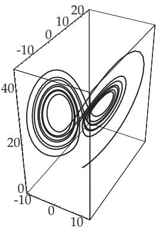

The Lorenz system (17.2), in the case of $\sigma = 1 0 , \ b = 8 / 3 , \ r =$ 28, has an attractor Λ (Lorenz attractor) with the numerically determined dimension $\dot { d _ { H } } ( \Lambda ) \approx 2 . 0 6$ (Fig. 17.17 is generated by Mathematica). With the Douady-Oesterl´e theorem, for arbitrary $b > 1 , \sigma > 0$ and $r > 0$ one gets the estimation

$$
d _ { H } ( \Lambda ) \leq 3 - { \frac { \sigma + b + 1 } { \kappa } } \quad { \mathrm { w h e r e } }\tag{17.54a}
$$

$$
\kappa = \frac { 1 } { 2 } \left[ \sigma + b + \sqrt { ( \sigma - b ) ^ { 2 } + \left( \frac { b } { \sqrt { b - 1 } } + 2 \right) \sigma r } \right] .\tag{17.54b}
$$

##### 17.2.4.4 Examples of Attractors

A: The horseshoe mapping $\varphi$ occurs in connection with Poincar´e mappings containing the transversal intersections of stable and unstable manifolds. The unit square $M = [ 0 , 1 ] \times [ 0 , 1 ]$ is stretched linearly in one coordinate direction and contracted in the other direction. Finally, this rectangle is bent at the middle

Figure 17.17  
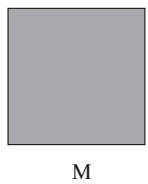

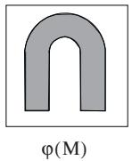  
Figure 17.18

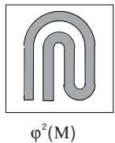

(Fig. 17.18). Repeating this procedure infinitely many times, a sequence of sets $M \supset \varphi ( M ) \supset \cdots$ is produced, for which

$$
\Lambda = \bigcap _ { k = 0 } ^ { \infty } \varphi ^ { k } ( M )\tag{17.55}
$$

is a compact set and an invariant set with respect to $\varphi .$ . Λ attracts all points of M. Apart from one point, Λ can be described locally as a product ${ \ddot { \cdot } } { \mathrm { l i n e } } \times { \mathrm { C a n t o r ~ s e t } } ^ { \prime }$

B: Let $\alpha \in ( 0 , 1 / 2 )$ be a parameter and $M = [ 0 , 1 ] \times [ 0 , 1 ]$ be the unit square. The mapping $\varphi \colon M $ M given by

$$
\varphi ( x , y ) = \left\{ \begin{array} { l l } { ( 2 x , \alpha y ) , \qquad \mathrm { i f ~ } 0 \leq x \leq \frac { 1 } { 2 } , y \in [ 0 , 1 ] , } \\ { ( 2 x - 1 , \alpha y + \displaystyle \frac { 1 } { 2 } , \mathrm { ~ i f ~ } \frac { 1 } { 2 } < x \leq 1 , y \in [ 0 , 1 ] } \end{array} \right.\tag{17.56a}
$$

⎩is called the dissipative baker’s mapping. Two iterations of the baker’s mapping are shown in Fig. 17.19.

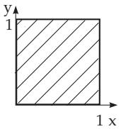

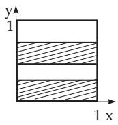  
Figure 17.19

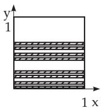

The “flaky pastry structure” is recognizable. The set

$$
\Lambda = \bigcap _ { k = 0 } ^ { \infty } \varphi ^ { k } ( M )\tag{17.56b}
$$

is invariant under $\varphi$ and all points from M are attracted by Λ. The value of the Hausdorf dimension is

$$
d _ { H } ( \Lambda ) = 1 + { \frac { \ln 2 } { - \ln \alpha } } .\tag{17.56c}
$$

For the dynamical system $\{ \varphi ^ { k } \}$ there exists an invariant measure $\mu$ on $M .$ , which is diferent from the Lebesgue measure. At the points where the derivative exists, the Jacobian matrix is $D \varphi ^ { k } ( ( x , y ) ) =$ $\left( \begin{array} { l l } { 2 ^ { k } } & { 0 } \\ { 0 } & { \alpha ^ { k } } \end{array} \right)$ . Hence, the singular values are $\sigma _ { 1 } ( k , ( x , y ) ) = 2 ^ { k } , \sigma _ { 2 } ( k , ( x , y ) ) = \alpha ^ { k }$ and, consequently,

c)

the Lyapunov exponents are $\lambda _ { 1 } =$ ln 2, $\lambda _ { 2 } =$ ln α (with respect to the invariant measure $\mu )$ . For the Lyapunov dimension

$$
d _ { L } ( \mu ) = 1 + \frac { \ln 2 } { - \ln \alpha } = d _ { H } ( \Lambda )\tag{17.56d}
$$

is obtained. Pesin’s formula (see 17.2.3,4., (17.40), p. 881) for the metric entropy is valid here, i.e.,

$$
h _ { \mu } = \sum _ { \lambda _ { i } > 0 } \lambda _ { i } = \ln 2 .\tag{17.56e}
$$

C: Let T be the whole torus with local coordinates $( \theta , x , y )$ , as is shown in Fig. 17.20a.

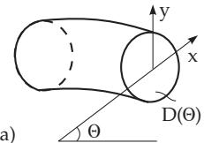  
a)

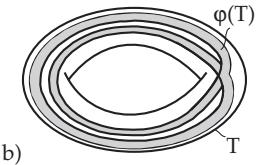

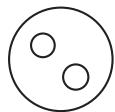

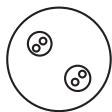  
Figure 17.20

Let a mapping $\varphi \colon T  T$ be defined by

$$
\theta _ { k + 1 } = 2 \theta _ { k } , \left( { x _ { k + 1 } ^ { x _ { k + 1 } } } \right) = \frac { 1 } { 2 } { \binom { \cos \theta _ { k } } { \sin \theta _ { k } } } + \alpha { \binom { x _ { k } } { y _ { k } } } \quad ( k = 0 , 1 , \ldots )\tag{17.57}
$$

with parameter $\alpha \in ( 0 , 1 / 2 )$ . The image $\varphi ( T )$ , with the intersections $\varphi ( T ) \cap D ( \theta )$ and $\varphi ^ { 2 } ( T ) \cap D ( \theta )$ is shown in Fig. 17.20b and Fig. 17.20c. The result of infinitely many intersections is the set $\Lambda =$ $\bigcap _ { k = 0 } ^ { \infty } \varphi ^ { k } ( T )$ , which is called a solenoid. The attractor Λ consists of a continuum of curves in the length direction, and each of them is dense in Λ, and unstable. The cross-section of the Λ transversal to these curves is a Cantor set.

The Hausdorf dimension is $d _ { H } ( \Lambda ) = 1 - \frac { \ln 2 } { \ln \alpha }$ . The set Λ has a neighborhood which is a domain of attraction. Furthermore, the attractor Λ is structurally stable, i.e., the qualitative properties formulated above do not change for $C ^ { 1 }$ -small perturbations of $\varphi .$

D: The solenoid is an example of a hyperbolic attractor.
