##### 17.3.1.1 Local Bifurcations in Neighborhoods of Steady States

1. Center Manifold Theorem

Consider a parameter-dependent diferential equation

$$
{ \dot { x } } = f ( x , \varepsilon ) \quad { \mathrm { o r } } \quad { \dot { x _ { i } } } = f _ { i } ( x _ { 1 } , \ldots , x _ { n } , \varepsilon _ { 1 } , \ldots , \varepsilon _ { l } ) \quad ( i = 1 , 2 , \ldots , n )\tag{17.67}
$$

with $f \colon M \times V  \mathbb { R } ^ { n }$ , where $M \subset \mathbb { R } ^ { n }$ and $V \subset \mathbb { R } ^ { l }$ are open sets and f is supposed to be r times continuously diferentiable. Equation $( 1 7 . 6 7 )$ can be interpreted as a parameter-free diferential equation $\dot { x } = f ( x , \varepsilon ) , \dot { \varepsilon } = 0$ in the phase space $M \times V$ . From the Picard-Lindel¨of theorem and the theorem on diferentiability with respect to the initial values (see 17.1.1.1, 2., p. 857) it follows that (17.67) has a locally unique solution $\varphi ( \cdot , p , \varepsilon )$ with initial point p at time $t = 0$ for arbitrary $p \in M$ and $\varepsilon \in V$ , which is r times continuously diferentiable with respect to $p$ and ε. Suppose all solutions exist on the whole of IR.

Furthermore, it is supposed that the system (17.67) has the equilibrium point $x = 0$ at $\varepsilon = 0$ , i.e., $f ( 0 , 0 ) = 0$ holds. Let $\lambda _ { 1 } , \ldots , \lambda _ { s }$ be the eigenvalues of $D _ { x } f ( 0 , 0 ) = \bigg [ \frac { \partial f _ { i } } { \partial x _ { j } } ( 0 , 0 ) \bigg ] _ { i , j = 1 } ^ { n }$ with $\mathrm { R e } \lambda _ { j } = 0$

Furthermore, suppose, $D _ { x } f ( 0 , 0 )$ has exactly m eigenvalues with negative real part and $k = n - s - m$ eigenvalues with positive real part.

According to the center manifold theorem for diferential equations (theorem of Shoshitaishvili, see [17.12]), the diferential equation (17.67), for ε with a suficiently small norm $\| \varepsilon \|$ in the neighborhood

of 0, is topologically equivalent to the system

$$
{ \dot { x } } = F ( x , \varepsilon ) \equiv A x + g ( x , \varepsilon ) , \quad { \dot { y } } = - y , \quad { \dot { z } } = z\tag{17.68}
$$

with $x \in \mathbb { R } ^ { s } , y \in \mathbb { R } ^ { m }$ and $z \in \mathbb { R } ^ { k }$ , where A is a matrix of type $( s , s )$ with eigenvalues $\lambda _ { 1 } , \ldots , \lambda _ { s }$ , and g represents a $C ^ { r } { \mathrm { - f u n c t i o n } }$ with $g ( 0 , 0 ) = 0$ and $D _ { x } g ( 0 , 0 ) = \mathrm { { 0 } }$

It follows from representation (17.68) that the bifurcations of (17.67) in a neighborhood of 0 are uniquely described by the diferential equation

$$
{ \dot { x } } = F ( x , \varepsilon ) .\tag{17.69}
$$

Equation (17.69) represents the reduced diferential equation to the local centermanifold $W _ { l o c } ^ { c } = \{ x , y , z \colon$ $y = 0 , z = 0 \}$ of (17.68). The reduced diferential equation (17.69) can often be transformed into a relatively simple form, e.g., with polynomials on the right-hand side, by a non-linear parameterdependent coordinate transformation so that the topological structure of its phase portrait does not change close to the considered equilibrium point. This form is a so-called normal form. A normal form cannot be determined uniquely; in general, a bifurcation can be described equivalently by diferent normal forms.

2. Saddle-Node Bifurcation and Transcritical Bifurcation

Suppose (17.67) is given with l = 1, where f is continuously diferentiable at least twice and $D _ { x } f ( 0 , 0 )$ has the eigenvalue $\bar { \lambda } _ { 1 } = 0$ and $n - 1$ eigenvalues $\lambda _ { j }$ with $\mathrm { R e } \lambda _ { j } \neq 0$ . According to the center manifold theorem, in this case, all bifurcations (17.67) near 0 are described by a one-dimensional reduced diferential equation (17.69). Obviously, here $F ( 0 , 0 ) = \frac { \partial F } { \partial x } ( 0 , 0 ) = 0$ . If, additionally, it is supposed that $\frac { \partial ^ { 2 } } { \partial x ^ { 2 } } F ( 0 , 0 ) \neq 0 , \frac { \partial F } { \partial \varepsilon } ( 0 , 0 ) \neq 0$ and the right-hand side of (17.69) is expanded according to the Taylor formula, then this representation can be transformed by coordinate transformation (see [17.6]) into the normal form

$$
{ \dot { x } } = \alpha + x ^ { 2 } + \cdot \cdot \cdot\tag{17.70}
$$

$\left( \mathrm { f o r } \frac { \partial ^ { 2 } F } { \partial x ^ { 2 } } ( 0 , 0 ) > 0 \right) \mathrm { o r } \dot { x } = \alpha - x ^ { 2 } + \cdots \left( \mathrm { f o r } \frac { \partial ^ { 2 } F } { \partial x ^ { 2 } } ( 0 , 0 ) < 0 \right)$ , where $\alpha = \alpha ( \varepsilon )$ is a diferentiable

function with $\alpha ( 0 ) = 0$ and the points indicate higher-order terms. For $\alpha < 0 , ( 1 7 . 7 0 )$ has two equilibrium points close to $x \ = \ 0$ , among which one is stable, the other is unstable. For $\alpha = 0$ , these equilibrium points fuse into $x = 0$ , which is unstable. For $\alpha > 0$ , (17.70) has no equilibrium point near to 0 (Fig. 17.21b).

The multidimensional case results in a saddle-node bifurcation in a neighborhood of 0 in (17.67). This bifurcation is represented in Fig. 17.22 for $n = 2$ and $\lambda _ { 1 } = 0 , \lambda _ { 2 } \ = \bar { < } \ 0$ . The representation of the saddle-node bifurcation in the extended phase space is shown in Fig. 17.21a. For suficiently smooth vector fields (17.67), the saddle-node bifurcations are generic.

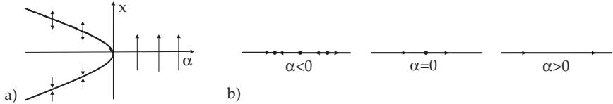  
Figure 17.21

If among the conditions which yield a saddle-node bifurcation for $F _ { ; }$ , the condition $\frac { \partial F } { \partial \varepsilon } ( 0 , 0 ) \neq 0$ is replaced by the conditions $\frac { \partial F } { \partial \varepsilon } ( 0 , 0 ) = 0 \mathrm { a n d } \frac { \partial ^ { 2 } F } { \partial x \partial \varepsilon } \left( 0 , 0 \right) \neq 0$ , then one gets from (17.69) the truncated normal form (without higher-order terms) $\dot { x } = \alpha x - x ^ { 2 }$ of a transcritical bifurcation. For $n = 2$ and $\lambda _ { 2 } ~ < ~ 0$ , the transcritical bifurcation together with the bifurcation diagram is shown in Fig. 17.23. Saddle-node and transcritical bifurcations have codimension 1-bifurcations.

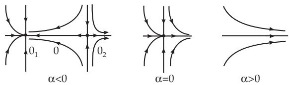  
Figure 17.22

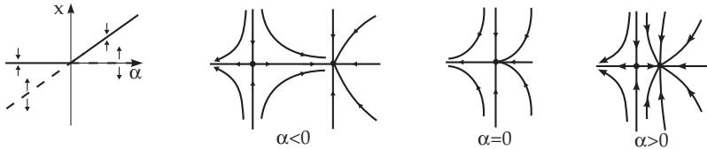  
Figure 17.23

3. Hopf Bifurcation

Consider (17.67) with $n \geq 2 , l = 1$ and $r \geq 4$ . Suppose that $f ( 0 , \varepsilon ) = 0$ is valid for all ε with $| \varepsilon | \leq \varepsilon _ { 0 }$ $( \varepsilon _ { 0 } > 0$ suficiently small). Suppose the Jacobian matrix $D _ { x } f ( 0 , 0 )$ has the eigenvalues $\lambda _ { 1 } = \overline { { \lambda _ { 2 } } } =$ iω with $\omega \neq 0$ and $n - 2$ eigenvalues $\lambda _ { j }$ with $\mathrm { R e } \lambda _ { j } \neq 0$ . According to the center manifold theorem, the bifurcation is described by a two-dimensional reduced diferential equation (17.69) of the form

$$
\dot { x } = \alpha ( \varepsilon ) x - \omega ( \varepsilon ) y + g _ { 1 } ( x , y , \varepsilon ) , \quad \dot { y } = \omega ( \varepsilon ) x + \alpha ( \varepsilon ) y + g _ { 2 } ( x , y , \varepsilon ) ,\tag{17.71}
$$

where $\alpha , \omega , g _ { 1 }$ and $g _ { 2 }$ are diferentiable functions and $\omega ( 0 ) = \omega$ and also $\alpha ( 0 ) = 0$ hold. By a non-linear complex coordinate transformation and by the introduction of polar coordinates $( r , \vartheta )$ , (17.71) can be written in the normal form

$$
\dot { r } = \alpha ( \varepsilon ) r + a ( \varepsilon ) r ^ { 3 } + \cdots , \quad \dot { \vartheta } = \omega ( \varepsilon ) + b ( \varepsilon ) r ^ { 2 } + \cdot \cdot \cdot\tag{17.72}
$$

where dots denote the terms of higher order. The Taylor expansion of the coeficient functions of (17.72) yields the truncated normal form

$$
\dot { r } = \alpha ^ { \prime } ( 0 ) \varepsilon r + a ( 0 ) r ^ { 3 } , \quad \dot { \vartheta } = \omega ( 0 ) + \omega ^ { \prime } ( 0 ) \varepsilon + b ( 0 ) r ^ { 2 } .\tag{17.73}
$$

The theorem of Andronov and Hopf guarantees that (17.73) describes the bifurcations of (17.72) in a neighborhood of the equilibrium point for $\varepsilon = 0$

The following cases occur for (17.73) under the assumption $\alpha ^ { \prime } ( 0 ) > 0 ;$

1. $a ( 0 ) < 0$ (Fig. 17.24a). :

2. $a ( 0 ) > 0$ (Fig. 17.24b) :

a) $\varepsilon > 0$ : Stable limit cycle and unstable equilibrium point.

$\varepsilon < 0$ : Unstable limit cycle.

b) $\varepsilon = 0$ : Cycle and equilibrium point fuse into a stable equilibrium point.

b) $\varepsilon = 0$ : Cycle and equilibrium point fuse into an unstable equilibrium point.

c) $\varepsilon < 0$ : All orbits close to (0, 0) tend as in b) for $t \to + \infty$ spirally to the equilibrium point (0, 0).

$c ) \varepsilon > 0$ : Spiral type unstable equilibrium point as in b).

The interpretation of the above cases for the initial system (17.67) shows the bifurcation of a limit cycle of a compound equilibrium point (compound focus point ofmultiplicity 1), which is called a Hopfbifurcation (or Andronov-Hopfbifurcation). The case $a ( 0 ) < 0$ is also called supercritical, the case $a ( 0 ) > 0$ subcritical (supposing that $\alpha ^ { \prime } ( 0 ) > 0 )$ . The case $n = 3 , \lambda _ { 1 } = \overline { { { \lambda _ { 2 } } } } = \mathrm { i } , \lambda _ { 3 } < 0 , \alpha ^ { \prime } ( 0 ) > 0$ and $a ( 0 ) < 0$ is shown in Fig. 17.25.

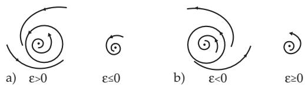  
Figure 17.24

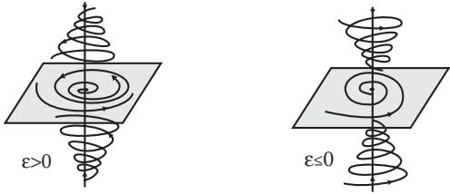  
Figure 17.25

Hopf bifurcations are generic and have codimension 1. The cases above illustrate the fact that a supercritical Hopf bifurcation under the above assumptions can be recognized by the stability of a focus:

Suppose the eigenvalues $\lambda _ { 1 } ( \varepsilon )$ and $\lambda _ { 2 } ( \varepsilon )$ of the Jacobian matrix on the right-hand side of (17.67) at 0 are pure imaginary for $\varepsilon = 0$ , and for the other eigenvalues $\lambda _ { j } \operatorname { R e } \lambda _ { j } \neq 0$ holds. Suppose furthermore that $\frac { d } { d \varepsilon } \operatorname { R e } \lambda _ { 1 } ( \varepsilon ) _ { \mid \varepsilon = 0 } > 0$ and let 0 be an asymptotically stable focus for (17.67) at $\varepsilon = 0$ . Then there is a supercritical Hopf bifurcation in (17.67) at $\varepsilon = 0$

The van der Pol diferential equation $\begin{array} { r } { \ddot { x } + \varepsilon ( x ^ { 2 } - 1 ) \dot { x } + x = 0 } \end{array}$ with parameter ε can be written as a planar diferential equation

$$
\dot { x } = y , \quad \dot { y } = - \varepsilon ( x ^ { 2 } - 1 ) y - x .\tag{17.74}
$$

For $\varepsilon = 0 , ( 1 7 . 7 4 )$ becomes the harmonic oscillator equation and it has only periodic solutions and an equilibrium point, which is stable but not asymptotically stable. With the transformation $u \ =$ $\sqrt { \varepsilon } x , v = \sqrt { \varepsilon } y$ for ε > 0 (17.74) is transformed into the planar diferential equation

$$
\dot { u } = v , \quad \dot { v } = - u - ( u ^ { 2 } - \varepsilon ) v .\tag{17.75}
$$

For the eigenvalues of the Jacobian matrix at the equilibrium point (0, 0) of (17.75):

$$
\lambda _ { 1 , 2 } ( \varepsilon ) = \frac { \varepsilon } { 2 } \pm \sqrt { \frac { \varepsilon ^ { 2 } } { 4 } - 1 } \mathrm { a n d } \mathrm { s o } \lambda _ { 1 , 2 } ( 0 ) = \pm \mathrm { i } \mathrm { a n d } \frac { d } { d \varepsilon } \mathrm { R e } \lambda _ { 1 } ( \varepsilon ) _ { | \varepsilon = 0 } = \frac { 1 } { 2 } > 0 .
$$

As shown in the example of $1 7 . 1 . 2 . 3 , 1 . , \mathrm { { p . 8 6 3 , ( 0 , 0 ) } }$ is an asymptotically stable equilibrium point of (17.75) for $\varepsilon = 0$ . There is a supercritical Hopf bifurcation for $\varepsilon = 0$ , and for small $\varepsilon > 0 , ( 0 , 0 )$ is an unstable focus surrounded by a limit cycle whose amplitude is increasing as ε increases.

4. Bifurcations in Two-Parameter Diferential Equations

1. Cusp Bifurcation Suppose the diferential equation (17.67) is given with $r \geq 4$ and $l = 2$ . Let the Jacobian matrix $D _ { x } f ( 0 , \bar { 0 } )$ have the eigenvalue $\bar { \lambda _ { 1 } } = 0$ and $n - 1$ eigenvalues $\lambda _ { j }$ with $\mathrm { R e } \lambda _ { j } \neq 0$ and suppose that for the reduced diferential equation (17.69) $F ( 0 , 0 ) = \frac { \partial F } { \partial x } ( 0 , 0 ) = \frac { \partial ^ { 2 } F } { \partial x ^ { 2 } } ( 0 , 0 ) = 0$ und

$l _ { 3 } : = { \frac { \partial ^ { 3 } F } { \partial x ^ { 3 } } } ( 0 , 0 ) \neq 0$ . Then the Taylor expansion of F close to (0, 0) leads to the truncated normal form (without higher-order terms see, [17.1])

$$
\dot { x } = \alpha _ { 1 } + \alpha _ { 2 } x + \mathrm { s i g n } l _ { 3 } x ^ { 3 }\tag{17.76}
$$

with the parameters $\alpha _ { 1 }$ and $\alpha _ { 2 }$ . The set $\left\{ \left( \alpha _ { 1 } , \alpha _ { 2 } , x \right) : \alpha _ { 1 } + \alpha _ { 2 } x + \mathrm { s i g n } l _ { 3 } x ^ { 3 } = 0 \right\}$ represents a surface in extended phase space and this surface is called a cusp (Fig. 17.26a).

In the following, it is supposed $l _ { 3 } < 0$ . The non-hyperbolic equilibrium points of (17.76) are defined by the system $\bar { \alpha } _ { 1 } + \alpha _ { 2 } x - x ^ { 3 } = 0 , \alpha _ { 2 } - 3 x ^ { 2 } = 0$ and thus they lie on the curves $S _ { 1 }$ and $S _ { 2 }$ , which are determined by the set $\left\{ ( \alpha _ { 1 } , \alpha _ { 2 } ) \colon 2 7 \alpha _ { 1 } ^ { 2 } - 4 \alpha _ { 2 } ^ { 3 } = 0 \right\}$ and form a cusp (Fig. 17.26b). If $( \alpha _ { 1 } , \alpha _ { 2 } ) = ( 0 , 0 )$ then the equilibrium point 0 of $( 1 7 . 7 6 )$ is stable. The phase portrait of (17.67) in a neighborhood of 0, e.g., for $n \overset { ^ { \prime } } { = } 2 , l _ { 3 } < 0$ and $\lambda _ { 1 } = \overset { \cdot } { 0 }$ is shown in Fig. 17.26c for $\lambda _ { 2 } < 0 ( t r i p l e n o d e )$ and in Fig. 17.26d for $\lambda _ { 2 } > 0$ (triple saddle) (see [17.6]).

At transition from $( \alpha _ { 1 } , \alpha _ { 2 } ) = ( 0 , 0 )$ into the interior of domain 1 (Fig. 17.26b) the compound nodetype non-hyperbolic equilibrium point 0 of (17.67) splits into three hyperbolic equilibrium points (two stable nodes and a saddle) (supercritical pitchfork bifurcation).

In the case of the two-dimensional phase space of (17.67) the phase portraits are shown in Fig. 17.26c,e. When the parameter pair of $S _ { i } \setminus \left\{ ( 0 , 0 ) \right\} \quad ( i = 1 , 2 )$ traverse from 1 into 2 then a double saddle nodetype equilibrium point is formed which finally vanishes. A stable hyperbolic equilibrium point remains.

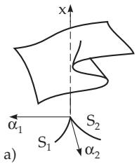

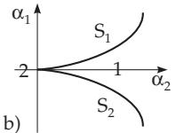

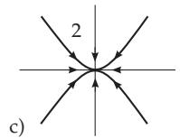

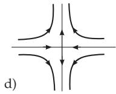

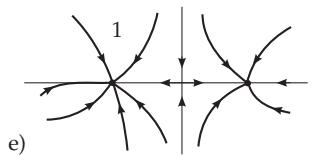  
Figure 17.26

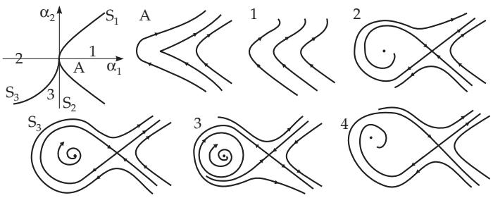  
Figure 17.27

2. Bogdanov-Takens Bifurcation Suppose, for $( 1 7 . 6 7 ) , n \geq 2 , l = 2 , r \geq 2$ hold and the matrix $D _ { x } f ( 0 , \bar { 0 } )$ has two eigenvalues $\lambda _ { 1 } = \lambda _ { 2 } = 0$ and n 2 eigenvalues $\lambda _ { j }$ with $\mathrm { R e } \lambda _ { j } \neq 0$ . Let the reduced two-dimensional diferential equation (17.69) be topologically equivalent to the planar system

$$
{ \dot { x } } = y , \quad { \dot { y } } = \alpha _ { 1 } + \alpha _ { 2 } x + x ^ { 2 } - x y .\tag{17.77}
$$

Then there is a saddle-node bifurcation on the curve $S _ { 1 } = \{ ( \alpha _ { 1 } , \alpha _ { 2 } ) \colon \alpha _ { 2 } ^ { 2 } - 4 \alpha _ { 1 } = 0 \}$ . At the transition on the curve $S _ { 2 } = \{ ( \alpha _ { 1 } , \alpha _ { 2 } ) \colon \alpha _ { 1 } = 0 , \alpha _ { 2 } < 0 \}$ from the domain $\alpha _ { 1 } < 0$ into the domain $\alpha _ { 1 } > 0$ a stable limit cycle arises by a Hopf bifurcation and on the curve $S _ { 3 } = \{ ( \alpha _ { 1 } , \alpha _ { 2 } ) \colon \alpha _ { 1 } = - k \alpha _ { 2 } ^ { 2 } + \cdot \cdot \cdot \} \ ( k > 0$ constant) there exists a separatrix loop for the original system (Fig. 17.27), which bifurcates into a stable limit cycle in domain 3 (see [17.6], [17.9]).

This bifurcation is of a global nature and one says that a single periodic orbit arises from the homoclinic orbit ofa saddle or a separatrix loop vanishes.

3. Generalized Hopf Bifurcation Suppose that the assumptions of the Hopf bifurcation with $r \geq 6$ are fulfilled for (17.67), and the two-dimensional reduced diferential equation after a coordinate transformation into polar coordinates has the normal form $\dot { r } = \varepsilon _ { 1 } r + \varepsilon _ { 2 } r ^ { 3 } - r ^ { 5 } + \cdot \cdot \cdot , \dot { \vartheta } = 1 + \cdot \cdot \cdot$ . The bifurcation diagram (Fig. 17.28) of this system contains the line $S _ { 1 } = \{ ( \varepsilon _ { 1 } , \varepsilon _ { 2 } ) \colon \varepsilon _ { 1 } = 0 , \varepsilon _ { 2 } \neq 0 \}$ , whose points represent a Hopf bifurcation (see [17.4], [17.6]). There exist two periodic orbits in domain $3 ,$ among which one is stable, the other one is unstable. On the curve $S _ { 2 } = \{ ( \varepsilon _ { 1 } , \varepsilon _ { 2 } ) \colon \varepsilon _ { 2 } ^ { 2 } + 4 \varepsilon _ { 2 } > 0 , \varepsilon _ { 1 } < 0 \}$ these non-hyperbolic cycles fuse into a compound cycle which disappears in domain 2.

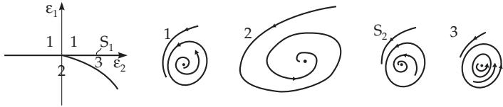  
Figure 17.28

5. Breaking Symmetry

Some diferential equations (17.67) have symmetries in the following sense: There exists a linear transformation $T$ (or a group of transformations) such that $f ( T x , \varepsilon ) = \smile f \left( x , \varepsilon \right)$ holds for all $x \in M$ and $\varepsilon \in V$ . An orbit $\gamma$ of (17.67) is called symmetric with respect to $T \operatorname { i f } T \gamma = \gamma .$

One talks about a symmetry breaking bifurcation at $\varepsilon = 0 , \mathrm { e . g . }$ , in (17.67) (for l = 1), if there is a stable equilibrium point or a stable limit cycle for $\varepsilon < 0$ , which is always symmetric with respect to $T ,$ and for $\varepsilon = 0$ two further stable steady states or limit cycles arise, which are no-longer symmetric with respect to $T$

For system (17.67) with $f ( x , \varepsilon ) = \varepsilon x - x ^ { 3 }$ the transformation $T$ defined as $T \colon x \mapsto - x$ is a symmetry, since $f ( - x , \varepsilon ) = - \dot { f } ( x , \varepsilon ) \ ( \dot { x } \in \mathbb { R } , \varepsilon \in \mathbb { R } )$ . For $\varepsilon < 0$ the point $x _ { 1 } = 0$ is a stable equilibrium point. For $\varepsilon > 0$ , besides $x _ { 1 } = 0$ , there exist the two other equilibrium points $x _ { 2 , 3 } = \pm \sqrt { \varepsilon } ;$ ; both are nonsymmetric.
