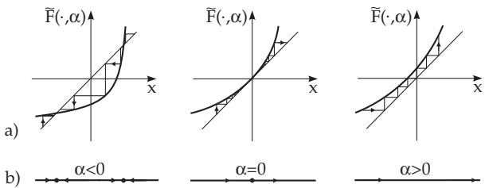
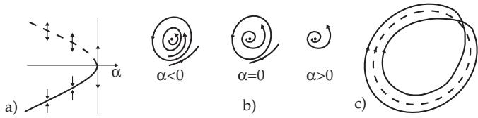
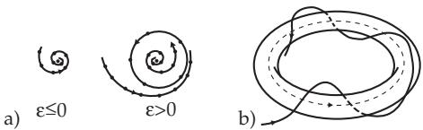

##### 17.3.1.2 Local Bifurcations in a Neighborhood of a Periodic Orbit

1. Center Manifold Theorem for Mappings

Let $\gamma$ be periodic orbit of (17.67) for $\varepsilon = 0$ with multipliers $\rho _ { 1 } , . . . , \rho _ { n - 1 } , \rho _ { n } = 1$ . A bifurcation close to $\gamma$ is possible, if when changing ε, at least one of the multipliers lies on the complex unit circle. The use of a surface transversal to $\gamma$ leads to the parameter-dependent Poincar´e mapping

$$
x \longmapsto P ( x , \varepsilon ) .\tag{17.78}
$$

Then, with open sets $E \subset \mathbb { R } ^ { n - 1 }$ and $V \subset \mathbb { R } ^ { l }$ let P: $E \times V \to \mathbb { R } ^ { n - 1 }$ be a $C ^ { r } .$ -mapping where the mapping ${ \tilde { P } } \colon E \times V \to \mathbb { R } ^ { n - 1 } \times \mathbb { R } ^ { l }$ with $\tilde { P } ( x , \varepsilon ) = ( P ( x , \varepsilon ) , \varepsilon )$ should be a $C ^ { r } { \mathrm { - d i f f e o m o r p h i s m } }$ . Furthermore, let $P ( 0 , 0 ) = 0$ and suppose the Jacobian matrix $D _ { x } P ( 0 , 0 )$ has s eigenvalues $\rho _ { 1 } , \ldots , \rho _ { s }$ with $| \rho _ { i } | = 1$ m eigenvalues $\rho _ { s + 1 } , . . . , \rho _ { s + m }$ with $| \rho _ { i } | < 1$ and $k = n - s - m - 1$ eigenvalues $\rho _ { s + m + 1 } , \ldots , \rho _ { n - 1 }$ with $| \rho _ { i } | > 1$ . Then, according to the the center manifold theorem for mappings (see [17.4]), close to $( 0 , 0 ) \in E \times V$ , the mapping $\tilde { P }$ is topologically conjugate to the mapping

$$
( x , y , z , \varepsilon ) \longmapsto ( F ( x , \varepsilon ) , A ^ { s } y , A ^ { u } z , \varepsilon )\tag{17.79}
$$

near $( 0 , 0 ) \in \mathbb { R } ^ { n - 1 } \times \mathbb { R } ^ { l }$ with $F ( x , \varepsilon ) = A ^ { c } x + g ( x , \varepsilon )$ . Here g is a $C ^ { r } .$ -diferentiable mapping satisfying the relations $g ( 0 , 0 ) = 0$ and $\begin{array} { r } { D _ { x } \ ' g ( 0 , 0 ) = 0 } \end{array}$ . The matrices $A ^ { c } , A ^ { s }$ and $A ^ { u }$ are of type $( \bar { s } , \bar { s } ) , \bar { ( } m , m )$ and (k, k), respectively.

It follows from (17.79) that bifurcations of (17.78) close to (0, 0) are described only by the reduced mapping

$$
x \longmapsto F ( x , \varepsilon )\tag{17.80}
$$

on the local center manifold $W _ { l o c } ^ { c } = \{ ( x , y , z ) \colon y = 0 , \ z = 0 \}$

  
Figure 17.29

2. Bifurcation of Double Semistable Periodic Orbits

Let the system (17.67) be given with $n \geq 2 , r \geq 3$ and l = 1. Suppose, at $\varepsilon = 0$ , the system (17.67) has periodic orbit γ with multipliers $\rho _ { 1 } = + 1 , | \rho _ { i } | \neq 1 ( i = 2 , 3 , \ldots , n - 1 )$ and $\rho _ { n } = 1$ . According to the center manifold theorem for mappings, the bifurcations of the Poincar´e mapping (17.78) are described

by the one-dimensional reduced mapping (17.80) with $A ^ { c } = 1$ . If $\frac { \partial ^ { 2 } F } { \partial x ^ { 2 } } \left( 0 , 0 \right) \neq 0$ and $\frac { \partial F } { \partial \varepsilon } \left( 0 , 0 \right) \neq 0$ is supposed, then it leads to the normal forms

$$
x \longmapsto { \tilde { F } } ( x , \alpha ) = \alpha + x + x ^ { 2 } \quad \left( \operatorname { f o r } { \frac { \partial ^ { 2 } F } { \partial x ^ { 2 } } } ( 0 , 0 ) > 0 \right) \quad { \mathrm { o r } }\tag{17.81a}
$$

$$
x \longmapsto \alpha + x - x ^ { 2 } \quad \left( \operatorname { f o r } { \frac { \partial ^ { 2 } F } { \partial x ^ { 2 } } } ( 0 , 0 ) < 0 \right) .\tag{17.81b}
$$

The iterations from (17.81a) close to 0 and the corresponding phase portraits are represented in Fig. 17.29a and in Fig. 17.29b for diferent $\alpha ~ ( \mathrm { s e e } ~ [ 1 \AA \AA ^ { 7 } . 6 ] )$ Close to $x = 0$ there are for $\alpha < 0$ a stable and an unstable equilibrium point, which fuse for $\alpha = 0$ into the unstable steady state $x = 0$ For $\alpha > 0$ there exists no equilibrium point close to $x = 0$ . The bifurcation described by (17.81a) in (17.80) is called a subcritical saddle node bifurcation for mappings.

In the case of the diferential equation (17.67), the properties of the mapping (17.81a) describe the bifurcation ofa double semistable periodic orbit: For $\alpha < 0$ there exists a stable periodic orbit $\gamma _ { 1 }$ and an unstable periodic orbit $\gamma _ { 2 }$ , which fuse for $\alpha = 0$ into a semistable orbit $\gamma _ { ; }$ , which disappears for $\alpha > 0$ (Fig. 17.30a,b).

3. Period Doubling or Flip Bifurcation

Let system (17.67) be given with $n \geq 2 , r \geq 4$ and $l = 1$ . Considered is a periodic orbit $\gamma$ of (17.67) at $\varepsilon = 0$ with the multipliers $\rho _ { 1 } = - 1 , \ | \rho _ { i } | \neq 1 \ ( i = 2 , \ldots , n - 1 )$ , and $\rho _ { n } = 1$ . The bifurcation behavior

  
Figure 17.30

of the Poincar´e mapping in the neighborhood of 0 is described by the one-dimensional mapping (17.80) with $A ^ { c } = - 1$ , if supposing the normal form

$$
x \longmapsto { \tilde { F } } ( x , \alpha ) = ( - 1 + \alpha ) x + x ^ { 3 } .\tag{17.82}
$$

The steady state $x = 0$ of (17.82) is stable for small $\alpha \geq 0$ and unstable for $\alpha < 0$ . The second iterated mapping ${ \tilde { F } } ^ { 2 }$ has for $\alpha < 0$ two further stable fixed points besides $x = 0$ for $x _ { 1 , 2 } = \pm \sqrt { - \alpha } + o ( | \alpha | )$ ， which are not fixed points of $\tilde { F }$ . Consequently, they must be points of period 2 of (17.82).

In general, for a $C ^ { 4 } .$ -mapping (17.80) there is a two-periodic orbit at $\varepsilon = 0$ , if the following conditions are fulfilled (see [17.2]):

$$
\begin{array} { l l l } { { F ( 0 , 0 ) = 0 , } } & { { \displaystyle { \frac { \partial F } { \partial x } ( 0 , 0 ) = - 1 , } } } & { { \displaystyle { \frac { \partial F ^ { 2 } } { \partial \varepsilon } ( 0 , 0 ) } = 0 , } } \\ { { \displaystyle { \frac { \partial ^ { 2 } F ^ { 2 } } { \partial x \partial \varepsilon } ( 0 , 0 ) \neq 0 , } } } & { { \displaystyle { \frac { \partial ^ { 2 } F ^ { 2 } } { \partial x ^ { 2 } } ( 0 , 0 ) = 0 , } } } & { { \displaystyle { \frac { \partial ^ { 3 } F ^ { 2 } } { \partial x ^ { 3 } } ( 0 , 0 ) \neq 0 . } } } \end{array}\tag{17.83}
$$

Since $\frac { \partial F ^ { 2 } } { \partial x } ( 0 , 0 ) = + 1$ holds (because of $\frac { \partial F } { \partial x } ( 0 , 0 ) = - 1 )$ , the conditions for a pitchfork bifurcation are formulated for the mapping $F ^ { 2 }$

For the diferential equation (17.67) the properties of the mapping (17.82) imply that at $\alpha = 0$ a stable periodic orbit $\gamma _ { \alpha }$ splits from γ with approximately a double period (period doubling), where γ loses its stability (Fig. 17.30c).

The logistic mapping $\varphi _ { \alpha } \colon [ 0 , 1 ] \to [ 0 , 1 ]$ is given for $0 < \alpha \leq 4$ by $\varphi _ { \alpha } ( x ) = \alpha x ( 1 - x )$ , i.e., by the discrete dynamical system

$$
x _ { t + 1 } = \alpha x _ { t } ( 1 - x _ { t } ) .\tag{17.84}
$$

The mapping has the following bifurcation behavior (see [17.10]): For $0 < \alpha \leq 1$ system (17.84) has the equilibrium point 0 with domain of attraction [0, 1]. For 1 < α < 3, (17.84) has the unstable equilibrium point 0 and the stable equilibrium point $1 - 1 / \alpha$ , where this last one has the domain of attraction (0, 1). For $\alpha _ { 1 } = 3$ the equilibrium point $1 - 1 / \alpha$ is unstable and leads to a stable two-periodic orbit.

At the value $\alpha _ { 2 } = 1 + \sqrt { 6 }$ , the two-periodic orbit is also unstable and leads to a stable $2 ^ { 2 } .$ -periodic orbit. The period doubling continues, and stable $2 ^ { q _ { - } }$ periodic orbits arise at $\alpha = \alpha _ { q } .$ . Numerical evidence shows that $\alpha _ { q } \to \alpha _ { \infty } \approx 3 . 5 7 0 \dots \mathrm { a s } q \to + \infty$

For $\alpha = \alpha _ { \infty } ,$ there is an attractor $F$ (the Feigenbaum attractor), which has a structure similar to the Cantor set. There are points arbitrarily close to the attractor which are not iterated towards the attractor, but towards an unstable periodic orbit. The attractor F has dense orbits and the Hausdorf dimension is $d _ { H } ( F ) \approx 0 . 5 3 8 \dots { \mathrm { ~ \bar { C } } }$ n the other hand, the dependence on initial conditions is not sensitive. In the domain $\alpha _ { \infty } < \alpha < 4$ , there exists a parameter set A with positive Lebesgue measure such that system (17.84) has a chaotic attractor of positive Lebesgue measure for $\alpha \in A$ . The set A is interspersed with windows in which period doublings occur.

The bifurcation behavior of the logistic mapping can also be found in a class of unimodal mappings, i.e., of mappings of the interval I into itself, which has a single maximum in I. Although the parameter values $\alpha _ { i } .$ for which period doubling occurs, are diferent from each other for diferent unimodal mappings, the rate of convergence by which these parameters tend to $\alpha _ { \infty } .$ , is equal: $\alpha _ { k } - \alpha _ { \infty } \approx C \delta ^ { - k }$ where $\delta = 4 . 6 6 9 2 . .$ . is the Feigenbaum constant (C depends on the concrete mapping). The Hausdorf dimension is the same for all attractors $F$ at $\alpha = \alpha _ { \infty } \colon d _ { H } ( F ) \approx 0 . 5 3 8$

4. Creation of a Torus

Consider system (17.67) with $n \geq 3 , r \geq 6$ and $l = 1$ . Suppose that for all ε close to 0 system (17.67) has a periodic orbit $\gamma _ { \varepsilon }$ . Let the multipliers of $\gamma _ { 0 }$ be $\rho _ { 1 , 2 } = e ^ { \pm i \Psi }$ with $\psi \not \in \Big \{ 0 , \frac { \pi } { 2 } , \frac { 2 \pi } { 3 } , \pi \Big \} , \rho _ { j } \big ( j = 3 , \ldots , n - 1 \big )$ with $| \rho _ { j } | \neq 1$ and $\rho _ { n } = 1$

According to the center manifold theorem, in this case there exists a two-dimensional reduced $C ^ { 6 _ { - } }$ mapping

$$
x \longmapsto F ( x , \varepsilon )\tag{17.85}
$$

with $F ( 0 , \varepsilon ) = 0$ for ε close to 0.

If the Jacobian matrix $D _ { x } F ( 0 , \varepsilon )$ has the conjugate complex eigenvalues $\rho ( \varepsilon )$ and $\overline { { \rho } } ( \varepsilon )$ with $| \rho ( 0 ) | = 1$ for all ε near 0, if d $: = \ \frac { d } { d \varepsilon } \left| \rho ( \varepsilon ) \right| _ { \scriptstyle | \varepsilon = 0 } > 0$ holds and $\rho ( 0 )$ is not a q-th root of 1 for $q \ = \ 1 , 2 , 3 , 4$ then (17.85) can be transformed by a smooth ε dependent coordinate transformation into the form $x \mapsto \tilde { F } ( x , \varepsilon ) = \tilde { F } _ { o } ( x , \varepsilon ) + O ( \| x \| ^ { 5 } )$ (O Landau symbol), where $\tilde { F } _ { o }$ is given in polar coordinates by

$$
{ \binom { r } { \vartheta } } \longmapsto { \binom { | \rho ( \varepsilon ) | r + a ( \varepsilon ) r ^ { 3 } } { \vartheta + \omega ( \varepsilon ) + b ( \varepsilon ) r ^ { 2 } } } .\tag{17.86}
$$

Here $\alpha , \omega$ and b are diferentiable functions. Suppose $a ( 0 ) < 0$ holds. Then, the equilibrium point $r = 0$ of (17.86) is asymptotically stable for all $\varepsilon < 0$ and unstable for $\varepsilon > 0$ . Furthermore, for $\varepsilon > 0$ there exists the circle $r = \sqrt { - \frac { d \varepsilon } { a ( 0 ) } }$ , which is invariant under the mapping (17.86) and asymptotically stable (Fig. 17.31a).

  
Figure 17.31

The Neimark-Sacker Theorem (see [17.10], [17.1]) states that the bifurcation behavior of (17.86) is similar to that of $\tilde { F }$ (supercritical Hopfbifurcation for mappings).

In mapping (17.85), given by

$$
{ \binom { x } { y } } \longmapsto { \frac { 1 } { \sqrt { 2 } } } { \binom { ( 1 + \varepsilon ) x + y + x ^ { 2 } - 2 y ^ { 2 } } { - x + ( 1 + \varepsilon ) y + x ^ { 2 } - x ^ { 3 } } } ,
$$

there is a supercritical Hopf bifurcation at $\varepsilon = 0$

With respect to the diferential equation (17.67), the existence of a closed invariant curve of mapping (17.85) means that the periodic orbit γ is unstable for $a ( 0 ) < 0$ and for $\varepsilon > 0$ a torus arises which is invariant with respect to (17.67) (Fig. 17.31b).
