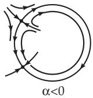
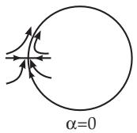
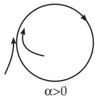
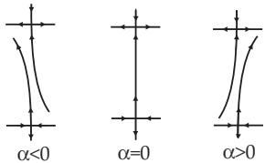

##### 17.3.1.3 Global Bifurcation

Besides the periodic creation orbit which arises if a separatrix loop disappears, (17.67) can have further global bifurcations. Two of them are shown in [17.12] by examples.

1. Emergence of a Periodic Orbit due to the Disappearance of a Saddle-Node The parameter-dependent system

$$
\dot { x } = x ( 1 - x ^ { 2 } - y ^ { 2 } ) + y ( 1 + x + \alpha ) , \dot { y } = - x ( 1 + x + \alpha ) + y ( 1 - x ^ { 2 } - y ^ { 2 } )
$$

has in polar coordinates $x = r$ cos ϑ, $y = r$ sin ϑ the following form:

$$
\dot { r } = r ( 1 - r ^ { 2 } ) , \dot { \vartheta } = - ( 1 + \alpha + r \cos \vartheta ) .\tag{17.87}
$$

Obviously, the circle $r = 1$ is invariant under (17.87) for an arbitrary parameter α, and all orbits (except the equilibrium point $( 0 , 0 ) )$ tend to this circle for $t \to + \infty$ . For $\alpha < 0$ there are a saddle and a stable node on the circle, which fuse into a compound saddle-node type equilibrium point at $\alpha = 0$ . For $\alpha > 0$ there is no equilibrium point on the circle, which is a periodic orbit (Fig. 17.32).

  
Figure 17.32

2. Disappearance of a Saddle-Saddle Separatrix in the Plane

Consider the parameter-dependent planar diferential equation

$$
\dot { x } = \alpha + 2 x y , ~ \dot { y } = 1 + x ^ { 2 } - y ^ { 2 } .\tag{17.88}
$$

For $\alpha = 0$ , equation (17.88) has the two saddles (0, 1) and $( 0 , - 1 )$ and the y-axis as invariant sets. The heteroclinic orbit is part of this invariant set. For small $| { \boldsymbol { \alpha } } | \neq 0$ , the saddle-points are retained while the heteroclinic orbit disappears (Fig. 17.33).

  
Figure 17.33
